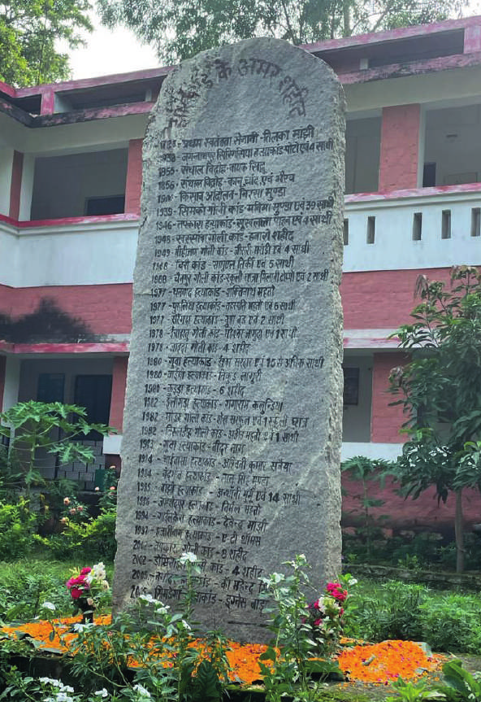

# Foreword

## A flame that burns bright

It was an unexpected honour to be asked to write the foreword for
Stan's memoirs. Stan Swamy is one of the treasures of this country
and one of my personal heroes.

It is because of people like him who, even in his 80's, have not lost
hope --- despite multiple betrayals of his dreams --- that people still
believe in the Constitution. A tall thin man with a spine of steel,
there is something both wise and childlike about Stan, and this is
reflected in these essays. Above all, what the essays reveal, is Stan's
enormous compassion and courage, and the way he lives his faith.

Some years ago, Stan set up a research and training centre in
Namkum on the outskirts of Ranchi called _Bagaicha_. As you come
in you see a big stone slab in the centre, on which is inscribed
all the struggles that have taken place in Jharkhand for over two
hundred years. This _Pathalgadi_ (or stone slab inscription) predates
the _Pathalgadi_ movement that Stan writes about, but it shows Stan's
deep investment in his adopted home, Jharkhand. As he writes in
the last essay of this volume, there is a tradition among _adivasis_,
that when someone departs the earth, she or he is invited back to
dwell in the house and be a companion to the still living. In life or
death, Stan is a companion and guide to the people in Jharkhand
and beyond, a flag bearer for justice wherever he is.

Ever since the Jesuits arrived in India in 1542, they have culturally
adapted their faith to the land, and provided invaluable service,
especially in the field of education. But even among this selfless
mission, there were some who ventured further afield and practiced
their faith by serving people, especially the most marginal. But this
is done through meticulous research and documentation, not in a
superficial manner. The story of how Stan and his comrades at the
Indian Social Institute Training Centre in Bangalore summarized
and circulated Paolo Freire's _Pedagogy of the Oppressed_, tried to
ensure that land was given to the tiller, and reached out to a wide
variety of social movements, even in the face of opposition from
powerful elements in the Church --- is a testimony to the power of
his faith. The Jesuits have been a major source of education for
democracy in India, and India owes a great deal to them.

Why is the Indian state so petrified of an 80-year old Jesuit called
Stan Swamy --- so much that they sent police, twice, all the way from
Pune to raid his room and confiscate his bare belongings? First,
the central BJP government, acting with the Pune police, tried to
implicate him in the Bhima-Koregaon case which, is clear to any
thinking person, is a trumped-up effort to silence a well-known
human rights activist. In 2018, the BJP government in Jharkhand,
filed an FIR against Stan and others for a Facebook post. A year
and a half later, they tried to arrest him, and also claimed that he
was absconding, when of course he was doing no such thing.

The government is scared because Stan has courage and is not
scared to raise his voice against injustice wherever he sees it in
any form. And, of all the issues that has affected _Adivasi_ India
in the last decade or so, it is the 'mass jailing of people', allegedly
for supporting _Maoists_. As Stan points out, when an entire young
generation is in jail, the impact on society is devastating. Stan, with
his colleagues, conducted meticulous and innovative research,
where they met 102 under trials in their homes, and found
that 97% of those arrested, had zero connection with the
_Maoists_. In January 2018, a PIL filed by Stan on this issue was
admitted in the Jharkhand High Court, with the Court ordering the
government to furnish information on the undertrials.

It is, indeed, too much of a co-incidence that soon after his PIL,
the state has gone after Stan with a vengeance. Where is the level
playing field that the law promises?

Stan writes movingly of dispossession, due to large projects and
the struggles that people have waged to resist this; he writes of
migration and the losses to individuals and communities; he bears
witness to the sufferings and resilience of the people, of whom
he has now, become a part. This collection of short essays ---
autobiographical fragment, memory and reflection --- is a gift from
Stan to all of us.

\ 

Dr. Nandini Sundar

\

Professor of Sociology

\

Delhi University
