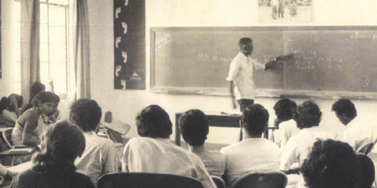

# 'Illegal' can be made 'legal' as per convenience

_Illegal mining company made 'legal' by judicial verdict_

\

The _Santhal Adivasi_ (indigenous) people are the largest tribe in
Jharkhand. Their land lies towards the eastern part of Jharkhand,
bordering Bengal in the north and Odisha in the south. Their
language _Santhali_ is akin to _Mundari_ and _Ho_ languages. Their forests,
lands, other natural resources and sustainable mode of production
has been the basis of their distinctive cultural values and traditional
customary practices. The traditional head of a Santhal village is called
'Majhi' and the head of a cluster of villages is called 'Parganait'.
They lived a peaceful life. However, the intrusion of exploitative and
oppressive outsiders, whom they called 'dikus' (meaning, those who
give trouble to _Adivasis_), began to increase rapidly. Santhals, like the
rest of the _Adivasi_ societies in Scheduled Areas, were protected by
clear constitutional and legal provisions. First of all, the _Fifth Schedule
of the Constitution_ assured them the right of self-governance under
their traditional leadership; secondly, the _Santhal Pargana Tenancy Act
1949_ in clear terms, forbade any transfer of their land to any
non-tribal person/entity; thirdly, the _Panchayats (Extension to Scheduled
Areas) Act 1996_ (PESA Act, in short) empowered _Gram Sabhas_ to
protect their economic, political, social and cultural interests; and
fourthly, the _Forest Rights Act 2006_ endowed them with a legal title to
their forest lands.

Despite the above protective provisions, the state government quietly
entered into a MoU with Punjab State Electricity Board to excavate
coal through its auxiliary PANEM Co. in 8 to 10 villages of Pachuada
_panchayat_ of Pakur district of Santhal Pargana in early 2000. This
step of the state government was in complete contravention of all the
protective provisions mentioned above. People came to know about
it only when formal notices were served to different households of
these villages. They were shocked beyond belief but geared themselves
up to resist this illegal, unjust aggression into their lives. Spontaneous
protest rallies, public meetings and door-to-door campaigns were
able to mobilise the to-be-affected people and they stood as one and
spoke in one voice under the leadership of their traditional head the
Parganait. But the government was unyielding to the people's demands
that the proposed mining should be given up.

## Justice eludes the poor

At this juncture, some _Adivasi_-activists suggested that they approach
the Jharkhand High Court to seek justice. The suggestion was
unanimously accepted by the people and a PIL was duly filed, the
main petitioner being the _Parganait_ himself. Fortunately for the
people, a well-known advocate of the Supreme Court offered to
argue the case. Coherent arguments were placed before the court,
bringing out the illegality of the proposed mining which would lead
to the vast displacement of village communities in the absence of
any sound rehabilitation programme. All seemed to go well till the
last minute. Alas, taking advantage of the absence of the lawyer due
to his unavoidable engagement in the Supreme Court that day, for
which he had prayed for an adjournment of the final hearing, the
Jharkhand High Court declined to grant his request and went ahead
to pass its verdict in favour of PANEM Co. and the government.
**The verdict, while admitting on the one hand the validity of
the points raised by the petitioner, gave a green light for the
mining on the avowed claims of 'national development' and the
'eminent domain of the state' as per which the state has absolute
authority to acquire any property if it deems it necessary for the
development of the country.**

It was an unbearable blow on the poor Santhals who were only seeking
constitutionally-guaranteed protection to their lands and forests. But
they did not want to accept defeat and decided to appeal against the
HC verdict in the Supreme Court. The honourable SC, while admitting
the case, refused to look into the merits/demerits of the HC verdict.
Instead, it ordered that adequate compensation and rehabilitation
measures should be worked out. It directed the PANEM Co. to sit
with the representatives of the affected people to work out the details
of rehabilitation. By the way, it is worth mentioning here that this
was a historic moment, for it was the first time the higher judiciary in
India ordered a corporate industrialist to sit with affected people and
work out a mutually acceptable rehabilitation plan. It would not have
been possible but for the resolute resistance of the people against
unjust displacement, even though at best it was only a consolation
prize. However, justice again deluded the poor.

## Haphazard rehabilitation

It was a tough negotiation between the affected people, who wanted
to live a community-based peaceful life with adequate socio-economic
infrastructure, and a private company, whose sole motive was profit
and only profit. Some _Adivasi_ leaders who had supported the people's
struggle were also roped in. A rehabilitation programme was worked
out which involved building houses, water and electricity facilities,
school for the children's education, and health-centre with adequate
supply of medicines and personnel. It was also agreed that of the
10 to-be-affected villages, the company would take one village at a
time; that is, it must first rehabilitate one village community and then
commence excavation, then take a second village and so on. But the
way the company went about implementing this plan, was haphazard
to say the least. For the first village, identical houses were built in a
line much to the dislike of the families. Overhead water tanks were
built but water never flowed down the pipeline. A primary school
was constructed. A health centre was set up for namesake without
adequate provisions in terms of medicines or medical personnel. In
short, it was merely fulfilling the SC mandate without any human
substance.

## Divide and rule ...

Very covertly, PANEM Co. began to divide the people who had
till then stood together. It bought off some of the youth from
the non-affected villages by offering them small sub-contracts,
two-wheelers, etc. This youth began to relish the smell of easy money
and openly supported the company's interests against the people's
concerns. They went to the extent of murdering a dedicated female
_Adivasi_-rights activist, who had played a pivotal role in the people's
resistance from the very start.

In 2015, the Supreme Court declared more than 200 mining companies
as illegal and ordered their immediate closure. PANEM Co. was one
of those illegal companies! The moment the SC order came, PANEM
Co. closed up its mining operations and walked off the scene leaving
its rehabilitation obligation unfinished. The two displaced village
communities have lost everything, their agricultural land, forest and
water sources. Instead, they now face a deep valley which looks like
a desert. The compensation money has been exhausted. Whereas
the state government, which should have gone after the company
to force it to complete the rehabilitation works, is looking the other
way. The _Santhal Adivasi_ societies of these villages are now eking out
an existence picking coal-pieces in the abandoned mine and by the
roadside. Development replaced by destitution!

***

***

***

***

***

***

***

***

***

***

***

***

***

***

***

***

***

***

