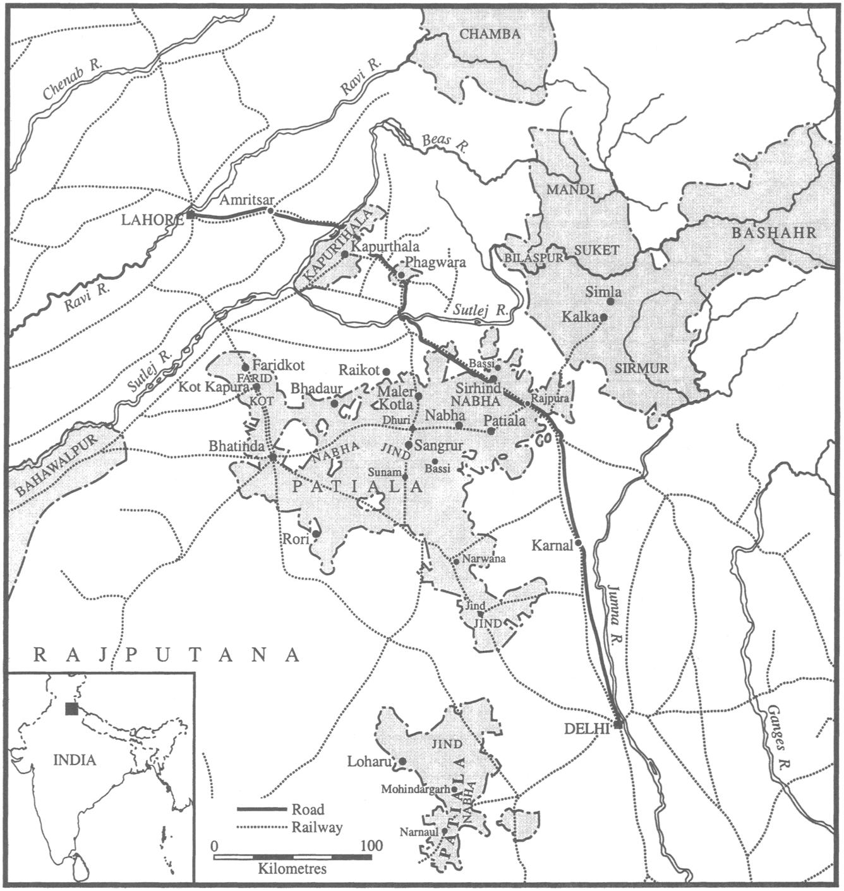

# Event

During the spring, summer and autumn of 1947 India's richest province,
the Punjab, played host to a massive human catastrophe. The
trigger for the catastrophe was Britain's parting gift to its Indian
subjects of partition. Confronted by a seemingly intractable demand
by the All-India Muslim League for a separate Muslim homeland ---
Pakistan --- a campaign which since 1946 had turned increasingly
violent, the British government early in 1947 accepted viceroy Lord
Mountbatten's advice that partition was necessary to arrest the country's
descent into civil war. 'Mahatma Gandhi notably excepted, the
leadership of the Congress party came gradually and reluctantly to
the same conclusion. Sardar Vallabhbhai Patel, Jawaharlal Nehru's
deputy, likened it to the cutting off of a diseased limb. But in
accepting the 'logic' of the League's 'two-nation' theory, the British
applied it remorselessly. They insisted that partition would have to
follow the lines of religious affiliation, not the boundaries of provinces.
In 1947 League president Muhammad Ali Jinnah was forced
to accept what he had contemptuously dismissed in 1944 as a 'motheaten'
Pakistan, a Pakistan bereft of something like half of Bengal
and the Punjab and most of Assam.

At the time, Mountbatten was much praised for his ingenuity in
finding a workable solution to the Indian problem'; in the years
since, praise has largely been replaced by blame. The viceroy has
been accused of self-advertisement, and of needlessly speeding up
the British withdrawal to preserve the fading reputation of the Raj.
In particular, he has been berated for not forseeing the human consequences
that would flow from the partition decision. Yet much of
this historical wisdom derives from hindsight. There is no evidence
in the records that the viceroy, or his close advisers, or for that
matter any of the Congress politicians in his cabinet, had even the
faintest apprehension of the scale of the calamity that was about to
occur. People were prepared for administrative dislocation, especially
in Pakistan; there was even some talk of government-sponsored
'population transfers'. But no one expected that between 12 and 13
million people would take it upon themselves to migrate, or that
they would act so precipitously, in reckless flight, abandoning homes,
businesses, jobs, friends, familiar places and most of their movable
possessions. Despite what seem in retrospect very clear warnings
from the leaders of the Sikhs, almost no one predicted the scale of
the violence that partition would unleash --- the attacks on the refugee
columns, the abductions, the rapes, the murders. Above all, no
one envisaged that so many would perish --- at least a quarter of a
million and perhaps as many as two million, if the claims of some
nationalist commentators are to be believed.[^/1]

For a long time the historiography of the partition was dominated
by accounts of high-level policy-making focusing on its 'causes'. This
was essentially an historiography underwritten by the meta-narrative
of the making of the nation-state, and 'partition' was defined accordingly
--- essentially as an administrative carve-up of territory and
'assets'. The big issues in this interpretation were: could partition
have been avoided? and, was the division of the spoils equitable? In
recent years, however, a new historiography of 1947 has begun to
emerge, one squarely focused on the results of the partition and its
impact on society. The big questions posed by this historiography
are: how, why and by whom was violence done? and, what effect
did it have on the survivors? Notably, this new research has thrown
considerable light on the traumatic experiences of those often
described as the chief sufferers' of the partition --- the abducted
women. It has also cast doubt on the comfortable supposition that
the killing was erratic and spontaneous --- merely a collective kneejerk
reaction fuelled by fear and rumour.[^/2]

[^/1]: It is doubtful whether there will ever be a comprehensive accounting. Even
where official bureaucracies were still functioning --- and in most places they had
broken down by late August --- conditions at the time did not permit the collection
of accurate data. There are good figures for specific times and places, such as those
included in the daily diaries of General Rees' Punjab Boundary Force, and in the
Patiala police reports that I cite below, but these are necessarily and admittedly
incomplete. In their absence, some observers have tried to calculate the death toll
in 1947 by comparing census data. One of the earliest attempts, but a fairly careful
one, was made by the West Pakistan government in 1948, using figures from the
1941 Indian census and data from a special West Punjab census commissioned in 1948. First, the authors of this study tried to work out what the Muslim population
of East Punjab would have been if partition had not supervened. Allowing for a
conservative natural increase of 1.6%, they came up with a figure of 5,935,000
Muslims. They then subtracted the totals for Muslim refugees in West Punjab ---
5,103,000--- and Muslims still living in East Punjab --- 270,000. By this reckoning
472,000 were 'unaccounted for', presumably killed. Similar calculations, with similar
results (in the order of 350,000 deaths) have been done for the Hindu and Sikh
populations of West Pakistan. But all these studies suffer from basic statistical flaws:
the wartime 1941 census is generally considered to have undercounted by a significant
amount; and boundary changes have made district-by-district comparisons
difficult. Note by Fazal-i-Ilahi, Supt. Refugee Census Operations, W. Punjab, n.d.
\[1948\], BL, Mudie Coll., 27. Among the historians H. V. Hodson, following Penderel
Moon, opts for a conservative figure of 200,000 killed, but others would push the
total higher. Robin Moore suggests that some 500,000 died, Leonard Mosley 'over
600,000', and Lawrence Ziring 'perhaps as many as three million'. H. V. Hodson,
The Great Divide: Britain-India-Pakistan (London, 1969), p. 418; Robin Moore, Escape
from Empire: The Attlee Government and the Indian Problem (Oxford, 1983), p. 327; Leonard
Mosley, The Last Days of the British Raj (Bombay, 1971), p. 279; and Lawrence
Ziring, Pakistan in the Twentieth Century: A Political History (Karachi, 1997), p. 69.

Nevertheless large gaps remain to be filled and several important
questions about the grim aftermath of the partition have still to be
answered satisfactorily. Firstly, while recent work by Suranjan Das
and Swarna Aiyer makes it clear that in many cases the aggressors
operated in organized groups under 'military style' leadership,
apparently to a plan, researchers have yet to determine where and
by whom these shadowy schemes were devised or how they were
implemented; nor has anyone succeeded in unravelling the links ---
that must surely have existed --- between the actual perpetrators and
the fire-brand Bengali, Bihari and Punjabi politicians. Secondly, we
still do not know a lot about the motives of the killers. At the time
it was generally conceded that in east Punjab most of the killing
during the summer of 1947 was done by the Sikhs. With what purpose?
One theory is that they sought revenge for the massacres earlier
in the year of their co-religionists in Rawalpindi and Hazara districts.
'What the Hindus and Sikhs did in East Punjab was of course
a reaction to the events in West Punjab', wrote provincial governor
Sir Francis Mudie.[^/3] However, while this thesis might account for
some of the ferocity with which the Sikh bands went about their
grisly business, it does not explain the systemic nature of the violence.
Muslims were not only butchered in east Punjab, but systematically
expelled. We would now term this process 'ethnic cleansing'.
This points to a political/territorial design. As David Gilmartin
observes: 'If we assume that the organized bands ... that perpetrated
a major part of the slaughter operated with some sense of
legitimacy, then their weilding of violence (itself, after all, a sign of
state authority) can perhaps be read as an attempt, through violence,
to lay moral claim to the new territories carved out by partition'.[^/4]
From this angle 'cleansing' (read purification) is an apt metaphor.
But what territorial project were the Sikhs embarked upon? Even
historians sympathetic to the Sikhs concede that the violence of partition
helped consolidate the community, thereby strengthening it
politically. However, it remains unclear whether this favourable
result was achieved by design or, as most Sikh historians aver, by
accident.[^/5] Thirdly, virtually all the work that has been done so far
on the Punjab massacres has focused on the erstwhile British province
of Punjab. Almost nothing has been said, at least directly, about
the princely-ruled areas of Punjab, namely the states of Patiala,
Nabha, Jind, Faridkot, Kapurthala, Kalsia, Maler Kotla, Loharu and
Bahawalpur.[^/6] This is a fairly serious lacuna, not simply because it
ignores a significant proportion of the Punjab's land and people
(about a quarter and a fifth respectively if one leaves out what
became after partition Pakistani Punjab) but because of the inherent
importance of the states and their rulers within the Punjabi scene.
As map 1 shows, the Punjab states formed an almost unbroken
north-south corridor across east Punjab from Rajputana to the hills,
bisecting all the main rail and road routes between the United Provinces
and Delhi and the cities of west Punjab. They occupied, quite
literally, the strategic heart of the province. In addition, for reasons
which will be explained presently, the darbārs (governments) of the
Punjab states exercised considerable political and cultural clout in
the larger provincial arena, especially in regard to the Sikh
community.

[^/2]: _e.g._, Swarna Aiyer, "August Anarchy": The Partition Massacres in Punjab,
1947', in D. A. Low and Howard Brasted (eds), Freedom, Trauma, Continuities: Northern
India and Independence (New Delhi, 1998), pp. 15--38; Urvashi Butalia, 'Community,
State and Gender: On Women's Agency during Partition', in Economic and Political
Weekly, XXVIII (17), 24 Apr. 1993, pp. 12--24; Suranjan Das, Communal Riots in
Bengal, 1905--1947 (Delhi, 1991); Vinita Damodaran, 'Bihar in the 1940s: Communities,
Riots and the State', in Low and Brasted, pp. 175--98; Mushirul Hasan, 'Partition:
The Human Cost', in History Today, 47 (9), 1997, pp. 47--53; Mushirul Hasan
(ed.), India Partitioned: The Other Face of Freedom, 2 vols (New Delhi, 1995), esp. vol.
1, pp. 15--42; Andrew J. Major, " "The Chief Sufferers": Abduction of Women during
the Partition of the Punjab', in Low and Brasted, pp. 57--72; Shail Mayaram,
'Speech, Silence and the Making of Partition Violence in Mewat', in Shahid Amin
and Dipesh Chakrabarty (eds), Subaltern Studies IX: Writings on South Asian History
and Society (New Delhi, 1996), pp. 126--64; Rita Menon and Ramla Bhasin, Borders
and Boundaries: Women in India's Partition (New Brunswick, N.J., 1998).

[^/3]: Gov. of West Punjab to M. A. Jinnah, 5 Sept. 1947, quoted in Harbans Singh,
The Heritage of the Sikhs (Bombay, 1964), p. 206.

[^/4]: David Gilmartin, 'Partition, Pakistan, and South Asian History: In Search of a
Narrative', in Journal of Asian Studies, 57 (4), 1998, p. 1086.

[^/5]: The latter view underpins the discussion in Harbans Singh, Heritage, p. 196.
'The Sikhs' concern was to save for India and for themselves as much of the Punjab
as they could from going into the Muslim state of Pakistan'. In other words, the
Sikhs' actions were reactive not pre-emptive. The former view was first expounded
in the memoir of another British observer of these events, Bahawalpur Revenue
Minister (Sir) Penderel Moon. Moon wrote: the 'basic objective of Sikh policy could
only be realised by the forcible expulsion of Muslims from East Punjab, for only so
could accommodation be found on the Indian side for the two million Sikhs who
would otherwise be left in Pakistan. So in falling upon the Muslims in East Punjab
... in August 1947 the Sikhs were not only gratifying their desire for revenge but
also helping to secure a more rational objective-the integral survival of the Sikh
community'. Divide and Quit (London, 1961), pp. 279--80. The intentionalist view,
not surprisingly, is also popular with Pakistani historians. See, _e.g._, Syed Nur
Ahmed, From Martial Law to Martial Law: Politics in the Punjab, 1919--1958 (ed. Craig
Baxter, trans. Mahmud Ali, Boulder, 1985), p. 253.

The discussion that follows tries to fill some of these gaps by examining
the involvement of the six so-called 'Sikh' states --- Faridkot,
Kapurthala, Kalsia and the 'Phulkian' states of Patiala, Nabha and
Jind in the east Punjab massacres. I begin by tracing the emergence
in the early twentieth century of a militant faction within the
Sikh communal leadership, namely the Shiromani Akali Dal or 'Akali
party'. I then show why, against the odds, the Akalis tried to augment
their power by drawing the Sikh rulers into their orbit and why, also
against the odds, the latter gradually fell in with the Dal's grand
designs. Next, I try to piece together what ensued, as a result of this
alliance, in the summer and autumn of 1947. Finally I assess the
success of this 'joint venture' in terms of the political goals of the
two parties.

[^/6]: Now and again one finds references in the literature to happenings in the
Punjab states, but they are rarely distinguished as such or differentiated from occurrences
elsewhere. See, _e.g._, Major, 'Chief Sufferers', p. 59. Bahawalpur, although
part of the Punjab States Agency, was geographically linked to Sind rather than the
Punjab; consequently I have chosen to exclude it from the present analysis, even
though it too was the scene of considerable bloodshed in 1947.

# Context

Sheltered by the umbrella of British imperial military power, the
Indian princes for a long time had no need to plan for their future;
not only was the British Raj all-powerful and benevolently inclined.
towards those it thought of as its most loyal allies, but it looked set
to rule India for an indefinite period. In so far as there was a princely
strategy during this period, it centred on endeavours to secure their
borders against intrusions from the provinces, which they saw as a
nursery of dangerous ideologies.[^/7] Towards the end of the First World
War, however, the myth of imperial permanence in South Asia was
shattered by London's intimation, in the Montagu declaration, that
it intended eventually to confer 'responsible government' on India, a
phrase later interpreted as meaning dominion status. In retrospect
this announcement can be seen as committing the British to a process
of decolonization. How would the princes and their states fare
once the British administrative umbrella was withdrawn?

[^/7]: See, _e.g._, Patiala Ijlas-i-Khas order of 6 Aug. 1925, P\[unjab\] S\[tate\] A\[rchives\],
Patiala, Dharam Arth, 380/12.

At first the threat of abandonment implicit in the Montagu
declaration was mitigated for the princes by governmental reassurances
and by the knowledge that dominion status did not preclude a
continuing connection with the Crown. Nevertheless, it set some of
the more sagacious princes and ministers thinking about survival
strategies. Out of these reflections and deliberations emerged what
I have dubbed, after one of its main sponsors, Baroda minister
Manubhai Mehta, the 'Mehta programme'.[^/8] Adopted as a recommendation
to its members by the Chamber of Princes in 1927, the
programme called upon the rulers to (1) consolidate their domestic
support-base by enacting administrative and constitutional reforms,
and (2) forge constructive relationships with friendly elements in
British India. As the prospect of independence drew nearer, more
and more of the princes accepted the prudence of this dual strategy
and began to hedge their bets by striking deals with local and provincial
political leaders. In the vanguard were the Sikh princes of the
Punjab.

Among the 600-strong princely fraternity, the Sikh rulers were
better placed than most to market themselves as regional politicians.
All the princes commanded deference by virtue of their office, which
automatically placed them near the top of the social pecking order,
and which was considered by many to put them in touch with the
divine; and most of them also possessed in liberal measure another
valuable currency of politics: patronage. Within their states, the
rulers controlled appointments to religious offices and, through their
governments, the disbursement of grants for the maintenance of religious
institutions.[^/9] This gave them considerable leverage over the
local priestly class, which was one of the most powerful shapers of
public opinion. However the princes' generosity did not stop at their
own borders. Princely purses enriched dozens of British Indian charities.
Hundreds of provincial schools, temples and shrines benefitted
from royal endowments. The Sikh rulers, for instance, gave lavishly
to Sikh educational institutions, bankrolled urgent conservation work
at Sikh sacred sites and subsidized several regional newspaper ventures.
This patronage, too, bought influence, in the case of the Sikh
princes quite substantial influence over the management and educational
philosophy of the Khalsa College at Amritsar, the principal
purveyor of higher education to the sons of the Punjabi Sikh elite.[^/10]

[^/8]: Ian Copland, The Princes of India in the End-Game of Empire, 1917--1947
(Cambridge, 1997), p. 278.

[^/9]: See, _e.g._, note by Gurdal Singh, Assist. Administrator, Nabha, dated 14 Oct.
1924, PSA, Nabha, P.M.'s Office, 903/1077E; Gurdial Singh, Home Member Nabha
to Presdt. of Council, Nabha, 2 Oct. 1937, PSA, Nabha, P.M.'s Office, 911/1113E;
note by Chief Judge, Nabha, dated 10 Oct. 1941, PSA, Nabha, P.M.'s Office, 9369/
9202E; and note in Home Dept., PEPSU, dated 22 Sept. 1951, PSA, Patiala,
Dharam Arth, 415/74.

However, the Sikh rulers also possessed two additional sources of
political influence not available to the rest of the princely order.
First, they controlled, as sovereigns, about a fifth of the Sikh panth
(community) resident in Punjab. Sikhs comprised in 1941 36%
of Nabha's population, 46% of Patiala's and over 57%
of Faridkot's. In only one district of British Punjab, Ludhiana, were
Sikhs as thick on the ground.[^/11] This made them, _de facto_, significant
communal players. Second, the Sikh states and their ruling families
were important carriers of Sikh tradition. Survivals from the mideighteenth
century, the states were a direct link with the golden age
of the Khalsa's military power when its misls (warbands) dominated
the Punjab. They served, as the Amritsar newspaper Khalsa put it, as
a 'symbol of our glorious past'.[^/12] More specifically, the Nabha and
Patiala houses between them owned most of the authenticated relics
of the tenth Sikh Guru and founder of the Khalsa Panth, Guru
Gobind Singh, including a kirpan (dagger) and a saropa (cloak) that
had once belonged to Gobind Singh, a hukum nāmā (decree) signed
by the Guru, and Gobind Singh's kangha (comb) with some strands
of his hair still attached to it.[^/13] These associations and artifacts constituted
a rich store of what Paul Bourdieu would call symbolic
capital.

[^/10] Barbara N. Ramusack, 'Maharajas and Gurudwaras: Patiala and the Sikh Community',
in Robin Jeffrey (ed.), People, Princes and Paramount Power: Society and Politics
in the Indian Princely States (Delhi, 1978), pp. 177--9, 182--3. Collectively the Sikh
states had the right to nominate 32 out of the 58 members of the Khalsa College
Council. Patiala controlled the lion's share, with eleven places in its gift. When the
College was reorganized along university lines in the early 1920s, the _Maharaja_ of
Patiala was elected its first chancellor.

[^/11] Census of India 1941, vol. VI, table XIII, pp. 42--5.

[^/12] Khalsa, 6 Oct. 1946, in \[Nehru Memorial Museum and Library\], A\[ll\] I\[ndia\]
S\[tates\] P\[eoples\] C\[onference\], 86, part II, of 1945--8.

[^/13] The first two items were bequested by the Guru to the common ancestor of
the Nabha, Patiala and Jind families, a Jat landholder named Phul, as a reward for
Phul sheltering him, toward the end of the seventeenth century, from searching
Mughal troops. The comb was acquired later. The hukunmama contained the blessing,
tera ghar so mera ghar, 'your house is my house'. It may have dated from a later
encounter between Gobind Singh and Phul's second son, Rama, in 1696. Note encl.
in Administrator, Nabha to Agent-to-the-Governor-General, Punjab States, 8 Sept.
1923, N\[ational\] A\[rchives of\] I\[ndia\], Home (Pol.), 401 of 1924; and Ramusack,
'Maharajas and Gurudwaras', p. 178.

The Hindu and Muslim princes too served as focii for the aspirations
of their respective communities; some of them, such as the
maharajas of Udaipur and Alwar, also acted from time to time, as
the Sikh princes did, as mediators in religious disputes. However
within the relatively small confines of the Khalsa, the Sikh maharajas
stood tall in a way that the other princes, in their much bigger
arenas, did not and could not. To be sure, they did not aspire to Sikh
religious leadership. That function resided with the learned men of
the Akal Takht at Amritsar and ultimately with the Sikh sacred book,
the Guru Granth _Sahib_, sometimes referred to as the living guru. Yet
they did see themselves as legitimate secular leaders, and were considered
to be so by many Sikhs, subjects and non-subjects alike. This
was particularly true of _Maharaja_ Bhupinder Singh, ruler (1900--38)
of the premier Sikh state, Patiala, who was frequently honoured with
the epithet 'Leader of the Sikhs'.[^/14]

From the early twentieth century, however, the communal leadership
of the Sikh rulers came under increasing challenge as a result
of socio-political developments in British Punjab associated with the
Sikh reform movement. Although we tend to think of it as a religion
in its own right, Sikhism has always struggled to divorce itself from
its parent faith, Hinduism. Until quite recently, for instance, it was
common for Sikhs and Hindus to intermarry and worship at each
other's shrines. But these syncretic tendencies were greatly
sharpened in the mid-nineteenth century by the British conquest.
With the demise of Sikh political power, Sikhism lost arguably its
major prop; over the following decades this blow was compounded
by rising prosperity, which fed a spirit of secularism and fostered a
lax attitude towards the keeping up of the five Ks' that since Gobind
Singh's time had been the defining symbols of Sikh orthodoxy. By
the end of the century the process of attrition had become so pronounced
that the Sikh scholar Kahn Singh felt compelled to rush
into print with a tract defiantly entitled Ham Hindu Nahīn ('We Are
Not Hindus'). Fearful for the survival of the Panth, community
leaders in 1873 founded the first of what eventually became a large
network of revivalist 'Singh Sabhas'. Over the next forty years these
Sabhas effectively rescued the religion by purging it of its Hinduistic
elements and promoting 'a coherent and authoritative view of what
it meant to be a Sikh'.[^/15] Then, in 1920, a second movement was
launched under the banner of the Shiromani Gurdwara Parbandhak
Committee (SGPC) for the 'liberation' of Sikh shrines and places of
worship from the hereditary control of the Udasis, who were viewed
as heretical because they did not observe the five Ks. Those who
answered the SGPC's call styled themselves Akalis ('immortal ones'),
after the Nihangs who had served as Guru Gobind Singh's bodyguard.
Over the next five years this blue-turbaned army, the Akali
Dal, occupied dozens of contested gurudwaras, sometimes peacefully
but often forcibly, which brought the movement increasingly into
conflict with the provincial authorities. Nevertheless the British
found it impossible to dampen the Akalis' ardour, and in 1925 the
Punjab government legislated to vest the SGPC with the management
of all Sikh holy places in British territory.[^/16]

[^/14] _e.g._ note by D. Petrie, C.I.D. Government of India, dated 13 Mar. 1912, cited
in Ramusack, 'Maharajas and Gurudwaras', P. 180.

The Sikh princes did not object to the reformist Singh Sabha
movement; on the contrary, they welcomed it. The Sabha at Faridkot,
for example, was founded by Raja Bikram Singh himself.[^/17] Even
when after 1902 the movement became more consciously political
with the establishment at Amritsar of the Chief Khalsa Diwan to
oversee its progress, the rulers and their darbārs were placated by the
Diwan's moderate tone and consultative style. The stalwarts of the
Chief Khalsa Diwan knew their place.

Not so the Akalis who, after 1920, came more and more to dominate
Sikh public life. From the first, relations between the Akali Dal
and the Sikh royal houses were clouded by mutual dislike and suspicion.
Although by 1925 the Dal had been legalized and to some
extent incorporated into the system of imperial control (in 1926
several Akalis contested elections to the Punjab legislative assembly),
to the princes they remained indelibly suspect because of their militant
role in the Gurudwara campaign. During that struggle the Akalis
had used violence and mass protest to achieve their ends. They had
solicited the help of the Indian National Congress, an organization
committed to the overthrow of the imperial system on which the
states depended for their security. This marked them out in the eyes
of the Sikh rulers as dangerous revolutionaries. Conversely, the
Akalis disapproved of the way the princes conducted themselves both
as Sikhs and as rulers. Several of them smoked; some cut their hair;
many ate food not prepared in the approved jatka manner; Jagatjit
Singh of Kapurthala (ruled 1890--1949), was as likely to be seen
inside a mosque as a gurudwara; the Patiala house (which treasured
dreams of rising to Rajput status) had a tradition of giving its daughters
in marriage to non-Sikhs. Just as disappointingly, from the Akali
standpoint, the Sikh princes refused to let communal considerations
affect the way they ran their states. They distributed their patronage
indiscriminately, giving to Muslim and Hindu charities almost as
generously as they gave to Sikh ones; they appointed Hindus and
Muslims to high positions in their governments, and declined to give
preferential employment to Sikhs. In Jind, for example, Sikhs who
comprised nearly a quarter of the population and contributed twofifths
of the land revenue, held just nine % of posts in the
state public service. According to the Akalis only Faridkot, of the six
Sikh-ruled states, could 'claim to possess any amount of Sikh character';
the rest had 'drifted away from the \[ir\] sacred heritage'.[^/18]

[^/15] N. Gerald Barrier, 'The Singh Sabhas and the Evolution of Modern Sikhism,
1875--1925', in Robert G. Baird, Religion in Modern India (New Delhi, 1995), p. 193.

[^/16] Major A. E. Barstow, The Sikhs: An Ethnology (New Delhi, 1985, first published 1928), pp. 35--52. J. S. Grewal, The Sikhs of the Punjab (New Cambridge History of India
II.3) (Cambridge, 1990), p. 162, claims that 4,000 Akalis died and 30,000 went to
jail in the course of the Gurudwara agitation.

[^/17] Harjot Oberoi, The Construction of Religious Boundaries: Culture, Identity and Diversity
in the Sikh Tradition (Delhi, 1997), p. 296.

Separated by a yawning ideological gulf, the princes and the Akalis
were always going to have an uneasy time co-existing within the
relatively restricted confines of the Punjab. But that said, neither
party put much effort into trying to bridge the gap. For their part,
the rulers opportunistically employed their statutory representation
on the SGPC to try and split the forces arraigned against them.
Patiala's Bhupinder Singh in particular was unrelenting in his efforts
to displace the dominant Akalis, consistently backing the election of
moderate candidates and lending his influence to anti-Akali factions.[^/19]
But the Akalis, too, meddled. Defying the long-standing convention
that provincial politicians did not interfere in the domestic
affairs of princely states, they supported dissident elements within
the states and tried to set themselves up as independent arbiters of
religious practice there. In August 1923 following the disruption by
darbāari police of an arkhand path (continuous reading of the Guru
Granth _Sahib_) at a gurudwara in the Nabha town of Jaito, the Akalis
persuaded the SGPC to authorize the dispatch of jathas (bands) of
protesters to the state; the incursions continued for two years until
101 arkhand paths had been completed.[^/20] Later they helped establish
the Punjab Riyasti Praja Mandal to press for the introduction of
representative institutions in the states, and campaigned vigorously
for the release of its first (Akali) president, Sewa Singh Thikriwala,
who was under detention in a Patiala jail. In 1930 they collaborated
in the production of a pamphlet highly critical of the morals and
administrative methods of Bhupinder Singh which forced the _maharaja_
to submit to a humiliating inquiry. Shortly after that they
launched an agitation, in cooperation with the Riyasti Mandal, to
force the Jind darbār to transfer control of state-owned gurudwaras
to Akali managers.[^/21]

[^/18] Note by Sir John Thompson dated 2 July 1926, IOR L/P&S/11/269; Sardar
Bhagwan Singh, presdt., Sikh Baradri, Lyallpur City to Master Tara Singh 5 Mar.
1938, IOR R/1/1/3210; 'Patiala Administration and the Position of the Sikhs', by
Giani Kartar Singh, sec., SGPC, n.d. \[1942\]; note by H. S. Craik on interview with
Tara Singh dated 4 Dec. 1942, IOR R/1/1/3884; and regional commissioner, E.
Punjab States, to under-sec., Ministry of States, 7 Apr. 1948, M\[inistry\] O\[f\]
S\[tates\], 4(51)-P/48.

[^/19] Ramusack, 'Maharajas and Gurudwaras', pp. 185, 190.

It would be wrong to suggest that this interventionist policy had
universal support. Even within the ranks of the Akalis there were
many who thought it imprudent to knowingly antagonize men as
powerful and potentially useful to the Panth as the Sikh princes.
But these more moderate counsels were consistently swept aside.
Increasingly, the hardliners ruled. After 1925, the dominant voice in
the latter group was that of Master Tara Singh (1885--1967), a
devout, puritanical Khatri from Rawalpindi district who had been.
one of the first to answer the SGPC's call in 1920.[^/22] By 1930 Tara
Singh was the Sikh rulers' most trenchant critic.

[^/20] The Jaito episode is described in Grewal, Sikhs of the Punjab, pp. 161--2.

[^/21] Copland, Prices of India, pp. 81--2; Ramusack, Maharajas and Gurudwaras',
pp. 187--9; 'Resumé of Events in the Indian States for the Period Ending 30 November
1931', IOR L/P&S/13/1336; and proceedings of meeting between the Patiala
and Jind cabinets at Motibagh Palace, Patiala, 20 Nov. 1931, PSA, Patiala, H-99B.

[^/22] Tara Singh's zeal for his religion is partly explained by the fact that he
embraced it by choice, converting from Hinduism at the age of 17. After the passage
of the Gurudwara Bill, Tara Singh became associated with the faction in the Akali
party opposed to constitutionalism. He acceded to the vice-presidency of the SGPC
in 1925 and the secretaryship of the Sikh League in 1928. In 1930, while in jail for
leading a banned march during the Civil Disobedience Movement, he was elected
president of the SGPC. From then until 1961 he remained the paramount (if not
always undisputed) leader of the Sikh Panth. Baldev Raj Nayar, Minority Politics in
the Punjab (Princeton, N.J., 1966), pp. 144--6; S. P. Sen (ed.), Dictionary of National
Biography (Calcutta, 1972--74), vol. 4, pp. 323--5. Paradoxically some of the strongest
support for Tara Singh's faction came from Akalis resident in the states who
resented the fact that the Gurudwara Bill made no arrangement for the management
of Sikh holy places in the princely territories. Liaquat Hyat Khan, Home
Minister Patiala, to Prime Minister Patiala 2 June 1925, PSA, Patiala, Ijlas-i-Khas, 212.

The Master and the maharajas came from different social backgrounds,
espoused different values, supported different political
causes; by the 1930s they were locked in a heated war of words. How
did these seemingly implacable adversaries get to be tactical allies
in 1947?

# Conspiracy

At the root of this unlikely rapprochement lay a small vein of princely
or (perhaps more accurately) darbāri common sense. Much as the
rulers disliked the Akalis, it was clear, by the 1930s, that the latter
were well entrenched and unlikely, at least in the short term, to be
displaced from the leadership of the SGPC. One way or another they
would have to be reckoned with. Confrontation having failed, a more
accommodating approach was indicated. Moreover, a deal with the
Akalis offered potentially substantial benefits, not least a reprieve
from the periodic cross-border agitation of dissident groups linked
to the Dal, agitation that by the 1930s was beginning to place a
fairly serious financial strain on the Punjab states. Patiala's Home
Minister Raghbir Singh put the argument thus: 'M\[aster\] Tara Singh
is the only man amongst the Sikhs who has got a following
amongst the masses. others are leaders in name only. . . . now, if
we make him hostile, he \[may\] ... be able to excite our public. .
A man of his strong will can bring about such things, especially when
time favours'.[^/23] Accordingly, feelers were put out, and some time
later, around 1935, a deal was struck. Although the respite was shortlived-Tara
Singh was soon accusing the rulers of being fickle
allies --- the princes rightly considered it a major breakthrough, for it
showed that the Akalis, too, could be pragmatists if necessity
demanded.[^/24]

[^/23] Raghbir Singh to prime minister of Patiala 27 Aug. 1937, PSA, Patiala, Ijlas-iKhas, 2055.

[^/24] There are only stray references to the deal in the Patiala archives which give
no hint as to its terms, although we may suppose that they included a promise by
the princes to direct their nominees on the SGPC to support the Tara Singh faction.
Nor is it clear exactly why, after holding aloof for several years, they finally agreed
to come to the party, though Ramusack offers one possible explanation when she
suggests that the death of Sewa Singh Thikriwala 'removed the principal source of
hostility between the Master and the _Maharaja_'. 'Maharajas and Gurudwaras', p. 190. The cause of Tara Singh's re-think about the arrangement was the sacking of
his brother, Professor Nirinjan Singh, one of the people who had helped arbitrate
the settlement, from his chemistry teaching job at Khalsa College. Patiala as college
chancellor could have intervened to prevent the dismissal, but chose not to do so.
This in Tara Singh's view constituted 'a breach of the understanding between the
State and the Akali Party . . . almost a betrayal'. Message from Tara Singh to Raghbir
Singh, home minister, Patiala, sent via S. Gurjit Singh on 11 Aug. 1937, PSA,
Ijlas-i-Khas, 2055.

Secondly, while the two sides remained (with good reason) deeply
suspicious of one another, several developments in the 1930s and
early 1940s helped dismantle some of the barriers between them.
Within the princely camp, this period was something of a dynastic
watershed. Bhupinder Singh, seen by the Akalis as their most formidable
and persistent princely adversary, died in 1938. Another longtime
darbāri foe of the Akali Dal, Jind chief minister B. L. Dhingra,
passed on a year later. Concurrently two other rulers, Harinder
Singh of Faridkot and Pratap Singh of Nabha, reached their majorities,
ending an extended period of British tutelage in those states. In
turn, these changes brought to the fore a new crop of quite young[^/25]
Sikh princely leaders who, having grown up during the Akali era,
tended to accept the Dal as a given of Punjabi politics and a legitimate
voice of Sikh aspirations. Moreover, though outwardly welleducated,
these young guns struck contemporaries as lacking the
political savvy of their predecessors. Bhupinder Singh's successor at
Patiala, for example, _Maharaja_ Yadavindra Singh (ruled 1938--48),
was described by the acerbic British Political Adviser Francis Wylie
as 'magnificent to look at, but very conceited and not very intelligent'.[^/26]
On both counts, the Akalis welcomed this changing of the
guard as a positive development, offering the chance of 'better
days'.[^/27] And the Patiala ruler, for one, gave every sign of vindicating
their judgement. Having in his youth wedded a Hindu woman, in
1938 Yadavindra Singh remarried; this time he took a bride from
within the faith, the daughter of a prominent Akali to boot. In 1940
he resumed the jagir of his Muslim prime minister Nawab Liaquat
Hyat Khan, brother of the Punjab premier, a move widely hailed as
a 'great victory for the Akalis against the British Government and
Sir Sikander Hyat Khan', and hinted that he might replace Liaquat
with a Sikh if a suitable man could be found.[^/28]

[^/25] In 1940 Yadavindra Singh of Patiala was 27, Harindar Singh of Faridkot 25
and Pratap Singh of Nabha 21.

[^/26] Note by Wylie dated 9 Aug. 1944, IOR R/1/1/4152.

[^/27] 'Patiala Administration and the Position of the Sikhs', by Giana Kartar Singh,
n.d. \[1942\], IOR R/1/1/3884.

Meanwhile, the Akali Dal progressively moderated its militant,
anti-government position. For almost two decades, the Dal was synonymous
with the radical nationalist cause in the Punjab; briefly outlawed
in 1923 by the government for its role in the Gurudwara
Movement, it was from the start a close ally of the Indian National
Congress and an active supporter of the freedom struggle, some
3,000 Akalis offering themselves for arrest during the Congressite
Civil Disobedience campaign of 1930. SGPC president Tara Singh
personified this alliance, serving on both the Punjab Provincial Congress
Committee (PPCC) and the All-India Congress Committee.
However, from about 1937 the Akali-Congress relationship began
to turn sour. First, Hindu Punjabi Congressmen led by veteran campaigner
Satyapal, activated perhaps by communal jealousy, took it
upon themselves to smear the Akalis' nationalist credentials, claiming
that they had nothing in common' with the Congress and, specifically,
did not subscribe to its credo of non-violence.[^/29] When M. K.
Gandhi reiterated this charge to Tara Singh's face, the Master
resigned from the AICC.[^/30] Then relations were further strained by
the outbreak of war in 1939. Having cooperated with the government
since 1934, the Congress in October 1939 dramatically
reversed its political stance in protest at the viceroy Lord Linlithgow's
failure to consult Indian opinion before committing India
to the Allied cause; by 1940 their attitude had hardened into one of
passive opposition to a War which many Congressmen felt irrelevant
to India's concerns and which, after Winston Churchill's arrival at
Downing Street, looked increasingly like a war fought to defend British
imperialism. The Akalis, however, saw things differently. Military
employment was important to the Sikhs both financially and as a
way of maintaining the community's warrior traditions, so integral
to its sense of identity. Since the 1920s Sikh recruitment in the
Indian Army had fallen, a consequence of the governmental
reappraisal that had followed the Gurudwaras struggle. With the
War offering the community a golden chance to recoup its losses and
to restore its reputation for loyalty, the Akalis opted instead for the
path of cooperation. Late in 1939 they announced that they would
back the war effort and offered Linlithgow assistance in recruiting.
In May 1942 they negotiated an electoral arrangement with their
old foes, the Unionist Party, whereby Akali moderate Sardar Baldev
Singh became a member of Sikander Hyat Khan's cabinet. Around
the same time they joined the Khalsa Defence League, a pro-war
lobbyist organization headed by none other than the _Maharaja_ of
Patiala.[^/31] Thanks to the War the Akalis and the princes found themselves
by 1942 sharing a common political platform, paving the way
for a still closer structural association at a time when the Panth
desperately needed to present a unified face to the world to combat
the growing threat to Sikh aspirations posed by the Muslim League's
plan for Pakistan.

[^/28] Aide-memoir by resdt., Punjab States, encl. with resident's fort. report for the
period ending 30 Nov. 1940, IOR L/P&S/13/1358. Getting rid of Liaquat was a
long-standing Akali objective. It was anathema to the Dal that 'the brother of \[Unionist
leader\] Sir Sikander, the implacable enemy of the Akali Party, was installed
as the Prime Minister of the leading Sikh State'. According to some sources, the
Akali campaign to dislodge Liaquat had inside backing from Home Minister Colonel
Raghbir Singh. Notes by C.I.O. Lahore dated 20 Nov. and 22 Dec. 1939, IOR R/1/1/3523. Rumour had it that Patiala also did Tara Singh a personal favour, intervening
with the Punjab government to have a police case against the Master's family
for fraud and misappropriation of funds withdrawn. This was vigorously denied by
Tara Singh. Tara Singh to presdt., Indian National Congress, 21 Aug. 1939, Valmiki
Choudhary (ed.), Dr Rajendra Prasad: Correspondence and Select Documents, vol. 4 (New
Delhi, 1985), p. 60.

[^/29] Satyapal to Rajendra Prasad, quoted in K. L. Tuteja, 'The Sikhs and the Congress
1930--1940', in Paul Wallace and Surendra Chopra (eds), Political Dynamics
and Crisis in Punjab (Amritsar, 1988), pp. 115--16.

[^/30] _Ibid_., p. 120.

Since Baisakhi Day 1699 the Sikhs have assumed that they are
marked out for a special destiny. Had Guru Gobind Singh himself
not promised them, in the Srimukh Vak, 'raj karega Khalsa' ('the Khalsa
shall rule')? Was this not the purpose of the Guru's call on that last
Baisakhi of the seventeenth century for the Sikhs to renounce
tobacco and to take on the five symbols? Did not 'Khalsa' mean, 'the
pure, the elect'?[^/32] Consequently, community aspirations after 1699
centred on acquiring the means to fulfil that destiny. Congregations
of the faithful meeting in their gurudwaras were regularly reminded
that 'religion is not safe without political power'. Tara Singh made
much the same point when he wrote, in 1945: 'there is not the least
doubt that the Sikh religion can live only as long as the Panth exists
as an organized entity'.[^/33] Like their forebears, Sikhs in the early
twentieth century nurtured the dream of statehood. More specifically
they dreamed of one day restoring the Sikh Kingdom of Lahore
which for a brief half century had embodied Gobind Singh's communal
vision. As one polemicist wrote in 1946, 'in asking for a Sikh
State, we don't make a new demand. We only ask for the return of
our homeland'.[^/34]

[^/31] The Patiala government played a leading role in the negotiations that led to
the Sikander-Baldev Pact, which was effectively stitched up at a meeting between
SGPC deputy president Giani Kartar Singh and Yadavindra Singh at Patiala in May 1942. Note by home minister, Patiala, dated 30 May, Yadavindra Singh to Sikander
Hyat Khan 17 June and Baldev Singh to Yadavindra Singh (teleg.) 20 June 1942,
PSA, Patiala, Ijlas-i-Khas, 2177.

[^/32] Gurbachan Singh and Lal Singh Gyani, The Idea of the Sikh State (Lahore,
c. 1946), p. 17.

But how would this restoration be accomplished? Until the 1940s
many Sikhs hoped that the British upon their departure would
simply hand over the Punjab by way of a reward to the community
for its loyal service to the Raj. 'We thought we would be given the
whole of the Punjab as it was taken by the British for safe-keeping',
wrote a bemused Sikh officer of the Indian Army, 'without any \[need
for\] conquest at all'.[^/35] As events in 1947 would make clear, this was
always a naive expectation. Nevertheless it was not so much British
perfidy which shattered their hopes for a peaceful restoration of
power in the Punjab, as the All-India Muslim League's call in March
1940 for the Muslim-majority provinces of British India to be made
autonomous a call which soon crystallized into a demand for a selfgoverning
Pakistan. From the start the League made it abundantly
clear that it required the whole of the Punjab for its Muslim homeland.
As if that wasn't bad enough, the Churchill government gave
the impression that it viewed the Pakistan scheme sympathetically,
indicating in the 'Cripps Offer' of 1942 that it would allow any province
that did not wish to join the Indian Union foreshadowed to be
established after the War to make its own political arrangements.

Fearing that their own claims were in danger of going by default,
the Akalis rushed to the barricades. For some time the Akali Dal
had been conjuring with the idea of asking for the Punjab to be
administratively partitioned to create a new province of East (or as
the Dal provocatively described it) Azad Punjab with a demographic
composition 40% Muslim, 40% Hindu and 20%
Sikh; as the Akalis figured it, these ratios would leave the Sikhs with
the communal 'balance of power'. On 4 June 1943 the Dal formally
adopted this scheme as party policy; at the same time the Akalis
firmed up their definition of the proposed province, which was
described as encompassing Ambala, Lahore, and Jullundur divisions,
the districts of Lyallpur and Montgomery and a part of the district
of Multan. Fourteen months later this demand was overwhelmingly
endorsed by a massed 'Panthic meeting' at Amritsar. Watching British
observers interpreted this verdict as reflecting a 'growing demand
that the Sikhs should be regarded as a separate nation', an assessment
that was borne out in March 1946 when the SGPC gave its
blessing to an Akali resolution calling for the creation of 'a separate
autonomous Sikh State in those areas of the central, northern, eastern
and south-eastern Punjab in which the overwhelming part of the
Sikh population is concentrated'.[^/36]

[^/33] Quoted in Rajiiv A. Kapur, Sikh Separatism: The Politics of Faith (London, 1986),
p. 207.

[^/34] Sadhu Swarup Singh, The Sikhs Demand Their Homeland (Lahore, c. 1946), p. 82
(my italics).

[^/35] Unnamed Sikh officer to Col. Spencer 19 Sept. 1947, BL, Rees Coll., 50 (my
italics).

It was at this stage admittedly mainly a contingency plan, to be
pulled out only if the Muslim League succeeded in imposing its Pakistan
scheme on the British Government and the Indian National
Congress. It was also a rather sketchy plan that glossed over a
number of practical difficulties, such as the fact that many Sikhs,
and many important Sikh shrines, lay outside the nominated boundaries
of the 'Khalistan' state. When asked about this by the British
Cabinet delegation of 1946, the Akalis could only reply that their
scheme depended upon a gradual transfer 'over five or ten years' of
'both population and property', a process they acknowledged would
need government assistance.[^/37] For this reason some historians suspect
that it was never meant to be anything more than a handy
bargaining chip with which to pressure the British and the Congress
to hold firm on their plans for a united India.[^/38] This interpretation,
however, requires a reading which goes squarely against the grain of
almost all the Akalis' published and private statements on the issue
from 1944 onwards. It also fails to take into account the Dal's rapprochement
with the Sikh princes. As we have seen, the Akalis harboured
no romantic illusions about the Sikh royal families, but they
realized their value to the Sikh cause. For one thing, the Sikh states
housed a significant slice of the Sikh population. Without them the
so-called Sikh homeland would be barely 20% Sikh; with the
states included the proportion would rise to a more respectable quarter.
For another, the states had police, small but efficient armies,
supplies of weapons, resources that could mean the difference
between victory and defeat if it came to a showdown. Last but not
least, the princes were a useful conduit to the government of India,
which would have a substantial say in determining where and in
whose hands the Punjab ended up. After a frank discussion with
Akali MLA Baldev Singh in July 1946, Punjab governor Sir Evan
Jenkins wrote: 'I think that the Sikh States might form a rallying
point for the Sikhs ... and enable them, if they so desired, to carve
out a Sikh unit for themselves'.[^/39] This was not an original thought;
years earlier Master Tara Singh had come to exactly the same
conclusion.

[^/36] Rajwant Kaur Dhillon, 'Demand for Pakistan: Role of Master Tara Singh', in
Verinder Grover (ed.), The Story of Punjab, Yesterday and Today, vol. 1 (New Delhi, 1995), p. 538; Fort. report from Punjab for second half of Sept. 1944, in P. N.
Chopra (ed.-in-chief), Towards Freedom 1943--44 (New Delhi, 1983), part 3, p. 3270;
Singh and Gyani, Idea of the Sikh State, pp. 3, 11.

[^/37] 'Record of meeting between the Cabinet Delegation, Lord Wavell and representatives
of the Sikh community' on 5 Apr. 1946, in Nicholas Mansergh and Penderel
Moon (eds), The Transfer of Power, 1942--7 vol. VII (London, 1977) \[hereafter
TOP\], pp. 139--40.

[^/38] Gupta, for example, believes that 'The idea of a Sikh state was never seriously
entertained', but this conclusion appears to be based on a misreading of comments
made by a Sikh delegation to the viceroy Lord Wavell. Dipankar Gupta, The Context
of Ethnicity: Sikh Identity in a Comparative Perspective (Delhi, 1996), p. 49. _See also_ Sen,
Dictionary of National Biography, p. 324. Ramusack, 'Maharajas and Gurudwaras', p.
193, equivocates.

Nevertheless, Tara Singh did not feel that he could conscientiously
invite the states to be a part of the imagined Sikh homeland whilst
their rulers, the 'Panthic traitors' as he dubbed them, continued to
deny their cultural heritage by living heterodox life-styles and
entrusting their administrations to non-Sikhs. He argued therefore
for a series of targeted campaigns to make the Sikh princes conform.
"The first step of our preparations to face the coming crisis', he told
an Akali conference in April 1940, is to finish \[the\] Panthic
traitors'.[^/40] The SGPC agreed and gave its consent. The first campaign
was launched almost immediately against the young ruler of
Nabha; others then followed at intervals over the next five years
against Kapurthala, Patiala and Jind. 'It appears', mused Jagatjit
Singh of Kapurthala, that 'Tara Singh has formed an ambition to
play the role of a King-maker in Sikh States'.[^/41]

[^/39] Sir E. Jenkins to Lord Wavell 4 July 1946, TOP, vol. VIII (London, 1979), p. 6.

[^/40] Speech at Pherala, Lyallpur district, 6 Apr. 1940, IOR R/1/1/3554.

[^/41] _Maharaja_ of Kapurthala to resdt., Punjab States, 17 Apr. 1940, IOR R/1/1/3554; and _see also_ Sir Bertrand Glancy to Lord Wavell 17 Apr. 1943, TF 1943--44,
part 3, pp. 2906--7; fort. report on Punjab states by C.I.O. Lahore for second half
Feb. 1944, IOR R/1/1/4199; report of meeting of the SGPC on 18/19 Nov. 1944,
PSA, Patiala, Dharam Arth, 286/50; resdt. Punjab States to _Maharaja_ of Patiala 21
Dec. 1946, PSA, Patiala, Ijlas-i-Khas, 2261; The New York Times, 23 Dec. 1946; and
Hira Singh Chinaria, presdt., Jind State Praja Mandal, to presdt., All-Indian States
Peoples' Conference, 27 Dec. 1946, A\[ll-\] I\[ndian\] S\[tates\] P\[eoples'\] C\[onference\],
86 (part II) of 1945--48.

It was a role the Master relished; other Akali Dal leaders, though,
were less convinced of the necessity for a wholesale purge in the
states and remained concerned about the possibility of a backlash.
One of the most persistent critics of Tara Singh's strategy was his
nominal deputy, Giani Kartar Singh, who favoured closer ties with
the Raj and worried that attacks on the Raj's princely allies might
result in the Panth being cold-shouldered in the transfer of power.
As a result the campaign tended to wax and wane depending on
which group held the balance of power within the SGPC.[^/42] Moreover
the princes and the darbārs proved rather more resilient targets than
the cocksure Tara Singh had expected. Among others the Prime Minister
of Kapurthala remained implacably defiant, offering this stern
advice to Jagatjit Singh: 'Your Highness should seriously consider
the possibility that we shall, by trying to humour Master Tara Singh
and his friends, lose the sympathy and support of the paramount
power. ... \[Soon\] it is hoped that Master Tara Singh will see the
error of his ways and will call off these puny jackals of the Akali
Dal'.[^/43] These flashes of spirit merely confirmed for Tara Singh what
he had long suspected, namely that the rulers were 'completely
untrustworthy' allies.[^/44]

Eventually, however, all the Sikh states broadly fell into line with
the Dal's wishes. In April 1943 in return for the Akalis agreeing to
call off their agitation the _Maharaja_ of Kapurthala pledged to raise
his grandson in the orthodox keshadhari tradition and to 'uphold and
preserve the tenets of My State religion'; and in March 1945 Yadavindra
Singh offered a similar pledge in regard to his children, promising
that henceforward all the close family would marry 'amongst
the Sikhs'. Finally Ranbir Singh of Jind bowed to the trend in January
1947, announcing that he had taken a New Year's resolution to grow
his hair and beard.[^/45] And it was a similar story on the administrative
side. One by one, faithful Muslim and Hindu retainers were pushed
out and replaced by Sikhs --- Liaquat Hyat Khan and D. K. Sen of
Patiala, Abdul Hamid of Kapurthala and Mohammad Sadiq of Jind
some of the more notable scapegoats.[^/46] Once in office, this new crop
of Sikh bureaucrats moved quickly on other Akali demands, such as
the lifting of darbāri curbs on party rallies and the substitution of
Punjabi in the Gurumurkhi script for Urdu as the language of administrative
record. The Congress-aligned All-India States Peoples' Conference,
though no friend of the Akali Dal, correctly identified these
changes as constituting a 'policy of aggressive communalism'.[^/47]

[^/42] Nayar, Minority Politics, p. 81. At this time the Akali Dal was broadly divided
into three factions, one led by Giani Kartar Singh, one by Tara Singh and one by
Jathedar Udham Singh Nagoke. Within this framework the waters of Akali politics
were further muddied by geographical rivalries between members from the Manjha
region beyond the Sutlej and those from the more easterly Malwa region. An
extended lull occurred in 1944 following Tara Singh's resignation as president of
the Akali Dal and the SGPC, which the British read as a sign that he had been
'outmanoeuvred by the ambitious Giani Kartar Singh'. Fort. report from Punjab for
first half of Mar. 1944, TF 1943--44, part 3, pp. 3124--5.

[^/43] Memo. prepared by Sir Abdul Hamid for _Maharaja_ of Kapurthala, dated 21
Jan 1943, PSA, Kapurthala, Sadar Office, PO/3--3-43.

[^/44] Record of interview between Tara Singh and Howard Donovan, Chargé d'Affaires,
American Embassy, New Delhi on 8 Dec. 1947, encl. in Donovan to Sec. State
8 Dec. 1947, U.S. State Dept. decimal file 845.00/12--847.

Why did the states conform? In part, they were motivated by
simple expediency. Conformity bought political peace. And it gained
them a powerful ally against Congress and its local minions, the
AISPC-affiliated praja mandals, which were pushing hard for the rulers
to introduce responsible government. Secondly, while the princes and
their advisers did not particularly like the messenger, the message
that the Akali Dal brought struck a chord, especially with the rulers.
While the princes might have been flawed vessels from the Akali
point of view, they were still Sikhs, with Panthic instincts and loyalties.
Even Jagatjit Singh of Kapurthala, who was the least conventionally
religious of the group, took his cultural heritage very seriously.
Increasingly during the 1940s this identification with the
Panth appears to have extended to embracing its ethno-nationalist
aspirations for a homeland. Nevertheless, the extent of this princely
patriotism varied. From the start, Yadavindra Singh of Patiala and
Harinder Singh of Faridkot were far more vocal in their support for
Khalistan than the others.[^/48] What drove them to go further?

[^/45] Draft statement to be given to the Akali delegation dated \[Mar.?\] 1943, and
statement issued by Akali delegation dated 8 Apr. 1943, PSA, Kapurthala, Sadar
Office, P/3--3-43; Lt.-Col. Harbans Singh, Revenue Minister, Patiala, to S. S. Deodhi
Mualla, 13 Mar. 1945, PSA, Patiala, Dharam Arth, 286/50; and Akali (Lahore), 3
Jan. 1947, quoted in IOR R/1/1/1336.

[^/46] The communal agenda that lay behind these 'routine' changes is laid bare in
a letter from Sen to Liaquat's successor at Patiala, Harjot Singh Malik. Sen exclaims
at one point: 'The only natural and reasonable inference that one can draw from
these repeated attacks on the prestige and powers of the Foreign Minister is that
you wish me to leave the State'. Sen to Malik 1 Aug. 1944, PSA, Patiala, Ijlas-i-Khas, 2194. The sketchy statistical evidence available in the annual administration
reports of the Punjab states suggests that the Sikh share of public service jobs in
the Sikh-ruled states increased by several percentage points during the 1940s.

[^/47] Note by Jai Narain Vyas, gen. sec. AISPC, dated \[Aug. 1945\], AISPC, 86 (part II) of 1945--48.

Perhaps the main thing was ambition. While the official Akali line
remained that Khalistan would be constituted from British Punjab,
speakers on the public stage and in internal party discussions now
openly canvassed the possibility of the states forming part of the
enterprise; increasingly the princes --- Yadavindra Singh especially ---
were spoken of in these discussions as the natural leaders of the new
state. It was a prospect they found (not surprisingly) both flattering
and politically attractive. While the Embassy has been unable to
unearth any concrete evidence to support persistent rumours that
the Sikh princes are behind a comprehensive plot to turn all or part
of the Punjab into a single Sikh State', American diplomat Howard
Donovan reported to Washington in September 1947: 'there is no
doubt in my mind that the leading Sikh princes would be entirely
agreeable to such a project. In conversation with an officer of the
Embassy some months ago the _Maharaja_ of Faridkot predicted that
neither the Government of Pakistan nor that of India would be able
to survive without extensive foreign aid and implied quite clearly
that certain Princes might fall heir to some of the territory
involved'.[^/49] As for the _Maharaja_ of Patiala, Yadavindra Singh increasingly
saw himself as the Panth's Man of Destiny, his resolve to lead
reportedly stiffened by a court astrologer's discovery of a passage in
an old Sikh text prophesying that in the next century a ruler would
emerge to rebuild the Kingdom of Lahore-a ruler whose description
in the book 'tallied' strikingly with that of Yadavindra himself.[^/50] In
keeping with this image, the _maharaja_ on 3 April announced that his
army was 'ever ready' to make sacrifices to protect the community, a
comment warmly applauded by Master Tara Singh.[^/51]

[^/48] Evidenced by their willingness to speak out in favour of Khalistan on the public
platform. Yadavindra Singh's appearance at a Khalistan rally at Bhawanigarh, Patia
la, in March 1943, is noted by Ramusack, 'Maharajas and Gurudwaras', p. 194.

[^/49] Donovan to Sec. of State, Washington, 23 Sept. 1947, U.S. State Dept. decimal
file 845.00/9--2347.

[^/50] Interview with R. G. Verma, Patiala, 1 Feb. 1998; and statement by former
S.P., Narnaul, Patiala, quoted in The Sikhs in Action (Lahore, 1948), p. 51. The
evidence of this (Muslim) policeman must be viewed with caution, but many of his
assertions are supported by other sources. People I have spoken to in Patiala confirm,
for example, that the _Maharaja_ had an astrologer named Raj Jotshi, whom the
policeman's deposition identifies as the man who brought the San Sakhi prophecy to
Yadavindra Singh's attention.

[^/51] Address to the 1st Sikh regiment, Patiala, 3 Apr. 1947, and press statement
issued by Tara Singh on 15 Apr. 1947, as recorded in the diary of Ganda Singh, in
Mushirul Hasan (ed.), India Partitioned: The Other Face of Freedom (New Delhi, 1995),
PP. 31, 34--5.

To repeat, the Khalistan project had originated as a contingency
plan; but by the early part of 1947 the contingency it had been
prepared to meet stared the Sikhs in the face. The Cabinet Mission
Plan of May 1946 with its loose federal structure had been bad
enough; but shortly after Lord Louis Mountbatten took up the viceroyalty
in March 1947 it became apparent that the British were
seriously contemplating abandoning even that shallow commitment
to Indian unity. The nightmare spectre for the Sikhs of Pakistan now
loomed as a distinct possibility. To be sure, Congress had made it
clear that they would accept the League's Pakistan scheme only if it
was pared down by the quarantining of the non-Muslim parts of
Bengal and the Punjab. However even this prospect was anathema
to the Sikhs because any division of the Punjab along religious lines
was guaranteed to split the community. As early as June 1946 Tara
Singh was threatening violence if the Pakistan scheme went ahead.
Patriotic Sikhs, he told an assembly of the faithful at Amritsar,
should be prepared to die in the struggle ahead'. In February 1947
he called for the organization of an Akal Fauj, an Akali army. On 3
March, at Lahore, the Master berated a hostile crown of League
supporters with the words: 'We may be cut to pieces, but we will
never concede Pakistan'.[^/52]

In the face of these chilling threats renewed diplomatic efforts
were made to persuade the SGPC to support the inclusion of the
whole of the Punjab in Pakistan in return for guarantees of full religious
freedom and limited Sikh provincial autonomy. Some of these
overtures came direct from the League, others via British wellwishers
such as Penderel Moon, the Revenue Minister of Bahawalpur.[^/53]
But the SGPC remained in thrall to Tara Singh, and the
Master could not bring himself to trust. When Punjab governor Sir
Evan Jenkins interviewed Tara Singh in mid-May, he found him
'incoherent and obstinate as usual'. Afterwards Jenkins wrote to
Mountbatten: 'It is lamentable at this juncture that the affairs of
the Punjab should be so largely in the hands of this eccentric old
man'.[^/54] Moreover whatever slim chance of success these overtures
might otherwise have had evaporated in April, as reports came in of
massacres of Sikhs and Hindus in Rawalpindi and other west Punjab
districts, followed soon afterwards by a massive influx of homeless
and frightened refugees, each one with a horror story to tell. After
April 1947 the Akalis no longer acted just in defence of Khalistan;
they also, increasingly, sought revenge. Their preparations intensified
accordingly.

[^/52] Nayar, Minority Politics, p. 91; and Moon, Divide and Quit, p. 77.

[^/53] Moon to his son, 2 July 1947, BL, Moon Coll., 21; and Moon, Divide and Quit,
PP. 43--9, 84--5.

[^/54] Jenkins to Mountbatten 19 May 1947, TOP, vol. X, p. 894.

As we have seen, Tara Singh had already begun to mobilize the
Sikhs for guerilla action. From April jathas began to be assembled in
earnest, a process facilitated by the onset of the hot weather, which
released the Jat Sikhs from farming duties. Initially, much of the
organizing in this respect was done by Gyani Harbans Singh, an
escaped criminal under the overall direction of a Council of Action in
Amritsar whose members included ex-Indian National Army officer
Colonel Narinjan Singh, Sardar Baldev Singh, Giani Kartar Singh,
Master Tara Singh and Raghbir Singh, the former Patiala minister.
The Committee also took on the job of raising money to buy arms
and equipment for the jathas, eventually amassing a war-chest of
between 10 and 12 lakhs. Meanwhile, other initiatives were launched
on the political front. Approaches were made to Hindu groups who
shared the Akalis' desire to save Punjab from Muslim domination,
such as the Mahasabha and the Rashtriya Swayamsevak Sangh
(RSS).[^/55] And contact was made with the Sikh states, in particular
Patiala and Faridkot. Early in April Harinder Singh was invited by
Tara Singh 'to undertake what would amount to military operations
in his part of the Punjab'; one version of this encounter has it that
the _maharaja_ was offered the district of Ferozepur by way of
payment.[^/56]

By all accounts, the Sikh darbārs responded handsomely. Patiala
and Nabha are said to have provided rifles, revolvers and ammunition;
Faridkot jeeps and trucks; Kapurthala money; Kalsia training
facilities for RSS cadres from Ambala.[^/57] Of course it was all done
clandestinely, and any records of these transactions, if such ever
existed, have been systematically purged from the archives. But the
fact that Akali jathas were later reliably observed driving around
Punjab in jeeps and using modern weapons such as 'light machineguns,
tommy guns, \[and\] rifles' that could only have come from military
stock,[^/58] seems to put the fact of the matter beyond doubt. However,
it would be wrong to see the Sikh states as merely accessories
to an essentially Akali plan; as the date for the transfer of power
(and the withdrawal of British paramountcy) drew closer, they
pushed ahead vigorously with their own preparations against the
looming communal shootout in the Punjab, recruiting additional
troops and stockpiling arms. Faridkot, for example, dramatically
expanded its hitherto minuscule army to battalion strength and augmented
it with two battalions, each 1,400 strong, of military police,
45 jeeps and 20 trucks; while Jind added more motorized units to its
forces. Of course the rulers possessed a ready-made excuse for this
military adventurism which they trotted out routinely every time the
Indian government made an inquiry; the weaponry was for defence,
an insurance policy against a possible breakdown of order in the
Punjab. But reports from reliable sources suggest that its real purpose
was more nefarious. Early in August the Home Department's
Intelligence Bureau came into possession of documents which suggested
that the 'Sikh Rulers of Patiala, Nabha, Kapurthala and Faridkot'
had 'divided \[up\] the Eastern and Central districts of the
Punjab ... and ... \[had\] assigned a tract each to the allied States to
walk into and annex' as soon as the British withdrew their forces.[^/59]
Later Indian Army commander Sir Claude Auckinlek concluded on
the basis of military intelligence reports that plans were afoot to
send troops from Sikh States along with Sikh units of the Indian
Army to retake Lahore, Lyallpur and Montgomery districts.[^/60] Yet
another contemporary report alleges that Patiala and Faridkot, in
combination with Faridkot's cousin Brijendra Singh of Bharatpur,
were planning to establish a Jat Raj from Agra to Lahore.

[^/55] Khushwant Singh, A History of the Sikhs (Delhi, 1977), vol. 2, pp. 272--3 and
273n; and Harbans Singh, Heritage, pp. 183--4. For details of the buildup of RSS
strength in the Punjab during the War see fort. reports on Punjab States from
C.I.O., Lahore for the second half of March and the first half of August 1944,
IOR R/1/1/4199. For information about developments in 1947 see the West Punjab
government publication, R.SSSb (Rashtriya Swayam Sevak Sangh) in the Punjab (Lahore, 1948), pp. 4--15.

[^/56] Sir E. Jenkins to Lord Mountbatten 9 Apr. 1947, TOP, vol. X, p. 173.

[^/57] Statement by former supt. of police, Narnaul, Patiala, The Sikhs in Action, pp.
52--5; Note on the Sikh Plan (Lahore, 1948), pp. 16, 22; statement by Pritam Singh
Jodal of Mehna, Ferozepur dist., n.d., _ibid_., appendix B; entry 29 Apr.-1 May in
diary of Major-Gen. Shahid Hamid, staff officer, Indian Army, Hamid, Disastrous
Twilight: A Personal Record of the Partition of India (London, 1986), p. 169; note on
interview with Rajput officer of the Indian Army, 22 Aug. 1947, encl. in Howard
Donovan, counselor, U.S. Embassy, New Delhi, to Sec. State, Washington, 25 Aug.
1947, U.S. State Dept. decimal file 845.00/8--2747; note on interview with BBC
correspondent Stimson, 1 Sept. 1947, encl. in Henry F. Grady to Sec. State Washington,
1 Sept. 1947, U.S. State Dept. decimal file 845.00/9--147.

[^/58] 'Report on the Punjab Boundary Force' by its commander, Maj.-Gen. T. W.
Rees, dated 15 Nov. 1947, BL, Jenkins Coll., 2.

[^/59] Note by M. K. Sinha, Dep. Director (A), I.-B., Home Dept., dated 6 Aug. 1947,
BL, Rees Coll., 50.

[^/60] Auchinlek to Sir Geoffrey Soames, 5 Oct. 1947, John Rylands Lib., Manchester,
Auchinlek Papers, MUL 1263.

Not all Sikhs, it must be said, not even all Sikhs within Tara
Singh's own party, entirely approved of these macho-displays of bellicosity.
However, they were a minority, and a dwindling one as it
became clearer that the Sikhs were not going to get the kind of
partition they wanted, which was one coterminous with the river
Chenab. By the time this gloomy expectation was confirmed by Sir
Cyril Radcliffe's boundary award of 17 August, which came down in
favour of the more easterly line of the Sutlej, the guns were already
blazing.

# Execution

The Punjab killings began in the villages of Rawalpindi and Multan
districts during the spring of 1947. The aggressors in these first
episodes were chiefly Muslims, and the victims primarily Sikhs and
Hindus. Then in May the epicentre of the violence shifted east, to
the cities of Lahore and Amritsar. In this second phase, the Akali
Sikhs increasingly took the initiative. But it was only in the third
phase, which began in July, that the Sikh states began to play a
pro-active, rather than a merely supporting role, and only after 15
August that extensive violence erupted in the states themselves. To
some extent this delay can be attributed to the reluctance of the
princes to act while still nominally under British suzerainty;
ingrained habits of deference made them chary about openly defying
explicit viceregal orders not to meddle in the Punjab troubles.[^/61]
Mainly though, it reflected the Sikh leaders' sense of the strategic
necessities. As the Akali Council of War saw it, the most pressing
immediate need was the 'cleansing' of Lahore and Amritsar, for
Khalistan was unthinkable without possession of these key centres.
On the other hand, the Sikh states, already under Panthic rule, were
considered qualitatively secure zones whose Muslim 'pockets' could
be mopped up at leisure.

[^/61] Sec. to resdt., Punjab States, to chief minister, Kapurthala, 22 May 1947, PSA,
Kapurthala, Sadar Office, M/6--29--47; and Sir John Colville to Lord Listowel, 26
May 1947, TOP, X, p. 994. The viceregal warning was issued after the Punjab
residency reported that elements of the Faridkot, Nabha and Patiala state forces
had been observed in action in Lahore City and in several villages in Hissar and
Jullundur districts. _See also_ gov., East Punjab to _Maharaja_ of Patiala (teleg.), 25
Aug. 1947, and home sec., East Punjab to _Maharaja_ of Patiala (teleg.), 3 Sept.
1947, PSA, Patiala, Ijlas-i-Khas, 2030.

However it soon became apparent that the Sikh jathas had no
chance of capturing any of the large Punjabi towns outright without
the help of the military, and there was clearly little prospect of an
Indian Army offensive into Pakistan while Jawaharlal Nehru held
sway over the Union government in Delhi. This prompted the jathas
to fall back across the Sutlej in pursuance of easier targets in east
Punjab. At the same time, a chain of events forced the Akali leadership
to drastically revise their original timetable for the cleansing of
the east Punjab princely states.

The first link in this deadly chain was the arrival in the states,
from March onwards, of large numbers of embittered Sikh and
Hindu refugees from west Punjab. In 1947 Khushdeva Singh was
superintendent of a tuberculosis clinic in the Patiala hill-town of
Dharampore, on the road to Simla, and she vividly remembers the
huge psychological impact the refugees made. The unending stream
of refugees, and their harrowing tales of woe, had an unpleasant
reaction', she wrote in 1973. 'A spirit of retaliation arose. Thousands
of people who had been living for centuries as neighbours in homes
and in professions, flew at one another's throats. Incidents of stabbing
became a regular feature in many parts of the country'. In support
of this observation Khushdeva notes that by early July Dharampore
merchants were doing a buoyant trade in home-made knives at
three and four rupees apiece.[^/62] Seething with hate and despair, the
refugees plotted revenge, at the same time inciting others with their
'gruesome stories of Muslim atrocities'. Even the Patiala government,
certainly no friend of Pakistan, acknowledged that these volatile
immigrants posed a serious threat to the maintenance of public
order.[^/63]

The second link was the partition, or rather the sudden realization
that struck the east Punjab Muslims after 17 August that they had
become displaced persons stranded in hostile territory. Fearing
reprisals, especially from refugee elements, Muslims in the states
congregated together for safety: as far as possible, they took refuge
in towns where there was already a significant Muslim presence, such
as Maler Kotla City, Jamalpura, Bassi, Samana, Sanaur and
Loharu;[^/64] where established safe havens were lacking they sought
out accessible strongpoints and made their own. In Patiala, for
instance, about 25,000 Muslims mustered at the famous Sufi shrine
of Rosa Sharif at Sirhind, and a similar number at village Badbar in
Barnala district; while 'outsider Muslims' were said to have turned
another Barnala village, Daska, into a strong fortress'.[^/65] But the
Muslims did not simply rely on numbers for security. Taking a leaf
out of the Akalis' book, they armed themselves to the hilt with whatever
weapons they could lay their hands on. During the second week
of August 'all the Muhammadans of Payal town \[in the Bassi district
of Patiala\] numbering thousands gathered together armed with
offensive weapons. With a cry of "Ali - Ali", \[they\] started to beat
drums to call \[up\] the Muslims of the neighbouring villages'.[^/66] Similar
scenes were enacted in Maler Kotla. On the night of 13 August,
Khan Ahsar Ali Khan, a kinsman of the Nawab and a Ludhiana
Muslim League office-bearer, went around the city with other
League officials 'telling the Muhammadans that there was great fear
of an attack from the Sikhs of Patiala and other places and that they
should arm themselves and be on guard in groups for the whole
night'. By 15 August virtually every adult male Muslim in the town
was reported to have acquired at least a _lathi_ for his personal
protection.[^/67]

[^/62] Khushdeva Singh, 'Love is Stronger than Hate: A Remembrance of 1947', in
Hasan, India Partitioned, vol. 2, pp. 99--102.

[^/63] Interview with Teja Singh Tiwana, Patiala, 30 Jan. 1998; and prime minister,
Patiala, to Ghazanfarali, Food Member, govt. of Pakistan (teleg.), 4 Sept. 1947,
PSA, Patiala, Ijlas-i-Khas, 2029.

Hindu-Sikh reactions to these developments completed the chain
of causation. Predictably, the mere fact of the Muslims massing set
alarm bells ringing in the princely capitals. The majority of the
groups might have comprised harmless refugees, but to nervous darbāri
officials they looked alarmingly like 'mobs' in search of trouble.[^/68]
What is more, in some cases the categorization was not far wide
of the mark. Several of the Muslim formations became hijacked by
professional thugs who saw an opportunity for easy loot. Around
Sunam, for instance, the Muslim refugees fell under the sway of the
notorious Subhan Khan, already wanted by the Patiala authorities
on a clutch of armed robbery charges. Others, judging that they
were in imminent danger of attack from the roving Sikh war-bands,
decided that they had nothing to lose and possibly much to gain by
striking first, although initially most of their targets seem to have
been poorly defended Sikh and Hindu villages rather than the jathas
_per se_. Others again resolved, maliciously, to cause as much damage
as they could before they were expelled to Pakistan.[^/69]

[^/64] Even before the influx of refugees from surrounding areas, Muslims comprised 91.5% of Jamalpura's population, 74.0% of Samana's, 72.9% of Malerkotla City's, 67.6% of Bassi's and 55.3% of Sanaur's. Punjab State Gazeteers (Lahore, 1937), vol.
XXIII, p. xiv and vol. XXXIX, pp. xvi-xvii; and Census of India 1941, vol. 6, pp. 38--9.

[^/65] Note by supt. police in charge C.I.D., Patiala, dated 6 Oct. 1947, PSA, Patiala,
Ijlas-i-Khas, 2028.

[^/66] Sant Parta Singh Sidhu, dist. nazim Bassi, to prime minister, Patiala, \[Aug.\]
1947, PSA, Ijlas-i-Khas, 2032.

[^/67] Batoo Ram Sood, presdt., Malerkotla Riasti Parja Mandal, to presdt., AISPC,
25 Aug. 1947, AISPC file 108 of 1945--8. _See also_ report from Mohinder Singh,
I.-G. Police, Patiala, to Supt. Police, Patiala dated 12 Aug. 1947, PSA, Patiala, Ijlasi-Khas,
2028, relating proceedings of a meeting of Muslims in Ghanaur tehsil close
to the border with Ambala. According to this report Muslims were urged by their
leaders to be alert and to prepare themselves for any ... emergency'.

At any rate, the effect of these warlike manoeuvres on the other
communities was traumatic. In Mansa and Sardulgarh people grew
'panicky'. In Narwana the Hindu and Sikh railway staff became so
'badly frightened' they refused to work. In Bhatinda Hindu merchants
buried their valuables in 'apprehension of urban markets
being plundered'. In Patiala City, 'peace committees' of Hindu and
Sikh residents, convinced that their lives were on the line, frantically
called on the authorities to 'isolate muslim \[s\] away from Hindu-Sikh
localities' and to post Sikh regiments to guard their homes and
shops. Soon, thousands of Hindus and Sikhs were in full flight.[^/70]

On balance, though, more stayed than fled. And among the latter
a strange group-psychosis took hold, reminiscent of the 'great fear'
which had gripped rural France in 1789. Almost overnight whole
communities of respectable, law-abiding Hindus and Sikhs became
consumed with an intense, righteous anger against their perceived
tormentors. In some instances the targets of this insensate rage were
specific, known Muslim predators such as the bandit-leader Subhan
Khan, who was hacked to pieces, along with his son, by a knifeweilding
Hindu mob in Sunam on 7 September, or Muslims picked
out because they had knowingly or inadvertently given offence to
their communal neighbours. In the latter category were the Rafiq
family of Mathari village in Patiala, who were targeted for having
slaughtered a cow to provide meat for a chehlum feast. Seven family
members paid for this indiscretion with their lives, and ten more
suffered serious injuries.[^/71] More commonly, though --- like the moviegoers
blown to bits by the bomb thrown into the Novelty Talkies
Cinema Bhatinda on 20 August or the nine passengers indiscriminantly
butchered by an 'infuriated mob' at Maur railway station on
the 28th --- the victims were innocent bystanders, killed for no other
reason than that they happened to profess a different religion.[^/72]

[^/68] See, for example, situation report by Lt.-Col. Gobinder Singh dated 1 Sept.
1947, and note by supt. police in charge C.I.D., Patiala, dated 13 Sept. 1947, PSA,
Patiala, Ijlas-i-Khas, 2028.

[^/69] Boha, Khanpur, Barin, Chotian, Devigarh, Panbhuan-Kapoori, Chhuna, Kallianon,
Majri, Darogawala, Kaithal and the New _Basti_ area of Bhatinda were just a
few of the places in Patiala raided and burned by Muslim gangs between late August
and early October. Allegedly the Muslims who attacked Kaithal boasted that 'before
going to Pakistan they would kill \[all the\] Hindus \[and\] destroy all \[the\] villages'
in the area. Sub-divisional magistrate, Bhatinda, to dist. nazim, Barnala, 28 Aug.
1947, and note by supt. of police in charge C.I.D., Patiala, dated 13 Sept. 1947,
PSA, Ijlas-i-Khas, 2028; and note by prime minister, Patiala, dated 11 Oct. 1947,
and headman village Kaithal to _Maharaja_ of Patiala (teleg.), 14 Oct. 1947, PSA,
Patiala, Ijlas-i-Khas, 2032.

[^/70] Telephone message from Gurbachan Singh, I.-G. Police, Sunam, to I.-G. Police,
Patiala, 26 Aug. 1947, and note by supt. police in charge C.I.D., dated 13 Sept.
1947, PSA, Patiala, Ijlas-i-Khas, 2028; chairman, Bharat and Co. to _Maharaja_ of
Patiala (teleg.), 30 Aug. 1947, and S. S. Pawa, presdt., Peace Committee, HinduSikh
locality from Sirhind Gate to Shafabadi Gate (teleg.) 5 Sept. 1947, PSA, Patia
la, Ijlas-i-Khas, 2032.

The populist violence unleashed by the Punjab Grand Peur of
1947 was short-lived but ferocious. In the space of about two weeks,
perhaps 6,000 Muslims were killed in the Patiala capital alone, half
of Narnaul town (essentially, the Muslim parts) destroyed, and scores
of Muslim villages burned and looted in the Jat-dominated rural
areas of Patiala, Nabha and Faridkot.[^/73] But its most deadly legacy
was an indirect one. It caused the Sikh jathas based in the states,
which had been raiding across the border into Punjab on and off
since mid July, to redirect their attention to the Muslim 'problem'
at home.

[^/71] The assailants were armed with 'country-made bombs and hand-grenades,
rifles, 12-bore guns, revolvers \[and\] other pistols'. M. Mohinder Singh, I.-G. Police,
Patiala, to Supt. Police Patiala, 12 Aug. 1947, PSA, Patiala, Ijlas-i-Khas, 2028.

[^/72] Wireless message from Supt. Police, Barnala, to I.-G. Police, Patiala, 20 Aug.
1947, and teleg. from Bir Davinder Singh to Prime Minister, Patiala 28 Aug. 1947,
PSA, Patiala, Ijlas-i-Khas, 2028.

[^/73] A measure of the scale of violence in Patiala is the fact that it took the authorities
four days to clear the city of corpses. Interview with Teja Singh Tiwara, Patiala,
30 Jan. 1998; interview with Mohan Singh, Patiala, 3 Feb. 1998; report from acting
supt. police, Barnala, dated 25 Aug. 1947, PSA, Patiala, Ijlas-i-Khas, 2029; proc's
of meeting in prime minister's office, Patiala 11 Sept. 1947, PSA, Patiala, Ijlas-iKhas,
2032; and note by supt. police, C.I.D., Patiala, dated 13 Sept. 1947, PSA,
Patiala, Ijlas-i-Khas, 2028.

Despite their infamous reputation, not a lot of hard data is available
about the membership of the jathas. Even their number, and
total strength, is uncertain. Sir Paul Patrick, the permanent undersecretary
at the Commonwealth Office, reckoned, on the basis of
information received from the British High Commission in New
Delhi, that the jathas numbered between 800,000 and a million.
At the other end of the scale, former Bengal chief minister Hasan
Suhrawardy estimated the number of hard-core killers at no more
than a thousand. Considering that we have reliable information
about attacks by single war-bands of at least that magnitude, it is safe
to say that Suhrawardy's estimate is way too low; but on the other
hand Patrick's seems excessive, given that the entire Punjabi Sikh
population was only about six million.[^/74] A figure of about 200,000
might be closer to the truth. Nor, in the absence of membership lists,
can we say much about the identity of the jathedars. Whilst it is
known that Udham Singh Nagoke exercised overall command on the
'Faridkot front' and Narijan Singh Gill and S. Raghbir Singh in Patia
la,[^/75] the names of their lieutenants and followers are shrouded in
obscurity. Perhaps the only thing one can say for certain is that many
of the jathedars were demobilized Indian Army and I.N.A. men; but
this in itself is a point of some importance.

About their methods, however, we can be much more precise.
Broadly, the jathas focused on two types of targets: Muslim villages;
and refugees on their way to Pakistan. But they did not attack all
the Muslim settlements and every refugee train. They selected their
victims carefully, with reference to their number, wealth, and vulnerability.
By and large, they avoided tackling really big concentrations
of Muslims, such as those quartered at Rosa Sharif, and they shied
off attacking convoys guarded by regular troops unless they had
reason to think that the latter had been suborned. Nevertheless
when they did attack they generally acted with the decisive military
efficiency one would expect from cadres made up largely of ex-army
men. Attacks on trains, for example, were planned with reference to
the railway timetable and published updates on station billboards.
Knowing that an 'UP' or westbound train was due at a certain time,
the Sikhs would simply wait for it, either at a station or at some
convenient intermediate point along the line; if the latter, logs or
stones would be placed across the tracks to force the driver to halt.
Then, depending on the type of train (whether a 'Pakistan Special'
or a mixed local) it would either be strafed from a distance or
boarded and the Muslim passengers picked off individually.[^/76] Likewise,
there was a set pattern to Sikh war-band attacks on villages.
First the targeted village would be completely encircled to prevent its
occupants from escaping. Then the attack proper would commence.
Typically, in this phase, one group of assailants would spray the village
with rifles and light machine guns to dislodge the Muslims from
the rooftops, while another lobbed grenades and petrol bombs over
the walls. Finally, when the Sikhs judged that they had created
enough confusion and panic inside, they would move in for the kill.
In this last phase, a third group of hardened fighters armed with
kirpans and spears would be delegated to finish off the surviving
males while another smaller contingent, often made up of older
jathedars, concentrated on rounding up the young women. Afterwards,
these trophies of battle would be carried off along with any
other 'valuables' that had escaped the fires.[^/77]

[^/74] American Ambassador, London, to Sec. State, Washington, 1 Oct. 1947,
reporting conversation with Patrick on 30 Sept. U.S. State Dept. decimal file 845.00/10--147; dist. magst. Bassi to prime minister, Patiala, \[?\] Oct. 1947, PSA,
Patiala, Ijlas-i-Khas, 2032; Suhrawardy to Nehru, 6 Nov. 1947, encl. in Charles O.
Thompson, U.S. Consul-Gen., Calcutta, to Sec. State Washington, 28 Nov. 1947,
U.S. decimal file 845.00/11--2847.

[^/75] Statement by former senior policeman, Patiala, in The Sikhs in Action, p. 55;
notes by Gen. Rees on conversation with Major Short, 18 Sept. 1947, Rees Coll.,
50; Nehru to Rajendra Prasad 29 Jan. 1948, Sarvapelli Gopal (ed.), Selected Works
of Jawaharlal Nehru, 2nd series (New Delhi, 1988), p. 18; gen. sec., City Cong. Cttee,
Kotkapura, Faridkot, to Prasad, 7 Dec. 1948, AICC, file 13 of 1948.

As businesslike as they were dedicated, the jathas exacted a terrible
toll on the refugee trains and convoys passing through the
states, which, as the map shows, straddled all the major east--west
road and mainline rail routes in Punjab. One attack, on a Patiala
state local at Sirhind, resulted in the massacre of its entire
complement of 300 passengers; another, on a Pakistan Special at
Beas station in Kapurthala, led to the deaths of 59 adults and 62
children mostly aged under four.[^/78] Indeed by far the greater part of
the casualties suffered by the westbound refugees in 1947 seem to
have been sustained in transiting the territories of the Sikh princes,
especially the initial, Patiala, sector which began at the Ghaggar
bridges to the west of Ambala.[^/79] Add to this the countless hundreds
of Muslims who died in their villages, and it is easy to see why the
government of India was moved, at the end of September, to designate
Patiala a 'dangerously disturbed area'.[^/80] Yet it was not only
Muslims who felt the scourge of jathedari violence. One night attack
on a village by Sikhs from Kalsia left two Hindus dead, three seriously
injured and several cows incinerated.[^/81] This may have been an
accidental occurrence but it testifies to an uncaring fanaticism. In
sum we can say that with the entry of the jathas, the ethnic violence
in princely east Punjab became at once less frenzied, more ruthless
and more indiscriminate.

[^/76] Identifying Muslims on the mixed local trains was more difficult than one
would suppose, since Muslim refugees often tried to evade the jathas by travelling
in disguise. Sikh student Teja Singh Tiwana was travelling home to his village that
summer on a train bound for Bahawalpur, when it was stopped and boarded near
Nabha. Initially he was not disconcerted by this as all the people travelling in his
compartment appeared to be Sikhs or Hindus; but when the jathedars entered they
quickly established by dint of a body search that three of the group were in fact
Muslims. Without a moment's further reflection they beheaded the three in full
view of the horrified youth. Interview with Teja Singh Tiwana, Patiala, 30 Jan. 1998.

[^/77] The Times, 25 Aug. 1947; Suhrawardy to Gandhi, 21 Sept. 1947, encl. in
Charles O. Thompson, U.S. Consul-Gen., Calcutta, to Sec. State, Washington, 28
Nov. 1947, U.S. State Dept. decimal file 845.00/11--2837; and memoir by Major
Derek Harrington Hawes, 'Four Days of freedom', in BL, Harrington Hawes Coll., 20.

How did the Sikh jathas manage to inflict so much mayhem? One
reason, as noted above, is that they were composed mainly of veterans,
men experienced in fighting and inured to killing. Another,
related, reason is that they were generally much better armed than
their adversaries. A third is that they skilfully exploited the tactical
advantages conferred by the terrain. Never staying for long in any
one area, constantly hopping between different princely jurisdictions,
the war-bands capitalized effectively on the element of surprise and
at the same time made themselves difficult to catch. Units of the
Indian army conscientiously pursued the jathas as far as they could
within east Punjab, but were precluded from pursuing them beyond,
the states being legally foreign territory. Pursuit was hampered, too,
by flooding caused by heavier-than-average monsoonal rains, and by
a shortage of petrol, which limited the response capacity of the state
forces.[^/82] However, none of these elements would have counted for
much if the jathas had been dealt with by the princely authorities in
the way that they should have been --- as criminal organizations. But
they weren't. The attitude of the darbārs generally was one of denial.
When atrocities were reported to them, they either claimed the
reports to be untrue, or tried to place the blame elsewhere.[^/83] This
disingenuous stance was correctly interpreted by the jathas as implying
a degree of official sanction for their activities. But in some cases
official support for the Sikh 'cleansing' project went well beyond
turning a blind eye. On 24 September some 125 Muslim refugees
left Ambala in three trucks and headed west along the GT road for
Pakistan. Their plan had been to overnight at Ludhiana, but they
were delayed by heavy rains, and by six o'clock had got no further
than the Patiala frontier, where they were stopped and searched by
border guards. By the time they were allowed to proceed, darkness
had fallen. They had barely gone half a mile before 'bullets began to
be showered upon them'. All bar thirteen women were killed. Their
property was sequestered and the women were abducted. Subsequently
a police inquiry identified the leader of the assailants as
Lieutenant Nirbal Singh of the Patiala army.[^/84] It had clearly been a
set-up. Another refugee convoy which passed the Doraha barrier
about the same time did get through safely, but again the refugees
noticed the ominous presence of 'two armed Sikh mobs consisting of
soldiers in _mufti_' ranged behind the border officials. They drew the
only logical inference: that the mobs were operating with the consent,
if not under the direct orders, of the military.[^/85] But perhaps the
most notorious case of official complicity comes from Kalsia. Early in
October a band of Muslims sheltering at Buria were told by state
officers that they were going to be moved for their safety across the
Jumma into the United Provinces. Instead, the officials led them into
the welcoming arms of a jatha lying in wait by the main Jumna canal.
Within minutes the canal was 'clotted with \[the\] dead bodies of
Muslim men and women'.[^/86] The record is full of such stories. To be
fair, not all of them can be corroborated.[^/87] But they are simply too
many to be ignored. Without doubt much of the violence in east
Punjab in 1947 was state-sanctioned.

[^/78] High Commissioner, New Delhi, to Sec. State for Commonwealth Relations,
London (teleg.), 6 Sept. 1947, IOR R/P&S/13/1358; and Suhrawardy to Gandhi 21
Sept. 1947, encl. in Charles O. Thompson, U.S. Consul-Gen., Calcutta, to Sec.
State, Washington, 28 Nov. 1947, U.S. State Dept. decimal file 845.00/11--2847.

[^/79] A number of reliable eye-witness accounts testify to the intensity of the violence
in this sector. A British army officer who travelled along the Grand Trunk
Road between Rajpura and Khumna on 24 September described it as resembling a
graveyard, with bodies 'littered on both sides of the road'. Suhrawardy to Nehru, 6
Nov. 1947, recounting a conversation at Ambala, encl. in Charles O. Thompson,
Consul-Gen., Calcutta, to Sec. State, Washington, 28 Nov. 1947, U.S. State Dept.
decimal file 845.00[^/11]--2847. _See also_ the account given to Sir Francis Tuker by the
commanding officer of the 2nd battalion, 1st Gurkas. Tuker, While Memory Serves
(London, 1950), p. 437.

[^/80] Nehru to Vallabhbhai Patel 31 Aug. 1947, Gopal, Selected Works, 2nd series,
vol. 4 (New Delhi, 1987), p. 43; and Henry F. Grady, U.S. Ambassador, New Delhi,
to Sec. State, Washington, 1 Oct. 1947, U.S. State Dept. decimal file, 845.00/
10--147

[^/81] Lt.-Col. R. N. P. Reynolds, 21st Gurkha Rifles, to his mother, 3 Sept. 1947,
BL, Reynolds Coll.

[^/82] Notes by Supt. Police, C.I.D., Patiala, dated 13 and 27 Sept. 1947, PSA, Patia
la, Ijlas-i-Khas, 2028. The Jind and Kapurthala governments both ascribed their
failure to suppress the jathas to military weakness. The Jind forces were described
as lacking proper 'weapon training'; while Kapurthala's small army was claimed to
be chronically over-stretched. _Maharaja_ of Jind to Patel 27 Nov. 1947, NAI, M\[inistry\]
O\[f\] S\[tates\], 118(1)-P.R./47; and chief minister, Kapurthala to Patel, 3 Sept.
1947, requesting a loan of '2 companies of troops and a tank for at least one month',
MOS, 2(9)-P.R./47.

[^/83] See, _e.g._, note by priv. sec. to the _Maharaja_ of Patiala dated 28 Aug. responding
to a letter from the City Muslim League, Ludhiana, alleging that 200 Muslims had
been butchered at Doraha station, PSA, Patiala, Ijlas-i-Khas, 2032. As to passing
the blame, the _Maharaja_'s remark to Nehru was typical: such trouble as had
occurred was 'largely due to the blood-curdling news that has been steadily flowing
in from the Pakistan area'. Local Muslims had exacerbated the situation by refusing
to dissociate themselves from the fanaticism that led to these crimes in west
Punjab'. Patiala to Nehru 19 Sept. 1947, PSA, Patiala, Ijlas-i-Khas, 2029.

[^/84] Note by Supt. Police, C.I.D., Patiala, dated 18 Oct. 1947, PSA, Patiala, Ijlas-iKhas, 2028.

To say, however, that the states were involved begs two further
questions. Firstly, were the military personnel observed giving assistance
to the jathas simply rogue elements acting from personal
motives, or loyal servants following orders? Secondly, if the latter was
the case, whose orders were they carrying out? Were the stringpullers
low-level men or senior bureaucrats answerable to the rulers?
That there was a conspiracy seems certain. But who was at the heart
of it?

Many knowledgeable contemporaries pointed the finger directly at
the Sikh princes. 'It is commonly believed that the rulers of the Sikh
States of the Eastern Punjab are behind the campaign of extermination',
reported Indian Army commander-in-chief Auchinlek.[^/88] "The
sin of the innocent blood of two lakhs of ... unoffending Muslims is
on his head', wrote the AISPC's Pattabhai Sitaramayya of Yadavindra
Singh.[^/89] But these charges were denied as vehemently as they
were levelled. Jagatjit Singh, formally accused of genocide by the
Pakistani delegation at Lake Success, dubbed the allegation 'a concoction
and mendacious propaganda'.[^/90] Patiala rejoindered that the
suggestion was in his case a nonsense since he was not even in Punjab
during the disturbances.[^/91] For what it is worth, these denials are
confirmed by the absence, in the surviving governmental archives, of
any incriminating policy directives.

[^/85] Statement by former senior policeman, Patiala, quoted in The Sikhs in Action,
pp. 57--8. The ex-policeman escaped to Lahore with this convoy.

[^/86] Note by Capt. Rattan Amol Singh, Jagirdar of Buria, dated 13 Apr. 1948, NAI,
Rajendra Prasad Papers, 5-R/48.

[^/87] Many of them derive from the testimony of the refugees themselves, or from
Muslim army officers who could be regarded as partisan witnesses. See, _e.g._, The
Sikhs in Action, p. 40. The incidents described in the text have been independently
authenticated.

[^/88] Situation report to the Indian cabinet dated 28 Sept. 1947, quoted in Hamid,
Disastrous Twilight, p. 261.

[^/89] Sitaramayya to Nehru 4 Mar. 1948, AICC, file 1 of 1948.

But even if we give the Sikh princes the benefit of the doubt and
conclude that they did not specifically order their forces to help the
Akali jathas kill Muslims --- a position, incidentally, which the Muslim
League's Hasan Suhrawardy urged on Gandhi[^/92]--- it is hard to accept
that they did not know --- and approve of --- what was happening under
their very noses. We have already noted the Sikh rulers' public (and
clandestine) support for the Akali Dal's project of Khalistan. In
taking this stand, the rulers knew it would have to be fought for.
What is more, when the massacres started, they not only omitted,
very conspicuously, to condemn them, but went out on a limb to
apologize for the crimes committed by the jathas. 'People in this part
of the country', averred Yadavindra Singh, 'have undergone terrible
sufferings, and they strongly feel that beyond a certain stage noncommunalism
assumes the force of cowardice'.[^/93] (This to archsecularist
Jawaharlal Nehru!) Conversely, Patiala took a very hard
line with disaffected Muslim soldiers and public servants and was
directly responsible for the order which led to all the state's Muslim
troops being disarmed and detained under guard in Bahadurgarh
Fort --- an order which, construed as the preliminary to a pogrom, set
in motion those events described above that culminated in the bloody
grand peur of late August.[^/94] Last but not least, there is evidence that
Faridkot, and Kapurthala through his son, had direct contact with
the Sikh jathas, Harinder Singh at one of these meetings allegedly
taking a jathedar to task for admitting that he nurtured an aversion
to killing women and children.[^/95]

[^/90] Kapurthala to Sir Paul Patrick 10 Feb. 1948, IOR L/P&S/13/1342.

[^/91] Yadavindra indeed spent the summer at Chail, his palace in the Himalayan
foothills; but since he was in constant telegraphic contact with Patiala, this does
not quite let him off the hook.

[^/92] Suhrawardy to Gandhi 21 Sept. 1947, encl. in Charles O. Thompson, U.S.
Consul-Gen., Calcutta, to Sec. State, Washington, 28 Nov. 1947, U.S. State Dept.
decimal file 845.00/11--2847.

[^/93] Patiala to Nehru 10 Nov. 1947, PSA, Patiala, Ijlas-i-Khas, 2035. Patiala was
later accused by the Union government of shielding one of his courtiers who had
abducted a Muslim woman from a noble Punjabi family. Nehru to Patel 28 Nov.
1948, Gopal, Selected Works, 2nd series, vol. 8, pp. 154--5.

[^/94] _Maharaja_'s private sec. to prime minister, 27 Aug. 1947, PSA, Patiala, Ijlas-iKhas, 2032.

A source close to the Sikhs, the Indian Army's Major Short,
believed that the rulers had allowed themselves, in respect of the
jathas, to be carried along' by bad advisers.[^/96] While this analysis
seems a mite generous, at least in the case of the three princes
mentioned above, Short is certainly right about the culpability of
some of the senior Sikh darbāri administrators and military officers,
among whom communal attitudes were rampant. While, as we shall
see, there were important exceptions, the Sikh ruling elite as a body
distrusted the local Muslims and loathed and feared Pakistan. The
advice they gave the princes reflected this. For instance, the head of
Patiala's C.I.D., Bir Davinder Singh, urged the _maharaja_ to stand
firm against Congress efforts to rein in the R.S.S. and the Akal Sena
in Punjab: 'Pakistan has got an eye upon \[us\] ... and it is not
unlikely that an attack in force will be launched by that dominion
on the East Punjab. In that emergency every able bodied man and
woman will be required to put up strong resistance to save the Province
from being over-run and devastated by the Muslim Marauders.
In that case ... the meek and appeasing policy of the Congress will
not stand in their stead'.[^/97] Not surprisingly, Bir Davinder Singh's is
one of the names most frequently mentioned by witnesses to that
era, along with those of the Patiala army's Colonel Bhagwan Singh
and the chief minister of Jind, when the issue of darbāri logistic support
for the jathas is brought up. Yet we do not need to know the
names of every individual concerned to prove that official connivance
was widespread. The imprint of it is easily seen in the pattern of
the death toll across the various Punjab states. While Muslims died
everywhere in the region, the toll was very much heavier in the Sikhruled
states than it was in the two Muslim-ruled states of Maler
Kotla and Loharu, where the minority community received adequate
official protection.[^/98]

[^/95] Deposition by Muslim refugees, Lahore, n.d., BL, Mudie Coll., 31. The story
about Faridkot was related to Hasan Suhrawardy by a Sikh lady who accompanied
the _maharaja_ and maharani on their way home from Simla. According to this witness,
Faridkot's language to the jathedars was so bloodthirsty that it reduced both
her and the maharani to tears. Suhrawardy to Gandhi 19 Nov. 1947, encl. in
Charles O. Thompson, U.S. Consul-Gen., Calcutta, to Sec. State Washington, U.S.
State Dept. decimal file 845.00/11--2847.

[^/96] Howard Donovan, U.S. Embassy, New Delhi, to Sec. State Washington, 12 Dec.
1947, U.S. State Dept. decimal file 845.00/12--1247.

[^/97] Note by Supt. Police, C.I.D., Patiala, dated 26 Nov. 1947, PSA, Patiala, Ijlas-iKhas, 2028.

That said, however, two caveats need to be entered. The first is
that official attitudes and practices across the Sikh states varied considerably.
Even in Faridkot and Patiala, some officials managed to
maintain a professional detachment from the madness going on
around them, earning the lifelong gratitude of the refugees for their
stalwart efforts. As a measure of this, one conscientious district
nazim in Patiala was roundly attacked by the local Hindus for his
allegedly 'pro-Muslim policy'.[^/99] At the same time, Muslims fared
rather better in Jind and Kapurthala than in Faridkot, Nabha, Kalsia
and Patiala. For instance, there were very few killings in the Jind
capital, Sangrur, a remarkable record considering the size of the
town and its large Muslim population.[^/100] Again, the principal reason
is that, in the main, the officials there performed with less partiality.

The second caveat is that the behaviour of all the Sikh darbārs
improved a good deal after the middle of September, most markedly
that of Patiala. Having hitherto kept silent, Yadavindra Singh now
called upon the Panth to exercise restraint and break the 'vicious
circle of retaliation'. More specifically, the _maharaja_ made his district
nazims responsible for the safety of the Muslim refugee trains
and convoys passing through their jurisdictions and the prompt
return of valuables and moveable property taken from the refugees
for 'safe-keeping'.[^/101] This policy change did not, however, stem from
a moral awakening in high places. It was rather a tactical shift, based
on the recognition that circumstances had changed. Unexpectedly,
both Jinnah's Pakistan and the Nehru raj in Delhi had survived. Bit
by bit, they were beginning to impose their authority on the divided
Punjab. This raised the stark possibility that there might be a reckoning
for the violence. Prudence told the princes that the time had
come for them to mend their bridges with New Delhi. In any case,
further violence was hardly necessary; the majority of the east
Punjab Muslims were already dead, or on their way to Pakistan.
Although estimates vary widely, it would appear that by the end of
1947 no more than 50,000 Muslims were still in residence in the
Punjab states, compared to almost a million a year before.[^/102] As
Hasan Suhrawardy complained bitterly: 'What is the use now of the
Maharajah of Patiala, after all the Muslims have been eliminated
from his State, standing up as the champion of peace and order'.[^/103]

[^/98] Commander, Ambala area, to commander, 11 Infantry Brigade (signal
message), 28 Aug. 1947, BL, Rees Coll., 49; memo. by Mutaz Ali Khan, chief minister,
Maler Kotla, dated 15 Apr. 1948, AISPC, file 108 of 1945--8; interview with R.
G. Verma, Patiala, 1 Feb. 1998; interview with Dr S. M. Koreshi, Islamabad, 26
Feb. 1998. One of the places in Maler Kotla that remained peaceful in 1947 was
Raikot. According to some Sikhs, Raikot gained immunity from attack by virtue of
the local Muslim landlord family's possession of a pitcher, the 'Guru Sagar'. Gifted
to the jagirdar's ancestor by Guru Gobind Singh in 1704, the pitcher was (and is)
famous throughout Punjab for its ability, though pierced by 244 holes, to retain
water. Interview with Bhajan Grewal, Melbourne, 8 Dec. 1997.

[^/99] Situation report, HQ, east Punjab, to Army HQ, India and Pakistan, 3 Sept.
1947, BL, Rees Coll., 64; telegrams from refugees encl. in Supt. Police, Barnala, to
I.-G. Police, Patiala, 30 Aug. 1947, PSA, Patiala, Ijlas-i-Khas, 2028; Chanan Singh,
pleader, _et al._, Sunam, to _Maharaja_ of Patiala (teleg.) 20 Sept. 1947, PSA, Patiala,
Ijlas-i-Khas, 2032.

[^/100] Interview with R. G. Verma, Patiala, 1 Feb. 1998. Sangrur is recorded in the
1941 census as having a population of 17,132, of whom 5,449 were Muslims. Census
of India, 1941, vol. 6, pp. 38--9.

# Afterword

The death toll from communal violence in east Punjab during the
summer and autumn of 1947 must remain a matter for speculation.
None of the official' figures I have seen purport to offer anything
more than a partial accounting, and they are in any case not very
reliable, the darbāri officers who collected this data having a vested
interest in the matter. Nor can one place over-much reliance on
Pakistani calculations based on a comparison of refugee numbers
with Muslim populations as recorded in the 1941 Indian census. Putting
aside the possibility of deliberate manipulation for political
ends, the Pakistani figures are also suspect --- for reasons indicated
earlier --- on statistical grounds. Nevertheless there is no disputing
that violence occurred on a massive scale, that most of the victims
in east Punjab were Muslims, and that the Sikh princely states played
a central role in the whole sorry business, perhaps accounting for as
many as half the regional Muslim deaths.[^/104] My argument in this
essay is that this centrality was the product of three factors: the
strategic placement of the six Sikh states, which gave them command
over the major road and rail routes between north India and
Punjab; their comparatively large Sikh populations; and the enthusiasm
of the Sikh rulers for the Shiromani Akali Dal's project of a
Sikh homeland, which, following Ramusack, I attribute to the rulers'
pivotal position in the religious politics of the Panth.

[^/101] Henry F. Grady, U.S. Ambassador, New Delhi, to Sec. State Washington, Sept.
28 1947, U.S. State Dept. decimal file 845.00/9--2847. In just one Patiala district,
Sunam, collections from refugees totalled Rs.256,074 in cash, 200 maunds and 33
seers of silver and 3 maunds and 11 seers of gold, and 2,000 cows. Despite the
_maharaja_'s order, there is good reason to think that a lot of this property was never
returned to its owners. Nazim, Sunam to Prime Minister, Patiala, 12 Dec. 1947,
PSA, Patiala, Ijlas-i-Khas, 2032; and resolution of the WC of the Kapurthala ML,
25 Oct. 1947, AISPC, file 91 of 1946--8. Reports from the districts show that by
mid-October, the vast majority of refugee trains were passing through Patiala safely.
See notes by Supt. Police, C.I.D., Patiala, dated 27 Oct. and 11 Nov. 1947, PSA,
Patiala, Ijlas-i-Khas, 2028.

[^/102] Figures calculated from tables in Census of India 1941, vol. 6, p. 43, and Census
of India 1951, vol. 8, pp. 298--300. Before August the Muslim population of Kapurthala
was about 250,000; an estimate in October put the number of Muslims living
there at no more than 6,000. Proc's of conf. of rulers and officials at Ministry of
States, New Delhi, 6 Oct. 1947, PSA, Patiala, Ijlas-i-Khas, 2029.

[^/103] Suhrawardy to Nehru 6 Nov. 1947, encl. in Charles O. Thompson, U.S.
Consul-Gen., Calcutta, to Sec. State Washington, 28 Nov. 1947, U.S. State Dept.
decimal file 845.00/11--2847.

From the Sikh point of view, therefore, the killing had a purpose.
It was to clear a territorial space for the Sikh homeland --- a space
bereft of Muslims that the Sikhs could dominate by virtue of their
military power and control over the agrarian economy. Of course
to modern eyes this Akali plan looks Quixotic. However, we must
remember that it was evolved in the context of an unknown and
uncertain future --- one in which the survival of Pakistan as a state
appeared dubious and the position of the Union government in New
Delhi distinctly shaky. When hard-headed cabinet ministers such as
Patel were confidently predicting the collapse of Pakistan within
months, is it any wonder that ambitious and not overly perspicacious
princes like Harinder Singh and Yadavindra Singh got somewhat
carried away by the dazzling prospect of re-establishing the Kingdom
of Lahore?

[^/104] One Pakistani estimate put the number of Muslims killed in Patiala alone at
250,000. An Indian source puts the number at 100,000. The Sikhs in Action, p. 60;
and R. J. Moore, Making the New Commonwealth (Oxford, 1987), p. 44. To be sure,
the published figures for the recovery of abducted women seem to paint a slightly
different picture. As of June 1948, 5,378 Muslim women had been recovered from
the 14 districts of east Punjab proper and 1,889 from the states. But the shortfall
does not necessarily indicate that many fewer women were abducted in the states.
It could just as easily be accounted for by the greater reluctance of Sikhs in the
states to give up their stolen 'property'. Press note, Govt. of India Information
Bureau, 14 June 1948, encl. in Howard Donovan, Counsellor, U.S. Embassy, New
Delhi, to Sec. State Washington, 18 June 1948, U.S. State Dept. decimal file 845.00/6--1848.

But if we accept (putting aside considerations of morality) that
some violence was required to convince the east Punjab Muslims to
leave, why then did the jathas feel the need to attack the refugee
trains which were carrying these unwilling migrants away? In the
foregoing analysis we identified three possible explanations for this
'excess' of violence: the motive of revenge for the attacks on Hindus
and Sikhs in west Punjab; the role of myth and rumour; and the
galvanizing effect of rumour-induced fear, sublimated into raw
aggression. On reflection the list can probably be expanded. For
instance, it is safe to assume, given what we now know about the
psychology of collective violence, that the perpetrators were driven
to some degree by inner compulsions and desires --- the need to compensate
for a lack of self or bolster a crumbling self, a desire to
wallow in 'shameful excitement'.[^/105] Paradoxically, some people
appear to find group-sanctioned violence both redemptive and psychically
healing, a way of 'expelling or annihilating the enemy one harbors
within oneself'.[^/106] Alternatively, we may surmise that many
people were encouraged to kill that summer by the almost total collapse,
in Punjab, of the legal sanctions which normally operate in
civil society to inhibit such behaviour. 'It appears as if there is not
Government ruling over this area', wrote a jemadar of the Indian
Army on leave at Jullundur. 'Every body is at present at liberty to
kill as many \[people\] as he likes'.[^/107] 'People could literally get away
with murder', recalled Punjab governor Sir Evan Jenkins afterwards,
"... in the knowledge that if the victims were of the right community
and they themselves were on the right side of the boundary line on
15th August they had nothing to fear'.[^/108] But to point to the complexity
of the forces which generated the Punjab violence is not to
suggest that it was purely and simply reactive and spontaneous. Even
the violence triggered by the grand peur was typically perpetrated by
mobs with leaders, a characteristic suggestive of premeditation and
planning. This aspect was still more pronounced in the case of
jathedari violence which was not only carried out with military-style
precision but often involved the provision of logistic support by elements
of the princely armies.

[^/105] Sudhir Kakar, Colours of Violence: Cultural Identities, Religion and Conflict
(Chicago, 1996), pp. 36, 81, 148.

[^/106] Stanley J. Tambiah, Leveling Crowds: Ethnonationalist Conflicts and Collective Violence
in South Asia (Berkeley, 1996), p. 277.

[^/107] Letter dated 22 Sept. 1947 quoted in Tuker, While Memory Serves, p. 433.

[^/108] Memo. encl. in Jenkins to Prof. A. A. Michel 27 Nov. 1967, BL, Jenkins
Coll., 1.

It would be morally conforting to conclude, as most Sikh commentators
do, echoing Tara Singh's own doleful assessment of 1947,[^/109]
that this campaign of violence did the Panth no good. The truth is
otherwise. Admittedly, the Sikhs did not get their own state; and to
this day Khalistan remains a cherished but elusive goal. But the
ethnic cleansing project did give the Sikhs, for the first time, a plausible
territorial claim. As I have remarked already more than once in
this essay, before 1947 the Sikhs were at once scattered and thinly
spread. But the partition violence, and the migrations that attended
it, greatly altered this demography. Simultaneously, the area of eastcentral
Punjab designated as the core of the putative Sikh state was
virtually emptied of Muslims and filled with Sikh and Hindu refugees
from west Punjab, Patiala alone receiving some 70,000.[^/110] The combined
effect of these changes was to lift the Sikh population in the
region from around a fifth to a respectable 35% and in some
districts to beyond 50%. Some observers (though not Master
Tara Singh) believed that a _de facto_ Khalistan had 'definitely been
accomplished'.[^/111] Significantly, the majority of these new Sikh majority
areas were located in the states, which had actively solicited for
Sikh (rather than Hindu) refugees. In 1951 the Patiala and East
Punjab States union (PEPSU) was home to more Sikhs than Hindus,
and was only a percentage point short of having an overall Sikh
majority.

To be sure, ethnic consolidation was only a preliminary; the Akalis'
ultimate goal was hegemonic political power. And the results of the
first democratic elections of 1952 showed that translating the one
into the other might be a more difficult task than it had initially
seemed, the Akali Dal capturing only 23.4% of the vote in
PEPSU and a measly 12.4% in Punjab, losing out badly in
both contests to the Congress which received heavy support from the
Hindu community and from refugee Sikhs.[^/112] However, the Sikhs had
never been ones to let mere numbers stand in their way. As they had
done, successfully, during the British period, they argued that their
contribution to the Army and the land revenue and their close historical
connections with the Punjab entitled them to weighted representation
in government; and despite the new constitution expressly
prohibiting communal weightage, they managed to secure over the
1950s a better than 45% share of Punjabi cabinet posts, a
similar share of public service posts and a dominant position within
the police.[^/113] At the same time the Akalis attempted to redress the
numbers problem by using their executive power in the new Punjab
to pressure Hindus into converting and Muslims who had converted
to Hinduism during the partition disturbances to leave and go to
Pakistan. These strategies led to a slow but steady improvement in
the Dal's vote-share in the Punjab Vidhan Sabha from a low of 11.9% in 1962 to a high of 31.4% in 1977, which was only
two percentage points behind the share won by Congress.[^/114]

[^/109] The Master summed up the events of 1947 thus: 'The Hindus have got Hindustan,
the Muslims have got Pakistan, but what have the Sikhs got?' Quoted in Gopal
Singh, Politics of the Sikh Homeland (1940--1990) (Delhi, 1994), P. 77.

[^/110] Note by I.-G. Police, Patiala, dated 1 Mar. 1948, PSA, Patiala, Ijlas-i-Khas, 2242.

[^/111] Note by member of the Punjab Boundary Force, n.d., quoted in Tuker, While
Memory Serves, p. 449.

[^/112] V. B. Singh and Shankar Bose (eds), State Elections in India: Data Handbook on
Vidhan Sabha Elections 1952--85, Vol. 1 (New Delhi, 1987), pp. 44, 47.

But it was in the states that the Akalis' communalist project was
pursued most ruthlessly and achieved its greatest success. Since the
1940s all the princely states had been battling to contain an insistent
and growing popular demand for the introduction of responsible government
--- a demand backed, at one remove, by the Nehru-led Congress,
which was committed to reconstituting the monarchical states.
as democratic units of the Indian federation. One common and fairly
effective princely counter-measure was to introduce ministerial government
while prevaricating on franchise reforms which would have
made the ministers responsible in the full Westminster sense of the
term. In the Punjab states, this strategy worked particularly well
because the mainstream popular movement, in the shape of the Congress-linked
praja mandals, was largely restricted to urban Hindus,
and already faced a well-organized and powerful opposition in the
form of the Akali Dal. It proved a relatively easy matter for the Sikh
rulers, with the lavish patronage at their disposal, and their close
fraternal links with the Dal leadership, to channel this communalbased
dissent into a campaign for the preservation of the Punjab
states as autonomous entities.[^/115]

[^/113] Nayar, Minority Politics, p. 113.

[^/114] Singh and Bose, State Elections, pp. 44--6.

[^/115] Amongst other methods Patiala employed illegal land grants to Sikh exsoldiers
to bolster his government's support within the community. In late 1947 he
set up a new Sikh party, the Panthic _Durbar_, to coordinate the anti-Congress opposition,
and many prominent Akalis such as Jathedar Udham Singh Nagoke and (for
a time) Tara Singh were prevailed on to join. Local GPCs were also coopted for this
purpose. In February 1948 15,000 Sikhs turned out in Patiala City at the urging of
the darbār to denounce the policies of the Patiala Riasti Praja Mandal. Baboo Ram
Sood, presdt., Maler Kotla Riasti Parja Mandal to Pattabhi Sitaramayya, 3 Feb.
1948, AISPC, file 108 of 1945--8; note by I.-G. Police, Patiala, dated 1 Mar. 1948,
PSA, Patiala, Ijlas-i-Khas, 2242; Nehru to Baldev Singh 17 July 1948, NMML,
Nehru Papers, 1st Instalment, 11; and proc's of meeting of the Panthic _Durbar_ at
Motibagh Palace, 7 Feb. 1949, and resolution of the GPC, Mata _Sahib_, Kanr Dal,
dated 23 July 1949, PSA, Patiala, Dharam Arth, 1090/115.

Thus in contrast to the majority of princes in other regions, the
Sikh rulers were able to confront New Delhi from a position of relative
strength, an advantage reflected in Yadavindra Singh's blunt
warning to Patel: 'any attempt to attack the Sikhs here is likely to
release volcanic forces. ... it would be wise \[for you\] to leave ..
Patiala alone'.[^/116] The Nehru government was impressed. While it did
not (and could not) resile from its goal of abolishing the 'feudal'
Indian monarchies, in the case of the Punjab states New Delhi significantly
watered down the practical effect of disestablishing the
rulers by ignoring the declared preference of the east Punjab government,
the AISPC and large sections of its own Congress constituency
for a full merger, and cobbling the states into a union of their own
(PEPSU) with the _Maharaja_ of Patiala as its rajpramukh (governor).
Similarly, the Nehru government held its peace when Yadavindra
Singh arrogantly set aside the Praja Mandal's candidate for prime
minister, Brish Bhan, and appointed his maternal uncle, Giani Singh
Rarewala, to the coveted job. Watching these events from the sidelines,
AISPC president Sitaramayya commented spleenfully: 'he is
playing a consummate game, well-armed with the consciousness that
he is persona grata with Authority at the Centre'.[^/117] It appeared as if
the Patiala prince, at least, was well on the way to re-inventing himself
as a regional powerbroker.

At first sight, too, the survival of princely influence within PEPSU
looked to have significantly advanced the Akali cause. The Akalis
had backed the princely campaign against merger with the Punjab
because they saw the states as offering a means of realizing their
dream of a Sikh homeland by administrative stealth. They were not
disappointed. On the plea of 'democratising' their governments, the
princes jobbed Akalis and Akali sympathizers into ministerial positions.
Even the Nawab of Maler Kotla followed suit in this respect,
appointing an Akali, S. Balwant Singh, as his Minister of Health.

[^/116] Patiala to Patel 29 Feb. 1948, PSA, Patiala, Ijlas-i-Khas, 2242.

[^/117] Nehru to Sitaramayya 3 Mar. 1948, Nehru Papers, 1st Instalment, file 7;
Sitaramayya to Nehru 4 Mar. 1948, AICC file 1 of 1948; Harbans Lal, gen. sec.,
East Punjab Union CC to Rajendra Prasad, 15 July 1948, Choudhary, Prasad, vol.
9, p. 214.

More generally, Sikh ex-soldiers and refugees were given preferred
access to former Muslim properties.[^/118] By contrast Hindus were overlooked,
marginalized, and occasionally harassed by the police.[^/119]
There are even stories of Hindu refugees being refused food until
they had embraced Sikhism.[^/120] Not surprisingly, many concluded that
they had no future in PEPSU. 'Hindus \[here\] are getting panicky',
reported a nationalist worker in Faridkot.[^/121] 'Already there is great
panic among the Hindus of Bathinda and Barnala. ... The more
prosperous Hindu merchants and industrialists are planning to shift
... to Delhi and other Hindu States', wrote an official of the Sanatan
Dharma Sabha, after touring Patiala.[^/122] 'I have no mind to return to
Jind at the moment for the Sikhs being in power there, Hindus stand
no chance', lamented a senior bureaucrat from Sangrur, on leave in
Simla.[^/123]

But the PEPSU experiment proved short-lived. In 1956, as part
of a general reorganization of Indian state boundaries, PEPSU was
stripped of its hill-districts and absorbed into the rump of Punjab.
The Sikhs found themselves once again in the position of a statutory
minority, a come-down that was only partially ameliorated by the
equal official status afforded the Gurumukhi language. Not until
1966, with the creation of Punjabi Suba, did the Sikhs get their
long-sought-after majority state, and even this triumph was soured
for many Sikhs --- the Master among them --- by New Delhi's insistence
upon language rather than religion as the ethnic marker of Punjabi
statehood. As for the Akali Dal, its electoral fortunes continued to
languish, prompting a number of the party's prominent leaders to
defect to Congress.[^/124] Ironically, one of the reasons for the Dal's
mediocre showing during the 1950s and 1960s seems to have been
the perception among lower class and Left-leaning voters that it had
become something of a 'king's party', the vehicle of wealthy Sikh
landlords and clients of the ex-rulers.[^/125]

[^/118] Nehru to Baldev Singh 17 July 1948, NMML, Nehru Papers, 1st Instalment,
file 11.

[^/119] Nehru to Patel 30 Sept. 1947, Gopal, Selected Works, 2nd series, vol. 4, p. 110;
and Mehan Singh, sec., Faridkot Riast Praja Mandal, to Jai Narain Vyas, 26 Dec.
1947, AISPC file 53, part 1 of 1946--8. This was particularly the case with local
Muslims who had converted to Hinduism during the partition disutrbances. For
instance the District Nazim of Sunam received reports that the police were 'making
it impossible for them \[the converts\] to remain in their homes ... \[by\] harassing
their womenfolk and ... taking away their household articles by force'. District
nazim, Sunam, to prime minister, Patiala, 4 Mar. 1948, PSA, Patiala, Ijlas-i-Khas, 2035.

[^/120] 'Hindus of Patiala State' to Vallabhbhai Patel \[rec'd\] 3 Oct. 1947, NAI M\[inistry\]
O\[f\] S\[tates\], 2(11)-P.R./47.

[^/121] Memo. by Zail Singh, presdt., Faridkot Riasti Praja Mandal, dated 30 May
1948, AISPC file 54 of 1948.

[^/122] Goswami Ganesh Datt, gen. sec., All-India Sanatan Dharma Sabha, to _maharaja_
of Patiala, 16 Mar. 1948, PSA, Patiala, Ijlas-i-Khas, 2035.

[^/123] Puran Anand Sharma to Major D. G. Harrington-Hawes, 26 Nov. 1948, BL,
Harrington-Hawes Coll., file 35.

Nor, in the main, were the Sikh princes' high hopes for the new
era realized. Their party vehicle, the Panthic _Durbar_, folded withn a
year after the Akali Dal pulled its support,[^/126] and despite impressive
individual victories, the Sikh princely families failed to make a substantial
impact in the electoral or ministerial arenas --- less, in fact,
than their peers in Rajasthan and Central India (Madhya Pradesh)
who on the surface appeared to have inferior political credentials.
Yadavindra Singh, who seemingly had the best credentials of all, got
elected to the Punjab Assembly in 1967, but lasted only one term,
after which he retired from politics in disgust. In the last Lok Sabha
poll, Yadavindra's son, Amarinder, contested on a Congress ticket,
but neither the popularity of his wife, nor the _maharaja_'s employment
of kaveershars or court-singers to recount the valorous exploits of
his dynasty, nor the support of veteran jathedar Bir Davinder Singh
sufficed to upset the sitting member --- the Akali Dal's Prem Singh
Chandumajra.[^/127]

The alliance between the Shiromani Akali Dal and the Sikh
princes of the Punjab was a marriage of opposites, consummated for
the purpose of achieving a Sikh state and homeland. When Khalistan
did not materialize, the alliance lost its _raison d'être_ and rapidly disintegrated.
Tara Singh welcomed the breakup, which he interpreted
as a vindication of his revolutionary line and the beginning of a
revival of his flagging influence over the SGPC. In fact, the Master
never revived the authority he had exercised during the 1940s, and
in 1962 he was displaced as paramount leader of the Panth by a
Malwa Jat, Sant Fateh Singh.[^/128]

[^/124] The defectors included Udham Singh Nagoke, Giani Kartar Singh and Baldev
Singh. Paul Wallace, 'Religious and Secular Politics in The Punjab: the Sikh
Dilemma', in Paul Wallace and Surendra Chopra (eds), Political Dynamics and Crisis
in Punjab (Amritsar, 1988), pp. 19--21; and Nayar, Minority Politics, p. 127n.

[^/125] Brish Bhan, presdt. Punjab States Regional Council, _et al._, to Rajendra Prasad,
10 May 1948, AICC file 13 of 1948--9. On the relations between the Akali Dal and
the Left in the early 1950s, see, Mridula Mukherjee, 'Communists and Peasants in
Punjab: A Focus On The Muzara Movement in Patiala, 1937--53', in Studies In History,
vol. III, nos 1--2 (1981), esp. pp. 413--21.

[^/126] Resolution of the Akali Dal WC dated 19 Mar. 1948, quoted in Henry F.
Grady, U.S. Ambassador, New Delhi, to Sec. State Washington, 6 Apr. 1948, U.S.
State Dept. decimal file 845.00/4--648.

[^/127] The campaign for the Patiala City seat is described in The Statesman (New
Delhi), 7 Feb. 1998.

Nationalist historians have more or less drawn a veil over the
events described in this essay. The Punjab killings are seen as shameful,
but nonetheless as an aberration, the work of 'communal' elements
on the political fringe. Specifically, when the killings are
touched upon, we hear that they were carried out by Akali Sikhs
assisted by a handful of royal reactionaries. This view echoes the
Congress propaganda put out at the time, that the Sikh rulers were
'bad' men who had exhibited a deplorably 'unpatriotic attitude'.[^/129]
Having, to an extent, added grist to this mill, I want to conclude by
suggesting that the question of responsibility for the east Punjab
massacres cannot begin and end with the Akalis and their princely
allies, but must also comprehend the Congressmen at the Centre
who sent wholly wrong and mischievous signals to the Sikh perpetrators.
During the six months that the killings went on, the Union
government did virtually nothing to stop them. Its principal excuse
was that it lacked the legal authority to intervene in the princely
states, something that the nizam of Hyderabad would have been
most surprised to hear, in the light of New Delhi's intervention there
in September 1948. And afterwards, when it did have the authority,
it made only a token effort, in conjunction with the government of
east Punjab, to bring the leaders of the Sikh jathas to book for their
manifest crimes. But that is not all. If the wayward ruler of Faridkot
is to be believed, the Deputy Prime Minister, Sardar Patel, was actually
a closet suporter of the Sikh ethnic cleansing project. According
to Harinder Singh, Patel in August offered him 800 rifles to help
'defend' the East Punjab, and later congratulated him on having cleared
the Muslims out of his state.[^/130]

[^/128] Wallace, 'Religion and Secular Politics', p. 15. For Yadavindra Singh's
explanation of his 'falling out with Tara Singh', see Nehru to Patel 11 Feb. 1949,
Gopal, Selected Works, 2nd series, vol. 9, p. 421. Yet even after this the two men
continued to meet occasionally, and as late as October 1949 Yadavindra Singh had
not given up hope of winning back the Master's support. See report on their meeting
at Doraha by Regional Comm'r, PEPSU, dated 31 Oct. 1949, R\[egional\] C\[ommissioner's\]
O\[ffice\], Rajasthan, 18-P/48-C.

[^/129] Note by Lord Ismay on conversation with Nehru dated 3 Oct. 1947, BL
Mountbatten Coll. 90; and resolution of the AICC dated 15 Nov. 1947, encl. in
Nehru to Prasad 24 Nov. 1947, Prasad Papers, 14-C/48.

[^/130] Howard Donovan, Counsellor, U.S. Embassy, New Delhi, to Sec. State Washington,
18 Sept. 1947, U.S. State Dept. decimal file 845.00/9--1847; and note on
conversation with Lord Ismay, encl. in Henry F. Grady, U.S. Ambassador, New

Unsubstantiated, these allegations must be treated with caution
(although they are consistent with Patel's publicly-expressed view
that the national interest would be best served by a full 'transfer' of
populations in the Punjab). But if they were found to be accurate,
they would force us to seriously revise our scholarly assessment of the
Nehru government, which has always been considered a champion of
secularism. Such a rethink might help to explain why it took the
Hindu Right so long to mount an independent electoral challenge to
the hegemonic Congress.

_Delhi, to Sec. State Washington, 10 Nov. 1947, U.S. State Dept. decimal file 845.00/11--1047._
