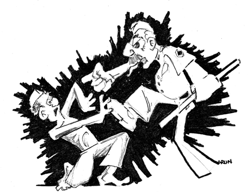

# _Hauladi_ no. 3479

## Monday, 13 August 2007

_Hi, I guess a letter from me was expected a long time ago. I have lots
of things to write but have yet to familiarize myself with the rules and
procedures out here. I received your postcards and money orders. With
the money orders you send, I can withdraw an equivalent amount in
'coupons'. These coupons, available in denominations of 1, 2, 5 and 10,
are the currency used here and I exchange them for essentials like
snacks and toiletries from the canteen. I suggest you don't make too
many trips to visit me. That
would be a waste of time and money._

_I am presently lodged in an enclosure which has two sections containing
several cells in each section. I and the persons who had been arrested
with me are the only inmates kept in one of the sections. Some cells
were emptied out, i.e. the inmates transferred to other places, so as to
ensure that only we are kept in this section. This enclosure is
infamously called the _anda_._

\ 

The _anda_ barracks are a cluster of windowless cells nestling against a
high oval perimeter wall, a maximum-security zone within the
high-security confines of the Nagpur Central Jail. To get to most cells
from the entrance of the _anda_, you have to pass through five heavy iron
gates, wending your way through a maze of corridors and pathways. There
are several distinct compounds within the _anda_, each with a few cells,
each cell carefully isolated from the others. Little light filters into
the cells. You can't see anything outside: no greenery, no sky. There is
a watchtower in the centre of the _anda_, and from the top, the yard must
actually resemble an enormous, air-tight concrete egg. But there's a
vital difference. The _anda_ is impossible to break out of. Rather, it's
designed to make inmates crack.

The _anda_ is where the most unruly prisoners are confined, as punishment
for violating disciplinary rules. The other parts of the Nagpur jail
aren't quite so severe. Most prisoners are housed in barracks, with fans
and a TV set. In the barracks, the daytime hours can be quite relaxed,
even comfortable. But in the _anda_, the only ventilation you have is
provided by the gate of your cell and even that doesn't afford much
comfort because it opens into a covered corridor, not an open yard.

But more than the brutal, claustrophobic architecture of the _anda_, it's
the absence of human contact that chokes you. In the
_anda_, you spend fifteen hours or more alone
in your cell. The only people you regularly see are the guards.
Occasionally, you get a glimpse of the other inmates in your section.
It's a situation designed to put the most robust individual under severe
strain. A few weeks in the _anda_ can cause a breakdown. The horrors of
the _anda_ are well known to prisoners in the Nagpur jail, and they would
rather face the severest of beatings than be banished to this yard.

But I wasn't an ordinary prisoner. I was a 'dreaded _Naxalite_', a '_Maoist_
leader': descriptions that appeared in the newspapers the morning after
my arrest on 8 May 2007. While most prisoners spend only a few weeks in
the _anda_ or in its cousin, the _phasi_ yard --- home to prisoners sentenced
to death --- these were the sections in which I would spend the entire 4
years and 8 months of my stay in the Nagpur jail.

***

It was a typical hot Nagpur summer afternoon when I was arrested at the
railway station. I was waiting to meet some social activists when around
fifteen men surrounded me. Some of them bundled me into a car which
drove away at high speed. I was kicked and punched by them all the
while. After five minutes, the car halted and I was carried to a room on
the first floor of a building, which my abductors later told me was the
Nagpur Police _Gymkhana_. From their conversations, it became evident that
I had been detained by the Anti-_Naxal_ Cell of the Nagpur police. They
tied my hands with my belt and I was blindfolded, so that the officials
involved in this operation would remain unidentified.

'_Maar dalo saale ko. Encounter mein usse khatam karo_,' they yelled,
threatening to kill me in an 'encounter', or extra-judicial
execution, a bluff police routinely use to
scare people they've detained.

I could hear screams from the next room. Someone else was being beaten
too. The blows were interspersed with questions and promises. '_Sach sach
bolo to chhoda jayega_' (If you tell the truth, you will be set free.)
The man wasn't even given a chance to answer before I heard his next
scream.

Through the day, I was flogged with belts, kicked and slapped, as they
attempted to soften me up for the interrogations that were to follow.
They were especially angry because no one was answering the phone at my
home in Mumbai and they assumed I had given them a false address. As it
turned out, my family was away on vacation. But how could I explain this
to people who just wanted to beat the hell out of me?

I was afraid they'd kill me. Thus far, there was nothing official about
my detention. They hadn't shown me a warrant, nor had I been taken to a
police station. I feared that the police could murder me and pretend
that I'd been killed in an encounter. I'd read about many situations in
which the police claimed to have had no option but to open fire when
suspects they were attempting to arrest had resisted. I knew that the
National Human Rights Commission had noted thirty-one cases of fake
encounter killings in Maharashtra alone in the previous five years. The
physical torture, though painful, was relatively tame compared to this
prospect.

At midnight, eleven hours after I had been detained, I was taken to a
police station and informed that I had been arrested under the Unlawful
Activities (Prevention) Act, 2004, which is applied to people the state
brands as terrorists. I spent that night in a damp cell in the station
house. My bedding was a foul-smelling black blanket, so dirty that even
its dark colour could barely conceal the
grime. A hole in the ground served as a urinal. It could be identified
by the mass of paan stains around it and its acrid stench.

I was finally served a meal: _dal_, rotis and abuse. It wasn't easy to eat
from a plastic bag with jaws sore from the blows I had received earlier
in the day. The only solution, I learnt, was to soften the rotis by
soaking them in the bag of _dal_. But after the horrors I had undergone,
these tribulations were relatively insignificant and allowed me a brief
moment to pull myself together. I managed to ignore the putrid bedding,
the humid air and the ache in my body and dozed off.

Within a few hours, I was woken up for another round of questioning. The
officers appeared polite at first but quickly resorted to blows in an
attempt to encourage me to provide the answers they were looking for.
They wanted me to disclose the location of a cache of arms and
explosives or information about my supposed links with _Maoists_. To make
me more amenable to their demands, they stretched out my body
completely, using an updated version of the medieval torture technique
of drawing (though there was no quartering). My arms were tied to a
window grill high above the ground while two policemen stood on my
outstretched thighs to keep me pinned to the floor. This was calculated
to cause maximum pain without leaving visible injuries. Despite these
precautions, my ears started to bleed and my jaws began to swell.

In the evening, I was forced to squat on the floor with a black hood
over my head as a posse of officers posed behind me for press
photographs. The next day, I would later learn, these images made the
front pages of newspapers around the country. The press was told that I
was the chief of communications and propaganda of the _Maoist_
Party.

I was then produced before a magistrate. As all law students know, this
measure has been introduced into legal procedure to give detenues the
opportunity to complain about custodial torture --- something I could
establish quite easily since my face was swollen, ears bleeding and
soles so sore that it was impossible to walk. But from the deliberations
in court, I gathered that the police had already accounted for the
injuries in the story they'd concocted about my arrest. In their
version, I had fought hard with the police to try to avoid capture. They
claimed they had had no option but to use force to subdue me. Strangely,
none of my captors seem to have been harmed during the scuffle.

That wasn't the only surprise. In court, the police said that I'd been
arrested in the company of three others --- Dhanendra Bhurule, a
journalist with a Marathi daily called _Deshonnati_; Naresh
Bansod, the Gondia district president of the Maharashtra Andhashraddha
Nirmulan Samiti (Maharashtra Superstition Eradication Committee); and
Ashok Reddy, a former trade union organizer from Andhra Pradesh. The
police claimed to have seized a pistol and cartridges from Ashok Reddy
and a pen drive containing seditious literature from me. They said we
had been meeting to hatch a plan to blow up the monument at the
Deekshabhoomi in Nagpur. This is the spot where the _Dalit_ leader Dr
Bhimrao Ambedkar and more than 300,000 of his followers had converted to
Buddhism in October 1956, seeking to liberate themselves from Hinduism's
oppressive caste system. By manufacturing a plot to show that leftists
had been planning to attack the hallowed Ambedkar shrine, the police
were obviously trying to drive a wedge between _Dalits_ and _Naxalites_.

But mere allegations would not be sufficient. They needed to create
evidence to support their claims. The police told
the court that they needed us in custody for
twelve days to interrogate us. While Dhanendra Bhurule and I were kept
in the Sitabuldi police station in Nagpur, the other two were taken to
the Dhantoli police station. Dhantoli was the station in Nagpur where
the case had been formally registered. Twice or three times a day, a
constable would come to my cell to fill in the official records: '_Naam?
Baap ka naam? Pata? Dhanda?_' (Name? Father's name? Address? Occupation?)
As he went through the routine with the man in the next cell, I realized
that it was occupied by Bhurule, the journalist from Gondia, who had
been accused in the same case as I was. We began to exchange a few words
at mealtime.

'You want a _roti_? For me, one is sufficient.'

'_Theek hai. Aap mera chawal lijiye,_' I offered, as people from Gondia
are more accustomed to rice, I thought.

'My jaws are hurting,' he said with a moan.

On the sly, we would often make sarcastic remarks about our captors,
inventing nicknames for them to amuse ourselves. From our conversations,
I realized that Dhanendra Bhurule was the man I had heard being beaten
up in the next room the day I had been detained. He was the man the
interrogators had promised to send home if he cooperated with them.

In police custody, we soon settled into a routine. Every morning, we
would be transported to the Police _Gymkhana_ for interrogation sessions
that lasted late into the night. The torture techniques varied in
intensity. I would be kept awake for almost 36 hours at a stretch or
made to stand for long periods with my arms raised by my side, parallel
to the ground. If I let them drop, a constable hit me with his _lathi_. At
times, a group of constables would descend and force me to sit on the
floor with my back against the wall. Both my legs would then be forced
wide apart and a cop would stand on my thighs
so that I couldn't bend them. My hands were pulled up and stretched,
using the window grille for leverage. All this resulted in immense
pressure on my torso and groin. Sometimes my interrogators would pinch
me or pull my hair or pierce the skin under my nails with pins.

The varieties of physical pain inflicted produced different reactions.
The pain of the piercing, hair pulling and the like would be sharp and
intense, but the body tried to and even succeeded in quickly forgetting
it. Not so the forced positions and stretches. They produced a pain so
all-encompassing and lasting that the body, try as it may, couldn't just
get over it, and would fall into a slump. My mind however refused to
submit. I could feel my anger building. 'To hell with you, I'm going to
keep quiet,' I'd find myself saying. 'I'm not co-operating.' But then, I
began to realize that the men assigned to torture me were not very
motivated. They seemed to know that I did not have anything to tell
them. They were only carrying out the instructions of their seniors to
somehow get me to give my nod to the fantastic story they had concocted.
As I stayed silent, they would get frustrated and they would get even
more violent. Instead of me breaking down, it was my torturers who
cracked as they failed to meet the expectations of their superiors.
'He's getting frustrated and he's releasing his anger by hitting me,' I
would say to myself. 'I am the person who's winning and it won't be long
before he gives up and just walks out. I just have to resist till that
threshold point.'

***

Every forty-eight hours, we would be taken to the Government City Civil
Hospital for a check-up. In 1996, the Supreme Court had made this
procedure mandatory to ensure that prisoners
were not tortured. But Police Sub-Inspector (PSI) Bhagel who accompanied
us to the hospital made sure that the doctors did not record any wounds
on paper. Bhagel would keep urging the doctors to ignore his
department's excesses because we were 'dreaded terrorists'. (I have used
pseudonyms for all government personnel mentioned in my account because
I want to draw attention not to individuals but to the brutality of the
system in which they work.)

Back at the _Gymkhana_, they repeatedly attempted to force us to sign a
statement they had drafted confessing to our involvement with the
_Maoists_. Through most of the interrogation sessions, I would have to
squat on the ground with my hands handcuffed behind my back. After a few
hours, I'd slump forward because I was so tired. But even this new
position wouldn't bring any relief, so I'd try another posture. This
cycle of twisting and turning would continue for hours, until I'd
collapse on my back from exhaustion. For the first few days, I was not
allowed a bath. The scorching Vidarbha summer had caked my clothes with
the dry salt of my sweat. The dirt from squatting on the floor hadn't
done much for my personal hygiene. Finally, three days after I'd been
detained, I was allowed to bathe --- probably because my body odour had
become unbearable for my interrogators. A couple of policemen were
assigned to watch me pour mugs of water over my body, lest I try to
escape in the nude. It didn't bother me. By then, I had become
accustomed to their omnipresent gaze. They even watched me when I was
urinating.

The Dhantoli Station officer, Inspector Kanwar, was the official
complainant in the case. However, because so many senior officers had
descended to interrogate me, Inspector Kanwar had been reduced to being
a bystander in his own lair and running
errands for his superiors. Whenever a senior issued Kanwar a command in
front of his constables, his ego was visibly hurt. He would sulk in a
corner with a long face, waiting for the moment he could assume charge
again. At the end of the day, when everyone had left, he would enter the
room to talk to me. He'd come by in jeans, drunk, and slowly settle into
a chair as if savouring the pleasure of regaining his throne. Venting
the frustration of the insults he'd faced through the day, he would let
me know in front of his constables that he was the boss and that he too
knew all that was needed to be known about _Maoism_.

'_Maoism_ has failed in China, it will never work here. We have people's
rule!' He'd say this with a smirk when he pronounced the word 'rule'.
'Don't you bastards realize the might of the government? It will crush
you easily. Why do you _Naxalites_ kill the police? Why don't you kill the
corrupt politicians?' I had once dared to reply. 'So, you want _Naxalites_
to kill politicians?' I immediately learnt that such attempts at
conversation would be injurious to my health.

At first, when he began his rants, I assumed that yet another violent
interrogation session was to follow and would instinctively withdraw
into myself. But after a couple of days, I realized that this was
actually a form of therapy for his bruised ego. I gradually learnt to
play along so that he could regain his self-esteem. This was one of my
first experiences in understanding the role seniority and prestige play
in the functioning of the police. (A few years on, I read that Inspector
Kanwar had been suspended from duty. He had apparently beaten up some
people who had come to the police station to lodge a complaint. I wasn't
surprised. Someone as authoritarian as he would never stand for an
ordinary citizen voicing their grievances.)

During the interrogations, the officers would be in _mufti_
or without their name tags. They didn't want
to risk being identified or have us complain to the court about them.
General complaints of torture are easily circumvented, but accusations
about specific officers could be a problem. This anonymity was a
violation of the Supreme Court's D.K. Basu Judgment of 1996 relating to
custodial deaths. Despite the absence of stripes and badges, watching
them talk to each other made it clear who was the boss within a few
minutes. The presence of a senior officer would force a subordinate to
stand up, straighten their back and address him as 'Sir'.

In my early days of police custody, I began to understand what
interrogation, _taaba_ (custody) and _pee-cee-aar_ meant. In legal
terminology, Police Custodial Remand or PCR refers to a situation in
which the police have authority over the accused person, a condition
that is different from judicial custody, in which the accused person is
lodged in jail on behalf of the court, awaiting trial. But in police
usage, it is a verb form of the brutal interrogation to which detenues
are subjected: '_Uska pee-cee-aar kiya_,' policemen would say, or '_Hum
tera pee-cee-aar kara denge_.' During _pee-cee-aar_, when one is lodged in
a police lock-up, one's constitutionally guaranteed rights are always
under threat. The right to silence, for one, is guaranteed in the Indian
Constitution under Article 20(3). However, every time I --- perhaps
naively --- sought refuge in this fundamental right, it would only entail
more torture.

Among my more sadistic interrogators was Abhishek Kapur, the Deputy
Commissioner of Police in charge of Crime for Nagpur. He was a strapping
young IPS officer, always striving for the favour of his seniors.
Terrorist bashing would definitely get him a few more credits. While
interrogating me, he would make it a point to make me squat on the
ground handcuffed, while he sat on a chair
in front of me. His ego would swell every time he looked down at me and
asserted that he was from Delhi's prestigious St. Stephen's College, a
statement intended to demonstrate that he was a class apart from the
other officers. But if I chose to remain silent to his questions, he
would kick my jaw with his boots. I came to realize that I had been
strategically placed so that he could use minimum effort to do so.

From the chatter of the police constables, I learnt that in 2006
Abhishek Kapur had been in charge of the zone in Nagpur where the
agitation against the Khairlanji killings had started. Indora _Basti_ is
the biggest _Dalit_ settlement in Nagpur, famous for its militant
politics. When the news spread of how four members of the lower-caste
Bhotmange family had been paraded naked and then lynched by a mob of
upper-caste villagers in Khairlanji village in Bhandara district, Indora
was the first community to erupt in anger. _Dalit_ youth gathered at
Indora Chowk, burning tyres. The police responded with a _lathi_ charge
and arrested some activists. Lower-level police staff believed that the
incompetent handling of these protests had caused the agitation to
spread through Nagpur and then across Maharashtra. Senior officers, on
the other hand, blamed _Maoists_ for organizing the agitation. I was
trapped by their spurious theory. Abhishek Kapur had a compelling reason
to claim that he'd arrested four _Maoists_ in the city within a year of
the agitation.

But it wasn't only officers of the Nagpur police who were interrogating
me. I gathered that I was being questioned, among others, by officers
from the Anti-_Naxal_ Cell, the Anti-Terrorism Squad, the Intelligence
Bureau and even the Special Intelligence Bureau of Andhra Pradesh. They
would come in batches of two to three. Their seniors would stay in the
background, designating the work of
interrogation to their juniors. The 'good cop-bad cop' routine was one
of their regular tricks. They also tried another tactic: they'd tell me
that the people they'd arrested along with me had confessed to their
involvement with the _Maoists_, so it was pointless for me to attempt to
resist. When this proved unproductive, they'd revert to their routine of
hammering me and stretching out my limbs.

This went on for ten days. When all their tactics failed, the police got
the court to allow them to subject Ashok Reddy and me to the
scientifically dubious practice of narco-analysis, lie detectors and
brain-mapping tests. They hoped to use the results of these tests to
conjure up evidence for their allegations.

We did not consent to these tests. So PSI Bhagel repeatedly used threats
and sleight of hand to try to make me sign a paper stating that 'as I
was telling the truth, I consent to such tests'. A letter of consent is
now ethically and medically mandatory, but could, in 2007, be waived by
an order of the court.

Even before detenues can undergo narco-analysis, they are put through a
series of medical tests, ostensibly to ascertain whether they are fit
enough to withstand these procedures. In reality, the tests determine
the prisoner's levels of resistance and help the authorities calculate
how much of the drug, sodium pentothal, can be administered without the
subject collapsing. These preliminary tests were conducted on us in the
city's civil hospital. Preparations got underway to transport us to the
State Forensic Science Lab in Mumbai.

But before that, we were produced before the magistrate. As Section 167
of the Code of Criminal Procedure permits the magistrate to authorize
the detention of the accused in police custody for a term not exceeding
fifteen days in the whole, the police could not obtain additional
custody in the same case. (After 2008, an
amendment in the Unlawful Activities Prevention Act has increased the
term to thirty days.) So the police registered new cases: I was charged
with being a member of an unlawful assembly, committing an unlawful act,
conspiring to do a terrorist act and being a member of an organization
that had committed a terrorist act. All these related to their
accusation that we had assembled at Deekshabhoomi to hatch a criminal
conspiracy as members of the Communist Party of India (_Maoist_), which
has been banned since 2009.

The CPI (_Maoist_) represents the most radical strand within the
90-year-old Indian Communist movement. The Communist Party of India had
been founded in 1925, inspired by the success of the Russian Bolshevik
Revolution. During British rule, the CPI had organized millions of
industrial workers and, not surprisingly, faced considerable repression.
Hundreds of CPI members were arrested and many of them were charged in
conspiracy cases. However after the British rule, the party took to the
parliamentary path and even formed a state level government in Kerala in 1957.
Differences within the party on relations with China and other
matters led to a split. This resulted in the formation of the Communist
Party of India (Marxist) in 1964. The new party also continued to engage
in parliamentary politics. However, radicals believed that this
engagement in parliamentary politics constituted an unacceptable
collaboration with an oppressive state and an abandonment of the
revolutionary struggle. After a peasant uprising in the _Naxalbari_
village of West Bengal in 1967, these groups coalesced. The CPI
(_Maoist_), formed in 2004, is a further ideological and organizational
consolidation of this revolutionary tendency. Because of the site of the
conflict to which they trace their origins, Indian _Maoists_ are also
referred to as Naxalbadis or _Naxalites_.

More than forty years after the _Naxalbari_ revolt, the _Naxalite_ movement
has emerged as a formidable socio-political, armed force in mobilising
the most oppressed Indians who have been left untouched by development.
The _Maoists_ seek to overthrow the state and replace it with a more
democratic one. As a result, the government banned the CPI (_Maoist_) as a
terrorist organisation under the Unlawful Activities (Prevention) Act
and has sought to criminalize any sympathy for the movement.

In my case, merely suggesting that I held radical beliefs was sufficient
cause for the state to invoke criminal charges. If convicted, I would be
imprisoned for life. That day, after the court hearing, we were
transferred to judicial custody.

***

On 20 May 2007, I stooped to enter the low, narrow door of Nagpur
Central Prison, which would be my home for the next fifty-four months.
It had been twelve days since I'd been arrested. In keeping with
procedure, first-time prisoners are presented before the gate officer.
Tradition, and perhaps training, demands that even the most
mild-mannered gate officer be at his aggressive best while dealing with
new entrants, who, in jail slang, are called _naya aamad_. It's one of
many Urdu words commonly used in prison, remnants of the British era.
Like all other isolated communities, the prison is frozen in time. I
realized that it is the gate officer's job to give the newcomer a crash
course in meekness and mindless subservience. The _lathi_ at his side
serves as a teaching aid.

The gate officer is programmed to verbally abuse the new prisoner at the
slightest sign that he is straying from total submission. Standing too
close to the gate officer's desk or too far,
too straight or too bent, hands behind or hands in front all qualify as
unacceptable behaviour.

The officer is supposed to enquire whether the new prisoner has suffered
injuries due to torture in police custody and, if so, record his
statement. In my case, I had a bleeding ear, swollen jaws and sore feet.
(In reality, the officer threatens anyone trying to make a complaint. By
custom, all injuries are recorded as having existed before the prisoner
was arrested.) A strip search followed, standard protocol for new
entrants to the prison. I was stripped to my underwear and ordered to
squat in a line with the other new entrants, awaiting my turn with the
man in charge of the searches, who was known as the _jhadati-amaldar_.
Every crevice of our bodies was examined and our every belonging
scrutinized before being thrown on the dirty roadway for us to pick up.
Grave hazards like packets of biscuits and _beedis_ were pocketed by the
staff.

If the prisoner's wait at the gate coincides with the entry or exit of
one of the senior jail officials, he is privileged to witness a ceremony
of colonial vintage. Senior jailers and superintendents cannot be
expected to bend low to enter through the small door, so the main gate
is swung open to allow the _sahibs_ to walk through, heads held high. When
the dignitaries are sighted at a distance, the gate guard issues a yelp
of caution: 'ALL HUP!' All staff spring to attention and all lower
life-forms are swept into corners out of sight, or forced to squat on
their haunches.

Most _naya aamads_ are then taken to the 'after barrack', where they spend
a night or two before being assigned to a permanent barrack, or 'fixed
barrack'. This waiting period allows the jail staff, _convict warders_,
in-house extortionist gangs and other sharks to assess what monetary and
other benefits they can extract from their latest prey. Middle-class
entrants and more affluent detenues are easy
targets. They are softened up with stories of the horrors of prison life
and not-so-veiled threats. Younger men are targeted for free labour and
for use as sex objects. Contacts are made and deals are struck to ensure
better treatment when the new prisoners are moved to the fixed barracks.

Next is the _mulaiza_ or check-in process. A _convict warder_ or jailer
lectures new prisoners about the value of prison discipline. The
identifying marks of each new inmate are noted and he is weighed,
measured and examined by a doctor and psychologist before being
presented before a phalanx of prison divinities, led by the
superintendent. A Body Ticket is presented to each prisoner, listing his
prisoner number and the offences registered against him. These offences
form the basis of how he will be classified and, to some extent, how he
will be treated in jail. Convicts (_kaidis_) and undertrials (_havalathis_,
commonly pronounced as _hauladi_) are counted separately. I was now
_hauladi_ number 3479 of 2007.

Even though the law states an accused person is innocent until proven
guilty, such niceties lack meaning behind prison walls. The allegations
of the police are sufficient evidence for the jail authorities to punish
even those awaiting trial. Alleged rapists are routinely targeted by
officers at the time of entry itself. One particularly macho type would
force rape accused to crawl in the afternoon sun from the gate to the
barracks --- an exercise that would quickly produce thick blisters on the
arms and knees. In the barracks they would be set upon enthusiastically
by other prisoners with the encouragement of the staff. The most
righteous ones leading the attacks were often themselves rape accused or
convicts. Such were some of the ironies of the prison 'justice'
system.

Those implicated in murder cases are compelled to wear the convict
prisoner uniform and are consigned to special 'murder barracks'. People
accused of terrorism are invariably sent to places such as the _anda_
barrack and many jail superintendents personally preside over their
beatings as a sign of their patriotism.

Before the _mulaiza_, procedure requires the new entrant to be bathed.
However, shortages of soap and water often prevent the diligent
observance of these rules. Instead, most _naya aamads_ are rushed through
the rough-and-ready hands of the _nai kamaan_ (literally, the Barber
Command), one of the work groups to which prisoners could be assigned
later. Some colonial-era jail bureaucrat with a fiendish yearning for
military discipline or a wicked sense of humour probably established the
tradition of calling each work-team a _kamaan_ (or command).

The _naya aamad_'s next stop is the _Badi Gol_, the area in Nagpur jail that
houses prisoners awaiting trial. That, theoretically, is where I should
have been headed. But in my case, the procedures were cut short. The
police report was sufficient for exceptions to be made to the elaborate
procedures. I was hurriedly put into the _anda_ barrack, given a thick
white cotton prison uniform and after a quick meal of _besan_ and chewy
rotis at 4 p.m. was on my way to Mumbai by train, along with Ashok
Reddy, to undergo narco-analysis.

***

Just before boarding the train, Ashok and I were given new sets of
clothes, our first change in twelve days. We later learnt that our
lawyers had asked a friendly police officer to help. I was also given an
old pair of rubber slippers. The cops had misplaced my sandals
immediately after my arrest and during the days in custody or travelling
to court --- the _gymkhana_ or the hospital --- I
had been walking barefoot. The baking Nagpur summer heat had made the
tar roads sizzle, so I'd have to run from the station to the van.

About a dozen brawny policemen wielding Kalashnikovs were designated to
accompany us on our journey. To be doubly sure that nothing went wrong,
we were kept handcuffed to our berths throughout the 15-hour journey to
Mumbai.

Thus far, I had not been allowed to speak with Ashok, even though he had
been implicated along with me. We would occasionally glance
sympathetically at each other whenever we were seated together in the
courtroom or at the civil hospital during our mandatory examinations.
This silence was also enforced on the train journey to Mumbai, probably
to prevent us from exchanging ideas on how to tackle our interrogators.
The first time I had a chance to talk to Ashok was when we reached Azad
Maidan police station, near Mumbai's Chhatrapati Shivaji Terminus. We
were to spend a night here before being taken for our interrogation. The
Nagpur police, led by Kanwar, had managed to secure a separate cell for
the two of us. This had involved fierce arguments with the Mumbai cops
and drawing on the influence of his seniors. However, seeing us
conversing in the lock-up, they soon realized their blunder and we were
shifted out within an hour. We were then kept in a police staff room of
the Azad Maidan police station under Kanwar's direct supervision. They
feared our conversations would affect the results of the narco-analysis
tests that were to be conducted the next day.

The day after we arrived, we were shifted to the Arthur Road Prison in
Jacob Circle. Learning that I had been brought to Mumbai, my mother,
brother and sister attempted to visit me in the prison. They were denied
permission, so they stood outside the gate
for hours, hoping to catch a glimpse of me in transit. It was not to be.
But our time in Arthur Road wasn't without its benefits. Many inmates
there gave us a briefing on the procedures of narco-analysis and
generously gave us pointers on how to muddy the results, though none of
their strategies were of any use because they didn't seem to be logical.
Nonetheless, this was an example of the respect with which ordinary
prisoners normally treat detenues accused of terrorism, considering the
political and selfless nature of their alleged crimes.

On 22 May, I was transported to an operation theatre at the J.J.
Hospital, a government institution with backup facilities for surgery.
This was essential because sodium pentothal, the drug used in
narco-analysis, can cause the heart to slow down --- fatally. The
psychologist asked me to sign some papers, which I did only after noting
my protest and the compulsion of the court order on every page.

The drug was administered like a drip, at a controlled pace, so that I
would remain in a trance for an extended time. Although the police were
not permitted to enter the room, the forensic experts used the drug with
police-like efficiency, with total disregard for medical ethics or my
health. The police had prepared a list of questions for the psychologist
to ask. As the so-called truth serum dripped into my body, the
psychologist launched into her warm-up questions. The conversation was
video recorded and, years later, I watched myself on the table: 'What is
your name?', 'How old are you?' and 'What's your birthday?', 'Where do
you stay?'

Soon the drug was taking over. I grew drowsy and my speech started
getting slurry. 'I'm feeling sleepy,' I'd often reply, so the questions
asked started getting more serious:

>Do you
>know of the CPI (_Maoist_)?
>
>_Yes_.
>
>Where do they keep their arms?
>
>_Don't know_.
>
>Have you used some kind of arms, at least for self-protection?
>
>_No_.
>
>Are you aware of any doctors or hospitals that provide services to the
>_Maoist_ group?
>
>_No_.
>
>Are you aware of any safe houses in Nagpur where their leaders come and
>stay?
>
>_No ... I don't know much about Nagpur_.
>
>So, you have any idea of their Mumbai safe houses?
>
>_No_.

The questioning went on for a little less than an hour. As my tongue got
increasingly heavier, my speech incoherent and no tangible results were
forthcoming, the psychologist began getting desperate. From questions
regarding my alleged association with _Maoists_, she moved to my beliefs.

>In all these struggles you have undertaken, what is the most extreme
>step you have taken?
>
>_I have taken ... (slur) ... morchas and rallies ..._
>
>Have you and your organization been involved in violence?
>
>_(slur) ... no ... not much._
>
>Not much?! ...
> 
>_There has been (slur) ... no need to do so ..._
>
>But if the need arose would you do so?
>
> _... (slur) ... Yes._
>
>So you have no problem with using violence for fighting for the rights
>of people?
>
>_(slur) ... Yes._
>
>Have you utilized violence?
>
>_No ... (slur)_
>
>Absolutely not?
>
>_No ..._

There it was. They finally got the proof they needed. By my own
confession, my intentions were criminal and violent. The narco was
successful and she concluded: 'Arun, you can sleep now.'

After I woke, I remembered some of the questions I'd been asked. It was
like recollecting a dream: I didn't remember all the details, but I
hadn't forgotten the highlights.

A day later, I was taken to the Forensic Science Laboratory at Kalina
for a polygraph test, popularly known as --- lie-detector test --- which
recorded several physiological parameters such as blood pressure, pulse
and respiration, while I was made to answer a series of questions. These
physiological indices were measured by sensors placed on my fingertips,
palms and strapped to my chest. The technology works on the assumption
that deceptive answers produce heightened physiological responses. But
the questions they asked were ridiculous. 'Do you know Javed, Sachin and
Jyoti?' Answering in the affirmative would mean that I knew someone
named Javed, Sachin or Jyoti who was a _Maoist_.

The brain mapping tests were similar. I was taken to a soundproof room
similar to a recording studio. Thirty-two electrodes were attached to my
scalp and I was made to listen to a series of statements on headphones,
many regarding my involvement in the alleged offences. The electrodes
would record my responses to these propositions, map the electrical
changes in my brain and allegedly determine whether I had
any 'experiential knowledge' of the event to
calculate the truthfulness of my claims. When I was finally given the
report after several months, I learnt that this purportedly scientific
test inferred that I had repeatedly lied, even about my name and being
married:

>\[Probe:\] My name is Arun Ferreira --- Nil experiential
>knowledge.
>
>\[Probe:\] I am married --- Nil experiential knowledge.

These tests were conducted on me at a time that courts dared not doubt
their scientific validity. It was only three years later, in May 2010,
that a three-judge bench of the Supreme Court headed by the Chief
Justice held that the use of narco-analysis, brain-mapping and polygraph
tests without the consent of the subject was unconstitutional and a
violation of the right to privacy.

After almost a week in my hometown, I was brought back to the Nagpur
prison by road. The police, meanwhile, prepared themselves to charge me
with more cases so that they could continue to hold me in custody and
_pee-cee-aar_ for some more time.

***

From 28 May to 14 June 2007, I was slapped with five more cases relating
to _Naxalite_ violence in Gondia, a district about 150 kilometres from
Nagpur. Gondia and especially Gadchiroli, the other district lying at
the extreme end of Maharashtra, are areas of intense _Maoist_ activity. In
almost all of Gadchiroli and parts of Gondia, armed _Naxal_ squads have
fought the police and paramilitary forces with support from the local
tribals and peasants. This is in keeping with the _Maoist_ strategy to
establish revolutionary centres in rural areas in the hope of eventually
growing to seize power throughout the
country. It is no coincidence that these districts are also among the
poorest areas in Maharashtra. In 2011, Gadchiroli had the lowest ranking
on the state's Human Development Index.

The five new cases allowed the police to get me back into their custody
for another twenty-three days, till 19 June. I was shifted to Amgaon, a
police station in the interiors of Gondia, where I was subjected to more
sleep deprivation, harassment and interrogation. This time though, I was
fortunate to get away relatively lightly. But my co-accused were not so
lucky. The police, under the direct supervision of the sub-divisional
police officer, a man named Korate, injected petrol into the rectums of
two of them. A couple of staff lifted their legs while an inspector
infiltrated the 20 ml of petrol into their bodies. The vapours of
gasoline burned the intestine linings, which resulted in agonizing days
of anal bleeding, blood clots and continuous belching. I wonder how
Korate knew that exactly 20 ml of petrol would cause such enormous pain
yet not kill. Such knowledge could only have been acquired by some sort
of training. Ashok Reddy did manage to complain to the court about this.
However the state-appointed doctor, obviously a friend of Korate's,
diagnosed Ashok's condition as piles and exonerated the officer and his
accomplices.

I was, for reasons best known to them, protected from such treatment.
The police would come by to interrogate me every couple of
days --- whenever they got a list of questions from a superior. When I
didn't reply to their first question, they never got further down the
list, and that's where the torture would start.

'_Arre, Bajirao ko bulao_,' the inspector would call.

A narrow belt attached to a wooden handle would be
brought in by a constable --- an implement
that policemen across Maharashtra fondly call '_Bajirao_'. It takes its
name from Peshwa Baji Rao, a lieutenant of Shahu _Maharaj_, a ruler who is
credited with greatly expanding the Maratha Empire. Maharashtra's police
personnel, largely dominated by the Maratha caste, find this instrument
similarly trustworthy. The _Bajirao_ belt was deployed carefully, only on
the palms or soles of the feet. When whipped, the cluster of nerves at
the heel pad causes enormous pain but displays no external injuries, so
I wouldn't have any proof if I tried to complain to a magistrate.
However, doctors know that such foot whipping can cause permanent nerve
damage. It reduces the elasticity of the heel pad causing agonizing
aches, especially on cold nights, for years afterwards. Such torture,
though not so visible to the naked eye, leads to irreversible harm to
the body.

Once in a while, often due to the inexperience or over enthusiasm of the
torturer, this permanent damage extends to death. No wonder Maharashtra
still retains its privileged position of having the highest number of
custodial deaths in India. It recorded 22 in 2011, way ahead of Gujarat,
which came next with 7 deaths. Invariably, the government's National
Crime Records Bureau (NCRB) attributes these deaths to natural causes or
to suicide. People like Korate and his seniors are never held
responsible.

***

After 23 days and nights in the Gondia lock-up, we were brought back to
Nagpur jail. For the first time in the month-and-a-half since my arrest,
my family was allowed to meet me. My father and brother in Mumbai had
contacted my lawyer, who had arranged for them to meet me at the court.
I heard about their side of hell. They told
me about their shock at seeing my name and photograph in the papers, and
of reading the police descriptions of the violence in which I had
allegedly been involved. At first, my brother and sister had desperately
tried to hide the news from my ageing parents, but weren't able to do so
for very long. They told me that soon after hearing of my arrest, my
wife, a lecturer in a Mumbai college, had fallen off a motorcycle and
bruised her face badly. I heard how the police had searched our home,
seizing books and dismantling our computer. They also seized my wife's
sociology books and my 2-year-old son's CDs of nursery rhymes as
'incriminating' evidence. On the sly, the police had pocketed digital
watches and pens.

Most of the time that day at court went in getting my father and brother
to believe that I hadn't committed the blasts, murders and other violent
crimes of which I'd been accused and which they'd read about in the
media. The reports had parroted the police line, with little regard for
the truth. For instance, the _Mumbai Mirror_ had reported on
11 May:

> ... Nagpur police which carried out a search at Ferreira's
residence on Wednesday ... maintains that he is a high-ranking leader of
the banned organization Communist Party of India (_Maoist_) and that in
his capacity as chief of propaganda for the ultra-left outfit, he was
responsible for spreading violence.

The little time I had with my family in court was insufficient to
clarify all their doubts. The next 4 years and 8 months would also prove
insufficient.

My brother told me that a group of college friends and well-wishers in
Mumbai had got together to campaign for my release. Well-attended
meetings were being organized, which used my case to prove that
narco-analysis was just another form of
torture. But their efforts were crushed when the Nagpur city Police
Commissioner threatened to arrest my friends if they attempted to meet
me in jail. My family had approached many government bodies such as the
State Minorities Commission, State Home Department and high-ranking
police officers. However, other than empty promises to look into the
matter, they had nothing to offer.

Soon, my life acquired a predictable pattern. The police would implicate
me in new cases, obtain custody to interrogate me, inflict terrible
torture on me, fail to extract a confession, return me to jail, only to
involve me in yet another case. After two months, I had six cases
registered against me. It was only when the police finally filed charge
sheets, laying out evidence for why I should be prosecuted, that I had a
new routine. It involved making weekly or sometimes daily trips to court
to wait for the cases to be heard. The initial shock dissipated and I
started getting accustomed to the luxury of contemplating the myriad
rhythms of prison life.
