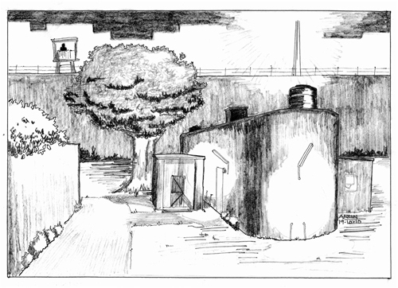

# The _Anda_

## Saturday, 8 September 2007

_Legally I have been implicated in six cases till now. I don't think this
number will increase. However, due to the arrest of two more political
dissenters \[Sridhar Srinivasan and Vernon Gonsalves, both in their
mid-fifties\] in Mumbai who the state now regularly refers to as
_Maoists_, my name has once again begun to appear in the newspapers. Guess
this is going to be a regular feature; I might as well start getting
accustomed to it._

_Your letter mentions how this year has taken a heavy toll
on the entire family. This is not
far from the truth. However, remember the strong get through
difficulties, victorious and even stronger. It is the weak who collapse
and give up hope. I don't think you have taught me to be the latter.
Keep writing, your letters help._

\ 

Letters to my family were not only a medium for communication but also a
pretext for mutual consolation. On the arrival of my messages, my wife
would come to Bandra almost immediately to meet with Mom and Dad. My
elder brother and sister who lived nearby would drop by too and my
letter would invariably result in a family discussion. The children
playing in the adjoining room were oblivious to the problems the family
was facing.

Bandra, a former suburb of Mumbai, but now part of the expanding city,
was the place of my birth and where I grew up. As a schoolboy, my
worldview was limited by the boundaries of this suburb, a righteous
Christian upbringing and the impractical, lofty aspirations of a typical
middle-class family. I had my first brush with social activism as a
student at Mumbai's St. Xavier's College in the early 1990s. I'd
organized camps in villages and welfare projects for the
underprivileged. Through such camps I became exposed to the harsh
realities of India and the limitations of charity. I clearly recollect
an encounter at a camp in Talasari in Thane district in 1991 where we
spent our days enthusiastically building a road for the villagers. In
the evenings, we would chat with the residents or have cultural
performances for their entertainment and education. When I visited a
house in the _Dalit_ _pada_ (hamlet), one resident asked me why we were
holding the camp. I proudly told him it was to build a road so that they
could reach the market more easily. He told me that the location of the
road we were constructing would allow only
the _sarpanch_ and other members of upper-caste families to get to the
market. The majority of the villagers, especially the poor and the
_Dalits_, would still use the old _kuccha_ road. I was unintentionally
deepening an already existing social division.

Indian society, I realized that day, was fractured by class and caste
and riddled with innumerable contradictions. Power vested in the
economic and social elite, and the benefits of development flowed
disproportionately to them. Unless these structures were changed,
charity would be meaningless.

The communal riots of 1992--1993 that followed the destruction of the
Babri Masjid in Ayodhya really shook me up. The riots had caused
thousands of Muslims to be displaced in their own city. I was in my
final year of college, soon to become a Maths graduate. A group of us
from St. Xavier's decided to work with a housing rights organization
that was running relief camps for Muslims. The callousness of the state,
which allowed the Shiv Sena to conduct this pogrom unimpeded, could not
have been on better display. The Shiv Sena and other Hindu
fundamentalist mobs acquired voter lists so that they could
systematically target Muslims, while the police threatened to fire on
any sign of resistance from the victims. Thousands of Muslim houses were
burnt and the residents were shifted to relief camps and community
centres. In such a surcharged atmosphere, to speak of fighting the
oppressors would be seen as an act of communal violence. The least we
could do was to collect clothes and funds to help the victims put their
lives back together.

Kartik Pannalal, a former student of my college, was a friend during
these times. He had left his family's diamond business to work to build
a just society. He regularly visited St. Xavier's to
organize the college canteen workers who
were agitating for their rights, including the right to unionize. He
helped them stage several strikes and we tried to get the students to
support them. I'd spent long days in college involving myself in the
lives of the workers, having heated discussions with student union
leaders and then in the evening, chatting with the workers and
discussing working-class issues over endless cups of _chai_.

Through Kartik, I came to realize that there were many more like
us --- organizations and movements across the country and around the world
that were working with the same ideals. I joined one such revolutionary
student organization, the Vidyarthi Pragati Sanghatana (VPS), which had
units in several colleges. It had student committees in Mumbai, Nagpur,
Nashik and Chandrapur and also a state-level committee. The VPS was a
member of a national organization called the All India Revolutionary
Students' Federation. The activities of the VPS centred on the struggle
for a democratic, scientific and egalitarian educational system. But
education, like all other aspects of society, could not be transformed
in isolation. Hence, we would strive to build and support other
struggles aiming at the radical transformation of class and caste
society.

Even though the Western world was tom-tomming its so-called victory over
Marxism as the Soviet Union disintegrated, I was getting attracted to
the ideology. Stories of the French Revolution as well as the Russian
and Chinese revolutions impressed on me the true potential of the
oppressed to effect social change. Society needed qualitative leaps or
revolutions to bring about change and the present world order wasn't the
end of history. Unfortunately, my co-traveller on these intellectual
journeys, Kartik, died in a road accident in Delhi in June 1997. He was
on his way back from a fact-finding enquiry into
military excesses in the Kashmir valley. He
was only 29. Society had lost a committed civil-liberties activist and
I, a great friend.

While in the VPS, I had the opportunity to meet with youth from diverse
backgrounds, especially from the working class and lower castes. Many of
them inspired me with their talent and zeal to change society. The more
oppressed they were, the greater their commitment. We organized many
struggles against fee-hikes and against a proposed University Bill that
would do away with elections to student unions and select
representatives based on academic merit. But the Bill was enacted in
1994, and landed a major blow to student politics in Mumbai. Student
unions became student councils and were deprived of any autonomy.

The VPS also managed to highlight the corruption of Dr S. D. Karnik, the
pro vice-chancellor of the Bombay University, and successfully organized
students to demand his ouster in 1995. We organized annual
'go-to-the-villages' campaigns across western India to help the
dispossessed assert their rights. In the Nashik campaign, we
supplemented the efforts of tribals who were organizing against the
atrocities of the Forest Department. In Dabhol, we took part in the
struggle of villagers who were resisting the Enron power project. In
Umergaon, Gujarat, it was the fisherfolk who were protesting their
imminent displacement by a gigantic, upcoming port.

Looking at all these struggles up close made me aware of the true
potential of peoples' movements as agencies of change. Real change meant
questioning the unequal relations of power and organizing the people to
claim their rights themselves. These struggles showed me how the state
was the principal tool of oppression. The state institutionalized
oppression. The violence it perpetrated crushed any challenge. As a
result, many sincere peoples' movements such
as the _Naxalite_ and secessionist movements in Kashmir and the Northeast
had to evolve militantly in order to survive. In such a situation, I
could not condemn the militancy of these groups. It had a historical and
political context.

After college, I continued for a couple of years in the student movement
and later, I joined the _Naujawan Bharat Sabha_, a youth organization that
got its name from a body founded in 1926 by the revolutionary freedom
fighter _Shaheed_ Bhagat Singh. In the late 1990s, the _Naujawan Bharat
Sabha_ was involved in the struggles of Mumbai slum dwellers protesting
the demolitions of their homes. At that time, the city was witnessing a
series of slum demolitions as a result of the Slum Rehabilitation Scheme
announced by the newly elected Shiv Sena government. It allowed
developers to build luxury towers on slum land. The timing of this
scheme coincided with a spike in property prices, so construction
companies were eager to get to work as soon as possible. Slum dwellers
took to the streets. We helped mobilize them and organized agitations
along with many other groups. I stayed in these _bastis_ for weeks.
Organizing struggles, I realized, was not only compelling but also
absorbing.

This was also the time when globalization began showing its ugly face
and people all over the world began to take to the streets. The Seattle
movement in 1999 and the militant Genoa mobilizations in 2001 against
the World Trade Organization and G-8 summits inspired us. Many of us in
the city and in Maharashtra were keen on building similar, broad
anti-capitalist peoples' movements. To do this, organizations and
activists across the state had to be contacted and consulted. I involved
myself in this task.

After the World Trade Center attack in New York in 2001,
however, there was a change in the way
peoples' movements came to be perceived. The so-called 'War Against
Terror' made security a key aspect of state policy. In India, special
laws were promulgated to squash inconvenient truths. Organizations were
banned, opinions were criminalized and social movements were branded as
terrorist. Those who supported the right to self-determination of
Kashmiris or of the peoples of the Northeast were termed _anti-national_.
Muslims who battled against Hindutva were termed _jihadis_. Those of us
Marxists who worked to organize tribals or the oppressed were easily
labelled as left-wing extremists. The VPS, _Naujawan Bharat Sabha_ and
other organizations I had worked with were systematically targeted. Just
as it had in colonial times, the _Naujawan Bharat Sabha_ again faced a
ban.

In 2005, Prime Minister Manmohan Singh declared that _Maoists_ were
'India's greatest internal security threat'. Some were '_encountered_' or
'disappeared', while others were arrested. In places like Chhattisgarh,
Jharkhand or Vidarbha in Maharashtra, left-leaning political
organizations were branded as _Maoist_ and dealt with accordingly. In the
months before my detention, many _Dalit_ activists in Nagpur had been
arrested on the charges of radicalizing the _Ambedkarite_ movement by
infusing it with the politics of _Naxalism_. Some of them had previously
been associated with the Nagpur unit of the VPS. All this meant that I
wasn't entirely unprepared to be arrested.

Still, even though I'd contemplated this hypothetical situation, I
wasn't completely prepared to become a target of these excesses
myself --- to be arrested, tortured, implicated in false cases with
fabricated evidence and to be locked away in prison for several years.

## 8 September 2007 (Contd.)

_The old TIME magazines you sent were great. I also received the
sweaters you had sent. The other clothes were loose. I have probably
lost weight during police custody. I now eat dinner at 6.30
p.m. and I am off to sleep by 8 p.m. --- can't afford to allow the food to
get any colder. My court visits continue. However since many of the
dates overlap, the frequency of these trips has reduced. I have run
short of some good reading material. Try sending me some by post or
whenever someone comes next._

\ 

My letters from prison had to pass through various layers of officialdom
before they finally reached the post box. The guards would first make an
entry in their register before sending the letter to the jailer in
charge of the barrack. An inquisitive guard would always comment on its
contents, especially if the letter was in English, I suspect to prove
his own command over the language. The mention of an inmate in my letter
could very well be the next topic of gossip or the cause of the next
argument, so I had to be careful. The jailer would then censor the
letter. Material that criticized the administration was obviously
discouraged. We would be summoned and lectured on how such writing would
incite prison disrespect and indiscipline. Disparaging remarks about the
jailer could not even be contemplated. In our high-profile case,
photocopies of our letters were filed away, to be shown periodically to
the Anti-_Naxal_ Department of the police. Once, the jailer insisted I
remove criticism of the prime minister from a letter. 'Rule 12 of the
Prison Manual states that "political matters are not to be discharged at
interviews" and in letters,' he asserted. Hence, comments in letters had
to be framed with some deliberation. I had
to stick to the facts as far as possible. But how could I hide my
emotions? That is what my family wanted to hear. Initially, I used
cryptic terminology, but as the years passed by and I grew familiar with
the system, I began to disregard the snooping eyes.

The two-star jailer of the _anda_ was Nagdev Pawar. His seniority in the
department should have given him the post of a three-star, or senior
jailer, but he had once been suspended because he'd been accused of
beating an inmate to death. This, I found out, was a regular practice in
the prison department. Almost all officers had been accused of misdeeds
at some point in their careers. Corruption and negligence in duty were
the most common charges. Allegations such as torture and beatings would
rarely result in an officer being suspended unless this had led to the
death of a prisoner. Even if he was suspended, it barely seemed to
matter. The case would continue for years and, after being acquitted,
the officer would be reinstated with full back-pay. Moreover, because of
a shortage of jail staff, the administration would often summon staff
back to duty even during their period of suspension.

Nagdev Pawar's _de facto_ seniority in the Nagpur prison gave him
additional responsibilities and also immunity. He'd visit the _anda_ only
before the superintendent's weekly round. Strolling in, with his pants
pulled up almost to his chest, he would casually enquire if we had any
requests or complaints. He had a very strange way of dealing with our
grievances. Whenever we complained of the poor food or the fact that the
same vegetables were served at every meal for days on end, he'd reply
that he had to cope with the same situation in his _sarkari_ quarters. His
experience from all his years of dealing with inmates had obviously
taught him that since he couldn't solve our
problems, he'd be better off claiming to share them. Either this was
true, or he was actually skimming off our prison rations.

As the four of us co-accused (or _numberkaari_, in jail terminology) were
all socially aware, we were quick to respond and react to the
absurdities and injustices that were commonplace in the prison system.
This is what we all had done earlier and it united us behind bars. One
of our first struggles with Nagdev Pawar and the prison administration
was to obtain a copy of the Prison Manual, which determined every detail
of how life should be conducted in jail. At first, the administration
ignored our plea and later claimed that they didn't actually possess a
copy. This was ridiculous, the Prison Manual was their rule book after
all. Like the Penal Code and Criminal Procedure, rules for prison
administration were first codified by the British in the latter part of
the nineteenth century. The Prisons Act of 1894, adopted to keep unruly
natives under control, remains the guiding protocol for prison
administration long after 1947. After the Constitution came into effect
in 1950, the administration of prisons became the responsibility of
state governments. In the years that followed, the Maharashtra
government enacted numerous new prison rules. These, along with the
Indian Prisons Act, are collectively known as the Maharashtra Prison
Manual. British jail officials were known to have denied prisoners any
access to the Prison Manual. Nagdev Pawar and Co. seemed to want to
continue this colonial legacy by denying us a copy of the rule book.

***

Life in the _anda_ makes one crave for news of the outside. There was one
particular spot in the _anda_ where we could view a few
leaves of the trees beyond the wall.
Instinctively, that became the spot where the four of us _numberkaari_
gathered to chat before _bandi_ --- just before sunset --- when all the
barracks were locked for the night. In the absence of an alternative,
frequently narrated stories became a source of great amusement. We would
try to start a conversation with Chandu of the _danda kamaan_ who came to
clean the toilets, or members of the _jhadu kamaan_ who came to fill water
in our _peepas_ --- the 15-litre tin cans in our cells --- when the regular
supply failed. The _jhadu kamaan_, if offered a _beedi_, would chat till
they were exhausted. To encourage these precious snatches of
conversation, we began purchasing smokes from the prison canteen.

Lean and middle-aged Chandu would, every morning after the opening of
_bandi_, waddle in with a garbage pail in one hand and a broom in the
other to empty the _jhootan_, the leftovers. He would bring life into the
_anda_ every morning with his rustic chatter, filling us with news of
barrack life the night before. On his evening trips, just before _bandi_,
he would be much more relaxed and had longer to chat, as his _danda
kamaan_ team were the last to be locked up after they'd cleaned the
prison-yard toilets. Chandu was from a village in Nagpur district and
had been convicted for a murder he had committed on behalf of a friend.
Though the friend was acquitted, Chandu was jailed for life. He was the
first to educate us about various jail procedures and how to get around
the most cumbersome of these. Through him, we were able to communicate
with the handful of other prisoners accused of being _Naxalites_ and who
were also clients of my lawyer.

Javed Gulam Hussein, a fellow inmate of the _anda_, had another method of
breaking the monotony. He was a Pakistani in his late forties convicted
in a bomb blast case in Mumbai in 1998. The
police had claimed that he was part of the group that set off five bombs
on the railway tracks that year. Although no lives were lost in the
explosions, the trial court sentenced him to 'double life', with no
pardon whatsoever --- two life sentences that were to run consecutively.
He could stay in for more than 70 years. Initially, Javed's dark, sunken
eyes, _Pathan_ physique and long beard terrified me. But I would later
learn that this Rawalpindi native was harmless and homesick most of the
time. He would regularly express the deepest of his emotions in
beautiful Urdu _shayiri_.

Javed had come to tour Mumbai in his youth and was arrested from a lodge
in 1998 just after the blasts. With no contact with his family, his
cravings for the outside world were chronic. Almost every other day, he
would complain that he had developed an allergic rash and needed to be
immediately taken to the prison hospital for treatment. Often, these
complaints flared up into arguments with the guards. However, if he was
allowed the trip to the prison hospital, he would be back a different
man. He'd be calmer. Meeting the doctor or getting medication was
irrelevant. Making human contact was what mattered.

It didn't take long for the prison food to become monotonous. Though the
dietary allocations had last been amended by the government in 2005, the
timings laid down in the Prison Manual for serving the meals remained
the same. British-era rules called for all activity to commence only
after sunrise and end before sunset. The jail menu and its schedule were
quite precise.

>\[7 am:\] 80 ml morning tea.
>
>\[7.30 am:\] Breakfast of _upma_, _poha_ or _sheera_, depending on the
>day of the week, with 100 ml milk.
>
>\[8 am:\] Court _bhatta_ i.e. lunch for those scheduled to go to
>court.
>
>\[10 to 11 am:\] Lunch or _dopahar bhatta_ for the others: three
>_chapattis_, rice, _dal_ and a vegetable, brought one after the other.
>
>\[2 pm:\] 80 ml afternoon tea.
>
>\[3 pm to 4 pm:\] _Shyam bhatta_, the same as lunch.
>
>\[4.30 pm:\] One banana.

The food distribution was done by the energetic _taapa kamaan_, one of the
many prisoner-teams that play a vital role in keeping the jail
functioning. The _taapa kamaan_ were busy from the 'opening of _bandi_', as
wake-up time was known, at around 6.45 a.m., until _bandi_, around 5 p.m.,
running around with large food containers --- the _taapas_ from which they
take their name. Two thousand stomachs demanding their timely due could
be a tense proposition and the _taapa_ workers were a harried lot. They
had to ensure that every Manual-prescribed item reached each barrack in
sufficient quantities to supply the stipulated amount to every prisoner
who was present at the morning counting.

Between each meal, the containers had to be cleaned out and readied for
the next meal, so the _taapa_ worker knew no rest. Their work was heavy
and the smallest mistake or delay could invite curses or worse from the
_bhais_ of the barracks. Their only fringe benefit was that they were
assured their full entitlement of food, a privilege often denied to
those lower down the chain.

The prison kitchen or _bhisi_ worked in two shifts. Modern kitchen
equipment could have made these tasks easier, but the availability of
cheap and often unpaid labour favoured economies hostile to
capital-intensive processes. The only somewhat-modern device was the
machine for kneading _atta_ for _chapattis_. Vegetables were cut by women
prisoners. The _bhisi kamaan_ carted
provisions from the godown to the kitchen, made the tea, prepared
breakfast, rolled and cooked the _chapattis_, rice, _dal_ and vegetables,
and later washed the huge vessels.

Within this unit, the post of _taapa_ commander could be quite a lucrative
assignment. The commander was normally a _convict warder_, a long-serving
prisoner who was given the duty of an overseer. He was paid ₹35 per
day, but could earn a healthy side income by trading the resources under
his command. By manipulating distribution, he could generate a surplus
to be placed on the open market. The _bhais_ who paid him off got more,
and better, food. But the _taapa_ commander's privileges paled in
comparison with the deals the jail officials struck with the contractors
who supplied raw materials to the kitchen. Many middle-level jail
employees were able to take enough prison supplies home to feed their
families.

These leaks in the supply lines resulted in the depletion of food we
prisoners were served. In order to ensure that portions met the
stipulations of the Prison Manual, even the most inedible bits of
vegetable made their way into our _thalis_ --- this could even include the
rope suppliers use to tie the vegetables together.

As a result, we were forced to improvise our way around tasteless meals.
One way out was to re-cook the food by spicing it up with pickles and
chilli-garlic powder purchased from the prison canteen. This process was
called _handi_, after the cooking pots we fashioned out of aluminium
plates. We would fabricate a fireplace with bricks or by chiselling and
reshaping other aluminium vessels. Strips of newspaper and sun-dried
_chapattis_ were used for fuel, but sometimes bits of plastic, dry twigs,
old clothes, pilfered prison bedding and even copies of legal documents
found their way into the hearth.

_Handi_ was also the term for the group of prisoners who took their meals
together. They pooled the provisions they bought from the canteen and
foraged from elsewhere. In the barracks, all the members of a _handi_
group (who were called _handi-waale_) sleep in one place. For people like
me, locked individually in different cells, eating dinner together was
not possible. Still, we ensured that the food cooked in one cell was
passed on to the others. This was managed through a device called the
_gaadi_. The dishes would be placed on a piece of cloth that was dragged
along the ground by using a string thrown from one cell to the next,
rather like a sleigh.

Work was another way to relieve the monotony of prison. Convicts serving
terms of rigorous imprisonment were paid for the work they performed at
three different rates, depending on the tasks they had been allotted.
But given the meagre wages, everyone was always looking to see what they
could skim off the top or the bottom. For instance, the _nai kaaman_
usually dished out military haircuts and bloody shaves. But for friends
and paying customers, they could be persuaded to offer varied
hairstyles, trimmed beards and shaped side-burns. Such embellishments
salved, if not salvaged, egos bruised and battered by the realities of
an existence behind bars. Another source of income for those in this
_kaaman_ was the sale of shaving blades. Only a few jails allowed blades
to be sold in the canteens, because these could be used as weapons. This
created an enormous demand for razors from prisoners wary of HIV.

The _factory kamaans_ produced products in the prison workshop that were
sold beyond the jail gates. They toiled on power-looms, handlooms, doing
tailoring, iron-work, woodwork and even farm work. The _jhaadu kaaman_ was
the team with the task of sweeping and cleaning all the common
areas such as the grounds and godowns. While
the regular team was quite small, their workforce swelled each morning
with the forced induction of the _naya aamads_. Since this new lot could
easily be pushed to do free labour of any sort, they were normally put
under the _jhaadu kaaman_, to cut grass, clean, and carry loads. The
regular _jhaadu kaaman_ sweepers donned the officious air of supervisors.
Choice abuses, dark threats and an occasional cuff on the ears ensured
that most of the _naya aamads_ toiled in earnest.

These procedures did not apply to regulars who had made previous trips
to jail. They were more involved in re-establishing old contacts,
impressing new ones, and arranging for creature comforts for their
latest stint inside. These were the _kaala topis_, a term that arose from
the black caps that habitual offenders were once forced to wear. The
black cap has been dispensed with but the term is still applied to the
canny souls who thrive on their knowledge of the intricacies of jail
life. An important aspect of this involved knowing your place in the
jail pecking order determined by how long you'd been inside, the number
of trips you'd made there, the severity of your crime and, above all,
proximity to the _bhai_.

Each barrack had its _bhai_ to whom all lesser mortals claimed (or aspired
to) proximity. Those who managed to get close to the _bhai_ could hope for
some alleviation of discomfort in the form of a cleaner or full set of
_bistar_ (bedding). Though the Prison Manual prescribed that the _bistar_
allocated to each prisoner should include a _dhurrie_ --- a bedsheet, two
cotton-wool blankets in winter and a pillow with pillow-case, the _naya
aamad_ could consider himself lucky if he managed to get a single
tattered, filthy blanket or _dhurrie_. And even if he did obtain a
_dhurrie_, this did not ensure that the _dhurrie_-possessor would find the 2
ft x 6 ft floor space needed to lay it out
on --- because the barracks, designed for seventy-five prisoners, were
occupied by more than 200. This was another thing that a _bhai_ could fix.

Since the prime space --- against the walls --- had already been taken up by
earlier occupants, the only space for newcomers lay in the passageway,
between the sleepers. As long as others were awake and eating, this
passageway was crowded with the activity of those moving to and from the
TV, toilet, washing-place and garbage can. It was only late at night,
when this traffic died down, that the thoroughfare could be cleaned up
and the _beech-bistar waale_ finally wriggle into their wretched spaces.
In such circumstances, finding sleep was like chasing a mirage. You
almost reached it but were never quite there.

That is not to say that the side-_bistars_ who managed sufficient floor
space under the fan or near the window, due to seniority or services in
cash or kind, were well off. Harsh lights shining through the night
ensured that sleep could never be soothing and relaxed. There were also
the regular yells of the night sentries. Despite the barracks being
locked at night, security demanded that _convict-watchmen_ patrol the
length of the barrack. The jail staff on the outside came by ever so
often to check on the sentry and the prisoners, taking care to note the
presence of special inmates such as _Naxalites_ and _lal topis_, literally
'red hats', people who had attempted to escape and were identified by
the red arm-bands sewed on their prison uniforms. After reassuring
themselves that all was well, they would yell out a list of the numbers:
'_Tre-chalees kaidi, ek-sau-pachattar hauladi, athaara Naxalwadi, char
lal topi, total do-sou-chalees. Sab khairiyat hain_.' This ritual was
designed to ensure that the watchmen were not asleep, but provided a
steady stream of interruptions to all but the heaviest
sleepers.

But even the deepest sleepers sometimes had to surrender to the other
sounds of the prison night. With each inmate living through his own
private nightmare, moans, groans and sobs from adjoining sleepers were
frequent. The awakened neighbour usually slapped the offender into
silence. But not all troubled souls were so easily subdued. There were
those who pierced the night with shrill screams and shrieks and were
usually beaten up before they quietened. The screamer, who actually
needed psychiatric help, didn't even get sympathy. As the whole barrack
was roused, the more vicious types joined the watchmen in beating and
kicking him. Many believed it to be the only possible therapy to
exorcise the devil which had taken possession of the troubled man. In a
while, he was silenced and relative calm descended once more. But sleep
was elusive as each prisoner strained silently to hide from his own
demons. As seconds and minutes dragged on, there was no clock to tell
the time. Another hour forfeited, never to be returned.

***

By the end of June 2007, the results of the Mumbai narco-analysis tests
had come in. They failed to provide any support for the case the police
were trying to build so the authorities got the Gondia Court to order
another round of tests on Ashok Reddy and me. They obtained this order
without informing us, thus denying us the opportunity to oppose it. This
time, we were headed to the Forensic Science Laboratory in Bengaluru.
The Gondia police decided to transport us there in September by plane.
Our arrests had obviously resulted in budgets being increased.

Ashok Reddy and I were transported on consecutive days. The Gondia
police had already informed the authorities at
the Nagpur and Bengaluru airports of the
dangerous nature of the cargo they were escorting. Indigo, the airline
by which we were travelling, had been instructed to keep the last five
rows of seats vacant. Karote of the Gondia police accompanied me. He was
seated right beside me, in the last row. Flying rules did not allow him
to carry his pistol. When I was in his custody at Gondia, he'd never
miss an opportunity to brandish his firearm, so this made him feel
uncomfortable. The other passengers on the flight were initially
confused and angry about being barred from using the toilets at the
rear. One of the air-hostesses was allotted the job of hiding from them
the real reasons for this inconvenience, and apologizing for it. Their
arguments kept me entertained through the 90-minute journey. At
Bengaluru airport we were received by a team of armed security
personnel, the passengers realized I was a VIP or a dangerous criminal.
My shabby clothes pointed more towards the latter.

In Bengaluru, the tests were conducted by the notorious S. Malini, who
in February 2009 would be dismissed from duty when it was discovered
that she'd submitted false papers when applying for the job. Malini was
well regarded by police officers across India because she always managed
to get them the results they wanted. She had apparently solved the
Malegaon blasts case of 2006, the Mecca Masjid blasts case and also the
Samjhauta Express train case. All these would later be proved to have
been falsely investigated, with the blame put on innocent Muslims.

During narco-analysis, she slapped and abused me, pinched my ears with
pliers and administered electric shocks to my co-accused to keep us from
slipping into unconsciousness. Her method of conducting these tests was
even more barbaric than the procedures followed by the Bombay
laboratory.

A report about one of the Bengaluru tests eventually made
its way to the press and I later read the
headline: '_Maoist_ Arun claims that the Shiv Sena supremo funded him.'
Malini had asked which organizations I worked with as a student
activist. I had mentioned the student wings of various political
parties. It is evident that she was not aware of the Maharashtrian
Nativist Party and considered its student wing a _Maoist_ front. I imagine
that the Shiv Sena and its leader, Bal Thackeray, were as surprised as I
was by these findings.

I was brought back to Nagpur by train. Within a few days, Korate had
Ashok Reddy and me charged in another case relating to an incident of
arson in Gondia. The two activists arrested in Mumbai a little after I
was taken in, Sridhar Srinivasan and Vernon Gonsalves, had been
arraigned in this case and Korate was generous enough to include us in
it too. We were all accused of setting fire to a rail engine in the
forests of Gondia.

## Saturday, 27 October 2007

_I decided to write immediately after arriving from Bengaluru, but then
I was taken to Gondia in a new case. I heard from an official at the
Forensic Science Laboratory that one of you came to meet me there. The
cops did not allow it. Probably they thought you were attempting to
abduct and take me home! Try pursuing the Forensic Science Laboratory to
give us a copy of the report of their tests. Legally I have been
implicated in seven cases till now. In the Nagpur case, the lawyers have
filed for bail in the High Court. In the other cases of Gondia, some
charge sheets have been filed. The procedure for visiting me is not so
simple from what I gather. One possibility is at the Nagpur Court on the
date of my hearing. However, the scene out there is a big
commotion with many guards,
high-profile case, blah, blah, blah. The other possibility is to meet me
at the prison. You will be given about 20 minutes with a wire mesh
between us. You will not be allowed to give me eatables and will have to
get an ID card along, as they would want to verify the persons visiting
me. Such procedures are only for my type of undertrials._

_Nights out here are always the time for contemplation. The loneliness
compels me to recollect the yesteryears and doze off with those
memories. That is the beauty of one's imagination and dreams --- no four
prison-walls can ever contain them._

\ 

By the end of 2007, six months after I'd been arrested, I had been
charged in seven cases: one in Nagpur and the other six in Gondia. The
Gondia cases dealt with _Naxal_ attacks that I was charged with being part
of a conspiracy to plan, or being part of the group that executed
them --- or in some cases, both. Two cases related to incidents of firing
between the _Naxals_ and the police, one was the blowing up of a police
vehicle, which caused the death and injury of a few police staff,
another was of the burning of a railway engine at a crossing, and two
were connected to the murder and beating up of civilians. In all the
Gondia cases, Ashok Reddy and I had local villagers as co-accused. In
two of them, we had the Mumbai arrestees, Sridhar Srinivasan and Vernon
Gonsalves, as co-accused. All the cases had a maximum punishment of life
imprisonment. The police had filed charge sheets in these cases and now
it was left to the courts and the 'procedure established by law' for me
to be tried.

Article 21 of the Indian Constitution holds that 'no person shall be
deprived of his life or personal liberty except according
to procedure established by law'. However
this legal procedure --- or 'due process' as it is also known --- can be
easily abused and takes several years to play out.

After being arrested, suspects are to be produced before a magistrate
within 24 hours. The magistrate then takes cognisance of the offence and
formalizes the detention. In my case, as in the experience of many
others, the police circumvented the 24-hour limitation by claiming to
have arrested me later than they actually did. In court, the police
invariably argue that the investigation of the case requires them to
hold the suspect in custody, even if this isn't always necessary. In
many cases, especially when the accused has no access to legal
assistance, magistrates allow the police the maximum period of custody
allowed by the law --- 15 days. In practice, the police are able to keep
the accused person in custody for even longer by arresting them in
multiple cases. That's how they were able to hold me in custody for
almost a month.

After being arrested and being held in police custody, the accused
person is then remanded to prison as the trial proceeds --- hence the term
undertrial. This judicial remand cannot exceed a fortnight, so the law
requires judges to extend custody every time it lapses. As a result, we
spent much of our time being taken to court to be produced before a
magistrate who would grant this extension and sign a warrant stating the
date of our next court appearance. Due to the number of cases in which I
was accused, I had court dates around twice a week. The Gondia Court was
an 8-hour drive, to and fro. We'd be driven to court, the magistrate
would sign our warrants and we'd be transported back to prison.

During this period, the police, now legally called the prosecution,
should have been investigating my role in the
offences. In each case they filed a charge
sheet --- a bulky document containing the charges levelled against
us --- along with the statements of witnesses they intended to rely on.
Much of the evidence was fabricated. Then came the process of framing
charges, where we, the accused, would have to accept or deny the
prosecution's charges. By denying them, the matter would be set for
trial and witnesses would be summoned for examination. After the
witnesses were examined by the prosecution and cross-examined by our
lawyers, final arguments would be made by each side and then the judge
would deliver his verdict.

Although the law holds that all these procedures should be conducted
speedily, the huge backlog of cases in the courts meant that it would be
two years before charges were even framed against us. Producing the
witnesses in court caused more delays because the responsibility of
serving the summons lies with the prosecution, which had no reason to be
hasty about this. Through this protracted process, the judges could, if
they chose, allow the accused people to be released on bail. But I was
denied this luxury in every case in which I was implicated.

## 1, Monday, 31 December 2007

_I have followed your suggestion and begun numbering the letters I send.
In this manner we would know if some letters go missing. Great idea! You
can never trust these guys. Whenever I ask the local boss the reason for
delay in mail, he blames the postal department. However, I believe
otherwise. And have reason for doing so. I enjoyed your visit. Here in
prison it is referred to as
mulakaat. The time at such mulakaats always seem short for everyone. I
am yet to receive the books you gave at your visit. The _Guruji_ is
checking them and has decided to give me only two at a time. I am trying
to convince him to give me all. Such pleas will probably take
time._

\ 

In this closed world, my only window to the outside was provided by
books and magazines. However, Maharashtra prisons do not have any funds
to buy printed material --- not even for official government publications.
The prison library is completely dependent on donations from individuals
or voluntary organizations. The selections are completely arbitrary,
consisting mainly of religious books. At first, most of the magazines I
tried to subscribe to by post never reached my cell, especially the ones
that were colourfully illustrated. The jailer would decide which books
were fit to be read by us. We were once denied a James Bond novel
because its cover was deemed obscene. Every now and then, they'd block a
magazine because it contained the word '_Maoist_' or 'revolution'. I was
even denied an annotated copy of the Indian Constitution because it was
too bulky.

The employee in charge of all literary, cultural, recreational and
educational activity in prison was called _Guruji_. He was also the
custodian of the books in the single cupboard that was somewhat
grandiosely described as the library. At first, we had no direct access
to the books and would have to request _Guruji_ to open it. A _parcha_, or
chit, would have to be written, duly signed by the jailer in charge of
our yard and a guard would then pass it on. After a couple of days,
_Guruji_ would then come by, wearing his glasses, and long-sleeved cuffed
shirt with its tails spilling out of his trousers. Wiping the
perspiration from his bald head, he'd make
it a point to articulate his disgust at having been disturbed and tell
us how extremely busy he'd been. He suggested that we should have been
content to read whatever he chose to send us, instead of picking out our
own books.

The total absence of funds limited his abilities to provide many
facilities. _Guruji_ would lay out a carom board donated by someone, but
not the powder essential for using it. When my family sent me forty
books, he saw it as an opportunity to expand his collection. He was also
careful about who he lent the books to. Another concession grudgingly
allowed by the jail administration was the _mulakaat_ or meeting with
family and friends. This was permitted once a month for convicted
prisoners and weekly for undertrials like me. Families that managed to
save enough money to make the long journey from their village to the
jail were expected to first register their names at the _mulakaat_ booth
near the jail gate. They would have to wait for three or four hours,
braving the sun or rain, as the jail administration would check whether
or not they were a security risk or whether they had exhausted their
quota of _mulakaats_. If the limit had been reached, the exchange of a few
rupees could fix the problem. After an exhausting wait, the
visitors --- mostly women and children --- would be led in batches into a
room with heavily meshed windows, each with a prisoner waiting behind
them. On the other side, the prisoners had been warned that they should
not exceed the time sanctioned to them. Undertrials got twenty minutes
per week, convicts thirty per month. There was always a certain
desperation on both sides of the mesh, as prisoners and their families
tried to make sure that no important news was missed in the short time
at hand.

The first visitors I had in prison were my parents. It had been almost
seven months since my arrest. They had left Mumbai
for Nagpur the previous day and reached the
prison at 6 a.m. However, _mulakaat_ timings started only three hours
later. At around noon, the jailer allowed their application, after
verifying their identities. Still, I was able to meet them only at 2
p.m. because there was no spare guard in the _anda_ to escort me the 100
metres to the meeting room. At the _mulakaat_, my parents could only see
my silhouette behind the wire mesh. I too could barely make out the
colour of the clothes they were wearing. They could recognize me only by
my voice. The wire mesh ensured that only voices could be exchanged. No
reassuring hugs.

'Were you beaten badly?' my mother asked. Dad sat silently beside her,
avoiding direct eye contact. If I were to answer truthfully, it would
only cause them more pain.

'No. It's all part of the struggle,' I said, trying to change the flow
of the conversation. But even through the mesh, I knew that they'd seen
the emotions my smile was attempting to hide. My mom easily understood
the language of struggle. As youngsters, we'd debate the virtue of
fighting for the rights of the oppressed with her brother, a Catholic
priest who was a staunch believer in liberation theology, which
interprets the teachings of Jesus Christ to aid the battle against
unjust economic, political and social conditions. He had a huge
influence on our family.

'How is the food here?' they persisted. 'Is it sufficient? Do they force
you to do work?' This was an easier way to introduce them to the
operations of the prison.

Although my wife wanted to visit me, we had decided that she should
delay her trip because the police had threatened to arrest her too. It
would be another six months before she would meet me. My father was keen
to travel from Mumbai to attend every fortnightly court date. I opposed
it. Willing he was, but I felt that his advancing age wouldn't allow it.
We finally settled on twice every three
months. We'd plan to meet when I was being produced in court. However,
the guards escorting me would occasionally refuse to grant us this
luxury. Through my years in jail, my son Akshay never got to see me. We
decided against telling him that I was in prison. If he had come, he'd
have to see a silhouette with fettered hands for a father. We felt that
this would be too much for a 2-year-old child to understand.

My family would try to fill me in about the happenings at home, the talk
concerning my incarceration and Akshay's antics as he was growing up. I
would amuse them with anecdotes about prison life --- the routine prison
characters and happenings that are absolute absurdities for an outsider.
But as the number of cases in which I was being charged kept increasing,
developments in each trial became more confusing and discussing them
with my aged parents became difficult. Ultimately, the _mulakaats_ shrank
to the ritual of me giving them a list of things I required, and they
promising to bring them and also write regularly.

Only five hours each day are allotted for _mulakaats_, so if a large
number of families show up, each gets a shorter visit. Sometimes, just
five minutes into meeting with my family, the jail official at the
_mulakaat_ desk would start hammering his gavel to signal that time was
up. The convict watchman on _mulakaat_ duty would then start banging each
window with his stick. To make oneself heard across the dense meshing
and above the din of various conversations in _mulakaat_ rooms, it was
necessary to yell. As the gavel and stick swung into action, the decibel
levels would rise to a crescendo. A wailing child who had been longing
for a touch from his father would barely have managed a glimpse of him.
A weeping spouse yearning to pour out her heart would barely have got
past the initial greetings. A protesting prisoner would not have managed
to run through his long list of errands and
messages to pass on. All had to be torn away from the windows as the
next batch of prisoners rushed in to take their place.

Even lawyers had to be consulted this way. Only prisoners with political
or economic clout, and therefore the most dangerous ones, could avoid
the meshing and meet their families leisurely, face-to-face in the
superintendent's office. The worst affected were perhaps the children,
who had to learn to reconcile themselves to a parent penned in a place
like the chimpanzee's cage in the zoo. Like so much else in jail life,
even the primal joy of meeting a loved one is demeaning and
dehumanizing.

***

## 3, Friday, 8 February 2008

_I was taken from the prison and arrested in another case, this time in
Chandrapur. The weird thing is that this offence was registered on
6.01.2008 i.e. while I have been in prison. But absurd as it may sound,
this is how our system works. During this custody I had no such problems
as I experienced the previous time, hence no need to worry. It only
makes my stay in jail a bit longer. At a time when Mummy expected that
this would be my last year in prison, I doubt that it will be so,
knowing the pace at which things work._

\ 

In January 2008, the Chandrapur police had arrested nine members of a
students' organization called the _Deshbhakti Yuva Manch_, for allegedly
aiding _Maoists_. An additional twenty-odd people were detained for
interrogation and many more were questioned. The arrested students were
booked under the regular mix of charges including sedition, the Unlawful
Activities (Prevention) Act and the Arms
Act. These mass arrests created an atmosphere of fear among
student-activists and many were forced into hiding. Chandrapur --- a
district adjoining Gadchiroli --- with many coal mines, cement industries
and a paper mill, has a history of militant struggles by workers. The
_Deshbhakti Yuva Manch_ had built on this tradition and mobilized
thousands of students through song, street theatre and a popular Marathi
magazine called _College Katta_.

Of late, they had conducted creative campaigns using street plays and
poster exhibitions at college gates about the agricultural crisis,
farmers' suicides, Bhagat Singh's birth centenary, and more. One set of
events in 2005, to celebrate the centenary of Einstein's Theory of
Relativity, had proved especially popular with both students and
teachers. The events highlighted both Einstein's contributions in cosmic
physics as well as his political views. The state seemed to have been
threatened by the fact that students had started discussing social and
political issues rather than cricket and Bollywood. Despite their
efforts, however, the Chandrapur police were unable to establish that
the group had any _Maoist_ connection. They needed a certified _Maoist_ as
an accused and hence I was implicated. Meanwhile the Anti-_Naxal_
Department headquartered at Nagpur had dispatched petrol-maniac Korate
from Gondia to assist the local investigators. He was once again part of
the team interrogating me and was probably becoming an expert in how to
deal with me.

## 6, Wednesday, 12 March 2008

_The temperatures have begun to rise and the trips to Gondia and
Chandrapur have started getting uncomfortable. The travel time to each
of these places by police van is approximately 3½
hours. That makes them full 8-hour outings.
The court just gives another two week date and finally I come back,
quite exhausted. I know the past nine months must have been horrible for
you guys. But let me tell you it was never intended by me and I would
have tried my best to avoid it. It so happens that some paths must be
taken however burdensome they may be if one believes in a cause. The
experience of the past nine months in prison only proves this point. For
someone like me, coming from a privileged family, the treatment I was
forced to go through is an 'exception', but for the poor this is the
'rule'. Nevertheless I respect your opinion._

_I recently got a Fredrick Forsyth novel, 'Avenger' and also read Khaled
Hosseini's 'Kite Runner'. The western media seems to be all praise for
it. The western world's emotional justification for their Afghan
occupation. I am presently reading Vikram Chandra's 'Sacred Games', a
fictional story on the dons of Mumbai. One finds a lot of similar
characters here in prison and especially in anda barrack._

\ 

Salim Sheikh was like a character out of one of the novels I was
reading. His association with the Dawood gang in Mumbai had earned him a
10-year conviction under the Maharashtra Control of Organized Crime Act.
Salim and Sheikh Rizwan Sheikh Rashid, a god-fearing Muslim boy from
Dhule, who was convicted for being a member of the Students Islamic
Movement of India (SIMI), were two inmates of the _anda_ who had enough
English novels to satisfy my thirst. Rizwan's organization had been
banned by the government after the World Trade Center attacks. I
considered Rizwan a political prisoner, like myself. He was arrested in
2001 along with his father and other youth from his area. While his
father died in prison, Rizwan got a 10-year sentence and by now had
grown a scraggly goatee. Since I shared a
hometown with Salim and a political status with Rizwan, we would often
meet to review our latest reading. Both of them had a large stock of
novels and I was curious about their origin. It turned out that they'd
been sent to Nagpur prison by a charity called _Prisoners Abroad_ for a
British inmate named Allan Waters.

I first met Allan Waters when he came to the _anda_ barrack every day to
clean the wounds my co-accused Dhanendra Bhurule had received from the
petrol injected into his rectum. Allan, 63, worked in the prison
hospital as part of the requirements of the sentence of 6 years rigorous
imprisonment he was serving. He and another British man, Duncan Grant,
were former British Navy officers, convicted in March 2006 for sexually
abusing minor boys in Anchorage, a shelter they had run in Mumbai. The
trial had been known in the press as the Anchorage Paedophile case.
During his initial months in the prison he earned a daily dose of verbal
abuse, a practice that is quite common for inmates accused of such acts.
But over the years, this tall Brit's dedicated work in the prison
hospital had earned him some respect. Allan would not hesitate to clean
and treat the most ghastly wounds, which even prison doctors would often
shy away from. He also had a good sense of humour to ward off all sexual
taunts directed towards him and would entertain inmates with
conversations in broken Hindi.

Whenever he visited the _anda_, in his green hospital apron and medical
kit, he would make it a point to also bring an interesting novel or
magazine. We soon got to chatting in English. I had, by now, got
accustomed to befriending inmates accused of moral turpitude. It
happened often. Allan would educate me about the workings of the prison
hospital and corruption in general. Before his conviction, for almost a
year, he had been lodged at the Arthur Road
Prison in Mumbai, which for many prison staff was the best place to make
an extra buck. The abundance of underworld dons in Arthur Road ensured a
constant flow of money for the jailers if suitable services could be
rendered.

Allan's stock of novels and magazines from _Prisoners Abroad_, which was
attentive to the needs of British prisoners in foreign prisons, were
sufficient to keep the few of us English-language readers occupied. When
it came to literature, we couldn't afford to be choosy. Initially, in
the absence of books, I'd read two to three newspapers thoroughly every
day. Some people in the _anda_ would even read the same newspaper twice or
three times every day. The _Op-Ed_ pages were my favourite, substituting
for the debate and discussion I craved. Within a few months in prison,
as books started coming regularly from Allan and my home, I would spend
many hours every day reading. We, the community of English readers in
prison, would always find ways to receive books and send them to each
other, despite being in isolation. When we could get our hands on them,
crime novels were a hit. Lee Child and John Grisham novels would stand
in for the courtroom drama we longed for. Friends and well-wishers would
send me more serious economic and political journals or books. So
fiction and non-fiction would alternate.

_Guruji_ was responsible for arranging for newspapers for all inmates. The
Prison Manual stipulated that 'a copy of the daily newspaper in English
or in one of the regional languages be provided free of charge for every
20 prisoners or less'. However, the miserly _Guruji_ conveniently ignored
such rules and convinced prisoners to purchase their own papers. Every
day by 7 a.m., around 100 newspapers would be dumped by the local dealer
at the gate, censored by _Guruji_ or the gate jailer and then distributed
by a convict to the inmates who had purchased
them. If the dealer did not sell a certain
newspaper, _Guruji_ would claim that the title was not in the government's
sanctioned list of papers. We had repeatedly tried to receive, even
purchase, Urdu newspapers but _Guruji_ stonewalled these efforts.

Prison nurtures odd newspaper reading habits. We'd scan the newspapers
for any information that could bring us closer to freedom. Hence reports
about court judgements were of great interest. Favourable ones could be
used in our petitions before the courts or at least incite discussion
among us regarding the finer issues of the law. Similarly, news about
which judicial bench was hearing bail petitions in the High Court was
also vital in predicting the outcome of our cases.

News in prison, like all other things coming from the outside world, is
never received in totality. The censorship of _Guruji_ and the gate jailer
was a totally subjective process. When Pakistani _fidayeen_ attacked
several targets in Mumbai in November 2008, officials at the Arthur Road
Prison had decided to keep inmates in the dark and didn't provide
newspapers the next day. But the patterns in this seeming arbitrariness
soon became clear. Any news of corruption or violence by prison
officials would be excised. On some occasions, we received the newspaper
in shreds. That was especially the case when we were on hunger strike.
Prison inmates, however, had their own methods of getting past this
censorship. Those going to court would find out news of what had
embarrassed the administration and spread the word through the barracks.

But not all news of the prison department was censored. Occasionally,
media people were taken on guided tours and we were allowed to see their
photographs and reports about prize-distribution functions of _rangoli_,
art competitions, _raksha bandhan_ melas organized for the families of
prisoners to tie _rakhis_, or examinations on
Gandhian thought. But there were days when one could not do any more
reading. The mind would revolt and wander beyond one's control. There
was no escape but to let those times pass. The best I could do on such
occasions would be to observe the ants in the cell for hours on end and
envy their cohesive social organization. Then another cycle of voracious
reading would soon begin.

