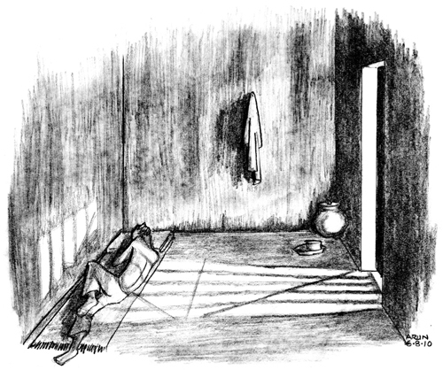

# Phasi Yard

## 8, Sunday, 4 May 2008

_This small note is to inform you all that I am fine. I felt it
necessary since you must be getting worried with regards to my health
due to the 27-day 'episode'. Overall my health is fine. Details of the
experiences during this episode I will reserve for later, when we meet
personally, as this medium would not permit it. I can guess the first
question that must have come to you was, why did we do it? The answer is
simple --- injustice is injustice,
and needs to be challenged. Something I learnt young. Due to the
'episode', I have been shifted from the _anda_ barrack to the Chhoti
Gol --- separate. Hence note my change of address. This yard is also
called the phasi yard as it is located near the gallows and is the final
place a death convict is kept until he is hanged. But don't worry; I
have not been sentenced to death. At least, not yet (just joking). In my
section at present there are no death convicts. In the other section
around eight such convicts are lodged. The gates are closed and we
rarely manage to interact with them._

\ 

We were not allowed to write letters or receive _mulakaats_ while on the
hunger strike. The Prison Manual prohibited this. Hence my family was
kept in utmost anxiety during our protest, which I referred to later in
my letters as 'the episode'.

The strike, which started on 7 April 2008, was by political
prisoners --- those whose acts had been animated by political causes, or
who had been arrested because the authorities believed that they held
certain ideologies. In this particular case, it had to do with
undertrials accused in _Naxal_ offences. The strike was a response to two
political prisoners being rearrested immediately after being released
from Nagpur prison. One of them was Kusma Mallesh, a mill worker from
Surat who had been arrested in 2004 for various _Naxal_-related offences.
Three years later, he was acquitted in all the cases. As he walked out
of the prison gate in September 2007, the police arrested him yet again
under a 'preventive detention' clause and forced him to spend another 6
months in jail. He was set free on 30 March 2008 --- only to be detained
again under the same clause, but this time in another district. The
other political prisoner who suffered the same fate in the same week was
Muttakka Naitam, a tribal woman from
Gadchiroli.

After hearing this news, I chanced to meet another group of
_Naxal_-accused prisoners on their way to court: Lata Gowda from the
women's barrack, and Shyamlal Salame, Sampath Madavi and Fagulal Tekam
from the _phasi yard_. I knew them because we all shared the same lawyer
and had been communicating in prison through letters. They were also
agitated about these rearrests. We decided to protest with a hunger
strike. Like the poor of our country, we had limited choice regarding
the form of our protest. During the brief time we were able to confer
with each other, we managed to discuss our demands, how we'd stay in
communication through the strike, how and who'd contact the other
political prisoners, and how information would reach the outside world.
The last factor plays a vital role in determining the outcome of any
struggle in prison. If news of prison resistance fails to get attention
beyond the jail walls, it can be easily crushed by isolating and tiring
out the inmates. All communications between ourselves or with the
outside world would only be possible by relying on sympathetic inmates
to courier notes and verbal messages. We needed a couple of days to make
preparations and so settled on 7 April as the day we would commence the
strike, four days after our meeting. Back at the _anda_, my co-accused
Ashok Reddy, Naresh Bansode, Dhanendra Bhurule and I quickly worked out
the other details before _bandi_. On 6 April, letters were clandestinely
sent to the local press and our lawyers seeking their support.

On the morning of 7 April, we refused tea and breakfast and submitted
our demand letters to the state Home Ministry through the prison
administration. In this coordinated move, all thirteen of us _Naxal_
accused prisoners from four different and isolated barracks went on an
indefinite hunger strike. Our demands were: investigate the recent
rearrests, end our isolation in prison; and
stop labelling and arresting social activists as _Naxalites_. We also said
that undertrials should not to be forced to wear uniforms. Unlike the
rules in other states, the Maharashtra Prison Manual lays down that
undertrials accused of murder are to wear uniforms. This was in total
violation of the general principle that all undertrials are to be
assumed innocent until proven guilty. The United Nations Standard
Minimum Rules for the treatment of prisoners also holds that an untried
prisoner be allowed 'to wear his own clothing if it is clean and
suitable'. We assumed that since our demands were reasonable, the
ministry would most certainly agree with most of them and the strike
would not have to extend beyond a week at the most.

For the first two days, Jailer Nagdev Pawar did not accept our letters
but we refused to withdraw them. They were kept in suspended animation,
as the _anda_ barrack _amaldar_ hung them on the barrack entry gate.
However, as the news of our protest appeared in the local dailies and
made its way to the State Legislative Council, panic struck the prison
administration. Four days after our strike had begun, on 11 April, the
administration accepted our letter of demands, forwarded it to the home
department and within an hour hastily gave us their written replies
stating their inability, as per the prison rules, to concede our
demands. The ball was now in the court of the state home department.
Questions were raised in the Legislative Council and the Home Minister
was forced to order an inquiry.

However, as the strike continued, the prison administration slid into
passivity. Content with having passed the buck up the ladder, they
merely recorded the deterioration in our physical condition. Allan
Waters was sent daily from the prison hospital to measure the decrease
in our body weight and other parameters. The administration was
confident about controlling us using
colonial-era strategies they knew so well. As early as 1933, F. A.
Baker, Inspector General of Prisons in Punjab, had delineated three
systematic stages through which the contagion of hunger strikes was to
be treated. The first stage was to immediately separate the striker from
other prisoners. This would prevent the strike spreading and break the
prisoner's morale. The prisoner was then, in his isolated existence, to
regularly and persistently be tempted with food, and his water supply
replaced by milk. The final stage was to force feed the prisoner, using
a nasal tube to pump down a mixture of milk, augmented by beaten eggs,
mutton broth, glucose and sometimes brandy. Nowadays, this is easily
done by administering glucose intravenously.

Going without food wasn't as difficult as I imagined. One has to fight
the urge to eat only for the first couple of days. After that, the mind
and body start getting accustomed to the absence of food and the initial
fierce pangs of hunger die down. However, memories of taste would still
haunt me. Prison staff would often, especially after _bandi_ when we are
alone in our cells, attempt to convince us to eat on the sly: 'Your
friends in the _phasi yard_ are eating. Do you want some _chivda_?' Or they
would say: 'Should I get you a biscuit packet to munch on in the night?
No one will know' or 'The canteen is selling mutton today. I could ask
Salim to send you a few pieces.' Within the first two weeks, my weight
started dropping as my body started eating itself. A state of perpetual
tiredness started setting in. Even daily activities such as brushing my
teeth became burdensome and the easiest thing to do was to lie down,
stare at the ceiling and hope that the administration would have a
change of heart.

The Prison Deputy Inspector General and City Police Commissioner visited
us to observe our condition and try to
convince us of the futility of the strike, but no one came to talk about
our demands. On the other hand, as an act of solidarity, political
prisoners in the Mumbai and Amravati prisons joined our strike too.

About twenty days into the strike, four prisoners were admitted to the
hospital because their health had become precarious. Shyamlal, the
youngest of us, was already on a drip. We had also received letters from
civil liberties organizations across the country expressing their
solidarity, promising to intercede on our behalf with the authorities
and appealing to us to withdraw the strike considering our health.
Ultimately on the twenty-seventh day, faced with an adamant and
insensitive government, we were compelled to unilaterally stop our
protest. By then, I had lost about 11 kilograms.

None of our demands were fulfilled, and we were fobbed off with promises
of 'we'll look into the matter'. Instead, the Additional Director
General of Police who was conducting an enquiry into the viability of
our demands, advised jail officials to scatter us in the prison. He was
also the chief of the Anti-_Naxal_ Department, and was mainly responsible
for the policies we were complaining about. Given this support from
their superiors in the home department, the prison administration
responded swiftly. All of us were dispersed into separate barracks.
Ashok Reddy and Dhanendra Bhurule --- the journalist --- were kept in the _anda_
while the anti-superstition activist, Naresh Bansod was transferred to
the _gunahkhaana_, the punishment yard with solitary cells. I was
transferred to _phasi yard_ where the prisoners on death row were kept.

The _phasi yard_ consists of around thirty cells divided into two
sections, separated from each other by a guard room and iron gates. The
cells in each section are ranged around a small
bit of open space. The cubicle with the
gallows adjoins the yard, within metres of the nearest cell. I was
transferred to the section of the _phasi yard_ in which were lodged some
other _Naxal_-accused prisoners who had participated in the strike, such
as Fagulal Tekam, Sampath Madavi and Ganpath Kudmethe, the husband of
the rearrested tribal woman, Muttakka Naitam. An additional criminal
case was registered against us --- of attempting to commit suicide. This
was the ninth case foisted on me.

## 16, Tuesday, 14 October 2008

_The Supreme Court has cancelled the bail of Dhanendra and Naresh. They
were brought back into prison. I have yet to meet them. The silver
lining is that the Supreme Court, in its order, has stated that our
trial should be completed within six months. Our usual court productions
nevertheless continue. In the Chandrapur case, our bail was rejected by
the Sessions Court. The rest is a big fullstop._

_Prison was in a festive mood with Ramzan Eid, followed by Dussehra. The
Muslim political prisoners in our yard every evening shared their
'iftaar' with us. Sometimes we each received a plate full of fruit and
sweets. With such delicacies coming, I easily 'sacrificed' the boring
prison dinner. On Dussehra, Srikhand was sold in the canteen. Aartis
would go on till late in the night. From our yard we could only hear
them. Now everyone is looking forward to Diwali._

_The news of the Kandhamal riots is most disturbing. Christian churches
are even being attacked in Karnataka and Kerala. I doubt that things
will improve, this being an election
year and the need to appease the
majority community. What has been the talk within the Christian
community? Do write and let me know._

\ 

Muslims are represented in prison in greater proportion than in the
outside world. In Maharashtra, they account for 36% of the
prison population, whereas in society their share is 10.6%.
Muslim festivals in prison are important events. During the _Ramzan_ fast,
entire barracks are emptied out to accommodate Muslims. Food is served
in these barracks at timings suitable for their _roza_, and prison
authorities sell fruit and dates during this month. For those in
cellular confinement like the _anda_ barrack, such community gatherings
are not allowed. However the cries of the _azaan_ and the sharing of
_iftaar_ delicacies lend a festive air to even the _anda_.

In my section of the _phasi yard_, Asghar was the only Muslim inmate. He
was allegedly a co-conspirator of Javed (who was in the _anda_) in setting
off blasts on the Mumbai rail tracks. Before he was arrested, Asghar
Kadar Shaikh, a resident of Mumbai, had worked part-time as an
auto-rickshaw driver and the rest of the time as a florist. In jail, he
worked as gardener in the compound surrounding the _phasi yard_. He was
also entrusted with the job of keeping the gallows clean, oiled and
functioning. Despite the grim task he was expected to do, he was
extremely friendly and witty. He always had a unique take on the world
around him, and made for good conversation in the yard.

'Prisons will improve only if election rules are changed,' Asghar would
often philosophize.

'How come?'

'Once prisoners are allowed to vote, politicians will then pay heed to
our needs.'

'You mean, inmates can't vote? But isn't that a fundamental right?'

'Not for us. _Hum voting kar nahin sakte lekin chunav ladh sakte_,' he
answered. (We couldn't vote but we could stand for elections.) He
explained how Section 62(5) of the Representation of the People Act,
1951 disqualifies any imprisoned person, whether awaiting trial or
convicted, from voting. However, Section 8 and Section 11A of the same
act allowed undertrials and convicted persons under certain offences
with sentences less than two years to contest elections.

'_Dekho_,' he went on, 'in slums or villages, the needs of the poor are
only fulfilled during general elections. We need to become a vote bank.
Politicians would then value our voice and improve prison conditions.'

'But such change will be superficial and short-termed, much like
charity.'

'_Sahi hai_,' he'd continue, 'but it will still be an improvement.'

Debates and discussions with Asghar would continue for days. He often
articulated his preference for a death sentence to being imprisoned for
his whole natural life. An instant death would immediately end the
suffering of his family. It would, he held, allow them to start life
afresh.

By June 2008, the number of us in the yard branded as terrorists started
increasing. We got three more Muslim boys, Sajid Ansari, Muzzamil Sheikh
and Majid Shafi, who had been arrested in 2006 and were accused of
planting bombs in a Mumbai train that year. They had been thrashed by
the prison authorities in Mumbai and arrived with multiple fractures and
bruises. Sajid and Majid were young fathers who had only enjoyed a few
months of parenthood before they were arrested. Muzzamil was still
unmarried. The three were deeply religious
and adherents of _Ahl al-Hadeeth_, believers in the strict interpretation
of the Koran. Sajid and Muzzamil were residents of Mumbai and had
earlier been members of SIMI. We had intense discussions on politics and
Islam. They despised the Indian state's treatment of Muslims and would
never fail to express their views passionately. I had hoped to learn
Urdu from Sajid, who was an excellent calligrapher and now regret having
failed. Majid, on the other hand, was a romantic. He'd often speak about
his family, his baby girl and the football he missed in Kolkata. From
our discussions it became evident that Sajid, Muzzamil and most of their
_numberkaari_ were arrested merely because of their previous allegiance to
SIMI. Majid, on the other hand, was implicated in the concocted police
story because he lived close to the Bangladesh border. All of them faced
the Herculean task of defending themselves from being convicted of a
crime that had left 209 dead and over 700 injured. The well-oiled
gallows haunted them daily.

Before September 2009, all the death penalty convicts --- including the
brother of 'Tiger' Memon, Yakub --- convicted in the 1993 Mumbai blasts
case had been housed in the other section of the _phasi yard_. We often
exchanged pleasantries and, on festival days, when the jailer allowed us
to greet each other, we would talk. However, in the last week of
September, after the Bhandara Sessions Court finally reached its verdict
in the Khairlanji killings, six of the upper-caste men accused of
murdering four members of the Bhotmange family were sentenced to death
and brought into our section of the _phasi yard_. The other two, sentenced
to life imprisonment, were kept in the general barracks. I was
uncomfortable about sharing space with men responsible for this caste
atrocity. But then, in daily exchanges, I had to learn to temporarily
ignore their brutalities. These are the
compulsions of prolonged incarceration with those most detested by
society.

The youngest of the Khairlanji convicts played volleyball and carom with
us, while the older men would chat in a corner of the yard, reliving
their days under the village banyan tree. In conversations with them, I
realized their prejudices blinded them to the enormity of their crime.
'Surekha Bhotmange was to blame. She disturbed the peace of the
village,' was their usual defence. They considered her death the logical
outcome of the dishonour she had brought to the village. 'She dared to
lodge a complaint against us,' they'd assert. 'She was too outspoken and
bold, unlike other _Dalits_.'

'But, did it warrant such treatment and death?'

'It was not planned,' they replied. 'The entire village was angry and
the hut suddenly caught flames.'

'Would this same sort of "justice" be given to a woman of another
caste?' I persisted. Silence followed.

In other circumstances, such caste violence may have gone unnoticed or
at the most would have resulted in the perpetrators being acquitted.
Maharashtra has a dismal 3% conviction rate in cases filed under
the Scheduled Caste and Scheduled Tribe (Prevention of Atrocities) Act.
This time, agitations by the _Dalit_ community throughout the country
compelled the authorities to make an example of the accused. In its
verdict, the court had concluded that the incident wasn't an act of
caste atrocity even while handing down the death sentences to the
accused. The failure to prove a case of caste atrocity satisfied the
dominant castes, while the death penalty pacified the anger of _Dalits_. A
little later, the High Court commuted this sentence to that of life
imprisonment.

Though the _phasi yard_ was home to many people accused
of brutal crimes, the severity of their
offences was never a hurdle in confronting the administration to demand
medical facilities or better food. On 13 September 2009, all death-row
prisoners observed a one-day hunger strike against the death penalty, as
part of an all-India campaign to abolish it. No sooner had I told
everyone about this than they agreed to participate. In all my
experience of organizing agitations on social issues, organizing death
penalty convicts was one of the easiest. They had nothing to lose, only
a life to win.

## 17, Monday, 27 October 2008

_I went through your letter. Thanks for believing in me, it really
helps. I know I could ask for a copy of the charge sheets in English,
but it would just delay things further. I have begun reading the charge
sheets of my cases and have already gone through seven of them. The
experience however has been quite educative. All the statements of the
police witnesses have been written after my arrest and backdated to show
otherwise. For staff of their own department, this is extremely easy to
do. It is apparent that they have got lower-level staff to fabricate all
the statements of these police personnel. The typos and errors made are
the same in all despite being on supposedly differing dates. Such would
have not been possible if the statements were actually really written on
different dates. I thought we could assist the lawyers in preparing
points. However, the problem is that the courts don't seem to start
proceedings. Now once again it's _Diwali_ time --- a time for vacations. Out
here we can only hear the sound of fire crackers and we occasionally see
a rocket if we sit close to the iron bars. The
canteen is selling some
sweets ... _

_I have 'requested' the prison superintendent during his weekly round
about my interest in doing a Post-Graduation Diploma in Human Rights via
distance education. He felt examination wouldn't be a problem if they
know the schedule and venue in advance, as the concerned court
permission would have to be sought._

\ 

The need to force the prisoner to abase himself is built into the
administration's DNA.

Even the facilities that belong to the prisoner by right have to be
pleaded for. For instance, every prisoner needs to routinely communicate
with his magistrate or Trial Court judge. But the mere act of sending
these officials a letter is an elaborate procedure. These and numerous
other requirements are bracketed into the category of 'requests' that
require the sanction of the Prison Superintendent.

This dignitary makes a weekly or biweekly ceremonial tour of the
barracks, accompanied by his subordinates, to hear and sanction
requests. This tour, which is called the _Round_, has all the trappings of
a guard of honour. A _subedar_, _havaldar_ and _sipahi_ march ahead of the
Superintendent, while other officers slouch along in the rear. The
prisoners are expected to line up with a suitably supplicant mien. Those
who have a request must step forward barefoot --- as required by the
Prison Manual --- to plead their case. The prisoner is all earnestness and
apprehension. The Superintendent's body language speaks of
self-importance, indifference and even irritation. Depending on his
whims, the prayer is granted or rejected.

Over his time in jail, the prisoner collects experiences like these that
ensure that he knows that his place in the hierarchy
is right at the bottom --- if he's considered
human at all. His subhuman status is underlined when the jail is
expecting an important visitor, perhaps the Deputy Inspector General or
Inspector General (Prisons) or a home department bureaucrat or a judge
or a politician. At the slightest whiff of such a _round_, jail
officialdom goes into overdrive. All prisoners are pushed into their
barracks and cells and are forced to set up an unnatural display of
discipline. Clothes and other belongings are to be piled neatly along
with folded _bistar_ and vessels in a preordained pattern. The prisoners
are required to squat alongside this display and await the arrival of
the VIP.

Meanwhile, officers frantically pace the passages outside seeking to
remove the traces of any element known to irritate the visitor's stated
aversions. If he's allergic to books, all reading material must go to
the _godown_. If he's known to object to string as a potential aid to
suicide or escape, all clotheslines must be dismantled. Nine times out
of ten, the visit does not actually materialize. After painstaking
preparations, the visitor may cancel his appointment or turn back after
a round of snacks in the Superintendent's office. Despite this,
prisoners have to suspend all normal work or entertainment for hours on
end, and remain in perpetual anticipation. Meal distribution is also put
on hold and the hungry prisoners can only hope the 'visit' comes to an
end soon.

On the rare occasions that such a round takes place, the visitor and his
entourage stroll past the locked barracks and cells while the
Superintendent plays the role of guide: 'These are the gallows, this is
_phasi yard_, that is the murder barrack, these are MCOCA prisoners, those
are _Naxals_, that is the _bachcha_ barrack,' (housing young offenders who
need to be kept away from adult prisoners, lest the latter's criminal
habits contaminate impressionable minds). If
the guest is not a high-ranking prison official they usually look around
in wide-eyed wonder and peer cautiously through the bars. Occasionally
one of them will catch your eye and smile or giggle nervously, perhaps
expecting you to bark or growl.

In 2008, I decided to do a post-graduate programme in Human Rights from
the Indian Institute of Human Rights, Delhi, by correspondence. My wife
had urged me to keep studying. 'Shahid Azmi, the civil rights lawyer
from Mumbai completed his law degree when imprisoned under terrorist
charges,' she said, 'so why not you?' She contacted the institution in
Delhi, got me registered and paid my fees. The syllabus was interesting:
I'd be learning about the development of concepts of human rights from
the Magna Carta onwards, how they were influenced by the American and
French revolutions, culminating in the Universal Declaration of Human
Rights by the United Nations in 1948. Reading this in a place with
abundant violations convinced me that a mere statement of human rights
was inadequate. It had to be accompanied by a struggle for these rights
to be implemented. In addition, human rights violations could not be
viewed without considering social and state oppression. Such an
atrocity-based analysis, devoid of social context, would erroneously
equate the rights of the oppressors with those of the oppressed. No
doubt, the state officials had their rights, but I'd rather choose to
defend those of the citizen.

Though prisoners had the right to do correspondence courses, receiving
my course books caused more drama than I'd foreseen. Whenever a parcel
arrived by post, the inmate would be required to go to the prison gate
and open the package before the gate jailer. On this occasion, when the
jailer saw that I had received forty books
relating to human rights, he insisted that the Superintendent certify
that they were essential for my coursework. A similar situation had
occurred when I received a copy of the Constitution of India from my
family during a _mulakaat_. The Deputy Superintendent refused to give it
to me because it was too bulky. It would occupy too much space in an
overcrowded prison, he said. Only after a written complaint to his
superiors did I manage to get the book, a whole week later. Like all
other fundamental rights, the right to pursue academics in prison
appeared to be a right only in theory.

The stash of textbooks in my cell became a source of comment. Some
inmates wondered whether these books contained legal arguments that
would help earn their freedom. To many, my studies were similar to the
fasting and prayers that others took up to focus their minds and to pass
the time.

While reading the books, though, I noticed how well-founded human rights
norms were being diluted. Principles that had been born out of struggle
and revolution were being systematically undermined. The no-tolerance
posture on torture and state-sponsored assassinations had been turned on
its head since 9/11. In the name of countering terrorism, torture
techniques used by the CIA, like water-boarding (which resulted in
asphyxiation), or political assassinations were being officially
patronized. Now, even confessions under duress are being used to
implicate the accused. The special anti-terror laws like the Terrorist
and Disruptive Activities Act and the Prevention of Terrorism Act
permitted such draconian measures. Though these laws have since been
repealed, the drastic provisions they contained have been retained in
laws enacted by individual states, such as the rampantly used
Maharashtra Control of Organised Crime Act, 1999. To use a confession
extracted under duress to incriminate the
accused goes against international standards established in the
Universal Declaration, as also in the Constitution of India. Like the
Prevention of Terrorism Act, which preceded it, the Unlawful Activities
(Prevention) Act, amended in 2004 to make it even more repressive, also
proscribes political organizations and parties. The problem of banning
organizations is that it forces proscribed ideologies to go underground
and criminalizes any sympathy for them.

However, this has been happening to all forms of peoples' struggles in
India --- be it the anti-nuclear protestors who were arrested for sedition
(one study in 2012 reported that protestors against the nuclear power
plant in Koodankulam, Tamil Nadu had 107 FIRs filed against them,
implicating 55,795 persons, of whom 6,800 were charged with sedition
and/or waging war against the state) or the teenage stone-pelters of
Kashmir who were detained under the J&K Public Safety Act (these
detentions were documented by Amnesty International and other
organizations). Peasants are routinely arrested for opposing a mega-dam,
Special Economic Zone or a mining project that has displaced them from
their land, livelihood and environment. If a movement chooses to oppose
the development model of the state, it soon faces an implicit or
explicit ban, a curtailment of its activities and widespread arrests of
its sympathisers. Such crude law-and-order fixes don't solve social and
political discontent, but merely criminalizes them. _Maoism_ in India is
no exception. It is a practice that is incompatible with the fundamental
right to freedom of speech, expression and ideology.

## 22, Thursday, 25 December 2008

_Today being Christmas, there was a prayer service for the Christians in
prison. It was conducted by a priest and was held at the prison hall. I
took this opportunity to go out of our yard and interact with inmates of
other barracks. Such chances come only on religious festivals. Post
26/11, the reading of the daily newspapers has become extremely boring.
All articles in newspapers and magazines have the same security-centric
angle of viewing things. I can imagine what Mumbai must have become,
probably a fortress. A similar kind of picture has developed in Nagpur
as it is the venue of the state winter assembly sessions._

\ 

At the end of every year, the prisoners are counted up again and all
undertrials are given new numbers. The inventory is updated. My _hauladi_
number moved up to 85. Numbers are pushed up when other undertrials are
released, explicitly establishing the order of seniority in prison.

By now, I had spent 18 months in prison and was much better aware of its
rhythms. Practices that would seem bizarre in the outside world became
routine behind the walls. For instance, the trapping and hunting of
squirrels, birds, _bandicoots_ and other types of small game was a serious
occupation because the Maharashtra government had imposed a near-total
ban on non-vegetarian food in prison. Even locusts and other insects
that occasionally swarmed the prison were collected, to be sun-dried,
roasted and relished. Cloth traps sometimes managed to snare a bird.
Others were brought down with makeshift catapults. Traps in drain-pipes
and other passages could be made to yield _bandicoots_. But the more
popular method for both squirrels and rats was hunting by hand and
stick. If one was sighted, the cry went up and the hunters gathered to
corner their prey.

A well-fed _bandicoot_ --- which tastes a lot like pork --- was a sizeable
feast for a meat-starved group. It was quickly skinned and cooked in a
corner, away from the prying eyes of jail staff and their informants.
The spot behind the latrines was considered safe. This was done on the
watch of the latrine-cleaning _danda kamaan_, who are usually low-castes
or tribals. They were omnivorous and enthusiastic participants in both
the chase and the feast. As the band sat around for the treat, the
conversation would drift back to better times. One person would talk of
wild boars, another remembered rabbits. The high walls and iron bars
would fade away. Things weren't as bad as they seemed.

## 23, Tuesday, 20 January 2009

_Our mulakaat was very disappointing. We did not manage to get time and I
was not produced in court. You must have waited the whole day. I had no
method of informing you not to do so. I sometimes think it's better that
we do not make plans for such visits, rather than living through the
frustration of it collapsing --- a waste of time, money and most of all,
emotions._

_The cold has decreased considerably. The yard is now full, i.e. all the
cells are occupied. About eight of them are on death row. The latest
entrant is a Bihari migrant sentenced to death for rape-murder by the
Vasai (Mumbai) Sessions Court. He reminds me of one of the characters of
The White Tiger, with all his flirtations with crime and extreme poverty
in his village. His antics are presently the centre of all amusement and
entertainment. Soon they may become the cause of irritation and
quarrel._

\ 

The _phasi yard_ had its own codes. For instance, no one ever
talked about a fellow prisoner's offence
casually. If by chance the topic came up, it generated a visible show of
emotion. The convict would almost immediately slip into a silent,
contemplative mood, which made everyone uncomfortable, or he would go
into a rant about why he had been compelled to commit the crime. If the
offence was sexual in nature, he would aggressively declare that he had
been falsely accused.

Another characteristic of this yard was that everyone was short-tempered
and edgy. Small scraps could immediately flare up into physical fights
and blood-letting. Continuous residence in the yard, seeing the same old
faces day after day, for years on end, kept the convict in a perennial
state of irritation and depression. Most of all, the uncertainty was
impossible to deal with. Life in the shadow of the gallows left no scope
for hope, that essential ingredient that kept other prisoners going. In
December 2012, India had 477 convicts on death row.

## 25, Wednesday, 18 February 2009

_With the coming summer we have once again requested that fans be
installed in the cells. As usual it was answered by more promises. I am
enjoying studying the course syllabus stuff. Although it is vast, I am
able to concentrate as it deals with the issues that interest me. The
only problem is in giving exams after such a long academic break. The
judge is keen to complete the case soon especially after the Supreme
Court strictures._

_Another bit of bad news is that the Gondia police have sought the
custody of Dhanendra and Naresh in two offences, nearly two years after
their initial arrest. But can we ever dare to
question the 'noble' intentions of
these 'honourable' men? As you mentioned during your last visit, the
economic crisis has severely hit the job securities of the middle class.
The poor were always in a state of permanent crisis. The situation went
unnoticed as long as it was restricted to the poor. But now with the big
financial houses crashing everyone is worried. It's worth consulting the
Gondia police; they have the simplest solutions._

\ 

It was very common for the police to rearrest a person for another
offence even while he was in prison. This was slightly different from
rearresting people at the gate upon release. It made no headlines but
the practice was rampant. Some prisoners accused of being _Naxalites_ were
implicated in over fifty cases. Prisoners with cases going into double
figures were quite common. I've heard of a woman prisoner in the
Balaghat district prison of Madhya Pradesh who had more than a hundred
cases against her. Keeping track of these cases was an enormously
complicated task and following each of their proceedings without
competent lawyers was impossible for the majority of the tribal inmates.

Among these political prisoners were Ganpath Kudmethe and his wife,
Muttakka Naitam, each of whom were charged in over forty cases. After 5
years in jail, Ganpath realized that he had been arrested and tried
twice for the same case. Many political prisoners soon realized that
spending several years in prison for one case was not very different
from spending the same time for forty or more cases. In fact, the latter
situation seemed to be safer because it reduced the possibility of being
rearrested after release. Fear of rearrest has caused some prisoners to
make applications to the concerned police stations to know which
offences they intended to arrest them for in future. Numerous
applications under RTI were written to
various district police departments, followed up with appeals and then
applications to the court to get those cases started.

## 29, Saturday, 27 June 2009

_I woke up in the morning with chronic dysentery. With the monsoons
having arrived and the obvious state of cleanliness here, this is at
present the most popular ailment in prison. As usual I was prescribed
heavy antibiotics. My exams in prison went great. Although, with the
sweltering heat, it was extremely difficult to write two papers a day, I
somehow managed. The heat in no way discourages the inmates of our yard
from playing volleyball. It releases the pent-up frustration, I guess.
It also helps build up team spirit in the entire yard. For the death row
convicts who never get a chance to leave the yard, a couple of games of
volleyball are therapeutic. Now some guys out here want to learn
English. I keep trying to dissuade them in learning a language so alien
to them, but all my attempts are futile. I now teach a few of them
English and Maths. Out here in jail, the fact that one knows the
language and is willing to cooperate are the only two qualifications an
English teacher requires, given the abundance of students and time._

\ 

Passing time in the _phasi yard_ was a major problem. If there was no
volleyball, a few would gather to play a game of Ludo or carom. Another
would hover around the radio, lost in the world of _Hello
Farmaish_, a popular All India Radio show that played
listeners' requests. Others would gather near the yard gate to chat with
the guards. Some would busy themselves with
sweeping and mopping their cells, washing _thalis_, clothes or bedding,
more often than was required. By evening, we would maniacally strut up
and down the yard. But this was only possible when the cells were
opened, which was for about eight hours each day. The rest of the time,
we were by ourselves. While a few would join in the vocals of the radio,
others would engage in elaborate _handi_ procedures. Suddenly, someone
would break out into _shayiri_ with everyone applauding him. The _phasi
yard mehfil_ would come to life.

One Khairlanji case convict kept himself busy killing mosquitoes every
night. The walls of his cell would bear the marks of the previous
night's kill. Fagulal Tekam, one of the _Naxals_, and a participant in the
27-day long hunger strike, would sew the elastic bands of old pairs of
underwear together to make a ball for the next day's play. Inmates like
myself hoped to devour whatever reading material we could lay our hands
on.

In _phasi yard_ too, many sought therapeutic trips to the prison hospital
to escape the prison monotony. The prison hospital was a great
institution, with the Doctor In Charge (DIC) as its presiding deity. The
Prison Manual provides the DIC with absolute powers in his field of
operation. Whatever the intention of the lawmakers, this has resulted in
the rise of a breed of DICs who seem determined to prove the cliché that
absolute power corrupts absolutely. The sundry permissions, sanctions
and recommendations in the DIC's kitty were all available for a price.
Special diets, admission to the prison hospital and referrals to
hospitals outside the jail were the more remunerative commodities on
offer.

As usual, it was the _bhais_ who cornered the scarce resources. Others who
managed some attention were the ones with the greatest nuisance
value --- loud abuse could often extract
something from a DIC chary of exposure. However, those most in need of
medical care had to battle it out. But even such a battle wouldn't
ensure reasonable treatment.

By January 2010, I won one such battle. It was waged for almost
two-and-a-half years and ended with a crown on my left lower molar. This
tooth was being treated before my arrest in May 2007, but the prison
doctors told me that the only treatment possible was an extraction. It
was only after much pleading, requesting, petitioning and quarrelling
with the authorities that I finally managed to be sent to the City
Dental Hospital to get it permanently filled and fitted with a crown.

However, during the rains, with dysentery and conjunctivitis making the
rounds in prison, I needed to be lucky to stay healthy. For medication,
I'd have to first pester the jailer to permit me to go to the prison
hospital and a guard would escort me there. This would eventually happen
by 11 a.m., after almost three hours of constant reminders. At the
hospital, crowds would have already gathered to swarm the OPD for their
hospital card or to meet a friend. (The hospital is a convenient place
for chatting with inmates from other barracks and passing on messages.)
An hour's wait with a scuffle or two to reach the junior doctor's desk
was only to be expected. As the doctor would usually be late in
arriving, I'd wait in the hospital barrack and watch television. Others
would amuse themselves with the antics of the mentally challenged
inmates lodged in the hospital barrack. I couldn't help but wonder what
purpose was served by imprisoning them.

When the doctor arrived, a crowd would gather around him. When I finally
managed to get to him to recite my woes I would barely receive a glance.
No doctor's touch, no stethoscope or other medical instrument in sight;
the physician would silently scribble out a
prescription. Treatment was usually determined by the drugs available in
the hospital --- symptomatic relief and placebos at best, unsuitable and
even harmful at worst. I would be escorted back in time for _dopahar ka
bandi_. However, the antibiotic pills I was prescribed would invariably
be insufficient. The physician wouldn't give us the whole dose lest we
prisoners misuse it to end our lives. But there was no guarantee that I
would be brought to the hospital the next day. More often than not, my
treatment would remain incomplete, and at the most would nurture germ
strains resistant to all but the strongest drugs. The prison medical
system has perhaps made its own ample contribution to India's creation
of superbugs.

The extension worker of this system of medical care was the nursing
orderly. He was one of the jail '_babas_' assigned the task of dispensing
the available tablets. Besides doling out what the doctor prescribed, he
was also supposed to visit the barracks at night to provide medical
attention to those in need. This orderly, not having that much pecuniary
interest in the services he provided, was often more caring and
effective than the doctor at the desk. However, he was limited by the
shallow, often distorted, knowledge at his disposal. He often misread,
or misunderstood, the character of the drugs he was doling out. Though
well meaning, his care carried covert hazards.

But often, medical hazards at night went beyond the abilities of the
nursing orderly. If a prisoner got sick at night, the jailer, being the
only officer, was quick to shift the responsibility to someone else.
Hence, he would order the patient to be shifted to the jail hospital
immediately, where the DIC would then become the person in charge. If
things became too difficult for the DIC, he would order the patient to
be shifted to the government hospital in the
city.

This system of passing the parcel often resulted in delayed treatment,
as each official hoped that the next person on duty would get down to
treating the patient. This occasionally caused the death of the patient
in jail. When this happened, a huge cover-up operation would then take
place. Intravenous glucose would be injected into the corpse and it
would be transported to the city hospital. The official record would
show that the patient had left the prison alive, but had died during the
journey, before being admitted to the city hospital. In 2010, the NCRB
recorded 102 deaths of inmates in Maharashtra prisons, the
second-highest figure in the country. Not a single death was attributed
to 'negligence or excesses by prison personnel'.

## 30, Friday, 10 July 2009

_The Nagpur judge is keen on completing the case in time. He has given
dates almost consecutively and has been successful in making the
prosecution move faster. This is most important. In your absence,
another four witnesses were examined; they were declared hostile as they
did not testify (in support of) the police version. Two of them were
supposed to testify that they were witness to the materials allegedly
seized from us, i.e. the pen drive, weapons, literature, etc. Both
denied being witness to such an event and said they were made to sign
papers at the police station. In short, with these two witnesses the
entire prosecution's story has collapsed. It is good news. Four more
witnesses have been summoned for the next
date._

## 31, Friday, 24 July 2009

_The highlight of this week was my discharge in the 'attempt to suicide'
case. In this case, the judge was initially ready to release us on bail.
We strongly opposed it, personally arguing before her that we had
already completed a major part of the maximum possible sentence under
these charges. For us, being released on bail would not translate to
getting released from prison due to our remaining cases. I even managed
to address the court for almost half an hour arguing how a hunger strike
against atrocities should not be interpreted as an attempt to suicide.
After hearing me she said that she would commence the trial on the next
date. What happened on the next date was most shocking. Rather than
start proceedings in the trial, she instead decided to discharge us.
Discharging means that the judge did not see any basis for even
conducting a trial and therefore relieved us of this case. Discharge is
like an acquittal without a trial. The undisclosed factor behind this
discharge seems to be the local police headache of producing all of us
_Naxal_ undertrials to court for each day of the trial. Arranging such
elaborate bandobast for such a trivial matter seemed the larger concern._

## 32, Wednesday, 5 August 2009

_This Raksha Bandhan I received two rakhis. One from Lata, a woman _Naxal_
undertrial who is the co-accused of the undertrials I teach English. The
other is from Dhanendra's sister. Thanks for subscribing to those
magazines I had asked for. I have another favour. The problem is we have
not been receiving a single copy ever since you paid the money. We have
made enquiries out here but they say that they have not been receiving
them. I doubt whether such is
true. Hence do try calling their offices and enquire whether the issues
have been dispatched._

_You were right when you wrote that much of the problems you currently
face are due to my arrest and prolonged incarceration. It therefore
makes it ever the more difficult for me to advise you given my present
situation. I can at the most try consoling you. So, just hang in there.
Don't worry, things are bound to change. For me, one of my biggest
consolations in jail is comparing myself with the plight of the lesser
privileged. Here in prison this perspective is omnipresent. Wherever one
looks there is always a sorry case. So whether I like it or not, the
society in which I live gives me the strength to live another
day ... _

\ 

Each year, my wife had to remind me of Akshay's age. He, on the other
hand, had to be assured by her that I would be coming home for his next
birthday. At that age, children live for the moment and though he wasn't
totally convinced, Akshay's mind would soon wander off to something more
interesting. But the question of his _dada_'s arrival would come up again
and again, sometimes even in the middle of the night. My wife found it
difficult. Mundane tasks like entering my occupation in his school diary
or attending school meetings posed huge dilemmas and my wife sought
solutions in her letters to me. She wrote of the challenges she faced at
work and at home due to my incarceration and due to doubts about my
innocence. She confided that she often questioned the direction in which
her life was moving. I had no answers for her.

Initially she had frantically sought information from my lawyers about
how long they thought I'd be in prison. But it soon became clear that
such queries were futile. Every time an alleged _Maoist_ was arrested
somewhere in Maharashtra, my name would
appear in the newspapers and things at home would tense up. My family
would assume that these new arrests would result in the police filing
even more cases against me and that I'd end up spending even more time
in prison. But every crisis has its saviours. My brother, sister and the
parents of Akshay's friends would strive to see that he did not feel my
absence. They would be around whenever he needed a father or my wife
needed a friend.

## 33, Wednesday, 19 August 2009

_Nowadays the latest craze in our yard has been crafting Diwali and _Eid_
cards. Hence at present my cell is filled with old magazines, leaves and
flowers for creating these cards. We craft something like 5--6 cards a
day. They are quite a pastime._

## 34, Friday, 4 September 2009

_In your last letter, you quoted Michel Foucault mentioning the insane
roaming free while the sane are locked up. Here's a more relevant and
better quotation from that stronger anti-capitalist and democrat,
Bertrand Russell --- 'Certified lunatics are shut up because of their
proneness to violence when their pretensions are questioned. The
uncertified variety are given control of powerful armies, and can
inflict death and disaster upon all sane men within their reach.' Try
matching this one, or do you choose to quit this jugalbundi?_
