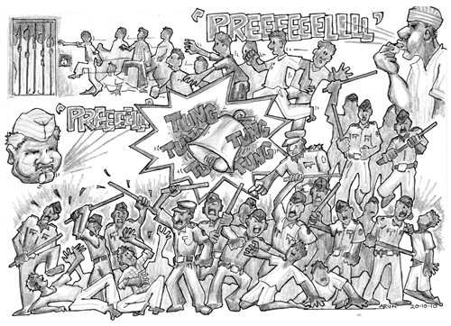

# The _Gunahkhaana_

## 36, Tuesday, 29 September 2009

_Last week two more persons were sentenced to death by the Nagpur Court.
It seems to be the most fashionable thing to do. Now since all the
30-odd cells of the phasi yard have been filled I was made to vacate my
cell there. I am presently given a cell in the separate yard of Badi
Gol, otherwise known as _gunahkhaana_. Badi Gol would resemble a huge
spider from space and I would be in one of its legs. It is the southern
octagon meant for undertrial
prisoners, as different from the Chhoti Gol --- the northern octagon for
convicts. Hence please note the change of my address._

_In this yard, my two other co-accused, Dhanendra and Naresh, are kept
in adjoining cells. And the other _Naxal_ accused, Sampath and Fagulal,
the tribal boys whom I used to teach English and Maths are also kept
here. Hence lots of familiar faces and 'family'. Guess October may be
the month for the Nagpur Court judgement. I too have been getting
anxious and jittery about the case as it comes to a close._

\ 

Life in my new lodgings was an improvement on the previous two prison
locations. Although I was still locked up in a cell alone and
technically isolated from the other prisoners, I managed to meet them,
as I began to understand the intricacies of prison life. For instance, I
learnt how to negotiate the mad morning rush at the _tanki_ or _haus_, as
the bathing tank was known. Four hundred prospective bathers from two
barracks laying claim to a 60 by 3 foot trough meant a hurried bath even
at the best of times. In summer, when the water being pumped out of the
well was likely to run dry, the pace was frantic. Jail lore tells of the
guy who was not fast enough and had to rinse off the soap by catching
the drops falling off his neighbour's body. The ones who hadn't learnt
to brush teeth, take a bath and rinse out their underwear in ten minutes
flat were destined to scrape the bottom of the _haus_. If you wanted to
wash your clothes, you had to forego your bath. Even in the monsoon and
winter months, the water was pumped into the trough only at fixed
intervals and anyone who did not plan his water usage precisely was
likely to be left high and dry.

Negotiating the morning crowds at the _tanki_ and the long lines at the
toilets required not only speed but some presence of
mind. This was particularly important in the
yards and barracks with a large number of undertrials who had to get
ready to attend court. In less than two hours, between the opening of
the barracks at 6.45 a.m. and court call at 8.30 a.m., they had not only
to use the toilet and have a bath, but also catch the queues to collect
and then consume their tea at 7 a.m., breakfast at 7.30 a.m. and their
lunch between 8 a.m. and 8.30 a.m.

It wasn't easy for my body to adjust to the absurdity of having lunch
just a half hour after breakfast. The early lunches, like so much else
in prison, were the result of sheer callousness. Undertrials often spend
the hours between 8.30 a.m. to 6.30 p.m. on their way to court, in
court, and being driven back, but the jail authorities did not see fit
to provide us a packed lunch that could be eaten in the afternoon. But
since the Prison Manual, which governs all activities in prison, laid
down exactly what a prisoner must consume, the authorities fulfilled
their obligations by distributing lunch to undertrials at 8 a.m. But
when you are one among many hundreds running after scarce resources, you
normally ended up giving up something --- either the toilet or bath,
breakfast or lunch.

## 37, Monday, 26 October 2009

_I have just arrived from the Nagpur Court. Once again no witness has
turned up. I seriously doubt whether the police served the summons to
the two witnesses. I do hope we are produced before the Gondia judge
this time. For the past one year we have been going to court, but have
never been produced before the judge. His complaint is that we do not
reach court on time i.e. in the
session before lunch, which is impossible since the police escort party
turns up late. As a result the trials have been delayed. We have sent
off applications to the Nagpur city police chief to rectify this.
However there has been no change in the situation. I am applying for
discharge in two cases in Gondia, as there is absolutely no evidence
against me. The prosecution has only relied on the alleged confessional
statement of my co-accused Ashok. If discharge is granted, it will save
me the process of going through the entire trial._

\ 

Another exercise calculated to remind us of our worthlessness was the
recurrent jail _jhadati_, or searches. Without notice, a band of jail
constables and officers would swoop down on a barrack and search the
inmates' belongings. One night, I was woken up to the sound of cell gate
latches clanging open.

'_Jhadati aaya_,' whispered Ganpath Kudmethe, the inmate in the cell
adjoining mine. I, in turn, had to pass the news down the line in case
someone wanted to hide something. The crevices of the wall or the spot
under the earthen water _gada_ were the usual places to be checked. One by
one, each barrack and each cell was searched. After the door of the
adjoining cell was locked, my door was opened. I was made to stand
outside as five or seven guards barged in, supervised by a jailer.
Within seconds, everything was upturned and inspected. With his dirty
boots, the jail staff stomped all over the cell and the _bistar_ I had
carefully cleaned. The feeling of powerlessness and disquiet while
watching my meagre belongings being overturned and flung to the ground
is not easily described.

'Why do you keep so many books and papers?' I had expected this, but
before I answered another one followed. 'Collect his extra clothes.
Don't you know civil clothes aren't
allowed?' Containers, twine, curd, extra cloth and plastic glasses got
chucked out along with my clothes. The presence of twenty to thirty
prison staff around me suggested that any thought of even verbal
resistance was foolish.

These searches were supposedly aimed at unearthing banned items. But the
definition of banned was ever-changing and depended on the whims of the
superintendent, or senior jailer, or even the _sipahi_ conducting the
search. Thus an item of food, stationery, clothing or bedding permitted
by one officer could become contraband under another dispensation. Legal
books would be confiscated because they were suddenly not allowed. After
I heard that the police had used the diary maintained by another inmate
as evidence in court, I decided to destroy the notes I'd been keeping
about my prison experiences, which is why I have had to rely on letters
I sent to my family to reconstruct my years in jail.

Of course, prisoners with _charas_, _ganja_, mobile phones and other items
that were actually contraband had nothing to fear. The _bhais_ would be
warned about the raids in advance by the staff. They had good reason to
offer these tip-offs. After all, it was the staff that smuggled in these
illegal items and had a vested interest in ensuring that nothing got
discovered. In jail lingo, they were referred to as '_taxis_'. A _taxi_
would arrange to pick up money from family or a friend in return for a
standard fee of 40%. Other contraband items were priced
differently. Even a mobile phone battery could be charged for a fee.
Occasionally, when a tiff broke out between the _bhai_ and the guard, one
could assume it was a deal gone sour. However neither party would take
the matter higher up for fear that the supervisors would have to be
included in the cut. In the unlikely event of contraband being
discovered during a search, it would be a
minion of the _bhai_, or even some innocent, who would have to take the
rap.

Corporal punishment, though banned, is alive and kicking in Indian
jails. Possession of contraband, fighting with other inmates,
disobedience, questioning an officer or merely looking him in the eye
could merit _lathi_ blows, kicks and cuffs. _Gira dena_ --- to fell to the
ground --- was the term used for the type of treatment many officers meted
out. The victim was forced to the floor while a bunch of jail employees
pounced on him with sticks, kicks and abuse. A more sophisticated
version was _naal bandhi_ wherein the prisoner's legs were thrust between
bars and _lathi_ blows inflicted on the soles. The more vicious and
energetic _lathi_-wielders aimed to break a few batons and bones. Often,
they succeeded.

The DIC then swung into action --- to cover up injuries rather than
provide care. He certified that the injuries were minor and did not
merit treatment at an outside hospital. Painkillers were administered
and the patient transferred away from his barracks into some form of
isolation. If he were an undertrial, it would be risky to allow him to
go to court as that could mean a complaint there against jail officials.
The helpful DIC would be at hand to certify that the undertrial was
unfit and could not attend court. This state of affairs would continue
until the wounds healed or were at least not visible. Such concealment,
however, was not to the taste of all the officers. Many of them spoke
nostalgically of the good old days before the spread of awareness about
human rights and prisoner rights.

Taksande, our _Badi Gol_ jailer, was one such officer. He would impart to
us his views on prison reform. 'Convicts should not be allowed
facilities such as _mulakaats_, furlough or parole,' he'd say. 'It softens
their punishment.'

'But is it possible?' I'd ask.

'The courts are to blame,' he would reply. 'In the late 1970s and early
1980s, the Supreme Court held that even prisoners have human rights. And
now we have these numerous Human Rights Commissions ever-willing to
raise their voice.'

'None of them work, so why worry?'

'Yes. But the problem is that discipline levels drop. No prisoner
listens to us anymore,' he would answer rapping his _lathi_ on the table.

When it came to sports, Taksande was an enthusiast. He was an excellent
volleyball player and would occasionally join us for a game. But in the
evenings, after _bandi_, he conducted his own brand of physical activity.
Any undertrial who had caused a problem in the day was singled out and
thrashed by him and the guards. It was common for two to three wooden
_lathis_ to break during each session. During his reign, the assaults had
become such a frequent practice that inmates began to refer to them as
_shyam ka bhajan_.

In October 2009, Mukesh Chankapure, a bootlegger in his late twenties,
was brought to prison. The city's municipal elections were to be held
soon and the police dutifully imprisoned such elements to prevent
political parties from doling out hooch to potential supporters. It
turned out that Mukesh was addicted to his own products and, shortly
after being locked up, started getting withdrawal symptoms. He screamed
through the night, disturbing the other inmates. The _bhais_ of the
barrack had already beaten him twice during the night with the silent
consent of the guard. In the morning, with the opening of _bandi_, it was
Taksande's turn. He eagerly performed his _bhajan_, which consisted of
pulling Mukesh violently around by his hand and landing repeated hard
kicks with his heavy boots all over his
body. Mukesh was then shifted to the prison hospital. He died there
early the next morning. His relatives and other members of the _Dalit_
community successfully forced an enquiry by refusing to accept his body.
The pressure of forthcoming elections had made it possible. However, the
executive magistrate and State Human Rights Commission probing the death
were content with the prison's version of 'negligence by the convict
in-charge of the hospital barrack'.

Despite this, fractures from such _bhajans_ had to be explained and not
all judges were cooperative in overlooking them. Even the
superintendent's authority to hand out punishments had to pass elaborate
procedures, such as getting a doctor to examine the victim, recording
the reason for punishment, sending a report to the courts and getting it
sanctioned. Even after all such procedures, punishments like fettering
and whipping, though authorized by the Prisons Act, were not appreciated
by the courts. Neither is Section 53 of the Prison Manual, which retains
provisions for 'whipping to be inflicted with a light rattan, not less
than half an inch in diameter on the buttocks' of the prisoner as a form
of punishment.

In such circumstances, the best way for the jail administration to
legitimately wield the _lathi_ was during an alarm. An alarm was supposed
to be sounded when there was a grave threat to jail security, such as
when prisoners attacked each other or the staff. But most alarms were
planned by jail officers to be used as cover to attack and punish
recalcitrant inmates. Sajid, Muzzamil and Majid from the _phasi yard_ had
faced such treatment in the Mumbai prison before being transferred to
Nagpur.

During an alarm, all the jail officers and lower staff, as well as the
_convict warders_ and watchmen were supposed to rapidly bring the
situation under control. If there was violence, they
were permitted to use minimum force. This
was the fig-leaf to justify both wholescale as well as targeted attacks
by the staff. At the first sound of the bells, whistles and sirens that
announced the alarm, the staff ran wild, swinging their _lathis_ at
everyone in sight. Terrorized prisoners ran here and there, trying to
escape the _lathis_ and reach their barracks. Anyone outside was beaten
mercilessly, driven in and the barracks locked. A count was taken to
make sure all were in. As the din and mayhem subsided, the jail
officials would start the process of targeted attacks. Those who had
previously made complaints or defied the administration were removed one
by one from the locked barracks and given a dose of _naal bandhi_. While
some were transferred to other jails, others were moved to solitary
punishment cells. These cells were situated in the _gunahkhaana_ that is a
feature of every jail, or to the _anda_ barracks, like the one to which I
was permanently assigned.

Violence by the authorities in the jails of Maharashtra, like in the
rest of the country, is not an isolated event. They are conscious acts
perpetrated daily to subdue the prisoner and establish authority.
Violence, submission to authority, and discipline are viewed by the
prison staff as essential to effective prison management.

On one occasion, in 2010, an inmate was mercilessly beaten in front of
everyone in the _Badi Gol_. The manner in which he was beaten made it
clear that he was being made an example of. His crime was that he had
jumped over the inner wall of the yard in pursuit of a cricket ball. All
the barracks were shut and inmates peered through the barrack gates as
the superintendent and other jail officers meted out their justice. The
DIC stood by in case things got bloody. Half a dozen _lathis_ were broken,
_naal bandhi_ was done but the benefits in terms of discipline were
abundant. Taksande didn't tolerate even a
defiant silence from an inmate. Prison guards would often praise
Taksande for the way he got his barracks locked on time or how he was
able to discipline the unruly.

But suppression and subjugation were not the preserve of the
authorities. _Bhais_ and some _convict warders_ exercised their powers over
other prisoners with almost as much force. Sometimes acting on behalf of
the administration, at other times of their own accord, they also handed
out punishments of beatings and banishments. Inmates inconvenient to a
particular _bhai_ or warder were not allowed to remain in barracks they
controlled. _Bhais_ extracted a variety of services from a wide circle. It
was not uncommon to enter a barrack and see _bhais_ and _convict warders_
being massaged by groups of young prisoners. The washing of clothes,
re-cooking of food, massages and even sexual services were paid for with
tobacco, _beedis_ or a _goli_ of _charas_. One of the warders was particularly
notorious. He had first been convicted of a murder done for a ruling
party, and while out on parole had followed it up with killing his wife,
whom he doubted of being unfaithful. His political connections and long
years in jail made him a prison _bhai_ feared by most and he always
managed to get a steady supply of young boys to cater to his needs and
to share his _bistar_ at night. A big build and stentorian voice aided the
image and when he moved in the yards most ordinary prisoners steered
clear. He was one of those the jail administration relied upon the most
to maintain 'discipline' in the jail.

## 39, Sunday, 6 December 2009

_First and foremost, I must request you that you desist from writing
stories of the meat dishes you cook. It adds to my misery (just joking)
and brings back fond memories. In this yard too, we have somehow managed
to play volleyball. There was no volleyball court, but we cleared up
some area of grass and have begun our evening games. Inmates from other
barracks too join us and hence we are able to play nearly six to a side.
However due to sudden rains the ground has become marshy. We have
requested the superintendent to provide us sand. But I doubt whether it
will ever arrive. Our 'request' (plea) for a new volleyball itself took
almost four months to be answered._

\ 

The condition of sports, recreation and entertainment in prisons is
apparent from the state's expenditure on welfare activities of inmates.
According to the NCRB, Maharashtra had absolutely no expenditure on
welfare activities from 1995 to 2011, except for the year 2010, where a
meagre ₹20,000 was spent. For a state that is among those with the
highest number of prisons in the country, such a situation is unnerving.
With no expenditure, the administration relies on donations of
benefactors and non-governmental organizations. Games such as carom and
volleyball are sparingly provided by the prison authorities; however,
initiatives for sports or tournaments are generally discouraged on the
grounds of security and discipline. In the _Badi Gol_, we had just one
carom board and one volleyball for almost a thousand inmates. Chess
pieces had to be privately purchased and playing cards were confiscated
during _jhadatis_. The administration argues they are used for gambling.
Similarly, organizing cultural programmes and expenditure on TV sets,
radio or video facilities are minimal and depend on the
superintendent's relations with donors.

However, inmates would use their ingenuity to cobble a ball together
from rags, or smuggle one in on court dates to enjoy a good game of
cricket with a wooden bat broken off from a ceiling plank. And when
there was a match broadcast on television, cricket fever would bite the
whole prison, including staff and officers. Every inmate would be in his
barrack, glued to the set. The yards would be empty which seldom
happened during the day. In the _gunahkhaana_, the live commentary would
be blasted on the radio. I too was compelled to participate in this
craze, since the radio was placed in front of my cell.

In November 2009, Sridhar Srinivasan and Vernon Gonsalves were
transferred from Mumbai's Arthur Road Prison to our yard in Nagpur. They
had been arrested in Mumbai by the Anti Terrorism Squad (ATS) in August 2007.
Like me, they had been booked under the Unlawful Activities
(Prevention) Act and Arms Act. However, in their case, the ATS was more
generous in planting evidence and claimed to have seized a huge cache of
explosives and arms from them. They were transferred to Nagpur on the
orders of the Gondia Court. As they were implicated as my co-accused in
two cases in Gondia relating to serious charges of arson and murder, our
lawyer had applied for them to be transferred to Nagpur so that our
cases could be speeded up. They too were residents of Mumbai and
well-known activists. We had been communicating by post. Now, being in
the same yard gave us the opportunity to catch up and exchange
experiences.

Apart from our common experience of arrest, torture and cumbersome
litigation, both Srinivasan and Gonsalves, with almost four decades of
political experience, had a lot to share. They had become activists in
their college days, during the
post-Emergency mass struggles in the 1970s and later also became
involved in working-class movements. The state could no longer tolerate
their dreams of a classless and oppression-free society and had put them
in prison. I enjoyed debating contemporary events with both and they,
with their warm approach and Marxist acumen, were ever obliging.

Other inmates would easily fail to differentiate between them as they
were both tall, had grey hair, glasses, often wore similar styles of
clothes on court dates and were always willing to offer legal help.
Inmates began referring to both of them as _Vakil_ Uncle. Sridhar and
Vernon had been implicated in more than twenty _Naxal_-related cases in
Gondia, Gadchiroli and Chandrapur. Prolonged incarceration, repeated
trips to the court, a poor prison diet and lack of proper medical
supplements were gradually affecting their health. Nevertheless, they
never gave up their daily exercise, selfless service to others and
eagerly participated in every prison struggle, including hunger strikes.
Despite the government's attempts to quell their spirit , both _vakil_
uncles remained a source of courage and inspiration for many.

## 40, Friday, 18 December 2009

_Yesterday we finally received the much-awaited acquittal verdict of the
Nagpur Court. Although the judgment was expected, it nevertheless
brought immense relief and hope. There is still a long road to tread and
this news has rejuvenated our spirits. Hope we get more of these small
victories sooner. Being the arrest case it further slaps the prosecution
on the face with regard to the falsity of the charges they had levelled
on us. Last evening we had a
small celebration. We all emptied our stocks of chivda and biscuit
packets. The local newspapers have carried news of our acquittal,
obviously adding their own masala to the events. Do send me the reports
that appear in the papers out there. I heard from the authorities that
the question papers and answer booklets of my course exams have reached
the prison. The exams will be conducted soon._

\ 

My acquittal on 17 December 2009 in the Nagpur case, for which I'd first
been arrested, was great news for my family and friends. That case was
the foundation of the government's charges against me. The books, pen
drives and 'seditious' literature allegedly seized from me could have
easily been misinterpreted by the judiciary to convict me. The result of
this case would have a bearing on my other cases. This acquittal
signalled the beginning of the end. Hope was resurrected and time-frames
of possible release calculated. But most of all, the verdict helped in
rebuilding trust with my family that had been strained since I'd been
arrested in May 2007. I could sense a change in the mood both at home
and in the way the media began to perceive me.

My two earlier co-accused from Gondia, Dhanendra Bhurule and Naresh
Bansod, were released from prison in February 2010. After the Nagpur
arrest, the Gondia police arrested them in two cases of arson. They were
fortunate to get bail quickly.

Immediately after my acquittal in the Nagpur case, I applied for bail in
the Chandrapur one. My bail application was not heard for almost a month
due to the examination of witnesses, and when it was ultimately heard
the prosecution opposed it. It was rejected in the Trial Court. I
appealed in the High Court, but in July 2010 it was rejected there too.
Seven months of unsuccessful litigation
since December 2009, just for one bail application. In the Gondia cases,
developments unfolded excruciatingly slowly. In July 2009, I had managed
to get an acquittal in one of the six cases there. However proceedings
in the other cases had come to a standstill because my co-accused,
Sridhar and Vernon, had been in Mumbai.

Later, with them getting transferred to Nagpur, things once again
started picking up. In the Gondia cases, as most of the crimes dealt
with attacks on the police, the witnesses were by and large from their
staff. The court would have to repeatedly summon them as they regularly
missed dates for testifying, delaying the entire trial as a result. It
was only when the judge started getting serious that the examination of
witnesses started. Then, by August 2010, I got another two acquittals in
Gondia.

By then, I had just two more cases remaining in Gondia and one in
Chandrapur.

## 46, Sunday, 14 March 2010

_Regarding the birthday cake you had sent through the gate at your last
visit, most of it landed in the potbellies of the person (jailer) you
had given it too. He offered me a slice and said, '_Tum khaye ya mein
khaye koee farak nahin_.' In a sense he respected your desire and also
fulfilled his! Corruption takes care of everyone's needs!!_

_I recently finished two brilliant novels, 'The Girl with the Dragon
Tattoo' and 'The Girl Who Played with Fire' both are part of a trilogy
written by Stieg Larsson. He is a Swedish writer who has written on
crime, violence against women and corporate
fraud in Swedish society. The sad
part is that he died before his works got published. I am sending an
article I have written on the proposed Prevention of Torture Bill. Try
getting it published; it may help initiate some discussion on this bill,
which is extremely important considering its dangerous
implications._

\ 

In 2010, the government was planning to introduce a _Prevention of
Torture Bill_ in Parliament. I had read it earlier and thought of
critiquing it as part of my project work for the Human Rights course.
But fear that such a bill would be legislated compelled me to quicken my
study. The government had a sense of urgency too. Although it had signed
the United Nations Convention Against Torture, 1997, it had failed to
ratify it. It also failed to amend the prevailing laws, as obligated by
the Convention. However, the proposed legislation was nothing but an
eyewash. It diluted the definition of torture in terms of meaning, scope
and the punishment for it. It implicitly condoned torture in
terrorist-related cases by claiming that it would not apply when the
victims of torture were covered by special laws such as the Unlawful
Activities (Prevention) Act. Someone like me would not be able to invoke
it. This proposed legislation needed a larger debate, especially by
civil rights groups, before it was passed.

My article was part of this attempt. Other political prisoners helped me
with their experiences and in formulating the issues, and with the help
of family and friends, I managed to get it published in time.

In prison, help from the outside is a luxury. It's difficult even to
obtain dedicated legal aid from lawyers. Though prison rules allowed our
lawyers to visit us, without any restriction on the number of visits per
week, we still had to follow the _mulakaat_ practice of talking to them
from behind a wire-mesh. This was a major
obstacle when we needed to read legal documents. Another problem was
that we had no way of communicating with our lawyer if something came up
urgently. We could not inform them about a sudden call for police
custody in a newly applied case or of incidents of violence in prison,
though it is a constitutionally guaranteed right to be allowed access to
legal counsel. Other states allow prisoners to make phone calls in
emergencies, but the Maharashtra government was still procrastinating on
it. At such desperate times, other undertrials were always willing to
help. They would, on their way to court, courier a note to our lawyer,
or if necessary give him a call for an urgent _mulakaat_.

## 50, Tuesday, 18 May 2010

_Mummy, no need to bring a pair of slippers for me. I have collected two
old pairs and have got them repaired with used pen refills. It's a trick
I have learnt in prison. In times of scarcity, necessity is the mother
of all invention. I also have that pair of sandals you had brought
earlier. Only hope my (last) case gets over before I exhaust this stock
too._

_Temperatures have touched 46.7˚C. I am really dreading the next
Chandrapur date. Due to the coal mines in Chandrapur, temperatures are
usually a degree higher there. It's worth the pain if something happens
in court. Even without travelling, the heat is unbearable. Reading
becomes impossible with sweat constantly dripping from my forehead. We
recently organized a chess tournament in our yard. The league matches
are completed and the semis and finals should be held soon. With reading
and writing
temporarily suspended I have taken to cartooning in full earnest. I am
presently working on a collection of characters and scenes which are
typical to prison life. Till now I have completed three sketches. I am
planning to do a few more. I will have to send them to you._

\ 

On one of those evenings in solitude, when I could not do anymore
reading or writing, I casually sketched a scene of Ganesh, the _nai
kamaan_ at work in our yard. The following morning, Sridhar, Shyamlal,
Vernon and other political prisoners of the yard were thrilled to see my
work. They urged me to do some more and suggested that a series of such
illustrations would give a true picture of prison life to those outside.
I too got excited with this project, which we referred to as '_Colours of
the Cage_'. I started taking it up as my daily evening engagement. With
each new illustration, I got more suggestions and was further enthused.
This passion continued for a few months and I sketched over forty such
illustrations. However, keeping the illustrations safe in prison was
always a challenge. A sudden search by the staff would surely result in
them being confiscated. The administration would not appreciate
unsolicited prison images of their violations being brought to public
attention.

At home, my illustrations had an unexpected effect on my mother. She got
depressed on seeing the life I was experiencing, which till then I had
hidden from her. Through my letters I had to somehow convince her that
though life in prison was on the whole oppressive, one could find ways
to relax and even enjoy oneself from time to time. I also assured her
that it would all end soon.

## 51, Tuesday, 1 June 2010

_More than the heat of the summer, the bigger problem is the virtual
non-functioning of the courts. The judge at Chandrapur has returned from
vacation, but the witness examination is extremely slow. We have to wait
for the Gondia judge to arrive. Hope he does not have a starting
problem. My bail matter is due to be heard in the High Court. But I have
lost all hope, observing the way it is progressing there._

_I recently read a book titled 'Superfreakonomics'. I am sure you have
already heard about it. It's a sequel to the earlier 'Freakonomics'. I
liked it a lot. At the moment there is lots of talk of the transfers of
the prison officers and staff. The Inspector General has issued a list.
Hence a lot of our present jailers and guards may get transferred.
Everybody is doing their own estimations of the possibilities in the
Nagpur prison. Some are even trying to alter their transfers by
influence or money. We may get a new superintendent in this process.
Next will be the transfers of IPS officers in the state. Such transfers
had never caught my attention before entering prison. However now being
constantly at the receiving end of these guys' policies one starts
noticing the change in an individual's influence and thus starts
estimating the probable policy changes._

\ 

Prior information of officers' transfers was crucial to predicting our
treatment in prison and was often the subject of discussion. Due to
archaic prison rules, the subjective whims of prison officials ruled our
lives, as I have shown throughout the course of this narrative. The
power of these officials permeated every aspect of our lives. For
instance, only the jailer of the yard could permit an inmate to write
more than the single letter per month stipulated in the Manual. These
discretionary powers made daily life in
prison extremely arbitrary. While one jailer would allow a visit to the
library, another would ask for the Superintendent's permission to be
obtained. While one would allow books and magazines to arrive by post,
the other would not. The same went for the Superintendent of the prison.
While one Superintendent encouraged me to pursue academics, his
replacement created numerous obstacles. Hence, a reasonable officer on
duty was an essential condition for a relatively peaceful incarceration.
Transfers of officers would always upset this status quo and force one
to get attuned to the desires and tastes of the new man.

The new jailer assigned to our yard in place of Taksande was a young man
who was very soon nicknamed _Dabangg_. Like the Bollywood character he was
named after, this officer regularly trotted around the yard with his
sleeves rolled up, swinging his baton. This became even more pronounced
if a female jail employee or inmate was in sight. _Dabangg_ would, at the
slightest opportunity to prop up his macho image, immediately move into
action and pounce fiercely on the nearest hapless victim. This would
also be with an eye on making a quick buck from those concerned. A
mobile phone unearthed, contraband seized, an urgent message to be
passed on or cash to be received meant that _Dabangg_ would collect
protection money from all those concerned.

If someone needed to be taught a lesson in discipline, _Dabangg_ would not
hesitate to unleash his belt. His style of quick action and apparent
justice through such dealings made him popular with many inmates,
especially the ones who could pay. Each jailer has his own set of
cronies, inmates who would do the deals for extracting money from the
victim. When a particular jailer ruled, his cronies had a free hand.
Officers' transfers realigned and disturbed these relations too.

## 58, Tuesday, 7 September 2010

_Yesterday I had gone to Gondia. As usual, summons were not sent to the
witnesses and therefore no one turned up. In Chandrapur too, the judge
was on vacation and hence I was just given a date._

_The news of matchfixing has once again cropped up with the Scotland
Yard cops arresting Pakistani cricketers. Even in the run-up to the
Commonwealth Games many players have begun failing the dope tests.
Competition in sport, in this world dominated by money and power, is
bound to lead to such episodes. This is only the tip of the iceberg. One
of the dons in prison puts it interestingly: 'Everyone does corruption,
but it is only the ones who get caught who are called
corrupt.'_

\ 

For the common inmate, corruption lubricated the inefficient and
oppressive prison system. Essentials such as tea leaves for _chai_ after
_bandi_ or oil for _handi_ had to be obtained by corrupt means. To obtain
cash in jail, your well-wisher outside would have to pay the go-between
twice or thrice its face value. Even a cigarette could be purchased
through a guard and sold in prison at multiples of its original price.
Mobile phones, narcotics and other serious contraband require a more
expensive and complicated transaction. The '_carrier_', an inmate or
guard, would have to be paid, the guards or staff at the gates where the
_carrier_ brought it in would have to be managed, and finally an officer
would have to be given a monthly sum so that the phone could be used.

Prison guards took money to perform errands, the jailer would make his
pile by providing facilities like bedding space,
medical treatment or a _jhadati_-free stay.
The higher-ups also had their own methods of feathering their nests,
like doctoring invoices or by sanctioning the transfers of prison
guards. With absolutely no transparency or protest from the affected
consumers, prison corruption was much more rampant and severe than in
the outside world. In some instances, the whole hierarchy was involved,
with everyone receiving their share. But if by chance the news of a scam
became public, everyone had to fend for themselves. Corruption was one
of the most common reasons for prison officials or staff being
suspended, even though the actual number of incidents of corruption
being exposed was extremely small. The responsibility was easily fixed
on the lowest ranking prison guard or an inmate.

The prison administration had an absurd way of dealing with corruption.
Whenever corruption was unearthed, the service in question was
dismantled or curtailed. Inmates, the beneficiaries of the service,
would suffer for the corruption of the officials. This was the case with
the canteen services and the factory department. In 2009, the Inspector
General issued orders to put an end to the almost half-a-century-old
practice of selling cooked food by the prison canteen. Weekly
non-vegetarian delights sold by the canteen were abruptly stopped.
Although Prison Manual rules were cited, the underlying reasoning given
was the pilferage of ingredients by staff. Similarly, the factory
departments such as carpentry, weaving, tailoring, bakery and
shoe-making, meant for training convicts in vocational skills, were
gradually dismantled over the years. Even minimal purchases of raw
materials could not be done without the sanction of high-ranking prison
officials, as it was held that the lower-level staff were corrupt. This
resulted in delayed purchases, idle machines and no training offered to
convicts. No service was provided and
corruption was assumed to have been eliminated. Why not then dismantle
the entire prison system? It is horribly riddled with corruption too.

## 59, Monday, 20 September 2010

_I was glad I cleared all the theory papers in the Human Rights course. I
got the maximum marks in the paper on 'Prisoners, Undertrials and
Prisons'. I prepared least for that one. Now other inmates have forced
me into giving them a treat. I will be purchasing a few litres of milk
from the canteen to prepare some sweet. Not officially permitted though._

_The question of the police rearresting me after acquittal is definitely
a fear that I too face. This is the horrible apprehension that every
Naxal undertrial goes through. But rather than losing hope and
submitting to the seemingly 'inevitable', it is better to work on
measures so as to reduce its probability. This year rains have been
continuous. One of the guys in our yard has got conjunctivitis. Hope I
don't get it. In the separate (cellular yard) we are relatively lucky.
In overcrowded general barracks on the other hand, the situation is
horrible._

\ 

The problem of overcrowding affects a prisoner's entire life, since it
overloads water resources, latrines, sanitation and ventilation. The
Prison Manual defines the minimum space allotted to a prisoner in a
barrack as '3.71 sq. metres and 15.83 cu. metres'. However in practice,
it is normal for three inmates to sleep in the space meant for one. With
such overcrowding as well as a noticeable lack of hygiene, contagious
diseases have a free run in the barrack. Often, at the _tanki_, with
everyone stripped to their underwear, one
could easily observe all inmates of the same barrack having developed
scabies or the same body rash.

In October 2010, due to overcrowding in the Chandrapur prison, around
sixty _Naxal_ accused undertrial prisoners from there were transferred to
Nagpur. All of them were tribals from the interiors of Gadchiroli. With
their arrival, I became rather busy. Work expanded to fill the time
available. Suddenly, there were always unlettered _adivasis_ from
Gadchiroli who required help in sending applications to court, studying
their charge sheets or making points for their defence. As most of them
were too poor to pay for their own lawyers, they had to depend on the
legal aid officers provided by the government. Among such indigent
tribals was a young lady, seven months pregnant, who soon after arrival,
had been admitted to hospital due to weakness. She later gave birth to a
healthy boy in the prison hospital, whom the women inmates appropriately
named _Azad_. Though he had committed no crime, Azad became a prisoner
too, and would remain one until his mother was freed.

## 63, Monday, 8 November 2010

_We had a court date today, which was cancelled because the judge is on
vacation. I will know of the next date tomorrow. Hope it's a shorter
date. I read about Obama's visit to India. It was so hilarious reading
the speaker of Parliament instructing the members to behave themselves
during his address. She warned them that the way they went gaga and
toppled benches during Clinton's visit would not be tolerated this time.
She obviously meant such drama would not be tolerated in public, but
would definitely be encouraged in private! This drama is best captured
by the cartoons and satirical pieces._

_I have started another book by Richard Dawkins: 'Climbing Mount
Improbable'. It deals with evolution. He has gone to great lengths to
prove how complex mechanisms such as eyes, wings, etc. would have easily
evolved down the years. He has relied on computer simulations,
mathematics and physics to prove this. It's worth reading._

_Thanks and sorry for all the trouble you guys went through to send my
projects to the IIHR. Because of the contents it would have been
impossible to send those articles from here. They would probably land up
in some official file awaiting decision for the next ten
years._

_My co-accused and neighbouring cell inmates have just returned from
their court date. We have just done some communicating with each other
by yelling so that our voices are carried over to each other's cells. He
tells me that you have received the drawings I had sent._

\ 

I wrote my postgraduation examinations in prison. It would have been
impossible to answer the exam in a hall in the city with a dozen armed
guards breathing down my neck. Besides, even if the court had allowed me
to do that, I would have had to bear the cost of the security detail.
Examinations are usually conducted by the administration in the prison
hall, otherwise used for cultural activities. Examinations for inmates
are routinely conducted for graduation courses in the arts from an open
university. As part of my course, I had to prepare a couple of reports
and a thesis. My restricted mobility left me with no option other than
choosing issues that were related to prison life. I prepared my field
report on 'The State of Human Rights in Maharashtra Prisons', discussing
the violation of prisoners' rights in matters like accommodation,
bedding, clothing, diet, communication with
advocates, family and friends, newspapers, library, sports, recreation,
entertainment, production before courts, medical facilities, discipline
and so on. My case study report was on the practice of rearrest, titled
'Where arrests follow acquittals', while my master's thesis was on
'Political Prisoners in India'.

Concluding my thesis, my recommendations included: "The recognition of
political prisoners; treatment of all prisoners in accordance with
internationally recognized principles, standards and conventions;
arrested combatants of armed resistance movements to be recognized,
declared as prisoners of war and be treated in accordance with the
Geneva Convention; withdrawal of the colonial-era Indian Prisons Act;
repeal of special and extraordinary laws such as the Armed Forces
Special Powers Act, National Security Act, Unlawful Activities
(Prevention) Act, and also of sedition statutes of the Indian Penal
Code; an end to the proscription of political organizations; end to all
'false encounters' and 'disappearances' by state forces; unconditional
release of all political prisoners and the abolition of death penalty."

I faced a problem sending my work to the institute. In an earlier
judgement, the Bombay High Court had held that an undertrial could
publish his writings, if they were sent through the prison
administration. This judgement was with regard to a book on nuclear
physics. My work was much more explosive and even if my legal rights
empowered me to do so, I knew it would be delayed endlessly. I passed it
on to my family by other methods, methods every undertrial manages to
develop in oppressive conditions.

## 65, Thursday, 16 December 2010

_Great! I have finally completed the course. When I started it I always
thought I would be released before completing it. It was good you
encouraged me to do it. It helped pass the time and now two years seems
to have merely flown by. As usual my yard inmates will expect a treat.
Will have to think of something creative this time._

_Due to the winter session of the state legislature that is held in
Nagpur, almost all the 800-odd lifers (convicts undergoing life
imprisonment) went on hunger strike demanding liberal rules for
premature release. We too supported them. Hence there has been a long
line of dignitaries visiting the prison. First the Additional Director
General of Prisons visited the jail. He is the senior-most officer
in-charge of the prisons throughout the state (below the Home Ministry).
After him, the state Home Minister arrived yesterday. As expected the
entire jail administration were on their toes. He was supposed to tour
all the barracks but ultimately made it a point only to visit the
barrack which lodged a corporator of his political party. All this
happened of course by chance! And now a day after their visits the
entire prison has gone into a virtual sleep mode. The sigh of relief,
that everything went well. The important thing is that since the
legislative assembly session has now ended our court productions may
once again resume._

\ 

Maharashtra has more prisons than any other Indian state, followed by
Tamil Nadu and Andhra Pradesh. The Additional Director General of
Prisons at Yerawada, Pune, is responsible for them. The prison
administration is divided into three geographical regions: Western
Region, Central Region and Eastern Region. The Nagpur Central Prison
comes within the Eastern Region and is the office of its regional head,
the Deputy Inspector General. The DIG,
Eastern Region, is responsible for the transfers of prison guards within
this zone, an exercise that usually takes place once in seven years.
Guards and even jailers often mention the price they must pay if they
want to be transferred to prisons of their choice or if they want to be
moved before their term is finished. The Nagpur prison is proud of its
ISO 9001:2000 certification. Apparently the first yardstick for
measuring the bureaucrat's ISO quality is adherence to the colonial
Prison Manual.

The prison department along with the police is governed by the state
Home Ministry. In 2006, the government set up an enquiry commission for
Maharashtra State Jail Administration and Jail Manual Reform headed by
Justice S. P. Kurdurkar. It even sought suggestions from us inmates,
which we sent. Some prison officers were keen that criticisms of the
higher-ups, which figured in most of our points should go to the
commission. They themselves could not imagine raising such things as it
would be looked on as an act of insubordination. However, after the
26/11 terror attacks in Mumbai, the state Home Ministry reconsidered its
priorities, and prison reform was clearly not among them. Among the
structural problems to reform is the fact that the police and prison
administrations are both controlled by the Home Ministry, which
naturally treats the prison department as an instrument of law and order
instead of reform. The government did not sanction a further extension
of the commission and it wound up without presenting a report.

India's prison policies are security-centric, rather than correctional.
The state's priority is to tighten restrictions rather than to upgrade
facilities for prisoners. While a broken yard wall would be repaired
overnight, it would take three to four months to fix a damaged water
pump --- and then only if prompted by a
couple of hunger strikes. Similarly, laws are passed to make sentences
harsher and longer rather than protecting prisoner's rights, and funds
are allocated for building more secure prisons, rather than improving
the quality of existing ones.

Another hurdle in prison reform is that the higher echelons of the
administration are staffed by officers from the Indian Police Service,
who do short-term stints in the corrections department. However, they
retain their law and order mindset in their new roles. Their approach is
mainly to imprison troublemakers rather than seeking to rehabilitate
them.

## 66, Tuesday, 4 January 2011, 7 p.m.

_This Christmas was better; due to a High Court ruling, we were provided
with mutton from the administration, for a monetary price of course. And
since the price of onions was high this year the resultant dish had
fewer. Onions are the usual fillers to proportionally reduce the
quantity of meat in the given weighted portion of the dish sold._

_We were taken to court on both the Gondia date and the Chandrapur one.
At the Gondia date nothing really happened as the judge had gone on
vacation. I guess he suddenly realized that he had a few more sanctioned
leaves before the year's end._

_The family of another political prisoner regularly sends him magazines
and books to read and hence for the present we have sufficient reading
material. Among them is Stephen Hawking's recent work 'The Grand
Design'. Hence I will send your copy back. My hauladi number this year
has reached 5. Only a few undertrials have spent more time in
prison._

## 67, Monday, 17 January 2011

_The last Chandrapur date (when we met) was quite memorable. I guess we
were in luck this time. Despite the judge not turning up we somehow
managed, with some nudging, shoving and coaxing, to get a lot of time to
talk. The escort party in-charge was a pain. I managed to have a tiff
with him on the way back too. He was so scared and petrified to get us
back to prison, that he did not stop even for a urinal break on the way
back, despite repeated pleas from the rest of his staff. He was terribly
frightened that our van would be attacked and we would be abducted by
'Naxalites'. One gets to meet all sorts of characters in this
experience._

\ 

Trips to court were events to which every undertrial looked forward.
They helped break the monotony of jail life and offered the opportunity
to meet one's family and friends. Most important, they let you find out
how far your trial had progressed. The few moments an undertrial managed
to get with his wife or child would charge him up for another fortnight
until the next court date. On the way back from the Nagpur Court, the
police van would be packed but that would not undermine the mood. Each
undertrial would share the snacks he had received from his family. _Naxal_
undertrials like us were prohibited from receiving food from the family.
The escorting police team would be made to sign an undertaking to ensure
that we were not given anything to eat in court. However, on our journey
back fellow inmates in the vehicle always provided us a bite.

But like everything in jail, it took a struggle to squeeze out such
pleasures. The Nagpur police continued the practice of handcuffing and
fettering undertrials to the court and back, despite Supreme Court
directives to the contrary. It took arming ourselves with a copy of
these judgments and some fiery arguments to
ensure that we would not be handcuffed. Similarly, in the court
premises, there would always be some officers who would object if we
tried to speak to our family or lawyers. Some officers would even
prevent our families from attending the court, a clear violation of the
law. In the initial years, trips to the Gondia and Chandrapur courts
would become extremely disappointing and tiring as my family could not
come there and my case wasn't making any progress. The only saving grace
was the opportunity to chat with the prisoners from other barracks
through the journey as it helped break our isolation.
