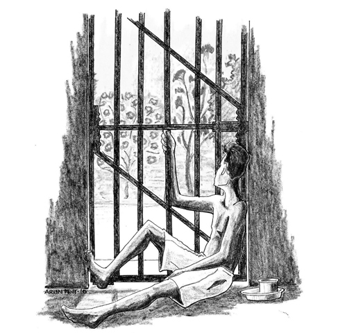

# Hope

{width=500px height=480px}

My last two Gondia cases were completed in January and February 2011. My
earlier attempts to obtain bail having failed, my advocates and I had
put our minds to having the trials in my nine cases completed. It
entailed studying the charge sheets, picking out anomalies in the
prosecution's story and discussing with the lawyers probable lines of
cross-examination. It had taken almost four years for all the Gondia and
Nagpur cases to be done with. While acquitting me, the judge had
concluded in almost all the Gondia cases that there was 'absolutely no
evidence against the accused' and that the
prosecution had 'miserably failed to prove guilt of accused beyond
reasonable doubt'.

I was now left with just one case in Chandrapur, in which I had to
defend myself against charges of sedition, membership of a terrorist
organization and conspiracy to commit a terrorist act. The number of
trips I had to make to court was reduced. My mind now often started
contemplating the details of how to hasten the tempo of the process, and
how to prepare myself for the future that seemed almost within reach.
The same was true of my family. Letters and discussions at _mulakaat_
would always dwell on the probable month of release and possible plans
with Akshay and my wife.

## 69, Tuesday, 8 February 2011, 9.30 p.m.

_This morning I suddenly received news that I had consecutive Chandrapur
dates. So with heightened spirits and hopes we immediately got ready and
left. I have just returned and after a quick dinner and some hot tea
from Ganpath in my neighbouring cell, I begin this letter. The good news
is that the prison administration has begun installing ceiling fans in
cells. However it will take some time before they start putting them in
our yard. That's the pace of government work when it comes to providing
services for the poor. I have read that this summer is going to be much
more severe. In one of the articles I read that the Central Government's
Model Prison Manual has been uploaded on the net, titled --- On Prison
Reform & Correctional Administration. Do try downloading it and sending
it to me when you visit next. It is not urgent but will help
us._

\ 

In January 2011, _Dalit_ writer and cultural activist Sudhir Dhavale was
arrested by the Gondia police after he addressed a literary convention
at Wardha. Sudhir, a 42-year-old resident of Mumbai, was one of the
founding members of the Republican Panthers, an organization fighting
for caste eradication in the tradition of the _Dalit Panther_ movement. He
was charged by the Gondia cops under the provisions of the Unlawful
Activities (Prevention) Act and for waging war against the state. After
his time in police custody, Sudhir was brought to our prison and
classified as a _Naxal_ undertrial.

I had known Dhavale since my college days. He had always been a vibrant
and committed political activist sensitive to the issues of caste
oppression. He saw the emancipation of _Dalits_ in the revolutionary
transformation of society. From a reading of his charge sheet, I
observed that the charges against Sudhir were essentially regarding his
authoring and possession of books related to the _Maoist_ movement. As
evidence, the police claimed to have seized from his residence a '_Free
Dr. Binayak Sen_' pamphlet, a charge sheet of one of my cases and books
authored by him in Marathi. Although Sudhir published and sold these
books legally in Mumbai and the rest of the state, the police booked him
in a case in Gondia, more than 1,000 km away. Sudhir's arrest did not go
without protest. Many socialists, _Ambedkarites_, communists, trade
unionists, cultural activists, writers and intellectuals of Maharashtra,
all united to demand his immediate release.

However the state was getting increasingly thick-skinned. Political
activists like Sudhir, Ashok, Sridhar and Vernon were a threat. They
exposed the government's anti-poor policies and incited rebellion among
the masses. This, the state claimed, was hurting the conducive climate
needed to spur investment and the growth of
the elite. The armed _Maoist_ movement had to be crushed, regardless of
tribal casualties, as its presence prevented the occupation and
exploitation of forestland rich in mineral deposits. In the Surjagarh
area of Gadchiroli, for instance, steel companies had obtained blocks
for extracting huge deposits of iron ore, but _Maoist_ resistance had
prevented the mining from beginning. These were conditions that prompted
the government to launch _Operation Green Hunt_, a military offensive
against the _Naxalites_. As a consequence, in the preceding four years,
the number of _Naxal_ undertrials in Vidarbha, including tribals of Gondia
and Gadchiroli, had quadrupled to almost 120.

As I realized in Nagpur, the majority of the inmates, whether they were
alleged _Naxalites_ or not, didn't fit any recognizable definition of
criminal. They had landed in jail either because they had been falsely
implicated by the police or because of an action committed in a fit of
anger, often during a family feud. Not being professionals, they had
been convicted due to poor legal advice.

They faced the task of coming to terms with a life they simply hadn't
imagined. After the initial shock of conviction, they had to stoically
reconcile themselves to living out the long years in jail --- which in the
case of life sentences in Maharashtra average 17 to 18 years.

A large number found some solace in a rigid schedule of prayer and
fasting, _puja_, _namaaz_ and _roza_. Prison nurtures spirituality. It has the
merit of at least temporarily inducing the type of peace obtained by
casting your lot with the supernatural. The sanctimony of ritual has the
sanctity of administrative approval. It benefits the prisoner to show up
at or even organize religious ceremonies sanctioned by the jail
management.

But this game of hide-and-seek between illusion and fact,
between hope and despair, is the constant
condition of nearly every prisoner's existence. The trick to be mastered
is to ensure that fact does not pierce illusion and despair is not
allowed to overcome hope. Once prisoners achieve this, it isn't really
that difficult to keep going.

As an undertrial, you tell yourself that the trial's going well, that
since all witnesses have failed, you are bound to be acquitted. If you
have been convicted, you pin your hopes on the verdict being reversed by
the higher courts. In this, the endemic delays of the Indian judicial
system are a real blessing. Hope remains alive till your case reaches
the Supreme Court, by which time you have reached what you feel should
be the end of your sentence anyway. After that, there are remissions and
pardons to look forward to.

You enter that bewildered yet hope-filled period of waiting for your
_likhaan_ to be finalised. _Likhaan_ is the colloquial term for the review
file prepared by the Jail Judicial Department for every long-sentence
convict. The _likhaan_ file reports on the prisoner's conduct in jail and
contains calculations of the set-offs for which he is eligible. It also
contains the recommendations of the jail, police and administrative
authorities. This document is sent to the state government for reviewing
prisoners' sentences and to obtain premature release. A prisoner usually
gets seven days of pardon for every month of his sentence served in
jail. Prisoners with life sentences, for instance, are eligible for such
_mafi_ and it would be set-off from the prisoner's sentence. The lifer
could be prematurely released after 14, 16, 18 or more years in jail.
But this pardon is dependent upon his conduct in prison and the nature
of his offence. Political prisoners in Maharashta are those who are
least likely to be pardoned, regardless of their conduct, and often have
to spend between 30 and 60 years in prison.

However, as the government's rules for premature release are so
complicated, it is rare for any prisoner to be able to estimate what
kind of _likhaan_ he will finally get. It takes years for the bureaucrats
at the state headquarters in Mumbai to decide. It is only then that you
have some idea of when you can expect to be finally released. This
starts your _ulti ginthi_ --- the countdown, as you tick off the days
remaining for you to go home. Throughout all this, as you battle to
maintain your balance. The abiding symbol of hope and despair is the _Lal
Gate_, the red exit gate. It makes an appearance in rhetoric, in small
talk, in jokes and in your dreams. It is the barrier that holds you in
and the portal that will lead you out. The secret is to ignore the
barricade and only see the door. That helps maintain some semblance of
sanity.

But for some, the long years of prison life pass without the slightest
contact or communication with the outside world. Poverty prevents them
from even finding anyone with enough money to put for the _surety_ the
state demands for sending a prisoner on furlough or parole. Besides,
many families can't afford the expense of travelling to jail for the
monthly _mulakaat_. Illiteracy or the breakdown of family relations could
mean that there won't even be a letter. As the lonely years stretch on,
the line separating these prisoners from insanity steadily blurs.

Sixty-five-year-old Kithulal was among the victims of such
circumstances. His lean, muscular body and hardened palms spoke of a
life of toil as a farm labourer, while his long grey hair and feminine
gait reflected the community of dancers he came from. He had been
convicted for the murder of a small boy who died by accidentally
consuming the pesticide Kithulal used for his crops. Kithulal could not
afford a proper defence, and now he was denied contact with his family,
who lived about 300 km away in another
state. He was sentenced to life imprisonment. He would cheat time to
give himself hope. He would manage to convince himself that he'd almost
done his time and that the benevolent government would be soon
announcing a special remission that would see him out of jail. The three
or four months before each Republic Day and Independence Day were
periods of carefully cultivated hope because he believed that the
government would announce an extraordinary reprieve and he would be
walking out of the _Lal Gate_ on the great day. As the day came and went,
despair would choke his normal loquacity.

He'd then resort to other devices. He would get absorbed in a flurry of
apparently irrational activity, as if sweat expended in sufficient
quantities could wash away the pain. The normal opiate of fasts and
other religious rituals would take on larger dimensions. In a short
time, he'd be pinning his hopes on his next release date.

In a place dominated by a few professional felons, Kithulal would put on
a show of villainy. At the slightest provocation, he would let loose a
loud string of abuse. This amused the professionals. Like kids attacking
the a village madman, they'd pelt him with pebbles or insult him,
enjoying his reaction. Watching his ranting, I couldn't help but wonder
about the sanity of a society that sees fit to incarcerate people like
Kithulal for 15 years or more.

## 71, Monday, 28 February 2011

_The Godhra case verdict is horrible. An attempt to pacify the Hindu
majority. Can't decide which is worse --- 50 persons being
finally acquitted after spending 9 years
in prison or the ones who have been convicted on the basis of their
so-called confessional statement. Now the quantum of punishment is
awaited. Based on this logic, I am sure the gallows will be given to
quite a few. The Gadchiroli police have halted our escort to court,
citing the reason that there is a shortage of guards due to the ongoing
anti-Naxal operations. However they somehow manage to provide guards to
rearrest from the jail gates, which has become a common practice out
here ..._

## 74, Monday, 21 March 2011

_A total anti-climax! After days of waiting, we landed up not being
taken to court. Anxiety is on overdrive. Please phone up the lawyers and
find out what happened today. Saturday, March 19^th^ was a day of much excitement. Mainly because four
undertrials, arrested in Naxal cases got released. Among them was a
woman._

\ 

Lata from the _bai_ (women's) barrack and Sampath, Shyamlal and Fagulal
from my yard, all of whom had been arrested in _Naxal_ cases, were
released in March 2011. They had spent over 6 years in prison. After
being released in an initial batch of cases, they had been rearrested in 2009.
The court had granted them bail but they were unable to take
advantage of the order because they were too poor to raise the money. So
they were left with no other option but to be put on trial, which
ultimately took more than two years. They too were clients of my lawyer
and I had known them since I was imprisoned. All the three boys learnt
to read and write in prison. I had been teaching Sampath and Fagulal
English and Maths since 2008 and Asghar of the _phasi yard_ had taught
Shyamlal. Due to their long incarceration and
cheerful behaviour, they were also popular
with the prisoners and jail staff. The day after they had walked free,
we read in the newspapers that they had been rearrested. Luckily, this
turned out to be false. Their release was an extremely emotional time
for all of us in the yard. It was a sorrowful yet joyous separation.
That's prison life.

In April 2011, the Supreme Court granted bail to Binayak Sen, a
paediatrician and human rights activist. He was arrested in Raipur in
2007, a week after my arrest, and similarly charged under UAPA and
sedition for allegedly abetting _Maoists_. An international campaign had
called for his release, but Binayak was convicted and sentenced to life.
Subsequently, the Supreme Court had granted him bail pending his appeal
against conviction. For us, political prisoners it was proof that the
charges levelled against us were false.

The Supreme Court made noteworthy observations while granting Binayak
bail: "If Mahatma Gandhi's autobiography is found in somebody's place,
is he a Gandhian? No case of sedition is made out on the basis of
materials in possession unless you show that he was actively helping or
harbouring _Maoists_."

We assumed that such a remark would pave the way for bail for hundreds
of other political prisoners incarcerated on similar charges.
Unfortunately, the Supreme Court did not mention these observations in
its written order and hence it could not become a legal precedent.
However, the '_Free Binayak Sen Campaign_' brought back the issue of
political prisoners into the mainstream media and gave a boost to the
civil liberties movement in India.

## 82, Friday, 6 May 2011, 7 p.m.

_Thanks for visiting me. I always wonder whether the few moments we get
to talk is worth the trouble and expense. Before this visit, I always
thought that you had met me only recently. You proved me wrong by
reminding me. I think, memories of you guys have conjured up an image of
proximity and hence this confusion. There were so many things I wanted
to discuss, but seemed to vaporize after seeing you. Next time I should
note them in advance._

_After the last court date did not materialize, I finally picked up a
500+ page novel 'Depths' written by Henning Mankell. The novel is based
on a Swedish Navy officer who mapped ocean depths just prior to the
First World War. This fictitious character, being mentally sick, pursued
adulterous relationships and in the process failed to fathom his own
emptiness, finally committing suicide. This author is Swedish. He was,
5--6 months ago, part of a flotilla bound for the Gaza Strip which was
later captured by the Israeli authorities. Henning Mankell and other
European intelligentsia had undertaken this voyage as support for their
struggle of the Palestinian people. Mentioning the Palestinian struggle,
you may have heard the good news. The radical Hamas has entered into a
unity process with the moderate Fatah faction. It's not yet clear how
and why such a unity emerged especially after the various Arab revolts,
but nevertheless it is great news and has already frightened the
American-backed Israeli ruling classes._

\ 

I regularly discussed the Palestinian question with Abbas Mohammed Ali
Shahadi, a _convict-warder_. He was in charge of the _danda kamaan_ and
would regularly enter the _phasi yard_ during the cleaning of the toilets
for a game of carom or volleyball or to catch BBC Arabia on our yard
radio. Abbas, a patriotic Palestinian, had
been arrested in 1998 in a case involving an attack on an Italian pilot
at the Mumbai airport. The Fatah-Revolutionary Council, a breakaway
Palestinian faction, had initially planned to target an American. But
the teenager Abbas ended up shooting at an Italian instead. The Italian
survived the attack and Abbas was arrested carrying a machine gun,
around 75 live rounds and two grenades. Stories of his experience in
jail had all of us enthralled. During the initial years, his hands and
feet had been kept shackled throughout the day and it was several years
before he was let out of solitary confinement.

Abbas was convicted to a life sentence and after 21 years with
remissions, was due to be released in 2009. As his date came nearer, he
became ever more restless. His future was uncertain because it wasn't
clear that his homeland would accept him. If the Indian government could
not deport him, he would be kept in a police lock-up. Fearing this, he
regularly made me draft applications to his consulate, the Human Rights
Commission and the courts. He even contemplated carrying a copy of
Mahatma Gandhi's autobiography on the date of his release to impress
upon the police his change of heart. After being released in October
2009, Abbas finally managed only a few months in a lock-up before being
united with his sister and ageing father in Jordan. Such stories always
brought hope to even the most disheartened in the prison.

## 83, Monday, 9 May 2011, 6 p.m.

_About the stuff you had sent, the magazines were enjoyed by many and
the red ballpoint pens did not reach me. For the prison
staff they are invaluable, since in most
registers they are required to make their entries in red and the
administration does not provide them stationery. Hence, of the two pens,
one was pocketed at the gate itself while the other I had to gift to one
of the staff for quid pro quo!_

_I have begun reading a book by William Dalrymple --- 'The Last Mughal'.
It is not a fiction piece, rather a book regarding the emperor of Delhi,
Bahadur Shah Zafar, and the events of 1857. The story is pieced together
from nearly 20,000 documents called the 'mutiny papers' which have never
been translated from Urdu or Hindustani. But rather than that boring
style of a historical piece, this one is quite light and more like an
action-packed novel. However it's nearly 500 pages with a fine font. But
what the heck, I have all the time in the world. (At least till the next
court date.)_

_Of late we have been enjoying nearly 1½ litre of milk every day. Thanks
to our in-charge _convict warder_ who benevolently shares the stuff he
manages to siphon off. We use it to make some curd, which is a blessing
in the summer._

\ 

Experiencing the dry and scorching Vidarbha summers in prison was a
topic that often dominated my letters. Temperatures could go up to 49˚C,
as they did in the summer of 2009. Even the electric fans installed
four years after I'd been imprisoned merely swirled hot air around us.
The switches for both the lights and the fans were placed outside the
cell so before _bandi_, we had to decide whether to use the fan and if so,
at what speed. In the cell, the floor got really hot and any attempt to
lie on it caused great perspiration. At dawn, ants would climb over me
to feed on the salt that had caked my torso and the bedding. I'd wake up
every day at about 4 a.m. to their tickle. In the evening
we'd have to sprinkle water on the floor to
cool the floor. The water situation in the prison was aggravated in the
summer. In some barracks the inmates would have to fill drums with water
and carry them to their barracks on the first floor. This would take two
or three hours every day. Attending to basic needs consumed most of our
time in prison.

The monsoons and winters brought other challenges. With the onset of the
rains, our ceilings would start dripping and the walls and floors
sweating due to water seepage. Each day, with the discovery of every new
drip, we'd have to secure a new place for our bedding, books and
clothing within the limited confines of the cell. In winter,
temperatures would often drop to 6ºC at night, making the cold
unbearable. A freezing draft would enter the cell. I had only a single
blanket to cover myself with and another to lie on. The only option was
to wear multiple layers of clothing. Blankets were in short supply. We
once tried to tie old blankets on the cell bars to stop the draft, but
the superintendent ordered them to be pulled down. I wonder whether the
officials would be able to survive in the conditions they imposed on us.
More likely, this was just a way of reminding us inmates who was the
boss.

## 85, Friday, 20 May 2011

_Today, I received a postcard from Daddy. He had sent it from Goa
containing this brief message, 'Arrived 30/4 Saturday. Market P.O. We
are all well. Thomas.' Daddy's typical short and simple style._

_We recently commemorated my '_birthday_' in prison. Out here, the humour
is of very poor quality and hence we stoop to
remember our date of arrest as
our birthday or entry into the prison world. Hence I have now become
four. This day always brings back memories of 8^th^ May 2007. The pain and sorrow could be easily laughed
off if this incarceration ended. But till then one has no other option
than to grieve. Or sarcastically use the occasion to 'celebrate' and
share a biscuit packet with other inmates. I was lucky some of the boys
of our yard managed to snare a bandicoot. It was a healthy and weighty
one._

_America seems to have finally eliminated Osama. This head of Osama may
help boost the electoral chances of Obama in the next presidential
elections. He has been facing severe criticism from the right-wing
conservatives regarding the health reform and bailouts for corporates
and hence needed this kill. While America claims that they have given a
fitting reply to the killings of 9/11, one wonders whether the same
feeling of vengeance is allowed for all the victims of the wars in
Afghanistan, Iraq and now Libya --- wars that were unilaterally engineered
by America. But these questions we aren't supposed to ask, lest we too
are labelled as 'terrorists'!_

\ 

America's Islamophobic policy was a topic Salaam --- a senior convict ---
enjoyed discussing with us when he'd come daily to our yard for a bath.
His wisdom was built from years of reading literature while working as a
typesetter in a printing press in Chandrapur. Salaam was convicted to
life imprisonment for a murder he never spoke about and details of which
I could never bring myself to ask him. Now, as a warder, convict
overseer, he was in charge of distributing the letters and money orders
we'd receive by post. The mail would be delivered at the prison gate by
the afternoon and it was 60-year-old Salaam's job to collect it, inform
the prisoner concerned, acquire his signature
and present him before the jailer for the
letter to be censored.

In the case of money orders Salaam had to acquire the prisoner's
signature before depositing the receipt back with the gate jailer, who
would then enter the amount in the prisoner's account. This job meant
knowing every prisoner and their barrack and Salaam was extremely
efficient at it. While others would have to shout the name of the
concerned inmate, Salaam would do this with the least effort, like a
true _dakiya_. Suddenly he'd be near you, wherever you were in prison,
peering over his reading glasses to inform you about your letter. Before
_bandi_, we'd often eagerly look out for him, because to sight Salaam
meant a letter had arrived. He was finally released in 2011, after
spending more than 17 years in prison.

Salaam only needed a wee nudge to get talking as he washed his clothes.

'The Wikileaks exposure of the US diplomatic cables has exposed
America,' I'd start.

'For Islamic nations, their _dadagiri_ was always visible,' was his prompt
reply.

'And now the US has pounced on Assange.'

'_Woh toh hai_.'

'Many have also come out in support.'

'This wouldn't be possible if Assange was a _Musalmaan_,' commented
Salaam. 'He would have been easily labelled a terrorist, denied support,
isolated and ultimately physically eliminated.'

Salaam's conclusions were always thought-provoking.

## 88, Sunday, 24 July 2011, 5 p.m.

_The rains have picked up here too. We experienced continuous showers for
the past 4--5 days. The water levels in the prison wells have risen and
hence the water problem has been solved, until the next summer of
course. The Mumbai bomb blasts were horrible as you rightly said --- too
many innocents killed. Gujaratis were especially targeted. However in
prison I have had the opportunity of interacting with some guys who
believe such blasts to be correct. They cite the events of the 2002
Gujarat riots, where innocents of the Muslim community were targeted,
raped and killed. They incorrectly blame the majority Gujarati community
for such crimes against humanity. By doing so, they fail to see the role
of the rulers who engineered these riots as part of their policies of
divide and rule. They thus fall into the very trap created by the real
perpetrators. Though their anger and want for revenge is reasonable and
justified, their methods are misplaced. The State too has horribly
failed in protecting their lives. While the major players of the Gujarat
riots roam scot-free, the most devoted of the Muslim youth are arrested
and made to rot in jail._

_Don't worry; we maintain 'safe distance' from the eunuchs in our yard.
There are many characters in prison such as druggies, peddlers, and
other professionals, who we have learnt to stay away from. They too have
no interest in socializing with us, except for an occasional court
application that they request us to draft. Other than these guys, who
are the usual frequent visitors to the prison, there are the majority
who have committed an offence by accident or compelled by circumstances.
They are the better elements to socialize with._

\ 

In July 2011, three young eunuchs Sonia, Sapna and Saloni, accused of a
murder were brought into our yard. The prison authorities could not send
them to the women's barrack nor keep them
in a general barrack lest their presence provoked sexual attacks on
them. The _anda_ barrack, _phasi yard_ or similar cellular confinements like
ours were the only option. These cells are out of bounds for the other
prisoners, but we soon had a steady stream of visitors from the other
barracks --- they had devised some excuse or the other to enter and catch
a glimpse of the new entrants. As my cell was before theirs, many would
stare or make a pass at me assuming from my clean-shaven face that I was
one of the eunuchs they were searching for. Angered by this, I even
contemplated growing a moustache. Suddenly our yard which was earlier
inhabited mainly by us political prisoners became the centre of
attraction for all inmates. For us too it was a learning experience --- we
soon made friends and, as the three got talking, we gained first-hand
knowledge of the severe stress and strain that society imposes on the
LGBTQ community. Such strain increased manifold in jail. They had landed
here after a quarrel that began when they were soliciting alms in a
train turned horribly wrong and one passenger was killed. Denied bail,
they had to spend 18 months in prison as undertrials, before they were
acquitted and walked free.

Somehow my last Chandrapur trial proved to be a test for my nerves. It
was the case where I had been implicated with the youth of the
_Deshbhakti Yuva Manch_. A case designed to resemble those grand
conspiracy cases of the British Raj and proving to be equally messy. I
would grow anxious as this last court date neared. In October 2010, I
had court dates on every alternate day. I expected my acquittal and
release by December 2010. An unexpected bonus was that my co-accused,
local students from Chandrapur, would manage to treat me to delicacies
unavailable in prison. One day it would be homemade mutton masala, on
another it would be sweet-pumpkin _pakodas_
or egg masala. A series of such consecutive dates invariably gave me a
stomach upset. Eating the same insipid food in prison had made my
intestines sensitive to rich and spicy food. Not that I cared.

Then suddenly for the next two to three months, the pace slowed down.
The judge went on vacation and witnesses were not turning up. In March
2011, the Nagpur police stopped escorting us to court. Was it better
that we were not compelled to undergo the 8-hour long journey in the
scorching sun when nothing was happening in court? Police personnel
informed us that our court dates had ceased because the government had
not sanctioned a diesel allowance for the escort vehicles. The official
story, though, was that guards were not available due to security
concerns.

When we began to be taken to court again in May 2011, another delay
arose. After the trial had proceeded for nearly four years, the judge
decided to add another recently arrested person who was wanted in the
case to our trial, thus making way for his trial to be heard with ours.
This would mean that although witness examination in our trial had
concluded, it would have to start afresh. My lawyers and I fiercely
resisted this move. I took the opportunity to speak in court and explain
to the judge how this was a method regularly used by the prosecution in
nearly all my cases. The police would show a list of nearly
sixty-seventy accused, delay their arrest and when arrested, propose
that they be added to the trial. Each addition of an accused person to
the trial delays the trial. The cops would deliberately use this
strategy to incarcerate us indefinitely.

The judge was soon convinced. Then in July 2011, we stopped being taken
to court once again. Police _bandobast_ had been increased in the city due
to communal unrest and both police
personnel and the vans for our transportation to the court were
diverted. The case was stalled again. It wasn't until 18 August that the
judge finally recorded our statements. The arguments of the prosecution
and the defence soon followed. This roller coaster case would have
concluded in August but then the judge went on vacation. I was confident
about being acquitted. It was the delays that made me anxious.

## 91, Wednesday, 31 August 2011

_Hi, where would I have been in different circumstances? Just can't stop
dreaming. It was horrible to hear that the judgement was not pronounced
yesterday. Throughout the days leading to the 30^th^ I have been distributing my belongings, which is the
practice in prison. Anyway, the events of yesterday once again confirm
my faith in the ineffectiveness of our justice delivery system. Our
judge did not pronounce his judgement because he did not go through the
papers and a long date was given because he is now going on vacation. I
have to now submissively accept my deprivation of liberty till he comes
back from vacation and reads the case papers. As always, do I have a
choice? This delay has happened in all my previous cases. Why didn't I
expect it this time?_

\ 

There is a 'prison-release routine' or rather tradition that every
inmate follows religiously as his day of release approaches. I would
anxiously wait to hear my name called out by the _convict warder_ assigned
this duty. As soon as the barracks opened, I'd wait for him to appear.
All morning ablutions and meals had to be planned so that I wouldn't
miss his call. When I saw him, I'd try to read his lips, in case he was
too far away for me to hear his yell. Once
my name was called, another process would begin --- meeting inmates and
exchanging hugs with all who had been friends and 'family' all through
my period of incarceration. As I started to gather my belongings,
another set of inmates would crowd the doorway --- the type who wanted to
lay their hands on my belongings. There is a prison superstition around
this routine: it holds that all clothes worn in prison should be left
behind or else bad luck will follow. One was expected to walk out in a
new set of clothes. Still, though habitual offenders followed this
practice rigorously, it could not guarantee that they would not return a
few months later. Thereafter, I would be given a meal and sent off to
the judiciary department of the prison for release.

## 92, Thursday, 8 September 2011

_Mummy, I heard you had a fall on your way to meet the lawyer. Hope it's
nothing serious. At this age your bones, especially at the hips tend to
get brittle. I guess you had too high expectations about the last court
date. It's better to expect the worst and therefore be mentally prepared
for whatever the outcome. Like I mentioned in my earlier
letter --- 'there's many a slip between the cup and the lip'. This would
include all the events from the court date, judgment, and release from
prison, until reaching Mumbai. It's better to be prepared for the worst.
Although my personal experience tells me it's easier said than done.
Nevertheless, try it._

_If all works out well, we could plan a trip out in the Diwali
vacations. Akshay too will enjoy it. I have not received a letter from
you. Regarding your plans to come and visit me I suggest 24^th^ September.
In case the judgement is not delivered on
that day, you may have to cancel your trip and book it for the next
court date._

\ 

Prison wisdom says that the first few months of jail life and the last
ones are the most horrible. And as freedom neared, the days grew longer
and I would lie awake at night. Reading and writing became extremely
burdensome. Old school and college friends popped up in my dreams. My
mind was probably preparing itself for life on the outside. I started
making plans for the future. On 24 September 2011, the Chandrapur court
finally dismissed the last of the nine cases against me. Immediately
after the order, I managed to phone my wife using a friendly police
officer's mobile. She appeared shocked to hear my voice on the phone
after almost four years and initially thought that my call meant that I
had been arrested in yet another case. Extreme joy is impossible to
express to one's wife over the telephone, especially on a cop's phone,
surrounded by half-a-dozen armed policemen. That would have to wait.

