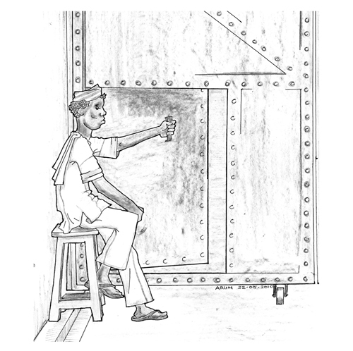

# _Lal Gate_

On the morning of 27 September 2011, I received a _mulakaat_ from my
lawyers, mother and brother. We excitedly discussed all that I would do
after my release. I had informed them that it would take a couple of
hours to complete the procedures for securing my release before being
able to meet them. By 2 p.m., all those to be released were lined up
before the _Lal Gate_. I was deliberately kept as the very last.

As I stepped through the wicket-door, a group of men pounced upon me. I
could not see my mother or lawyers, who, I
later came to know had been made to stand beyond the outer wall of the
prison. I attempted to scream and alert them, but the men had their
hands clapped on my mouth and, pushing down my head, they dragged me out
of the gate. Within seconds they dumped me into an unnumbered white Tata
Sumo that had been parked a few feet from the gate. Six men jumped into
the vehicle and I was driven out of the prison premises. My mother,
brother and advocates, who had come to receive me, were pushed out of
the prison by the authorities. My lawyers immediately went to the local
police station but the cops there refused to register a complaint
regarding my abduction. It was obvious that personnel from the police
station and the prison authorities had assisted my abductors.

I was taken out of the city. My abductors, who I assumed were policemen,
were armed and refused to disclose their identities, the purpose of my
abduction or our destination. I pleaded with them to ease my family's
anxieties by informing them or my advocates about my whereabouts. They
refused, despite having mobile phones on which they were receiving
repeated instructions from their seniors. After about three hours, I was
taken to a police station in Gadchiroli district.

The police rearrested me in two more cases related to _Naxalite_ attacks
in 2007 and I came to know my abductors were policemen of the C-60, the
elite commando force involved in anti-_Naxal_ operations in the Gondia and
Gadchiroli districts. I was once again produced before a magistrate, who
granted the police custody despite my complaining about my abduction and
rearrest. After five days in Wadsa Desaiganj, Gadchiroli, I was sent
back to the Nagpur prison. My old companions in the _gunahkhaana_ had come
out to the _Badi Gol_ gate to receive me. Each of them hugged me and
helped me settle back into my old cell,
filling me in on the details of reports of my rearrest that had appeared
in the newspapers. I was crushed at the thought of having to run through
the same cycle of torture, bail applications and waiting endlessly for
trial dates.

## 93, Tuesday, 4 October 2011

_Hi, the tiger ultimately bared its fangs, I guess!! Or rather the true
face of Indian democracy. All through the journey after I was rearrested
from the prison gates I kept wondering about what you two would be going
through. Though I was mentally expecting this, I nevertheless kept
hoping against it. Hoping that I would be able to join you. Guess such
dreams and plans will get postponed. But however hard they may try it
will definitely happen one day. I came back into prison on the
3^rd^ at around 4.30p.m. I received tremendous
support and sympathy from everyone --- inmates and lower-level staff
included. All have offered some suggestions, help and instilled hope. In
fact, throughout this entire episode it is the state which has
discredited itself and sacrificed long term interests for short term
ones. It has reduced people's confidence in the judicial
system._

_All inmates chipped in to make sure that my life was restored the same
as prior to my 27^th^ September rearrest. I have
been given the same cell, beddings, buckets, etc. These essentials I
have been gradually accumulating throughout the past 4½ years (defended
and safeguarded from numerous prison jhadatis) and it would have been a
pain to start from scratch again. This was one of my major fears which
was easily solved by the love and affection of other inmates --- like a
family you could say. I also heard that 125
inmates observed a day of hunger
strike in protest of my rearrest._

_And finally, an attempt to answer the most important question that
would have crossed your minds --- how much more time to go? One thing is
sure that it wouldn't be as long as the earlier period of 4½ years. So
don't be too disheartened. The lower time limit is based on many
factors, but such would be best discussed in person rather than writing
via this censored medium. I am sure this opportunity will soon
come._

\ 

My rearrest was not an exceptional act, particularly in relation to
_Naxal_ cases in Gadchiroli district. The desire to show results and win
awards and increased funds was leading police officers in Gadchiroli
district to increase the number of persons shown to be arrested as
_Naxals_ by detaining released prisoners at the jail gates. Many
prisoners, particularly poor tribal villagers who lacked adequate legal
defence, were abducted from jails at the time of their release with the
connivance of prison officials. In the records, the abducted people were
shown to have been arrested anew in some remote corner of the district.

In prison, I met three tribal men from Gadchiroli named Baburao Narote,
Kejuram Pudo and Vilas Kallo who were rearrested at the jail gate every
two or three months --- each time they were released. After their first
arrest from their village in Dhanora, Gadchiroli they were released on
bail in October 2011. On release, they were abducted by cops in civilian
clothing outside the Chandrapur prison but on the way to Dhanora, the
police van transporting them had a serious accident. Three other tribal
men from their village who were also rearrested were critically injured
with spinal injuries and were hospitalized for over a month. Baburam,
Kejuram and Vilas were put back in prison, this time in Nagpur, with
bruises and fractures. Within two months
they were again granted bail. But on release, they were arrested for a
third time, in December. By then, their families had run out of money to
pay for bail so the men had no choice but to reconcile themselves to a
prolonged stay in prison until the completion of their trials.

Despite my disappointment, my rearrest had a silver lining. It brought
this obnoxious practice of the Gadchiroli police to national attention.
Newspaper headlines said, 'Is Maharashtra becoming a police state?',
'When the State Turns Abductor', and 'SC guidelines violated in arrest
of Ferreira outside Central Jail.' It brought the issue of my
incarceration back into focus. Family, friends, media persons and civil
rights activists who had campaigned for my release suddenly started
receiving overwhelming support. Civil society groups and individuals who
had earlier refused to give their overt support started coming forward.
I even became an issue for political rivals to compete on. City level
leaders of both the ruling and opposition parties made representations
to the Home Minister and Director General of Police demanding my
immediate release. By arresting me again, the credibility of the state
had taken a beating.

This round of police custody in Gadchiroli was completely different from
my earlier experience in 2007. The police were not at all interested in
interrogating me or keeping me in custody. They merely wanted to show on
the record that I, the 'dreaded terrorist' was 'severely interrogated'
to prejudice the judiciary in ensuring that my incarceration be
formalized by due legal procedure. In fact most of my time in the
lock-up during this stretch was spent in reading a John Sandford novel.

In October 2011, the prison administration suddenly transferred many
_Naxal_ undertrial prisoners to Amravati, ostensibly because our numbers
were increasing. I feared that I too would
be transferred. Transfers from one jail to another are so arbitrary and
abrupt that they are a major cause of anxiety. Suddenly, you would get a
message from the judicial department of the prison that your transfer
had been decided and the police escort had arrived to take you. You were
then expected to pack up without any discussion and leave. Such
transfers were usually used by the administration to crush potential
dissent. In this particular case of _Naxal_ undertrials being transferred
to Amravati prison, the ones who were the most vocal in raising issues
with the authorities and who had relatives in the women's barrack were
targeted. It became obvious to us that the recent hunger strike by men
and women inmates was a cause of concern for the administration. We had
collectively protested the brutal assault of Angela Sontakkay, a woman
_Naxal_-accused, by the prison staff.

An analysis of the trend of these transfers brings to the fore another
hidden motive of the government. Earlier in October 2010, around sixty
_Naxal_-accused Gadchiroli tribals were transferred from Chandrapur to
Nagpur, a distance of more than 180 km from their villages. Then, in
October 2011, they were transferred from Nagpur to Amravati, 330 km from
their villages. In 2012, a few were transferred to Akola, more than 430
km from their homes. The government was hell-bent on severing all their
ties with their community, so as to cripple their legal defence. It
won't be long before we see tribals of Gadchiroli lodged in the prisons
of Mumbai.

When re-admitted in prison I was assigned _hauladi_ number 162. Due to the
increase in the number of undertrials arrested in _Naxal_ offences, the
administration had begun classifying and numbering us separately. I was
the 162nd _Naxal_ undertrial to be admitted in the Nagpur prison in 2011.
This number had grown from just thirteen in 2008. Throughout my years of incarceration, it was this community of
political prisoners that became my _de facto_ family. A desire for social
change and a common approach for struggle kept us united in prison
despite being lodged in different barracks.

In the rest of the country, too, we political prisoners now formed a
significant proportion of the non-criminals in jails. As people across
the country increasingly confronted the ruling classes and their state,
our numbers were rising. While all of us shared some conviction in a
cause dreaded by those in power, many of us had been implicated in acts
in which we had played no role, or acts that had been criminalized by
the provisions of special laws. Muslim students who protested communal
atrocities, tribals who fed a _Naxalite_ squad, activists and _Maoist_
sympathisers could all be labelled terrorists and _anti-nationals_ under a
variety of special laws.

Such political prisoners entered the jail with a stamp imposed by the
police that the prison authorities immediately acted upon. Their first
step was a quarantine policy that was followed more stringently than any
Prison Manual provision for communicable diseases. Segregation was the
rule and the greater the estimated ideological infection the prisoner
could cause, the harsher the segregation. The _anda_ barrack, _gunahkhaana_
cells and even _phasi yard_ came in handy to cut us off from ordinary
prisoners. We _Naxalite_ prisoners were listed separately in the daily
counting and forced to wear green sleeve bands to mark us out. In July
2007, the Inspector General of Prisons issued circulars on how to
contain _Naxalites_ and restrict their influence not only on prisoners but
also on the prison staff and officers.

In all this, he was only faithfully adhering to the 'septic tank
principle' proposed by Reginald Craddock,
Lt. Governor of Burma, in his correspondence with the Indian home
department in 1918. He prescribed separate barracks, separate yards and
even separate prisons for freedom fighters to 'keep the poisonous gas
within the tank and ensure the safe custody of those emitting it'.
Despite the Supreme Court ruling against the quarantining of such
political prisoners, prisons across the country routinely adhere to this
practice. The new 'Model Prison Manual' of the central government even
calls for the setting up of separate and isolated 'high-security'
prisons to lodge such inmates.

But try as they may, no jail administration can hold back the fragrance
of the septic tank from reaching the barracks. As I've said earlier,
every day, much of our time went into teaching those interested in
learning English and Maths, drafting legal applications or translating
English case papers into Marathi or Hindi. This earned us credibility so
when we organized agitations, such as the one in October 2009 to protest
the death of Mukesh Chankapure, the bootlegger who was beaten to death
in prison, the prisoners immediately heeded our call to boycott the
day's meal. The authorities knew that political prisoners had the
potential to unite everyone in a just cause. A sizeable section of the
general barracks had also joined our campaign in February 2010 to
support statehood for Vidarbha.

The _Naxalite_ and Muslim political prisoners joined hands on 13 September
to commemorate the martyrdom of Jatin Das, who died on the 63rd day of a
hunger strike, along with Bhagat Singh in the Lahore prison, during the
freedom movement. In jails across India, this day is observed as an
occasion to demand recognition as political prisoners and call for their
unconditional release.

But, as I have tried to show in the book, the life of a
political prisoner is a lonely one --- the
loneliness accentuated by memories of a more productive existence
outside. Political prisoner yards are oases of silence, in contrast with
the otherwise crowded and noisy surroundings. The scrape of a chess
piece or click of a carom striker are often the only sounds. Many choose
to immerse themselves in day-long reading and desultory writing. But
these too are perhaps forms of escape from reality, quite comparable
with the delusions of the 65-year-old long-haired Kithulal.

## 96, Sunday, 13 November 2011

_In case you have not heard the good news, I have been ordered to be
released on bail in one of the two cases. After the formalities of
producing sureties are completed, I shall be released in that case.
However there is no immediate need to rush this procedure, since the
other case is still pending. It should end by this month or latest by
the next. Hence I am not trying for bail in it. The news of bail is
really refreshing. Suddenly life in prison merely seems to be a bad
dream._

_I recently read a good novel by Jeffrey Archer, 'Prisoner by Birth'.
Interesting to read how the British courts work and the conditions of
the prison there. The story is a modern version of 'The Count of Monte
Cristo'. At present, other than the usual responsibilities of reading
others' charge sheets, I am going through another novel by Henning
Mankell, 'Kennedy's Brain'. Not action-packed stuff, but a touching
story of the practice of anti-AIDS serum trials in Africa._

\ 

In November 2011, my dedicated team of lawyers in Mumbai,
Nagpur and Gadchiroli finally got me a bail
order. My lawyers were not only efficient and capable but were also
committed to getting me through the colossal tangle of cases, which at
times seemed impossible and hopeless. As civil rights advocates, they
viewed the incarceration of political prisoners as reflecting the
undemocratic state of affairs in the country. They were always ready to
defend our rights and would, whenever the need arose, rush to the High
Court or the Gondia, Chandrapur or Gadchiroli courts despite repeated
threats and annoying surveillance from the police. Shahid Azmi, one such
civil rights activist and lawyer, was shot dead in February 2010 at his
office in Mumbai at the young age of 32. The deeper links of his _supari
killers_ were never investigated. Shahid had been a relentless defender
of political prisoners, especially of Muslims arrested in terrorist
crimes and was part of my legal defence team in Mumbai.

During prison struggles or hunger strikes, these lawyers would
immediately respond to our call and provide all possible support. In
emergencies, they would also arrange to provide stationery, legal
literature, clothes or even just visit my family to console them.
Indeed, over time I began to regard my lawyers as family.

## 97, Wednesday, 23 November 2011

_The news of my bail was reason to celebrate. Today we 'arranged' for a
special dinner. We bought some extra milk from the canteen and made
srikhand on the sly. So for dinner it was srikhand and prison roti.
Heard a Tintin movie has been released. Wonder how Captain Haddock
uttered 'Blistering Barnacles and Thundering
Typhoons'._

## 98, Wednesday, 30 November 2011

_The judge was on vacation and hence we have got another date after
almost a month. Therefore release plans may be further delayed. Hope
this delay gives the lawyers adequate time in preparing my petition to
be filed before the High Court regarding my abduction and subsequent
rearrest. It may be necessary for you to be in touch with the Mumbai and
Nagpur lawyers, as an affidavit may have to be prepared stating on oath
that you were present at the spot of my abduction. I heard that the
local government officials have been harassing you for a bribe for the
preparation of the solvency papers for my surety by stretching a process
which can be done in a few minutes to almost two weeks. Once they sense
there is urgency and anxiety they tend to be more greedy. Sarkari
vultures never miss out on such opportunities. Hence be patient, we have
time until the other case is completed._
