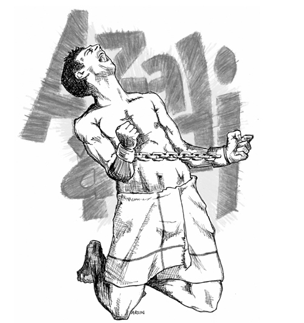

# Beyond the _Lal Gate_

On 3 January 2012, my advocates filed a petition on my behalf before the
Nagpur bench of the Bombay High Court seeking remedies for the violation
of my fundamental right to life and personal liberty. It sought
compensation, action against the police officers responsible for this
outrage and an enquiry into the practice of abduction and rearrest of
undertrials like me by the Gadchiroli police. I had been acquitted in
ten of the eleven cases I had been arraigned in and was granted bail in
the last one of Gadchiroli. This last case related to an incident of
firing between _Naxals_ and police personnel
in the forests of northern Gadchiroli.

The next day, 4 January 2012, I was to be released. My parents had come
a day earlier to submit the bail papers in the Gadchiroli court and
would remain to receive me after the court ordered my release. But,
stepping out of the _Lal Gate_ once again made me extremely nervous. From
the morning, I had been looking for signs of another possible rearrest.
This time, I packed my toothbrush, some toiletries, a set of extra
clothes and some stationery. I would need them if I was rearrested and
sent to another prison. Chandu, the _danda kamaan_ of the _anda_ whom I met
on my way to the judicial department, assured me that this wouldn't
happen. He received this information when he had gone to clean the
toilets in the staff quarters. Even friendly guards and employees
informed me that there was no police activity outside the gate.
Nevertheless, I doubted my release would be trouble-free. Fortunately,
the vociferous public outcry and the skills of my lawyers worked in my
favour. After 4 years and 8 months, I walked out of the _Lal Gate_, a free
man.

As I stepped out, I was greeted by my mom, dad, advocates and
journalists.

'It's over,' I said, hugging my parents. I had no comments for the eager
media, wary that anything I said would be used against me. That's what
happened in November 2010 when Tusharkanti Bhattacharya, a political
prisoner from Andhra Pradesh, was rearrested after a few months based on
an interview he had given to the media when he was released.

We returned to Mumbai the same day. Throughout the journey, my mother
was extremely nervous every time we passed a cop. My sister too had
instructed her not to let go of me until I got back home safely. My
Nagpur advocate repeatedly rang me to check
whether all was well.

The next day, at home, I began receiving calls from friends and
well-wishers. Mom became my temporary personal secretary. I had to write
a letter to Vernon and other friends at the Nagpur prison as I had
promised. Mistakenly, I wrote my own address as Nagpur. I mentioned
getting home safely and how I was enjoying a simple but divinely tasty
home-cooked meal. Later, I met my wife and Akshay, who was now turning
seven. He had just come home after giving his school tests.

For a moment, he failed to recognize me. 'That's _Dada_,' my wife helped
him.

'So how's my Ben-ten hero?' I said to break the ice. From prison, I
would occasionally draw him a cartoon and send it to him in my wife's
letters. He had pasted these on the door of his cupboard. The cartoons
did the trick. He was soon talking to me, sitting on my lap and telling
me about his favourite cartoon character.

'How did your maths paper go?'

'Hmm, okay, but I got one sum wrong,' he answered, gradually getting
comfortable with the idea of conversing with a _Dada_ he had no previous
memories of.

As the conversion started picking up, halfway through a sentence he
abruptly asked, 'When will you be going again?'

I answered him with a hug.

Over the next few days, my family told me about events in Mumbai related
to my arrest: the flood of allegations appearing in the media; the
unexpected police searches and visits; the hostility they experienced
from persons earlier considered well-wishers; and the new friendships
built on true sympathy. But rather than these events, what they were
more interested in talking about were the trials and tribulations they
had been put through, the emotional
distress they had to deal with. During these past years, my parents had
aged considerably. My incarceration had had a large role to play in
this. My brother and sister had selflessly put in their best efforts to
help me, sacrificing family commitments and putting their jobs at risk.
My wife too, had kept her life and career in a state of suspension,
juggling multiple responsibilities in my absence.

I was relatively fortunate. After his release, Naresh Bansod had to deal
with the collapse of his marriage. His boy stayed with him, while his
daughter lived with his former wife. Dhanendra Bhurule and his wife
somehow managed to get back their earlier jobs and repay pending loans.
To the best of my knowledge, Ashok Reddy is still incarcerated in a
prison in Andhra Pradesh.

For the longest time, I found it difficult to deal with my life as a
free man. Persistent phone calls from the media left me in a daze. In
prison, the only person I would meet was my lawyer and we would always
jot down in advance what was to be discussed with him. Technology, too,
was a big challenge. In the world of apps, mobiles and other gizmos, I
felt challenged. All this made me realize how totally unsuccessful
prisons are in preparing a person for society. Being in jail for 4 years
and 8 months temporarily incapacitated me. I wonder how those who are
released after 18 to 20 years cope with life on the outside.

Habits learnt in prison die hard. I often get that urge to preserve a
used pen refill so I could repair a pair of broken sandals or a plastic
container for our _handi gaadi_. Solitude, too, is something I miss from
time to time. The occasional hustle or noise at home or at get-togethers
soon makes me irritable. I also get nostalgic for some aspects of the
simple prison life, such as the camaraderie I shared with other
political prisoners and the depth of
friendship and solidarity we were able to develop. The abundance of time
we had at our disposal allowed us to understand each other almost in
totality.

***

Life after prison is weighed down by two emotions. One is fear --- the
fear of further action by the State. The fear that the State will
somehow get me back in the prison, as has become prevalent with those
political and human rights activists who have chosen to dissent. The
fear that Big Brother is watching every step I take, watching who I meet
and watching which peoples' struggle I choose to support. My involvement
in any such movement will then become an excuse for branding it _Maoist_
and justify repression.

The second is the emotion of confusion --- of how to build life back
again, how to build those relations that were tested and strained during
the years of incarceration. Confusion of how to live life and yet follow
the ideals I believe in. To sacrifice the latter in the interest of the
former is much easier. However, I guess all these dilemmas are part of
the freedom every other citizen experiences in this so-called democracy.
This freedom is definitely better than a caged existence. This freedom
however needs to be worked on. Yes, it needs to be worked upon.

