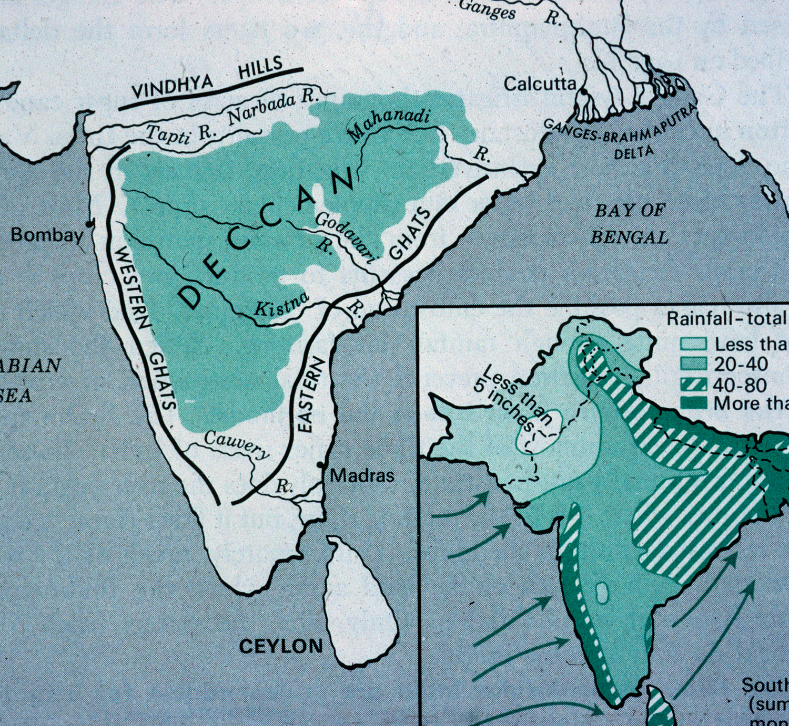

_Y S Rajasekhara Reddy, the new chief minister has given the
impression of being a man who cares for the classes neglected by
Chandrababu Naidu's model of development. Whether that is
really so, is extremely doubtful. That those classes have reposed
trust in the Congress Party under his leadership is clear: the issues
of irrigation and employment appear to have contributed to
the defeat of the Telugu Desam Party, augmented by the desire for
a separate state in the Telangana region. Having realised
his debt to the dissatisfaction, the new chief minister has already
promised heavy investment in major irrigation projects
and free power to farmers. And as for Telangana, YSR has made
no secret of the fact that he has neither any understanding of
the cause nor any sympathy for it._

\ 

Chandrababu Naidu's defeat is the
kind of event that lends itself so
well to analysis by hindsight that
the effort would be too tiresome. In any
case, analysts attached to the Left parties
have done that as ably as hindsight alone
permits, and there is no need to add to their
wisdom (by which it is not intended that
they are altogether wrong). In fact, Naidu
(or '_Babu_' as he is known to his admirers
in the state) is a classic instance of a
phenomenon that the west is probably
already very familiar with, but we are only
just waking up to: a pervasive media creates
a celebrity out of almost nothing, and then
calls in experts to explain why its creation
turned out to be nothing. Chandrababu is
merely an ambitious political schemer who
has managed to con quite a lot of intelligent
people because he knows that their hunger
for the image he has put on --- a third world
politician in the mould of a corporate
executive spewing IT jargon and the
verbiage of the World Bank's development
policy prejudices --- is too acute for the
normal functioning of their other senses.

This is an effort, in part, to introduce
his successor. For if someone does not do
so now, a new myth could soon be in the
making, and if the analysts of Left parties
participate in its creation, as a homage to
coalition politics, one may have to spend
a lot of time disabusing the public of it.
It is so easy to clothe Y S Rajasekhara
Reddy --- MBBS with the image of the good
doctor who has turned to politics to cure
society --- that even without the help of such
expertise, the media may itself involuntarily
do so. Reforms with a human face,
which appears to be the current slogan of
the Congress, suits the image so well.

The man is anything but a vendor of
humane visages. His rise in politics has
been accompanied by more bloodshed than
that of any other politician in this state.
Not bloodshed for some avowed 'higher
cause', but bloodshed for the narrowest
possible cause: the rise of one individual
to political power and prominence. The
recent elections may very well have meant
many things in terms of popular aspirations,
and one has no desire to be cynical
on that score. But in the matter of the
change of helmsmen, it has merely replaced
a man who would find nothing too
crooked if it is in his political interest, with
one who would find nothing too brutal.
And for both, the goal is the same --- Power.
Such precisely are the men neo-liberalism
wishes to find in power in countries such
as ours which it wants to subordinate
to its logic and interests. It would be
imprudent to regard this as an irrelevant
consideration on the ground of the Congress
Party's avowal of a 'human face',
for firstly that expression has no precise
meaning, secondly Congressmen are
known to be capable of changing course
mid-stream, and thirdly India's rulers
irrespective of party have knowingly put
themselves in a position where they have
little leeway in matters of policy.

_YSR_ (as he is known in short) belongs
to Cuddapah district of the Rayalaseema
region of the state. His constituency,
Pulivendula, exhibits a most distressing
topography: endless stretches of nude soil
studded with gravel and relieved by rocks
that are even more bare. It is watered,
using the expression figuratively, by the
Chitravati, a tributary of the Penna (called
Pennair in most maps), itself hardly a river
worth the name. Today _YSR_ wishes to be
seen as a politician who has responded to
the needs of farmers and is determined to do
well by them, but in the nearly three decades
of his political life, he has not been instrumental
in adding one acre of assured irrigation
to the parched lands of the constituency
that has again and again returned him
or his brother (when _YSR_ chose to go to
parliament instead) to the state assembly.

His father Raja Reddy was, to begin
with, an ordinary farmer and a small time
civil contractor. He got converted to
Christianity in the days when even upper
castes thought there may be material benefit
in doing so, and was ostracised by the
Reddys of his native village, Balapanur.
He shifted to Pulivendula, the _tahsil_ headquarters.
He quickly made a name for
himself as a rough and violent man with
whom one had better not get into a quarrel.
To understand how Raja Reddy took
advantage of that and paved the way for
his son's rise in politics, one must know
something about Rayalaseema.

# Viewing Rayalaseema

The Rayalaseema districts of Andhra
Pradesh are known for severe water-scarcity.
Though as a matter of convention
the four districts of Anantapur, Cuddapah,
Kurnool and Chittoor are said to comprise
the region, in physical, social and historical
terms, only the Madanapalle division of
Chittoor district can be talked of in the
company of the other three. The rest of
Chittoor is in every sense, including
average rainfall precipitation, a distinct
entity. The other three districts have an
average annual rainfall of 618 mm, which
is among the lowest in the country. They
lie in the basins of the Tungabhadra and
Penna rivers, which popular memory associates
with bounteous waters once upon
a time, but are today mere apologies of
streams. The catchment of these rivers
gives only a moderate yield, much of which
has already been dammed, rendering the
river-beds dry along most of the length of
the rivers. But the canals from the dams
serve only about 4 per cent of the cultivable
land in the districts.

The major irrigation source of
Rayalaseema, however, used to be the excellent
system of tanks constructed by the
_Rayas_ of Vijayanagar, from whom the
region gets its name. Like the rulers of
Hyderabad and Warangal to the north, the
_Rayas_ of Vijayanagar got constructed a
system of tanks all over the region to
husband the scarce water resources and
channel them to the fields. Indeed, most
of the kings who ruled the various parts of
the _Deccan_, and not merely the Telugu
country, built such tanks to provide water
for drinking and irrigation to the populace.
A characteristic of the irrigation tanks of
Rayalaseema is their huge size, probably
because rainfall there is even more scarce,
and demands even more comprehensive
husbanding of water than elsewhere in the
_Deccan_.

This tank system, as indeed everywhere
in the _Deccan_, is however in a shambles,
now. Almost nothing has been done for
their upkeep during the last several
decades. Because of the denudation of the
land around, even the slightest rainfall
causes inrush of water into the tanks,
breaching the poorly maintained bund. The
breaches merit only the most cosmetic of
repairs, and as a result, the tank bunds are
but bundles of ill-repaired breaches. For
the same reason, all the tanks are heavily
silted, so heavily indeed that they look
more like irregular-shaped football fields
than irrigation tanks. In the days before
chemical fertilisers, the silt was prized by
farmers as a source of fertile topsoil, but
now nobody is interested in taking the silt
to fertilise their fields, and so de-silting,
if it is to be done comprehensively, would
be akin to a mass waste-removal exercise.
As such, it is too costly for the funds
governments are willing to spare for the
upkeep of traditional irrigation systems.

The upshot is reliance on increasing use
of groundwater, through deeper and deeper
borewells. But this is a self-destructive
game, for the deeper farmers dig wells in
competition with each other, the deeper
they will have to dig next time round. The
scarce rainfall cannot sustain this technology-driven
thirst for groundwater. In 2002,
in the midst of the second successive year
of drought, a middle class farmer of _YSR_'s
Cuddapah district had dug a borewell 1,000
feet deep, and still did not find water. ("If
only I had persevered a little more, I may
have struck oil" was, however, the farmer's
only response to commiseration, for a sense
of humour rarely forsakes farmers, even
in the worst of adversities).

# Violence-Prone Society

A harsh physical environment does not
necessarily lead to a harsh social life
--- there is no such homology --- but the peculiar
history of Rayalaseema combined with the
region's scanty endowment has led to a
violence-ridden society. The kingdom of
the _Rayas_ was characterised by devolution
of the power of administration, more
particularly that of 'law and order', down
to the lowest level. This was even more
true of the border areas which were administered
by men whom the British
Gazetteers called _Polegars_ ('_palegadu_' in
Telugu and '_palayakkaran_' in Tamil). They
(often) had small forts, and an armed retinue
of men, with whose help they maintained
order and assisted the collection of revenue.
Except in the most well-administered
periods, these men were not bound
by any known rules of conduct, not to
speak of anything resembling law. They
behaved like --- and in fact were --- war-lords.
With the fall of the Vijayanagar empire most
of them became sovereigns over a handful
of villages and incessantly raided neighbouring
domains for booty and territory. It
is said --- though there is no hard evidence
in this regard --- that the villagers caught
in this conflict sought refuge with village
strongmen who could gather a retinue
behind them and play the role of protector.
But of course, when they did so, the villagers
had to pay for the protection by living in
accordance with the protector's writ.

As the fall of the Vijayanagar empire
was followed by conflict between the
British Indian rulers and the rulers of
Hyderabad and Mysore, much of which
took place over the Rayalaseema districts,
the warlords as well as any villager who
could gather an armed group around him
carried a double premium: the battling
armies wooed them, and the local people
too needed their help to protect them against
the marauding soldiers from outside the
region. At the end, by the time the British
brought the entire region into their control
by the beginning of the 19th century, there
was left this residue of a social practice:
men of the dominant sections would gather
an armed gang around them to assert their
power, enforce their writ in the village and
fight off challengers to their power over
society. While the _Polegars_ were mostly
of non-cultivating communities such as
_Boya_ and _Patra_, the practice of establishing
dominance and exercising power through
the force of armed gangs became a characteristic
feature of powerful landed communities,
generically described as _Kapu_
(husbandsman) but mainly of the _Reddy_
caste in recent decades. The British, who
successfully put an end to the _Polegars_ by
a carrot-and-stick policy, found to their
dismay that this residue continued to disturb
their notion of _rule of law_. They
christened these gangs '_village factions_',
a name that continues to be used to this day.

The typical _village faction_ was that of
the village headman, called _Reddy_ in
Rayalaseema. That appellation today refers
to a dominant caste which is present all
over the state, and men of the caste tag on
_Reddy_ behind their names. But that is a
phenomenon of recent decades, more
particularly the latter three-quarters of the
20th century. The word has a complex
history, one moment of which is that it
designated the village headman in the
Rayalaseema districts, in the days when
village administration was presided over
by the institution of hereditary headmen.
This _Reddy_ would protect his primacy in the
affairs of the village with the most aggressive
zealousness. Any challenger to his
importance would have to contend with a
violent response from him. Though we spoke
above of a retinue maintained by such
strongmen, it was not a permanent gang
maintained only for fighting. Most of the
retinue would be ordinary farmers or labourers
who come to the aid of the _Reddy_ when
called upon to do so. They would, it goes
without saying, benefit in matters where the
_Reddy_ had the final say, but passionate loyalty
of the _Reddy_'s followers is a characteristic
of _village factions_. Their attachment was
never merely a matter of rational calculation.

The dominance of the _Reddy_ would often
be challenged by someone in the village.
He would invariably be either a big landowner,
or an otherwise powerful man, e.g.,
by virtue of his closeness to the ruler of
the area. From about the time that the word
_Reddy_ started signifying a caste and not just
hereditary headmanship, it is seen that in
most cases, the challenger is also a _Reddy_
by caste, though there have been important
exceptions, especially where the militant
_Boya_ community is numerous. That man
would gather a group of villagers behind
him and fight the group of the '_Reddy_'. The
people to gather behind him would include,
of course, his kith and kin, his tenants and
sharecroppers; it would include persons
who have suffered at the hands of the
'_Reddy_'; it would also include persons who
have conflicts of interest or ego with the
followers of the '_Reddy_'; it would even
include people who are obliged to the
challenger for their day-to-day life or livelihood,
even to the extent of people who,
by virtue of the village topography, have
to pass by his house or fields to reach their
own house or fields.

Once such a challenger emerges, or in
the course of his emergence, street fights
between the two groups break out at every
conceivable instance. The slightest material
interest of every member of the group
has to be protected or realised by force,
and the slightest injury to every ego has
to be avenged by force. But everything
turns around the primary interest: the
leader's pre-eminence in the village, his
honour, his writ, his word. For this, lives
are sacrificed in a spiral of killings. Every
death has to be avenged with a death, every
burnt house or haystack with a burnt house
or haystack, and every devastated acre of
land with a devastated acre. The implements
of fighting in the old days were
stones, sticks, and every implement made
by the human race for taming nature and
making it yield fruit. It was after the 1950s
that crude explosives, crude firearms and
lately more sophisticated weapons entered
_village factions_. It is an interesting aside
that at each stage it was the communists
that were --- in all innocence --- responsible for
modernising the weaponry of _faction fights_.

The village _factionist_ of yore, as can be
imagined, was hardly an epitome of rationality.
By the time he was through with
his energies he would also be through with
much of the property he had: it costs a lot
to fight court cases, look after injured
followers, repair burnt down dwellings
and replace hacked orchards, all to keep
his manly pride and moustaches intact. But
after the introduction of _panchayat raj_
democracy and rural development works,
the brutality of _village factions_ acquired the
sheen of instrumental rationality. It was
quickly realised by the _village factionists_
that the methods used by them to protect
the elusive social prominence or importance,
could be put to more practical use
for rigging polls and winning _panchayat_
elections at the village or block level, and
monopolising road and other public
works contracts in the village. This started
earnestly in the 1960s.

The next and natural step was for a
leader to emerge from among the _village
factionists_ of an area or from a town
nearby, who would gather support of all
the powerful _factionists_ of the area, create
_factionists_ to fight the recalcitrant, assist
the faithful in defeating their rivals, protect
their crimes and make it worth their while
to indulge in crimes of violence on his
account in addition to theirs, and make that
the base of his rise in politics at the district
level and beyond, and the guarantee of a
monopoly of not small or local public
works but substantial civil contracts. It
took a new generation of men to see this
possibility and realise it. _YSR_ was one of
the pioneers of this change, which has
terrorised and devastated the social and
political life of the Rayalaseema districts.

# Communists as Catalysts

The communists played a peculiar
catalyst's role in all this. The undivided
_Communist Party of India (CPI)_ had some
base in the Rayalaseema districts. Its leader
Eswara Reddy was elected MP from
Cuddapah on four occasions starting with
the first parliament. It fought --- or sought
to fight --- feudal domination in the villages,
but had to contend with the culture of
_village factions_. The communists --- from
that day to this --- have unfortunately understood
_factionism_ as merely a rather violent
form of feudal domination, which may
only require a more violent response, and
nothing more. That _village factions_ divide
all classes in the village vertically, from
absentee landlords to the poorest labourers,
which vertical division is accompanied by a
degree of felt loyalty to the factionist at
the top, thereby reproducing the animosity
at the top all the way down the line, and that
such a state of affairs is seen as the natural
ordering of society by all classes, has never
been adequately understood by them.

And so when the communists found it
difficult to organise the masses to fight a
feudal landlord, they encouraged and
supported any upstart who was willing to
challenge the landlord's dominance. All that
they achieved was to create a new factionist,
who would discard the communists once
his purpose was done. Pulivendula was
dominated in the early years after independence
by Devireddy Nagi Reddy (known
as D N Reddy), a somewhat haughty landlord,
mill owner, some time _zilla parishad_
chairman, and some time MP. _YSR_'s father
Raja Reddy was willing to take on D N Reddy,
and the _CPI_ assisted him by helping him
to win the block level _panchayat_ elections.
Today, the _CPI_ has all but left the district,
but Raja Reddy's legacy continues in the
form of his powerful son.

Raja Reddy established his credentials
as a man to fear by an incident that people
still talk of, nearly 50 years later. The town
of Pulivendula has a sizable colony of
_Erukalas_, a _scheduled tribe_, some of whom
were known for their unruly ways. They
were despised but feared by the higher
castes, though it is rumoured that D N
Reddy was not above using their crimes for
his ends. One day one of them, Oosanna,
tried to steal the ornaments worn by a woman
of the _Reddy_ caste in the _bazaar_. When the
woman struggled, that man cleverly exclaimed
that she was his wife and was being
disobedient. By the time people realised he
was telling a lie, he had slipped away. Later
in the day, Raja Reddy reportedly caught
hold of Oosanna, dragged him to a public
place, poured kerosene on him and burnt
him alive. This incident made Raja Reddy
a feared man, and people became willing
to gather behind him in his conflicts with
established leaders. By and by he established
immense dominance in the area.

But he lacked money of the kind that
would sustain his further rise in politics.
This problem was resolved by a combination
of chance and brutality just about the
time that _YSR_ entered politics. Cuddapah
has deposits of the mineral barytes, which
was once upon a time not a highly priced
mineral. One of the mining leases was held
by Venkatasubbaiah of the _Balija_ caste.
Raja Reddy joined him as a junior partner/
supervisor (it is not clear which), reportedly
because Venkatasubbaiah believed
he would be useful in controlling the
workmen. Round about the mid-1970s,
however, it was discovered that barytes
has use in petroleum refining, and its price
shot up. Raja Reddy wanted Venkatasubbaiah
to hand over the mining lease to
him and go. A prominent _CPI_ leader and
writer, Gajjela Malla Reddy, brokered a
deal whereby Venkatasubbaiah would take
Rs 11 lakh and leave the mining lease to
Raja Reddy. Venkatasubbaiah refused, and
was killed. The mining lease, passed into
_YSR_'s hands.

For many years in the later half of the
1980s and the early half of the 1990s,
_YSR_'s barytes mining operation was the
subject of one scandal after another. Lease
 --- or sub-lease, after barytes mining became
formally the monopoly of the _A P Mineral
Development Corporation_, only to be subleased
to the same previous lessees --- would
be taken for a certain extent, but many
times more land around would be mined.
Even a piece of land on which stood a
protected monument so notified by the
_Archaeological Survey of India_ was mined,
and one and a half lakh tonnes of the
mineral (priced at Rs 600 per tonne) was
taken away by the time the government
woke up and put a stop to it. And there
was the case of a villager, Vivekanandam,
whose private land of 1.8 acres was also
sub-leased to _YSR_ by the Corporation.
Though that man went to court and obtained
an injunction against the sub-lease,
_YSR_ continued with the mining and took
away mineral worth Rs 5 crore. The
maternal uncle of the said Vivekanandam,
a retired government employee, Rajagopal,
set out to Hyderabad, to express his protest
to the then chief minister Janardhan Reddy,
and to move the high court again. The old
man was set upon by a gang in the middle of
the state's capital, and had his hands and
legs broken. This was as recently as 1992.

With the money flowing from the barytes
mines in his pockets, _YSR_ was in a position
to undertake the transformation of
'_village factions_' into full-fledged instruments
of political and economic domination
at the highest level. There were others
of his period --- the post-emergency breed
of educated, intelligent and utterly cynical
politicians --- who made money from other
sources, such as for instance excise contracts,
and used that wealth in the same
manner as _YSR_ to rise to prominence in
Rayalaseema politics. The money was used
to buy the support of _village factionists_.
The _factionist_ would be helped to overcome
his rivals and establish unchallenged
power over his area of operation. If a
_factionist_ was too adamant and did not
heed the call, a rival would be funded to
rise against him. A lot of lives would of
course be lost in the process, but then that
was, for these gentlemen, a matter of no
moment. Once a sufficient monopoly of
control over the local _factionists_ was
established, the leader's political-economic
future was ensured. Elections would be
concluded in his favour, and his muscle-power
would ensure that he monopolised
all the civil/excise contracts he coveted.
This sounds bland when stated in this
fashion, but the process involved tremendous
amount of violence and inaugurated
a veritable regime of terror in the area.

# Manipulation of Election Process

Political parties and programmes have
meant nothing in Rayalaseema, more
particularly Cuddapah district. The only
distinction in that district has been: with
_YSR_ and against _YSR_. Those who are with
him can be in his party or in any other party
 --- not excluding the _CPI_ --- and similarly
those who are against him. On more than
one occasion he has exhibited his capacity
to ensure that a candidate to the assembly
from his own party who has got a ticket
against his will is defeated by a candidate
of his choice contesting on a _Telugu Desam_
ticket. Elections in Rayalaseema have
meant open violence on polling day to scare
away voters and leave the field open to
bogus voting, taking away the ballot box to
stuff it with ballot papers stamped elsewhere,
preventing voters of the rival candidate
from entering the polling station,
forcing voters to show the stamped ballot
paper to the local _factionist_'s man before
putting it in the box, and other acts of like
nature.

Until recently, a rule followed by the
Election Commission was that in the event
of death of any candidate, the election
would be postponed. Killing defenceless
candidates to get the poll postponed is a
method not unknown in the more violent
parts of our country. Rayalaseema is no
exception. In the assembly polls of 1989,
_YSR_'s follower Nagi Reddy fought the
_Telugu Desam_'s Palakondarayudu at
Raychoti in Cuddapah district. In the
parliament polls of 1985, Palakondarayudu,
who was then a candidate for parliament,
was unsure of the support of the two main
local factions that ruled Raychoti town. So
he is said to have got an independent
candidate, Guvvala Subbarayudu killed and
got the election postponed. He thus gained
time to rope in the two factions, and
succeeded in winning the election held
later. In 1989, polls were held simultaneously
for assembly and parliament.
Palakondarayudu was this time a candidate
for the assembly. Apprehensive that
he may repeat his victorious performance,
_YSR_'s man Nagi Reddy set up a pliant man
of their own _faction_, Avula Subba Reddy
by name, as an independent candidate, and
allegedly killed him the day before the
election to get the election to the assembly
postponed. It is inconceivable that this
could have happened without the knowledge
and consent of _YSR_. In the parliament
poll that took place that day as
scheduled, there was an orgy of violence
in which five persons were killed in
Raychoti town including a polling officer
by name Ahmedullah. The polling officer
was dragged out of the polling station and
murdered. The Congress candidate was
elected to parliament. The terror created
by _YSR_'s group on that day was sufficient
for his candidate Nagi Reddy to carry the
day when the assembly poll for the postponed
Raychoti segment was later held.

Parallel with establishing themselves in
power by such means, these leaders set
themselves up as representatives of the
region who would fight the rulers of the
state for justice to water-scarce Rayalaseema.
It has been the tragedy of Rayalaseema
that, unlike Telangana for instance which
has a vibrant political climate that throws
up activists close to the people, the same
leaders who have devastated the region's
social and political life with their strategies
of gang warfare have time and again
doubled as saviours of the people. But as
their interest is merely the furtherance of
their political careers, such espousal is
short-lived and fruitless.

For about three to four years in the early
part of the 1980s, these leaders led major
agitations for irrigation water to the region.
They held lengthy '_padayatras_' and
boisterous protest meetings. _YSR_ was
among those in the forefront. But their
interest tapered off once they succeeded
in putting pressure upon N T Rama Rao
to sanction the extension of the _Telugu
Ganga_ project to provide irrigation water
to parts of Cuddapah district. Later, the
Congress came to power in the state, and
many of the agitators became ministers,
but they did precious little for the irrigation
needs they had agitated for. Subsequently
the _Telugu Desam_ Party came back to
power again, but this time _YSR_ took care
not to be seen agitating for the rights of
one region. He had aimed his sights higher.
He would dislodge Chandrababu and become
chief minister of the state. Power,
and power alone has been his guiding
light, at each stage of his career, much like
Chandrababu. Given the peculiar nature of
Rayalaseema society, brute force served
_YSR_'s purpose in the initial stages, much
as unscrupulous manipulation did in
Chandrababu's case. But once he set his
sights on Hyderabad, he knew that other
methods would have to be tried out, and
he has been game for that.

He worked quite systematically towards
this end and has succeeded. In the process
he has given the impression of being a man
who cares for the classes neglected by
Chandrababu's model of development.
Whether that is really so is, to put it politely,
extremely doubtful. That those classes have
reposed trust in the Congress Party under
his leadership is clear: all analysis as well
as impressionistic views point to the issues
of irrigation and employment as central to
the defeat of the _Telugu Desam Party_,
augmented by the desire for a separate
state in the Telangana region. Economists
too are agreed that poor growth of employment
opportunities, and poor capital formation
in agriculture, the latter mainly
because of low public investment, are two
among the negative characteristics of the
Indian economy's performance in recent
years. Too categorical an analysis of
voters' preferences is a risky business, but
it appears reasonable to suppose that the
dissatisfaction generated by these factors
lies behind the victory of the Congress.
_YSR_ realised it in the course of his pre-election
_padayatra_ which brought him face
to face with much dissatisfaction regarding
issues on which --- barring free power
to farmers --- he had never taken any stand
till then. Having realised his debt to the
dissatisfaction, he has already gone on
record promising heavy investment in
major irrigation projects, and free power
to farmers, which will encourage private
investment to the same end. If he has not
issued any immediate policy statements in
the matter of employment, that will be
declared to be understandable because it
is by no means an easy matter. And as for
Telangana, _YSR_ has made no secret of the
fact that he has neither any understanding
of nor sympathy for that cause.

But it is doubtful that he has any real
convictions in regard to the first two issues
too, other than the realisation that they
have been useful instruments in his ascension
to power. If freedom to all prisoners
were to serve that purpose, he would equally
readily have emptied all the state's jails,
without holding any philosophy of punishment
commensurate with the act. These
may appear to be points not worth labouring
at length, and it may even be cleverly said,
as the Hindi saying goes, that we are
concerned that the fruit be a mango, and
not that the tree be a mango tree.

But if correcting economic policy distortions
is what the aspirations revealed by
the elections are about, we must note that
change in irrigation policy from
Chandrababu's exclusive espousal of drip
irrigation to a more realistic programme
is not sufficient by itself. Such change is
not by itself inimical to the ruling policies
being prescribed in the name of reforms.
The whole gamut of the policies concerning
resources, opportunities and governmental
responsibilities will have to be addressed,
even if they have not been voted
about in bringing _YSR_ to power. There is
little evidence that _YSR_ is committed to
a different view of these matters than
Chandrababu, or that he is willing to devise
ways of standing up to the pressure that the
World Bank and other instrumentalities of
neo-liberalism have been exerting in these
matters. Much of what he is now heard
saying against Chandra babu's brand of neo-liberal
economic philosophy he picked up
in the run up to the elections, and was never
part of his way of looking at the economy.

It is also to be noted that the forces
distorting India's economy to serve a variety
of external interests inimical to those of
the poor and needy, have not been content
with prescribing any transparent economic
policy imperatives at all to suit their ends.
They have indulged in a number of devious
measures behind the backs of the people,
with the active connivance of the rulers.
Chandrababu was a willing collaborator in
this, and _YSR_ is not proof against it. The
economic philosophy ruling the world,
namely that resources, opportunities and
governmental assistance of all kinds are
optimally distributed when they are put
unreservedly at the service of those who
can augment them with the most investment
and generate from them the most
income, is easily understood when it is
plainly stated, and easily dissented from
if one has the slightest conviction that
progress should be everybody's progress,
not at some unspecified date in the future,
but with reasonable immediacy. But that
policy prescription has not been content
with such transparent debates. It has sought
to work itself into our polity by opaque
devices and has succeeded wherever it has
found local collaborators among those in
power. Those who believe that _YSR_ will
resist where Chandrababu was willing are
fooling themselves.
