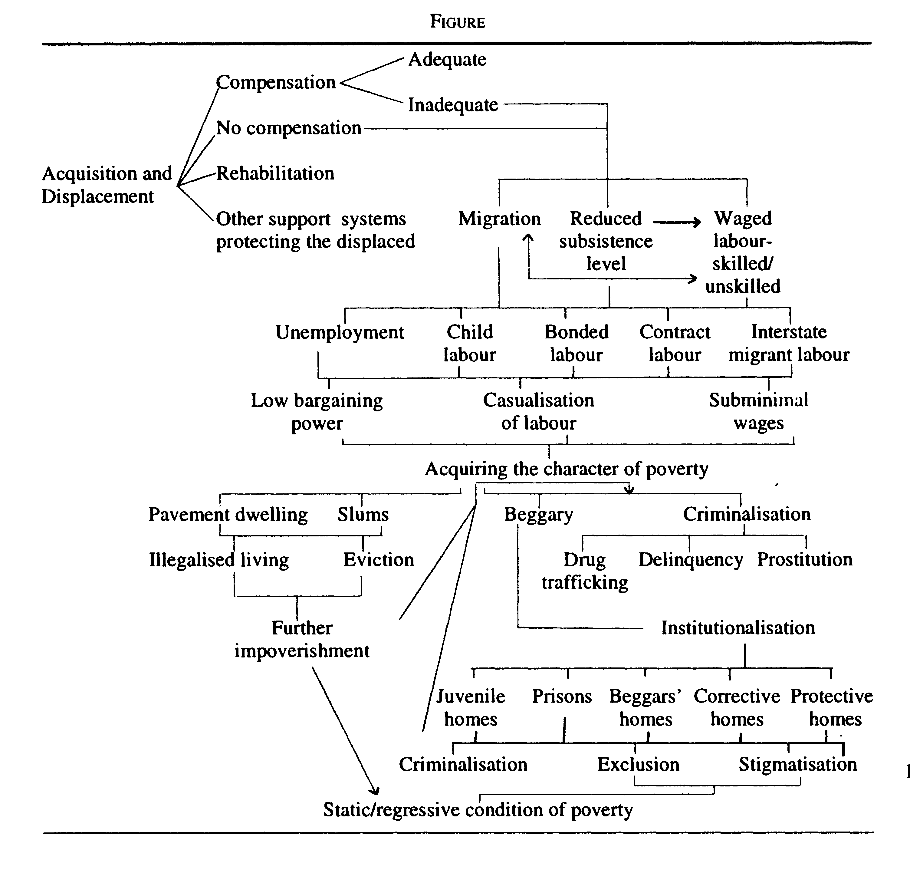

_The paradigm of development that has found favour with planners makes displacement of large numbers of people,
even whole communities, an unavoidable event. The utilitarian principle of maximum happiness for the maximum
numbers has been invoked to lend respectability to making the lives of communities into a cost in the public interest.
The law is ill-equipped to counter this attitude and in fact abets it by lending the force of state power._

\ 

This is an essay on displacement as
witnessed in the law. In it is a recognition
that displacement, and the related concerns
of rehabilitation and resettlement, are not
familiar to vast areas of the law which affect
the rights and lives of the displaced person.
'Public purpose' emerges as the justification;
the doctrine of eminent domain gives to the
state an enormity of control over land and
related resources, and so over the lives of
the people; acquisition provides the process;
and compensation is the limited replacement
of the rights of the displaced person. The
essay will attempt an understanding of these
concepts as they exist within the law.

Further, the law has been constructed on
the acknowledgement of the individual
dislocated person: experience has revealed
the inadequacy, and inequity, inherent in
this approach. For it does not accommodate
the implications it has for displaced
communities, and in circumstances of mass
displacement. The presumptions of what
constitutes it gives 'development' a priority
which is denied to the large-scale, and often
traumatic, displacement that it entails. The
calculation of cost-benefit externalises these
costs. A study of the law reveals that it
endorses, and reinforces, this position.

Statute law determines the process by
which the relationship between a community
and its resources may be affected, even as
it redefines rights. It also is the context from
which the substantive right of the affected
person --- often in the form of money
compensation --- is derived. The power of the
statute, however, goes further: it has a
profound influence on judicial understanding
of the problem of displacement. The statute,
it will be seen, insidiously but definitely,
determines judicial interpretation of
constitutional mandates. It is to this that the
lack of empathy may partially be attributed,
when a court finds that 'preferential'
treatment of displaced families would be
against the equality promised in the
Constitution --- even while accepting the
poverty of the displaced.[^/1] Expediency,
proferred as an argument by the state, has
struck a responsive chord in the court. Judicial
hands-off on matters of policy has given
power to the state beyond legitimated
challenge. The relevant concerns, in the
context of displacement would then be,
justiciability, the nature of legal imagination,
the finality which is an integral part of the
character of justicing, and the development
of a relationship between law and justice.

There is an inevitability about the
regression into poverty that is seen in the
law --- not only the law directly effecting
displacement, but also laws of labour, of
crime and of illegal living.[^/2] A representation
of this impoverishment demonstrates the
dramatic effects that displacement has on the
lives of those uprooted, and calls into question
the morality, constitutionality, and justice
that seems to evade the law.

The paradigm of development that has
found favour with planners makes
displacement of large numbers of people,
even whole communities, an unavoidable
event. The utilitarian principle of maximum
happiness for the maximum number has
been invoked to lend respectability to making
the lives of communities into a cost, in the
public interest. The law is ill-equipped to
counter this attitude and in fact abets it by
lending the force of state power. This is the
focus of this essay.

# The Statutes

The legislation at the centre of the debate
is the Land Acquisition Act 1894. It is of
some significance that the act is of colonial
vintage. What is also of the same vintage
is the _rule of law_. This is an overarching
principle that was held out as the antithesis
of arbitrary state action. The statute was one
of the more definitive expressions of the _rule
of law_. The prescription contained in a
statute --- whether of procedure, of substantive
rights or of sanctions --- acquired a legitimacy
which was not easy to dislodge, something
which continues to this day. And such a
statute is the Land Acquisition Act 1894
\[LAA\].

The LAA is a statutory statement of the
state's power of eminent domain, which
vests the state with ultimate control over land
within its territory. It denies to the person
from whom the land is acquired the right
to exercise choice as to whether to part with
the land or not so long as the acquisition
is avowedly for a public purpose. The
definition of public purpose in the act is
inclusive, not exhaustive; and the 1984
amendment which was an attempt to update
the law only increased the inclusive
categories. The state is, however, only to
acquire the land: the act therefore provides
for payment of compensation. And, again,
in the interests of justice and fair play, the
Act lays down a procedure by which the land
is to be acquired: an endorsement of the
principle of processual justice.

The act is essentially concerned with the
acquisition of rights over land from
individuals who have legally recognised,
and compensable, rights. These conservative
notions of individual ownership and state
acquisition have been stretched unrealistically
to envelop the displacement of whole
communities. (The inclusion of companies
as performers for carrying out the public
purpose is a definitive statement of alignment
and priority.) Compensation, as a measure
to take the edge off dislocation following
compulsory acquisition, retains its market
value connotation, the statutory responsibility
of the state ceasing upon such payment.
The inadequacy of this law to deal with the
problems thrown up by large-scale
displacement has not affected the thoughtless
regularity with which the law is invoked. For
a law that does not acknowledge
displacement and its traumatic overtones,
does not mention resettlement, and is
unwilling to take the responsibility of
rehabilitation, what can be seen in its rooted
presence in this field of human suffering is
expediency, callousness or arrogance. This
view is only reinforced by a reading of the 1984 Amendment which recognised a public
purpose in providing for 'persons displaced
or affected' by projects: which yet continued
to ignore the existence of displaced
communities. And even while it recognised
no rights in the displaced persons to
rehabilitation through state intervention, it
unabashedly used the displacement caused
as further justification for state power in
compulsory acquisition.

The LAA is not isolated in its relevance
to displacement. There is the Forest Act of 1927 which anticipated the displacement of
people from forests in which the state declared
an interest. Quite unlike the LAA which was
premised on private ownership of property,
the Forest Act was aware that long,
established user and an intricate mesh of
dependency characterised the rights it would
dislodge. Yet, the continuance of the rights
of the people depended on individual
determinations made by a state functionary.
And the rights, where recognised, could be
involuntarily replaced by compensation. It
is an ill-kept legal secret that the original
intent of the Forest Act was to serve the
commercial interests of the state. The law
has hardly changed. Yet --- even as the
language of the law, the process, the power
structures and the remedies remain
unchanged --- it is sought to be given a newfound
morality: the state is projected as the
protector of the tree. As for the displaced
people, they are placed in an adversarial
position with the conservation and environment
ethic. While development is the larger
good which is invoked to justify displacement
for projects, the Forest Act rests its case on
conservation and the environment.

The security of the state demands that
open spaces be available to the army for its
field firing and artillery practice. Here is
cause again for displacement. It is in the
'interests of safety' of the persons likely to
be harmed, and to 'regularise' the procedure
by 'putting it on a legal basis', that the
Manoeuvres, Field Firing and Artillery
Practice Act 1938 was avowedly enacted.
Field firing and artillery practice needing to
ensure more total 'exclusion or removal
from any place declared to be a danger zone
of persons or domestic animals', this act
provides for the 'removal' and 'exclusion'
of persons from the danger zone. There is,
under the LAA, a permanence in the
severance of the relationship between a
person and his property which may be seen
as absent in its essence from this legislation.
The displacement is, in reality, a mere
dislocation for the period that the army needs
it; it may be re-habited thereafter. If, in the
process, any harm is sustained by person or
property, there is statutory provision for the
payment of compensation. In common with
other legislations which facilitate
displacement, this act concentrates power in
the state, with but a passing thought to what
effect it might have in the lives of the
displaced people. It is this reluctance to
acknowledge the extent of the responsibility
involved that makes the law suspect.

Hidden in the folds of statutes which appear
to have little relation with displacement can
be found extensive powers enabling state
authorities to take over control of land and
related resources. For the purposes of
constructing or maintaining a railway, a
railway administration may construct 'in or
upon, across, under or over any lands, or any
streets, bills, valleys, roads, railway,
tramways ...' "as it thinks proper". This
discretion to decide and to act is tucked away
in the Railways Act of 1989. The extent of
the powers is vivid in the clause which
would have it 'do all ... acts necessary for
making, maintaining, altering or repairing
and using the railway'. Interestingly, the one
limitation on this power omnibus is when
it is government property that is involved:
the administration can then act only with the
consent of the concerned government. With
this one exception, these transactions are
treated as acquisitions for a public purpose
within the LAA. Displacement, while
inevitable, is neither in the statement of the
law, nor is it its apparent concern.

The expedient of compulsory acquisition
is again in evidence in a legislative exercise
of even more recent origin. Even as the
immensity and immediacy of the problems
of displacement was acknowledged --- and
the attempt at articulating a policy was engaging
the attention of at least six departments
of the government, among others --- the
Airports Authority of India Act was passed
in 1994. The habits of law-making introduce
a reiterative quality to the law; and laws all
too often are reproduced in their own image.
This perhaps is at least a partial explanation
for the power of compulsory acquisition of
land that has been prescribed for the statutory
authority. The land required 'for the discharge
of its functions under this act' is 'deemed'
to be for a public purpose; and the LAA is
invoked to effect the acquisition. Again, the
presumption that public purpose is a priority
of an irrebuttable superior order, and that
the statement by the state that a purpose is
a public purpose is conclusive.

These are but instances of a statutory order
which is so constructed as to legitimate, and
facilitate, the displacement of persons, as of
communities. In its ordering of priorities, it
has not reckoned with displacement. Instead,
it has attributed a cost to the acquisition
process, and displacement is an unstated
incident in this process. Law depends, for
its legitimacy, on popular acceptance. The
patent injustices that have resulted from
employing the extant statutory regime to
situations for which it could never have been
intended --- and mass displacement is an
outstanding example --- and the popular
condemnation that has followed, have
cornered the law into rethinking its
propositions. To get the law to revise its
priorities, to relocate expediency, to redefine
development, to reassess the meaning of
costs requires a liberal dose of legal
imagination, political will and the induction
of empirical knowledge.

# Public Purpose

The morality of the law which effects
displacement is posited on the 'larger public
good'. It is couched in the language of
'public purpose'. It reasons that the state will
have to act to protect, and advance, generally,
the interests of the people. There is an
impracticability about detailing every
circumstance which may need state action
under these laws; the field is then left
deliberately open, with the power essentially
resting with the state to determine what
constitutes public purpose.

Experience with public purpose has
demonstrated its utilitarian potential.
Utilitarianism is a pragmatic philosophy,
advocating the seeking of the greatest
happiness of the greatest number. It does not
actually advocate the marginalisation of
those who get excluded from the benefits
of the system, yet it is implicit in its very
statement. Public purpose works to similar
effect. What is public purpose for a category
of persons may represent the trauma of
displacement for another. The exercise of
state power is governed by the identification
of the public purpose, without the constraint
of addressing the adverse impact it may have
on the affected population. Differently from
utilitarianism, pursuing state understanding
of public purpose may cause relatively more
distress in real terms than the benefits it
generates. The large scale of displacement
accompanying the progress of the projects
across the Narmada --- from those who made
way for the ritual of the inauguration in the
1960s, those displaced for the township, the
dam affected, those to be dislodged as the
canal progresses, including in their number
those recognised by the state as being related
to the project and those ignored --- illustrates
this possibility.

There are incompatibles that continue
unresolved in the law of public purpose. The
use of the law to further one public purpose
may result in creating conditions which may
deserve a further invoking of the acquisition
law. In 1984, the grinding wheels of the law
grudgingly transported displacement into
legal recognition. The LAA was amended
to bring displacement into the inclusive
definition of public purpose. The express
provision of the law, while it limited its
concern to making land available for
residential purposes, did admit to the reality
of displacement. In the company of the "poor
or landless or ... persons residing in areas
affected by natural calamities" the law places
"persons displaced or affected by reason of
the implementation of any scheme
undertaken by government, any local
authority or a corporation owned or
controlled by the state". The language of
vulnerability is unmissable. The expedient
of limiting public purpose to restoring some
manner of shelter is a commentary on the
state's admission of inability to commit itself
to greater responsibility. Yet the nature of
the problem of displacement, and the
difficulty in resolving it equitably, have not
caused the law to re-work the meaning of
public purpose, or to device a procedure
which will require the state to consider the
totality of the public good involved. If there
is a reluctance in the law to interpret state
power so as to account for its responsibility
where displacement may occur, the reason
is obvious: for it would amount to a whittling
down of state power. Also, it would impel
a redefinition of priorities, as it would call
for a reorientation of the presumptions that
have influenced the course of the law.

# Eminent Domain

The doctrine of eminent domain asserts
the right of the state over land and related
resources within its territory. It is perceived
as a necessary right, to be invoked to further
public good. In consequence, the right of
any person or community to refuse to permit
the intervention of the state, or to dissent
from the state's perceptions of public good
is considerably eroded. The process of
assumption of control is prescribed by statute.
The only concession to this power which
causes 'great legal injury' is the entitlement
to compensation.

The situations which may prompt the state
to acquire private rights may result in
permanent, temporary or partial acquisition.
TheLAA, for instance, envisions acquisition
of land which sunders the relationship
between the private holder and the land. Any
change in the status of the land which may
occur after the completion of the transaction
of acquisition will have no effect on the
rights of the person who has lost his land
to the acquisition. Illustratively, the over-acquisition
of land, in excess of that needed
for the purpose for which the power is
exercised, would not restore to the displaced
person any right to the land.

Field firing and artillery practice is
facilitated by a law which provides for the
exclusion of persons, for a period, from land
on which they may live and work. The nature
of the activity which provokes temporary
displacement may make outright acquisition
inexpedient. The compensation is then
computed on an understanding of the
demonstrable loss, harm and injury sustained.
It is not without significance that this
temporary displacement inevitably occurs
in areas which are removed from what may
be called, the mainstream.

Where the purpose for exercise of the
eminent domain power could be served as
well by acquiring only partially the rights
over land, the state may decide to restrict
the nature of its acquisition. The Petroleum
and Minerals Pipelines (Acquisition of Right
of User in Land) act 1962 is a case in point.
It is interesting that this act was conceived
because of the resistance that invariably
attended acquisition under the LAA.
"Although land can be acquired outright for
laying down pipelines under the LAA 1894,
the procedure for such acquisition is long-drawn
and costly", read the statement of
objects and reasons that accompanied the
Bill. "Since the petroleum pipelines will be
laid underground, outright acquisition of
land is not necessary. Therefore, in the case
of these pipelines it is considered sufficient
to acquire the mere right of user in the
land ...". This partial acquisition vests the
right to use the land in the government; the
owner or occupier of the land is, however,
entitled to continued use of the land. The
damage, loss or injury that may result is
compensated under the law.

The wisdom of the law in not acquiring
more than the purpose needs, is founded on
expediency. It is not the limited extent of
the need, but the experience of costs and
delays involved in the process that has
influenced the lawmaker. It becomes apparent
that where the costs of acquisition are
effectively contained with the law's help,
and the obstacles to the process are not
sufficient to deter the state, the incentive to
minimise the take-over of rights is lacking.

In limiting the extent of dislocation, partial
acquisition represents a lesser loss than
outright acquisition. Yet, it may not be an
unmixed blessing. It is an attribute of eminent
domain that the consent of the dislocated
person is irrelevant to the process. It is also
in the nature of this power, as it has evolved,
that the state cannot be required to acquire,
and compensate, the totality of the rights:
the invasion of rights is the prerogative of
the state.

The doctrine of eminent domain ensures
to the state access to all land and related
resources. Public purpose, the moral high
ground of acquisition, has a wide, sometimes
contradictory, reach; from the construction
of dams to the resettlement of displaced
people; from the conservation of wildlife
and forests to the promotion of tourism;
from industrial growth to slum clearance,
There is little answerability in the law of
acquisition, based as it is on the possibilities
engendered by eminent domain and public
purpose. The environmental priority of a
sanctuary may give way before a revised
economic priority of tourism: the excluded
people however are entitled neither to reenter
their land, nor to question the changed
priority. A revised rendering of the law would
have to remedy this attitude to displacement.
The perception of displacement as a tragic
choice,[^/3] would have to replace the established
status of displacement as a necessary ritual
for the furthering of 'public interest'.

## Acquisition

Acquisition effects the transfer of rights
from a person to the state. The law is
concerned with the individuals whose rights
are to be acquired. Breakdown of
communities and mass displacement are not
within this recognition.

The acquisition process provides a degree
of participation to the individual. Procedural
opportunities --- to protest the acquisition, or
the extent of the acquisition, to establish a
claim to interest in the rights under
acquisition, to contest the quantum of
compensation --- are provided in the law. The
non-recognition of the displacement of large
numbers, and of rights of collectives, or of
individuals as part of a collective, permits
the state to neglect all but the defined rights
of individuals as individuals.

Statute law, in defining rights and prescribing
powers, reduces the recognition of
a problem to manageable proportions. It
would then ignore all that falls outside this
recognition. What is not within the law's
ken cannot be addressed by the law. The
process prescribed for the identification of
holders of rights, and of the rights themselves,
externalises mass displacement. State
laws[^/4] which have acknowledged mass
displacement and speak of rehabilitation,
are reluctant to make acquisition dependent
on the restoration of just standards which
will avoid using the displaced population as
scapegoats.

Statute law has a binding effect which has
to be enlisted to minimise displacement, to
reduce the trauma of displacement where it
occurs and to introduce justice and fairness
into this transaction. The content of the law
would require drawing upon empirical
knowledge, providing an understanding of
poverty, acknowledging the impoverishment
through law that mass displacement has
caused, and recognising the inequity of
powerlessness.

# Compensation

If the law of acquisition were to possess
a conscience, it may be found in its provision
of compensation. Perceiving the effect of
eminent domain as "exacting greater sacrifices
for the purposes of the state from one
rather than from the other",[^/5] compensation
is seen as the means for reducing the injustice
inherent in acquisition. Every law that dispossesses
carries a provision for compensation
which is intended to soften the blow.

Yet, the limited understanding of
compensation has eroded its moral base. The
notion of total compensation being unknown
to the law, it is ill-equipped to internalise
the immiseration which acquisition may
entail. The process of impoverishment is
inevitably set in motion, except in cases
where the displaced persons are able to use
the system to their advantage --- an unlikely
event where poverty or powerlessness
characterises the population.

The meaning given to compensation has
been dominated by its equation with the
market value, or the notional value in the
market. This treats the displaced person as
a willing seller. It does not account for the
part that coercion plays in the law.
Compulsion is tempered by a solatium,
which, being a percentage (now fixed at
thirty percent) of the compensation amount,
is also dependent on the market value. The
option of compensating land for land merits
a mere mention in the law, it is not, in any
event, a binding obligation of the state.

With its defective vision distorting
displacement, there are significant absences
in the law for computing compensation. For
one, it does not take responsibility for
providing for the replacement value of the
land, or rights, lost. For another, mass
displacement often affects populations whose
lives are not constructed around formal legal
rights, making market value an irrelevant
criterion. The difficulties in attributing a
value to the costs of displacement have not
been addressed by the law: they have merely
been externalised. The costs of displacement
have been artificially, and unjustly,
suppressed. The focus of the acquisition
process being the individual, compensation
is not sensitive to the displacement of
communities, or of large numbers of people.
The trauma involved in displacement, the
fragmentation of communities, the
breakdown of support structures, the
indigence of displaced populations, the
increased susceptibility to exploitation where
protected populations are dislocated ... none
of this inhabits the law of compensation. It
is of significance that, having spoken to the
possible poverty of displaced populations,[^/6]
and to the public purpose involved in
providing for them, it is _not a right to
compensation but a discretion to care_ that
has been prescribed.

With the exception of the occasional state
legislation, the law which enables displacement
neither recognises displacement as
creating altered rights, nor does it use the
language of resettlement, relocation or
rehabilitation. Multiple displacement --- and
none can deny that it extracts an unconscionable
cost --- has not excited the compassion
of the law, nor engendered a sense of
community. Neither the decision to acquire,
nor the computing of compensation, takes
responsibility for this disproportionate
burden on the displaced.

The presumptions of public purpose, the
implications of eminent domain, the power
of acquisition, and the containing of costs
in computing compensation have conspired
to relegate displacement to the position of
a non-concern. Particularly where they
reorder hierarchies of legal concern, changes
in the law are a response to pressures that
cannot be ignored. This is reflected in the
gradual, even if reluctant, introduction of the
recognition of displacement into the law.
Yet, the law being essentially conservative,
it will take unrelenting determination to
build the gravity of displacement into the law.

## Law and Policy

The law's attention has not been engaged
by the possibility, and effect, of large-scale
displacement. Its concern has been to provide
a process for the exercise of the eminent
domain power. Unintentionally perhaps, yet
inexorably, the law has been activated to
effect mass displacement in the cause of
development, what is compendiously termed
the national interest, economic imperatives
of the state and planned growth. With the
restricted meaning imported into
compensation, displacement has not been a
legally recognised cost. The escalating crisis
of displacement has been aggravated by the
displacement of whole communities and
hosts of villages as an invariable part of
implementation of projects.

The emerging dimensions of the problem,
the awareness that priorities identified by
the state threaten further and increasing
displacement, the unimaginative and
inadequate remedies provided by the law,
and the impossibility of displaced
populations resurrecting their lives, have
together impelled the state to publicly
reconsider its options. It is witnessed in
token changes to the LAA, as in the
introduction of the displacement dialect in
defining public purpose, in the enactment
of rehabilitation legislations by some states,
and in the mushrooming of policies of
rehabilitation. However, displacement is
itself not questioned.

Policies of displacement and rehabilitation,
speak to concerns beyond income replacement.
Recognising the characteristics of the
displaced population, which explains the
consideration shown to them by the policy,
they prescribe norms of replacement. This
is intended to temper the patent injustice of
asking populations who have little, to pay
for the public good. A policy may go
something like this:[^/7]

>The projects involved, it may say, are located
in remote areas. Requiring large stretches
of land, it may go on, it may displace people.
Where it does, it may promise to resettle and
rehabilitate the displaced in consonance with
the norm that they improve or at least regain
their previous standard of living. Recognising
the discontent and alienation that may result
from improper resettlement and rehabilitation,
and acknowledging the involuntary
nature of the transaction, it may commiserate
with the forced eviction, the loss of a
traditional social system, and the fundamental
changes where an agricultural economy is
replaced by changes in land use that the
project brings. It may place a priority on
regaining the economic base, expeditiously,
A listing of entitlements of the displacement
population may follow, including land for
land, house sites, employment and self-employment
opportunities. Rehabilitation
measures may include compensation for
losses in terms of land, cash and other forms,
and assistance to start a new life in terms
of opportunities, training, credit and
community services for schooling and health.
With its commitment to discharge social
responsibility, it may assert its intention to
making a conscious effort to rehabilitate
persons displaced by earlier projects.

Yet, with this testament attesting to its
humanity, when the displacing entity is
challenged in a court for not conforming to
the pledge of the policy, it may counter with
a simple expedient --- that the policy 'has no
statutory force' --- it cannot therefore be made
the ground for action! Or that the policy
being under revision, it cannot be entertained
as a basis for determining rights.[^/8] The
distinction between law and policy therefore
acquires considerable significance.

Statute law is enacted by parliament; policy
is the creation of the executive.

Statute law, where it defines (or denies)
rights, is binding. Policy, on the other hand,
has at best a persuasive value. Courts are
bound by the statement in the law, but are
free to be guided by policy, or to ignore it.

The life of a statute begins on the date
prescribed by Parliament, and stretches till
it is either repealed, is modified by a later
statute, or is struck down by a court for being
in violation of the Constitution. Policy is not
so constrained; it may subside into non-use,
or become outdated, or be replaced by a later
policy, or even just be discarded.

Where there is a conflict between a statute
and a policy, the latter yields to the statute.
There may be a difference between the effect
of the law and the stated intent of policy.
Again, it is not unknown for law's
prescription to be restrictive, where policy
may be generous. To the extent that it is not
in contradiction, policy may assist in the
interpretation of a statute; it cannot however
replace the statute.

Decades of experience with the acquisition
laws has determined the contours of judicial
and executive understanding. Judicial
construction of statute law being
characterised by a desire for continuity and
certainty, the influence of policy on the
acquisition laws is not likely to affect them
in any fundamental way. Where displacement
is enabled by law, and rehabilitation is
sketched by policy, the inequality in the two
instruments gives the compulsion of
acquisition a status that rehabilitation does
not possess. The difference that the law
perceives between the rights of an owner or
occupier and others affected by the
displacement has been softened by policy.
Yet, it would need a change in the law to
lend it enforceability.

The neglect of displacement in the law of
acquisition, then,cannot be righted by policy
alone. The protection against over-acquisition,
the right to return to lands
acquired but not used as proposed, the
safeguards which may work to minimise
displacement --- these are instances of the
need for changes in the law. Rehabilitation,
resettlement, relocation and compensation
have to be defined and made operative by
the law; while the right has to inhabit the
statute, policy may be employed to realise
the potential of the law. The advantage of
policy lies in its flexibility, and this could
be put to purpose in providing the experiential
backdrop for understanding the possibilities
of the law.

## Impoverishment

Mass displacement, without infusing
meaning into rehabilitation, is a prescription
for impoverishment. Baxi's concept of
'impoverishment'[^/9] distinguishes it from
'passive words' as poverty and the poor. It
is 'a dynamic process of public decision-making
in which it is considered just, right
and fair that some people may become or
stay impoverished'. It is a feature of the
process of impoverishment "that people are
not naturally poor but are made poor". It is
in this sense that the word impoverishment
has been used.

The compulsory exaction of land, and the
limited commitments of compensation which
do not account for the problems that
displacement brings to the displaced
population, lead to the regressive road to
poverty. The law, in its myriad manifestations,
shows an awareness of the possible
destinies of the affected populations. The
fact which is relevant here is that the displaced
population, which is inadequately protected
from the vicissitudes of displacement, is
easy prey to the forces of impoverishment.

Impoverishment through the law attributes
to law the role of a causative agent, impelling
those whom it affects on to the downward
slide to poverty. The laws of acquisition
house one example. Impoverishment in the
law is the recognition of the events of poverty
as disparate and static conditions, inviting,
variously, rebuke or paternalistic concern,
both commonly denying autonomy and
denuding rights. The laws of beggary which
punish, and the law to protect interstate
migrant workmen are instances.

The process of impoverishment may be
depicted to determine the extent to which
the law is responsible for, or assists, this
process. It is not intended as a demonstration
of the path trodden by every victim of
displacement; indeed it is an indication of
the common dangers that confront those
who enter the vortex of impoverishment. It
represents the law's latent statement of the
injustice of displacement.

This representation[^/10] is illustrative of the
relationship between law, impoverishment
and poverty. This ability of the law to effect
impoverishment, and the experience with
mass displacement, would justify a
reworking of priorities and presumptions
that are inherent in law.

## Judiciary on Displacement

Acquisition and displacement, with their
constitutional implications, have, inevitably,
reached the courts. The petitioners have
invariably been those affected by projects
 --- dams, reservoirs, firing ranges, industry and
power generation causing people to lose
their assets and their capacity for subsistence,
leaving them to an uncertain future, with
mere promises of executive largesse to sustain
them. Where the administrative process
exaggerates the inequality between the
displaced and those exercising the authority
to displace, the judicial process is trained to
the possibility of neutralising such inequality
in having the rights of the displaced
considered. The provision in the law for
representative petitions, which enables the
grouping together of rights of persons
similarly situated, and Public Interest
Litigation (or Social Action Litigation as it
is more appropriately termed)[^/11] are relatively
user-friendly --- they provide relatively easy
access to courts, and acknowledge the
existence of a community of interest.

The reliefs that the courts have been
petitioned to provide range from the
scrapping of projects as they are based on
a misconception of what is in the public
good; to halting project work till the displaced
are rehabilitated in a manner that does not
treat them as a cost of the project; to holding
the project authorities to the promises made
in their endeavour to find acceptability during
the planning process; to assert a right to
spaces for participation in the process; to
considerations of equity, and for infusing
into the process of displacement a recognition
that there are fundamental rights which are
non-negotiable, even where eminent domain
and public purpose may be invoked; or for
enhancement within the law of compensation
which will make the compulsory exchange
less inconsonant with justice.

The reasoning of the court is influenced
by the statute. The displaced, whose rights
have been represented but marginally in the
law, have had to resort to the assurances of
policy; and policy has no more than
persuasive effect. Also, courts are reluctant
to adjudicate on the exigencies of policy
implementation. Acquisition, on the other
hand, is a well entrenched state power,
reiteratively reinforced by the judiciary.

In considering the petition of a people
displaced by the Rourkela Steel Plant, their
claim for jobs of the adult population, and
for a preferential right to employment was
rejected by the Supreme Court.[^/12] Apart from
not being able to discover the infringement
of a fundamental right, the court found the
process of acquisition validated by
conformity to the process prescribed in the
LAA.

>'Their land', the court said, 'was taken under
the LAA. They were paid compensation for
it. Therefore, the challenge raised on violation
of Article 21 is devoid of any merit.'

The constitutional mandate that a deprivation
of life (and livelihood and dignity) will have
to be only by procedure established by law
was believed to be fulfilled by applying the
LAA.

It is possible that the court found the
claims for total absorption in, and preferential
right to employment, through the generations
of the displaced, impossible of performance
and therefore unreasonable, apart from
striking it as excessive. Yet, the indignation
of the court testifies to definite judicial
attitudes:

>The government has paid 'market value for
the land acquired', it said. 'Even if the
government or the steel plant would not
have offered any employment to any person
it would not have resulted in violation of
any fundamental right.

The irate court went so far as to say that
"Acceptance of such a demand would be
against Article 14", implying that displacement
does not constitute a rational basis
for positive discrimination! The distance
between the perception of injustice of the
displaced population, and the statutorily
circumscribed understanding of the court
are testimony to the importance of initiating
amendments to the law, The existence of
policy is no substitute.

There are instances of an empathetic court
relying upon policy to assist it in finding
answers to the problem of displacement. The
NTPC policy for rehabilitation, for instance,
was the basis of directions which went out
from the court on how displacement was to
be effected, and the displaced treated.[^/13] There
is however no right to the promises of policy.

There is a pragmatism that the court then
permits. Policy may account only partially
for the displaced, or for only some of them
 --- so long as the requirements of the acquisition
process have been complied with. Since it
is only the rights in the law that are perceived
to be enforceable, and policy deals not with
the individual but with the totality, the
standard of compliance of policy is more
relaxed than it is for the rights derived from
law.[^/14]

Episodes from the courts carry their own
lesson:

The test firing range near Itarsi uprooted
tribals. Rehabilitation of the displaced tribals
having apparently failed, it was found that
they were, with regularity, risking their lives
while collecting the spent, and unexploded,
ammunition from the prohibited areas in the
acquired land. By the government's own
admission, 81 persons had lost their lives
between 1972 and 1993. An order of the
court in a public interest petition, designed
to prevent the recurrence of such deaths,
confined itself to the mechanics of barbed
wire fencing, which would 'assure efficacy
in containing trespass'. The unanswered
questions about displacement and
rehabilitation continued unaddressed.[^/15]

The anomaly of an interpretation of the
law of compensation which converts a
protection into a disability was witnessed in
the case of the tribals in Andhra Pradesh.
Resident in an agency area, they were
displaced to make way for the Jelluru and
Yerrakavla reservoirs. The transfer of land
in an agency area may only be from one
tribal to another --- a measure to ensure
protection. As is often the case, the rightness
of the displacement was not in challenge:
it was the enhancement of compensation that
was sought. But, the high court found that
the market value of the land, being the norm
in determining compensation, would be
affected by the incapacity of the tribal to
enter into open market transactions. A tribal
in an agency area may only part with his
land to another tribal. And the buying
capacity of the tribals being, generally,
limited, the compensation would have to be
computed accordingly![^/16] The Supreme Court
thought it fit to dismiss it merely with a
remark that this "is not a correct approach".
The difference between the market value
and the reinstatement value was disposed of
on the understanding of solatium as making
up the difference.[^/17]

Juristic activism, which evolves modes of
thought, and fashions rights and remedies to
bring law in consonance with justice, has
passed displacement by. Restrained attempts
at judicial activism, which has the court acting
to protect the interests of the displaced,
have occasionally dotted the judicial horizon.[^/18]
The law of acquisition, and the expediency
of policy, continue to determine judicial
understanding and treatment of displacement.

# In Conclusion

Displacement is not on the wane. In fact,
the planning process presumes that
displacement is inevitable. There is an attempt
to justify it as a cost of development, and to
project it as an opportunity to improve the
living conditions of the displaced. The creation
of internal refugees, the impoverishment of
the displaced, the incapacity of the state to
rehabilitate them and avoid making them the
sacrificial lambs of the development process --- these
are explained away as unfortunate
side effects of the process of economic
growth. The initial deprivation of the
displaced has been conveniently used to
suggest that development could only benefit
them.

The law has been instrumental in
entrenching this perspective. A reassessment
of the human costs of development projects
is the first requirement of improved legislation.
Legal reform is essential to curb state powers
in this field, and to give tangible rights to
the victims and potential forgets of mass
displacement.

[^/1]: See _Butu Prasad Kumbhar v SAIL_ 1995
Supp 2 SCC 225 at 229, para 6.

[^/2]: For example, the Interstate Migrant Workmen
(Regulation of Employment and Conditions
of Service) Act 1979, the anti-beggary acts
extant in some states, and the illegal status
accorded to, pavement dwelling which has
got immortalised in the judgment of the
Supreme Court in _Olga Tellis v Bombay
Municipal Corporation_ (1985) 3 SCC 545.

[^/3]: The phrase is borrowed from the title of a
book by Guido Calabresi and Phillip Bobbitt,
where the authors address the agony of the
choices that a society has to make in what
they term the 'allocation of tragically scarce
resources': _Tragic Choices_ (1978).

[^/4]: For example, see the Maharashtra Project
Affected Persons Rehabilitation Act 1986.

[^/5]: G C Mathur, V G Ramachandran's Law of
Land Acquisition and Compensation
(1995:8th edn).

[^/6]: The definition of 'public purpose' in the
LAA as amended in 1984; Section 3(f)(v).

[^/7]: This description has drawn, in large measure,
on the Resettlement and Rehabilitation Policy
of the NTPC (May 1993).

[^/8]: Counter affidavit of NTPC filed in the
Allahabad High Courtin the matter of _Gramin
Kalyan Sangharsh Samiti v District
Magistrate_, Sonebhadra (CMWP No 4358 of 1995)
dated August 17, 1995, paras 9 and 11.

[^/9]: Upendra Baxi, 'Introduction' in Baxi (ed),
_Law and Poverty_ vi (1988).

[^/10]: This representation draws upon the LAA
1984, the Interstate Migrant Workmen
(Regulation of Conditions of Employment)
Act 1979, the Minimum Wages Act 1948,
the Contract Labour (Abolition and
Regulation) Act 1970, the Bonded Labour
System (Abolition) Act 1976, the Child
Labour (Prohibition and Regulation) Act
1986, the Juvenile Justice Act 1986, the IPC
1860, the Immoral Traffic Prevention Act
1956, state anti-beggary laws, the NDPS Act 1985 and municipal laws.

[^/11]: Upendra Baxi, 'Taking Suffering Seriously:
Social Action Litigation in the Supreme Court
of India' in _ibid_, 386--415.

[^/12]: _Buta Prasad Kumbhar v SAIL_, 1995, _op. cit._

[^/13]: _Banwasi Seva Ashram v State of UP_ (1992)1
SCALE 407.

[^/14]: _supra._ note 1 at 230: '... in the meantime
another dam has been constructed and the
persons who have been displaced have also
been required to be accommodated and,
therefore, a scheme has been framed in which 80% displaced in consequence of
Mandira Dam and 20 per cent out of 247
are being given employment since 1993. He
stated that nearly 50 persons out of 247 have
already been absorbed. We are of the opinion
that giving employment to 20 per cent may
take longer time and since the age bar has
been put at 35 it would be appropriate if the
SAIL expedited the absorption of these
persons by increasing their number from 20
per cent to 40 per cent each year.'

[^/15]: _Sudip Mazumdar v State of MP_ 1994 Supp 2 SCC 327.

[^/16]: _Special Tahsildar v Kabbidi Posayya_ CA
Nos 1341, etc, of 1992 decided on March
2, 1994 (AP High Court).

[^/17]: _K Posayya v Special Tahsildar_ (1995) 2
SCALE 683.

[^/18]: Baxi 1988 _op. cit._
