# Abbreviations & Explanations

MLA

: **M**ember of **L**egislative \[State\] **A**ssembly responsible for passing laws governing the state.

MP

: **M**ember of \[National\] **P**arliament responsible for passing laws governing India.

CPI

: **C**ommunist **P**arty of **I**ndia. This is considered the rightist communist party as it collaborated with Indira Gandhi who stood for the interests of the landed & business classes.

KSTUC

: **K**erala **S**tate **T**rade **U**nion **C**ongress. Trade union associated with Communist Party of India (CPI).

AITUC

: **A**ll **I**ndia **T**rade **U**nion **C**ongress. Trade union federation associated with Communist Party of India (CPI).

CPI(M)/CPIM/CPM

: **C**ommunist **P**arty of **I**ndia (**M**arxist). This is considered left Communist Party of India as it broke away from original Communist Party of India (CPI) when CPI has collaborated with Indira Gandhi who deployed _socialist_ rhetoric while still representing the interests of Capitalists & Landlord classes. This is why CPI is considered as _rigthist_ by CPI(M) as they collaborated with economic rigthwing (Indira Gandhi) at the insistence of Soviet Union that wanted Indira Gandhi to win elections.

Congress(R)

: Indian National **Congress** (**R**equisitionists/**R**uling). In 1969 Congress was split into two factions. Congress(R) or _**R**equisitionists/**R**uling faction_ of Indira Gandhi (daughter of Nehru). Other group is Indian National Congress (Organisation) or Congress(O) or _Syndicate faction_ which merged with Janata Party which is the predecessor of **B**haratiya **J**anata **P**arty (BJP). When Indira Gandhi lost 2nd term election on Congress(R) party ticket, she started her own party again called Congress(I) aka Congress **I**ndira/**I**ndicate. Post her election victory on Congress(I) ticket, Election Commission of India (under the influence of Indira) declared Congress(I)  to be real **I**ndian **N**ational **C**ongress (INC).

CSP

: **C**ongress **S**ocialist **P**arty. A branch of socialist Congress party during independence struggle that claimed to represent socialism as opposed to its main wing which was composed off Capitalists & Landlords.

AICC

: **A**ll **I**ndia **C**ongress **C**ommittee. Executive body of Indian National Congress (INC) at National level.

PCC

: **P**radesh **C**ongress **C**ommittee. Executive body of Indian National Congress (INC) at each State level.

KPCC

: **K**erala **P**radesh **C**ongress **C**ommittee. Executive body of Indian National Congress (INC) at Kerala State level.

INTUC

: **I**ndian **N**ational **T**rade **U**nion **C**ongress. Its the trade union wing of the Indian National Congress.

SSP

: **S**amyukta **S**ocialist **P**arty.

RSP

: **R**evolutionary **S**ocialist **P**arty of Kerala (Bolshevik).

IST

: **I**ndian **S**ocialist **P**arty.

KTP

: **K**arshaka **T**hozhilali **P**arty.

IUML/League

: **I**ndian **U**nion **M**uslim **L**eague.

KSP

: **K**erala **S**ocialist **P**arty

DMK

: **D**ravida **M**unnetra **K**azhagam. Its a political party which has a major influence on the state of Tamil Nadu and the union territory of Puducherry.

NSS

: **N**air **S**ervice **S**ociety.

SNDP

: **S**ree **N**arayana **D**harma **P**aripalana Yogam.

UF

: **U**nited **F**ront.

CrPC

: **Cr**iminal **P**rocedure **C**ode. Law prescribing the set of procedures to be followed by legal system for a criminal complaint thru out its life time — all the way from complaint to disposal.

IPC

: **I**ndian **P**enal **C**ode. Law that describes list of crimes & their punishment.

_Section 144_ IPC

: Section of the Indian Penal Code used by police to restirct civil liberties under the guise of security to stop protests & declare assembly of citizens (for protest) to be illegal.

IAS

: **I**ndian **A**dministrative **S**ervice. A classification within Indian Bureaucracy (responsible for taxation, implementing govt schemes and law & order) who hold higher positions in Indian Administration both at National & State level. One has to clear an All-India exam to become a member of this group.

CID

: **C**riminal **I**nvestigation **D**epartment. Its the branch of State Police Services of India responsible for the investigation of crime.

RDO

: **R**evenue **D**epartment **O**fficial responsible for tax collection.

ADM

: **A**dditional **D**istrict **M**agistrate. District Magistrate is responsible for law & order activities within an administrative division (usually a district). Usually this person is IAS cadre officer.

IPS

: **I**ndian **P**olice **S**ervice. A classification within Indian Police (responsible for law & order) who hold higher positions in Policing across India. One has to clear an All-India exam to become a member of this group.

ASP

: **A**ssistant **S**uperintendent of **P**olice. Usually represents a mid-level officer of Police hierarchy in India.

DSP

: **D**eputy **S**uperintendent of **P**olice. Usually represents a mid-level officer of Police hierarchy in India. Belongs to IPS cadre.

IG

: **I**nspector **G**eneral. Also called Inspector General of Police (IGP). Belongs to IPS cadre. Usually represents a member of the top few levels of Police hierarchy in India.

MSP

: **M**alabar **S**pecial **P**olice. Branch of State Police in Kerala responsible for restoring "law & order". In reality, it has always been a tool of political & economic rulers to impose themselves on people thru violence aka tool of State to terrorise people. Now part of Kerala Police.

SAP

: **S**pecial **A**rmed **P**olice. An armed police force created in 1958 in Travancore-Cochin State. Now part of Kerala Police.

INA

: **I**ndian **N**ational **A**rmy was an armed force formed by a section of Indians who wanted to secure freedom from British by collaborating with Axis powers (Germany, Italy, Japan, …). Its fought alongside Japanese soldiers against British in South Asia. Was led by Subhas Chandra Bose.

RIN mutiny

: **R**oyal **I**ndian **N**avy munity/revolt. Post WW2—in 1946—Indian naval workers conducted a revolt against British Government during the struggle for Independence from British.

NATO

: The **N**orth **A**tlantic **T**reaty **O**rganization. A military alliance between US, UK & Europe.

UP

: Utter Pradesh. A State in India.

BA

: **B**achelor of **A**rts

MA

: **M**aster of **A**rts

LLB

: Bachelor of Laws (**L**egum **B**accalaureus; LL.B) is an undergraduate law degree.

_bourgeoisie_

: Elite. Usually refers to political, social & economic elite. Includes Capitalists, Landlords, Merchants, Industrialists, Media & Preisthood.

_petite bourgeoisie_

: _petite_ = Small, _bourgeoisie_ = Elite. Refers to social class of lower elites (usually middle class & bureucracy) who look upto _bourgeoisie_.

EMS

: **E**lamkulam **M**anakkal **S**ankaran Namboodiripad. Indian Communist politician who served as the first Chief Minister of Kerala in 1957–59 and then again in 1967–69.

AKG

: **A**yillyath **K**uttiari **G**opalan. Also known as A. K. Gopalan or AKG, was an Indian communist politician. Author of this book.

# Preface

This book records the reminiscences of my life, particularly
of the four decades of my political career. As such, it is crowded
with memories of the independence movement, struggles of the
working class movement, jails, police firings and party activities.
In writing these memoirs, I have not attempted to provide an
accurate historical record of past events; it is more of a personal
account. Hence there may be factual errors or other lapses as
my memory is not very clear about certain dates and circumstances.
I must also mention that being a full-time political activist, my
style of writing may leave much to be desired and I hope the reader
will remember my limitations. A part of this book—upto 1957—came
out years ago in Malayalam, and now I have revised and updated
the account. In doing so, I have not paid much attention
to my activities in Parliament, as they are less important than my
work outside.

I hope this book will be instructive to the readers, in its limited
way, about the experiences and the course of the left and democratic
movement in the country, and that they will be benefited by it.
I must thank Karat Prakash and Narikutty Mohanan for help in
preparing the book. I must also express my gratitude to Orient
Longman Ltd., for the interest they have taken in its publication.

&nbsp;&nbsp;

New Delhi,\hfill A. K. GOPALAN

\hfill December, 1956

# Chapter 1

I was born on 1st October 1904 in the village of Makheri in Mavilai
in the Chirakkal sub-district of North Malabar. The Nair joint
family of Ayillyath was originally a ruling family. The actual
Ayillyath family got divided into three families—Aroth, Kandoth
and Pallyath. A further division created the branch called Kuttiari
and that was how I became Ayillyath Kuttiari Gopalan Nambiar.

The _twin house_ Nair family was a ruling family even before
the East India Company appeared in our country. The company
honoured them with the titles of _All Honoured_ and _Half
Honoured_. This only meant that some properties were taxfree,
while others were only half so. In the family were a whole
range of officers from District Judge down to Elementary School
Teachers. The family members were so many that they could
not know each other. Some introduced themselves to me at
times with the words _Do you know me? I am your brother._

The head of the family was the seniormost member. He
lived in the central house or _Tharavad_. Other family members
could also live there. Those who did were served rice gruel
for breakfast and meals at noon and night. Those who did not
report in time might not get anything at all. Sometimes, the latecomers
got their _curry_ with plenty of water. In brief it was
something like a community hostel.

It was the family head who collected land rent. The share of
each member was fixed. Each one got 265 seers of paddy annually
and 25 rupees. If any one died, the share would increase slightly.
Those who lived in the family ate there. To the others the head
or _Karnava_ sent their share of the income. The family had
its own physician, launderer and barber. They were paid an annual
salary. Such was life in the matrilineal family. It was quite
common for the nephews to be jealous of the Karnavar and his
wife and children if they were better off than the others, and to feel
unfriendly towards them.

I lived with my father. I grew up from early childhood in
an atmosphere different from that of other homes. Father was
one of the social reformers of the time. It was he who gave me
the first opportunity to take part in public affairs and to associate
myself with the people.

At a place called Kadachira in North Malabar, father had
started an English Middle School. Sixty years ago it was not an
easy task to establish an English School in a village like that. And
there was not even enough encouragement for such a venture.
When my sisters also were sent to the school, the conservatives
became angry. It was simply unthinkable to them that girls dressed
in the modern style should go to school along with boys. Quite
differently from other boys, my brothers and I used to go to school
in shirt, trousers and wearing a cap. We were conspicuous in this.
Because of conservative opposition and the absence of encouragement,
the school soon functioned at the elementary level only. It
is a matter of pride that this school has created many public men
as well as well-known lawyers like K. T. Chandu Nambiar.

Father was Secretary of the North Malabar Nair Society from
its very inception. Its main concern was to eradicate caste subdivision
among Nairs and to do away with _thali-tying_ and
other social evils. It was because of the work of this Society that
_thali-tying_ disappeared completely. Father suffered a lot of
opposition in this work too. I took part, along with him, in the
conferences and meetings of the Society. Moreover, I entered the
stage and did some actual field work in the Nair Society campaign.
I noted father's humorous speeches which made a deep impression
on my mind.

Father edited a publication called Friend of Industry which
was originally entitled Light of Community. Friend of Industry
was at first a weekly. Because support was lacking, it was later
changed into a monthly. It had its own press. Kavimani K. C.
Kuttappa Nambiar, Neelancherry Sankaran Nair, K. T. Raman
Nambiar and others blossomed through the columns of this magazine.
It became my task whenever I was free to attend to printing
work, to go through the newspapers, re-write articles, compile
local news-notes, write subscribers' addresses and maintain registers.
Father's younger brother was a good singer and actor. The
young people of the place who had taste for stage-acting were
brought together ard a drama troupe was organised. Father too
was an actor in this troupe. The troupe used to tour Wayanad
and other places annually for performances. I was also attracted
to this work and I used to attend performances near my house.

It was father who first started diversified farming in our locality.
In addition to paddy, groundnut and sugarcane were cultivated
on a large scale. These experiments instilled in the people an
awareness of the need for agricultural reforms. This attracted my
attention. Father was one of the elected members of the first Board
of Chirakkal sub-district. Although the election was non-political
I was keen on taking part in the campaign in defeating his rival.
When the election was over, I could see how much the public loved
and trusted father. I also had an occasion to meet the voters.
Father used to take interest in the public needs of the sub-district,
like construction of bridges and drainage and the establishment of
Elementary Schools. To me all these were elementary lessons in
public work.

I was not too earnest as a student, but did work hard for one
or two weeks prior to the examinations. And there were plenty
of opportunities for copying during examinations! I had no
ambitions of becoming a lawyer, a judge or a doctor. The only
kind of job that attracted me was one in which I would be free
and available to work amidst the people.

I was the leader of the bad boys in the school. Our gang used
to arbitrate on quarrels among boys and settle their disputes with
teachers. The consideration being _Tea_ from both complainant
and accused. I was keen on preventing big boys from bullying
small ones and on fighting with them.

My mother has helped me most in my political life. Her great
affection towards me even produced a change in her late in life.
Even while I was in school, she used to shield me against being
thrashed by my father. I once squandered money given to me by
father for paying my examination fees. The fees could not be paid.
I ran home and told my mother. She scolded me at first, but then
gave the money after pawning her ornaments. She did not say
anything to my father.

There was a tour programme at the time of the Guruvayoor
temple entry campaign. It passed through the village where I was
staying. I wanted the members to be given meals at my home.
But this could not be done as my father and brother-in-law were
opposed to it. I went with the volunteers to see mother. She
received them all. Calling me she said with tears in her eyes, _It
not my fault that they could not be given food. I am innocent._
Although mother did not like my going to jail, she understood
that it was a part of my political life. She would say: _Six
months' jail is enough. I will be satisfied if he then comes to see
me and spends two days with me and then goes back to jail._

Mother used to read the newspaper daily for information
about me. She thus came to have some familiarity with political
matters. Her deepest political tenet, however, was her affection
for me.

Mother died at the age of 68. She belonged to a sect that
automatically practised untouchability and other social vices.
Gradually a great change came over her. She stopped objecting
to the neighbour's Thiyya daughter entering the house. I had
feared how she would welcome Suseela, my wife, when she actually
arrived at the house. But her behaviour was amazing even to me.
She wished very much to see my child, but died without realising
her wish.

Mother died during the 1954 election in Travancore-Cochin.
I was then campaigning at a place far away from Vaikom. At
2am someone came to tell me that a telephone message had
arrived with the news of her death. It was quite some time before
I could reach home after getting the information.

A significant incident occurred a day before her death. She
called my brother and said: Gopalan is busy with the elections.
Do not bother him. Don't inform him about my illness. Let him
do election work. I heard of this when I reached home after
her death. I felt proud of my mother's political consciousness.
But I was sad that I could not fulfil my duty to her. What difficulties
does a political figure not have to overcome! My mother
was the greatest solace in my political life. If only she were alive
today!

# Chapter 2

Even before the completion of my education, I had occasion to
stay in several places in the interior of Tellicherry. It was customary
in all those places for me to set up _literary societies_
consisting of students and young people, to bring prominent speakers
to address them and to hold annual meetings on a grand scale. I
was also able to start manuscript magazines among students.
Absorbed as I was in these activities, I yearned more and more to
stop going to school and to start public work. Against my father's
wishes, I stopped going to school. But under pressure from him
I was obliged to take to the teaching profession.

I still remember an incident in my student days. Yakub
Hassan, Gopala Menon, Madhavan Nair and other Congress
leaders visited Tellicherry after coming out of jail. The people
gave them a grand reception. Some of my classmates and I got
together and left the mission school with our _cadjan_-made umbrellas
even as classes were going on, drew the vehicles in which the leaders
were travelling and took part in the meeting at the beach. Some
including myself were taken to task by our teachers. This incident
played a part in giving my life a new bent.

I taught for about seven years. The work was pleasing
and exhilarating. Little innocent children, knowledge that I was
the guardian of them all, many holidays, opportunity for public
activities, a chance to earn the love and regard of the people, a
situation in which I could forget the heavy cares of life and play
and live with children—these exhilarated me. A teacher gets plenty
of opportunity to meet the people and to know what they want.
A good teacher could become the leader of the people of his village.

I worked for about two years as teacher at the Board School
at Paralasserry. The headmaster of this school was my elder
brother, A. K. Sankaran Nambiar. He spent his whole salary
in helping the community. I learned from him how a teacher who
loves his country can become the leader of the people. The middle
class people of Paralasserry, Makheri and other places were brought
together in a new organisation called _Yellow Shirt_. Its programme
was to repair roads, clean tanks and start farming in one's
own yard. My brother provided leadership to this organisation
and spent a lot of money on it. He wrote some plays like _Chinnu's
Luck_ that underscored social injustices and got them staged. I
can never forget that it was my brother who taught me the ABC
of public service. When the Congress agitation began, he was found
burdened with family care, despondent and unwilling to face up to
adverse circumstances. I pondered sadly over how it would end.
I was myself unable to change his attitude, so the efforts made to
this end proved of no avail. It was from him that I had imbibed an
aptitude and initiative for public work. For a long time now he
had been a wearer of _khadi_. He had taken part in the Home Rule
movement. It was exciting for me to see him arriving in school
with a worn out _khaddar_ shirt and a _cadjan_ umbrella. Some of us
young people were thrilled when in 1931 he refused to turn over
the keys of the school to the Tellicherry Division Officer for anti-Congress
propaganda. He was then sternly anti-British. But he
became anti-Communist and a reactionary out of an inability
to rise up to circumstances, to understand how the world was
changing and to align himself against vested interests. He was
able initially to turn young people like me, who resorted to
Gandhi-ism, into revolutionaries and patriots. Later on he was
to turn into reactionaries young people who were rushing forward
with the times and under the shade of favourable circumstances.

My interest in teaching work was increasing. From being a
teacher working for money, I became a teacher working as a friend
of the people. From day-break until 9 o'clock I would visit students
in their homes and talk to their guardians but would be at the school
in time for class. After a hurried lunch I would coach backward
pupils. Evenings I set apart for games with students and holidays
for public work. A sudden change in my mood once a month
and it meant a day of caning. I used to cane students mercilessly.
A look at my face on that day and the children would tell each
other, _Be ready. This is Gopalan Master's spanking day._ But
I was particularly careful to play with the children on just these
days. I would play against the team of the child who had been
most thrashed. The poor boy would sometimes strike the ball
against my leg and thus console himself. Except for these 'black'
days I was their friend and aide. I was very careful to make a
name as a good teacher. I worked for that day and night. I am
proud that it was fruitful. Witness the felicitations and gold chains
and rings that I got upon leaving each school.

A teacher's life is wholly a kind of public service. Just as a
reactionary teacher can turn his pupils into puppets of the present
ruinous educational system, a revolutionary teacher can instil
patriotism, a sense of freedom and the courage and stamina to fight
against oppression and social vices in the minds of boys who are to
become citizens of the future. A teacher can of course turn his
wards into bureaucrats by insisting on blind loyalty to superiors.
He can also make them soldiers of war in the battle to salvage the
country from the present educational, economic and political
morass. The greatest service that I rendered as a teacher was to
instil political consciousness in my students. I was particularly
loyal to the boys who wore _khaddar_ and the Gandhi cap. I was
generous in giving marks to those who sang the national song and
read newspapers. Taking the cue, lazy students skipped their
class lessons and wore _khaddar_ to please me and learned a set of
national songs by rote. Indeed, many students in later life were
to take to public activities.

But a teacher in those days had no sanction to do any of these
things. A heart benumbed by hunger, a soul impregnated with
despair and an abject helplessness that made one distrust even
one's capacity to make a living—this is what obtained in those days.
The people used to say that teaching was the last resort of the unemployed.
I was sometimes ashamed to admit that I was a teacher.
But the teachers of Kerala have rewritten their history. They have
shown themselves to the world as models of self-respect, nationalism,
courage and public service. They have shown that, although
starving and reduced to skeletons, they are ready to undergo
sacrifices in the struggle against slavery in whatever form it might
appear. I am only too proud today to declare that I was once a
teacher. Through his long struggles and agitations, the teacher
of today has acquired for himself self-respect, self-confidence and
vitality.

People are contemptuous of the half-starving teacher. They
tend to regard their dress, meekness, subservience and patience
even in the face of scorn, as signs of weakness. I felt that this
should change. To go to school in trousers and with shoes, to
change clothes twice daily, to go in for new fashions in dress—all
this appeared to be a joke to some of the teachers themselves. It
was customary for me to argue with those who were scornful of
teachers. When the need arose, I was even prepared to come to
blows to protect the honour of teachers.

Board authorities sent an order asking the people to construct
a building for a school at Paralasserry. I had a considerable role
to play in helping A. K. Sankaran Nambiar who made the greatest
sacrifices to build premises costing Rs. 5,000 to house it.
Staging dramas, holding games on Saturdays and Sundays at various
places, carrying timber and stone necessary for the school—I did
all these. This enthused students as well as the people at large.
A teacher inside the school and an ordinary citizen outside. Children
of big landlords did not like this. Their neatly pressed shirts often
got soiled. What I did, offended their self-respect. But the people
developed a genuine regard for me.

Besides this, I was keenly interested in games like football and
badminton. I have won medals as a good player myself. I
organised the Potheri Kunjambu Memorial Tournament while
working in a Chovva School near Cannanore. I was able to meet
the residents of the locality and to earn their trust. This was to
greatly help in my future public work.

I was not a sportsman in the conventional sense of the term.
I enjoyed not only playing with a rival team but fighting with its
members after the game was over. The basis of this was that the
opponent should be defeated in some way or other, so if we lost
we fought. Games in which there was no fighting appeared to me
to be colourless and devoid of excitement.

I was attracted by the Vaikom _Satyagraha_ of 1924. I wanted
to leave my work as teacher to become a _Satyagraha_ volunteer. I
sent a secret letter which was accepted by the committee. But
because of the objections of my relatives and friends I could not
go to join the _Satyagraha_.

I had much to do with a fraternal organisation under the leadership
of Puthampurayil Ambootty. I tried to widen its scope and
to have in it people of all creeds and communities. It was a time
of feuds between Nayars and Thiyyas. The organisation was
able to play an important part in creating communal harmony.
A litter for the use of the sick and petromaxes for emergencies—
all these they were able to arrange. Besides, it used to lend money
to members and to in mediate in disputes between members of the
public.

I worked for one year as teacher of the Madrassathil Mohammadiya
School at Calicut. It was at this time that I came into
contact with the Muslim community and Muslim families. The
majority of students of higher classes in those times were children
of capitalists and the rich. Guardians sent them to school only
because they wanted to be rid of the trouble of keeping them at
home. The boys were not coming to school to learn nor were they
sent for that purpose. Frustrated, I used to thrash them mercilessly
in the beginning. But this was stopped by the Manager.
He reminded me that it was no use trying to force students to learn.
I changed my policy. I started playing with the children, visiting
their homes for feasts and celebrations there and learning about
the customs in their community. I became their trusted friend.
Competitions were organised and plays staged. After winning
their regard and trust, I found my attempts to teach them correspondingly
more successful. _Nambiar Master_ became their
unforgettable teacher. I learnt from experience that it is not with
the cane, but with the heart, that students should be struck.

One of those I met at that time was Krishna Panikkar. He
was later to become my colleague in the Congress and Congress
Socialist Party. He was then a pupil-teacher. We both lived at
that time in Sankara Warrier's hotel, immortalised in the memory
of the people of Calicut. It was a hotel in which grain was bought
with money advanced by customers who came to eat a rice meal.
Our own plight and that of the hotel can be imagined from this
alone.

Before long, Krishna Panikkar began taking part in social
work and the national freedom movement. He traversed the long
coastal strip of Ponnani sub-district from one end to the other,
spreading the message of the Congress, while he himself starved.
He built up the Congress organisation and improvised reading
rooms. It was this ceaseless work that brought on ill-health and
caused his untimely death. Public workers of Kerala will never
forget him.

The Congress in 1920 adopted a programme that was capable
of mobilising the Indian masses. The Khilafat Movement of 1921
created a phenomenal stir throughout India. The Moplah rebellion
excited my imagination. Although bereft of intelligent political
leadership, well-conceived policy or programme, the brave deeds
of my Muslim brothers who fought against imperialist oppression
enthused me.

It was a time when youth associations campaigned for freedom
in all parts of the country. In the interior, I took part in
prohibition work, in the _Swadeshi_ campaign and in stocking
_Swadeshi_ goods. I also propagated the _charkha_ in villages.
All this while I was off duty. I encountered some difficulties with
school managers and authorities. A teacher who could not live
as a slave of the manager had to shoulder a lot of difficulties. I
did not like, and actually hated, to rise upon seeing the manager,
to show him undue respect and to cringe before him. I fell out
with the Inspector as I did not bribe him to pass me in the _practical_.
Every six months or so I used to fall out with the manager.

While in Board Schools I was also the object of enmity of
Board Presidents. Because of the dislike of the late Kerala Varma
Raja, who was President of the Board of the Chirakkal sub-district,
I was for long refused employment under the Board.

I felt that it would be very difficult in future to live as a teacher
and at the same time work in accordance with my ideals and wishes.
Evidence of this gradually manifested itself. There is a limit to
the freedom of activity of a teacher. I felt that I was going beyond
those limits.

The last stage of my life as a teacher was at once extremely
difficult and very interesting. While doing public work, I also
started a day and night school. The Kadachira Gurukulam provided
the higher elementary training course and certificate to
teachers who already had lower elementary training. Pupils
of this institution were teachers aged 45 and 50. Most of them
were well versed in Malayalam and Sanskrit. Although it was very
difficult to teach them English and other subjects, I felt proud of
being a 'big' teacher teaching elementary school teachers in a big
institution. School hours were from 7:30–11pm I taught my
pupils with great enthusiasm as I wanted to exchange experiences
with them. I was able to contribute in some measure to their way
of life, thinking and opinions. Most of them are today nationalists
and active in teachers' movements.

My father and other relatives were very suspicious of my activities.
I used to reach home hy eleven or twelve o'clock at night.
I was not interested at all in domestic affairs. I was out for practically
the whole of Saturday and Sunday. Father was worried
about where my aptitude and conduct would land me. He instructed
mother not to give me food if I came home very late. Fortunately
I was able to escape this punishment with mother's help.
Although she too lid not like my activities, she was against starving
me. I was sometimes thrashed by father.

Besides, I was fond of attending marriages of Thiyyas (Ezhavas).
I publicly ate there, although in fear. Father would come to
know of this. I was badly thrashed by my father and uncle.
Uncle's beating was of a new type. He would first beat me with a
stick, then throw it away and beat me with his hand and then again
with the stick. But once the beating was over, he would be kind
to me. This beating toughened me, and thus in a sense helped
to withstand the rigours of my way of life.

Father regarded me as little better than a vagabond who did
not pay attention to domestic matters. I had no desire to earn
money. I spent money in paying the fees of students, in buying
books for them, in helping the poor to marry off their children, in
having tea with friends, in buying a cycle and luxuries. I was in
heavy debt. Father understood which way I was going and he was
sad. My parents realised that it was they who had created the
circumstances for this, in providing my political orientation. However,
they could not have realised that I would take to such a
dangerous path. They tried in many ways to change me and my
ways. I was once even sent out of the house.

I was tired out by incessant work. I only got two or three
hours of sleep a day. Having to supervise domestic work also
worried me. The workers would be waiting—the carpenter on one
side and farm-worker on the other. I had to find money to pay all
of them. The gratitude and good words of the people of my household
who lived as my dependents and the congratulations of my
relatives actually pained me as they stemmed from mere self-interest.
Later on, after 1930, it was these same people who spread rumours
against me and tried to bring me down and destroy me. I was
harried by the thought that I should deliver myself from family
burdens and narrow family service. My ideas and feelings took
shape accordingly.

Eventually the entire responsibility for family affairs devolved
on me. This caused a change in my life. I took equal interest in
domestic as well as public affairs. I built a new house and organised
a night school. I became the object of respect and praise from the
family and from the people at large. My income increased and
people thought father's plan had worked. But at this very time,
unknown to others, a conflict was going on in my mind. My field
of activity and interests became wider. From Paralasserry my eyes
went as far as Bombay and Calcutta and Sabarmati Ashram. I
ventured to think of the welfare of not one village but of 7 lakh
villages in India. I pondered over whether I should aim at the
welfare of a small family or that of the 45 crore people of India.
I started hating my life as a teacher with Congress work on Sundays.
I tried more than ever before to understand what was happening
around me. I read political literature. Sick with the burden
of family life, I cast my eyes over the whole of India. I saw the
people of India arrayed against British rule and its cruelties. I
found brave people, young and old, rushing forward to erase slavery,
the burden of India's shame. Peasants who were seething with
discontent as a result of the post-war miseries, demobilised soldiers
who were harassed by unemployment, young people enthused by
the Russian revolution and the other changes in Europe, middle
class nationalists who were resentful of the oppressive rule, the
Indian capitalist class which hated the British capitalist class—
this was the situation as I saw it.

Accordingly, I took interest from 1928 in _khadi_ propagation
and boycott of foreign clothes. I used to visit villages on holidays
for propagation of _khadi_ and _Swadeshi_ goods. I worked along
with Sreedharan, a clerk in Potheri Kunji Raman's factory in
Cannanore. Association with him made me all the more earnest.
I propagated _charkha_ in middle class families, spun yarn from
khaddur and sent it to headquarters. A. K. Sankaran Nambiar
was immersed in _khadi_ work. _Khadi_ spinning was arranged in
Paralasserry and _khadi_ yarn was introduced in some houses. I
took part in this also. It was clear to me that freedom was impossible
without a struggle and I should keep myself ready for the
struggle whenever it came. I knew, however, that this was no easy
task. I felt that it would not be possible without rebelling against
the circumstances in which I lived.

I saw the depth to which India had fallen in 150 years of British
rule. The British government in India was the most expensive in
the whole world. The average daily income of an Indian was two
annas. The daily income of the Viceroy alone was Rs. 700.
There was, besides, an amazing amount of expense on the armed
forces. While a German soldier received an annual salary of
Rs. 145 and a French soldier Rs. 185, an English soldier was
paid Rs. 285 in England and Rs. 775 in India. 92 per cent of the
people here were still illiterate.

Industrial growth in India was stunted because of the ruinous
tariff policy of the Government. India was only an estate for growing
raw materials for her imperial masters. Public health too was
most unsatisfactory. The offspring of insanitation like cholera
and plague as a rule never leave India, and thrive in neglect.

Everything except fresh air was taxed. Even water and fire
were taxed. I felt that every Indian who was proud of his country
and who had a sense of shame left should be ready to totally destroy
a system that plundered an entire country and suppressed a vast
populace with the aid of a band of arrogant officials. With a heart
saturated with anti-British sentiments, I was waiting for the bugle
call to join the independence struggle.

I was in the midst of a mighty revolutionary wind blowing
throughout India. Youth leagues, workers' unions, revolutionary
organisations, the activities of revolutionaries like Bhagat Singh,
strikes—all these evoked sympathetic reverberations in my heart.
There was a strong urge in me to break away from the placid existence
of a teacher with only occasional public activities in off-duty
hours, to dedicate all my time to the service of the country. An
intense struggle began between my personal life and the tumultuous
events around me. Such were the unsettling conflicts that disturbed
me prior to 1930.

# Chapter 3

The Congress adopted its famous Independence resolution in 1929.
This gave a great fillip to nationalist activities.

The following year, 1930, opened a new chapter in Indian
politics. It was also the year when the first chapter in my life's
transitional period was written. A time when the Congress—
which was built by the Indian capitalist class to protect their interests
and to counter British imperialism which was against those
interests—had left the old path of petitions and applications and
was on the threshold of a mass struggle following more revolutionary
methods. A time when the middle class of India were
attracted to socialism as a result of the world economic crisis and
the Soviet economic system that steered clear of that crisis and
brought about the economic development of a vast continent.

There was a profound dissimilarity between other mass movements
and the 1930 movement. It was the 1930 movement
that brought the largest number of people into the political
field and this was a result of a common programme and of common
activities throughout the length and breadth of the land. Besides
the middle class, workers and peasants also participated in this
movement at least on a small scale. It was also a movement that
shocked and terrified the ruling authorities to a degree never before
achieved.

On March 12, Mahatma Gandhi began the historic Dandi
march with his followers. Following this, in Kerala, a _jatha_ under
K. Kelappan started out from Calicut to Payyannoor. It succeeded
in stirring the whole of Kerala. There was a mass ovation
for it at a place called Chovva. This was arranged under my leadership.
We were out on the road quite early in our hurry to see this
_jatha_, which had sworn to cut at the root of imperialism, and its
leader Kelappan. Somebody was walking in front drenched in
sweat in the scorching sun. A short man had turned grey. Behind
him were some followers brimming with patriotism. A very dark
complexioned youth was singing excitedly and the others were
singing in chorus. A _jatha_ that would thrill anyone. Unknown
to myself, it stirred me, and a flash passed through my heart. I went
to the town along with the _jatha_. Kelappan spoke in the evening
at the public meeting. I listened intently to his speech which stirred
the thousands gathered there and threw thousands like me into the
vortex of the Independence movement. He related how a group of
merchants who came to sell cups and toys turned into an imperialist
force ruling 45 crores of people and how 150 years of their rule had
ruined the country's economy. I felt that slavery was a burden of
shame that should be smashed. I decided then and there to join
those _Satyagrahis_. But the leader told me that none would be
taken into the group at the moment and that those who were ready
to break the law should join them at Payyannoor.

I could not sleep that night, for a conflict between two streams
of thought fought itself through in my mind. My conscience asked
me to forsake everything and join the struggle. This meant bidding
farewell to my people and incurring the strong displeasure
of my dear father and members of my family. My mother and
family would suffer and be deprived of luxuries and comforts.
Possibly they would have to live in dependence on others and bear
their ill-treatment. I might lose my job and suffer a variety of
hardships. On the other hand, I would have the satisfaction that
I had fought for the freedom of the people who shuddered under
the weight of oppression and who indulged in self-annihilation, loot,
robbery and murder out of an inability to sustain themselves. I
would be a proud son of Mother India who had taken up cudgels
to fight for her freedom. Such was the gist of my thoughts.

I won this test. I decided to resign my job and devote myself
to the civil disobedience campaign. I handed over my letter of
resignation to the school headmaster, my uncle, A. K. Govindan
Nambiar. Of all my relatives, he was the one for whom I had the
greatest regard. He preached only that which he could practise.
He acted in accordance with his precepts. He never acted impulsively,
and often helped me in my political life, though there were
differences of opinion. I knew, however, that he had faith in my
sincerity. He was both sad and happy that I was leaving my job
and joining the struggle, sad because of the plight of the
family and happy at the courage and spirit of independence that I
showed in joining the struggle in the face of severe odds. He asked
me indirectly through intermediaries whether I could not afford to
wait a few days more. I did not agree and he immediately released
me with his blessings.

I bade farewell to everything that I had held till then. I said
goodbye to the members of my family, father, other relatives and
my job. My family had a particular individuality in that it was
full of 'royalists' ranging from Sub-Judge to _adhikari_ (village
headman) and from Sub-Inspector to ordinary soldier. My mother's
brother was then a Sub-Collector. The family properties had
held the titles of _Full honoured_ and _Half-honoured_ since
the time of the East India Company. To members of my family,
my proposed action was nothing less than treason. They were
worried over how my action would affect the family as a whole.
But there was another side to it. On the opposite side were young
people who had come to the fore as a result of the waves of unrest
surging around them. Courting arrest along with me were half
a dozen relatives, including A. K. Padmanabhan Nambiar and
A. K. Kunhi Kannan Nambiar. They have all retired from political
life today. Working along with me from that day to the present
time was my relative Comrade K. Damu. Along with other
comrades, it is he who is responsible for the present awakening
in the village where I was born. I am thrilled that because of these
efforts a boat workers' union, a weaving society, a _beedi_ workers'
union and a peasants' union have sprung up there. I will never
forget the efforts of the comrades who are responsible for this.
Father was a nationalist. He respected Gandhi and Nehru. But
there was a limit to his nationalism. He did not like me leaving
my job and going to jail. Therefore, I had to completely cut off
all relations with father. So for five years he did not speak to
me; he regarded me as an enemy. This was extremely painful.
Nevertheless, I suffered that also for our country.

Mother feared for my life. More than the family's condition,
this was what worried her. She thought all this was my fate. She
started making offerings in temples. She had astrologers tell her
when my bad ways would end and when good days would once
more be mine.

But her love for me was intense. During summer, she would
collect mangoes and other fruits and keep them for me. At first
she did not like my going to jail. But her only requirement today
is that I should stay at home once in six months. The march of
time changed her too.

I decided to go for _Satyagraha_ on the day after I had submitted
my resignation. I went secretly to Calicut from Cannanore and
offered _Satyagraha_. I was arrested and jailed the same day. I
thus won through the first ordeal in my life. But I could not sleep
for a month. I brooded over home, mother and the repercussions
of my arrest on father.

Most of the people of the place were happy over my doings.
My little sacrifice delighted them. Some who were spies of
the police said it was sheer madness to leave one's job and go to
jail.

For two months prior to civil disobedience and jail, finding
volunteers for picketing was my responsibility. It was interesting
work. There were countless young men ready to join the movement.
Though they had not had much political education, they
knew that British rule was oppressive. Therefore, why stay aloof
if freedom could be had by going to jail as Gandhi wanted? Moreover,
they were aware that going to jail was a lofty action. But
they did not know how they could face their families and convince
them of the correctness of their action. These youngsters would
come to my house at night and sleep there. They would be sent
to Cannanore by the first bus the following morning for the first
train to Calicut. From there they would be sent to Calicut. Upon
arrival there they would be sent for picketing. They were
arrested the same day. Their families would only know the next
day. The next day, they would start for Calicut. By this time,
their son or nephew or whoever it was, would be in the lock-up,
and they had to return empty-handed. Parents thus became my
severe critics.

The day came when a Namboodiri of my neighbourhood—
hardly 18 years old—asked me to send him for picketing. As I
knew his people's attitude, I asked him to wait. But he insisted
and stayed overnight in my house. As usual, he was sent the next
morning. There was an uproar the next day as the senior Namboodiri
started scolding and berating me. He left for Calicut by
the next train. But by that time the youngster was in the lock-up—
my mother was afraid that the Namboodiri's curse would run its
reputed course. More than the British Government, she feared
the Namboodiri's curse! Characteristically, she offered prayers
for the curse to be ineffective. It was therefore very difficult for
youngsters who were not independent to take part in this movement.
Still, I was able to send two dozen people for civil disobedience
from my little village and neighbourhood. The inhabitants
regarded men like me as a bad influence and enticers of
innocent boys.

I did not in any way alter my decision about my future. Many
of my students followed me. A great many of them were sent by
me for civil disobedience. Finally, I myself courted arrest on the
beach along with Potheri Madhavan, who was the then leader of
the Congress. The police challenged my patriotism with their
_lathis_ and guns and torture vans. It was a joke to me.

Jails, surrounded as they were by formidable looking walls,
frightened me before I actually entered one. I was first in
Cannanore Jail and then in Vellore Jail. First a B class prisoner
and then an A class one. Government took me to be a good boy.
Divide and rule—that was the policy of the ruling authorities
even in jail. Those who conducted the struggle jointly were divided
into two. It was a comfortable life for one section and misery
for the other. This division did cause a split among the prisoners.
I was an A class prisoner but I did not find this categorisation
desirable. Somehow, I felt that there was something wrong with
it. On this occasion I did not have to suffer any of the hardships
of jail life. It, in fact, gave me the opportunity of meeting the
leaders of Kerala and the leaders of Andhra and Tamil Nadu.
To me jail life was like hostel life. One could study there. There
were 400 people where I was incarcerated.

Who were these A and B class prisoners? Lawyers, doctors,
landlords, capitalists, educated unemployed; some had resigned
their jobs to come there. In the morning, flag hoisting and in the
evening, prayers and in between, occasional speeches of the leaders.

It is doubtful if there were many ready to suffer extreme hardship.
I became sceptical of the ability of this class to lead a struggle
at its critical moments, when the enemy's onslaught became
fierce.

Of all the leaders in the jail, the one for whom I felt the greatest
respect was Kelappan. I used to show him the letters that I received
from my village.

Something happened at that time in the village. Excited
students staged a hartal as soon as they heard of my arrest. They
did not pay heed to the pleas of their teachers. An orthodox-minded
teacher reported the matter to the guardian of a boy named
Kumaran. The angry parent thrashed the boy very badly. Out of
despair, the boy committed suicide that very night. Kelappan
was informed of this. It pained him. After leaving jail, he wrote
an article about it.

It was usual for Kelappan to discuss future activities with me.
He wanted to fight against untouchability and other evils. He
was confident that he could count on my assistance in such an
endeavour.

We knew from newspapers of what was happening outside.
We were excited by the news that thousands of people were ready
to break the law daily. We were prepared to welcome new faces.

People like T. V. Chathukutty Nair lightened the period of
jail life. T. V. Chathukutty Nair was my greatest well-wisher. He
had been engaged in working for the Congress since 1921. In five
minutes he could magnetize anyone. A fine conversationalist and
a very able man, he endeared himself to all prisoners.

A subject of discussion among prisoners was the Sapru-Jayakar
negotiations and the Gandhi-Irwin pact. All of them wanted to
come out of jail, yet there were also many who did not like a pact
that made concessions to the other side.

They feared that such a pact would hold back the flow of people
surging forward to join the struggle in their anxiety for freedom.
They felt that to discourage people in this manner would be falling
a prey to the already hard-pressed officials. They believed that a
concessional treaty would sap the strength of the agitation. However,
all nursed the hope that they could come out in triumphant
colours as political sufferers. Everyone began to think about
future action.

The Gandhi-Irwin pact led to a new awakening in the country.
Youngsters who were disappointed not to be able to court imprisonment,
came in their thousands for picketing. The educated felt
that they should do something for the country's freedom. Imprisonment
was a testimonial of love of one's country. The ordinary
people found something lacking in those who did not go to jail,
however much they might have worked otherwise. There were even
stories of the police being requested to make arrests during the
1932 civil disobedience campaign. The public gave a hero's
welcome to those released from jail. They were lionised by all.

Congress work was an uphill task at this time. There were
no Congress committees in existence, nor funds. The work had
to be carried out on the basis of personal approaches to friends and
acquaintances. As there was no money even to pay for
one's bus fare, one had to cover long distances on foot. It was
customary to walk 25-30 miles daily. I still vividly remember
a stray example of this life. I left the Tellicherry volunteer camp
one morning for a flag-hoisting ceremony at Koothuparambu.
The camp manager at the time was Ananda Thirthan. I had with
me one anna. The distance from Tellicherry to Koothuparambu
was eight miles. There was a coffee shop owned by an old woman
midway between Koothuparambu and Kathiroor. I spent two
pies on coffee and four pies on _Pittu_ at that shop. Reaching
Koothuparambu at 9am, I hoisted the flag and made a speech.

From Koothuparambu I left for Mattannoor about ten miles
away. At 12:30pm I reached Mattannoor. I picketed for about
two hours. The tavern-keepers there were opposed to picketing.
The local people too did not help. I started from there at 4 o'clock
after collecting some rice for the volunteers. In the meantime, with
the money that I still had I had tea for a quarter anna and sweet
tapioca for an equal amount. I went to speak at a public meeting
at a place ten miles away from Koodali near Mattannoor. It was
6:30pm when I reached there, and the people had already started
murmuring over my delay. I was so tired that I found it difficult
to speak. I spoke for two hours with the greatest difficulty.
Afterwards, I went to the house of a friend nearby. I collapsed
in the verandah of the house. He wanted me to have a wash and
food. I was so fatigued that I could not get up. When he still
pleaded, I felt greatly irritated with him. I told him not to trouble
me. I lay down there and slept until 6 o'clock. There were many
such days of overcrowded schedules and no amenities to speak of.

While on this subject, I cannot help recalling the late Dr. T.
K. Nair, P. C. Mammen Nambiar and others. It is impossible to
omit them in any enumeration of people who have helped the
Congress or given it encouragement. T. K. Nair was my classmate
and a particular friend of mine. My association helped him
a great deal in coming to the fore in the Congress.

There were many places without travel facilities in the interior
of Chirakkal and Kottayam sub-districts. One had to travel many
miles through woods and forests to reach such stations. It was
hard for Congressmen who travel only by car to go to such places.
Only those who could walk long distances succeeded. It was a
question of 15 or 20 miles walk from Payyannoor to Padiyottuchal,
Kakkara, Nathamangalam and other places. For people like
Comrade Subramanya Shenoy such journeys were quite easy. It
was by climbing hills and through valleys like this, by trekking
through forests infested with tigers and bison and by drinking
_coffee water_ that people like me hoisted the Congress flag in
the interior in those times. _Khaddar_ clothes at that time were an
object of ridicule. Some coconut merchants who sincerely
believed that we were responsible for the fall in the price of
coconuts hired hoodlums to beat us. Hooting was common.
Tavern-keepers and their associates, drunkards and a section of
Muslims abused us and beat us. It was by thus suffering the
scorn and attacks of villagers, by trekking on until completely
tired out by hunger and by facing all conceivable kinds of
vicissitudes that the Congress was brought closer to the masses.
By 1936–37 the situation changed. Buses started giving us free
rides. The people started feeding and helping us. They came to
know what the Congress stood for.

There are many chapters like the one delineated above in the
history of my early activities. For want of a change of clothes
to wear, I wore the same clothes for 10 or 15 days at a time. Ignorant
of our hardship, the fashionable rich used to say: _These fellows are
dirty. You can smell the stench when they come close._ This
was indeed true. But it was not our fault. It was the stench of the
sorry state of our country. Until the Congress became a people's
organisation and until we were accepted by the general public as
friends, such hardships were unavoidable. Any social worker will
have to suffer privation until he wins the people's confidence as the
fruit of one or two years of service. Only a strong organisation
can mitigate this hardship.

Picketing taverns and shops selling imported cloth, was our
major occupation at that time. From Chirakkal sub-district my
field of activity was widened to the whole of north Malabar. Speaking
at public meetings, organising picketing, concentrating activity
at places where there was opposition, individual picketing was my responsibility.
I was invited to meetings even at villages where meetings
had never been held before. Circumstances made me a
public speaker. I realised that only a good speaker can mobilise
the masses, so I trained myself in the art of public speaking.

Picketing by itself was not enough to attract all kinds of people
and to bring them closer to the Congress. It did not have any
impact at all on the poor peasants and workers. The picketing
volunteers were of the middle class and members of landed families.
They were unable to change the way they themselves treated
peasants. The schism between caste and outcaste throve as ever
before. One section of the public that strove for independence
was unable to approach, let alone impress, another section striving
for the same goal along with them. Something happened one day
while we were picketing a tavern. When a poor peasant was
entering the tavern, its proprietor, who was a picketer, requested
him humbly not to drink. The peasant was annoyed and treated
the proprietor to a sermon. Many people gathered around.

_You say you are working for the poor. Is this not a lie? It is only to
cheat poor people like us. You have enough to eat. You don't
have to work. We work so that you can live in comfort. Only
yesterday you were paid rent. Because of the floods this season
not a grain of paddy was harvested. Still you did not allow us:
any exemption. We starve although we work hard. We are even
compelled to borrow. Next year I may have to leave my hut.
Creditors will drive me out. You don't even give one water to
quench one's thirst. And here you have asked us not to drink.
The whites should be driven out, you say. How good they are!
Do they have untouchability? They can be touched, one can go
near them—it is not possible to approach your house. Yet you
ask us to help you to free this country. What will that avail us?
We will not listen to you._

The majority of peasants had roughly the same kind of attitude.

I am not an intellectual. Intellectuals do not particularly like
my speeches. They say they are devoid of politics. This is true
in a way. I have not learnt the _theories_ they have learnt from
books and the theories they cherish. Even if I learn them, I do
not vomit them undigested. But the people like my speeches.
With great care I have studied the life of the people, their ways of
dress, their habitations and their surroundings. I describe their
travails in a language they can understand. Everywhere I spoke,
I would investigate and understand the life of the people who lived
and worked there. I would encourage those who helped the
movement. To illustrate my talks I would find short anecdotes.
and simple facts appropriate for each particular occasion.

About the misdeeds of imperialism, for example, I only spoke
in a language easily understood by the masses. I was particularly
careful to turn the people into enemies of foreign rule. I would
cite certain statistics for this. Monthly salary of the Governor of
Madras: 10,000 rupees, Yearly allowance:37,000 rupees, For furniture
repair/year: 24,000 rupees, To buy new furniture: 20,000 rupees,
For bodyguards: 40,000 rupees, For a secretary: 100,000 rupees, To
buy new cars: 93,000 rupees, For a military band: 47,000 rupees,
For new clothes: £2,000. Peasant's income in the Madras.
province, Rs. 11–12 as. Viceroy's daily income 780 rupees. Average
yearly income of an Indian, 70 rupees. Such figures are revealing.
The public never forgets them. They create in them much enthusiasm,
enlightenment and an anti-imperialist mentality. They will
memorise the figures and pass them on to others after the meeting.
What more graphic illustration can there be of the injustice of the
British rule?

While on the subject of speeches, I remember one incident. I
once spoke along with another comrade at a meeting attended by
cotton mill workers. After the speech, I was walking behind some
workers who were discussing the comparative merits of the two
speeches. _All others speak only about China and Spain. Only
Gopalettan speaks about our maistry and timekeeper. Even our
jokes the Comrade hears and includes in his speeches._ This was
how they talked. The urgent needs of the people, their main problems,
their solution—it is these that public speakers must deal with.
To stir them up, one must oppose as the occasion arises the misdeeds
of bureaucrats and exploiters. A small incident can be
blown up to produce a big reaction. One must be able to exploit
such incidents. A peasant named Pidaran Chandu was evicted by
Manippuzha Namboodiri and tortured by the police. The agitation
springing from this development was one of the incidents that helped
found the peasant movement in Chirakkal sub-district. It was thus
that I became a speaker. The people made me a speaker. My
weapons were their problems, misery and daily struggles.

Picketing camps and volunteer groups were organised throughout
the land. The leadership of these was in the hands of the
middle class and educated youth. There was amongst the poor a
sort of hostility towards this programme.

The Wayanad sub-district was until 1930 a region where
Congress light had not penetrated at all. Wayanad is a fortress
of the notorious malaria. Congress workers were as a rule unwilling
to go to Wayanad. Erring officials were transferred to Wayanad
as a punishment—so depressing a place it was.

In 1931, for about six months after the pact I worked in
Wayanad. Krishna Gounden was a very rich man of Wayanad
and a dedicated nationalist and sympathiser of the Congress. We
got a good deal of help from him. Dharmaraja Iyer and others
also helped. Krishna Bhat worked in Wayanad continuously for
about a year. We were also able to field K. Narayanan Nair, the
scion of a large landed family of Wayanad. The workers set up
camp at Tellicherry. Comrades Rama Warrier, Krishna Warrier
and others who had been active from the 1930 struggle onwards
also came forward. Gopalan Nair known as the local Gandhi and
Kunji Raman also worked in Thalapuzha. Many joined the
Congress in Mananthavadi, including merchants and members of
the Muslim community.

We had picketed at Mananthavadi, Kalpatta, Vaithiri,
Meppadi and other nearby places. It created much enthusiasm
among the people. Most toddy was sold on Sundays, as a large
number of estate workers would be free to come on that day.
They stopped coming after we started picketing. The tavern
owners suffered great loss. They promised not to bid for liquor
shops in future. Picketing was stopped.

At the same time, Congress meetings were held and new
members were enlisted. As a result of this activity, there was
great awakening and enthusiasm in Wayanad.

Before the Guruvayoor temple entry agitation, Kelappan
visited Mananthavadi, Kalpatta and other places and addressed
public meetings and received a purse of 300 rupees. The people of
Wayanad admit that it was because of my intensive work that the
tricolour began to flutter throughout the length and breadth of this
sub-district and Congress committees were formed. Wayanad
had been sleeping prior to 1930.

The wind of change also blew among estate workers in Thalapuzha.
As a result of their agitation, they were later able to secure
some relief from their precarious living. Of all classes of workers
it is the estate worker who suffers most. It is very difficult to
approach and organise them. It can only be done by workers
who toil with them.

The Congress seed that I and my co-workers planted and fostered
in Wayanad began to grow and flower later on. We proved
this during the legislature election. The Government resented this.
They feared that our activities in a region full of estate workers
would adversely affect the white estate-owners. Police began
intimidating our workers.

While speaking at the first political conference at Mananthavadi,
I strongly criticised the then police chief there, _Morazha_
(hero) Kuttikrishnan Menon, for his methods of torture. He
arranged for rowdies to attack me at the end of the meeting. But
the attack did not materialise, probably because of the fact that I
had a greater following than he among the people of Wayanad and
also perhaps because he realised the consequences of an attack on
me.

K. Raman Menon and Kozhippurathu Madhava Menon had
urged me to undertake the activities at Wayanad. Both Raman
Menon and Kozhippuram encouraged and helped me a lot in the
early stages. Madhava Menon's house became my own home.
I was for long accepted as one of their family. I can never forget
their mother who used to give me food with such affection whenever
I went there famished with hunger. She treated me as a boy and
her own son.

It was also true that Srimathi A. V. Kuttimalu Amma, whom
Madhava Menon used to call by her pet name _Oppa_ (sister), was
also my _Oppa_. The way she worked thrilled me. Madhava
Menon was very tactful. If there was a difference of opinion, he
did not bring it into the open and disaffect others. He expressed
it only through action. But as differences of opinion increased in
course of time, we drew apart from each other until our meetings
were reduced to a mere exchange of formalities. That we would
go our separate ways so soon could not even be imagined at that
time.

The volunteers picketing taverns had to suffer untold difficulties.
While picketing the Dharmadam tavern, the shopkeeper
emptied a vessel in which fish had been cleaned, on my head.
Physical assaults took place in some places. While speaking along
with the late L. S. Prabhu at Vadakkumpadu near Tellicherry a
group of people arrived with a Union Jack, created an uproar,
cried victory to the king and the queen and brought the meeting
to a halt.

Wherever possible, it was usual for the police to incite the
people to create trouble at our meetings. The government was
scared of the picketing campaign that had spread everywhere, so
they got officials and others to campaign against it.

At the end of a meeting, people would air their opinions freely.
I used to pay heed to these. The common man felt that picketing
was against his interests. _If we work from morning to evening,
we get a small wage. Our landlords are expropriatory. We
suffer only because of these landlords' boys who make speeches
and picket and not because of the government. After a day's hard
work, a little toddy is a relief. They don't allow us even that. The
white man's fabrics are very cheap. They don't allow us to buy
these. As we toil on the fields, we can't use their sack-like cloth.
We don't get the time to spin on the **charkha**. They have lowered
the price of coconuts too._ This was how the poor felt. Although
a large section of the middle class came forward, it was not possible
to mobilise the poverty-stricken masses.

Volunteer classes were excellently organised: ordinary food,
a definite programme of work for everyone, a flag hoisting ceremony
in the morning. The march past and picketing of such
volunteers excited the people. The people themselves provided
food at the volunteer camps.

The part played by women in this movement should be specially
remembered. People were thrilled by the speeches of Mrs. Samuel
Aron, Mrs. Pavamani and Kamalavathi.

I was in North Malabar for about six months conducting
picketing and volunteer camps and making speeches at public
meetings. Especially at Mattannoor, Iritty and other places in
the interior of Kottayam sub-district I gained access to new sections
of the public and arranged for classes. There was a new
spirit and awakening everywhere. A great many young men came
forward.

Muslims approved of the picketing of toddy shops, but they
did not like the Congress becoming strong. They thought that
this would mean Hindu domination after the expulsion of the
foreigners. They did not, for instance, allow a public meeting at
Irikkoor. There was opposition in other Muslim centres too.
They remembered the persecution and hardships of 1921. Their
programme consisted of hooting and of denial of sites for public
meetings. They spread the word that the Congress was a Hindu
organisation that wanted to suppress Muslims. They particularly
hated Muslim Congressmen. Ernanad sub-district in particular
was conspicuous for the absence of meetings or picketing.

There was a phenomenal awakening of youth throughout the
length and breadth of Kerala. Karumbranad sub-district was in
a flux—thanks to E. C. Kunjikannan Nambiar's Yuvaka Sangham.
The idea that something should be done for the country's freedom
and that freedom could be achieved by the unity of the people
spread through the land. Everywhere there was a questioning
attitude towards meaningless customs and the old order. Gandhiji's
leadership created in young people a new moral awakening and
self-effacing spirit.

# Chapter 4

The foundations of British imperialism were disunity, division,
mutual distrust and feuds between the majority and minority
communities. India could not become free until these foundations
were destroyed. Muslims started wondering whether there was
any difference between Hindu domination that divided and ruled
India and British rule. The outcastes began claiming that the
foreign government that guaranteed freedom of travel at least was
preferable to a caste Hindu regime that did not allow them even
to approach or touch them. The British regarded Indians as
illiterate pagans who were incompetent to rule themselves. The
caste Hindus who prided themselves on being a superior class
among Indians drove out a section of the Hindus. They had no
freedom of movement. No facilities for educating themselves.
They could not come within sight of caste Hindus or drink the
same water as they did. In such a situation, how could we become
capable of resisting foreign rule? To accentuate this disunity
and division, to stir up Muslims against Hindus, Hindus against
Muslims and caste Hindus against outcastes—this was imperialism's
strategy.

Amery and company smiled sardonically at the plight of 45
crores of people. The meaning of that smile was this: Fools, you
do not deserve freedom. You do not trust each other. The
majority does not concede the demands of the minority. You do
not realise that your unity is our death warrant. Divide and rule;
that's our policy. The Congress has been unable even today to
grant the just demands of minorities and to obtain their confidence
and love.

Under these circumstances, the Congress decided to wage a
struggle against untouchability and other similar social evils.
Kelappan decided to table a resolution on temple entry _Satyagraha_
at the Kerala Pradesh Congress Committee meeting. The KPCC
meeting at Guruvayoor adopted this resolution and authorised
Kelappan to conduct the _Satyagraha_. Some Congressmen did not
like this. They felt that it would divert the Congress from its
primary programme of struggle against imperialism. They regarded
the Harijan movement as little more than a communal movement.
The thinking at that time was that communal organisations should
be destroyed. It was believed that it was impossible to change
communal organisations from their reactionary policies and make
them progressive. It was also feared that the temple entry
agitation would disaffect caste Hindus in the Congress and thus
weaken the organisation as a whole. They did not consider the
other side of the coin.

They did not appreciate the fact that the struggle against
disunity and factionalism was a struggle against imperialism.
Some of my own friends made fun of me, saying that I was becoming
a reactionary myself after becoming Kelappan's disciple. Far
from deterring me, this crystallised my determination to follow my
chosen path. I was happy that a struggle against die-hard conservatism
was in the offing. As it was, I was elected captain of the
_Satyagraha_ volunteers.

Kelappan, Meyarath Sankaran and I toured Ponnani and other
areas after the KPCC meetings. A new awakening could be
noticed among the people. They were happy to discover that the
injustice and oppression inflicted on a section of humanity from
time immemorial could be ended by their own efforts. However,
a small group still strongly opposed our movement.

Immediately afterwards Subramanyan Thirumumpu and I
went to North Malabar for propaganda work. It was then that I
met A. C. Kannan Nair, K. C. Kunhi Raman Nambiar and others.
The _Satyagraha_ movement received immense help from them.
Although a staunch Gandhi-ite, A.C.K Nair was always willing to
work with people of other opinions. K.C Kunhi Raman Nambiar
suffered a great deal then because of his family and relatives. A
public meeting was arranged at Payyannoor. There is a place
called Kandoth near Payyannoor. There is a public road there.
But Harijans were not allowed to walk on that road. The inhabitants
of Kandoth were of the Thiyya community. Their temple
was close to the road. It was because of fear of pollution of the
temple that no one was allowed to walk that way.

Anyway, in order that nothing untoward should occur, it was
decided to discuss the problem with some of the leaders of the
locality. K. V. Kunhi Rama Puthuval was sent to Vengayil
Appukuttan Nair. The elite of Kandoth were also invited.
Nobody knows even today what transpired at these talks. Pothuval
informed us that the procession could be held and that nothing
untoward would happen. A small group of Harijans had come
from Pazhayangadi under the leadership of Keraleeyan. Many
joined and conducted the procession. Keraleeyan and I led the
procession and many women also took part.

The people of Kandoth knew about the procession. They,
therefore, made necessary arrangements beforehand. When the
procession neared the road, a large mob of old and young people,
men and women, rushed forward and started beating us. The women
carried heavy wooden poles. Keraleeyan and I stood where
we were and faced the barrage. Others ran away. We asked the
women with us to run to safety. The attack lasted about half an
hour. The _Kandoth short stick_ was notorious. Many were
injured. Keraleeyan and I fell down unconscious. We were taken
to hospital in a car. There we lay unconscious for some hours.
Even the death statement of Keraleeyan was taken. The next
morning he was taken home.

This was the first physical attack I had faced in my political
life. But there was the satisfaction that the _Kandoth assault_
found a prominent place in news-coverage. It was the best propaganda
for the Guruvayoor temple entry _Satyagraha_. The incident
opened the eyes of the public. District Board authorities
came to inspect the place. They put up a board that all had the
right to use the road. The police charge-sheeted a number of
people and registered cases against them. People began to think
of the injustice of untouchability.

A committee was formed for conducting the Guruvayoor
_Satyagraha_. The committee was not from Malabar alone, but
included some leaders from Cochin and Travancore too. The
Nair Society President, Mannath Padmanabha Pillai, the SNDP
Secretary Kunjikrishnan, Rukmini Amma, Kuttan Nair, Kurur
Namboodiripad and others were on the committee. A camp was
built near the Guruvayoor temple. It was difficult to acquire land
for the camp. Here the efforts of the late Puthusery Kuttappu, who
helped the _Satyagraha_ right through, should be mentioned. Indeed
the help he and his family gave should never be forgotten.

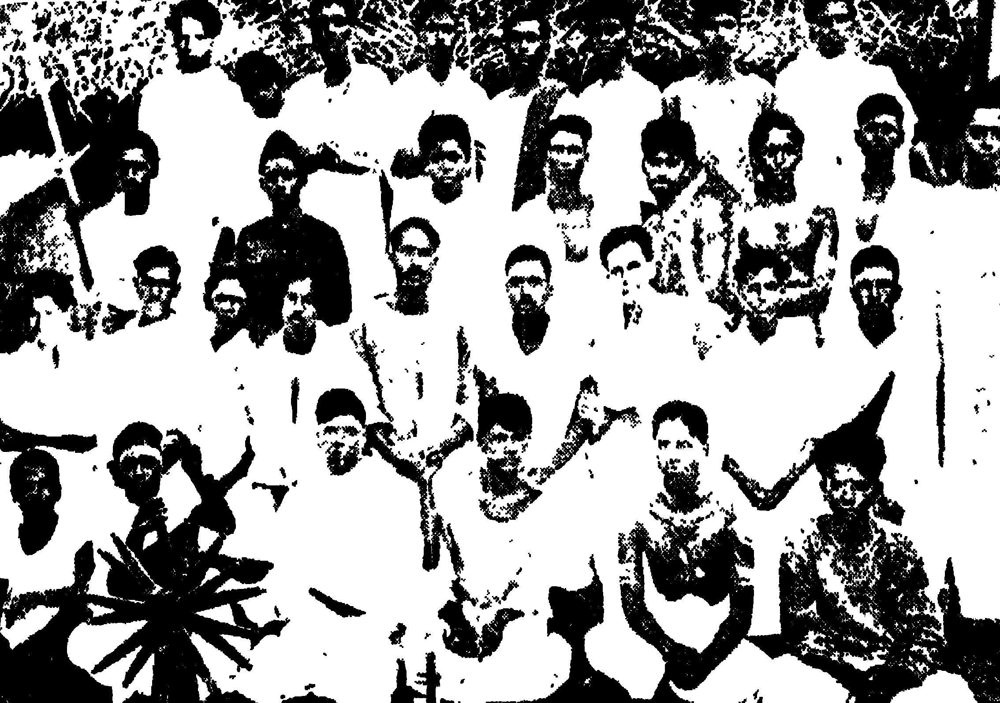

The temple authorities also made arrangements. Barbed
wire fencing was put up all around the temple. Able-bodied
watchmen were engaged to keep an eye on the _Satyagrahis_. The
threat was bandied around that the _Satyagrahis_ would be beaten
to death. The temple was owned by the Samoodiri Raja. The
orthodox elements started adopting threatening postures. They
cursed the sway of Kali Yuga. Harijans couldn't walk on the
public road entering the temple, and certainly not in the precincts of
Guruvayoorappan! Conservatives could think of no greater
scandal. It became the subject of conversation everywhere. A
few nationalists who were freedom-lovers and _khadi_-wearers came
out in their true colours. Some were agitating for freedom from
foreign rule of crores of oppressed people. Indeed, some caste
Hindus who esteemed themselves to be Congressmen tore up their
_khadi_ dress and smashed Gandhiji's picture. They still wanted
the freedom to oppress and suppress Harijans; that was claimed
to be their birthright. But they were resentful of foreign rule.
On one side, the agitation for freedom and on the other, suppression
of the same agitation. A section of caste Hindus vowed that
they would not remain in the Congress any longer if the Congress
meant to interfere in religious matters. Some caste Hindus however,
welcomed A. K. Gopalan and the _jatha_ with the same hands
with which they had stoned Kelappan and his _Satyagrahis_ when
they had gone to offer civil disobedience. They said that if the
Congress strove for the freedom of the oppressed and suppressed
poor, they were in sympathy with it. They gave them bananas
and tender coconuts with the same hands with which they had
earlier stoned the _Satyagrahis_. The poor people who had attacked
volunteers during the tavern picketing donated money to the
_Satyagraha_ fund. Those who believed that the Congress stood
for caste Hindu domination carefully watched this change.
Radical Namboodiri youths jumped with joy as they were
waiting for an opportunity to destroy this social evil implanted
by their forefathers. The Namboodiri womenfolk groaning
under the purdah of their umbrellas began to heave a sigh
of relief as they heard the sound of the blows dealt to orthodoxy.
The rulers were afraid that Hindus might unite. They entered
the scene with the help of Queen Victoria's proclamation. A stir
everywhere! Sanathanists and reformers, men as well as women,
were agitated alike. Palyath Achan and V. T. Bhattathiripad
came to the scene arrayed on opposite sides.

The first of November. The whole of Kerala was waiting for
that day. A group of volunteers under Subramanyan Thirumumpa
had started from Cannanore on foot on October 21 for Guruvayoor.
I was captain of this volunteer group. The happenings on the way
to Guruvayoor, demonstrations, public meetings, receptions and
the like, exhilarated us. The multitude of volunteers who joined
us ranged from _untouchables, those whose very sight pollutes,_
to Namboodiris. The Harijan youths in the _jatha_ attracted the
attention of all. They were proud that they were not _grass
growing under paddy seedlings_. As representatives of a section
that had been trampled underfoot for centuries, they were glad
and proud of the opportunity to take part in a hallowed struggle
to usher in a beautiful new social order in place of a vicious and
stinking society. They were happy that they got an opportunity
to show others that Harijans were not beasts of the forest.

The journey that took us to Guruvayoor and resultant propaganda
created a new stir and awakening in the country. Even old
grannies came forward to receive the _Satyagrahis_ and give them
food. We were thrilled to see venerable elders from families of
leading caste Hindus waiting to receive the _jatha_ at night. We
were given resounding receptions everywhere. Throughout the
journey, the _Jatha_ caused severe cleavages in orthodoxy. The
speeches of Subramanyan Thirumumpu electrified the people.
Many caste Hindu leaders were found welcoming the new change.
There was practically no opposition at all on the route.

The _Satyagraha_ began on November 1. The _Satyagraha_ camp
was at the eastern gateway of the temple. The camp manager was
A. C. Raman. There was C. S. Gopalan to help him. _Satyagrahis_
were to be up at 2am and _Satyagraha_ would start at 3 o'clock
when the temple gates were opened. Two volunteers were
posted at each gate and after three hours the volunteers changed.
The volunteers thus were able to offer _Satyagraha_ from 3am to
midnight the following day. Two watchmen were on guard at
each gate.

>Lord Krishna, beloved of those coming to your feet
>
>Ocean of love, cloud-colored one;
> 
>Lord, we who are afflicted are not
> 
>Supposed to come to your feet
> 
>If thou wanted to hinder us,
> 
>Would thou require soldiers and barbed wire?

The _Satyagrahis_ used to chant these lines from K. T. Raounny
Menon's poem. It touched even the orthodox coming for worship
at the temple.

New songs began to circulate. _Satyagrahis_ like Bharatheeyan
heightened the tempo of the campaign. Bharatheeyan is a deeply
religious individual. _I am a socialist. I must have freedom to
don ashes and read the Geetha without going against that ideal_
is what Bharatheeyan used to tell co-workers. In the evenings
Bharatheeyan would read the Bhagavatham, explaining the text
in easily comprehensible idiom. He would be surrounded by
a circle of devotees.

People would congregate daily in large numbers to hear the
colourful speeches of Mannath Padmanabhan, V. T. Bhattathiripad,
N. P. Damodaran, Kelappan, Agamanandan, Vaisravanath
Raman Namboodiri and others. N. P. Damodaran was our
publicity officer. A talented speaker and writer, he filled the berth
with panache. He could speak on any subject with authority.
He was equally capable of finding convincing arguments for or
against the _Satyagraha_ movement when the need arose. His role
in the temple entry _Satyagraha_ certainly should not be forgotten,
but there was a limit to his dedication to our ideals. Those who have
understood that will not be perturbed over his present position.

Upon seeing the meetings and speeches of the _Satyagraha_
group, the Sanathanists made counter speeches. The chief speaker
was Pallyath Kunjunni Achan. Geetha class, yarn spinning etc.
were daily routines in the _Satyagraha_ camp.

The miseries of the _Satyagrahis_ who stood in sun and rain for
six hours daily at the same spot were heart-breaking. Along with
the volunteers, I also used to participate in the _Satyagraha_ as often as
was possible. As a result I seldom got more than two hours' sleep.

People started coming from many places. Money started
flowing into the _Satyagraha_ fund. People brought gifts in kind to
the camp. Some of the offerings to Guruvayoorappan were
diverted to the camp. People began to regard the _Satyagraha_
camp as something even more sacred than the temple. The discipline
and self-sacrificing spirit of the volunteers made me extremely
happy.

Subramanyan Thirumumpu was arrested at Guruvayoor on
the 7th of November. But this arrest was not in connection with
the _Satyagraha_.

The Guruvayoor _Satyagraha_ became an All-India affair.
Newspapers outside Kerala wrote editorials about it. National
leaders visited Kerala. The echoes of the movement were heard
everywhere. Private individuals allowed Harijans thoroughfare
where there had hitherto been no freedom of travel. People began
to take a special interest in the Harijan movement.

From Samoodiri Raja, the owner of the Guruvayoor temple,
however, there were no signs of response.

It is possible to win over one's people through love and sacrifice.
But that is possible only with people who respond to love.
But vested interests who are governed by self-interest cannot be won
over through love or self-sacrificial passive resistance. It is futile
to expect that.

Moreover, the conservatives all over Kerala created a united
front against our movement. Priests, orthodox Namboodiris and
Paliathachan, all cooperated with the Samoodiri.

The political climate of the country was changing. Government
was getting ready to repress the nationalist movement that
had been growing fast after the Gandhi-Irwin pact. On the one
side, round-table conferences flourished and on the other, repression
of the nationalist movement and arrests of activists. The
feeling was widespread that a second agitation was essential. The
1930 struggle, the Gandhi-Irwin pact, picketing, the fast-spreading
volunteer movement—all these were sources of serious concern to
the organs of Government who were aware that their future
depended on their ability to crush.

January 4, 1932 was a red letter day. It put a stop to debates
and arguments. Civil liberty no longer existed. The authorities
could intern the individual at will and confiscate his property.
Leaders were arrested.

Arrests began simultaneously in several places in Kerala. The
police Sub-Inspector called me that very morning and talked to me.
He said that the _Satyagraha_ movement would not be permitted to
continue. At 12 that night, N. P. Damodaran and K. Kunjikrishnan
(SNDP secretary) and I were all arrested. We were glad
that the government was not ready then to bring the temple entry
_Satyagraha_ to a halt. The movement continued unabated. I was
sentenced to six months rigorous imprisonment and taken to
Cannanore Jail.

This was my second term in jail. For many reasons it was an
important chapter in my political life. It was a time when government
authorities unleashed police and jail officials licensed to do
anything to repress the nationalist movement. They believed that
they could torture the movement out of existence. They did not
realise that arrests and punitive _lathi-charges_ would only strengthen
the movement. A distraught and confused officialdom can only
think like that. It does not therefore surprise one. There is no
doubt that they will one day realise that it is foolish to think that
a hungry man asking for bread can be cowed down by _lathis_ and
brute force. Such an awakening is not far off.

There was a great difference between my first and second terms
in jail. A special type of people and a special environment. There
were no lawyers or doctors in this group. My friends this time
were a group of revolutionaries who functioned among the common
people and who were ready to sacrifice even their lives for freedom.
They wanted to resist atrocities whether in jail or outside. They
never thought of the consequences. They had the stamina, patriotism
and dedication to suffer anything.

We were put to work right from the first day in jail. The task
given was to pound the husks of 50 coconuts in the scorching midday
sun wearing nothing but a loincloth to cover our midriffs.
We submitted to that under protest. As we were small in number,
we did not want to start an agitation. We worked under great
hardship.

More prisoners started arriving. Gradually we began to
resist the tortures inflicted by the jail authorities. We started an
agitation for a change of diet. In two months, about 400 prisoners
had arrived. We declined to work. Brutalities increased. Unfortunately
I was mistaken to be the leader of the prisoners and taken
to task along with others. The Jail Superintendent was Major
Ramanan who was notorious as a tormentor of prisoners. He was
not happy without cane charging his prisoners at least once a month.
His subordinates were no better. _As the master, so the servants._
We conducted an organised struggle against this brutality and won
small gains. We decided to lead a disciplined jail life.

Time was not wasted. Should any common issue arise, everyone
would join and take a decision and act. Hindi classes were
begun. There were daily debates on political issues. We started
reading books on the Russian revolution. We reflected upon the
changes in Russia after the revolution and the five-year plans. We
were sad over the failure of Gandhi-ism. The tendency to reflect on
political matters and hold discussions about them and to read
political literature was increasing. It dawned on us that the struggle
might be a failure and that freedom could only be achieved through
a new path. We started thinking in an international context. We
realised that the Indian problem was related to the world problem.
We learnt many lessons from this. Some novels like _Rotti-ke Saval_
were also read. We also held group readings of some books
on socialism smuggled into the jail. There were in the jail detenu
prisoners from Bengal and Bhagat Singh's co-worker, Comrade
Tiwari. Unknown to jail officials, I visited them in their cell and
talked to them. A keen interest in terrorist activities was aroused
in me.

Some of the co-prisoners became my best friends. Association
with them helped me a good deal in my political activities.

Comrade P. Krishna Pillai attracted me most—a first rate
campaigner. He was interested in nothing but politics, was
prepared to suffer anything, willing to eat any kind of food. He
was to be found at all times discussing politics with someone or
other. Our connection became very strong indeed later on. We
suffered and worked jointly. Of those who nurtured me politically
he takes the lead after Comrade Namboodiripad. I still remember
a number of occasions when we starved together and worked together
in a famished condition. Both of us would share food
procured with whatever little money that we had. We would
spread a _Mathrubhoomi_ newspaper in the union office at Calicut
and sleep side by side on it. We would jointly set out in the
morning. Returning in the evening. we would eat contentedly with
the two or four annas that he or I had. How many days of starvation!
My Comrade's mental strength, that made him greet any
hardship with a smile, excited my admiration.

I found in him many of the qualities necessary in a leader.
If he was not able to bring home his point through theoretical
discourse, he would achieve his purpose through sheer eloquence.
But he was not dogmatic and paid heed to the views of others.

The second in my ranking was Comrade Chandroth. A moustache
that awed everyone, an inspiring nature; a patriot who
resigned his job in protest against the hanging of Bhagat Singh
(He was then in the army). We functioned together until 1939.

The third was Comrade K. P. R. Gopalan, an extremely versatile
individual. In jail he played chess most of the time. He
was not affected at all by the hardship of jail life. A good singer,
he would sing for at least half an hour a day in jail. A brave man
who regarded life itself as a light burden. A person with absolutely
unshakeable convictions. Our bonds were so close that he would
call me Gopalettan. He was to become an extremist in later days.
I believe that he has learnt from experience that extremism is a
blunder.

At this juncture I was able to meet many of Kerala's important
contemporary political figures. K. A. Damodara Menon was
then a good friend of mine. Mukherjee, a prisoner from Bengal,
once said that Gopalan could be seen wherever Damodara Menon
was. We were always together. I never imagined even in my
dreams that I would have to separate from him at a later stage.
Politics, after all, is not the school-master's logic.

Brutalities were on the increase. There was occasional torture
too. Prisoners started disregarding jail authorities. Some
started ridiculing them. Coconuts were plucked from coconut
palms in the jail and eaten. There was a military-type march past
every morning. I played a notable part in all this and I
anticipated a clash.

The Jail authorities prepared for brutalities. The alarm rang
at 9 o'clock on a certain Sunday. Jail wardens entered our block
and started beating us indiscriminately. They saw me first. I
was beaten by 15 people who surrounded me. They went on beating
me until they were tired out. They kicked me into the cell
and locked me up along with the others. Terrible cruelty. Everyone
was beaten up—those relaxing and those washing. I scolded
the wardens from inside the room as they were returning triumphantly
after the attack. They opened the door. Comrade
Krishna Pillai and I were separated from others and beaten. Two
_lathis_ snapped. Injuries all over the body. Clothes drenched with
blood. We were asked afterwards to walk. We walked with the
wardens around us. We were taken to another block, and beaten
even while walking.

An interesting incident occurred. One of the wardens was a
hunchback and we used to make fun of him. He was a cart-puller.
We would call him Cart warden, and emit cart-driving sounds whenever
he came into sight. He hated us. He was unable to come
in time to join in the beating exercise. When it was nearing its
end, he came drenched in sweat. He was sorry that it was all over.
He was however able to beat us to his satisfaction. While returning
he said: _Alas, I could not reach in time. There were four
or five others too. I may get an opportunity to beat them later.
Anyway, I got the leaders. A stroke of luck._

We were locked up for twelve hours. We were unconscious.
The other prisoners thought that we were dying. The news reached
the town. People collected in front of the jail. The Superintendent
approached us. By that time, we had started a hunger strike.
It was withdrawn on the assurance that some facilities would be
allowed.

After a few days, I was summoned to the office and told that
I was to be transferred to Cuddalore Jail. I was transferred on a
report from the Superintendent that I was the cause of all the trouble
and that I should be given stern punishment.

Cuddalore jail is in South Arcot. It is a small jail. There
were about 50 B class prisoners there at the time. I was taken to
the block where mad prisoners were kept. A fat warden came and
took me there. Asked where I was being taken, he replied: _to
the mad men's block_. I was in tears the moment I saw the place,
and thoroughly shaken up. Yes, I was a mad man to officialdom.
It may be madness in the eyes of imperialists to work for the independence
of the country of one's birth. There are many types of
madness. I am proud to say that I am a 'political lunatic'. It is
certain that that madness will not leave me until imperialism is
wiped out. It is my wish that this madness does not disappear as
long as oppression remains in the world. A group of prisoners
did not even hide their nakedness, some were poor prisoners who
had become lunatics and semi-lunatics as a result of the miseries of
jail life and the blows inflicted by wardens. I was greeted with the
words, _Hey, Congress lunatic_. I could not eat. I was lodged
with them at night. I could not sleep. Every five minutes they
would start wrangling with each other. One would bite the ear of
the other. The wardens would immediately start beating us all.
I felt certain that my life was in danger. However, I was ready to
suffer anything.

I started a hunger strike the next day. It went on for six days.
Jail authorities did not care. I finally stopped the hunger strike
on the assurance of the Superintendent that I would be lodged in
a separate room.

I felt sympathy for my fellow prisoners—children of the present
rotten social order. They could not live outside. On the one side,
harassment by local chieftains and on the other harassment by
officialdom. In jail they were treated just like beasts. Anybody
could beat or kill them. They did not wish to live. These prisoners
became my friends. They were a living embodiment of the indescribable
achievements of 150 years of imperialist rule. They even
beat me sometimes. I did not feel sorry about it at all. To escape
their blows, I often used to share my food with them. There was
nothing but chaos and confusion there. I could not eat or sleep.
Three months of Cuddalore life swallowed up 30 pounds of my
weight. I finally came out an emaciated and sick man.

There were in the jail before me a boy of 16 from Travancore
who had been arrested in the civil disobedience movement and was
lodged in the Cannanore Jail, Sri Chathu Nambiar of Azhekkode
and two other Congressman from Andhra. They had been sentenced
and transferred there long ago. The boy finally became
stark mad. Our nursing improved his condition somewhat. Oddly
enough he would beat me even as I nursed him.

While in jail, I used to think about the temple entry _Satyagraha_.
I wanted to rejoin the struggle as soon as possible. Although
the Guruvayoor temple was still closed to Harijans, I saw that the
movement had created an impetus for social change throughout
the country. It led to a transformation everywhere.

There arose the feeling that untouchable communities should
progress and develop. Temple entry and freedom of movement
were their elementary rights. The movement awakened a large
section of caste Hindus to the inequity of so many traditional
customs. The movement gave birth to a large number of Harijan
social workers. Political leaders could not focus attention on this
matter as it was a time of intense political struggle and of severe
repression by the authorities throughout the country. Some
political workers were against the temple entry struggle being held
at a time when political struggles were going on. To them it seemed
a reactionary programme. Nevertheless, Kelappan and the _Satyagrahis_
continued the campaign. At the end of my prison term, I
functioned once more as a _Satyagraha_ captain.

# Chapter 5

I left jail a sick man. My body was covered with injuries from
the hardships and brutalities of jail life. Doctors and friends
asked me to rest for some time. Rest! I could not even think of it.
As a dedicated campaigner for freedom how could I think of rest
when the entire land was echoing with the sound of _lathi charges_,
when thousands of people were entering the battle arena and when
a determined struggle was in progress? To fall back now would
have been contrary to my nature. Then, as now, I had an agitator's
mentality. Whether it be against imperialism, feudalism,
capitalism or orthodoxy, I have always yearned to live amidst the
struggle, to breathe the air of agitation, to fight reactionaries, to
court arrest. Such is my nature. I have tried to create turmoil
even during 'peace time'. I was therefore scornful of those who
advised rest. For that I would await the day when I could rest on
the ashes of imperialist domination.

The Paralasserry village political conference was held on the day
after I returned home. Village political conferences were the form
of civil disobedience priorities of the day. They had assumed the
dimensions of small scale guerilla warfare campaigns. A meeting
would be announced a week before the day it was convened. The
names of the President and inaugurator would be announced and
immediately the whole place would be filled with policemen. They
would do everything to prevent the meeting from being held.
Foiling them, Congressmen would hold the meeting. I still remember
a few interesting examples of this.

A meeting was organised on one occasion at Varnasseri near
Cannanore. The police vowed that they would not allow it to be
held. The meeting was to be at 7 in the morning. The police
kept the place surrounded from the previous night. No one was
allowed to pass that way. We disguised our President in a police
Inspector's outfit. He calmly moved amongst the policemen.
Some police Inspectors had come from outside. The local police
did not know them. Taking our President to be one of those
Inspectors, the police started saying _750, Sir_, _305, Sir_. The
President reached the appointed place at the end. He removed
the disguise and appeared in _khadi_ clothes. In no time, people
came singly from many corners and the meeting was held.

The police became more and more exasperated and furious.
Once we arranged a meeting at Valappattanam. The police began
patrolling the banks of the river and the river itself. They boasted
that this time the meeting would be prevented. We boarded the
President and other volunteers on a country craft dressed in
fishermen's attire, and toppi-kuda or wide brimmed hats made of
palm leaves. One of the volunteers started casting the net every
now and again as a fisherman does. The police boats approached
ours. They took us to be real fishermen. _Who are you?_ they
asked. _We are fishermen, sir; we are catching fish,_ we replied.
_Go soon,_ they ordered. Towards dawn, the fishermen changed
into Congressmen. The enraged policemen arrested all of them
and beat them up in the lock-up.

The agitation centres this time were Calicut and Cannanore.
Cannanore in particular had an unequalled position. Picketing
took place in small villages as in towns. Several taverns had to be
closed at Chombal near Mahe because of persistent picketing.
The Youth League organised picketing at Orkatteri, Vallikad,
Puthiyangadi and other places. When the League was outlawed,
its leaders came out.

The Youth League of Comrade K. P. Gopalan played a large
role in this struggle. The Youth League meeting was held close to
the Gnana Pradeepa institution. All the members who attended
were severely beaten up by the police.

One cannot omit mentioning the names of some prominent
Congress political workers of the time. Mullankandi Raghavan
was the best of these. It was he who led the agitation at Cannanore.
A very able young man, he was at ease with all classes of society.
He had a large part to play in the Travancore agitation too. There
was no middle class family in Travancore which did not think
fondly of Raghavan.

I developed a close association at this time with people like
Krishnan, 'writer' of Wheel Andhra Company, Manikkota
Narayanaettan, Unni, 'writer', Kittayi, Manikkoth Kumaran,
Chatta Krishnan, C. K. Unni and Potheri Damodaran.

While involved with the Harijan movement, I met Krishnan
(Tailor Krishnan). I had close links with him until 1935. Unfortunately,
because of political differences, I had to sever contacts
with him later. He lacked sound political instincts and started
attacking party workers individually when party work began and
sided with the capitalists. I cannot say what his present ideology
is. Anyway, he was of great help at that time to Congress workers
like me. Particularly during times of struggle, his entire family
undertook great sacrifices.

Right from 1930, I was in close association with Samuel Aron
and Mrs. Aron. They gave me a great deal of encouragement
after I set out on the path of revolutionary struggle. But afterwards
he became the sworn enemy of the Socialist Party in Kerala, and
today of the Communist Party. Mr. Aron would speak out
openly. He once told me jokingly: _I will try as far as possible
to destroy you. I will divide you. I will create family feuds. I
will win over one section of the family with money. I will see
whether some of you too can be neutralised with money. If all
these fail and you set up your government, you will kill me.
Before that happens I will shoot myself._

Although he said this in jest, I know now from experience that
most of what he said was meant seriously. Although moved by the
aim of frustrating Communists, he has done a lot of work in relief
operations. Aron was one leader who openly led anti-Communist
agitations. We worked together mostly during the Central Assembly
election. Known as _Kachiyamma_, Mrs. Aron is an ideal
woman. Whatever be one's political opinion, she has always been
completely free of mean personal animosity.

Another notable figure was the late L. S. Prabhu. We worked
jointly for some time as State Congress President and Secretary.
He was very brave. He spoke frankly and openly regardless of the
consequences. But he was not tactful. He would say anything
(true and untrue) about enemies, co-workers included.

I was thus associated with several Congress leaders during the
time of the second agitation. While in jail and outside I got into
touch with people like Raghava Menon, Sankara Narayana Menon
and Gopalan Unni.

The police indicted me under Section 144 IPC a day prior
to the Paralasserry meeting. This infuriated me. I had wanted
to rejoin the Guruvayoor _Satyagraha_ struggle. Moreover, I understood
from friends and relatives that mere law-breaking and going
to jail would serve no useful purpose. I stayed at home in anger.
Arrangements for the meeting were made.

The meeting took place at 7 o'clock in the morning. The
President was a 64-year old woman. A rumour spread that the
police had beaten her. Volunteers had been beaten severely and
had run away. I was very excited and angry. I assembled all the
volunteers and took out another procession. We challenged the
police and demonstrated outside the police station. The police
were frightened. Nothing untoward occurred.

I resumed duties as _Satyagraha_ captain at Guruvayoor.
Srimathi Kamalavathi was captain while I was in jail. Earlier we
had worked jointly during the 1931 picketing. She had worked
in Bombay in 1930. She was a very active, brave and zestful young
lady, but did not know how to behave tactfully. This created
some problems. She could not escape from the scandals that surround
young ladies who undertake public activities in India. Besides
Srimathi Kamalavathi, there were Srimathi Devaki Amma and
Kunjikkavamma in the _Satyagraha_ camp.

The _Satyagraha_ movement was slowly stagnating. The _Satyagraha_
and songs and speeches lost their novelty and became routine
matters. There is no doubt that this movement had led to a vast
social upheavel throughout Kerala. It was also true that it had led
to great changes in Guruvayoor and neighbouring areas.
everyone began to doubt whether the Guruvayoor temple would be
opened to Harijans after all. The movement was unable to change
the mind of Samoodiri, the owner of the temple, and of the communal
orthodoxy. Many _Satyagrahis_ and sympathisers lost faith
in _Satyagraha_ as a means for psychological change. I pondered
over how to generate a new awakening and enthusiasm. As noted
above, great changes had come about in many families in and around
Guruvayoor as a result of the temple entry _Satyagraha_. Dr. P.
G. Nair was the soul of the movement. Vadakkekara Balan was
the youth leader. The help of K. P. Karunakara Menon,
Dr. Thomas and others was also considerable. Help came thus
from many sources. Excepting the Brahmins who lived off the
temple, a large section of caste Hindus themselves were sympathetic.

The movement also had its impact on young students, both
men and women. Students like Srimathi Meenakshi, Madhavi
and Padmavathi used to visit the camp.

I noticed a young student who was one of our visitors. A
fair thin youth used to appear at the camp daily after school. He
did not speak much. He would weep if anyone spoke to him
angrily. This young student was none other than Comrade Unniraja
who rose to be one of the leaders of the Kerala Party. It was
young men like him that the movement was able to bring into
the political field.

Something happened in the meantime. Comrade Krishna
Pillai entered the temple one day. The rule is that the bell in front
of the archway can be touched only by Namboodiris and not by
Nairs. Comrade Krishna Pillai rang the bell. The guards on
duty beat him up. This helped to an extent in breaking the ice.

I decided to create a new awakening in the movement. Many
used to come for the public meeting in the evening. There were
talented singers like Appuk unjan among the volunteers. The
volunteers started a programme of devotional music after the meeting.
They sang new and attractive songs. The volunteers would
return to the camp after circling the four gateways in procession.
The crowd that came for the meeting would stay for the music.

The music attracted more and more people. Temple authorities
were frightened of this new tactic. About a thousand people
attended the _bhajana_ one day. The temple authorities were afraid
that the crowd would storm the temple. They also assembled a
large crowd. I was leading the _bhajana_ and I ventured a little
beyond the fence at the western gate. The crowd nearby started
beating and kicking me. I was knocked to the ground. They
continued to beat me. The people were incensed when they
heard that I had been assaulted. There was a large group of
Muslims among them. Muslims were very sympathetic towards
the _Satyagraha_ movement. Volunteers pacified the crowd and
falling at their feet requested them to be calm. The people did
not listen. Fearing a riot, the enemies stopped the attack.
Somebody picked me up and took me outside. I asked the people
to remain calm. They were satisfied with that. I was then taken
to the house of Dr. P. G. Nair. The attack had a very bad
effect on my physique. I was not even able to swallow food.

My brother Padmanabhan Nambiar was at Guruvayoor at
the time. He did not believe in _Satyagraha_ and self-imposed
passive suffering. He believed in opposing violence with violence.
The news that I had been assaulted reached him. Angered, he came
with some followers half an hour after the incident and beat up
everyone in sight. The timid temple workers closed the doors and
remained inside. Everyone was upset. There was general confusion
and unrest. Although I had not envisaged all this, this incident
put an end to the inertia, but in an unexpected way. Instead
of the call _open the temple_ there was an outcry that we break
into the temple. Throughout the neighbourhood, people were
keyed up. Temple authorities stopped coming outdoors. Some
timid Brahmins approached me with protestations of their innocence.
They even feared for their lives. Many people were intent
on destroying the temple. Some even made preparations for that
purpose. The people were dissuaded by the entreaties of the _Satyagraha_
organisers.

After this incident, the temple remained closed until Jan. 28.
All this while, the _Satyagrahis_ would go up to the archway and
remain there. When the temple was re-opened on the 29th, _Satyagraha_
was resumed at the original site. Later, a prohibitory order
under the Fifth Ordinance of 1932 was promulgated banning
entry beyond 50 yards of the temple walls.

For nearly a month afterwards, I was under Kakkanat Mami
Vaidyar's treatment. Mami Vaidyar and more particularly his
son contributed greatly to the movement.

I felt that even Kelappan was slightly disappointed. Anyway,
he did not want the _Satyagraha_ to continue in this manner. He
decided therefore to sacrifice his life for the cause.

September 1932 was to mark the finale of the Guruvayoor
_Satyagraha_. Kelappan decided to fast until the temple was opened.
The committee accepted the decision reluctantly.

Kelappan started his fast in a small _shamiana_ outside the temple.
He bid farewell to the volunteers before the start of the fast. It
was a very touching moment. We, the volunteers, were afraid that
Kelappan might succumb. However, we were ready to offer not
only his but our own lives for the cause. We insisted on fasting
along with Kelappan. But this was disallowed. Kelappan fasted
under vow. I fasted without making a vow.

Kelappan's fast stirred the whole of India. Volunteer _jathas_
started for Guruvayoor from all parts of Kerala. Samoodiri Raja
received telegrams from many places. Both in and out of Kerala
vast public meetings were held. A caste Hindu public meeting
was held at Guruvayoor on a grand scale. All the caste Hindu
leaders of Kerala came for this meeting. The President was
Mattannor Madhusudhan Tangal who was an aristocratic Namboodiri.
Some 10,000 people attended the meeting. That huge
meeting proved that the whole of Kerala was behind us in the matter
of temple entry. A gentleman named Krishna Bhat offered _Satyagraha_
outside the Samoodiri's palace. Some of the palace women
of his household came to Guruvayoor. Namboodiri youths determined
to do anything and entered the stage. Harijans were granted
entry into some small temples owned by private individuals. A
great general upsurge. Public meetings and signature campaigns
went on throughout Kerala. The Samoodiri was
worried. The government too was upset. _Death or victory._
It was decided to offer the _Satyagraha_ inside the temple. K. A.
Damodara Menon, Srimathi Karthyayini Amma and others got
ready for that.

Our enemies spread many rumours about the fast. They were
scared of the repercussions of Kelappan's death. Youngsters who
had lost faith in _Satyagraha_ started searching for other methods.
The Samoodiri approached the government. The government too
was apprehensive of what this mass struggle might lead to.

Guruvayoor became a resort of national leaders and lovers of
humanity. It became an All-India problem that attracted the
attention of leaders of All-India stature. People like U. Gopala
Menon were extremely upset. They were more worried over
Kelappan's health than the opening of the temple to the Harijans.
They wired to Gandhiji. A great effort began to persuade
Kelappan to end the fast. Karur Namboodiripad left for North
India to meet leaders.

Finally, on the tenth day, a telegram arrived from Gandhiji
with a request that the fast be abandoned temporarily and with an
assurance that he would be personally responsible for future programmes.
I was not in favour of ending the fast. I would not
have regretted the death of a dozen leaders like Kelappan in an
effort to end the centuries' old oppression and injustice inflicted
on one group of people by another. I believed that the popular
indignation springing from Kelappan's death would be strong
enough to crack the bedrock of orthodoxy, which was already under
severe pressure. I believe that people like K. Madhava Nair who
played a considerable role in the _Satyagraha_ movement from its
inception did not agree with this view. Anyway Kelappan stopped
the fast under the pressure of circumstances, and the protest movement
also reached its finale on a low key.

It was decided that a _jatha_ should tour the whole of Kerala to
propagate temple entry. It could exploit the favourable atmosphere
created by Kelappan's fast. We started with 20 _Satyagrahis_ including
Subramanyan Thirumumpu and N. P. Damodaran who
were our speakers. it was decided to tour Cochin first and then
Travancore and Malabar. The whole Travancore programme was
arranged by Mannath Padmanabha Pillai. Both the Nair Service
Society and the SNDP combined in the venture to make our
programme a success.

It was decided to hold a referendum in Ponnani sub-district
to find out the extent of mass support for temple entry. The signatures
of caste Hindus were collected. Kasturi Bai Gandhi visited
Kerala. Her visit gave a great fillip to the referendum propaganda
work. A group of Congress workers prepared themselves for
referendum work. The referendum was speedily completed. It was
found that the majority were in favour of temple entry.

15,568 voted in favour of temple entry and 2,779 against.
2,106 remained who did not express any preference. 7,302
abstained from the referendum. In all 77 per cent were in favour
of temple entry. That was no mean achievement of the
_Satyagraha_.

We were warmly welcomed everywhere in Cochin and Travancore.
We realised that this movement had more or less been able
to root out untouchability. People vied with each other to receive
us. Caste Hindus came to the fore to show their sympathy for the
cause. Sankara Menon informed us that he was ready to open his
temple when our _jatha_ reached Adoor. But, because of pressure
from the Cochin royal family, this could not be done.

The march of the _jatha_ through Travancore was extremely
grand—vast crowds, enthusiastic receptions. Nair, Namboodiri
and Ezhava joined to receive us. The speeches of Mannath
Padmanabha Pillai, Thirumumpu and N. P. Damodaran delighted
and inspired us.

The meeting at Trivandrum was unforgettable. Led by Sri
Bodheswaran, 4,000 people including law college students welcomed
us and conducted a huge procession. 30,000 people attended the
public meeting in the evening. I think it is not incorrect to
regard the march of the _jatha_ in Travancore as a forerunner
of the temple entry proclamation that was issued there later.

Another significant thing happened at the Trivandrum public
meeting. Pattom Thanu Pillai wanted to make a speech welcoming
the _jatha_. But the people did not allow him to speak. He said
that he had come not to speak but to welcome the _jatha_. _Whatever
it be, do not utter a word. Where were you during the picketing?
We want people who act, not those who speak._ The
people said this and did not allow him to say a word. A mighty
crowd and that too in Trivandrum city. The best speakers of
Kerala belonged to Trivandrum. I did not know how far they
would relish my northern slang. It was therefore with some
trepidation that I walked to the platform as the first speaker. _I
am not a speaker, but only a fighter. I and my friends will be
before you **if there is a struggle**._ When I said this, the people
replied: _That's just what we want. We only want to hear such
people._ Subramanya Thirumumpu made up for the shortcomings
of my speech through his learned Sanskritised one.

At the end of the march through Travancore we began the tour
of Malabar. We travelled right upto the Malabar border of
Kanchangad. There was a novel feature in this march. A charming
child accompanied us. She was 10-year-old Madhavi. She
amazed us all by her precosity. Even the elderly were won over
by her.

The Poet's line _How many writers were cruelly aborted in
your womb, Mother Kerala_ came to my mind as I watched that
child. She was undaunted by weariness. Another child who
charmed everyone was a Harijan boy named Unnikrishnan. He
too helped to lighten our failing spirits. We fell to thinking about
how the devil of orthodoxy had fattened itself on the blood of
delightful children like these.

Unnikrishnan later became a prominent Harijan social worker.
He is not with us today. Death has taken him away from us.

While touring North Malabar, the _jatha_ passed through the
village where I was born. The young people of the place gave our
_jatha_ a grand reception. A public meeting was held at Paralasserry
school. My father did not attend it, as he did not approve of it.
My mission also offended a few relatives. My brother-in-law was
so angry that he left home with my sister. A general confusion
reigned in the household. This was all very painful for me. But
I was glad that most of the people were with me. The _jatha_ was
disbanded at Kanchangad. We had covered about 1,000 miles on
foot, taken part in 500 public meetings, and got acquainted with
numerous families.

We were able to convince the people that untouchability was
a dangerous cancer imbedded in Indian society. This also was
the stage when I retired from the Harijan struggle and re-entered
the stage of political struggle.

A sad thing happened at this time. It is known only to a few
of my old friends and is still secret from others. It made me very
unhappy. I was a married man. I had married just before
embarking on my political struggles. I consented to marry under
pressure from father. I had to marry his niece according to custom.
My association with my wife was very limited. After marriage I
was either in jail or in the _Satyagraha_ movement. To sever connections
with the family, and not to marry, were I thought what
was expected of a revolutionary. It was only later on that I learnt
that this was a mistaken notion I wanted to be the foremost among
revolutionaries. However, under pressure of circumstances, I
got married. I tried later to become a revolutionary by
disassociating myself from my relatives and my wife. I did not
endeavour to accommodate my relatives or to bring them closer to
my ideology. Such an extraordinary person was I! I have gone
to jail. I have spread national feelings among the people, participated
in the _Satyagraha_ movement and created a revulsion against
orthodoxy in the country. But I failed to create that spirit in the
people closest to myself; in my wife and family. Nor did I try to.
I did not realise that that was my first obligation. I did not understand
the blunder of trying to reform the world without reforming
one's own family, nor that it was a part of the general effort for the
country. I have suffered greatly for this great error of judgement.
It has taught me a bitter lesson.

The opposition of my father and relatives came to a climax
with the temple entry _Satyagraha_. My wife had to suffer abuse
at home. She found it difficult to carry on without me. She
wanted to accompany me. I did not know whether it was love of
me or of the country that prompted her. I explained to her the
difficulties of living with me. She gave her word that she was willing
to suffer all that. I was relieved. I was eager to educate her.
I took her to Kelappan's Harijan ashram, Pakkanarpuram, and
put her up there. After two days I left for Calicut. Taking advantage
of this opportunity, her uncle came to the ashram, lied that her
father was no more and took her away. She was confined to his
house. I heard of this and decided to visit her house. I wanted
to apologise to her relatives for my mistake. I thought I would be
able to convince my wife who was not sufficiently educated politically.
I failed. She would not talk to me. I could not even see
her. I knew that she loved me. But she did not have the courage
to rebel against customs and come with me. It was my fault, not
hers. She did not remarry for four or five years. She did however
marry again at a later date. I am happy that she did. So
she also deserted me. A partner who was ready to share life's
happiness, the burdens of my sorrow and work-she too left me!
Why? The answer is not far to seek. I am a political worker
and a revolutionary who has courted hardships. But some of my
relatives were senior officials. Outcaste and Harijan peons used
to enter their homes and work in them. Nobody used to say
anything about that. Silver coins are strong enough to pacify the
cry of untouchability. To flourish the banner of orthodoxy it is
sufficient that one can distribute largesse. My relatives did not
lack that. I have lived my life in the belief that it can and will
stop or be stopped.

Marriage—I was disenchanted with it. It is only a matter of
business. An investment. Its best friend is the rich man. To
marry a political leader is like garlanding hardships and brutalities
and to welcome them voluntarily. Until there are young women
who are willing to suffer anything and who possess a corresponding
political sense, marriage can be nothing but a burden to a public
worker; a serious handicap. May she not be the knife cutting the
throat of his principles? I learnt a lesson from marriage. I
learnt it at the cost of severe mental anguish. Women today have
no freedom. They have no freedom to marry someone whom they
like and who is closest to their hearts. Even deliverance from the
despotism of an undesired husband is not possible for them. They
have no economic freedom. A time will come when love of one's
fellow-men is no longer an offence. A time when a real patriot
will be welcome everywhere. A time when women can lead their
lives without having to become man's slave. I consoled myself
with the thought that readiness to sacrifice even one's life is the only
way to make such a dream a reality.

It was while in hiding later on that I could sense the virtues
of family life. After I was free, I often wished for a married life,
although motivated by a different reason. But it is natural for a
cat who has jumped into hot water to be afraid even of cold water.
A happy married life is not easy for a political worker like me. As
long as the inequitable social order of the past exists in the present
there are bound to be many obstacles. Therefore the catastrophe
of my married life only reinforced my belief that the existing social
order must be wholly destroyed if one is to partake of any happiness.

Like a wick in an oil-less lamp, the civil disobedience
movement was flickering. There were occasional processions and
arrests in Calicut and Cannanore. Everyone realised that the
cause was on the verge of failure. I tried to give vigour to the
picketing at Cannanore. Before long I was arrested and sentenced
to one and a half years' imprisonment.

I was in the Cannanere Central jail for about fifteen days.
According to their records I was a dangerous prisoner. I expected
that I would soon be moved to another jail.

Within a month I was taken to Bellary. Bellary jail was notorious.
It was a hell for _class C_ political prisoners. I was sent there
with a certificate that I was dangerous and should be suitably
chastised. Anyway, I decided to obey whatever the jail authorities
ordered and to live as far as possible without creating any scenes.

Jail authorities started treating me inhumanly from the
moment I arrived in Bellary jail. I was given the task of turning the
grind-stone. I could not do that. I was taken to task and confined
with a pole chain. One inch wide iron rings encircled each
of my ankles. Hanging from them were two iron balls weighing 20
pounds. It used to be fixed to another iron ring and would remain
fixed even while I slept. This was called a pole chain. Although
I found it hard to bear, it became a source of amusement to ine
after a time. After a month, I was detailed to pound flour. The
work tired me out in a week. Finally, they ordered me into
solitary confinement by day and night.

Comrade Kammampadi Satyanarayan, who was a leader of
the Andhra Party, was also confined to a room like me. Unable
to bear the miseries of jail life we had written secretly to V. V.
Narayanan Nambiar and Jagannath Das. I realised later from
the brutalities inflicted on us that the letters had been intercepted.

Dirty food and solitary confinement—both these tormented me
greatly. I started losing weight. I decided finally to fast. The
fast began. As I was already weak, it was not easy this time. On
the seventh day, they started nose-feeding me. I protested against
such treatment. Some 20 people would pin me down as I was
nose-fed with milk. I had burning fever on the 10th day, lost
consciousness and was hospitalised. I was administered medicine
and milk, and then moved to Vellore as _class B_ prisoner.

I stayed at Vellore jail for about two months. There I pondered
over the _Satyagraha_ movement. I discovered some changes
in my thinking. I now lacked faith in conversion of heart. I
regarded _ahimsa_ as no more than a political strategy. The Guruvayoor
_Satyagraha_ was a great achievement. It had strengthened
the agitation to achieve the basic objectives of temple entry and
freedom of movement. But everyone regarded temple entry as a
communal issue. Harijans were poor. They had nothing of their
own but their toiling bodies. They did not own an inch of land,
nor a place to dwell in. They could not dwell where others lived.
They were always dependent on others for their existence. They
had no means to better themselves. What they touched, others
would not touch.

They must be given the opportunity to progress, to own houses
of their own and land to till. Only then will the present inequalities
disappear. They will not get a better living as long as they live on
other people's land, as long as they are the slaves of others and as
long as they live in economic dependence on others. The economic
roots of untouchability have to be cut. For that they must own
their own houses, be able to command good education and access
to social services.

Even after temple entry many Harijans would be unable to
visit temples. How can people who have no change of clothes to
wear visit temples? Without economic freedom it would be
impossible for Harijans to better themselves. Such thoughts.
passed through my mind.

Mass civil disobedience gave place to individual civil disobedience.
Civil disobedience failed once again. It was clear
that freedom cannot be achieved merely through a programme of
going to jail. Gandhi-ism had proved a failure. Unless peasants
and workers fight in the forefront, freedom cannot be achieved.
And they cannot be mobilised by appeals for _Swaraj_. _Swaraj_ is
something other than that. They have some urgent problems and
needs. To a peasant his nearest enemy is the landlord. That their
landlord is a Congressman, does not improve their condition. The
peasant is overburdened with heavy rents. Without relief from
this problem, the peasant cannot take a single step forward.

The same is the case with the worker. He toils from morning
till evening. He does not even have trade union rights. His wages
are minimal. He will not come forward until he gets a living wage.
If the Congress failed to organise peasants and workers separately,
fight for their immediate necessities and win their confidence, they
would not enter the freedom struggle. They must be convinced that
freedom means freedom for the poor to grow and develop. Such
were the thoughts that passed through my mind. I was drawing
closer to _Socialism_.

I was released from jail towards the end of 1933.

# Chapter 6

When civil disobedience was suspended in 1934. Young people
who had courted imprisonment and had otherwise taken part in
the nationalist movement lost their faith in the policies and programmes
followed hitherto by the nationalist movement. Opinion
was growing among them that a new policy and programme of
action was the need of the day. It was increasingly felt that this
would only be possible if the nationalist movement was under
Marxist leadership. In all countries except Soviet Russia, hunger
and unemployment were on the increase; nationalists increasingly
started paying attention to Russia. There was no hunger and
unemployment there. All men and women were employed.
Everyone had work according to his ability and wages according
to work, universal literacy and basic comforts of life. A social
system monopolised by the idle few was non-existent there. Women
enjoyed the same freedom as men. The old order in which women
lived as slaves of men and danced to their tune without any economic
freedom no longer existed. They had laid the foundations of a
magnificent social system that was free of exploitation and oppression,
in which one did not corner the fruits of another's labour, in
which it was impossible to see anyone suffering from hunger or
uncared for in sickness. In fact the Russian social system had
begun to spread its fragrance even over the rotten social fabric of
capitalist countries in the form of social service legislation. The
oppressed classes of capitalist countries were beginning to look
upon Russia's munificent social system with longing. How was it
achieved? How did they conduct their struggles · How did the
people of that country overcome bureaucracy and the misdeeds of
the Czar? What was the part played in this by peasants and
workers and the educated middle classes? A large section of those
who participated in the nationalist struggles in India from 1930
to 1934 decided to examine this and to adopt a similar programme,
modified to suit the different conditions in India. Russia gave
inspiration and hope to the oppressed people all over the world.
The world capitalist class and the imperialist autocracy trembled
at this.

Why is it that struggles waged for two and a quarter years with
remarkable courage, intelligence and magnificent self-dedication
were a failure? It was clear to one section that the struggle had
failed on account of the lack of confidence of the Congress
leadership, their fears that an ebullient movement with the active
participation of the common man would end in a national upsurge
and their secret desire to avert such a mass revolution as far as
possible. According to leaders like Babu Rajendra Prasad, the
people were ready for sacrifice—to go to jail, to undergo brutality
and hardship—but were not ready to suffer financial loss. That
was why the struggle did not succeed. They held that it was against
truth and _ahimsa_ to hoard money and other assets and to make
special arrangements for their safe-keeping. According to them,
the struggle failed as the government realised this and confiscated
property and imposed heavy fines—this frightened away some.
However, most of the people of India do not have wealth to
hoard or lose. It is they who should be in the forefront of the
freedom struggle. Their only assets are their bodies; they have
nothing to lose so they are ready for sacrifice. They do not suffer
in the freedom struggle even a percentage of their sufferings in daily
life. Why then did they not participate in the struggle fully?
This was the viewpoint of another section.

It was these views and opinions that led, after 1934, to the
formation of a group known as the _Congress Socialist Party (CSP)_
inside the Congress.

One of the reasons for the failure of civil disobedience was
that it did not enjoy the organised backing of a large section of
peasants and workers as it should have done. The Congress did
not approach the masses in the right way. Is the sense of freedom
absent in peasants and workers? Don't they wish to be free?
Are they free of hardships? Are they not willing to suffer for
freedom? Are they in fit circumstances for that? If the answer
to these questions is _Yes_, then why is it that this vast section of
the people did not enter the arena with eagerness and enthusiasm?
The reasons for this must be considered.

What is the worker's position? He must work from morning
till evening. He must suffer the kicks and blows of his employers.
He must bribe supervisors. Ten hours' work a day—he is a living
corpse by evening. He does not have the strength even to walk
home. What does he get in return? Not even enough money to
meet the basic necessities of life and a trip to the factory next day
to make some more profit for the capitalist. The barest wage. He
cannot even dream of life's smallest comforts. His life is a story
of a struggle for existence, privations and agony. He has no faith
in his own strength or ability. He resists committing suicide only
because, unknown even to himself, there are germs of a revolutionary
sense in him. He does not find a single well-wisher in the
world. His so called betters assume that he has been created as a
machine to toil for the rich, fortunate classes. Fate and destiny
are the philosophies with which they console themselves.

Even more pitiable is the condition of peasants. Extortionist
land rent, debts and taxes. He loses when the landlord is out of
sorts, unhappy or in a hurry. Every death and birth in the landlord's
house means an additional burden to the tenant. He has
to work more for nothing. He has to look after the landlord's
cattle free. He has to stand guard at the gates. He has to stand
aside bowing low. He cannot wear good clothes. What he does
wear should not come down to the knees. He should not look
prosperous. His women-folk should not be fair-complexioned.
The lamp of knowledge should not light up the peasant's mind.
The peasant should not touch or even approach his social superiors
for whom he toils.

Planting, manuring, physical labour, keeping guard—none
of these ordeals face the landlord; he is even immune to the
scarcity of or devastation by rain. His only authority is the stamp
and seal of the government that decrees the land is his. If the crop
fails on account of cyclone or flood or lack of rain or other mishaps,
the landlord is unaffected. Nor does a fall in prices of foodgrains
affect him. _I must get what has been stipulated._ Otherwise,
the government and law are there to get it for him. But it is not
easy for the peasant to distinguish between friend and foe. He
thinks that the whole world is against him. He holds fast to the
superstitions and social mores of a feudal society. He firmly
believes that he cannot go a single step beyond these in this life.
_Twin-footed beasts who harvest for others._ How aptly the
poet's words capture the shocking reality of the peasant's existence.

Back from jail, I studied the living conditions of two peasant
families in the locality. The experience created a storm in my
mind. I tried to study peasant life in Chirakkal sub-district in this
perspective. A small family with father, mother and four children.
They were excellent farmers. However, following two years of
crop failure, a small plot which was their only property was sold
to clear rent arrears. They were then living in a valley at the foot
of a hill. Rocky terrain. Just half an acre of land. No yield at
all. Still, they had to pay a considerable rent annually. If a circus
tent consisting of four dilapidated walls covered by some twigs can
be called a house, they had a house. There were two jack-fruit
trees and four or five banana plants grown with great difficulty.
The jack-fruits were the landlord's. The peasant of course had the
honour to stand guard over them until the landlord carried them
away and to delight in how big they were growing. The children
used to quarrel over how they would run for them when their father
plucked them after they were ripe and how they would cook and
eat them. The bananas would have to be offered to the landlord
for Onam and Vishu. The leaves of the plant were the landlord's.
The peasant did not even get the tender skin. The house had only
one room. It stood trembling between four shaking walls. It had
no wooden door. The family had the largeness of heart to welcome
all the passing dogs and crows. Windows were non-existent. For
want of annual thatching, the angry roof (or its namesake) had
separated itself from the walls two years ago. It stood ready to
depart with the next strong gust of wind.

Our farmer was 50. He was a day-labourer. Wages: 4
annas. He had to work 20 days in the month. The eldest son was
20. He also would go to work sometimes. The wife was 45. She
did the cleaning and husked paddy in the landlord's house. The
remuneration for that was some rice water in the morning with a
little rice floating in it. Besides the boy, there were three younger
girls, aged 15 years, 12 years and eight months. These were the
survivors of a dozen children that the poor women had borne.
The rich and fat man has no children. He prays a lot, rolls blindfold
in the temple, takes medicines. Still there are many rich
families with no children. Our farmer multiplies skeletons generously.
He regularly does such work entrusted to him by God.
In the matter of reproduction at least, the world will not fail to
honour him.

Unfortunately, the eldest girl was quite good-looking. Her
father was sad that he might even have to leave his miserable shack
on account of that. The landlord's sons used to cast glances at
her. The little girl was looked after by her elder sister. She was
not going to school. But the landlord's nephew Krishnan, the
schoolmaster, used to say that she was studying in third class and
had been promoted the previous year. Out of fear for the landlord
the good Krishnan would give her a borrowed slate and book on
the day the landlord was around. At the end of the inspection,
Krishnan would give her two annas for tea and she used to accept
that gladly.

The rice water obtained in the morning from the landlord's
house would be added to the bits of rice left over from the previous
night's meal made up the morning meal, together with a curry of
salt and chillies. The peasant then toiled until evening, with a drink
of water for lunch. He returned to the hut in the evening, worn out
by the day's work. As though protesting against feudalism, the
mother's downcast breast would not yield a drop of milk, no matter
how hard the child pulled and bit it. How could milk come? It
had all been squeezed out by the ravages of feudalism. The child
satisfied itself with a smile at her father and a little lick at the drops
of salty sweat hardened by the day's toil in the hot sun.

What alternative did the peasant have to penury and indebtedness.
The entire family had to be clothed. At least one set of
clothes had to be bought for each member. Land rent had to be
paid. Periodical gifts to the landlord were necessary; the children
would have to be married one day; his wife's confinement had to
be provided for; money was needed also for occasional visits to
the tavern. At night, he would fill half his belly. After that he
sang folk songs aloud. It was indeed a great relief as he was able
to drown all his cares in the song.

There was a provision store in the locality. The shop-keeper
was called Assanar. He opened the shop with 50 rupees, but then
acquired 500 rupees of stock. He had invested only 50 rupees.
He had joined two _chit funds_. For one anna worth of tobacco,
he would make a profit of eight annas. Some goods that he had
stocked during the First World War were still there. Half of the
peasants' wages went into his pocket. If a peasant bought on
credit, the prices charged were eight-fold.

I set about enquiring about many such families and getting to
know the stories of their misery.

These stories were very painful to me. One day I talked to
my grandmother about these poor peasants. She said that they
had all turned very impertinent now whereas during the time of
their forefathers even crow's were afraid to fly. She told me a story
about the days of our family's supremacy:

_There was a poor
peasant called Kannan. Some land belonging to our family had
been entrusted to him for farming. He had a house of his own
and some fruit trees. An obedient peasant, he would turn in the
rent regularly whether the harvest was good or bad. He used to
go to catch fish daily. He had his own net and other fishing accessories.
Any good fish that he caught would be turned over to the
landlord. Anything of value that chanced to come into the hands
of the peasant was for the landlord. One document or the other
would state that any big jack-fruit on the northern branch of the
jack-fruit tree standing on the south-northern side of the peasant's
house should be given to the landlord. If the peasant happens
to be a hunter, a large share of the flesh of any deer and rabbits
caught by him has to be gifted to the landlord. Our Kannan
caught a large crab one day. His children pulled out one of its
legs and cooked and ate it. Kannan was worried. He knew the
consequences of delivering the crab in this manner to the landlord
and of not delivering it at all. He approached the landlord in great
fear. The landlord was angry. He decided to punish him for
slighting him. He was locked up in a room and fumigated. The
poor peasant started wailing. He cried out that he would surrender
all his valuables._

The peasant was spared his life after all his property was
surrendered in writing. This happened 150 years ago. But I
realised that the landlord was living on wealth amassed in this
manner by fumigating and expropriating poor people like this
peasant. This story troubled me much. I saw that the peasants
might be made to avenge themselves for these injustices and oppression
by organising them in a struggle to regain their wealth
expropriated in this manner by landlords and to return them on the
just basis of _land to the tiller._ This was one of the factors that
soon led me towards socialism and the peasant movement.

My mind was filled with pictures of the dire misery of poor
peasants. Many of these have never been effaced.

I was certain that workers and peasants were the two sections
of society which were the most willing to undergo sufferings. They
had nothing to lose. They possessed nothing except the bodies
with which they toiled. They would not lose anything by going
to jail. They would see in jail life a chance to eat thrice a day without
much effort. Of all people, only this class had the stamina
and motivation necessary for the leadership of the freedom struggle
and to undergo the attendant sufferings. As it was, they suffered
atrocities from capitalists and feudal landlords. There was no
doubt in my mind that freedom would be impossible without these
people in the forefront of the struggle.

They would of course have to be inspired with confidence and
taught why and how the struggle should be conducted. In the
course of it, their primary demands would have to be fought for,
with us in the vanguard. We would have to teach them from
experience that this struggle was only a part of the fight for freedom
yet integral to it. Only then would the Independence movement
become strong, socialism be ushered in and imperialism uprooted.

They could not understand the conflict and alliance between
foreign and Indian capitalists. Indian capitalists and progressive
landlords took part in and sympathised with the freedom movement.
Birla helped the 1930-34 struggle financially. In Kerala
capitalists like Samuel Aron have even undergone imprisonment.
But they did not concede the just demands of workers. Even
trade union rights were denied. These native-born capitalists
were united in repressing workers. Peasants and workers felt that
they wanted to drive out the whites only to capture power and
achieve freedom to repress workers all the more. They thought
that success of the struggle would mean greater oppression and
hardship. How then could one expect them to think that India's
first enemy was the foreign ruler?

Following up this line of thought, the progressives in the
Congress met in Patna in 1934. A group calling itself the Congress
Socialist Party was formed. Its aim was to strengthen the Congress
by organising the vast peasant-worker class and bringing it into
the freedom struggle.

A branch of the Socialist Party was formed in Kerala too. A
meeting of Kerala nationalists who participated in the freedom
struggle was organised in Thozhilali's office; Kelappan presided.
Comrade Krishna Pillai explained the party objectives. C. K.
Govindan Nair was elected Secretary. He was to become the
Party's greatest enemy as the Party grew and self-interest did not
find a place in it.

We, the young, were imbued with a new enthusiasm and inspiration.
We felt as though we had acquired a new weapon. We
were eager to use it as soon as possible. We earnestly wanted to
organise peasants and workers; our faith in class-war was growing.

Class-war has existed ever since the existence of conflict between
workers and capitalists. The worker acquired his class-sense as
a result of class-war. Only class-war can create a classless society.
As long as exploiting classes emain, conflict of interests will exist.
And class hatred will subsist as long as conflicting interests are in
being. Kindly cliches, sporadic charity or sermons on Vedanta
philosophy cannot bring this to an end. We started working
among the people with a firm belief in this. The Congress Socialist
Party provided us with a new idealogy and programme.

It was at this time that I met Comrade E. M. S. Namboodiripad,
who was later on to become a leader of the Kerala Congress
Socialist Party. I felt as though I was moving from Kelappan's
leadership to that of E. M. S. Namboodiripad. I am not at all sorry
if people feel that I am a blind follower of Comrade EMS I learned much
from him. The strength of the bonds that unite me to him sten
from the realisation that he has so completely understood my
character, my strength and weakness. A good leader should be
able to understand his followers. Failure to do this has so often
resulted in disastrous consequences. He always assigned me
tasks best suited to my abilities and taught me Marxism through
these. I felt at this time that Comrade EMS was perhaps too
good a man. He could not gauge fully the treacheries of the world.
He had had no occasion to mingle with people with subtly evil
motives and to live with them. Therefore, he may have occasionally
made mistakes. Anyway, I have implicit faith in the strength of
his political leadership and the purity of his character. This will
remain my opinion until experience proves otherwise.

A meeting of the Congress workers of Kerala was held at the
end of 1934 to resume Congress work there. A committee was
appointed at that meeting to direct Congress work. I was elected
Secretary of this _ad hoc_ committee. The late Kunjissankara Menon
was one of the other secretaries. Most of the actual work was done
by me, but Kunjissankara Menon helped a great deal with advice.
Although a great enemy of socialism, he was a sincere and guileless
nationalist. I was happy to work with him. One of the nice
things about him was that he always welcomed opposition with a
smile.

With the failure of civil disobedience, there was a general lull
in the country. The Congress had no assets except a table, a chair
and an almirah in a corner of the _Mathrubhoomi_ office. I felt it
would be impossible to resuscitate the Congress in the circumstances.
There were no funds even to print membership books. The books
were printed through the kindness of the _Mathrubhoomi_ manager
Krishnan Nair. There was no money to distribute them. Some
money was raised by enlisting a few members of the _Mathrubhoomi_
staff and some workers there as members. The books were sent out.
I toured the whole of Malabar to enlist new members to the Congress
and to form _ad hoc_ committees. I found that the people had a new
interest. Comrade Krishna Pillai and I toured Cochin and Travancore
to enlist new members. There was not much of a response
from the princely states. Some newspapers in Travancore even
opposed people joining the Congress. They resented the Congress
policy in regard to the princely states. Small public meetings were
held in Trivandrum, Neyyattinkara and other places. It was at
this time that I met Comrade N. C. Shekhar. Members of the
Youth League held that the Congress was a capitalist organisation
and it was useless to join it. They raised some critical questions
during the meeting. We replied convincingly. We were able to
recruit some members with the help of K. A. Damodara Menon. But
we learnt while in Trivandrum of a government communique prohibiting
the Congress from enlisting members. I was also able to
familiarise myself with Cochin and Travancore and study the particular
problems there.

We were able to recruit more members than in previous years.
We won over a section of the workers and many peasants, and
realised that this was a result of our work among peasants and
workers. It was clear that the programmes of the Congress Socialist
Party were attracting these sections of society. This inspired us
to redouble our efforts.

# Chapter 7

The activities of the Socialist Party were naturally concentrated
at first on workers. The working class movement in Malabar as
a whole started in January 1935. Some worker associations had
been started in Malabar before. The Weaving Workers Union
of Azheekode, some company unions in Feroke under the Devadar Malabar Reconstruction Trust
 initiative and the Travancore
Labour Association of coir factory workers in Alleppey were
functioning. There were also strikes at the Commonwealth
Company at Calicut and Cannanore, the Sitaram Mill at Trichur
and the A. D. Cotton Mill of Quilon. But in the absence of a
proper revolutionary programme these strikes and unions did not
grow into a working class movement.

At first, we set up a union called Calicut Workers Union.
There were many types of workers in this—weavers, soap workers
and tailoring workers. There is no doubt that this union provided
effective leadership to the trade unions and the strikes that were to
follow. The names of Comrades Krishnan Nair, Kunjiraman
Nambiar, Gilbert, Vaidyar, Choyikutty and Abdulla deserve
special mention here. They played a prominent role in the strikes
at Tiruvannore and Feroke.

I was able to function among workers, to live with them and
to learn much from them. I was trained in the practical application
of Marxism by Manari Appu, Manayikodan and Abdulla
and later on by Mullikodan Raman and Pattaran Chandu. Its
first exercise was the cotton mill workers strike. I was able to
learn a good deal from the struggles of peasants and workers. It
was these lessons that later made me a dedicated Marxist.

New Unions began to appear after the struggle against wage
reduction of 1935. A law reducing working hours from 60 to 54
per week was introduced. To frustrate the law, capitalists decided
to get 54 hours work completed in five and a half days, thus cutting
off half a day's wage from the pay packets of day-rated workers.
The workers of Tiruvannore and Feroke were the first to oppose
this. The workers of Kerala have a special characteristic. A large
section of them are from the outcaste communities. Not only economically,
but even socially they were oppressed. Community
leaders compaigned so vigorously that the Congress struggle was
in reality a struggle for the maintenance of caste Hindu domination.
To join such a struggle would be to ruin their future. They
proclaimed that their future lay in the continuation of British rule.
The Congress was unable to remove this distrust. Workers of this
section of society hated even to glance at a Congressman. It was
very difficult in these circumstances to organise them.

Comrade Krishna Pillai and I had many fascinating experiences
when we went to form the union at the cotton mill at Calicut.
We would stand outside the gate when workers came out of the
factory. They would stare at our _khadi_ clothes and walk away in
disgust. A small group of workers started laughing at us. They
were afraid even to come near us. Comrade Krishna Pillai would
approach some with a smile and talk to them. I tried to talk to
some myself. Finally, some enlightened workers agreed to call a
meeting. A meeting was held one day after working hours. Only
15 people attended. But we were not disappointed. I listened
to Manari Appu, who attended the meeting, talking to another
worker that evening.

>Their conversational exchange was as follows:
>
>Manari: _Why Velayudhan, why didn't you attend today's
>meeting?_
>
>Velayudhan: _I am not mad like you. I will not fall into
>the net of Congressmen. Sure._
>
>Manari: _Is it madness to go for meetings? Can't one just
>listen to what they say?_
>
>Velayudhan: _I know well who they are and what they will
>say. Are they not khadi-clad Congressmen? They fought
>against the government; stoned a mountain. They were
>dealt with by policemen. They didn't get anything. Baring
>their teeth in defeat, they have now come to entice us. You
>can't get Velayudhan for such things. Sure._
>
>Manari: _This is what comes from not attending the meeting.
>They only asked us to start a union. They didn't say anything
>about the Congress._
>
>Velayudhan: _Are they not clever people? After some time,
>they will ask us to don khaddar, join the Congress and get
>beaten. One is sure to get blows if one joins them. Can't
>you see the police are moving with them? I can't take
>blows. I will lose even what I get now._
>
>Manari: _If we have a union, is it not good for us? Are they
>not speaking for our good? You need not join the union
>if you don't wish to. But what is the harm in attending the
>meeting?_
>
>Velayudhan: _They are clever. They have nothing else to
>do. In the name of the union, they want to get some money
>for tiffin. People like you are helping them in this. You
>can't get Velayudhan. Sure. They should be driven out._
>
>Manari: _We should be getting more wages. Is not the
>owner harassing us? If we have a union, will that he possible?
>Velayudhan does not consider these. Why?_
>
>Velayudhan: _We live only because that good owner started
>a company. They will undo that also. None of them can
>help us. God alone should try. How can they change
>destiny? This is our destiny. Did not God create them as
>capitalists and us as workers?_

This exchange of words provided me with a topic for the next
day's speech. I understood the mental make-up of the workers.
Velayudhan listened to the proceedings of the next day's meeting
from a distance. That meeting woke them up. They realised that
we were a new kind of Congress and that we could appreciate the
miseries of workers.

The attendance at meetings grew thereafter. We also started
studying the company's financial position. We quoted company
figures and showed how much profit the owner was getting, and
circulating summary notices. We spoke about the workers' difficulties
and urgent needs. Within a month, a union was started.
About 75 percent of the workers joined it. We opened an office.
Workers started coming to the office in the morning and evening
and reading newspapers. A small section of the workers developed
class consciousness and union consciousness. They realised that
they would not win their immediate demands without organisational
strength. They became keen to strike, and soon decided to strike
for better wages and union rights.

On February 19, 1935, cotton mill workers struck work. This
created a great stir among workers. All sections of workers joined
the strike. The owner's attempt to bring in new workers was also
foiled. The people supported this strike. Meetings were held
daily. We spoke about the need for popular support to the workers.
The owner approached the Government. As the strike was peaceful,
the authorities could not interfere.

On the first day of the strike, the police took me and some other
organisers of the strike to the police station. The workers were
intimidated and I was cautioned. Capitalists planned to join together.
But when they found that the strike could not be defeated,
they agreed to increase the wage at the rate of one anna per rupee
and also offered some other relief. The strike was withdrawn.
This created an unprecedented stir among workers. The saw-mill
workers of Kallayi gave notice of a strike if their demands were
not met before a stipulated date. As the owners conceded some
of the demands, they did not have to strike.

During the cotton mill strike, my daily routine was something
like this. I rose at 4 in the morning, drew up a list of volunteers
to picket each section of the mill and despatched them. I
would then depute some persons to meet those going to work and
to talk to them and prevent them from working. Special squads
supervised all this. After that, until 12 noon, I visited the
residential blocks of workers. I talked to workers in each block.
I would talk about the working class movement on the basis of
experiences of the strike. I then gauged the position in each ward.
After that until 4pm I would be in the wards. In the evening,
a public meeting was held and after that meetings with new arrivals
at the factory and conversation with families affected by the strike.
I spent four or five hours for fund collection too. At 2am the
strike committee met and framed the next day's programme.

I used to visit the Cumbian compound daily. Many women
workers lived there. It was there that lies against the strike were
spread. They clustered around and related noisily the lies and
rumours they had heard. My replies would keep them reassured
until the next day's visit. I had to work tirelessly like this. I
became familiar with each family, with people generally and with
new places.

The workers learnt many things from this strike. They learnt
the strength of a union. The owner had money, hirelings and the
support of the Government. Even then, he could not exist without
the workers' help. They realised that their life did not depend
on the owner's kindness, but that the owner was living on the fruits
of the workers' labour. Capitalism existed only through the help
of officialdom. If there were no police to repress, beat and
imprison workers, the owner could not but agree to the demands
of his workers. They realised that bureaucracy was their greatest
enemy. They found that Pootheri Nair, Director Namboodiri,
Narakasseri Krishnan and Imbichikoya were all united against the
strike. They found that there were only two classes in the world—
the proletariat and the capitalist, the rich and the poor, the employer
and the employed, the tiller of the soil and the landlord. They
learned that organised struggle could subjugate capitalism. They
prepared themselves to strengthen the union and to wage another
struggle if necessary.

That was the first strike in which I participated. I got an
opportunity to live and work among workers. To eat their diet,
to speak their dialect, to understand and share their miseries, to
lead the struggle against these miseries—I could do all this. Their
initial distrust vanished. They realised that I was really their man.
That I found their meal of fish and stinking market rice more palatable
than a meal of seasoned rice, _sambhar_ and other delicacies.
Resting on torn mats with one's head supported by one's own
knuckles was more comfortable to me than eiderdown mattresses
and pillows. Hunger became my inseparable friend. The days
when I did not endure it were few and far between. I did not find
it difficult because I was their _Gopalettan_. Women workers
regarded me as their son and brother. The light of class consciousness
and union consciousness was spreading even among women.

We did not know how to conduct a strike. We did not try to
spread political and class consciousness through the strike. We
could not coach the leaders of workers. A strike's success is not
to be measured merely in terms of its material gains. We could not
convince them that it was still an achievement that all workers
could be mobilised in the struggle against capitalism. The strike
was kept alive by doling out rice. We could not create in the
workers a readiness to sacrifice everything in the struggle for their
own class. But we could and did learn all that after the strike
began. I learnt all the things a worker for the toiling classes must
know. The conditions of the workers and the company, the condition
of the industry, the figures showing how the company owners
exploit workers—a person who has not studied all these cannot
mobilise workers. On every issue that comes up, the opinion of
each section of workers must be assessed and one must talk to them
accordingly. They believe in destiny and fate. A regular battle
must be fought against this. But this must be done carefully and
tactfully.

One must instill confidence in one's colleagues. A leader
should live as one of them. He should play with the workers
children. He should tell stories to their grannies. They should
accept him as a member of their household. He should get to know
each worker's family. The workers will be prepared to listen to
leaders once they have confidence in them. They will keep relating
stories of the hardships and hunger suffered by the leaders on
their behalf. The boat workers of Calicut went on strike. The
workers had come to the Union office the previous day and informed
us of their intention. Under instructions from the party, I went
and spoke to them. I went to sleep along with them in the Union
office. I could not sleep. I was thinking about the next day's
programme. After some time, a man of about fifty came there.
He was their leader. I heard him say: _Alas, our friend is sleeping
on this dirty mat. The rascals sleeping nearby will roll their
legs over him in sleep. Abdulla and Sulaiman sit on either side
of him. See that the others do not annoy him while he sleeps._
It was a better mat than the one we had at the Union office. It was
a most comfortable sleep for me. But they thought otherwise. I
was deeply touched by the aged comrade's words. How kind they
are to those who suffer for them. I got up quickly and put him at
ease. I asked the two standing guard to go to sleep. The next
day I participated in their struggle.

How many experiences like this have I had. One who does
not win the confidence and love of the masses cannot become a
good party worker. And that is no easy task. Good tactics may
be necessary. Wherever it is, Muslim workers particularly and
others generally will invite you for tea; after that, they will offer
you a _beedi_. They think a worker who has refused these is not their
man. If we excuse ourselves saying that we don't smoke they are
unlikely to be convinced. We must strive to understand fully the
good and the bad points of their lives. This should be accepted
initially. After that, if the bad elements are pointed out, they
will genuinely attempt to rectify them. How many old comrades
have stopped drinking. They are prepared to do anything wanted
by union workers. The basis for this is their belief that they are
their best allies. An organiser who provides leadership sitting in
an office cannot mobilise workers. This is true of peasants too.

Workers were then very frightened of police authorities and
revenue officials. A worker who had no personal experience of
an agitation would be particularly afraid. I was going to the cotton
mill at the time of the first strike there. I found Comrade Manari
Appu standing near a policeman close to the mill. He was afraid
even to talk to me. The policeman said Appu was under arrest.
He did not reply when asked for the warrant. I took hold of
Appu's hand and walked away. I told the police of the consequence
of such conduct. Appu was relieved. After that Appu
was never again scared of the police.

The condition of the peasants was even more pitiable. They
believed that a Head Constable was superior to even the Viceroy.
A peasant once asked me: _It seems some **supredentan** or
somebody is arriving tomorrow. Is he bigger than our Narayanan
Nair Constable?_ The peon comes to collect tax and to serve
summons. The people think the peon coming to serve summons
is superior even to the _tahsildar_. It is difficult to convince them
that this is not so.

The persecution carried out in the interior by police officials
from Inspectors down to Constables was terrible. A public meeting
was held once at Kurumathoor near Taliparamba. Three
CID policemen arrived. A crowd three times the strength of
those at the meeting was waiting nearby. I could figure out the
reason. I started attacking the police strongly. One policeman
left. Others were visibly affected. The people standing aside
starting coming boldly. They were happy. At the end of the
meeting, a group of people told the organisers: _There should
be one more meeting. Sce, how the police were crest-fallen.
They used to bare their teeth at us. Good. A brave man._ It
could be seen from this how much the common man feared the
police.

I have not made a single speech so far in which I have not
attacked officials. It is not on account of any personal animosity
against them, but only to line up the people against their persecutors.
I can say with pride that this has put a brake on the powers
and threats of officials, the agents of imperialism, and has mobilised
peasants and workers against that power.

The repercussions of the cotton mill strike were felt in Feroke
too. A union called Tile Factory Workers Union had been formed
at this time in Feroke. They helped the cotton mill strike and
participated actively in it. The success of the cotton mill strike
stirred up these workers. They decided that they should strike
for their demands and made preparations to this end.

The first attempt to repress the organised struggle of the
workers was made at the Malabar Tile Factory. Dismissal of
workers for joining in processions, checkmating proposed sites of
meetings, buying up such locations, sending ruffians to break up
meetings, blocking proposed sites of Union offices—these were
their tactics.

Comrade K. P. Gopalan fasted for ten days outside the company
gate in protest against these actions. This created a big stir
among workers of Feroke.

A large meeting was held near the Feroke bridge. A mammoth
procession of 6,000 workers which stirred the entire populace was
held. A decision to strike was taken at the meeting.

Prohibitory orders under Section 144 IPC were issued even before
the strike began. Meetings were banned in the vicinity of Feroke
and party workers were ordered not to speak. Nevertheless, the
strike continued in strength. The owners joined together and
conducted counter propaganda. The workers were intimidated.
The Government intensified their persecution. But still the brave
workers of Feroke continued their strike. When the strike was
found invincible, attempts were made to stone meetings and to
incite Hindu-Muslim feuds.

The Manager of the Kerala Tile Company, Ullatu Choyi,
supported this strike. It may be true that he backed the strike,
not out of love for workers, but because of his personal animosity
to Pootheri. The workers of his own factory were not much
better off than those of other factories. Anyway, it was a fact
that he helped the striking workers many times and showed sympathy
in a variety of ways. Just as there is rivalry between workers
and owners, there is rivalry between owners themselves. It may
be that in this rivalry, a section of owners may support workers.
The workers must exploit such opportunities to the utmost. We
did that. However, if the workers are not sufficiently class conscious,
such owners will become their _close allies_ and exploit
them all the more. We experienced this too.

There was a large public meeting one day at the Cheruvannoor
street corner. Comrade K. Damodaran spoke. There was
no prohibitory order against this comrade. When the meeting was
going on, a Muslim capitalist of the locality, Janab Imbichimamad,
came there with some Muslims. They had been brought from
Eranad on cash payment to break up the meeting. An old
Mullakka (Maulvi) was there as speaker. The Mullakka wanted
to speak on behalf of the employers. We agreed. A stone fell
near him while he was speaking. The ruffians said somebody had
stoned the Mullakka and A. K. Gopalan was the one. I had
remained close to the Mullakka. The meeting was in confusion.
The ruffians spread out in search of me. Fellow-workers extricated
me from the crowd and led me to a shop. A posse of reserve
police arrived in the meantime. Ruffians invaded the Union office.
They hauled down the name-board, destroyed files and struck
Keraleeyan. Subsequently they went out in search of me. A
reward of 1,000 rupees for my head and all expenses for the defence
had been announced already by the owner. A criminal case was
launched against me the next day for having stoned and injured a
Muslim. The case was dismissed by the court.

Terrible repression from the capitalists on one side and from
the government on the other followed. No freedom to hold
meetings; starving workers; the majority of workers still deficient
in class and union consciousness. Such was the position. For
some days rice was doled out to the workers. It was not possible
to do that for long. The strike thus failed.

I became acquainted with worker families of Kolathara,
Naduvattam, Mannoor, Meenchantha and other localities. I
starved with them. At night I fished along with them in the river
and cooked and ate the catch. After the strike there was a lull.

Kolathara was my rest camp during the Feroke strike. This
was a resort of teachers, the educated unemployed and of working
and middle class youth. Although aged, Comrade Kunjunni had
suffered a lot for the working class movement in Feroke. He was
a revolutionary in thought and action. He spent all his earnings
from his _chudi_ (bangle) business on paying the rent of the Union
office and for such other purposes. He had great loyalty towards
the working class. I camped mostly with Comrade Perachuttiyettan.
He was everyone's friend. His house was a Party house.
He watched everything from a distance and sometimes expressed
his opinion; when he did this it would be hard hitting. He would
criticise anyone without fear. A young man of restraint, maturity,
discrimination and fineness of character. An unforgettable figure
for the workers of Feroke. The late Choyikutty Vaidyar was my
associate. Some important areas in Kolathara, Naduvattam and
Berpur were the arteries of the strike.

The late Comrade Sivadasan, Sankaran Nair who was a retired
Congress activist, Pillai, some tea-shop owners and cloth dealers
all gave their unstinted support to the strike. It was led by
workers like Sankaran, Krishnan, Velayudhan, Nayadikutty and
others. The venue of the meetings was the familiar clearing near
the tree at Cheruvannoor.

There were signs of another strike at the cotton mill. The
Government and capitalists jointly planned to force the workers
to strike once again and thus destroy their union consciousness
and morale. They started breaking the terms of settlement of the
first strike. Manari Appu was dismissed on the ground that he
had spoken at the Kallai meeting. The workers had no hesitation
in striking work.

This strike lasted about 40 days. New workers were recruited.
The police camped right inside the company premises. The owners
joined together. In spite of great help from the people, the strike
was a failure. It was prolonged a great deal by an effort to split
the workers. The owners also decided to demoralise the workers.
They sensed the weak points of the strike. It finally collapsed.
Some workers were dismissed. It was during this strike that Comrade
N. C. Sekhar arrived on the scene.

Comrades Dange, Sundarayya and others visited Kerala
during this strike. We were able to get acquainted with them and
understand the follies of the strike. I fully understood the mistakes
made by us. I had bestowed more attention on the economic
than on the political aspects of the strike. I realised the danger
and utter folly of keeping a strike going through doles of rice.

There was great mass backing behind this strike. A theatrical
performance was staged to collect funds about a week prior to the
collapse of the strike. There were no tickets for admission, but
we collected small change from the people. 15,000 people attended
the drama. There was not enough room. When the people
milled about, I asked them to keep quiet if they were on the side
of the workers. All sat down quietly. A Muslim merchant told
me the next day: _The strength of the union people is really
remarkable. Although 15,000 people gathered there was complete
silence. There is confusion here even if 10 people gather. If
workers join together, nothing can stop them._ In spite of this
vast mass support, the strike was a failure. The reason was that
one by one workers tried to go back to work as the strike was
prolonged. Although a failure economically, the strike was a
success politically.

It was at this time that the foundations of the peasant movement
in Kerala were laid. It had been nurtured with the blood of
the comrades of Kayyoor. Party workers of Chirakkal, Kasaragod
and other _taluks_ approached the peasants and held public
meetings. Kalliasseri—the birth place of K. P. R. Gopalan—
became a centre of the youth movement and reading room. The
Shri Harshan Memorial Reading Room became the nucleus of a
whole chain of reading rooms in the neighbourhood. Through
football games, competitions, reading rooms and youth associations,
cadres to work among peasants were created.

The movement grew under the leadership of K. P. R. and with
the help of comrades like E. K. Nayanar, E. N. Nayanar, P.
Kumaran Master and K. V. Narayanan Nambiar alias Kutty
Master. The future peasant struggles were to be led by young men
coming from this movement.

A youth league under the leadership of Comrade K. P. Gopalan
had been formed earlier in Chirakkal taluk. I was a member of
the executive committee of this youth league. It helped a lot in
awakening the youth of Chirakkal taluk.

A New India Yuvak Sangham of Karivellore stirred the whole
of Kasaragod taluk. Both middle class people and young peasants
were in this Sangham. Its leaders were A. V. Kunjambu, V. V.
Kunjambu and others. K. Krishnan Master, P. Kunjiraman and
many other comrades blossomed through this Sangham. It
was able to create Bolshevik heroes like the Kayyoor Comrades. It
developed a well-oriented programme, nurtured trained volunteers,
and a leadership that adapted its programmes to the needs of the
people. A large section of the leaders of the Sangham at
Kasaragod and Chirakkal were members of the New India Youth
Association.

Comrade A. V. Kunjambu was a party leader who rose from
the ranks of ordinary peasants. He was a gifted organiser and
orator. He was the foremost of those who laid the cornerstone
of the peasant movement in Kasaragod taluk.

Party leaders of Chirakkal taluk contacted peasants and
familiarised themselves with their problems. Keraleeyan became
the peasants' man. Peasants were strongly attracted by Bharatheeyan's
ash marks, Bhagavatham and hymns. Kalyasseri and
Parassinikadavu became centres of activity.

In the meantime, the Congress too became active in Kerala.
The influence and strength of the Congress Socialist Party greatly
helped the Congress in converting itself into a mass movement.
Those Congressmen who were not socialists busied themselves
with plans to question and attack the socialist viewpoint. One
found in them fear and sorrow over the growth of the Socialist
Party rather than happiness over the Congress gaining strength.
They argued that it was not necessary to organise workers and
peasants separately. As the Congress represented the entire
people of India, it was enough if all joined the Congress. They also
said that socialism was against _ahimsa_. They detested the Red
flag. They vehemently declared that the heads of landlords would
be struck with the hammer and their necks cut out with the sickle.
They spread the word that socialists were only creating discord
and chaos in the country. They were of the opinion that students
should have no say in politics, and said so.

Congressmen did say later on that a separate organisation was
necessary for workers and peasants and that students should
participate actively in politics and that _hartals_ and strikes should
be organised. But this was an after-thought.

It was at this time that Mr. S. A. Brelvi visited Malabar.
Earlier, Raman Menon and others resigned from the KPCC
Working Committee and kept themselves aloof from socialists. I
was elected President of the Kerala Congress. Both as Congress
Secretary and later as President, I worked against heavy odds in
enrolling new members, strengthening the organisation and forming
primary committees. Endless fasting, sleepless nights, 20–30
miles of walking a day, relentless and tireless work—my health was
gravely affected by all these. I suffered from an illness that caused
me to faint every now and again.

An incident took place while I was Secretary. The Congress
had no funds at that time. K. Raman Menon was the then President.
Raman Menon has tried much to fashion the Congress in
Kerala according to his ideas. He was the unquestioned leader of
a section of Congressmen in Kerala. With the birth of the Socialist
Party he assumed leadership of the rightist party of Kerala. He
was a determined enemy who would speak and act clearly and openly
against his adversaries. His organisational and tactical abilities
were such as to win the admiration of even his enemies.

I lay in the _Mathrubhoomi_ office for two days on a diet of water.
On the third day I could not walk or do any work. The district
court had been shifted temporarily to the Town Hall. I went there
to see Raman Menon. He was busy with court work. I waited
outside. When he came out for something, I asked for one rupee.
He replied that the court was not the proper place for this matter.
I returned sorrowfully. Kelappan was then the editor of _Mathrubhoomi_.
I went to him. Kelappan understood from my face
that something had happened. He asked me what the matter was.
I burst out weeping. He pressed me to tell him what had happened.
I told him. He gave me a rupee. I declined. Immediately he
gave me food.

For travel fare one had to depend on others. For travelling
to Calicut for KPCC meetings, one would have to wait at the
nearest railway station two days in advance. Each train would be
checked to see if there was some well-disposed friend going to
Calicut. If anyone was located, he would be asked to buy a ticket.
On occasion I was compelled to travel without a ticket.

While staying at Calicut, I frequently had to walk in front of
Komalavilasam hotel at 10pm I would accost any familiar person
visiting the hotel. If asked _What about tea_, I would accept
eagerly. Some friends who understood this used to watch out
for us while visiting the hotel. To find benefactors like this for
tea, meals and fare itself became a problem. I was able to gain
the acquaintance of those whom I approached for this purpose
and to make them Congress sympathisers. _These fellows behave
like beggars_, some Congress lawyers themselves started saying.
This was how Congressmen like me who became Communists built
up the Congress in the early days. Even greater were the sufferings
when the Socialist Party was being set up. Our bedding
comprised sheets of the _Mathrubhoomi_ newspaper.

Comrades like Krishna Pillai who starved and wandered with
me like this without a place to live in, later built up a mighty party.
A good office building, typewriter, clerks, quarters where members
could lodge and board, and a life befitting a human being. It is
not surprising therefore that when the party was built up like this
after three years of secrecy and privation, those who were unable
to understand our methods were convinced that it could not be
done without taking bribes from the government. They do not
remember that this is a party of numerous revolutionaries who were
willing, like Namboodiripad, to undergo untold sacrifice.

The Congress was turning into a mass movement. Congress
offices were opened even in villages. Although on a small scale, the
Congress interested itself in the day-to-day problems of the people.
Thousands of peasants and workers came forward to join the
Congress and to attend its meetings. As a result of the activities
of the Socialist Party, they were convinced that Congressmen were
willing to agitate for their rights. Funds started coming. There
was on the whole a new zeal and awakening. The people knew
that freedom was an avenue to socialism. Peasants and workers
who had once opposed the Congress formed unions and peasant
groups and implemented the Congress programme through these
organisations. There was a far-reaching change in the people as
whole.

Through the experience of strike struggles I could appreciate
fully well these words of Stalin in _History of the communist party of the soviet union (Bolsheviks)_:

>… the history of the Party teaches us that unless it has
>wide connection with the masses, unless it constantly strengthens
>these connections, unless it knows how to harken to the voice of
>the masses and understand their urgent needs, unless it is prepared
>not only to teach the masses, but to learn from the masses,
>a party of the working class cannot be a real mass party capable
>of leading the working class millions and all the labouring people.

# Chapter 8

1935–36 was a time of Socialist propaganda work. After the
cotton mill and Feroke strikes of 1935, labour unions were set up
throughout Kerala. New unions came up. Unions like the
Weaving Workers' Union, Beedi Workers' Union and Rickshaw
Workers' Union were active throughout the country. Slogans
like _Death to landlordism_, _Death to capitalism_, _Death to
imperialism_ and _Victory to revolution_, were heard everywhere.
Capitalists and landlords were scared. The youth were eager to
build a new society. A large section of Congressmen started
opposing this movement openly. They argued that it was deterring
capitalists and landlords who were sympathetic to the Congress
from participating in the struggle. They forgot that lakhs of peasants
and workers were getting closer to the Congress. This did not
enter their calculations. Class war and class consciousness took
root amongst the oppressed classes. The middle class was deeply
attracted by this movement.

Our slogan _Death to landlordism_ was very attractive to
peasants who for centuries had groaned under the oppression of
landlords. I went to preside over a meeting at Chirakkal taluk.
I visited a peasant in his house at the end of the meeting. He
was a poor peasant in extreme difficulty. He said: _We believe
that we will profit by your efforts. We are also doing all we can.
We are especially glad to hear the slogan **Death to landlordism**.
I wish to die with it ringing in my ears._ Children of peasants and
workers started chanting these slogans at nightfall every day.
This greatly angered landlords and capitalists.

I once went to Karikattu Idathil Nayannar, a house in
Chirakkal taluk, to mediate for peasants. Its owner said, while
Nayannar and I were speaking: _Gopalan, I am only sorry for
this. Let them hold meetings, speak, let them shout what they
want. I have no objection. But when I am out, as soon as they
see me, even children living on our land will say **Death to
landlordism**. That I cannot suffer. When they are in front of
this house, the procession will stop for five minutes and shout
'Death to landlordism'._

During a procession in Feroke once, workers shouted _death
to capitalism_ at the top of their voice while in front of Pootheri
Kuttykrishnan Nair's house. This naturally angered the capitalist.

A new class consciousness thus manifested itself among
peasants and workers. The middle class party workers even altered
their way of speaking. They repeated Marxist phrases in and out
of place. They started calling the well-dressed and the well-fed
_bourgeois_. The youth were attracted by atheism and rationalism.

Using this opportunity Congress leaders tried to conduct
propaganda against the Socialist Party. They declared that
socialists were against god and religion. They said that in Russia
one man's wife was the wife of all and that women were shared
there. They argued that socialists were against the Congress and
_ahimsa_. Even those hostile to the Congress started attacking
socialism and the Congress Socialist Party under cover of the
Congress name.

I became an 'agitator'. My duties were to deliver speeches
at Congress meetings and attend meetings of workers and peasants.
I toured the length and breadth of Kerala to speak at such meetings.
I took part in struggles against officialdom, feudalism and
capitalism. I stirred up the masses to struggle against local oppressions.
I could set the people afire by my speeches. I started
inventing stories and hymns suited to this. I still remember a
poem that I used to recite at public meetings held at that time. It
has helped a lot in stirring up the people. These lines were written
by K. Ayyappan. I protested against oppression by the police
and officials to save the people from further oppression. I was
able to erase from the people their childish fear of the police.

I was the chief speaker at a very large public meeting held one
day in the interior of Eranad. There were many policemen at the
meeting. I spoke strongly against the atrocities of the police. An
old Muslim peasant suddenly got up and told the policemen:
_**Why** do you keep quiet? Didn't you hear the speech? You got
it back nicely. Are you not tormenting us? It won't be allowed
in future._ The policemen were crest-fallen. The people attending
the meeting started clapping and shouting.

What was the Congress Socialist Party's line at this time?
Instead of being an independent worker party, it was merely a
camp-follower of Gandhi-ism and of the capitalist class. It originated
not from class struggle, but from national struggle.

Organisationally the Socialist Party was just like the Congress.
Some leaders and some followers who would do what they were
told. Each of the leaders would act according to his fancy. If
there was a strike, all would gather there. After that, they would
go somewhere else. If there was an agitation among peasants,
they would join it. They would thus face struggles on an _ad hoc_
basis. No attempt was made to learn from these struggles, or to
exchange experiences or to educate others. Education of cadres
was simply non-existent. There was no arrangement to train the
new workers who emerged from each struggle. Even the party
leadership failed to understand this. The party had no well-ordered
office. There was no arrangement to give assignments
to activists, to check their work, to point out mistakes and to help
them to correct mistakes. The party executive committee met a
day before the KPCC. meeting. Comrade Krishna Pillai would
speak about some temporary activities. Some would sleep. Some
others would be busy thinking about how to get funds to return home.
Each would go his way. There was no system even of reporting
on one's experiences. On the whole, there was organisational
chaos everywhere. As the party leaders themselves were not
experienced in this line, they managed to get things done sometimes
by being very rude, sometimes by getting angry with the party workers
and sometimes by just patting them on their backs.

Lenin's words on the Social Democratic Party before it
split were quite applicable to the Socialist Party:

>_Formerly_ our Party was not a formally organized whole,
>but only the sum of separate groups, and therefore no other
>relations except those of ideological influence were possible
>between these groups. Now we have become an organised
>Party, and this implies the establishment of authority, the transformation
>of the power of ideas into the power of authority, the
>subordination of lower Party bodies to higher Party bodies.

None knew what the other was doing. For each party unit
to meet once a week, express its opinion, discover its mistakes,
indulge in self-criticisms and formulate a correct political line—
such a programme did not exist at all. It was a loose and disorganised
movement that possessed neither political policy nor plan.

This led to the growth of individual domination and personal
rivalries. As long as there are classes, there will be class war too.
But it is possible to collaborate with other parties on the basis of a
common programme and to move forward in the freedom movement.
Freedom must come before socialism. To socialism
through freedom, a united front was needed. Some party leaders
and members had no faith in such a united front. Those who were
unable to accept this viewpoint _in toto_ were branded as reactionaries.
The Congress middle classes were all dismissed as reactionaries.
Even dealings with lawyers, doctors and others who no doubt hated
socialism but were still Congress leaders, were viewed with suspicion.

Comrade Chandroth and I were working together at this time.
Our ties became closer. We worked jointly in the interior of
Kottayam taluk. We also had bonds with Congressmen like
Dr. T. P. N. Nair and T. K. Narayanan. We did not aim at converting
them into socialists, but we did want to see if they could
be transformed into revolutionary Congressmen.

Our co-workers did not like this. They were suspicious of us.
They could not understand why we were not openly attacking
Gandhi-ism. They thought we had turned into hirelings of the
_bourgeoisie_. They believed that it was impossible even to talk to
those with a different political opinion. I have lived and worked
with Congress leaders who were enemies of the Socialist Party.
This was very difficult. But I think it was still possible. Once
when I was eating in the house of a Congress leader and a lawyer,
a friend greatly ridiculed the Socialist Party. Everyone except me
joined in the ridicule. I felt sad and could hardly restrain the
tears of anger that welled up in my eyes. But I kept eating. I
left the house talking and laughing with the others. If one is sure
of one's own position, I believe it is possible to change even one's
enemy's views through association.

Some workers say that I do not speak out openly and that I
try to please everyone. This is true to an extent. It is a fact that
I never displease anyone unnecessarily. If it is a fault I own up
to it. I was forced into such an attitude by responsible public
work, and I have frequently found it efficacious. If the question
was of merely earning a reputation as being outspoken there would
be nothing to it. But our words and actions should aim at creating
trust in others and thus make them accept our viewpoint. If
this is so, we have to adopt a variety of tactics. So many people
have been alienated and many institutions wrecked by the tactlessness
of our workers. Just as Bharatheeyan's ashes, sandalwoodpaste
and chantings of the Geetha have helped the growth of the
peasant movement, a comrade who argued against God's existence,
in the peasant committee was able to wreck the local committee of
the place. Especially while working among the middle classes, one
had to be very careful. We had to convince our audiences that we
shared the same ideals and aspirations as they.

Anyway, our comrades started speaking adversely about us.
They cast doubts about our party consciousness and loyally. This
was extremely painful for us.

Comrade C.H was the one who attracted me most among the
co-workers I met at this time. He came to socialism via rationalism.
As an atheist, some disliked him. He could write and speak well.
He had great organisational ability and was a gifted agitator and
one who could train up workers. I was able to learn many a thing
from him.

A dark chapter in my political life began. Comrade Chandroth
and I resigned from the Socialist Party in anger over certain
developments. The leadership was incapable at that time of pointing
out to us the mistakes in our policy or actions and to correct them.
On the other hand, we were not mature enough to take the issues
to the leadership instead of resigning in a huff; to arguc it out before
them and to set the matter aright. We were angered and pained
when our loyalty to the working class that we had served for such
a long time was questioned by our co-workers and our idealism
doubted. But resignation was not the answer. I was to learn
later from experience that by resigning we had only fallen into the
trap of party enemies and unwittingly furthered anti-party activities.
My political cducation was the result not of doctrine but
experience. It was because of this that I make mistakes initially
and was able to correct them later.

Chandroth and I found that it was a mistake after all to
have resigned. Anyway, we decided to rejoin the party. But it
was no use. So lacking in political maturity were some of my
co-workers.

I decided to refrain from mutual in-fighting and scandalmongering
and to implement the party programme. There was a
minor split in the party. We felt that a new movement was necessary
to prevent exploitation of the split by enemies of the party
and to prevent intensification of the split through virulent discussions
in party ranks. We had at least that much party solidarity.

The crying problems of the day were hunger and unemployment.
Many graduates coming out of universities annually were
languishing for want of employment. Useless to home and country,
they were a burden unto themselves and lived in despair and
educated hunger. This was also the life of the poor in villages.

There were many starving people—men as well as women—in all
large towns. But nobody had the courage to admit that he was starving.
The educated youth especially would not own it. They behaved
as though they were starving through some fault of theirs. They
did not understand that the blame for hunger lay at the door of
the inequitable social structure. And, they did not realise that
their duty lay in joining the struggle to uproot that structure.

A friend of mine and a graduate spoke to me about his pitiable
condition. He belonged to a small peasant family. All their
property were sold to meet the expenses of his education. They
hoped that he would become a _munsiff_ or magistrate after leaving
college. His father and mother were very pleased with him. They
used to yearn for the day when he would return home for vacation.
He passed the examination in the first rank. He wandered about
for a year in search of a job. He knocked at the gates of all offices.
The scriptural adage _Knock and it shall be opened_ proved
illusory in his case. He finally became a burden to his home. They
began to hate him and started saying openly that they wanted him to
go away. Many BA's and School Certificate holders like this were
attracted towards our movement. But they were not willing to
hold the flag and say aloud _Let Hunger Be Damned_. False
prestige did not allow them to do that. But they were waiting
and hoping for the success of our movement. Committees of the
unemployed were formed. Such committees were formed in
Kathiroor and other places. We decided to send a hunger procession
to the Tellicherry Divisional Officer.

Everyone was attracted by this new move. Party workers
started co-operating with us in this movement. Public meetings
were held for propaganda. A _jatha_ finally left Koothuparambu
to see the Collector.

A group started from Kalyasseri under Comrade KPR's
leadership. They reached Koothuparambu on foot. The _jatha_
left Koothuparambu with about a thousand people and it was substantially
bigger by the time it reached Tellicherry.

The Deputy Collector received our _jatha_ and talked to us, its
representatives. A large police force had been kept ready. He
said he would do whatever he could, but as the matter concerned
the government, he would have to write to them.

A public meeting was held afterwards at the beach. We
announced at this meeting that a _jatha_ would proceed to Madras
on foot the following day. We requested the people to render all
possible help to it. This decision was taken on the spur of the
moment after seeing the enthusiasm of the people. We had not
bothered to carefully consider the difficulties.

The very fact of going to Madras on foot created enthusiasm
among the people. Whatever their object, Congress leaders helped
greatly and the _Mathrubhoomi_ newspaper provided adequate publicity.

We conducted a propaganda campaign about the _jatha_
throughout North Malabar. Many people offered to join us as
volunteers. The _jatha_ finally started from Cannanore.

Many young people came forward. They hoped for a solution
to the problem of unemployment as a result of the _jatha_. Some
others were sure that it would be of no use at all. The purpose of
the _jatha_ was to educate the people on the reasons for hunger and
starvation and on what should be done to eradicate these scourges.
In other words, it was a new kind of propaganda for socialism.
The Government realised this only too well. A large police force
accompanied us, also on foot. From each place, a new group of
policemen would join us. It was almost as though a police _jatha_
was following us.

New hymns were composed. Comrade KPR's compositions
like _Starvation, starvation, extreme starvation_ and
_Tax collection season is here with us once again_ were very
popular. The songs were printed in book form and circulated.
20,000 copies of a pamphlet in Malayalam on the purpose of the
hunger march were also printed. It was later printed in Tamil too.
P. Gopalan, as our pilot, made special arrangements for us in Tamil
Nadu.

I cannot pass on without referring to some of our colleagues
in the _jatha_. I was the _jatha_ Director. Comrade Chandroth was
Secretary. Comrade KPR was in charge of the singers. He
was ill and suffered a lot in trying to reach Madras without breaking
the _jatha_ discipline. Scorching sun. As the comrades got
tired, KPR would start singing aloud. Others chanted with
gusto and everyone would be active again. Another singer was
Comrade M. N. Kunjikannan. A third was Comrade T. K. Raju.
The sale of books was under the charge of Comrade K. Chathukutty
who was a tireless worker. Another member was Comrade Kelunettan.
Although ill, he was extremely energetic. His occasional
witsicisms were greatly appreciated. Other members of the _jatha_
were Comrades V. M. Gopalan, Vadavathi Krishnan, Pinarayi
Krishnan Nair, C. C. Gopi, Kassim, Manuel, Gopalan and others.

Everywhere in Kerala, the _jatha_ was warmly welcomed. It
was possible to conduct a vigorous propaganda campaign against
hunger and unemployment. We realised later that this helped
greatly in the elections held soon after. Purses were presented
to the _jatha_ at various places. Chandroth and I spoke at public
meetings. We found a great enthusiasm among the people. We
entered Coimbatore from near the Valayar hill. From there we
could hear the trumpeting of wild elephants.

We were well received in most places in Tamil Nadu. But
Congressmen like Satyamurthy were against this. They argued
that our real aim was to conduct socialist propaganda. As a result
of their propaganda we were received coolly in some places.

We (the Congress and the CSP) were able to conduct a joint
propaganda campaign throughout Tamil Nadu. The Party was
able to establish a hold on many places as a result. It also gave
me the opportunity of meeting the workers of Tamil Nadu.

An old woman burst out in tears at one place. She thought
that we had been starving for many days. She said we should
eat something and she herself would prepare it. We disabused
her of her apprehensions. We camped for two days at Salem.
The ovation here was very exhilarating. A Malayalee of Cannanore,
Srimathi K. Madhavi, presided. She was a municipal councillor
there. About 6,000 people attended the meeting.

I spoke in English at the meeting. By the time I reached
Madras I had learnt to speak English. The speech was translated
at all the places we visited. Two stenographers of the
government were invariably present at all our meetings.

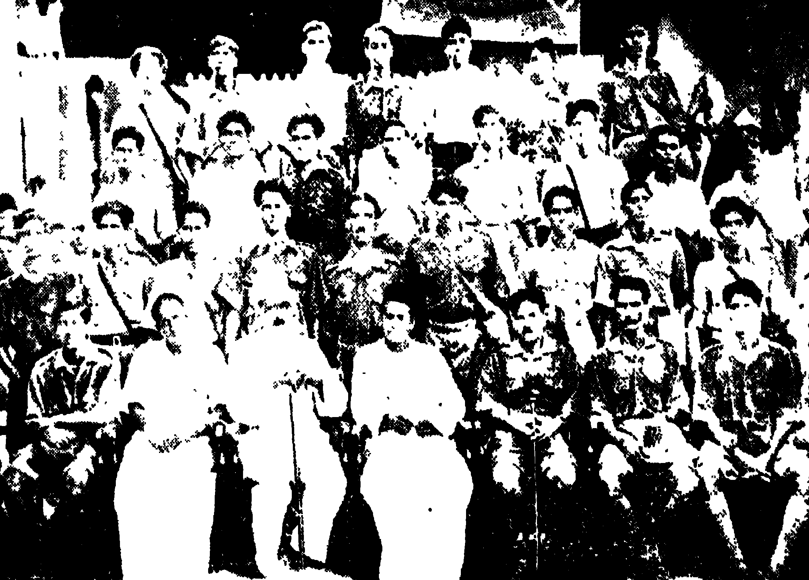

The police force accompanying us increased in number as we
entered Tamil Nadu. This exasperated us. We decided to make
fun of the police. We planned it that very morning. The volunteers
were instructed to scatter on hearing a whistle while marching
and to re-gather at the second whistle. When we reached a spot
surrounded by a thickly wooded area, the whistle was blown. The
police ran helter skelter. One broke his umbrella; another fell
down; a third's trousers slipped down. Confusion everywhere.
The second whistle was blown and all the volunteers returned. The
next day there were still more policemen.

The _jatha_ members were physically exhausted after a month.
Some were unable to walk. Minor illnesses had afflicted them one
by one. This was not surprising. Some 20 miles had to be covered
daily. We would start at 7 o'clock in the morning. At 10 o'clock
we would stop to rest. At 2 we re-started from there, reaching
our destination at 6 o'clock in the evening. A public meeting there
and at 10 o'clock we retired after a meal. The _jatha_ members
showed commendable patience and perseverence. I was able to
invigorate and enthuse them. We carried a bag containing books
for sale and our medicines. Each volunteer had a bag containing
his personal belongings. When the members got tired, there was
no one to carry the common bag. I understood what was wrong
and carried it myself for two days. After that, the others also
helped with it without murmur.

This emphasises the fact that a person who is unable to undergo
the same hardships as his co-workers, if not greater ones, cannot
successfully lead a team. As I had realised this even earlier from
experience, it was not very difficult for me to lead this movement.

One must not command others, but should be willing to work
along with them. Only workers who do this will earn the
goodwill of their co-workers. This should be particularly borne
in mind in public activities.

In some places Congressmen did not cooperate with us.
Workers who had promised to arrange a reception at a place called
Vaniyambadi left the station on the day we arrived. We stayed
in a _choultry_ and had meals brought from a hotel. We led a procession
round the town and held a meeting on the banks of the river.
There was a large gathering. We strongly attacked the un-cooperative
attitude of the Congressmen. In some places we cooked our
own food.

In many ways this march was a great experience. The
accompanying policemen decamped with our clothes on one
occasion! In some places the police carried out a counter-propaganda
programme.

We finally reached Madras. Our idea was to enter the Madras
legislature building. There was a huge reception awaiting us at
Madras. 3,000 people came to receive us. A mighty procession!
The city had not witnessed such a large procession before. About
200 soldiers rode in formation on horseback. We held a public
meeting at Congress House in the evening. This was arranged by
the Tamil Nadu Socialist Party.

We marched to the legislative assembly the next day. The
police intercepted us. As we did not intend to break the law and
go to jail, we returned without entering the Assembly House. We
returned home by train from Madras.

We decided to exploit the impact of this _jatha_, not the least
significant of the hunger marches of history. We had covered
250 miles on foot, held 500 public meetings at which we spoke to
two lakhs of people. 25,000 leaflets were sold and 500 rupees
collected in small change. We decided to send small _jathas_ to all the
_taluks_ of Kerala. Many newly enrolled volunteers participated in
these _jathas_ _Hunger songs_ echoed everywhere.

Bonds for good conduct were demanded of me first and then
of Comrades K. P. Gopalan and Keraleeyan. Cases were registered.
We were convicted. The government not unnaturally
wished to prevent us from participating in the forthcoming legislative
assembly elections. I was sentenced to nine months imprisonment
and sent to Trichinopoly. This was my fourth term of
imprisonment. Although a _class B_ prisoner, I suffered greatly
this time. Solitary confinement for the entire term of eight months.
I was confined in a mini-jail inside the jail proper. This mini-jail
had its own walls. There was nobody there except the warden
and myself. I suffered a lot, and waged a long struggle with the jail
authorities. This time, I read much and made notes. I was also
able to review my past work.

I pondered over my resignation from the Party and its consequences
for the Party and myself. I reflected on how far it had
been used by Party enemies and how far we ourselves had been
responsible. I reflected also on the pitfalls likely to be faced by a party
which had no proper political orientation and organisational base.
I learned a few things from this. Coming as I did from the middle
class I was subject to the class traits of false pride, self-conceit and
desire for power. I realised that one can never become a revolutionary
unless these traits are completely obliterated from one's
character. I felt that the structure of the Socialist Party was not
suitable for this. I cast my eyes towards Marxism and towards
the Marxist party. I decided to join it.

I was in touch with election news through newspapers. The
slogan _Vote in Yellow Box_ was heard everywhere. Congress
propaganda meetings were held all over the country. The Congress
won a huge majority in the election and formed a ministry. Raman
Menon became the Minister in charge of Jails. The jail authorities.
changed their attitude towards me. Eventually I was released a
month before my term expired. I felt proud to be released when
the Congress was in power. The Party welcomed me. I rejoined
it in shame and sorrow over the mistake that I had earlier committed.
I decided to work to strengthen the Party in such a
manner as to obliterate all traces of this dark chapter in my
relations with it.

# Chapter 9

With the Congress coming into power, there was general enthusiasm
and zeal throughout the country. Even those who had hitherto
been enemies of the Congress pretended to be Congressmen.
Government officials who had vied with each other in oppressing
and suppressing the Congress donned _khaddar_. The attitude
of the police also changed. They sometimes even came forward
to enquire into complaints by Congress committees.

Although the powers of the Congress executive were limited,
it wanted to do something for the people. The Agriculturists
Relief Act was passed at this time. Sufficient civil liberty was
allowed to the people initially.

Congress activities in Kerala were very intense at the time.
Socialists and those sympathetic to Socialism constituted a majority
in the Congress Committee. Comrade EMS was elected Congress
Secretary. The programme of the Socialists was to bring home to
the masses the declared aims of the Congress, implement the
decisions of the Congress and to stress the revolutionary aspects of
those decisions and to orient Congress activities accordingly.

The Congress in Kerala started becoming organisationally
strong. A properly functioning office, primary committees keeping
the lower units well instructed, proper liaison between state and
local committees, keeping them supplied with programmes of work
from time to time, maintaining proper accounts, keeping records—
the Congress had all these at this time. Not only the state committee
but even local committees started functioning efficiently.
Very many new primary committees were formed. Actually, 500
new primary committees were formed. And these were not merely
paper committees. They were committees that really functioned.

What was even more important, a strong volunteer force was
also set up. A KPCC training camp was held at Thikkodi. Its
Commander was Comrade Chandroth. Camps were also held at
Ponnyam, Chowghat, Valluvanad, Calicut and other places. A
total of 500 people, including officers, were trained. There were
in addition peasant volunteer forces and worker volunteer
forces.

The KPCC held a summer school at Mankada Pallipuram.
The camp lasted for about a month. 100 students were given
instruction. Such a school was unprecedented in the political
history of Kerala. Instruction was imparted in history, elementary
economics, philosophy and politics. Afterwards, the inmates of
the school dispersed to their various places of residence and attended
classes there.

The Congress thus became an organised force. Holding
political classes, giving training to volunteers, getting the feel of the
needs of the people and doing whatever was possible for the people
and explaining the programme of activities of the day through
public meetings. The Congress was transformed in this manner
into a mass movement. The Congress Socialist Party can deservedly
take pride that it was able to strengthen the Congress and turn it
into a mass organisation.

To take part in conferences, and in local agitations and peasant
campaigns and to assist these—this was my work schedule. My
main work was to organise agitations. A mighty awakening against
imperialism, official overlordship, feudalist repression from the
landed and capitalist intimidation was created among the people.
I was able to instruct party workers themselves on how to face the
problems of their region and how to conduct agitations. It was
usual for me to participate daily either in a Congress meeting or a
peasant meeting or a workers' meeting. I think, of all party workers
in Kerala, I am the one who has inflicted myself most on the people
through speeches! Perhaps it was in retribution for this that I
subsequently had to spend many years in solitary confinement in
jail without being able even to see the people.

No feudalism or capitalism or bureaucracy can survive against
an organised mass struggle. Karakkattidathil Nayanar tried to
destroy the peasant movement by intimidation when it was first
started. Some of the peasants were scared and others were in
disarray. A peasant meeting was held at a place called Ellerinji.
The peasants were briefed on the strength of unity. Such knowledge
put them into high spirits. Even those who had kept themselves
away so far started drawing near to the movement. Nayanar
realised this. He offered to mediate. He decided to agree to some
of the demands of the peasants and to make peace with them.
We had known many such experiences in our work. Such
achievements were the basis on which we built the peasant-worker
movement and the anti-imperialist movement.

While organising this agitation, I was able to come into contact
with people in every nook and corner of Kerala, and could sense
the tremendous difference between 1932 and 1938, both in participation
and enthusiasm.

I went to preside over the Payyannoor political conference.
I saw something there that impressed me deeply. The peasants of
Kandoth who in 1931 had attacked me and Comrade Keraleeyan
arrived for the meeting shouting slogans like _Victory to Congress_,
_Let imperialism be damned_ and _Let landlordism be damned_.
I realised how far the Socialist Party had made the common people
nationalist-minded. That group did not disperse after the meeting.
Some elderly people came forward and started speaking sadly with
heads bowed down. _We have realised how bad it was on our
part to have beaten you and Keraleeyan who were ready to work
and die for us and who are our own. Do not nurture ill-will towards
us. Forget and forgive. We have set up a peasant union. We
are willing to act according to your instructions._ Some started
weeping at this. I too was moved. The Congress was theirs that
day; it struggled for them; it strove to improve their very way of
life. They felt that they too were Congressmen. I consoled them
by saying that it would take some years for the class characteristics
of the Congress to be understood. One could not expect it to
happen overnight.

Irikkoor in Chirakkal _taluk_ is a Muslim centre. Until the
birth of the peasant movement, the Muslims there would never
allow Congress meetings to be held. It was they themselves who
came forward to hold meetings on this occasion. An incident
occurred one day while I was walking from Irikkoor to Iritty. While
I was walking up the road, a Muslim trading by the roadside ran
up to me and insisted that I spend some time in his shop. He
treated me to tea and said, _Because of your activities we can live
as human beings now. God will protect you, surely. Normally,
200 rupees have to be paid to the landlord in a year as rent and
other dues. Provisions have to be bought on credit. But there
is nothing to pay with; so whatever there is in the shop has to be
surrendered. Money too has to be borrowed. This year he very
rarely comes here. Poor people like me are much relieved. Enroll
me in the Congress and Sangham. I shall pay. May Allah protect
you._ I replied that he could join after meeting the local workers.
The common people trust and respect those who work for the poor
and any movement that is beneficial to them. But one must act
as one preaches and enunciate a programme of action when one
speaks.

To join the Congress became honourable. The people realised
the strength of organisation. The notion that British imperialism
was indestructible gave way. More and more the people began
to think that if they joined together, the police and army couldn't
stand in their way. Along with this, 'Sunday Congressmen' and
those who had infiltrated into the Congress merely to get jobs also
found a place in the Party. Congress candidates were successful in
elections to district boards, municipalities and other bodies. The
peasants and workers not only voted for Congress but also played
a considerable role in election propaganda. K. Kelappan was
elected President of the Malabar District Board. All the municipalities
in Malabar were captured by Congressmen.

Peasants and workers contributed most to the success of
Congress candidates in the elections. The peasants had hoped
that with the Congress forming a ministry, some of their hardships
would be mitigated and legislation would be framed for that purpose.
But experience belied their expectations. After a brief
period of respite police atrocities continued as before. The so-called
punitive police was introduced. Realising or not realising
that feudal interests and officialdom were jointly trying to smother
the growing mass movement, the Ministry gave more importance
to the opinion of officials than to the supplications of the people.
The Ministry as a result began to alienate peasants and workers
who realised that their disabilities would end only with the strengthening
of their own organisation and the establishment of people's
rule. _Vote in the yellow box and suffer like this,_ the enemies
of the Congress taunted.

It was a time of intense rivalry and bad blood between socialist
and non-socialist Congressmen. A section of Congressmen were
alarmed when they saw the Congress daily gaining in strength, thanks
to the Socialist Party and its activities. They feared that the
Congress would be captured by Socialists. A committee called
the Congress Gandhi Sangham was formed to campaign against
this. K. Kelappan was its President and K. A. Damodara Menon
Secretary. They campaigned in the name of _ahimsa_. They spread
rumours which pilloried socialists. Disturbances were organised
to upset Congress elections and ballot boxes were cordoned off.
Notices and leaflets against Socialists were circulated. Congress
leaders like Samuel Aron were bold enough to oppose Socialists
publicly and boycott KPCC meetings. They did not bother about
whether or not the Congress was becoming stronger as a result of
the Socialist Party's activities or whether the Congress programme
was attractive enough to enlist the people's sympathies for the
coming struggle. To oppose anything done by socialists and not
to cooperate with them became their obsession. Personal rivalry
soon assumed grotesque forms. Even leaders like Kelappan
started viewing me with suspicion despite the fact that I had worked
as his right hand man in the past. In a statement after retiring as
District Board President, he said even those who had worked
intimately with him during the temple entry agitation had begun to
spread rumours about him.

Finally this coterie of Congressmen started making fun of
the United Front. They claimed that the United Front was
incapable of functioning. In a word, it was a pocket edition of
what happened in 1944. The only thing that they did not say was
that we were accepting bribes from the government.

By 1939, the Congress Committee was entirely boycotted. The
rightist Congress leaders even tried to field their own candidates
and defeat the candidates of the KPCC at the second District Board
election. They did not even think of the necessity of mobilising
the people for the coming struggles against imperialism, war and
federation. Their main concern was not the achievement of freedom
but repression of Socialists. Anti-communism that was to
blossom in 1944 took root at this time. Instead of collaborating
with the newly emerging forces in the Congress, the Gandhian
Congress leadership was eager to oppose those forces as far as this
lay in its power. Instead of organising and strengthening the daily
struggles of the people for their immediate demands, they opposed
and wrecked those struggles. They failed to see how badly it was
affecting the progress of the nationalist movement.

Since 1921, no effective Congress activities had been organised
in any part of Eranad _taluk_ except Ramanattukara. It was only
when the Congress was in power that Congress activity was restarted
in Eranad. Political conferences and public meetings, enrollment
of Congress members, formation of a peasants' union—I worked in
these fields in Eranad _taluk_ for about three months along with
Congress President, Janab Abdul Rahiman Sahib. This helped
bring about a considerable awakening there. On one occasion
I was invited to preside at the first public meeting held in Tirurangadi.
I arrived late. A crowd larger than any normal audience
was waiting some distance away from the site of the meeting.
_They are out to bring danger and firing again. This cursed
flag is a nuisance. They should be driven away._ This is an
example of what they said.

I spoke for four hours. I explained the current position of
peasants and what they could gain if they organised themselves
to mitigate their hardships. I spoke of the history of the Congress.
I dealt with the hardships of Muslim peasants. I strongly attacked
official domination. Those who stood apart came near and started
listening with interest. When the meeting ended, some aged
Muslims approached me and said, _One meeting is not enough,
there should be another grand meeting. We shall invite all. Our
Abdul Rahiman Sahib should also attend._ Another grand meeting
was held soon after. Our opponents were silenced.

A _jatha_ had started out under the leadership of Appakoya
and Yusuf with the object of removing Hitchcock's Memorial. It
was called the Hitchcock Memorial Removal _Jatha_. I toured
various parts of Eranad with this _jatha_, and was thus able to make
the acquaintance of our Muslim brothers there. It was at this
time that I was able to strengthen my ties with Abdul Rahiman,
Moidu Moulvi and others. My association with Abdul Rahiman
helped to an extent in turning me into a seasoned agitator.

It was at this time too that the student movement in Kerala
came into its own. Young students were conscious of their role
in shaping the future social structure and in understanding what
was happening around them after the elections. They felt that
they should play an active role. Thousands of students were
coming out every year from universities with degrees. They were
doomed to languish without jobs. The educational system was a
tool for the perpetration of slavery. Both the method of instruction
and the syllabus were attuned to that. Students were not
supposed to study and reflect on the political happenings around
them. They had to be content with old-fashioned text-books that
taught them irrelevant tales about Clive and others. Such a
situation exists even today. In the name of discipline, teachers
had the right to thrash students, to send them out of class and to expel
them from the university. They were not even allowed to organise
themselves to fight for their rights. It was only natural that students
too felt the urge for solidarity when they saw peasants and workers
around them coming forward in organised strength and when they
saw the Indian National Congress waging struggles against foreign
domination.

Students started agitating against unjust suspension and repressive
measures like imposition of fines for participating in political
agitations. The first student union was set up at the Brennen
College, Tellicherry, following an agitation over the expulsion of a
student. When I went to Tellicherry one day, some of the Muslim
students there met and briefed me. A meeting of students was
held that evening at the college campus. The Principal tried to
prevent the meeting being held there. As the Chairman of the
meeting, I did not pay heed to that order. It was decided to go
on strike if the expelled student was not taken back the next day.
The students did not pay heed when the bell rang. The matter
was settled after a talk with the Principal.

After that, the students strengthened their organisation. An
office was opened and a conference scheduled. The conference
was held under Comrade Batliwala's presidentship. On a warrant
from the Madras Ministry, he was arrested at the end of the
conference. I learned later that initially the order was to arrest
both me and Batliwala and that this was withdrawn hastily at the
insistence of Raman Menon and M. P. Damodaran. This incident
led to a stir among students everywhere in Kerala. Campaigning
in villages during vacation-time, circulation of manuscript magazines,
conducting competitions and summer schools were some of
the activities that students were busy with.

Student strikes followed in Badagara and Chirakkal. In both
places, I worked along with students to lead the strikes and later to
restore normalcy. There was also an agitation against the fining
of a student of Payyannoor school. The student started a hunger
strike in front of the school. The peasants of Payyannoor and
surrounding areas joined this agitation. The hunger strike was
finally abandoned after mediation by the Divisional Officer. I
thus worked to provide effective leadership to student agitations
erupting all too suddenly and to organise unions on the basis of
those agitations and to assist them.

Congress leaders were very angry over these happenings. They
began complaining that students were being misled; that they
should not participate in politics and that _hartals_ and strikes were
a cheap imitation of the ways of workers and peasants. _Mathrubhoomi_
published editorials in this vein. But consider what happened
later. The same Congress leaders who had criticised the
activities we had helped the students to organise at this time, later
on had the gumption to call on them to organise and participate in
_hartals_ and strikes. It should be particularly remembered that
those who insisted that the red flag should not be displayed changed
their attitude later on to allow this symbol of class organisation to
fly alongside the national flag.

It was at this juncture that the teachers' movement took on
an anti-imperialist stance and developed into a mass organisation
that took all teachers of Kerala under its umbrella. It must not
he forgotten that elementary school teachers have played a considerable
role in Kerala's political history. Not only have they
organised themselves, but they have also organised peasants and
students. It can be stated with pride that the teachers' organisation
of Malabar is a model for all Indian teachers' organisations. It
was this organisation that freed teachers from the slavery of
Managers and education department officials and made them strong
enough to speak out for their rights. They conducted _hartals_ and
agitations throughout Malabar on September 26, 1939. I presided
over the first conference of radical teachers held at Pinarayi in
1935. I was thus able to participate in teachers' conferences and
study their problems.

I was able at this time to go home for two days rest. Not
feeling like idling, I decided to visit some elementary schools in
the vicinity. Teachers in most of the schools had been my students.
I wrote in the Visitors' Books my assessment of condition of the
Schools. I also recorded my opinion that the schools were conducted
merely as business concerns. I also wrote an article in
_Mathrubhoomi_ on these lines under the caption _School Business_.
A week later, the Education Director ordered the Deputy Inspector
to investigate the matter. The Deputy Inspector met me. The
department enquired into the article and reduced the grant to the
schools. Teachers of the _taluk_ were very careful after this. Some
were no less afraid of me than of the Deputy Inspector.

After the formation of the Congress Ministry, there was a
new hope and zeal, life and organisational awareness among
peasants and workers. After the strikes of Truvannore and Feroke
in 1935, new worker unions were formed all over Kerala. Even
the least advanced workers formed unions and placed their urgent
demands before the government and employers. Soap workers,
fishing workers, _beedi_ workers, stone workers, municipal workers—
all types of workers began to organise themselves. They
conducted struggles against retrenchment at will and for recognition
of unions. The capitalists' scoldings and kicks and blows came
to be a thing of the past. Thus, struggles abounded during the
Congress Ministry's term in power.

The Commonwealth Tile Factory workers at Calicut struck
work at this time. Although the Labour Minister, V. V. Giri,
summoned the British Manager and discussed the problem with
him, the Manager did not submit to the Minister's truce formula.
The police maltreated the workers during the strike and Comrade
Krishna Pillai was charged with creating public nuisance.

_Beedi_ workers struck work at Tellicherry, Cannanore and
neighbouring places. These strikes were very well organised. An
interesting incident occurred during the Tellicherry strike. It was
a time when peasant unions were growing in suburban areas like
Pinarayi and Eranjoli. At a meeting at Eranjoli, I requested
peasants to help the striking workers. I said it was the duty of
peasants to help workers. There was a public meeting at the
Tellicherry beach the next day. Peasants came for that meeting
in large processions from Pinarayi, Eranjoli and other places. They
had brought with them jack fruit, mangoes, coconuts and green
bananas. A dozen emaciated old men led the procession leaning
on sticks. The fruit brought by the peasants was heaped up at the
beach. At the end of my speech, an old man got up and said
almost weeping, _As long as we are alive, these worker-boys don't
have to fear. We shall provide them their food._ There were
more joint demonstrations of peasants and workers here. Peasants
started helping workers when they were on strike and vice versa.
A new peasant-worker relationship developed.

The Cannanore _beedi_ workers' strike too was long drawn out.
Besides the general opposition of capitalists, there was also opposition
from Congress leaders like Samuel Aron. The employers
felt that they should crush the strike in their own interests. But
the strike was carried on because of the class feeling and organisational
strength of the brave _beedi_ workers of Cannanore. There
was finally a settlement and the strike was withdrawn. This strike
inspired all the families of workers. One day during the strike,
the mother of a worker wanted to see me. I went to see her at her
house. She said: _My son went to the company yesterday
after so many days strike. He was one with his colleagues till now.
But he has now betrayed them. I said I would starve myself and
give him money for meals and incidental expenses. Still, he did
not pay heed. I am not educated. I can neither read nor write.
But still I know that nothing can be achieved without union. Look
at the capitalists. Even old enemies have joined together now.
Our boys do not have even that much intelligence._ I was
amazed by the class feeling and intelligence of this old woman.

Afterwards, the weaving workers of Kakkad, Chovva and
Azheekode joined together and went on strike. They struck on
two occasions. On the first occasion the strike was withdrawn
after a few days when some of the urgent demands of the workers
were conceded. After that, the weaving company owners joined
together and broke the conditions of the settlement one by one and
forced another strike. This strike was very prolonged. Workers
stood firm. Some capitalists even filed law suits against them. A
settlement was finally arrived at when some minor demands were
accepted by the management.

I had thus to participate in numerous strikes and give leadership
to them. I had occasion to participate in all the strikes that
occurred in Kerala at that time. The moment a strike was known
to have begun, I would rush there. When the strike ended, I
moved to another place. To raise strike funds, to enroll volunteers,
to detail work to them, to check up on it, to address public meetings,
to intercept blacklegs going to work, to reason with them, to contact
local people, to gain their help for the strike—this is what I
was doing. I starved for want of time to eat food that was available,
starved also for want of food to eat. I worked day and night,
starving for one reason or another. Many nights went without
sleep. But I had a special fondness for and interest in participating
in these struggles. I could learn well from experience the condition
of workers, the capitalist tie-up that emerged against their
struggle and the change of colour of the middle classes. I learned
how capitalists use workers devoid of class feeling to create a
schism in their own ranks. I could see how the unemployed turn
into a reserve force of employers. I saw not only workers but
their families coming forward imbued with class feeling. I could
see for myself the way workers who toil day and night live. Once
while out walking at 1 o'clock at night an old woman ran up and
invited us to her hut and treated us to sugar water. She knew
that we were participating in the strike. _I will not send my son
to the company unless you tell me to. If all these workers join
together, the capitalist will have to accept their demands. Have
we not learned this? If the workers do not work, how can the
capitalist make a profit? He will have to starve. Our salvation
lies in our unity._ Those were her words. This old woman had
discovered from experience the theories of Stalin, Lenin and Marx.

As these struggles intensified, the Congress Ministry came out
in its true colours. The firing at Chirala, the government's attitude
to the Cawnpore strike, the government's policy towards the strikes
in Kerala—all these affected the workers' faith in the Congress.
They realised that workers would get full relief only if they themselves
governed.

The Demand Declaration Day observed on September 18,
1937 at Calicut, Cannanore and Tellicherry is unforgettable in the
history of the worker movement in Kerala. Workers held rallies
in each place in crowds of ten and twenty thousand. A special
feature of these was that all sections of workers participated in
the demonstrations. They declared that they were ready to
organise and if necessary to conduct struggles for their just demands.
They let it be known that they were ready to play their part in the
Indian freedom movement. Workers who had lived before as
slaves of fate and destiny came forward to unite. They were not
frightened by the capitalist-police bullies. Capitalists and police
authorities realised that their hey-day was over and that they
could no longer have their will unchallenged.

A mighty awakening and union feeling was observed among
peasants. They were even prepared to combat unjust oppression
by landlords and the ruling classes. The feeling grew among them
that nothing was impossible of achievement through peasant unions
and a unity based on class feeling. This new awakening prompted
them to protest openly against the repression that they had suffered
and continued to suffer.

A peasant conference was held at a place called Padiyoor near
Iritty. I was President of the Conference. Landlords and the
police got ready to prevent it. The ASP., Circle Inspector
and some policemen were there in advance. They came to the
meeting and said that the owner of the site was not agreeable to
the meeting being held there. I told them that I would see to all
that and that it was not right for the police to interfere unnecessarily
in this matter.

The peasants were in high spirits. Their fear disappeared.
A member of a large landlord family of the locality one day sent
somebody to fetch the daughter of a peasant living on his land.
The peasant said that she had eye sickness. The landlord replied:
_Eye is not what is wanted. Therefore, ask her to come._ They
had to submit to the landlord's order. After a few days, her eyes
became very sore and she lost her sight. When I asked whether
this was not true, the peasant who was her father replied: _Yes,
she is my daughter._ Thus, peasants started openly attacking
landlords' oppression.

The peasant movement came into its own in Blathur, Padityoor,
Ellerinji and other eastern regions of Chirakkal _taluk_, in Iritti,
Kannavam and Mattanoor in Kottayam _taluk_ and in Kuttyadi
and other places in Kurumbranad. It was through struggles against
_Vasi_ and _Nuri_ extortion that the movement grew in Chirakkal
_taluk_. Regional groups were formed. Membership increased. The
people started ostracising those who did not join the peasants'
union. They were emboldened by the thought that the union and
union leaders were there to help them and to lead their struggles.

Their first objective was to take processions to landlords and
officials with a list of their urgent demands. Mighty _jathas_ started
out to meet the landlords in every region, including the Chirakkal
prince and the Nayanar of Ellerinji. The entire peasantry in each
region participated in these _jathas_. Some landlords conceded the
immediate demands of the peasants. These minor reliefs instilled
self-confidence among the peasantry. The feeling grew that with
union everything was possible. They started fearlessly opposing
those who stood against their unions and demands. Peasants who
used to tremble before started saying to me, _Policemen are like
grass to us. We can trample them underfoot._ They used to
refer to the punitive police organised by the ministry as _Poonatile
police_. They were ready to suffer any oppression. They believed
that their unions would save them.

December 18, 1938 opened a new chapter in the history of the
Kerala peasantry. Under the leadership of Chandroth and E. P.
Gopalan, two _jathas_ consisting of 500 persons each started from
Karivellore in the south and Kanjikode in the north to apprise the
Collector of their minimum demands. These _jathas_ were different
from other ones. They consisted of regular peasant activists
elected by each local unit. Many had not seen Calicut before.
There were also many elderly people. A thousand red-clad peasants
arrived at Chevayoor on the morning of the 18th. A meeting
was held under my presidency. Kozhippurathu Madhava Menon
inaugurated the meeting.

At the end of the meeting, the _jatha_ left for the town. Uniformed
volunteers from Cannanore, Tellicherry and Calicut came in a
procession to the town to receive them. Both joined together and
marched to the beach in a massive procession and held a _Kisan-Mazdoor
rally._ This rally generated the greatest enthusiasm.
The peasant patriarch K. Koran inspired everyone by his speech.
The peasants were encouraged to work all the more.

After this meeting, government officials and landlords joined
to suppress the budding peasant movement. At about the same
time, the peasants of Kasaragod went to Mangalore under the
leadership of Subramanyan Thirumumpu and presented a
memorandum to the Collector. Unlike the Malabar Collector,
the Mangalore Collector met the _jatha_.

Both the landlords and officials realised that their future would
be in peril unless this movement was crushed rapidly. They sent
bogus reports. The Congress ministry took them all at face value.
Punitive police were posted to the interior; new police stations were
opened. The police started brow-beating the peasant union
workers. Peasants were arrested in large numbers and beaten up
on charges of rape, stealing timber from the forest, assault and
dacoity. 151 people were implicated in 17 places in Chirakkal
_taluk_ alone.

The Blathur office of the peasants union was set afire. At
Peravamparamb, grass taken on lease by some peasants for thatching
purposes was set afire at night and reduced to ashes. Barbarism
like stoning of the houses of peasants, defecating in their
wells, chasing their womenfolk in the nude were indulged in. The
atrocities of the police and the rowdies set loose by landlords reached
new heights. Landlordism and bureaucracy started a death dance.
But none of these was able to alter the peasant's determination to
fight for his rights. They contested the cases. Defence committees
were formed. Funds were collected from the people. Workers
helped them.

I was able to participate in these peasant struggles and
instill confidence and courage in a small section of the peasants
that had no class feeling. I strongly criticised the repressions of
the police. Peasant conferences and special meetings were held.
Peasants have a special trait. If there is somebody to guide
them, they are ready for anything. It was therefore necessary to
visit each locality repeatedly to arouse them. I was able to do this
well.

Bharatheeyan was sentenced to six months imprisonment at
the time on a charge of incitement to violence. A case was
made out against me too and I was summoned. But as I left
India, the case could not be pursued. There was another case for
contempt of court. This was conducted ex-parte and a sentence of
two months imprisonment was passed.

Until 1938 I worked among peasants and workers and participated
in their struggles and was able to learn more and more about
them and their problems. I noted the pitiable conditions of
peasants in the interior. I found that it was quite easy to instil
class consciousness in the poor peasant who offered to the landlord
whatever he had earned from the sweat on his brow. They
do not know the meaning of freedom for they have suffered persecution
for centuries together. When through united action they
found mitigation of their misery they found a new self-respect and
no longer cringed before their oppressors.

Big public meetings were held at Kodakkat and Blathur during
the tour of Professor Ranga who was President of All-India Kisan
Sabha. 15,000 peasants attended at Kodakkat and 10,000 at
Blathur. There were many peasant women at the meeting at
Blathur. I announced that a struggle might be necessary to get
firewood and bark (of trees) from the forest. They gave assurance
that thcy were ready for the struggle. Asked whether they were
prepared to go to jail, they replied as one man in the affirmative
There was thus a change in the attitude of the families of peasants.

Their children formed boys associations. These associations
came into their own in the northern _taluks_. Peasants and their
womenfolk started joining peasants' unions and working for them.

As in the case of workers' struggles, I was able to learn much
from peasants' struggles too. I felt the necessity of doing something,
not only in economic matters, but in the cultural sphere also.
Night schools and reading rooms were started. The union was
able to curb the drinking habit among them. A start was made
in publishing books that the peasants could understand.

Comrade K. Damodaran's play _Rent Arrears_ was also very
useful in mobilising peasants and in bringing them together. It
was at that time that I realised the importance of cultural programmes.
_Rent Arrears_ was staged wherever peasant conferences
were held. Damodaran, KPR Gopalan, Perachutti, P. Sekharan
and others were in the cast. I myself acted in it.

# Chapter 10

The agitation for responsible government of the princely states
was the most important movement that emerged from the Indian
nationalist movement in 1937-38. The 10 crore people of the
princely states entered the political arena and started fighting for
civil liberties and responsible government.

Agitations on a small scale were started in many princely
states. On April 28, 1938, 32 people died and 42 sustained injuries
in police firing in the village of Viddoraswatham in the Kolar district
of Mysore. Their struggle was for freedom to unfurl the
national flag and for freedom of speech. The subjects of the
princely states were also motivated by the Rajkot struggle which
had repercussions throughout India.

The Travancore struggle is so glorious that it should be
recorded in golden letters in the history of the Indian freedom
struggle. The principal reason for this was the role played by
workers and students who constituted the main revolutionary
forces in this struggle and their readiness to undergo sacrifices. I
was a witness to the role of these two revolutionary forces in the
struggle as I had occasion to participate in the strike of the workers
of Alleppey and to meet college students of Alwaye and Kottayam
at the time the _jatha_ was organised.

Everywhere in Travancore, there was discontent and misery.
The condition of workers was most unhappy. They had neither
the freedom to come together nor the facilities required for redressing
their grievances. As far as peasants were concerned, their
backs had already been broken by maltreatment from officials,
the slump in the prices of coir products and heavy taxation. The
government was unable to satisfy even community interests which
laid claims on offices and representation. Moreover, the merchant-capitalist
class were furious over the nationalised economic enterprises,
transport, electrification, etc., which they wanted to control
themselves. A large section of the monied classes felt that the
collapse of the Travancore National and Quilon Bank was speeded
up by the government. This prompted those representing banking
interests to wage an open war against the government. Discontent,
economic and political conflict—all the ingredients of a
revolutionary situation existed.

The reform movement for justice to all communities and for
termination of the monopoly enjoyed by some communities in the
civil service marked a new chapter in the political history of
Travancore. The government tried to repress this movement.
But the snow-balling discontent, the world-wide economic depression,
increased bureaucratic domination and the headway made
by Congress in British India—all these created circumstances
favourable for a concerted drive for responsible government. It
led to the creation of a mass organisation encompassing the entire
people of Travancore. They formed themselves under the banner
of the State Congress.

The KPCC agitation began on August 28, 1938. The activity
of the Youth League had spurred this agitation. Comrade N. C.
Sekhar defied section 144 IPC and courted arrest. K. Damodaran,
Sreedharan and other youth leaguers were arrested. The State
Congress got ready for defiance of the law.

Students were in the vanguard of the agitation. A witchhunt
for student-activists was launched in Trivandrum on July 15.
There was firing at the beach on September 21, and on August 31
at Neyyatinkara and then again at Quilon on September 2. At
Chengannur there was very heavy firing and a _lathi charge_.

Ruffians were set loose to create disorder in public meetings.
The government started many new organisations in opposition to
the Kerala Congress. Ruffians were commissioned to hunt out
Kerala Congress leaders. Their houses were burgled and other
atrocities perpetrated there. Atrocities of a kind not witnessed
anywhere else in India, whether British or native, were perpetrated.
Firing became the order of the day.

The Travancore struggle was not a local struggle but part of
an All-India struggle. Nationally, it was a struggle against British
imperialism. It was the forerunner of the struggle against federation
by the subjects of the princely states. Congressmen realised
this.

The Kerala Congress Committee set up a sub-committee to
help the Travancore struggle, and conducted a propaganda campaign
for it. The Working Committee of the Congress Socialist
Party met and decided that party workers should participate
actively in the struggle. It was decided to send a _jatha_ on foot to
Travancore. I was designated its leader. My appointment
received the approval of the sub-committee. The repressions taking
place in Travancore infuriated me. I yearned to struggle against
the bureaucratic hunt going on there. The party decision satisfied me.

A huge public meeting was held at the Calicut beach on September
9, 1938 to see off the Travancore _jatha_. It was a vast
meeting consisting of Congressmen and others, workers and
students. It was a model of the united front against imperialism.
Kozhippurathu Madhava Menon, V. R. Nayanar, K. A. Damodara
Menon, KPCC President Abdul Rahiman and Municipal Chairman
U. Gopala Menon attended the meeting.

It was the fourth _jatha_ under my leadership. It could be
safely said that I was one of the creators of the _jatha_ idea. Unlike
other _jathas_, there were only very few experienced agitators in this
one. Most of its members were youngsters who wanted to
participate in the coming freedom struggle. They were up to
anything. Many were later to become leading workers of the
Communist Party. They played a considerable part in the Travancore
struggle. Several Congress youths were also there in the
_jatha_.

Marches, singing and distribution of leaflets proceeded apace
as in other _jathas_. The _jatha_ got big receptions on the way. The
ovation of the Muslims of Eranad was particularly noteworthy.
There were large receptions by Congress committees and
peasant unions at Cheruvannore, Ramanattukara, Pulikkal,
Kondotti, Nediyiruppu, Manjeri, Malappuram, Ramapuram,
Perinthalmanna, Thootha, Cherpulacherry and Ottappalam.

We reached Ernakulam on September 16 via Shoranur,
Wadakancherry and Trichur. People of various organisations and
of all communities participated in the public meeting at Trichur.
Eight volunteers joined the _jatha_ at Trichur. At Ernakulam, we
were joined by a group that had come from Mangalore under the
leadership of Comrade Kamath.

Ernakulam gave us a grand reception. College students, men
as well as women, joined the reception — a crowd of some 20,000
people. Comrade Punnose, who was then a Kerala Congress
leader and who was later to become a Communist leader of Travancore,
enthused everyone with his speech. This was my first meeting
with Comrade Punnose. I was invited to the college girls'
hostel after the meeting. The Travancorean and non-Travancorean
girls presented us with a purse.

We left for Alwaye on September 19 by the morning train. I
informed my colleagues that very intense repression would be
unleashed at Alwaye and that everyone should be prepared for this.
I reminded them that atrocities and firing were in the offing, and
added that those who were not prepared to face these dismal prospects
could help further the struggle in some other way. But all
showed great mental daring and firmness. Everyone wanted an
opportunity to die for the cause in the event of firing.

An unforgettable reception awaited us when the train reached
Alwaye. The whole place echoed with cries of _Malabar _jatha_ ki
jai_ and _State Congress ki jai_. The platform was filled with welcoming
people. There was nothing but human heads to be seen
in the vicinity of the station. A sea of mankind. Old and young,
capitalists, workers and peasants, women as well as men
were all assembled together. The entire student body of the Alwaye
colleges had awaited us since the previous day. A large section of
the students of an Ernakulam college had accompanied us in the
train.

Heavy rains—water rushing into the river down the mountain
valleys. Everything on the way was inundated by the rushing
waters. I felt as though it was a tributory of the Alwaye river
near the station—a river receiving onrushing water from all four
quarters, and overflowing its banks in its turbulent course. What
enthusiasm! What ardour! What courage! Firings were a
daily event. People were dying like flies. The army was out in
the streets. I was thrilled by the courage of the vast populace that
had come to welcome the volunteers from Malabar without the
slightest worry about what was happening and what might happen.
Completely unconcerned about the guns and _lathis_ of the army
and the reserve police, they seemed to say, _Your firing is like grass,
grass to us, to be trampled underfoot._ Forgetting myself for a
moment, I shouted _State Congress ki jai_, _Travancore people
ki jai_. I was certain that a thousand CP's (C. P. Ramaswami
Iyer) could not suppress this mass of humanity. Young students,
men as well as women, adolescents blossoming into life (who
had barely experienced life), who were ready to die for their
country. They did not want to study or live under this shameless
autocratic regime. Responsible government or death. That was the
chant of these youthful agitators. A spectacle that would have
electrified anybody with a human heart or a pulsating body.

On the other side were reserve police, army men, ordinary
police, inspectors, DSP and all. The whole Travancore boundary
was filled with police, troops and police vans. All the paraphernalia
calculated to smother civil liberties was there.

I have participated in struggles in British India and have led
strikes and agitations of mammoth proportions. But the enthusiasm,
courage and general disposition towards agitation that
I saw on that day was something that I had never seen before. I
yearned for an opportunity to die a victim to the police firing. I
believed that my death in this vast stir—in this upsurge of the brave
Travancore people fighting for responsible government—would
serve a purpose. I felt an urge to die. The like readiness of the
youthful students and the brave workers made me all the more
enthusiastic. I was not sure that that crowd, which yearned to
welcome the Malabar comrades who had arrived to participate in
their struggle, would keep quiet in the event of police atrocities
against us.

During a tussle with volunteers and the police, I found a hefty
Christian priest emerging from the crowd, remonstrating with an
Inspector who had chased a volunteer, and grabbing hold of him.
I thought something untoward would happen. I ran to the scene.
The priest was telling the Inspector: Do not touch them, sir.
You may shoot us if you like. No objection. Do anything you
like. If you touch these people who have come from Malabar
to succour us, no one will be left alive here. _Sure._ The Inspector
immediately left. The priest took my hand and kissed it affectionately.
He said: _We have made arrangements in case
someone troubles you. None of them will be left alive._ I understood
what he was saying. I told him that violence was of no use
and individual violence would only hinder the movement. He then
gave his word that nothing untoward would happen. I found this
kind of loyal and helpful disposition among the common people
as well.

Immediately after detraining, we crossed the boundary and
marched into the state. The police intercepted us at the railway
gate. We remained there. I called on the volunteers and told
them to cross the boundary from different directions. They left
in different directions. The police ran after them. Our volunteers
raced and leapt in different directions to elude the police. The
Dewan had ordered that we should not be arrested or manhandled
He knew what the consequences of that would be. Tussles began
between the police and the volunteers. This enthused the people,
but enraged the police.

By 3 o'clock the crowd had increased. I spoke to the crowd
for about three hours. I asked the Alwaye college students whether
they were ready to boycott classes. They replied that they were
ready. This demonstration had raised them to a fever-pitch of
excitement and enthusiasm. I called for funds. 30 rupees was
collected on the spot in small change.

We found that the government was not going to arrest us.
Some volunteers evaded the police and crossed the boundary. They
were arrested. At 8pm the police changed their tactics. They
posted guards. I and other volunteers crossed the boundary. We
were also arrested. The first batch was detained at the Alwaye
lock-up; we were detained at Perumbavoor lock-up.

This maiden _jatha_ constituted a mighty propaganda effort.
It magnetized not only Kerala but other states as well. After we
were arrested, a second _jatha_ set out under the leadership of
Mohammed Yusuf. A third one started from Tellicherry under
Anandan's leadership. A fourth was organised at Palghat. From
Tamil Nadu, a _jatha_ came to Madurai. Freedom-lovers outside
Kerala thus started plunging themselves into the struggle.
Alwaye soon became centre of the agitation College
students started boycotting classes. They set out one by one to
violate the law. Even in Paroor and other places people were
stirred.

The police administration in Travancore was of a special type.
A majority of the policemen had passed out of school or college.
Once they joined the department, human feelings left them.
majority of them were notorious as ruffians. By dint of ill-treating
people and beating the poor, they had lost all qualms about committing
atrocities. To ill-treat somebody was a daily routine for
them, like having meals. It was doubtful if anybody would take
you seriously if you cited the name of a policeman who did not
take bribes. I still remember what one wag said: _Only the
milestone and the direction post are beyond corruption in Travancore._
This was quite true of Travancore. I found it to be quite
common for policemen to arrest passers-by on the roads, drag them
to police stations, beat them and steal their possessions.

An interesting incident occurred while I was in the lock-up.
At noon one day a policeman brought in a 14 year old boy. There
was a tea shop frequented by Constable Krishna Pillai 'Sir'.
'Sir' never used to pay. He used to help the shop-owner, who
was a profiteer, in a variety of ways. Well, these people have to
maintain law and order. They maintain law with guns and _lathis_.
This boy was brought to the station because the owner had complained
that he had pilfered 4 annas. He was subjected to a
thorough physical examination as soon as he was brought in and the
eight annas that he had with him was confiscated. He was pinned to
the wall and beaten. It was an experiment to find out which
policeman would be able to knock his head backwards. Those
profligates started a regular match, with the head of this 14 year
old youth as the ball. He started bleeding from the head. An
aged policeman who walked in called him back and examined him
and contributed his share to the sport! The Travancore police
played mercilessly with human life.

By evening, the human hunt intensified. An incident occurred
while I was in the Vaikom lock-up. A constable looking for the
wherewithal for that day's visit to the tavern met two vessel merchants
and brought them to the station. They had with them the
proceeds of that day's sale and the unsold vessels. Immediately
upon arrival, they were beaten. Then they were allowed to rest
for a while. They were left close to the room where I was confined.
I called them and advised them to leave on the pretext of going to
eat. They were let off for a meal. They left behind two or three
vessels that they had. They never came back. The police started
hunting for them. The vessels were sold after two days and the
proceeds shared by the policemen.

There was no protest at all against police high-handedness.
Constable _Sir_ continued to be a big _Sir_. Afraid of being
beaten, all would cringe before him. I nourished an indescribable
hatred towards the police after this experience.

Life in the confines of the lock-up was agonising. But the
company of Kedamangalam Pappukutty, a writer from Travancore,
Paravoor Balakrishna Pillai, a lawyer, some comrades of Alwaye
and of Chandrasekharan Vaidyar provided some relief.

Finally, the case against us was begun. The Perumbavoor
court was filled with people. All the others said they had nothing
to say when the charge sheet was read out to them. This was not
expected by the police. I decided to expose the misdeeds of the
police. I cross-examined the first witness, Sub-Inspector Chacko:

>I: _What's your name?_
>
>Sub-Inspector: _Chacko_.
>
>I: _Have you ever been punished for accepting a bribe?_

The Sub-Inspector did not reply. He looked at me gravely.

>I: _Mr. Chacko, you must understand that you are a
>witness in the witness box and not a Sub-Inspector commissioned
>to disperse a crowd. I am the accused and you must answer my
>questions._
>
>I addressed the magistrate: _Your honour, if the SubInspector
>does not answer my questions, I don't think there is
>any use taking part in the proceedings._

The magistrate asked the Sub-Inspector to reply to the questions.

>Sub-Inspector: _No, there has been no bribery case against
>me._
>
>I: _You say we shouted slogans and it is an offence.
>What were the slogans?_
>
>Sub-Inspector: _You cried inquilab-zindabad. It is an
>offence._
>
>I: _Do you know what language the slogan is in?_
>
>Sub-Inspector: _That I don't know. I know its meaning
>is Create disturbances_.
>
>I: _What is the charge against us? _
>
>Sub-Inspector: _You entered Travancore violating a
>government order._
>
>I: _Were we shown section 144 IPC prohibiting entry?
>Were our signatures taken on that?_
>
>Sub-Inspector: _The order was not shown. It was in the
>DSP's pocket. It must be known to you._
>
>I: _Are we being punished for keeping the order in the
>DSP's pocket?_
>
>Sub-Inspector: _I have nothing to say to that._
>
>I: _Do you know what responsible government means? _
>
>Sub-Inspector: _I don't know._
>
>I: _Do you know it means a ministry responsible to the
>people elected by MLA's elected by the people under the King?_
> 
>Sub-Inspector: _I have not learnt that. I know that the
>Kerala Congress is a group out to create commotion._
>
>1: _Do you know that self-government is now in existence
>in nine states in British India?_'
>
>Sub-Inspector: _No._
>
>I: _Did we create disorder! Did we turn violent?_
>
>Sub-Inspector: _You did. You made people shout
>_inquilab-zindahad_. You ran here and there. You asked
>students not to go to school. You said taxes should not be paid.
>There was violation of law in Alwaye and its surroundings after
>your arrival._

I cross-examined him like this for about an hour. We contested
the case. We asked the Magistrate not to regard as a crime
against us the charge that we violated section 144 IPC. We thus
used the hearing for political propaganda. As this was the first
development of its kind in Travancore, the people were attracted
to the hearings.

A. M. Kunjikannan, K. T. Madhavan Nair and I were
sentenced to eight months imprisonment. It was decided to take
the others in a truck and release them outside the state borders.
I told those who were not sentenced to go to other places one by
one and participate in the agitation. I learnt later that they did
exactly that.

We were sent that night to the Kottayam lock-up. I sensed
that the cross-examination had enraged the policemen and that we
would have to suffer brutalities. I prepared myself for that.

Kottayam has a small police-station. There were some
Kerala Congress prisoners in one room awaiting trial. We were
locked inside a small and unlit room. It was full of urine and
faecal matter. It was not possible even to sit down. In the morning,
policemen came in and started shouting. They wanted to make
us angry. I spoke equably to them. They manhandled us severely.
I found that they were preparing for a second round of assault.
We started fasting.

The students and other people of Kottayam learnt the news.
They gathered around the jail and started shouting slogans. It
became the talk of the town. CID Constable John's threat to
finish us off also leaked out. The police took us in a car that
night to the comparatively quiet Vaikom sub-jail. We stopped
the fast temporarily.

However, when we found that we were not to be taken to
Central jail, I started fasting on my own. It lasted about five days.
The news spread to Vaikom and surrounding places. A rumour
spread that I had died while fasting. People assembled before the
sub-jail. Even _hartals_ were held in some places in mourning for
my death. One day, the ASP told me about the rumour and
asked me to come out and reassure the people waiting outside the
station. I did not care to. The disturbance increased. Public
meetings were held. Finally, K. R. Narayanan, who was later to
become a government man, came to ask me to stop the fast and
say that they would do the needful. I stopped the fast.

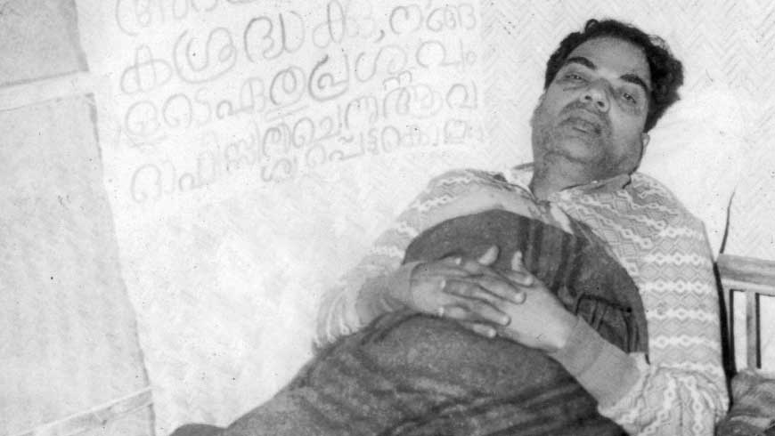

I could see that the struggle was coming off well. Taxes were
withheld and strikes began. The brave workers of Alleppey
began a political strike. The government was completely shaken.
It was decided that about 100,000 people should set out from
various parts of the state to petition the Maharaja on his birthday.
The government felt the need to stem this mighty agitation at least
temporarily. What CP did was to release the Kerala Congress
leaders and to concentrate the entire police force on the workers.
On the birthday, all prisoners were released. We too were released
from the Vaikom lock-up. I rested for three or four days at
Vaikom as the rigours of jail life had greatly enfeebled me.

Propaganda campaigns were later started in Alwaye, Kotlayam,
Parur, Mavelikkara and many other places in north
Travancore. I could see a considerable awakening and interest
among the people. But even the leaders had no idea as to the future
course of action. The struggle did not possess a leadership that had
any concrete ideas about its objectives or about the means to realise
those objectives. There was not even a proper organisation behind
the leadership. That struggle was only a crude and almost involuntary
demonstration against the inequities suffered by the
people for centuries from feudal overlordship. In course of time,
however, the struggle lost its community colour completely and
the slogan of responsible government came to the forefront.

Although the leadership of the struggle was of such a nature,
revolutionary forces that joined it played an active and important
role. Nowhere else in India had workers conducted a political
strike on such a scale. Likewise, it was the students who first
entered the arena and bore the brunt of atrocities and roused the
entire people of Travancore. Not only men, but even women students,
came out and stoically endured the utmost brutalities.
From the heroically self-sacrificing spirit of students, the eager
participation of the masses in their thousands, the increasing prestige
of the Kerala Congress, and the political strikes of the workers,
I was convinced that the people of Travancore would be able to
capture responsible government. But that was not to be. The
struggle failed on account of the absence of a deliberate and uniform
organisational structure, the inability to correctly gauge the tactics
employed by the government to repress it and the inability to assess
properly the tactics employed by the government to divide and
weaken the Kerala Congress and to match those tactics with counter
programmes.

Two days before the release of the leaders, in October 1938,
a strike began in Alleppey.

Alleppey was a most important centre of the coir industry.
There were numerous coir factories in the Ambalapuzha and
Shertallay _taluks_ extending for 33 miles from Aroor on the border
of Cochin and Travancore to Punnapra six miles south of Alleppey.
About 30,000 workers were engaged in this industry in Alleppey
town itself.

The Travancore Labour Association was a very strong organisation
of workers. In the early days, the workers suffered untold
miseries. At a special meeting of the Association held on Menam
it was decided to send a _jatha_ of 50 members to Trivandrum
to bring their long-standing demands to the attention of the government.
But the government immediately issued prohibitory orders.
This agitation was suppressed through arrests and the application
of penal law provisions. Workers protested against this repression
through strikes and demonstrations.

The Union took a decision to strike in the second week of
February, 1938. The government again issued prohibitory orders.
Leaders were arrested. When the arrested activists were being taken
to the police station, workers gathered there in small crowds. A
worker named Bawa suffered martyrdom in the _lathi charge_
conducted by the police to disperse the crowd.

The political atmosphere of Travancore became heated after
this as a result of the Kerala Congress activities. Workers passed
resolutions welcoming the Kerala Congress and requesting that
their urgent demands be included in the Congress programme.
Workers thus played an active role in the political struggle in
Travancore. Workers started fighting in the forefront of the
Kerala Congress agitation for responsible government. When the
government tried to frustrate the struggle, the coir factory workers
announced a strike from October 18 for their urgent demands and
for responsible government with adult franchise.

The strike declaration meeting held two days prior to the strike
under the presidency of Comrade K. K. Warrier was an important
one in the history of the Alleppey Workers movement. Comrade
Warrier's humorous and exciting speech enthused the workers and
enraged the government. That is why Comrade Warrier was
beaten with a granite stone after his arrest.

Right from the beginning the government did the needful to
repress the strike. The Kerala Congress leaders were released and
the army was deployed at Aileppey in strength. Government agents
were sent to set factories on fire and to create disturbance
to make out that workers were indulging in violence.

There was firing near the cremation ground bridge. Four
died in the firing. Afterwards, the workers' homes were invaded
and all of them were beaten up. Houses were set afire. Passersby
were manhandled.

A procession was arranged for the day after the firing. Comrade
Krishna Pillai asked me to report immediately to lead the
procession. I was then campaigning in north Travancore after
coming out of jail. I reached Alleppey. But on account of
opposition by a section of worker-leaders the _jatha_ was not organised.

A meeting was held at Kidangamparambu grounds in an
effort to boost the falling morale of the workers. In my speech I
attacked the police brutalities very strongly. The people applauded.
Fear disappeared. I knew that I would have to suffer police high-handedness
and was prepared for it.

Organising strike meetings of workers, meeting workers in their
centres, and conducting public meetings kept me busy afterwards.
Even the terrible repression suffered by the workers did not shake
their determination. They continued to hold group meetings on
schedule and continued the picketing. I was able to meet the
Alleppey workers and their families. Not only the workers, but
even their families, acted courageously. When the police were
attacking workers in their homes, the old mother of a Christian
worker kept feeding the volunteers, taking care of their uniforms
and helping the strike even at night. That old lady is even today
the Party's own mother. All worker families were made of such
mettle.

Even prior to this, there were in Alleppey many activists sent
by the Socialist Party from Malabar. The Party was able to turn
this strike into a political one and to provide it with effective
leadership Workers who hitherto had found in their union a
means for economic betterment, started educating themselves
politically. The Party played a large role in this struggle and
Comrade Krishna Pillai extended his leadership to the strike as
he had done in the Kerala Congress agitation.

The strike was settled in a week. It became very difficult to
send back the workers to the factory. But they accepted the union
decision. I was making a round of the factories in a rickshaw on
the day the strike ended to persuade the workers to return to work.
The police Inspector arrested me at that time and took me to the
police station. As soon as the workers caine out on hearing the
news, the Inspector let me go saying that I had never been
arrested.

Although the strike at Alleppey ended, the employers at
Shertallay, Muhamma and other places were not prepared for a
settlement. I worked for about a week at Shertallay and Muhamma.
Finally, the strike was ended on the basis of an agreement. As
I came to know that I would be arrested when the strike was over,
I decided to leave Travancore.

It was at this time that I came into contact with Kerala
Congress leaders and people like Comrade Sugathan, C. K. Velayudhan
and Varghese Vaidyan. Sugathan was the most cherished
leader of workers. He used alike both dialectic and abuse. Comrades
were never offended by it. Although old, C. K. Velayudhan
was young in his actions.

Comrade K. C. George, who was a Kerala Congress leader and
party leader of Travancore, was a peculiar kind of man. I found
a man sitting at the Ernakulam office during the struggle. He wore
soiled clothes, and had an uncouth unfashionable way of dressing.
He was introduced to me as our leader with MA, and LLB
degrees. I did not like the man initially. When he stood up
and started walking, I was surprised to see he was lame. He
was a placid leader, beloved of people of all parties in Travancore.
He himself had no pretensions to leadership but the people
accepted him as such. While everyone ate at Modern Hotel and
Sugunavilasam, he would be hunting for the cheapest hotel
serving a meal for 1½ annas. Later association only increased
my sincere regard for Comrade George. I also met Comrades
Bhasi, CS, MN and others.

I was able to get in touch with Kerala Congress leaders, workers'
leaders and the people of the native states and to study their problems.
I was able to make a comparative study of the brave workers
of Alleppey, among whom trade unionism developed with phenomenal
rapidity, and the trade union activities of Malabar and
draw certain conclusions. While in one place trade unions were
built up on the basis of economic demands alone, the greatest
attention was given in the other place to political resolutions and
agitations. I was able to study the problems of the native states
of Cochin and Travancore, the political parties functioning there
and the relationship between them. I was thus able to widen my
perspective from Malabar to Kerala.

At the same time, I was able to establish contact with Tamil
Nadu too. It was at this time that I presided at the Tindivanam
district conference and the Rajapalayam state conference and
made the acquaintance of people there. I got acquainted with
worker-leaders of Madurai, Trichinopoly and other places too.
It was on account of these associations that I was able later on
to function in Tamil Nadu. I started developing a state-wide
perspective and viewpoint. This helped me to view and study
labour problems from a broader perspective.

# Chapter 11

Literature plays a considerable role in eradicating the injustices,
iniquity and malpractices that appear in society from time to time.
Poets like Vallathol and Kumaran Asan have fought relentlessly
against the malpractices and often the iniquitous customs of Kerala.
They have thus been able to create a new atmosphere. Literature
appeals to the human mind very strongly and can transform it.
In the struggle for social, economic and political change the pen is
no less important than the warrior who takes up arms and fights
a relentless battle against the enemy. There must be progressive
literary movements in every age if society is to prosper.

As long as there are different interests, there cannot but be
different classes. Each class will strive to the utmost to preserve
its interests. There was a time when the printing presses, publishing
houses and writers were slaves and sycophants of the capitalist
class. It was therefore necessary to have a literature that portrayed
the crying needs of the oppressed classes and the struggle
for their rights. Systems of government, the economic structure
of society and man's living habits are subject to daily change.
Change is the law of life. The writer is a social being. He cannot
live without being a party to this change. Progressive literature
which embodies this change is necessary for the progress of society
and the nation.

After the Congress Socialist Party was formed as a group inside
the Congress, and socialist propaganda spread everywhere, and as
workers and peasants formed their own organisations, capitalist
papers and papers serving the capitalist interests started strongly
attacking this new movement. They sometimes even spread
calumnies against it. This created a confusion of ideas among the
people. They went so far as to picture socialism as a dread disease.
They visualised the future social system in a grotesque manner.
Against this background, the Party was convinced of the imperative
need for a newspaper that would participate in the daily struggles
of peasants, workers and other oppressed classes, expose libels
against the Party, undertake socialist propaganda work, deliver
from confusion of ideas the many young men who had participated
and who would participate in the freedom struggle, instil political
consciousness and knowledge in them and build up strong class
feelings in the oppressed sections. But the party had no funds
for a press and newspaper.

This was due in a large measure to the organisational weakness
of the Congress Socialist Party. However, the paper _Prabhatham_
was started at Shoranur in 1935 under Comrade EMS's leadership.
In the absence of a good press and a permanent staff, the running
of the paper was not at all easy. Comrade EMS was the editor.
He had the cooperation of the ICP and M. P. Bhattathiripad and
others. With the birth of this newspaper, we were able to educate
the people theoretically. But not long afterwards the government
asked for a bond of one thousand rupees. The bond was demanded
because of the publication of a poem entitled _Victory to Revolution_
by Chowwara Parameswaran. As it was not possible to deposit
the amount, the paper was stopped. It was a great loss to the
Party. Not long after the Congress formed the Ministry, we
received permission to restart the paper. The publication of the
paper was resumed in April, 1938. The Party appointed me
Manager.

There were no assets except an old and ill-equipped press. The
only capital that the paper had was the union of class-conscious
peasants and workers. It was a time of 'struggles' by peasants
and workers. Moreover, the Congress was in power. Therefore,
the people, especially peasants and workers, realised the need for
a paper. Impelled by this, I toured North Malabar planning to
restart the paper in a week. The people responded very well.
Worker and peasant unions and even some landlords helped and
250 rupees were collected in a week. The paper was started.

On the day the paper was launched, I went to preside over the
peasant conference at Alipparambu. I took with me some copies
of the paper. The price of a single copy was two annas. The
moment they saw the paper, peasants and workers bought all the
available copies. Many became subscribers and gave donations.
Unlike that of capitalist newspapers, the printing and layout of the
paper were poor. But still the poor peasants turned it over in their
hands with delight; read and grasped it as though they had received
some priceless weapon. I realised the crying need for a class-based
newspaper. It was only the class feeling of workers, peasants and
other supporters that made the running of the paper possible with
barely any capital.

Chief among those who helped Comrade EMS in running the paper
were Comrades K. Damodaran, Subramanya Sharma and P.
Narayanan Nair. Each one had a part to play in improving the
paper and in adapting its coverage to changing circumstances.

There are no Comrades in Kerala who do not know Comrade
K. Damodaran. He has written many books for the Party and
conducted classes after he returned from studies at Benares.

When Comrade K. Damodaran was arrested in the Travancore
struggle, Comrade Subramanya Sharma functioned as
Editor. Later on, under the editorship of Comrade P. Narayanan
Nair, the paper assumed its appropriate character. He was a very
experienced journalist and one who knew the techniques and
strategies of the _bourgeois_ editor. He facilely learned the role
and character of a party paper. _Prabhatham_ became the paper,
not only of workers and peasants, but of others also. It was even
able to attract a section of Congressmen. It should be specially
mentioned that Comrade EMS's supervision and assistance gave
encouragement to all. New writers emerged. KPR, Keraleeyan
and others started writing poetry. Poems calculated to enthuse
the oppressed classes and to instil in them a spirit of freedom and
anti-imperialism saw the light of day. T. Subramanyan Thirumumpu's
composition:

>Peasants and the working class,
>
>Exploited and the poor,
>
>We shall congregate below this red flag;
>
>Let us get ready for a start.
>
>What for? To eradicate poverty,
>
>To fight oppression,
>
>To wreck and burn down
>
>The fortress of capitalism
>
>That gives birth to starvation,
>
>To crush imperialist domination,
>
>To erase landlordism.
>
>&nbsp;
>
>Are we not necessary
>
>To plough, to pay land rent
>
>And to turn the machine?
>
>If we unite, none of these will be possible,
>
>It is enough if we know ourselves.
>
>Let us go forward, forward,
>
>No backward step any more.

and the lines of Premji:

>We are not slaves and we will not rest content any more,
>
>We shall fight with feet entrenched;
>
>We are needed to toil in the mill daily from morning till evening
>
>And the capitalist is there to earn.
>
>&nbsp;
>
>We should be there to step into the mud in the field;
>
>And who fills the belly—feudal lords.
>
>&nbsp;
>
>No clothes to wear, no shelter at night,
>
>No _kanji_ to drink,—what an injustice.
>
>Are we not human? We also want to live in the world.
>
>We are not born to suffer alone.
>
>Government, we have seen you in your true colours,
>
>We are not afraid any more of death.

began to be chanted even by children.

The people were inspired by the poems of Theruvattu Raman,
KPG. and others, the short stories of Cherukad and Pottekad
and Surendran's column _Let Me Say_. Even some Party workers
started writing articles on their experiences. I have myself written
four or five articles for _Prabhatham_. To me, to say the least, the
rapid development of this paper with little experience and no
finance worth the name was a remarkable achievement. New
ideas, ideals and the conflicts in society came out in touching and
simple language in the form of poems, articles and short stories.
People started learning, teaching, thinking and arguing.

We encountered great difficulties in running the paper. Most
people had no experience as journalists. I had no experience
at all as Manager of a paper. Organisationally, the tradition of
the CSP still prevailed, which meant in effect the absence of any
organisation. Although I was Manager, I was generally absent
from the office. I had to participate in conferences of workers
and peasants and agitate against federation. Doing all these
things at the same time meant doing none of them well. This
was the plight of the editors and others connected with it. Comrade
P. Sekharan who was assisting me was a worker-activist. In the
event of a strike he had to rush there. During the Travancore
struggle, the entire _Prabhatham_ staff was there. The paper somehow
survived. Whenever there was peasant struggle, everyone
would report there. In short, the absence of a well laid out schedule
of work for each member of the staff and the absence of regular
training in efficient management of that work created great difficulties
in the running of the paper.

Party workers were the paper's agents. Many full-time
workers were there at that time. They had no means of livelihood.
So, it was usual for them to spend the paper's meagre
capital when in dire financial straits. Money stopped arriving
regularly. There were financial arrears. The press was too illequipped
to take on jobs from outside. By contacting people
every week, by enrolling subscribers and by collecting donations,
the paper was kept going from week to week. There had been
no training to boost circulation through a proper agency system.
Nor was there any provision or facility for undivided attention to
this task.

There came a time when it was even feared that the paper
might fold up. As the circulation was increasing and as some
leaflets had to be printed, there was urgent need for a good press.
I therefore decided to go on a foreign tour to enlist subscribers for
_Prabhatham_ and to raise funds. There were other reasons too
behind this decision. There was a police case pending against me
for a speech I had made at Peralam earlier. The police
were waiting for my return from the Tripuri AICC meeting.
Moreover, I had been invited to preside at the annual conference
of the Bharatha Youth Association of Ceylon. In these
circumstances, the Party decided that rather than go to jail after
the Tripuri meeting, I should go to Ceylon to canvass funds for
_Prabhatham_. I was happy with this decision as I wanted to
strengthen these contacts and to get acquainted with Party
activities in India and abroad.

My membership of the AICC enabled me to participate
in the annual conferences of the Indian National Congress. I
attended the Haripura and Tripuri sessions. I was able, like
others, to meet All-India Congress leaders and leaders of the
Socialist and Communist parties. I stayed and worked in Bombay
for three months after the Tripuri session and I was able to
get to know Dr. K. B. Menon, Kesavan Nair, Narayanaswami
and others. I met the Malayalees of Bombay and studied their
problems and raised funds. At the same time, I was able to get
acquainted with Communist leaders of Bombay, to visit the office
of the then Communist organ _National Front_ and to study journalism,
to visit offices of Communist-led trade unions and to
participate in worker rallies. This evoked in me a revulsion for
the policies and programmes of the then leaders of the CSP. It
also brought me closer to the Communist Party and strengthened
my ties with its leaders.

I was most attracted by the self-sacrificing spirit and political
acumen of Comrades like Adhikari, P. C. Joshi, Ajoy Ghosh,
Ghate and Sundarayya. I learned from close quarters the functioning
of the National Front office and the miseries suffered by
leaders while working. I had discussions with them and read
their party literature. Comrade Joshi one day asked me to
meet him the next day at 3 o'clock to discuss newspaper administration.
I agreed. I arrived at 3:15. As a sudden engagement
had taken him away, I was not able to see him. I was told that as
I had not arrived in time, he would only be able to meet me the
following day. The next day I arrived half an hour ahead of time.
Comrade Joshi did not like this. He took me that day to a quiet
Irani shop and ordered tea. We exchanged pleasantries for 15
minutes or so. He was acquainted with the general trend of our
activities. We talked for half an hour longer after returning to
the office. Thereafter, until I left Bombay, I used to meet
Comrades Joshi and Adhikari regularly and discuss matters
with them. I told Comrade Adhikari that I was collecting funds
for _Prabhatham_ and that I had already collected 500 rupees from
Malayalees. _You collected 500 rupees from Malayalees,
Comrade Adhikari asked me in wonder. From that day, Comrade
Adhikari used to refer to me jokingly as that 500 rupee man _.

There were two types of people among the Bombay Malayalees.
One section consisted of officers. They wanted to form a
Malayalee organisation to celebrate Onam and Vishu, to have a
place for entertainment after work, to run a store to keep them
supplied with towels and pappads from Kerala, and other such
trivia. They had nothing to do with politics. Moreover, they did
not want to have anything to do with politics.

There were many types of people in the other category
Revolutionary youth who tried to understand the events around
them against the background of their knowledge of Indian politics
and contributed to the movement according to their resources,
people who keenly watched the political movements in Kerala and
helped to further them; Malayalee workers who had taken refuge
there for employment with no political ideas at all; those
who were interested only in the Malayalee Association;
Gandhi-ist Congressmen; middle class socialists; workers—quite a
mixed bag!

The friends of _Prabhatham_ were Comrades E. C. Bharathan,
Gopalan, Achuthan, Michael, Warrier, Menon, K. B. Panikkar
and P. Balan. It was with their help and with the help of K. B.
Menon, Kesavan Nair and Narayanaswami and, most important
of all, Bavunni Ezhuthachan, that 500 rupees could be collected
for _Prabhatham_. I was able to get acquainted with the workers of
Sewri and Worli and to organise a worker group at Sewri. Moreover,
I addressed Malayalee meetings on the Congress work in
Kerala and the peasant unions. A youth group was formed to
assist the work in Kerala and to boost the circulation of _Prabhatham_.
It should be specially mentioned that the group was able
to help with party work later on by regularly contributing funds
according to their means.

The success of the work at Bombay increased my desire to
tour Ceylon and thereafter, Singapore and Rangoon. I set out
for Ceylon from Bombay. M. P. Damodaran, MLA was also
with me to attend the Ceylon conference.

Ceylon Malayalees gave us a rousing reception. A public
meeting was held the next day at Colombo Town Hall. Admission
was by tickets. The hall was filled with Malayalees. I spoke on
socialism. I dealt specially with the peasant movement in Kerala,
the peasant struggles and the work of the Socialist Party. The
town hall bore witness to the keenness of those Malayalees to hear
public leaders from their country, especially those working for
national freedom and socialism. The following day Damodaran
spoke on Gandhi-ism.

The majority of Ceylon Malayalees are workers. They are
mostly from Malabar, from Ponnani and more particularly
from Nattika. There was also a small section of officers
and middle class clerks.

Colombo is easily influenced by the political developments of
Kerala. There is a constant traffic of people between Colombo
and Kerala. There were socialists in Colombo as well as a small
minority which was blindly hostile to them. But most people were
either socialists or sympathisers.

The 'Ceylon Malayali Mahajana Sabha' was a well organised
Malayalee association of Colombo. The Malayalees of Ceylon
have gained much from the strength of this organisation. But
some of its leaders tried to give it a communal colour. The
Sabha did not involve itself in politics. It was a time when public
workers had begun to wreck community organisations. A section
of the youth started to boycott this organisation on the plea that
its members were reactionaries. The revolutionary youth thus
started an organisation called Bharatha Youth Sangham. It
should be particularly noted that even in the face of differences of
opinion, all its members worked unitedly in matters concerning
Malayalees.

The young revolutionaries had no idea on how they should
function. Politically, there was a great confusion of ideas among
them. They disliked the policy followed by the Sinhalese towards
the Indians of Ceylon and had no connections at all with the Sama
Samaj Party which was the organisation of Ceylon's progressives.
Besides, they had no ties with the small groups of Tamil youth. I
thus arrived in Ceylon at a dangerous time.

Rather than collect funds for _Prabhatham_, I felt that my duty
lay in trying to improve this dangerous state of affairs. I planned
to work initially among the Malayalees themselves and to strengthen
their organisation, to put them in touch with non-Malayalees and
to set up a united organisation of all Indians, to associate this
organisation with the Sama Samaj Party and to make them work
in a united front. Although it was too difficult to accomplish such
an ambitious mission in so short a time, I was able to lay the groundwork
for it.

I arrived in Ceylon at a time when enmity towards Indians,
and particularly Malayalees, had reached a climax. It was usual
for Malayalees to be beaten and maltreated. Malayalees were
generally referred to as _Kochiyans_ in derogation. Most of the Malayalee
labourers worked in Colombo. Sinhala-Malayalee enmity had
reached its zenith here. The leader of this anti-Malayalee agitation
was the labour leader Gunasinha. He had contested twice for
the Ceylon State Council. Indians and particularly Malayalees
worked against him. He decided to stir up Sinhala-Malayalee
enmity in retaliation. Gunasinha wrote in his paper that it was
because of the presence of Indians that Sinhalese were not able to
get jobs and that the unemployment problem could be solved by
driving out the Indians, particularly the Malayalees. The poor
unlettered Sinhala labourers believed this. They were angry that
the Indians were living well when they themselves were starving.

There is a weaving mill at a place called Wellawatha. The
mill owner was an Indian. About 500 labourers were working
there. Most of them were Malayalees and Tamilians. Some
Sinhalese also worked there. The Sama Samaj Party members
controlled the mill union. There were Trotskyites in the Sama
Samaj Party, but communists too. It was a small organisation of
people of these two ideologies working among labourers and others.
The Trotskyites broke away from the Sama Samaj Party when the
war broke out and the communists formed the Communist Party.
Anyway, when I arrived the Sama Samaj Party was an organisation
of progressive Ceylonese. It provided good leadership to
Indians and Ceylonese during the anti-Indian movement and
campaigned against the movement. It had to undergo many
difficulties because of this. I was able to get acquainted with the
workers of this party and later on to get them to work on the basis
of a uniform programme.

I was asked to speak at a meeting of the Wellawatha workers,
which was even announced in newspapers. Gunasinha had written
in his paper the previous day that I should not be allowed to speak
and that I should be thrashed and driven away. We therefore felt
that something untoward might happen. As somebody from our
group started speaking, a group of Sinhalese ruffians started hooting.
When I ascended the dais to speak, stoning started. The
meeting broke up. The Malayalee workers were furious. They
felt that their leader from their home-land had been insulted. They
went in groups and thrashed the ruffians and chased them to their
houses. The meeting was resumed thereafter and no further untoward
incident occurred.

Gunasinha used to write plays about Malayalees and publish
them in his paper. One of these was entitled _Veerayya_. It was
about a Malayalee who enticed a Sinhala woman who used to visit
his shop to buy provisions, married her and left her in destitution
when he returned to Malabar. Its aim was to proclaim _Victory
to the destruction of Malayalees._

The plays used to be enacted publicly. I went to see a play
staged on Vaisakha day. This was about a Malayalee named
Sankaran who arrived in Ceylon in tatters, started a tea shop,
married a Sinhala woman and finally became a pauper and
was driven back to Malabar by his Sinhalese wife and children.
_Let this be a lesson to Sinhalese,_ it indirectly reiterated.

While walking through a place called Marudna one day, I
found two Sinhalese chanting amidst a large crowd and selling
something. I bought a news-sheet for 5 cents and had it read to me.
It was a pamphlet that glaringly attacked the social practices,
traditions, character and morality of Malayalees. They sang it
even more objectionably than the printed version. _Sinhalese
brothers. You have no work. You are starving. Open your
eyes. Drive away the pariah Malayalees who snatch away your
food. Only then will you be all right. Awake. Let the destruction
of Malayalees be successful_. This was the refrain of the song.
On one or two occasions, Sinhalese children stoned and hooted
me after they found out that I was a Malayalee.

After the Wellawatha stoning and other incidents, I wrote to
some newspapers on the explosive situation in Ceylon as I found it
and enunciated some measures to mitigate it. I pointed out that
individual quarrels between Indians and Sinhalese had been given
communal overtones and that letting this tendency grow unchecked
was pregnant with terrible consequences. I sent copies of my
article to the Governor and the Minister of Transport, Kothalawala.
All newspapers, including the English daily Times of Ceylon published
it and wrote editorials about it. Afterwards, I had an
interview with the Police Commissioner at which I was asked to
furnish evidence for what I had written. I complied. He assured
me that such things would not happen in future and said that he
would do the needful if I reported any future occurrence to him.
It may be mentioned that subsequently there was a temporary lull
in the persecution of Malayalees.

It was at this time that Transport Minister Kothalawala recommended
the immediate retrenchment of 6,000 daily-rated Indian
workers. This recommendation created a stir among Indians.
Mammoth protest meetings were held about this and telegrams
were sent to the Indian government and other interested quarters.

Unemployment is an international problem. It is not a
Ceylonese problem or an Indian problem. No independent
nation except Russia is free from this scourge. Very many unemployed
Indians arrive daily in Ceylon. They are ready to work
even on reduced wages. Unemployment is on the increase daily
among Ceylonese too. The unemployment among Ceylonese
is not going to end by retrenching 6,000 or even 60,000 Indians.
It only means that for some time Indians will starve instead of
Ceylonese. The temporary palliative that both Ceylonese and
Indian leaders found for this was to share hunger and unemployment
between their compatriots. This problem can only be solved
by ending imperialist rule and by establishing a socialist government.
All poverty-stricken people should be prepared for it and
forge unity on that basis and fight against the common enemy.
Both Indians and Ceylonese should understand this and act. I
propagated these ideas and set up the appropriate organisational
base.

I talked to the leaders of the Ceylon Malayali Mahajana
Sabha. I told them that it was no use fanning the enmity of
Malayalees against the Sinhalese just because some Sinhalese
leaders were fomenting hatred of Malayalees among their followers.
That it was necessary to work for a just compromise and that
Congress help would be available for its furtherance, I gave
notice of a resolution on Ceylon at the forthcoming AICC
session.

Similarly, meetings were held under the auspices of the Sama
Samaj Party. I spoke there. I did propaganda work on the basis
of their resolution that no Indian who had been in Ceylon for five
years should be sent back and that they should have the same
rights of franchise and civil liberties as Ceylonese and that those
who had lived in Ceylon for less than that period should return in
the common interest. This resolution was satisfactory to a section
of Indians.

I talked, besides, to Ceylon Indian leaders like Desai, Tamil
labour leaders like Natesa Iyer and people like Vaidyanatha Iyer
and requested them not to consider their own interests alone but
to arrive at a decision on the basis of the interests of Indians as a
whole.

I talked also to Tamilian youths and to Aziz, who is now Secretary
of the Ceylon Indian Congress. I asked them to bring together
the small organisations being formed by Malayalees and
Tamilians and to set up a central organisation working for the
common needs of Indians as a whole. A committee was formed
on this basis. It was after this that the Ceylon Indian Congress
was started.

I conducted political classes and formed small groups among
Malayalees who were socialists and socialist sympathisers. I
conducted public and group meetings in areas where Malayalees
predominated. I drew up a plan for future work. I toured
Kandy, Ratnamala and other places and set up unions of
estate workers. The anti-Indian movement had not spread to
the interior. Indian and Sinhalese labourers lived like brothers
there. I talked to the workers after a public meeting. A Sinhala
worker told me: _Are we not all workers? Don't we suffer
alike? Are not our demands the same? Why then should we
hate each other? If we remain divided, the capitalist gains. Not
we, sure._

I was invited to speak at the Jaffna Youth Congress meeting.
In a long speech, I dealt with the problems of Ceylonese Indians,
possible solutions to their problems and the part that youth could
play in them. I was introduced to Sama Samaj Party men and
Malayalee comrades. I made arrangements for the political education
of Malayalee comrades. I specially remember the help of
Comrade Sankaran, who was a _Prabhatham_ agent, and of Comrades
Madhavan and Krishnan. Velai, Kunjiraman and others
also assisted as Malayalee Association workers.

I was not able to do full justice to the work of enlisting subscribers
for _Prabhatham_ and of collecting donations, but I did
lay the groundwork for it. After that, the youth of Ceylon kept
in touch with the Party and helped it regularly.

I wanted to go to Singapore from Ceylon. Comrade M. S.
Devadas, who was later to become the editor of _Deshabhimani_,
was at that time in Singapore as lecturer in some college. He
was known as Babu. Babu wanted to have me in Singapore but
he was not sure how much financial support I would get. The
Malayalees of Malaya were wanting in political consciousness at
that time. They did not even have a strong organisation for themselves.
Their only concern was to draw a fat salary and live
sumptuously. They did not even think of the land of their birth
and the culture of that land. They were not at all affected by the
wind of freedom blowing around them in the world. But there
were a few young people who followed the happenings in India
and the world through newspapers and books. They were touched
by these happenings, but at the same time were dejected because
they did not know what to do. Babu who was held in affectionate
regard by all Malayalees, was keen to come to India and
participate in the struggle here. That was why he resigned and
came even before I left Singapore. I personally felt that he should
not resign, but should stay on there permanently. But his coming
has meant a great gain for the Party.

Using Babu's influence, arrangements were made for a reception
by the Singapore Malayalee Samajam. The paper _Kerala
Bandhu_ wrote an editorial. This angered CID authorities.
They intimidated Malayalee leaders who withdrew in fear. Babu
was called and intimidated. When Babu said that I was coming
only to raise funds and that there might be trouble if the government
stood in the way, the CID Superintendent agreed to let
me in. I thus arrived in Singapore.

It had been my first long journey by steamer. I made many
blunders during the journey out of inexperience. I was not able
to use a knife and fork to eat Western food. I was sitting one
evening on the ship's deck. It was the lounge of the first and
second class passengers. By 7 o'clock people began dancing. A
European lady invited me to dance. She took hold of my hand.
I was bewildered. I said I did not know how to dance. She
made fun of me. She insisted. I took refuge in my room. I
did not leave my room at dance time on any other occasion for
fear of embarrassment. But by the time I made my second trip
in a ship—while travelling from Singapore to Rangoon—I learned
everything. I danced with a young lady and as a result was considered
fashionable!

While in the ship I had pondered over India and world happenings.
I saw signs of an imperialist war breaking out in the near
future. I was afraid that I might not return to India in time to
participate in it. I was enthused by the political conference of
Bakkalam and the preparations made by the Party for the coming
struggle against war. I was pained by the anti-Soviet line of the
CSP and its decrepit organisation. I felt that it was time for
me to say goodbye to the CSP. I feared the repercussions the anti-Soviet
attitude of Masani and Co. would have on the Congress
Socialist Party.

Singapore was a hot-bed of CID men. There were many
Malayalee CID officers there. I was then living with Babu. A
CID Inspector was living downstairs. I had to be specially
careful in the beginning not to indulge in any agitation, keeping
myself engaged solely in raising funds for _Prabhatham_, and while
talking to individuals.

Fellow Malayalees gave me money, moved not so much by
political awareness, as by personal trust and their fraternal feelings
towards a fellow Malayalee. Most of the youth were in high spirits
consequent on the victory of Subhas Chandra Bose in the election
the Congress President's Office. They believed that India
would achieve freedom under the leadership of Subhas Bose.
They were dissatisfied with the Socialist Party for having adopted
a neutral attitude at Tripura. It was usual with me to engage in
debates with politically conscious youth and to talk to individuals.

The government had made public a Labour Bill to elicit public
opinion. With Babu's help, I wrote a critique on the Bill and sent
it to newspapers. The papers gave it wide publicity. Afterwards,
the Indian Association invited me to give a talk. I first addressed
the Singapore Indian Association on the Labour Bill. This was
an organisation of Indian officials and elite. The workers and
the poor were barred from it. I was subsequently viewed
suspiciously by all Indians there and by Malayalees in particular.
The police surveillance also intensified.

I spent nearly three months collecting funds and in talking
about political matters to those donating money. The only public
work that I did during this time was a speech I made at the
Malayalee Association. After the fund-collection at Singapore,
I toured Johore, Malacca, Kuala Lumpur, Ipoh and Penang and
came into contact with many Malayalees and Chinese.

I started making a careful study of conditions in Malaya,
the Indians in Malaya, Chinese and Chinese workers. The Chinese
were the first colonisers to emigrate to Malaya. They constitute
a majority of the emigrant population. Merchants and hawkers were
chiefly Chinese. Muslims from Malabar lived as small traders
and pan-shop owners. There were nearly 10,000 such Muslim
workers in Singapore city alone. Among estate workers, 60 percent
were Tamilians, 35 percent Chinese and the remaining 5 percent
Malayalees. I was amazed at the national spirit of the Chinese
and their unstinted loyalty to their country.

There were nearly 8,000 rickshaw workers in Singapore. They
had a strong union. They had struck work just before I landed
in Singapore. They wanted an increase in wages as a war against
Japan had broken out in China and they wanted to donate to the
war relief fund. The strike was successful. Each rickshaw puller
contributed 30 cents (12 annas) a month to the relief fund.

I talked to a rickshaw puller one day with the help of another
person. I asked him whether he was helping in the war effort.
The question angered him as though it was a reflection on his
patriotism. He replied: _I do give 12 annas per month.
Work or no work, I pay this from what is left after paying the
vehicle's hire. I spend only the balance._ He said this with
a smile.

Along with their love for China, they had a high regard for
the Indian National Congress. They knew well the two leaders
_Kanthi_ and _Neru_. While going in a rickshaw one day,
I started talking to a Chinese individual. The rickshaw man asked
the friend who was with me who I was. He said I was _Kanthi_
and _Nehru's man_. The rickshaw man was glad. He spoke
warmly about Nehru's visit to China and his stay with the Chiang
Kaishek. I paid the fare on reaching our destination. He did
not take it. _Are we not one?_ he replied. He accepted the fare
after I pressed him and laughed happily and went away glancing
backwards every now and again.

There were well-organised groups among Chinese workers
and students. Each estate had its own union of Chinese workers.
Sometimes they used to conduct struggles separately for their
demands. To my question why they did not join other workers,
they replied that Indian workers lacked unity and a union sense.

The natives of Malaya are Muslims. They are peaceful and
good-natured. One section were peasants and the others policemen
and soldiers. They wanted to live without working too hard.
They are content if they own a cycle and have money for a movie
ticket now and again. It took me three months to get into touch with
the Malayan Communist Party. The Communist Party was the
best organised party in Malaya. But it was not free to undertake
any public activities. Many party leaders were undergoing
imprisonment at the very time when I was there. They worked
most secretly. They built up a strong underground (Secret) Organisation.
They undertook trade union work and all other activities in this
manner. They had many worker and student-volunteers. There
was an Indian on their committee. By my association with
a solitary party leader, I was able to learn many things
organisationally.

The Malayalees of the Singapore naval base organised a public
meeting after I got into touch with Malayalee compatriots.
10,000 Malayalees worked in this naval base. Many of them had
participated in the political struggles of 1930–32. Some had also
participated in the Travancore State Congress struggle. I remember
specially the great help that I received from Travancoreans.
On the initiative of the youth of the naval base, a meeting of
Malayalees was held. The proprietor of the cinema hall gave the
hall rent-free for the meeting and also donated 10 dollars. The
procession, carrying the national flag, was larger by far than any
that had been held before, except one during a visit by Nehru. I
was thrilled at the sight of the national flag. I had the happiness
of an Indian who sees his flag outside India. There were 5,000
people at the meeting. K. P. Kesava Menon presided. I spoke
for two hours. They gave me a purse of 500 rupees. Non-Malayalee
Indians, like Tamilians, also started paying attention
to me afterwards.

From fund collection, I slowly started taking interest in
political work. The CID chief was angry. Babu by this time
had left for home after resigning his job. I spoke under the
auspices of the Indian Association at Malacca, Ipoh, Kuala Lumpur
and other places. I had talks with the Indian Government's agent.
I explained to him the condition of Indian workers. I spoke
also at meetings of railway workers.

I still remember something that happened while I was in
Singapore. Malayalee workers of an estate near Johore came to
know of my visit and my plans from English newspapers and from
the Malayalam weekly _Kerala Bandhu_. Some of them had come
to Malaya after participating in peasant and workers struggles
and losing their jobs in the process. They raised funds from
among workers of that and surrounding estates. Their leaders
went around not knowing where to find me. They finally met me
after a great deal of effort. The leaders told me that they had
raised some funds and that I should go to the estate to receive it
and talk to them about trade unions. I felt very happy. I went
there. I understood the difference between workers who sincerely
volunteer to help in the work for their class and the middle class
who donate 5 dollars with a sad smile even when approached in
their houses.

I went to the estate. About 100 faces eager to know about
their land and their worker-peasant brethren at home appeared
there. I talked to them about the activities in Kerala. They
donated 100 dollars (150 rupees). They did not leave me. Even
when I took leave of them, they stood watching me. Their eyes
showed how loyal they were to their country, its people and their
class. Some shed tears. This was an electrifying experience.
How many workers are there who live in misery in foreign countries
unable even to have one meal a day, and still cherish the hope
that their country will become free and they will one day be able
to work and live there happily. Even meeting Indian leaders
who were fighting for freedom was a tremendous experience for
them.

There was another amusing incident. There was a coal mine
in Malacca. It belonged to a European. There were many
Malayalees from Travancore working there. They wished to see me
and talk to me. But there would have been trouble if the Manager
had come to know that I was a Congressman and a trade union
worker. They played a trick. They told the Manager that an
Indian musician was coming for a concert and asked him for
permission to listen to him. The Manager gave permission. I
arrived there at the appointed time. A harmonium and other
instruments were ready. I sang a song. There was another
singer also. In between I spoke to them. I spoke about the
Travancore struggle and the political activities in Kerala. They
presented me with the money they had collected. A rather unique
music concert! There was a co-worker from Kunjimangalam
working in that mine.

It was at this time that I got acquainted with Comrade R. H.
Nathan who was later deported from Singapore and held as a
detenue prisoner in Vellore Central Jail. We mapped plans for a
union for estate workers. We held meetings of workers at Port
Swettenham, Clang and other places. We set up a trade union at
Clang. Comrade Nathan was extradited on this account. The
police keenly watched me and Comrade Nathan. As I was able to
create a stir among the Chinese also, the police commissioner called
me and warned me not to conduct meetings outside the hall
referred to earlier. He was sorry that I had been admitted at all
into Malaya.

There was in Singapore a youth league of Indians and Chinese.
Its office bearers were Tamilian youths. I was invited to preside
at its annual conference. I was at that time in Ipoh. I arrived
for the meeting along with a procession of volunteers from the
Singapore railway station. I was thrilled when I saw Indian
policemen and soldiers paying homage to the national flag. I
felt jealous of the patriotism of Indians living abroad. 30,000
people attended the meeting. A large section were Chinese
youth. There were people of various countries and religions.
I made a rousing speech. I strongly attacked fascism and
imperialism. Some officials began leaving the meeting in fear,
and I guessed what was going to happen. I was prepared for that.
I had been able to stir up the enthusiasm of the entire audience.

At about the same time, I wrote in Chinese newspapers of the
need for the Chinese and Indians to come together and work jointly.
I described the role of the Indian National Congress in the struggle
of China against Japan. I was able, after this press statement and
the youth league conference, to get acquainted with worker-leaders
and leaders of the Chinese student movement, and to work along
with them.

The war began. I was asked to leave Malaya. I was warned
against speaking at public meetings. I yearned to get back to
India as soon as possible in order to attend the Wardha AICC
meeting and to participate in the forthcoming struggle. But I
wasn't able to get a passage in the ship. Deciding to travel via
Rangoon, I set out.

I had written to the Rangoon Malayalee Samajam before
leaving. They had replied, welcoming my visit. The first to arrive
to welcome me upon reaching Rangoon were Malayalee CID
officials. When the war started, their harassment became unbearable.

I spent about a month in Burma, staying in Rangoon most of
the time. I spoke at two or three public meetings under the
auspices of the Rangoon Malayalee Samajam. I spoke also at a
large public meeting at the Rangoon Town Hall. Some of the
leaders of Rangoon were at this meeting. I impressed on my
hearers that the Burmese and Indians should not fight against each
other, but should jointly crush the common enemies: fascism
and imperialism. All Rangoon newspapers published details of
my tour and wrote editorials on it.

The situation in Rangoon was similar to that in Ceylon. Some
of the Indians were money-lenders and rich Chettiars. Business
sites and buildings belonged to them. Even some of the Ministers
of Rangoon owed them money. Most of the rickshaw-pullers
and other workers came from Andhra and Orissa. There was a
large population of Malabar Muslims there. There were also
Malayalees of the middle class working as clerks. The leaders of
the people were Buddhist priests called Ponjis. They had a nasty
habit of butchering people in the name of the Buddha. These
monks killed a lot of people when riots broke out between the
Burmese and Indians.

There was a revolutionary group there known as Thakin's
Party which had connections with the Indian Communist Party.
I met the leaders of this group and travelled with them. I presided
at the meeting of the Rangoon University students and spoke
at one or two peasants' meetings. We were able to organise Indian
and Burmese peasants against the oppression of an Indian landlord
and wrest some concessions after a minor struggle. I was able to
assist Thakin's Party in this struggle and to put them in touch with
Indians.

The workers and students of Burma grew up as two mighty
revolutionary forces. The strike of the oil-field workers of Burma,
their departure, and the sympathetic strike launched by students
and the subsequent firing are incidents that will not fail to inspire
anyone. But Thakin's Party did not have at that time the political
maturity that comes from intelligent leadership.

I received felicitations and purses from Malayalee hotel workers
and shop owners before I left. In my anxiety to return to India I
had not paid much attention to my itinerary in Burma. My trip
was useful in that I could raise some money and also think in
an international perspective and meet local leaders and workers.

My ship sped through the Hooghly river on its way to Calcutta.
I had left home eight months earlier and did not know what had
happened during this period. I believed that the Party and patriots
in Kerala might have made enough preparation for the struggle
against the war which had already started.

The purpose of the First World War was to make preparations
for another world war. Imperialist forces had made sufficient
preparation for that at the time. But the progress of the Soviet
Union and its five-year plans brought together and enthused the
revolutionary forces of the world. And by their agitations and
organised power, the people also got ready to establish a popular
government in each country in the coming struggle against imperialist
overlordship. The opportunity for that was near at hand.
I was glad that I was back in India in time for the struggle.

The ship berthed at the Calcutta harbour. I knew some of
the activists in Calcutta. But as I was new to Calcutta, I did not
know how to get in touch with them. I was worried.

It was then that I found that CID officials are sometimes
useful after all. I found a CID Inspector dressed in ordinary Bengali
attire running to and fro in confusion. I was standing outside my
room. He approached me meekly and said: _Please do me a
favour. A person named A. K. Gopalan is travelling in this ship.
Do you know him?_ I asked him why he wanted him. He
replied: _He is a Congressman. He left India. We have word
from Rangoon that he is coming in this ship, and that we should
take him into custody._ I decided to have fun. I pointed out a
passenger who had struck me as hot-tempered to the Inspector. The
Inspector turned to him and asked whether he was A. K. Gopalan.
He lost his temper and thundered at the Inspector for a full five
minutes. The Inspector was disappointed and started running
again. Finally I called the Inspector and told him that I was the
man he was looking for. I delivered all my luggage to him. He
called a taxi and took me to a hotel. I contacted my friends from
there afterwards.

# Chapter 12

I spent about ten days in Calcutta. I occupied myself with studying
the happenings in India during the months I had been away. I felt
that India would play a great role in the changes taking place
all over the world. I felt too that if the Indian National Congress
failed to provide leadership based on a well conceived policy, there
might be cleavages in the ranks of nationalists, and the nationalist
movement itself might disintegrate, leading to collapse of the
nationalist organisation. As I thought of the statement made by
Mahatmaji immediately after the war started, I felt sceptical of the
ability of the Congress to provide such a leadership. Nevertheless,
I arrived in Wardha a day before the AICC was scheduled to
begin with great hopes and keen to hold discussions with
leaders of the various groups.

Comrade Subrahmania Sarma who was a member of the
AICC had also arrived in Wardha a day prior to the meeting. We
held discussions with Socialist leaders as well as Communist leaders.
We could sense the trend of opinion among Congress leaders.

As expected, the Wardha AICC failed to provide proper
leadership. The Wardha resolution marked the beginning of naked
bargaining. Was Britain's war a just war? If not, were we
supposed to participate in it at a price? The Congress leadership
did not worry itself with such questions. It was not on this basis
that the Congress leadership framed its war policy. That was why
some Congressmen later regarded even the term _people's war_
as meaningless, no matter how much it was explained to them.

But the Wardha AICC session did in a way bring out
publicly the hatred that Indians had for fascism. The Congress
proclaimed that inviting the Japanese to help fight for India's
freedom would be treasonable and suicidal.

Gandhiji's initial statement was that Britain should be helped
unconditionally. Gandhiji argued that it was not right to harass
the enemy when he was in difficulties and that it was unfair to use
that opportunity to bargain with him. But this was not acceptable
to the Congress Working Committee members. They were afraid
of the mass feeling against war. Out of consideration also for the
interests of the capitalist class, they were constrained to abandon
the policy of unconditionally supporting Britain. The resolutions
and happenings that came later on until August 8, 1942 indicate
clearly the great danger and disaster that befell the nationalist
organisation.

The Second World War broke out as a tug of war between the
major imperialist powers for dividing the world among themselves
once again. It was a graphic illustration of the quarrels that tend to
break out as a result of the conflicts among the capitalist classes.
The mission of the people in this war was to mobilise the entire
populace in the fight against imperialism and fascism and the fight for
the independence of each nation. What was needed therefore was to
oppose this war unreservedly and to wage a mighty struggle against
it under the leadership of the mass organisations that had emerged in
India. The Wardha AICC session did not provide the leadership
for such a struggle. Had a mass struggle against the imperialist
war been launched, the preparations made by the people would have
prevented the disasters that subsequently overtook the country.

Most dangerous was the policy of the Congress Socialist Party
leadership. That leadership came out in its true colours only after
the start of the second imperialist war. It buried itself in its own
grave after first casting itself adrift from socialism and later from
the Congress Party itself. It was after the Wardha AICC session
that I was convinced of the correctness of my earlier opinion about
the origin of the CSP, its activities until 1939 and the policies
it adopted after the war began. When the war began, the CSP
decided that it was an imperialist war and that it should be opposed.
But it did not try to collaborate with the Communist Party and
other leftist parties and attempt to draw the Congress into the field
of agitation. It only wanted to stage demonstrations against
war and its economic ill-effects under its own leadership, keeping
the Congress out. When we, the Kerala delegates, talked to
Comrade Jayaprakash immediately after the Wardha AICC
session, he told us that we should send at least 10,000 people to
jail. Some anonymous leaflets carrying this idea and an issue of the
socialist paper had been distributed at the AICC session. Some
badges with the imprint _I oppose war_ were also brought for
distribution. But this pettifogging nonsense had to be stopped.
Congress Socialist Party members from several states made it
quite clear that they did not agree with this programme. Moreover,
Nehru did not approve of it either. Finally CSP leaders agreed
to drop it.

I was convinced that it was time to say goodbye to the CSP
I ruminated over its past history and decided that I should thoroughly
re-examine my own role in the freedom struggle on the basis of
my past experience, at a time when I must embark on a new chapter
in my political life, taking into consideration the not inconsiderable
theoretical knowledge that I had so far gained. My experience
and knowledge of various parties in countries outside India like
Ceylon, Burma and Malaya helped me greatly in coming
to a decision.

The Congress Socialist Party was formed by a section of
Congressmen who had functioned for a long time under Gandhian
leadership and participated in its struggles. The fact that a
heterogeneous group comprising peasants, intellectuals and
individuals of the urban middle class were attracted to socialism
was an illustration of the success of the great October revolution
spearheaded by the working class of Russia under the leadership
of the Bolshevik party. They were satisfied with the efficacy of
fundamental Marxist revolutionary tactics and did not become
Marxists out of any theoretical conviction or practical experience.

The CSP was not a party rooted in the class war of Marxism;
its origin was not in class war but in nationalist war. Members
of the CSP did not accept the principle that a socialist party was a
party of the working class. This could be seen from Jayaprakash's
statement at the 1934 Bombay session of the AICC that the
Socialist Party was a party of many classes. It was not understood
at all that they were not merely revolutionaries, but representatives of
a class. Instead of lining up all nationalists, including Congressmen,
under working class leadership in the struggle against imperialism,
they tried to keep socialists pinned down under the leadership of
the capitalist class. They did not realise that the _bourgeois_-democratic
struggle would only succeed under the leadership of
a strong and organised working class party. They did not understand
that only such a party would be able to ally itself with all
classes in the struggle against imperialism and forge a united front.
They forgot also that only an independent revolutionary workers'
party can achieve this. That was why, instead of an independent
revolutionary party, Jayaprakash and his associates set up a
_socialist party_ that was a hanger-on of the capitalist class.

Moreover, I knew from my own personal experience the
weakness resulting from the absence of a proper party organisation
in the CSP. In fact, apart from a conference held annually and
three or four committee meetings every year, there was no organisation
to speak of. Keeping in touch with lower units, getting
reports from them, and generally guiding them, which are the
pre-requisites of efficient party functioning, did not exist. There
was no secretariat to frame a programme on the basis of the reports
from lower units, nor a leadership capable of making lower units
function systematically. Except for busybodies who shuttled
through the country without any political ideology or programme
at all, there were no proper party organisers or agitators. The
agitators toured the whole country making fiery speeches, but
did not make any attempt at all to build up an organisation to
implement the policy they so vigorously propounded. Nor did they
realise that an organisation was necessary. There was no system of
training or educating activists from below. Even the party newspaper
gave no systematic directives to its correspondents and agents.
In short, the CSP organisation was one in which each worked
according to his fancy, at a time of his choice and without any
system. Lenin's words, _The organisation cannot be built up
without a revolutionary and correct policy; without organisation
it is not possible to propagate the policy,_ were very relevant to the
CSP's bankrupt policy and organisation.

Masani and Co., resigned from the Working Committee of the
CSP in 1939. They wrote articles against the Soviet Union
not only in the Congress' socialist paper but even in capitalist papers,
worked against the Communist Party in league with other parties
and tried to create a split in the Trade Union Congress.

After the start of the second imperialist war, the CSP ceased
to have anything to do with socialism and the policies of the working
class in the international context. Not realising the importance
of the Soviet-German provisional treaty, they opposed it as a Nazi
alliance. The Red Army's entry into Poland was criticised as
evidence of Soviet imperialism. The CSP leaders who prided
themselves on being Marxists failed to see even what Churchill,
the principal enemy of the Soviet Union, saw. Moreover, they
followed a policy of breaking up class organisations and struggles.
They created a split in the All-India Students' Federation, the All-India
Kisan Sabha and the Bihar Kisan Sabha.

Instead of setting up a secret organisation, necessitated by the
war conditions, they snapped all ties with Communists and threw out
all those known to be Communists from the Socialist Party. As a
result of this, people like me who had risen from the ranks of the
nationalist struggle and joined the CSP got closer to Communism
and the leaders remained with Gandhi-ism. The socialist parties
of Malabar, Tamil Nadu, Orissa and other places started functioning
as units of the Communist Party.

I set out for Malabar after the Wardha AICC session.
I travelled unknown to the police. I presented myself at the historic
meeting of the party workers at Pinarayi. Comrades Krishna
Pillai, Namboodiripad and others attended the meeting. It was
decided that the socialist party of Kerala should work as a unit of
the Communist Party. No one in the Working Committee disagreed
with this. It could be quite clearly seen then that this was the
unanimous opinion of party workers. There was discussion on
the future programme and how to coordinate the activities of the
secret organisation and public work. It was decided that some of
us would have to work secretly and others in public.

As there had been a Summons pending against me for two
years in Kerala, the Party wanted me to go and work in Tamil Nadu.
As a result I went to Tamil Nadu and started working semi-legally
there, though in Kerala I was a wanted man.

I first worked among the workers of Golden Rock, Trichinopoly.
What was the then condition of the South Indian Railway
Union? The stagnation and lull following the 1923 strike had not
disappeared completely. Disunity and distrust were rampant
among trade union workers. The rivalry between Brahmins and
non-Brahmins, Congressmen and Justice Party men showed itself
in union work. On one side, there was debate on whether or not the
Congress flag should be displayed in union general body meetings;
on the other, there was rancour over the union's properties. We
were able to organise all these sections under the Red Flag and to
convince them that they could help the nationalist struggle only by
organising themselves on a class basis. Small study classes were
held. The formation of some of the important workers of the
SIR(South Indian Railway) union which is today providing
leadership to trade unions in South India and laying the groundwork
for conversion of the union itself into such a revolutionary
organisation were indeed great achievements.

What was the condition in Tamil Nadu? On account of the
misguided policies of the CSP, Comrade Sreenivasa Rao and others
were imprisoned for long terms for speeches they made after the
AICC session. Only Comrades Ghatte and Ramamoorthy were
still free. Even they did not have facilities for large scale activities.

The Party asked me to work in Trichinopoly. I worked there
with the help of Comrade Kalyanasundaram who was leader of the
Southern Railway workers. Some cells of the party were formed
there and study classes held. We felt that coaching and training
of activists was urgently required. Comrade Sarma was there
with me. From Malabar came Comrades Ramachandra Nedungadi,
Raghava Marar and others.

To begin with, a training class with 15 volunteers was opened
at a place not far from Trichinopoly. Sarma was in charge of
coaching them while Raghava Marar was in charge of physical
training. This camp greatly enthused Congress workers and the
people living there. There was a cotton mill close to the camp.
The volunteers held a public meeting close to it. Activists from
among the mill-workers attended the camp and classes.

Thus, the basis was laid for a trade union. The volunteers
received practical training on how to form a trade union in a new
place. This union became strong and in three months staged a
strike for their minimum needs. The volunteers trained at this
camp were sent to many places in Trichinopoly district and were
able to set up trade unions and peasant unions and to hold coaching
classes for party workers. They held classes and did party work
in Kulithalai, Karur and other places.

We were strongly convinced of the need for such camps. A
camp was organised at Muthupetta in Tanjore District. 30 party
workers attended it. Comrade Ramachandran was in charge.

Madurai was a big centre of Congress work. About 15,000
workers worked in the Harvey Mill alone. Even before the war,
the Party had functioned there among workers. Facilities existed,
therefore, for the establishment of a well-organised camp. I toured
Madurai district along with Comrade Chellayya and decided to
open a big camp there. A camp was opened at Thirupparamkunram
near Madurai. 50 persons were trained there. Comrade
Sarma conducted the classes. Comrade Ramamoorthy was also
available for advice. But I had to go underground even before the
end of the camp. We had received reliable reports of my
impending arrest.

These camps not only trained nationalist workers for the
forthcoming struggle, but also created an environment in which
CSP workers and Congressmen, who had hitherto engaged
themselves in mutual recrimination and non-cooperation,
could work in unison. It was possible to have Gandhi-ist Vaidyanatha
Iyer, PCC president Kumaraswamy Raja, Kamaraja
Nadar, Ramamoorthy and Chellayya working together in the same
field. The camps were also able to create a united front against
imperialism. All sections of the Congress Party provided money
and assistance for this. Many non-socialist Congressmen attended
the Tanjore camp.

I started a new life. From being a _Satyagrahi_, a socialist
and a dedicated public worker always willing to court imprisonment
I had to switch-over to underground work. I was not at all
used to secret work. I had till then always worked in the
public eye. I could not even keep things hidden in my mind. My
training all along had been to speak the plain truth to everyone.
Scurrying from one end of the country to another, speaking at big
meetings, participating in general strikes and peasant struggles,
rushing wherever the baton was seen and to receive blows
and abuse from policemen, to go to jail, to create opportunities for
going to jail if there were none, to engineer _lathi charges_ and clashes
even there—this was my political regimen. I never used to read
books and newspapers. I couldn't find the time. I had not realised
that to find time to learn and to study was itself a part of Party
work. Leaders had not taught me; they too had had no such
experience. This was the CSP heritage. Until I went underground
I had not remained quiet or free for a single day. From
such a life I was about to enter a new regimen—to remain quiet,
to read and learn, to do only what was necessary, to meet only those
people suggested by the Party, to stay aloof from the public and
to keep at arm's length from the police—this was my new
pattern of life.

I was very happy and eager to enter into this new regimen.
But I was not sure how long I could carry on like this. There was
no alternative. Anyway, I decided to wage a struggle against my
traditional pattern of life. I understood how terribly difficult
the new life and activities would be. My health had been ruined
as a result of years of wandering and starvation, as a result of
police brutality and imprisonment. Despite this I was still ready
to suffer further hardships. It was a question of either shouldering
all these hardships and doing something for the country and the
people or getting caught by the imperialist police, courting imprisonment
and renouncing public work—there was no other alternative
before me. I knew only too well the pleasures and hardships
of jail life. I was familiar with the conditions that prevailed in
all categories of jails from 'A' class to 'C' class. If sacrifice and
patriotism are measured by the number of times one has gone to
jail I could say with certainty that I was not inconsequent among
Kerala's _Satyagrahis_ and patriots. But that was not the important
thing now.

To put us in jail away from the public eye was imperialism's
need; to avoid arrest and to work was ours. To keep us safely
in jail after having imprisoned us was imperialism's aim. It
was necessary for its continuance. To bide our time and to get
out of it and to get back to work was our duty. Until 1938 I had
yearned to go to jail. Now a time had come when I yearned even
more strongly to avoid going to jail and to work underground.
I had found from long experience that it was meaningless to try to
achieve freedom by courting arrest. I found the very act of working
underground to be a struggle against imperialism. The very
system of offering rewards of five hundred or one thousand rupees
and sending CID men all over the country in search of those who
were underground was part of the execution of the official plan:
_Shut them up in jail: Save imperialism._

But I was quite new to this secret life. How to adapt myself
to it? Could I do it? I strongly suspected that I might fail.
Anyway, I started working underground.

I went into hiding on March 1, 1940. To live in an isolated
place and to work in contact with towns—this was my understanding
of underground life. It took me two years to master the art of
establishing secret organisations and putting them to constructive
work. I suffered a lot in the first six months until I learnt the rudiments
of how secret organisations function. It was a time of harassment and
arrest by police and spies, and prison brutalities. I felt that the place
was filled with CID agents. If I saw somebody for the first time,
I would conclude that he was a CID agent looking for me. While
travelling in train or bus, I would look around in fear. I thus
had to spend many days without shelter, without food and imbibing
nothing but water. When accommodation was obtained, I still
starved for want of money. It was not enough to learn how to
live underground; one's co-workers also had to be taught. They
had to be taught not to divulge confidential matters to others in
excitement or excess of enthusiasm. Moreover, the people at large
also had to be briefed. Otherwise, there might be trouble. If a
new person came, the people of the house thought he was a CID
man. They felt that it was dangerous for us to stay there and I also
began to sense danger. Sometimes, one would have to move
three or four times a day. Those accompanying us had to be
specially briefed. They had to be instructed on how they should
walk, dress and talk.

I suffered greatly before I trained myself in these things. Rapid
training was never easy in the miserable circumstances in which
we lived. There were days when I slept on river banks. I have
chanted hymns to Rama in wayside inns. I have acted as the
assistant of temple priests. I have eaten with the Brahmins near
the Chidambaram temple. With 2½ annas, I have lived
sumptuously for four days. I have slept on pavements. I have
lived on water and bananas alone. I have cut my feet walking
at night in darkness. I have saved myself from being accidentally
bitten by snakes on many occasions. Nevertheless, there was a
joy and happiness and self-satisfaction in this, One's life was led
amidst the people. I was participating as far as was possible
in the freedom struggle. I could annoy and browbeat officials.
That was reason enough for happiness and self-satisfaction.

I was glad when I discovered how ready the people were to
protect us and to undergo any sacrifice for that. They were happy
over this new type of activity. They felt that this was just the type
of work that was needed against imperialism that oppressed and
dominated them. They respected and loved those who worked
underground.

I started gaining experience in this new form of activity. From
each mistake I made and experience I gained I learned something
new.

The police knew next to nothing about the secret organisation.
While in Madurai, I learned one day that a policeman was found
standing outside the Meenakshi temple with my photograph,
watching people passing by to see if I was among them. This was
how clever policemen set about trying to arrest those who were
underground.

An interesting incident occurred one day while I was travelling
by bus near Pattukotta in Tanjore District. The bus came to a stop in
front of the police station. Four uniformed policemen emerged from
the station and walked towards it. I was very upset since this was
an early experience in iny career with the underground. I got down
and walked briskly away. The way I left aroused police suspicion.
They followed me. We had a race on the road. I did a few things
in self-defence when I reached an isolated place. Some stones
greeted them. After a little while, I found myself alone. I vanished
into a nearby jungle immediately. I walked through the jungle
for two days and finally managed to reach my destination.

On another occasion, I was walking along a street near the
Meenakshi temple at four o'clock in the morning. I immediately
spotted a CID officer whom I knew, approaching me from the
opposite direction. He had his head covered with a piece of cloth.
There were brothels on both sides of the street. I boldly decided
that it was better to have recourse to a prostitute than fall into the
hands of the police and go to jail. I stepped without hesitation
into a house that _decent people_ do not even glance at. _Come,
sit. A girl has arrived from the village. A new one._ I was
welcomed thus by a pale human figure who had taken to prostitution
out of poverty. I glanced outside, dropped 4 annas into the
hands of that ghost and jumped outside before the policeman
could return. That ghost followed me saying _What, what is
this for; please stay. A good one has arrived from the village._
I was ashamed of myself. She felt that I had made some mistake,
and that she had earned 4 annas without working for it, and that
I was an inexperienced country bumpkin. Anyway, I saved myself
from her clutches. I have avoided that lane ever since, not out of
fear of the policeman, but out of fear of that ghost. While trying
to avoid dangers, I have plunged myself into such awkward
situations. There is one consolation however. Whatever be the
disgrace, I have not fallen into the imperialist net.

The agitation and campaign against war went on in Kerala
without slackening. The entire people including peasants and
workers were ready for a mighty struggle at the behest of the
Congress. Congress committees made preparations for it. They
campaigned to persuade the Congress leadership to accept a mass
struggle programme and were successful in this.

September 15, 1940 is an important date in the political history
of Kerala. The Kerala Congress Committee framed a programme
to activise the masses who had become impatient over the Congress
failure to give well-directed leadership for a struggle against the
sufferings caused by war and against the terrible oppression of the
time. It was decided that September 15 should be observed as
anti-repression day. On that day it was shown that the peasants
and workers of Kerala were ready to fight, not only for their day to
day needs, but also against imperialism. They decided to violate
the ban in case the protest day was prohibited. They showed that
they were even ready for a clash with the police if necessary. Protest
meetings were held at Morazha, Mattannoof, Tellicherry, Calicut
and Cannanore. The police tried to prevent them. There was
firing at Tellicherry. Two comrades, Abu and Chathukutty,
sacrificed their lives for freedom. At Morazha, a mob infuriated
by police atrocities clashed with sub-Inspector Kutty Krishna Menon
who was notorious for his cruelty. The sub-Inspector and a
constable were somehow killed. There was a clash between the
public and the police at Mattannoor too.

There was a general change in the political atmosphere. The
government had not realised the readiness of the Kerala people
to brave all repression. Police forces and MSP (Malabar Special
Police) were let loose. Police searches were launched at Kallyasserry
and its environments. A country-wide hunt for comrade KPR
started. A reward of 500 rupees was offered to informants.

Anybody resembling KPR was arrested. There is an interesting
story about this. It seems a certain Brahmin was mistaken
for KPR and arrested at the Mangalore railway station. He had
a large moustache similar to that of KPR The poor Brahmin
was astounded on being told that he was under arrest. His dhoti
began slipping down. When he placed his hand at his hip to hold it,
the policemen thought he was about to take out his revolver.
They fled. The Brahmin now full of courage went his way. This
is just one example of the bravery of these heroes who flaunt guns,
spears and swords and attack the people in large groups.

The police and troops held route marches at Mattannoor and
many places in Malabar. They started beating people in their
homes. Women were molested. All those known as Party
members were arrested. The repression unleashed against
Communists at that time by the police was unprecedented in the
history of Kerala's national movement. A small section of
Congressmen were scared. They went about dissociating themselves
from the movement.

The important activists had all to go underground. Many
including KPR went underground. Some were arrested and
prosecuted. Finally, KPR was also arrested. The High Court
sentenced him to death. But on account of the people's agitation,
his life was spared.

It was oniy after September 15 that the Party realised the
necessity for a strong underground organisation. Many went
underground. To protect these activities, the party leadership
started examining and studying this new organisation. The
All-India party leadership gave the necessary help for this, allowing
a large section of activists to go underground after September 15.
The Party educated them on how they should conduct themselves.

Investigations were intensified after this against revolutionaries
like me who had gone underground in the early days. The government
deputed a large CID force for the task. Comrade Krishna
Pillai was arrested on the border of Travancore. Comrades
Mohan Sarma, C. Subramaniam, Keraleeyan, Ramamoorthy and
others were arrested at Madras. They were prosecuted on a
conspiracy charge. Comrade N. C. Shekhar and company were
arrested at Coimbatore and another conspiracy case was initiated.
Comrade Ramachandra Nedungadi and others were arrested at
Tirunelveli and a third conspiracy case was instituted. Thus
conspiracy cases and other repressive measures were launched
on a large scale. Suspects were taken to jail and subjected to
third degree methods. Some information was elicited from those
who cracked under brutal questioning. Attempts were made to
intimidate some activists and turn them into spies. Some were
made police witnesses. This made underground work extremely
difficult. However, the work was continued despite the great
difficulties that had to be faced.

Finally, on March 24, 1941, I was arrested at Trichinopoly. I
was staying at the house of a student of Trichinopoly college.
The police surrounded me one night at 3 o'clock while I was sleeping
in the attic of the house. As I opened my eyes, I found myself
surrounded by a group of uniformed and plainclothes (CID) men,
Inspectors and others. There were some dressed in police uniform.
I saw that the spies had succeeded. I was very sad. Anyway, I
told myself that nothing could be done this time to avert imprisonment.

I was taken to Cantonment Police Station after a search of
the house. Many CID men came to have a look at me. They
began talking to me informally and casually asked me about the
whereabouts of Comrades Namboodiripad, Sundarayya and others.
Finding it fruitless, they gave up. The next day, I was taken from
there under a large police escort, and with my hands chained—
like a performing monkey being led by its master.

After my arrest, the head constable who was the leader of the
police party which had escorted me to jail, came near the room
where I had been locked up and stared at me for a long time. He
then started weeping. He was an aged Muslim. I asked him
why he was crying. He replied: _I am old. I will retire in one
year. I have to marry five daughters. Please save me._ He wept
again after saying this. I understood what he meant. I made him
understand that I would not cause him any trouble. Poor man!
He wanted only to live and to marry his children off. Did he
want to harass the people? Surely not. He was afraid that I
might run away from jail.

# Chapter 13

I was taken afterwards to the large ward of the detenue camp
in Vellore jail. K. P. Gopalan, K. Damodaran and others were
there. I was transferred the next day to another. I was taken to
where K. Madhava Menon, Sambamoorthy and others were lodged.
Special wardens kept watch over me even inside the jail. I felt that
I was being watched all the time either by the Warden or by one
of the ordinary prisoners. Anyway, I decided that I should not
stay there for long. I started thinking of and working out schemes
to this end.

It was at this time that detenue prisoners were divided into
classes. It was ordered that 'B' class prisoners should be provided
the same kind of food as ordinary 'C' class prisoners. The
prisoners had already decided to fast against this decision.

Wherever they are, Communists will work unitedly and
systematically. Even in jail they had been able to form themselves
into an organisation. Even non-Communist Congressmen were
happy about this. A commune of the detenues; an elected working
committee for it; a Mayor elected by them—this was the nature
of the organisation. A group of people to enquire about things
like diet every week; a commune meeting to discuss and decide on
special matters; a commissar for each department: postal commissar,
bazaar commissar, food commissar and such others, each
responsible for the duties falling within his purview.

A commune meeting was held upon receipt of the order on
class division. The Superintendent was given a memorandum. We
gave notice that if the order was not withdrawn, we were even ready
to go on fast. A week passed after the fast began. But still the
government did not budge. Outside the jail, a mighty agitation was
going on. The prisoners continued the fast with determination. Some
found it difficult to carry on. Except for four or five, all others
were determined that the fast should continue regardless of the
consequences. The prison authorities did everything possible to
stop it. The fast went on for 18 days. I lost consciousness on the
15th day. I was hospitalised. I was pressed to eat. But I did not
pay heed. The fast was ended on the 18th day on an assurance
that the original facilities would be allowed. Gandhi-ist prisoners
did not join in this fast. But their ration was also increased. They
received that happily. We had fasted for 18 days on a diet of water
only.

After the fast, I was transferred from the detenue camp as a
convicted prisoner. I was sentenced ex-parte to 2 months imprisonment
for contempt of court. I was put among _Satyagrahi_ Congressmen.
There were about 150 _Satyagrahi_ prisoners. I was prohibited
from speaking to them. But I did not obey this injunction.

I talked individually to the _Satyagrahis_ and gave them classes
in small groups. I helped them to live an ordered jail life and
introduced them to commune existence. Through such activities,
I was able to convince many of them that the policy of the
Communist party was correct. I found life here pleasanter than
that in the detenue camp.

After two months, I was again branded a detenue and lodged
among first class prisoners. I was among Malayalee prisoners
like Kozhippuram and Abdul Rahiman Sahib and comrades
Balachandra Menon, P. K. Balan and Narayanan Kutty Menon.
We formed a Communist group. I was Secretary of the group.
Its work was to consider matters pertaining to jail life. Classes
were held twice daily under the leadership of Dr. K. B. Krishna.
These proved very useful.

Bread and coffee in the morning; at noon, full meals with ghee,
curd and all; tea and tiffin at three o'clock; at seven in the evening,
a full meal with meat; and finally a cup of milk at bed-time comprised
the detenue menu. Each prisoner had a chair, an easy chair,
a table, a shelf, a mattress, a pillow and four sheets. Every four or
five prisoners had a servant (an ordinary prisoner) and linen.
Weekly laundering, reading room, radio (could be used
individually), tennis, volley ball, a bath twice daily, a feast on
festive occasions, occasional dramatic performances, music
concerts, made up our everyday living. A detenue could use
personal funds upto ten rupees monthly. He could buy cigarettes
and other necessities with that.

I did not find this life happy. The Wardens annoyed me
very much. They spied on my meetings and talks with others,
which greatly annoyed me. A time came when a clash with the
wardens became inevitable. We clashed not only with Wardens
but with the Superintendent as well.

We found a report in the newspapers of June 23 that Hitler
had repudiated his non-aggression treaty with the Soviet Union
and that the Germans were marching into Russia. This was a
historic development that could change the very history of the world.
We discussed it. Each one of us brooded over it individually.
Group discussions were held. Because of want of proper information
from outside, we could not fully assess the importance of the
development. Some argued that there was a change in the course
of the war and, therefore, the party should change its policy. The
majority decided that there was to be no change.

Meetings and debates were held daily. Comrades like
Dr. K. B. Krishna, P. K. Balan and Balachandra Menon and I
argued that there was a change. But we could not convince others.
Comrades K. Damodaran, Chandroth and Kachampadi Satyanarayana
opposed our view. These arguments went on until we
started quarrelling and shouting at each other. Anyway, this
became a subject of constant discussion. Each one tried to read
newspapers regularly and to understand the Party's policy. Each one
started thinking for himself and examining the opinion of others.

What worried us most of all then was the police hunt following
the _Kayyoor development_. We found that a regular police _raj_
was in operation in Kasaragod _taluk_. This was the second witchhunt
after September 15. We realised how much this was hampering
activities outside and how much the people were suffering. This
was one of the reasons that prompted me to escape from jail.

I felt it was essential that I escape from jail at this crucial
time for the Party. Without waiting for help from others, I started
planning and working out a plan on my own. Later I sought the
help of Pattabhi Ramayya, a comrade from Andhra. We conferred
very calmly and drew up plans. On September 25, 1941, the
deputy jailor came to tell me that I and Dr. K. B. Krishna were
being transferred. I felt that they were going to keep us somewhere
in solitary confinement. Other detenue prisoners felt sorry that
I was leaving. An Andhra comrade called Chenchayya who,
though old, was young in spirit, organised a farewell get-together
and feast. Congress leaders Kaleswara Rao and Sambamoorthy
spoke.

Chief among my well-wishers were Sambamoorthy and,
Kaleswara Rao. We had been in jail together on several occasions
since 1930. Sambamoorthy was a young man. He would join
any group with which he shared common interests, political
differences notwithstanding. In speech he was frank and straightforward.
Sambamoorthy used to call me _Doctor of the underground_.

Kaleswara Rao was a coward. He said one thing, but had
something else in his mind. Out of cowardice he wouldn't speak
his mind plainly. He had a keen desire for leadership. He was one
of those affected most by the anti-Communist myopia. Still,
on the face of it he was my friend! One of the things that made
him pretend to be my friend was his fear that I was short-tempered.
He was a fly in the ointment among Congress leaders.

Jail authorities had told me to be ready by 6 o'clock in the
morning. I bade farewell to all and went to sleep. There was
pitch darkness and heavy rainfall. As the others started sleeping,
my friend and I started taking the preliminary steps for escape.
The rain was a great help. I had already acquired an iron pole,
chisel and other appliances. We started using them. We
mercilessly attacked the wall that separated the people from
Congressmen, Communists and other nationalists who were prepared
to fight against fascism. Each blow we dealt to the granite was a
blow against the repression of officialdom and their terrible manhunt.
I decided that the hole in this wall and the stones lying there
would be my present to the officials coming the next morning with
guns and _lathis_ to remove me to another jail. I did not gloss over the
hardships I would have to suffer outside. There would be a regular
man-hunt. The jungles and hills would be filled with troops.
I was penniless. But whatever the consequences, I was determined
to escape. I am a Bolshevik and belong to the group of comrades
who have the guts, intelligence and courage to achieve their
ends; get out I would.

I saw the poor warden dozing with a drooping head and a
lantern nearby. The god of sleep was evidently victorious in a
fight that lasted until 2 o'clock. Poor man; what would be his
fate the next day? Fines! Punishment. The Warden would be
punished for my misdemeanour.

By 2 o'clock, a hole big enough for one person to pass through
had been made. I peeped out of the hole muttering to myself
_let imperialism be damned, long live the Freedom struggle_. We
were eager to get out although it was pitch dark and raining outside.
I felt that Mother India was shedding tears of joy to welcome her
beloved children who, piercing jail walls, were coming to rejoin the
struggle to break the bonds of slavery. Those tears moistened our
heated brains. As though nature too wanted to help us, she flashed
electric torches of lightning so that we wouldn't go astray in the
darkness or encounter other pitfalls. Even nature was against
imperialist greed and repression!

We challenged imperialism. Where are your troops and
police, jail Wardens and thick walls and CID officers? Discard
at least now your delusion that you can thwart man's spirit of
freedom with guns and swords and stone walls. We have a weapon
that vanquishes all these: unalloyed patriotism and love for the
working class. We will serve the people, no matter whether we
starve or die. I will try not to step inside the cursed jail walls
any more. If possible, I will smash these walls and set the prisoners
free. With these thoughts we bade the jail walls farewell.

# Chapter 14

Around 3 o'clock at night, in torrential rain, we bade farewell
to the jail walls and came out. As we emerged from the hole,
we found the warden sitting about 50 yards away in good light
with his revolver. Small sounds were inaudible in the sound
of the rain. That was a blessing. Reaching the fence meant
crawling slowly through the jail garden. If something went wrong,
all our efforts would have been fruitless. We would have had to
go back to jail again in the morning. I boldly crawled through the
garden and warned those behind me not to make any noise and to be
careful. We crawled for about half a furlong and reached the barbed
wire fence. We jumped over it in darkness and cut our legs and
bellies in the hurry. Everyone jumped out in the same way.
C. Kannan, who was the last to jump, had his blanket caught in
the fence. I was afraid that it might serve as a clue by which
we might be traced.

Torrential rain, accompanied by thunder and lightning. The
lightning was a blessing to us. We started running along the banks
of fields. Every now and again one of us would tumble down,
and fall into the mud below. Whatever happened, we wanted to
run at least 10 miles and escape. With daybreak, the police would
start their hunt. Falling into the mud and getting up we travelled
tortuously in the darkness. We were running aimlessly. After
running for three miles, we saw a bright light in the distance. It
was then that we understood that we had wandered and wandered
and inadvertently come back to the jail locality. We were terrified.
It was now 5 o'clock. Only an hour more for daylight. What could
we do in such a short time? Throwing all caution to the winds,
we ran straight on. By daybreak we were near a lake. Our
clothes were covered all over with mud. One of us had sprained
his leg because of repeated falls. Our bodies were aching from
tip to toe, and were numbed by rain water. Our clothes were all
drenched. Only a couple of dry clothes remained in our hold-all.
We washed ourselves and changed our clothes. We kept the ones
we required and buried the rest. We retained a watch and a
fountain pen we had. Two of us dressed like officers and
the others like clerks. We decided to travel in daylight and
take refuge in the woods nearby. Five persons walking like that
might attract the attention of the police and arouse the suspicion
of the public, but we proceeded since we had no other alternative.
As I knew the people it was I who spoke to them. We entered a
jungle after walking continuously for two hours. As we were
very tired, we spread out wet clothes to dry and rested there.

What had happened in the jail in the meantime? When the
count was taken at five o'clock, five people were found missing.
The Wardens blew their whistles. There was an uproar throughout
the jail. The Superintendent came running. The jail authorities
discovered the hole in the jail wall. The first thing the
Superintendent said on hearing the news was _Has A. K.
Gopalan gone?_ Police officers arrived. The blanket hanging
from the barbed wire was found. The policemen who walked
through the field found out in which direction we had escaped.
Policemen on foot, policemen on motor cycles, policemen in trains
and buses, house to house searches in Vellore town—the entire
town was filled with policemen. A posse of reserve policemen
set out to comb the forests near the town with the aid of police dogs.
The police were sure that they would be able to apprehend us by
scouring a radius of 10 miles of the jail. The police Superintendent
vowed that we would be back in the jail by the next morning.

As for friends still in jail, they entertained mixed feelings. _It is
good that they went like that; they are vainglorious_—so thought
Sambamoorthy and Co. _What troubles these people will cause
us. Traitors. Let them be arrested soon._ So felt some others.
Communist detenue prisoners were happy. But they were afraid
that we might fall into the hands of the police as we had escaped
without any preparation. We learnt of these varied reactions
a few months after our escape. At the time we were resting in the
forest unaware of these occurrences in the jail and among the police.
Although tired, sleep eluded me. The other four lay fatigued
on the grass. On me fell the responsibility of taking them
all home without our being arrested. The responsibility kept me
awake. No money and no wherewithal for food. Three of us
had to reach Andhra, and two Kerala. How many miles to be
trudged. The police hunt would be harrowing. How long would
it take to elude it and make contact with the Party. What was to
be done in the event of illness? I barely slept with these thoughts
running through my mind. I had a plan. I had noted the address
of a bootlegger who had been with me in jail. I had kept it with me
very carefully in a small container. He had been very kind to me.
I too had greatly helped him. He would remember that. Anyway
I resolved to get in touch with him. I decided to proceed in this
matter without taking my comrades into confidence.

I was so famished and thirsty that I could not get to my feet.
It was then that a woman driving some goats saw us. She felt pity
at our condition and asked: _Who are you? Why do you stay
in this forest?_ Immediately, Pattabhi, who was among us, said:
We have run away from the army. It is very miserable there.
We ran away because we could no longer endure it. It proved
to be a well-aimed shot. That woman's son was himself in the
army. She used to receive letters from him occasionally. She
thus felt a great sympathy for us. We told her that we were thirsty.
She walked away immediately with her goats saying that she would be
back presently. We had asked for water out of hunger and thirst.
But this too was not safe. If she told others about us, the public
might come to investigate. Our presence would thus be advertised.
The police would know immediately. We were all afraid. We
even thought of leaving before the woman returned, but then
decided that that might mean compounding our blunder, and so
sat there ready for the worst. She returned after 45 minutes.
She brought kanji water with a few grains of rice floating in it.
We drank it greedily and bade her goodbye.

_Come, let's go somewhere, let's discover what's what,_ and
as I said this, I began walking waving the plan I held in my hands.
We walked through the forest and reached a small hamlet after
an hour. There were many people there looking after sheep. I
asked an old lady if Lakshmanan was there. She wanted to know
who we were and where we were coming from. I told her. She
understood. She said she would go and call Lakshmanan. She
returned presently with her son. He embraced me in delight.
How happy he was to see me. _Well, we shall talk later. Let's
go home._ Saying this we accompanied him. He lived in the
next village. He was one of the well-to-do of that village. He
had his own farm, cattle and bullock cart. We were all given warm
water for a wash, which was very pleasant. In the meantime, a
steaming meal was ready, which we ate ravenously. Lakshmanan
thought we had been released from jail. We asked him for five
rupees and a bullock cart to travel in. He gave the money
immediately and sent his son with the cart. We travelled along
the road the whole night in it. Before daybreak we halted at a
certain place and entered the woods nearby. We then began the
second day of our jungle trek. We had with us five rupees, a
watch, a fountain pen and a good blanket. We were thus fairly
well-off. But where could we get food and whom should we contact
for that. This worried us.

We walked through the forest the whole day. At one o'clock
we were so famished that we could not proceed. We drank to the
last drop some dirty fly-infested water that we found in the bed of a
rock. How delicious it tasted! How we enjoyed it! We spent
the night in the forest.

We continued the journey the next night. We decided to enter
a village close to the forest in the morning. We did so and said
that we wanted food and would pay anything for it. Finding that
we were tired and would pay anything, the man we approached
asked for five rupees. Five rupees for him—yes, we agreed. We
had five rupees with us. We ate with gusto and rested a little
while and then re-entered the forest.

We were sorry that we had exhausted our funds. We started
walking again. One of us started running a temperature. What
were we to do? We put up for the night at a roadside inn. It was
difficult to get food unless one paid for it. We found a way to
raise funds. We decided to dispose of our blanket and watch
for what they would fetch. While trekking through the forest, we
saw a large village at a distance which we approached. There was a
large house there. One of us was sent there with the watch and
blanket. It was actually an ashram of the Ramakrishna Mission.
The watch and blanket were sold there for five rupees. They paid
only five rupees because they knew that our man was hard up for
money. Anyway it made us happy. That night we entered the
road from the jungle. There were many bullock carts on the road.
We were allowed to travel in one of them which was carrying bags
of rice at a charge of two rupees. We clambered over the rice bags
and slept soundly. Before day-break we left the cart and the road.
We could not proceed an inch further without having something
to eat. The only thing to be had was the dirty water in the jungle.

We boldly entered a village. There was a house at some small
distance. We entered it and claiming to be deserters, and asked
for some food. They wanted one rupee for a meal. We promised
them everything we had and were able to have a good meal.

How many more days of walking remained? How to continue
the journey? For twelve days we had been walking sleepless and
hungry. Our bodies ached all over. We were all completely
fatigued and worn out. Two of us had to reach Kerala and three
the Godavari district of Andhra. We decided to keep walking
until we got in touch with the Party.

After two days we reached a certain place. There we changed
our clothes and went to the station. But the train had left a minute
before. I lingered disconsolately at the station. Then a woman
spotted me. She was a hawker. She knew the station officers.
She said a goods train was due and she would get us on it. With
her help we succeeded in boarding the goods train and were allowed
to remain in the guard's room. At long last we were in Kerala
once more.

It took me some days after reaching Kerala to get in touch
with the Party. I was to realise later that the circumstances in
those days were unpropitious for underground work in Kerala.
It was difficult to establish shelters and the network of contacts
necessary for such work. As I was well known to all, it was still
more difficult to keep me incognito. Nobody was able to visualise
the consequences of my apprehension. At this juncture I contracted
typhoid and was gravely ill. Everyone thought that I would die. I
escaped death only because of the dedicated efforts of the
physicians who attended on me.

I have nothing to say to those who believe that it was cowardly
to escape from jail. The life of a first class detenue prisoner bears
no comparison at all with the life that we subsequently led outside
jail. On one side, there was bread, butter, _sambhar_, meat, milk,
sumptuous feasts, radio and tennis; on the other, hunger, disease,
despair, rotten food, harassment by spies, lack of freedom, days
devoid of light and breeze, nights devoid of sleep, long journeys,
and numberless other travails—which of these would a coward or
a pleasure-seeker choose? Which of these would a revolutionary
choose? This is something that the reader must decide. My second
phase of underground life was to be even more horrible than the
first. I had come out of jail fully aware that it would be so.

Once I recovered, I was once again able to undertake active
party work. At about this time, Comrades EMS and P. Krishna
Pillai were also released. Cases against all leading workers except
myself were withdrawn. Many approached the government and
pressed for the withdrawal of the charges against me too, but with
no success. The Home Department of the Government of India
was of the opinion that I was too dangerous a person to be
released and so declined to comply. As all other leaders were at
liberty, work proceeded normally and as I remained the only
one who could not work openly, the Party felt that it would be better
for me to stay away from Kerala for a while. In accordance with
this decision, I left for North India towards the end of 1942.

It was early 1943. I was then staying in Kanpur. Many
remarkable things happened during my stay there. My companion
at that time was a person called Bada Babu. He
was a prominent person of that locality and a very rich man. He
was introduced to me by one of my friends. I was working as an
agent of a calendar company of Jhansi and sub-agent of an insurance
agent. I would return to Bada Babu's residence after my morning
rounds. He was very interested in me as he found in me a poor
young man striving earnestly to make both ends meet. I made
just enough money to keep myself alive. I devoted the rest of my
time to Party work.

I knew almost all the offices and shops in that town. I had
called there several times. I knew how the rich people and
merchants of that place treated human beings and how they broke
their word without any compunction. I myself began experiencing
the trickery and deceit one encounters in everyday life and began to
realise the difficulties that an insurance agent has to face in his work.
How many of us are insensitive to the difficulties and miseries of
others. Not many realise that many people who go about well-dressed
and put on an air of respectability before others actually
live in want and misery. Or is it that they don't even dare to
admit to themselves the extent of their miseries? I had to walk
four miles to reach the town from my quarters. This alone meant
eight miles by foot per day. In addition, I had to walk an equal
distance in the town on my rounds. I had to survive somehow and
make enough to pay my Party contribution. I also had to participate
along with other members in processions and public meetings.
Anyway, I did not allow myself to be overwhelmed by the difficulties
that faced me.

They said one day at Bada Babu's house: _Mr. Nair, we shall
go fishing tomorrow. The District Magistrate and Police Superintendent
are coming. You should also come. We can fish and
have a good meal with the catch._ As it was impossible to decline,
I agreed.

I went shopping the same evening and bought myself two
new sets of clothes. I polished my shoes. I borrowed a good tie.
I set out next morning decked out in these. At Bada Babu's
everyone was ready. We went fishing and bagged a good catch.
I took part in all they did and won their regard. While parting,
they shook hands with me and thanked me for my company. My
heart missed a beat as they shook hands with me. I wondered
to myself, _Where would I be if they knew who I was!_ But I
played my part well, and took leave of them as their bosom
companion.

I spent a few more months there and then left for another
town in West Bengal. There was a brick factory about 12 miles
away from the town. I was appointed its Manager on a salary
of 150 rupees a month. Duty hours were from seven in the
morning to seven in the evening. There was a lunch break of one
hour. My work consisted of supervising the workers and keeping
count of bricks transported on military lorries. I lodged and boarded
at a hut close to the factory. The food served was execrable. My
employers were Gujaratis. I did my work faithfully. It was wartime.
Corruption and nepotism were rampant. One of the drivers
told me one day: _Sahib, there are 20 lorries. You will be paid
ten rupees daily for each lorry. You will thus earn 200 rupees
a day. All you have to do is to issue a receipt for eleven lorries
for every ten lorries that actually come._ Refusing to oblige him,
I reported the matter to the owner. The workers became my
enemies from that day. They started abusing me in Bengali,
Punjabi, Hindi etc. _This Madrasi Babu is crazy. Is it not madness
to refuse 200 rupees a day? Why did he come here at all?_
This was how they talked. They even decided to agitate against me.

There were many women working there. As they were very
poorly paid, they complained to me. I talked to the owners,
but to no effect. I told their leader that they should be prepared
to go on strike as a last resort. After a week, they went
on strike. There was much commotion. When the owner
questioned them, one of them said: _It is that Madrasi Babu who
prompted us._ The owners fumed with rage against me. But
the workers got a rise and developed an attachment to me from
that day. Some of them brought me presents on their way to
work in the morning. Although annoyed first they were happy later
on that, despite my hard life, I had refused to accept a bribe or act
dishonestly. They realised too that I was an ally of workers.

But I felt, after this change, that I could not work there long.
I was tired out working in the scorching day-long sun. I had to set
apart some time in the night for Party work too. Many of our
workers had come out of hiding by then; so I had not much to do.
My prime work was to elude the police. I left that place before
long.

I have described here some important aspects of life underground
for it was my lot for several years.

Before long, the time for elections came. The Communist
Party decided to participate in the election and field candidates.
The police felt that I would speak at some place in Kerala on the
day the Party announced its candidates. They were ready with
their net in Calicut. Policemen were not only kept ready for action
at Calicut, but in Cannanore, Tellicherry, Palghat and other places
as well. They thought they would earn a big reward if they got hold
of somebody who had been on the _wanted_ list for as long as four
or five years. Among them were policemen who were fed up
after searching for me in all possible places for so long without
success.

A meeting was going on at a place near Perintalmanna.
Comrades E. P. Gopalan and Kunjunny Nair were there. A large
crowd had gathered for the meeting. I emerged with a small trunk
when someone was speaking and sat there. No one noticed my
identity but they all stared at me. The crowd started murmuring.
E. P. asked me to speak. _I am A. K. Gopalan wanted by the
police…,_ I began. The people rose in their seats as one man
crying _Jai, Jai._ The police started running hither and thither.
They did not know what to do. Finally, the Inspector came and
said hesitantly that I was under arrest. The people were
furious and started shouting that they would not surrender me.
Unfortunately the Inspector was an old student of mine. I pacified
them and accompanied the Inspector to the Perintalmanna police
station. After two days, they released me. I was once again among
the people. I went first to the Calicut Office. A good building
and a press had been acquired there by the Party, not with Russian
money, but money donated by the people. E. M. S. alone gave
75,000 rupees. Many others also donated varying sums. The
people's money. The people's party. A press obtained by the
people and the public workers who campaign and toil in their
interest. I felt proud of myself. Hundreds of politically mature
workers had been drawn to the Party. They wanted to educate
themselves and to develop. They were going forward on a new
basis, building the foundations of a Marxist party. I saw the
beginnings of the development of the Communist Party into a
genuine mass party. I was glad to see such a development taking
place.

# Chapter 15

The Second World War was over in August, 1945. Atomic bombs
were used against Hiroshima on the 6th and against Nagasaki
two days later. About 300,000 people were annihilated as a result.
The peoples of the world were enraged over the use of the atom
bomb. The United States had assumed a position of strength dictated by
the supreme power of the atom bomb. The United Nations was
inaugurated then in San Francisco, and a Labour Government
came into power in Britain.

Members of the Congress Working Committee were released
in June. The British Government made an official announcement
on June 14 assuring Indians that an interim national Government
would be formed.

A new stir and enthusiasm spread throughout the country
as a result of this announcement. The masses were excited by the
move for freedom. New nations were emerging at this juncture
out of the debris of the old imperialist system. Britain, the greatest
imperial power, was reduced to second-rate status after the Second
World War. Britain realised that it was no longer possible to beat
back the nationalist movement that was growing from strength to
strength. They came to the conclusion that the only way out was a
truce with the well-to-do in India—the vested interests. Nevertheless,
even the new Labour Government did not desist from the old
policy of bargaining, vacillation and deferment in the matter of
India's freedom. The Congress leadership was at the same time
alarmed by the upsurge among the politicised masses whose political
awakening they themselves had helped to foster. Now, on the
one hand, they tried to pour cold water over the growing spirit
of the masses and on the other to play up this same spirit before the
British Government as a means of intimidating it and grasping
the reins of power. The mass movement forged ahead in
disregard of the open opposition of the Congress and League
leadership The successful outcome of the war gave a new life to
India.

I was released from jail towards the end of 1945. I was
re-arrested that same day, but released once more two days later.
Election campaigning was in progress everywhere. Kelappan
and the Congress were strongly campaigning against the Communist
Party. I was the Party's candidate at Calicut. The Congress
candidate was Dr. Chandu. A bizarre incident occurred during
the campaign. A drunken man set up by some Congress friends
darted at me with a drawn knife. The people seized him as he
neared the dais. Following this, the government ordered me and
some others to furnish personal bonds. The idea was to annoy
us with court hearings during election time. The case was however
rejected by the court.

Communist meetings used to draw large crowds. It appeared from
the strength of the demonstrations and meetings that the Communists
would win. Some officials whom our workers approached
in their offices for canvassing said: _We know that of the two
candidates A. K. Gopalan is far better than Sri Chandu. But
you should let us vote Congress this time because of our sympathies
for that organisation. Next time we will vote for you._ This
actually happened. Dr. Chandu was elected to the Assembly
from Calicut. But after five years the people nurtured an antipathy
for the Congress. The Congress suffered a miserable defeat in 1951.
People like Kelappan who opposed Communists in 1946, forged a
united front with the Communists in 1951 to oppose the Congress.
The Congress won only four assembly seats and one parliament
seat from Malabar.

The anti-imperialist struggle reached new heights by 1946.
The historic naval agitation took place in February. 20,000 naval
ratings started a revolt against the British Government. In many
places members of the infantry also joined them. Events that
recalled the naval revolt of 1905 in the Russian ship Potemkin
took place in India.

As the revolt of the armed forces spread and a new awakening
manifested itself among the masses who had already forged ahead
in disregard to the opposition of Congress and League leaders,
our independence movement underwent a change for the better
and took a decisive turn. The Communist Party was responsible
for this change and was actually the driving force behind it. The
Communist Party was in the forefront of the forces that effectively
worked to dispel the frustration felt by the people on account of the
lukewarm policies of the Congress-League leadership. The intensity
of the country-wide movement for this change from the quietist
policies of the Congress and League to the dynamic leadership
of the Communist Party was demonstrated by the release of the
INA prisoners. It was a great achievement which not even the
August 1942 Resolution had been able to bring about. Hindus and
Muslims fighting jointly against British rule became a general
feature of the immediate post-war period.

From British warships echoed slogans like _Jai Hind,_ _Inquilab
Zindabad,_ _Hindus and Muslims are one,_ and _Death to British
Imperialism_. The armed forces created by the British rule levelled
their guns not against the people but against the British themselves.
The Indian people courageously stalled the British overlords in
their plans to massacre the navy men. The working class of Bombay
lined up behind this struggle. They staged a historic general
strike. British troops butchered 238 of those brave freedom fighters
in the streets of Bombay. The naval mutiny and the mass movement
that spread like wild-fire all over the country in its wake
shook the Attlee government and forced it to parley with the Indian
_bourgeoisie_. A settlement was arrived at with this class. They
felt that only transfer of power would protect their own and the
Indian _bourgeoisie_'s interests. They realised only too well that
the growing mass movement in India would develop into a serious
threat if not repressed. The naval mutiny began on February 18.
The very next day, Attlee announced that a cabinet mission would be
sent to hold negotiations with Indian leaders.

Instead of exhorting the people to hasten British withdrawal
and to deal even deadlier blows to British imperialism, the Congress
at this time openly worked against mass struggles. Congress
President Azad's statement on the naval strike is a typical example
of this. He said: _The strikes and _hartals_ and violations of the
law now going on in the country against the government are all
misplaced. Nothing has happened to justify a clash with foreign
rulers who function as the interim government._

The anti-struggle attitude of the Congress leadership
strengthened Muslim communalism no less than the hands of
the British. A fascination for parleys and a dread of mass struggles.
No wonder that negotiations from such a position failed. The
failure of the Simla conference of June can only be considered
in this perspective. But the struggles of the Indian people remained
largely unaffected by this attitude. Workers, peasants and the
subjects of the native states took to the path of agitation in larger
numbers than ever before. In the princely states freedom struggles
became more and more intense in a manner never before experienced.
There were turbulent mass agitations at that time in Travancore,
Hyderabad, Mysore and other places.

In this atmosphere of mass agitation, the Muslim League
observed a struggle day in August under British persuasion,
exploiting fully the pacifist attitude of the Congress. The Hindu
Mahasabha stirred up communal feelings in reply to this. Making
use of the anti-agitation policy of the Congress, Imperialism cleverly
used its policy of _divide and rule_ even at that eleventh hour.
Instead of working for the victory of the anti-imperialist struggle,
as also of the mass movement that was getting stronger day by day,
the Congress leadership finally showed itself ready to form an interim
government in league with the communalist lackeys of imperialism.
The Congress and League leaderships clashed with each other in
this interim government. The summit talks held in London in
December between Attlee, Wavell, Jinnah and Nehru thus ended
in failure. A Congress ministry under Prakasam's leadership
was formed in Madras in mid-1946. The Prakasam ministry
did everything in its power to repress mass struggles, but workers
were nonetheless successful in staging historic struggles in Madurai,
Coimbatore, Vikramasingapuram and Golden Rock. There were
police firings in all these places. Many were arrested, including
Assembly Member Anandan Nambiar. His aged mother had her
arm broken in a police _lathi-charge_.

The oppressed classes conducted struggles against their privations
throughout India. The Communist Party took the initiative
in providing leadership for these struggles. Workers conducted
struggles in sympathy with the RIN mutiny. A struggle lasting
three months had to be waged later against the dismissal of the
workers who had struck work. Peasants were seething with discontent.
They agitated for land and against food shortages.
Mighty protest demonstrations were carried out when Prakasam
visited Malabar. A demonstration that shook the whole of
Cannanore was held on that day. Intense agitation against royal
rule and the Dewan's administration took place in Travancore-Cochin.
The agitation assumed a new dimension with Sir
C. P. Ramaswamy Tyer's proclamation of American-model
administrative reforms. These reforms were intended to perpetuate
monarchical rule and the Dewan's administration. The Congress
leadership was willing to give this a trial. But the Communist
Party and the working class were not prepared for such an experiment.
They presented the government with a charter of 26 demands,
including an end to the Dewan's administration and the introduction
of popular rule. The cunning Dewan knew that so long as this
attitude prevailed among the working class, he would be unable to
put the reforms into practice. He invited leaders like T. V. Thomas
and C.K Karunakara Panikkar for talks. They were informed that all
the demands of the workers would be conceded except termination
of the Dewan's rule and introduction of popular government. But
they were not ready to accept anything less than responsible
government. The truce talks failed and a General Strike was
declared in Alleppey in October. The workers of Alleppey had
launched a political strike for the first time. Even before the strike,
C. P. Ramaswamy Iyer had unleashed repression in the whole of
Ambalapuzha and Shertallay _taluks_. Trespasses, rapes and police
witch-hunts became the order of the day. The situation worsened
with the declaration of the strike. Atrocities surpassing the
Fascists in their ferocity were perpetrated with the support of the
capitalist-landlord tie-up. Incidents that made everyone's blood
boil. Wives, mothers and sisters were raped in the presence of
their menfolk who were kept tied to pillars—there were no limits
to their depravity. With no choice in the matter, the working class
began to resist. The reserve troops and workers clashed at Punnapara
on Oct. 24, 1946. Workers and police died alike. On the
27th there was terrible slaughter at Wayalar. An unarmed mob was
machine-gunned. More than 300 people died in the massacre.
The Congress leadership interpreted this resistance as a Communist
insurrection. Instead of organising struggles in other places along
with those of Ambalapuzha and Shertallay, they sided with CP
in an effort to isolate Communists. That brave struggle was thus
temporarily suppressed.

The _beedi_ and cigar workers of southern Karnataka had
launched a prolonged strike at about the same time. Peasants
formed unions the eastern regions. There were firings
at Kavumpayi and Karivellore. A Communist man-hunt was started
after this on the ground that a peasant revolution had
begun in Chirakkal taluk. Large scale man-hunts began in the
eastern regions of Chirakkal taluk. The house of the peasant-leader
Thaliyan Raman Nambiar was set on fire. There were lootings
and rapes on a large scale. Such inhuman cruelties had been
witnessed in the past only during the Malabar rebellion of 1921.
The Prakasam ministry tried in various ways to crush the Communist
Party in Malabar. MSP men were posted in all villages of North
Malabar where the peasant movement was strong. The MSP
even arrested teachers.

It was a time of acute food shortage. Black-marketing was
rampant. A food meeting was held in the Calicut Town Hall under
Comrade EMS's Presidentship. The _Desabhimani_ newspaper was first
published in January 1944. At about the same time KPR and
the other defendants of the Morazha case were released.

I was at this time Secretary of the Kerala Communist Party.
Even after the election great struggles were rearing their heads.
There was a railway strike and a postal strike.

Comrade EMS wrote an article in _Desabhimani_ entitled _Call and
warning_. I spoke accordingly in a meeting at Ernad. I
arrested while returning. EMS was arrested at the same time.
We were released later on bail. Krishna Pillai was banished
to Travancore.

# Chapter 16

There were mass struggles throughout the length and breadth of India
in the months of January and February, 1947. The struggles
were gaining momentum as time passed. 1,950 Communists
were arrested early in 1947 with the help of the Congress and
League leadership. Many were held in custody without trial.
The rulers in London began to see that the people of India were
no longer prepared to tolerate British rule. The Congress-League
leadership did not want to smash that rule _in toto_. On the other
hand, they were prepared to clamp down on the mass movement that
had boosted them to power and to work for a truce with the
rulers of the princely states who were supporters of imperialism.

With the growth of the mass struggle, non-gazetted government
employees struck work for the first time in history. Officials like
magistrates and _tahsildars_ were arrested and jailed. The leftist
parties and more particularly the Communist Party brought to the
fore at this time the question of national freedom and mobilised
the people against any truce with the British. As a result of all this,
Attlee was obliged to say in February 1947 that Indians would be
granted self-government on or before June 1948. The Mountbatten
scheme was made public in June. Pakistan came into being on
August 14 and India on August 15, 1947. It was the League
in Pakistan and Congress in India that came to power. Had the
working class possessed decisive influence in 1947, India's future
history would have taken quite a different course.

Another important development took place at the same time.
In the princely states the popular movement was raging like a
storm. Great struggles were organised in Mysore, Travancore-Cochin,
Indore, Hyderabad and other places.

There was a widespread agitation in Malabar against black-marketeering
and hoarding. The Prakasam government started an
undeclared war against the Communist Party. It was at this
time that _Desabhimani_ was restarted with the help of the public.
Some 25,000 copies a day used to be sold then. The government
wanted to silence _Desabhimani_ on some pretext or other. They
demanded a security of 10,000 rupees. The paper had to be
suspended for 1½ months. But the people contributed not
10,000 rupees but a sum in excess of that to _Desabhimani_ and the
paper was started again.

Although I ceased to work underground and appeared in public
in 1946, the government did not want me to even resume
activities which were legal. They wanted to put me in jail on
some trumped-up charge or other. By March 1946, therefore,
many cases had been registered against me. The first of these
was that I had tried to foster anti-government feelings in the police
force. I was sentenced to six months imprisonment. I appealed
and was released on bail. Two other cases followed soon afterwards.
These were for various speeches that I had made. Finally
I was sentenced to five years for the crime of intimidating Head
Constable Ananthan Kurup. I filed an appeal at the High Court
applying for bail. The High Court granted bail. The condition
stipulated was that I should report in Malabar on the day of the
hearing and leave the same day. I came for the hearing one day
but could not return the same day. While returning the next
morning, I was arrested again at Calicut railway station for
breach of promise. I filed an appeal once again and was released
on bail. I was released the second time by the Madras High Court
on condition that I should not enter Malabar except on the day of
the hearing. The bail was allowed by Justice Govinda Menon.
My sureties were, as before, C. M. C. Nambiar and Puthalath
Raman. The police registered cases against them and harassed them
greatly. Nevertheless these friends stood by me until the end
regardless of the consequences. I shall always be grateful to
them for this.

In the meantime, there was another important development.
It was the time of the Palliam _Satyagraha_. Violent attacks, arrests
and _lathi charges_ were taking place. I had to enroll volunteers
for the _Satyagraha_ and provide other assistance. I came down to
Trichur and took some Namboodiri women studying there and
four or five others to participate in the _Satyagraha_. The news
that Namboodiri women were going to offer _Satyagraha_ the next
day spread like wild-fire. I and some of the Namboodiri women
spoke that evening at a big public meeting. We got word that
troops were coming from Trichur that night to arrest me. After
consultations with the Party I managed to leave the Trichur
border that very night, walking, running and travelling in canoes.

The Namboodiri women went for the next day's _Satyagraha_.
The police _lathi-charged_ them. Savithri and Priyadatha were
beaten most severely. This created a new stir in the whole state.
There was a mass upsurge against police atrocities everywhere.
There was a clash between the police and the people and Comrade
A. G. Velayudhan became a martyr to the cause. Although we
had to pay dearly for that freedom, it is indeed an achievement of
that struggle that we were able to realise that lofty goal. The
Madras government announced unrestricted temple entry at this
time.

Prakasam tabled the Public Security Bill on March 1, 1948.
There was a mass witch-hunt for Communist Party leaders. I
was arrested by the Circle Inspector and his men in Wynad as
I woke up from sleep.

# Chapter 17

The Madras government released all those who had been imprisoned
in connection with Independence Day, 1947. Comrade EMS and others
reached Calicut on the 14th. The communique had specially
mentioned that I would be released on August 15. But I was not
released, though all the others were.

August 15 was celebrated jointly by all parties. There were
grand celebrations and outbursts of joy throughout the country.
On August 14, 1947 I was in solitary confinement in the big
Cannanore jail. There were no other detenue prisoners. There
were many comrades there arrested under the Kavumpayi and
Karivellore cases, some under trial and some awaiting trial. I
could not sleep at night. Cries of _Jai_ issued from all four corners
of the jail. The echoes of the slogans _Mahatma Gandhi ki jai_
and _Bharath Matha ki_ jai reverberated through the jail. The
whole country was waiting for the celebration due after sun-rise.
How many among them had waited for years for this and fought for
it and sacrificed their all in the struggle. I nurtured feelings of joy
and sorrow. I was glad that the goal for which I had sacrificed all my
youth and for which I was still undergoing imprisonment had been
realised. But I was even now a prisoner. I had been imprisoned
by Indians—by the Congress Government, not by the British.
Memories of the Congress from 1927 passed through my mind. I
felt proud of the role I had played in the Congress movement in
Kerala. A man who was Secretary of the Kerala Congress and
its President for some time and member of the AICC for a long
time was celebrating August 15 in jail! With these thoughts in
my mind I paced to and fro in my cell.

To whom could I speak? My companions were the Wardens
who were keeping guard all through the sleepless night! I talked
to them. I explained the greatness of August 15. Our own
government has come. They were glad that they would now get
higher salaries. Poor people! They had been misled.

I decided to celebrate Independence Day in jail on August 15.
I walked the length of the jail compound in the morning carrying a
national flag that I had kept for the purpose. Some of my fellow
prisoners accompanied me. The flag was hoisted on the roof of the
third block where all the prisoners assembled. I spoke for four or
five minutes. The jail authorities were not happy about this, but
were not equal to a _lathi charge_ that day. I was taken to the
Calicut _ADM's court_ after August 15, on a charge that I had
stirred up the people against His Majesty the Emperor. Independence
was achieved on August 15. I was arrested after that on a
treason charge created by the British under a law popularly termed
124 A after its serial in the legal code. The people were amazed.
_What sort of a government is this?_

I made the following statement to the court.

>I am proud
>that I am being tried for creating enmity against the legally
>constituted Emperor of British India. All freedom lovers in this
>country and the leaders of the freedom movement from its birth,
>like Nehru, Gandhi and such leaders, have tried to create enmity
>against the Emperor's government. Mahatma Gandhi has been
>proceeded against under section 124 A IPC for working towards
>the same end.
>
>As a result of all this, His Majesty's government and
>British India have ceased to exist today. Many of my colleagues
>who committed the same crime along with me have become Ministers
>and Governors. There is some incongruity in bringing me to
>trial at this time when on the face of it we have just achieved freedom.
>I am sorry that things should have come to such a pass.

The government pleader was K.P Ramunni Menon, a Congressman.

Agitations broke out throughout Kerala on September 16.
The people felt that it was a great injustice to keep me in jail. Public
meetings, demonstrations, deputations, telegrams, letters—all created
a great stir. In many places Congressmen participated in the
protest rallies, which intensified as time went on. I started to fast
on September 20 for the 808 prisoners of the Cannanore jail to be
recognised as political prisoners. I wrote to the Madras ministry
in the following vein: _I was a political prisoner from 1930 to 1945
in the eyes of a foreign government. Under today's popular
government I am branded as a criminal. The only reason I can
find for this is that I am a Communist. I have been given 'A' class
facilities only in order to keep me isolated from other Communists.
I hereby relinquish them._

I was down with fever on September 24. All my fellow
prisoners went on fast on hearing this. It was at this time that 66
out of the 77 Karivellore prisoners were sentenced. Comrade
A. V. Kunhambu was sentenced to 10 years' imprisonment. At the
same time, the Madikkai case was withdrawn. I read in the
newspapers that the Omandur ministry had ordered my release.
But I was not released. I started fasting. There were general
strikes in Badagara and Cannanore for my release. There was a
_lathi-charge_ and arrests in Cannanore. Comrade Azheekodan
and others were arrested that day.

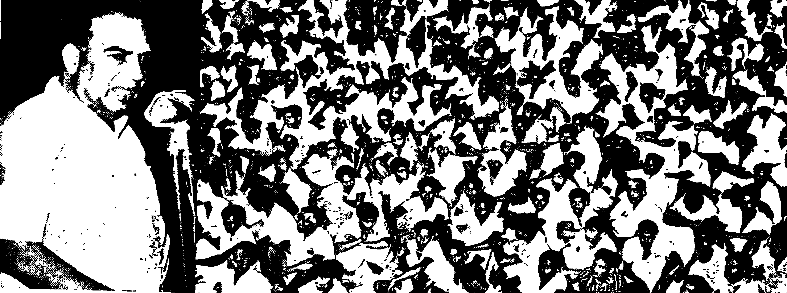

My release orders arrived on October 12. I broke my fast
after coming out of jail. I sipped orange juice in front of the people
gathered there and went home. My health was completely
shattered. Doctors wanted me to take complete rest. They said
that even talking to people would affect my health. Comrade
Krishna Pillai rushed home on hearing this. He forced me to
stay at home. He hung around like a watchman. To comrades
who called to meet me he would say gravely: _What, comrade?
What do you want?_ When they said that they had come to see
me, he sent them away with the words, _Do you want him to die?
If you love him, don't come to see him for the time being. When
his health improves, he will come and see you._ Although I
wanted to see them all, I did not say a word out of fear of Comrade
Krishna Pillai. It was impossible not to submit to that loving
discipline. It was a manifestation of the abiding loyalty that
Comrade Krishna Pillai had towards friends and co-workers.
It was that loyalty and affection that made him what he was.

I resumed my daily activities after a few days' rest. It was a
time of agitations and struggles for the day-to-day needs of peasants
and workers. I started participating in these struggles and assisting
in their organisation. Cases continued to be launched against me
for speeches made in some places. I came out on bail and contested
the cases.

A noteworthy incident occurred at this time. We arranged
a programme at Madikkai village in August, 1947 to collect funds
for _Desabhimani_. We decided to arrange for a house-to-house
collection. The local comrades made arrangements. The police
were agitated by this. They started following us to each house.
Finally, they came along with us. I was very annoyed and scolded
one of them. He telegraphed the Inspector General Mangalore. _They are
going to kill us,_ he wrote. A van-load of special police arrived the
same day. They descended on us at the village and started beating
everyone. They went to the extent of breaking even the collection
bowls of beggars. They pounced upon everything that they
encountered on the road. All in all, they created a great
commotion. The people were incensed and staged massive
demonstrations. This unnerved the government.

Fairs were in progress throughout Malabar at the time I was
released. They had been organised for collecting funds for
_Desabhimani_. The rich and the poor alike participated in them.
The fairs then developed into a big annual event. There
was not a single village where these melas were not held. Cultural
programmes and speeches formed part of the programme. I
toured the whole of Malabar taking part in these fairs. Chagrined
by this mass upsurge, the government arrested me at Tamarasserry
on December 17, 1947. The charge against me was that I had
threatened to murder Head Constable Kurup by throwing him into
the river.

I found myself a detenue prisoner once again. What exactly
was the charge against me? _My going to jail in 1937 and 1942 and
my struggles against imperialism._ I was undergoing punishment
for having worked before as a Congressman. I was sorry and
ashamed that a Congress Government should lay such a charge
against me and keep me in jail. Jail life once again. Terrible.
For how long? Even that remained a mystery. I was being
held under the preventive detention ordinance for which there was
no fixed term!

I was taken to Vellore jail. There were already many detenue
prisoners when I arrived there. It seems the Government felt that
it would be dangerous to keep me there. They decided to shift me
the next morning. I was separated secretly from the other prisoners
the next morning and escorted to the Rajahmundry jail in Andhra.
Most of the prisoners there were Andhra detenues. They were all
lodged in a special cell inside the jail. I was put in an outhouse
outside the jail, to endure the scorching heat and solitary life. No
one except the warden was there. I spent two weeks in this sort of
confinement and discovered, not surprisingly, that living in such
conditions was not conducive to good health. I started a fast.
It was terminated after 20 days on condition that I would be lodged
with the other prisoners. A little afterwards I was shifted to
Coimbatore jail. I was placed in solitary confinement here too.
After a few days M. R. Venkataraman was brought over from Vellore
jail. Facilities were quite poor. Both of us started fasting. We
were granted some facilities at the end of 26 days of fasting, but we
resumed the fast after 10 days as many of the assurances we had
been given were broken by the jail authorities. After another
ten days' fast our demands were finally conceded.

We were shifted to the Cuddalore jail. All detenue prisoners
in the State were kept there. I spent nearly three years in that
jail with Andhra comrades. It was an eventful life. There were
about 400 detenue prisoners there. All except Comrade Venkataraman
and I were from Andhra. There were some who had been
transferred from the Telengana jail. Brave young men; some of
them had fought as guerillas. They had suffered a lot. Even
inside the jail, we had to conduct agitations for edible meals and
other facilities. An ex-minister's son, Thomas, was Superintendent.
He was an immature and haughty official who was responsible for
most of the unpleasant things that happened in the jail. But the
constant _lathi-charges_, firings and fasts were a result of the Party's
hard line. There were two firings in the Cuddalore jail. Three prisoners
died—two detenues and an ordinary prisoner. The first agitation
was against the practice of confining the prisoners in the lock-up
at night. We took our stand against this after giving advance
notice to the authorities. At 3 o'clock that afternoon the Inspector General of the
jail held a police march-past. The jail Wardens also accompanied
the policemen. They started beating us. We resisted, and threwstones
and other projectiles at them. We clambered over the jail building
with stones and sticks in our hands. This lasted for about an
hour. They finally opened fire. A comrade from Telengana and
another from Ramnad were killed, and very many were injured. They
surrounded the prisoners after this and beat them up severely. The
injured were removed to hospital. Medicines and other facilities
were either not available at the hospital or were inadequate.
The others started a fast. 300 people joined in the fast which
lasted five days.

After that, terrible brutalities were unleashed in jail once more.
They put us under 24 hours' lock-up and withdrew the special
facilities of detenue prisoners. We decided to conduct another
agitation against this. A Telengana comrade died in that agitation.
Many were injured. These struggles were forced on us by the
excruciating misery of jail life. One has to admit, however, that
the Party's policy also played a part in this.

Similar incidents occurred in Vellore, Trivandrum, Salem and
other jails. Conditions in the Vellore jail were worse than ours.
Although there was no firing, _lathi charges_ were common there.
The man-hunt at Salem jail occurred at about the same time. Many
beloved and valued comrades were lost in this struggle.

M. R. Venkataraman and I were lodged in the same cell. We
used to file occasional affidavits and write to the Court as a matter
of course. A writ was filed in the Supreme Court against preventive
detention. It was based on a very important constitutional issue.
I was taken to Delhi for the hearing of this writ.

The journey was very interesting. I travelled in a special
First Class compartment accompanied by two Inspectors and twelve
policemen. The compartment next to ours was filled with policemen.
A dozen policemen would be ready at each station. It was
as though I would fly away if they took their eyes off me. I was
lodged in the district jail in Delhi. The jail conditions were poor.
I started to fast the moment I arrived there, which resulted in a
small change for the better.

It was a momentous law-suit. While in jail Rao and Reddy
of Madras used to assist me and the other prisoners in the conduct
of our cases. Their help was invaluable. The case was also argued
by them. The counsel was Sri M. K. Nambiar. It was the first
law-suit on a constitutional issue. Nambiar set forth his brief
in the Supreme Court for about six days. He argued that the
Preventive Detention Act was a complete violation of the constitution
and hence illegal. My arrest under the Act was therefore
unlawful. But the court ruled that the Act was constitutional.
It was therefore held that my detention also was lawful. But the
court declared that Clause 14 of the Act was illegal as it violated the
constitutional right of the detenue to move the courts for invalidation
of his detention. Their point was that it infringed the fundamental
rights guaranteed by Clauses 22 and 33 of the Constitution. This
judgement has helped a lot in safeguarding the fundamental rights of
those detained under the Preventive Detention Act. Moreover, the
arguments cited by Sri Nambiar in support of his contention that
the Act itself was unconstitutional are still hotly debated by other
judges and legal experts. Although that law-suit failed to bring
about my release, it was a great achievement in the sense that
raised an important constitutional issue. I returned to jail under
police escort. I can never forget my life in Cuddalore jail. I
picked up a little Telugu from our Andhra comrades who were
instrumental in saving me from being shot during the jail agitation.

Although the Supreme Court judgement was unfavourable
to my case, I was not prepared to remain quiescent. I filed another
writ in the Madras High Court. It was heard by Justice
Satyanarayana Rao. I argued the case myself. Large crowds
came to hear the argument. The court set me free on the last
day of the hearing. I was re-arrested after release at the door of
the court and escorted once more to Cuddalore jail. I filed
another writ petition which was heard two days after my re-arrest.
The court released me again. The judges specially ordered the
police not to touch me. The police did not dare to disregard this
injunction. I had been imprisoned in December 1947 and released
in 1951. Four years in jail!

I was unable to find a room to stay in, in Madras city. One
hotel agreed to give a room, but after an hour it refused under
police pressure. I telephoned Kozhipurath Madhava Menon, who
was a minister at that time, that I had no place to stay and that
hotel owners were not giving me a room to stay in. But my plea
went unheard. After all, it was a time of Communist persecution.
I finally managed to get hotel accommodation on my own.

There was country-wide fear of the police. My hotel was
surrounded by CID men. None of them was, however, bold
enough to come out in the open. Arrests and brutalities were
continuing. Sub-Inspector Palaniappan was terrorising the whole
of Andhra State. I decided that something should be done to
dispel this fear. Elections were due in a year. The Communist
Party was free to participate in them and to woo the voters. It was
vital that this freedom which so rarely came our way should be
effectively used. My main concern was to pave the way for this.

While I had been in jail there had been many changes both
nationally and internationally. It was a new epoch characterised
by the liberation struggles of colonial peoples. American imperialists
had intensified their efforts to bring European nations under their
economic and social hegemony. The Marshall Plan and the NATO
alliance marked the beginnings of this. The US set aside vast
sums of money for espionage work in the Soviet Union and other
Communist nations. But it was at this time that Chiang Kai Shek,
whose rule in China had been buttressed by American arms, was
chased out of the mainland by the liberation army.

The second Congress of the Communist Party met in Calcutta
at this time of crucial international developments. The Party's
policy and programme changed and in two or three months
it became the object of attacks on an All-India scale by the
government. In March the press and paper of the Central
Committee were banned. In April, the Party newspapers
_Desabhimani_, _Visalandhra_, _Swadhinatha_, _Navalokam_, _Nayazamana_
and others were banned. Its weeklies, _Naya Hindustan_ (Urdu),
_Janayug_ (Hindi), _Janasakthi_ (Tamil), _Navayugam_ (Malayalam),
_Aruna_ (Kannada), _Nairuniya_ (Oriya), _Janasakthi_ (Bihari) and
_Mathamath_ (Bengali) were also banned.

The police opened fire at the meeting of the All-India Students
Federation which was held at this time in Bombay. The government
thus came out in the open, having given the police a blank
cheque to crush the workers' struggles, as well as middle
class and students' protest movements. It was at this time that
communalists won decisive influence both inside the Congress party
and government. The voice of Patel and Tandon could be heard
at this time over all others. It was at this time too that Mahatma
Gandhi, who successfully toured Naokali in the interests of
communal unity and brotherhood, died of an assassin's bullet, a
martyr to communal hatred.

The food problem had become acute in Kerala. Workers'
agitations intensified at the same time. The Government resorted
to brutal repressive measures against it. On April 12, 1947
_Desabhimani_ was banned as a preliminary to this. Following
this, there were firings on the 15th at Tillankeri, on the 30th at
Onchiyam and on May 1 at Munayan Hills. Much before this,
i.e. even before the Calcutta conference of the Party in February,
the Party had been banned in Kerala.

There was regular police _raj_ after the strike at the Aaron Mill.
Hoodlums were organised to hunt out Party leaders. Atrocities
of a kind not seen even during the Moplah rebellion stalked the
country. The looting and burning of houses, beating of people at
random, and the raping of women, became everyday occurrences
and law and order became non-existent. Not content with all this,
troops were brought in and marched through the hinterland. MSP
camps and police stations were established all over Kerala. The
atmosphere reeked with the stench of gunpowder and blood.
Terror and indignation spread their tentacles among the people.
The Communist Party had not been banned at this time. This
so called legality did not protect its members from the systematic
campaign of arson, loot and murder that was launched against
them. Kanthalott and KPR were arrested at this time and almost
done to death. Lock-ups were filled with Party members and
sympathisers. The young as well as the old, the educated as well as
the unlettered—all became the victims of these outrages.

Comrades EMS and Krishna Pillai were underground at
this time. It was then that Comrade Krishna Pillai died of snake
bite, on August 19, 1948, at the hut of a worker at Muhamma. It
was a great blow to the Party. We could hardly believe the news
of his death when we first heard of it in jail. We were shocked
when we heard the whole story. Comrade Krishna Pillai was the
life and soul of the Kerala Party. He was the colleague and leader
of thousands of co-workers like me. His death moved us deeply.
It was many weeks before we could free ourselves from its pain and
shock. One thing consoled us. The light that Comrade Krishna
Pillai had lit in thousands of hearts would not die out. That name
would live for ever as a guiding star and a beacon light to people
striving for progress and a new life. Comrade Krishna Pillai would
live for ever in the hearts and minds of all those who believed in
justice and the brotherhood of man.

By 1949 two post-war developments of a momentous nature had
taken place in the international field. The first was the liberation
of China and the second the news that the Soviet Union had successfully
manufactured atom bombs. American power supremacy
collapsed against this reality. The traditional balance of power
between nations was substantially altered by this momentous event.
The liberation of China and the attitude of imperialist powers
towards that event prompted Asian countries to re-examine and
modify their former views on the international scene so visibly
altered in so brief a period. Provocations with an implicit threat
of war were noticeable in both Asia and the West.

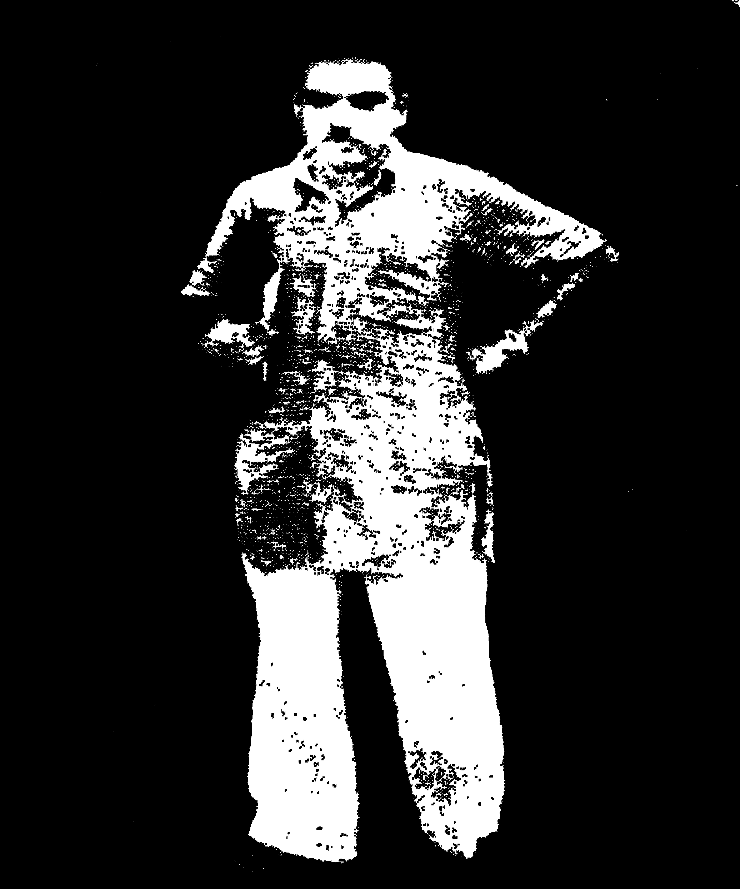

But there was another side to the coin. The anti-war stand
of the peoples of the world as a consequence of the miseries of two
World Wars was becoming more pronounced. The peace movement
came into being as an expression of this growing mass attitude,
and was able to inspire a world-wide campaign against nuclear
weapons.

At the time attempts were being made in India to overcome the
country's economic problems through American aid. The draft
of the first five-year plan was released. There was no place in it
for heavy industries.

Along with plans for economic betterment, plans were also
concocted to suppress the struggles of the masses suffering on
account of unemployment and poverty. Great repression was
unleashed in Malabar and such other places.

Party candidates contested the District Board elections being
held at the time (1948). The Party made such an emphatic reappearance
as to confound those who had vowed that there
would be no trace of Communism for a century. The Party's
sympathisers and the oppressed people voted for it. This was
bewildering to reactionaries and officials. Bent on stemming this,
the Party was banned on the very day the votes were counted.
Mass arrests and repression were intensified. It was at this time
that the massacre in the Salem jail occurred. Unarmed prisoners,
especially _class C_ prisoners, were beaten to death one day in the
jail. Sri Kozhipurath Madhava Menon was then Minister for
Jails. Terrible atrocities were perpetrated both inside the jail and
outside. In Madurai and Tanjore in Tamil Nadu, comrades were
shot dead in public view. Countless people were shot dead
in Telengana too, when the brave peasants conducted their
historic struggle against the Nizam's rule and against feudalism.
The peasants of Telengana rose in arms against thousands of
policemen and troops. It shook the Indian government badly.
Troop reinforcements were sent to Telengana to quell the uprising
and crores of rupees wasted. It was in the name of law and order,
an empty phrase, that Communists were hounded throughout the
country.

Attempts were made to put down the peasant movement in
Chirakkal district. Thaliyan Raman Nambiar and others were
sentenced to life imprisonment. Peasant leader Rairu Nambiar
was taken out of the prison by Inspector Ray and shot dead atop
a hill. The MSP did not even leave old women like
Kunjakkavamma alone. The heart-rending tales of the ruthless manhunt
of the MSP are still green in the people's memory.

# Chapter 18

It was an atmosphere of all-pervading terror and pain that I
encountered when I was released from jail. Man's basic civil
liberties were trampled underfoot. Although the leaders advertised
incessantly that the aim was to build up a welfare state through
democratic means, the signs of mistrust and fear were visible
everywhere. Although new elections to Parliament were promised,
it was not clear to the people how these would be achieved in
practice and if they were, how fairly. As for the Communist
party, it was a period of ideological confusion. Some Party
comrades felt that the policies and programmes adopted by the
Party in the wake of the Calcutta Congress were a mistake. But,
how to proceed, how to act? How could the Party work legally?
What stand should the Party take towards the new elections? It
would not be incorrect to say that the Party was caught up in a
whirlpool of confused ideas at the time.

When I came out of jail, there were differences of opinion on
whether I should go underground or work legally. But I had arrived
at a decision in this matter. I was convinced I could dispel by my
legal campaigning the terror and anxiety that prevailed among the
people at the time. Whatever happened, I would work legally using
the opportunity that was at hand. I stayed where I was. The Party
gave me permission. Thus a meeting under the red flag was held
in Madras after an interval of four years. It was a good meeting.
The people were in high spirits. I decided afterwards to tour the
whole of Tamil Nadu.

I went first to Madurai. A public meeting was arranged there.
A flag was hoisted at the site of the meeting which was on
the banks of the river. The people glanced at the flag and
went their way. They had forgotten the time they had last
seen a red flag. Barely a year had passed since Manavalan and
other worker-comrades had been tied to iron poles and shot dead.
It was usual at that time for people suspected to be Communists
to be shot dead. We were afraid that nobody might turn up for the
meeting in this atmosphere of fear. I went to the meeting exactly
at 6 o'clock. I found 100 people. But people began to drift in
gradually. In an hour's time about 10,000 had assembled. Midway
through the meeting there were 25,000 people. The people were
bitter against the government. They had remained quiescent all
this time because of fear. They expressed their hatred now that
they had an opportunity. This was what that meeting taught me.
I collected funds for the forthcoming election and for the Party
coffers.

In all, my tour of Tamil Nadu lasted two weeks. I went to
Malabar after this. I found unlimited enthusiasm there. Donations
totalling 30,000 rupees were received. We were able to open a
Party office and start a paper with that money. My task at that
time was to re-build the Party. I was able to accomplish this task
to some degree.

After the Malabar programme I toured Andhra for 15 days.
The conditions in Andhra at that time were more terrible than
in all other places. To hold a public meeting was a great thing
in itself, as it was a time of brutal repression and no one dared
to walk alone in places like Vijayawada. In all my meetings, I
spoke strongly against Palaniappan's man-hunt. This helped
create a new enthusiasm amongst the people who attended my
meetings in thousands. The meetings gave utterance to the unexpressed
feelings of the suppressed people of Andhra. The
freedom to hold meetings, talk freely and operate an office was
thus restored after three or four years of terrifying rule. Party
activities were gradually revived. Party leaders were either in jail
or underground. The important thing was to bring them out into
the open before the election. As our intention to participate in
the election became known, the leaders were freed one by one.
I was elected at this time as member of the Central Committee of
the Communist Party. All public work was at that time done by
me. Thus the heavy responsibility of preparing the people for
the elections fell on me.

I went to Travancore from Andhra. C. Kesavan's ministry
was in power. A month prior to my arrival in Travancore, a
meeting of Communist sympathisers was held at Alleppey to
consider the election. As the delegates' meeting was going on,
the police came and arrested Comrades T.V, Gouri, Kumaran
Vakil, Sugathan, Das and others. There were arrests after this
in all important Party centres.

I received an order of the District Magistrate as soon as I
reached Quilon. It forbade me to speak publicly anywhere in
Quilon district. I went to Trivandrum immediately. There were
police vans at the rear and in front of my car. I met Chief Minister
C. Kesavan at Trivandrum. He threw up his hands in helplessness
as it was a decision of the Congress Party. I was issued a
Prohibitory Order in Trivandrum too. I left immediately for
Alleppey. As I stepped into a hotel at Quilon on the way, the police
were all around me. Some student-comrades came to see me. A
bold one among them asked me, _Comrade, why don't you defy
the Prohibitory Order?_ I was pleased with his enthusiasm. I
explained the position to him. _I used to do the same thing at
your age; but I have before me a heavy responsibility today. The
Government needs to put me in jail. But the need of the country
can be best served at this juncture by keeping the party within the
law and making the maximum use of the limited freedom
available._

I bade them goodbye and set out for Alleppey, where I rested
in a hotel. The police did their duty here also. I set out
for Wayalar from there and reached Comrade Karunakara
Panikkar's house. The police surrounded the house. I was not
given a chance even to eat. I got angry and called the police
chief and thundered at him. The poor man said: _What can
we do? There are orders from above. If we don't obey them,
we will lose our jobs._ I felt that it would not be proper to put
the inmates of the house to inconvenience. Picking up a mat
I went to the Wayalar hills, the last resting place of the Wayalar
Comrades. I spread my mat atop a hill and lay there and thought
to myself: _I suffered hunger, misery and torture for a long time
to nurture the Congress. That Congress rules Travancore today.
My one time co-workers turn the wheels of power. I cannot
even sip a drop of water during their rule without the police watching
me._ I came to a decision. I would conduct Party work with
vigour using the limited freedom that I had. I lay there for about
an hour and a half, reflecting. The police stood guard in the
darkness and slush. In the meantime, the comrades of Shertallay
made arrangements for a car. I somehow slipped through the
police cordon and left. It was then 1am I went to Ernakulam.
The police were furious when they missed me. They searched all
four quarters. No trace anywhere. They finally set out for
Ernakulam. They camped around the hotel where I was lodging,
More, they even followed me right up to the Travancore border.
They returned after seeing me cross the boundary.

At the end of my South Indian tour, I went to Bombay to
campaign for election funds. I can never forget the reception I got
at the Bombay railway station. The Malayalees gave me a
tremendous ovation. They raised 7,000 rupees during my short
stay. Meetings were held in many places.

The All-India Kisan Sabha met at Calcutta from August
6 to 11, 1951. I was elected President, and the Secretary was
Bankim Mukherjee. Kisan leaders were all either underground or in
jail at that time. There were 1,982 firings during this period.
As a result 3,784 people died, 10,000 were injured, and 50,000 were
imprisoned. 82 were killed in jail.

Towards the end of 1951 a new experiment was initiated.
The Communist Party decided to give parliamentary democracy
a trial. The Party had made mistakes. It had over-involved itself
in heroic and adventurist activities. But these were all undertaken
with the welfare and interests of the people as the overriding aim.
Members of the Party had been willing to suffer any hardships for
this. Their selfless living had helped to forge a bond between
themselves and the people. It was because of this that the people
welcomed the Party wholeheartedly when it emerged after correcting
its mistakes. The 1951 election was a proof of this. Elections
were held in Travancore-Cochin in December, 1951. As the Party
leaders were in jail, the election was contested under the name
_United Front_. It was a union of the Revolutionary Socialist Party (RSP) and the Communist
Party. The United Front candidates did splendidly. Its success
presaged the change sweeping through other States too.

The new election was fought in an atmosphere of great excitement
and enthusiasm. The result was a blow to the enemies of the
Party who thought in terms of suppressing it. The Party achieved
a creditable victory although very many of its leaders were underground
or in jail.

I was the candidate for the Cannanore parliamentary
constituency. My Congress opponent was Congress President
C. K. Govindan Nair. I got 164,000 votes and Sri Govindan Nair
74,000. I thus won with an overwhelming majority. The trust
reposed in me by the people was a declaration of their loyalty to
the Communist Party.

The Communist Party and the United Front became the second
largest force, both in Parliament and in the State Assemblies as a
whole, in the general elections held in India in January, 1952, with
31 seats in Parliament and 239 seats in the Assemblies. In the
State Assemblies the Party and its allies won 34 per cent of the
seats it contested, and in Parliament 44 per cent.

There were 31 Communist Party members and sympathisers
in Parliament. The government did not care to recognise the
Communist group as the official opposition. They put forward
the novel theory that there should be at least 50 members to qualify
for recognition as the official opposition. The ruling party held
that a party of 30 members could only be regarded as a group. The
Communist Party thus started work as the only opposition group
recognised in Parliament as such. I was elected leader of this
group. The office of Leader of the Opposition in Parliament was a
very responsible position and I wondered how I could do justice
to it. But I felt confident that I would be able to acquit myself
creditably with the assistance of my colleagues.

A new life, a new environment, a new alliance. I found
myself in an environment calculated to ruin a man. First class
travel, comfortable chambers in Parliament, a surfeit of money,
magnificent quarters, and a life free of heavy responsibility. All
circumstances favourable to a life of pleasure. Is anything more
necessary to turn a man's head? Daily garden parties and tea
parties given either by the Prime Minister, the President or the Vice President.
In addition there were a host of invitations from the
foreign embassies. That was the setting in which ties of friendship
could be established with the fashionable men and women who
constituted the upper crust of society. On top of all this, there
were state banquets that provided us with an opportunity to shake
hands and to have tea with Chou En-Lai, Bulganin, Dulles, Tito
and other foreign dignitaries.

On the other hand, people from all strata of society were
arriving daily to meet Parliament members to present petitions
and memoranda. We were thus faced with a combination of
circumstances that brought us face to face with temptations of
authoritarianism and luxurious living, as well as of self-conceit.
Communists like me who had suffered for want of a change of
clothes to wear, for want of shelter for a night's sleep, for want of
money to pay for our tea and bus fare, and who were scoffed at
by the elite of society, were particularly liable to be spoilt by this
sudden onset of luxury.

I was worried by two things as I entered Parliament. First,
I was anxious about whether I would be able to do any useful
work at all in this environment. And secondly, whether I would
be able to emerge unscathed by the temptations of this system
after five years.

Many from the Congress side tried to rope in pliable people
from the Opposition. If the person was weak-willed he ran the
risk of being ensnared. Inclusion in delegations going abroad and
in committees were some of the temptations that were used to
snare the unwary away from the path that their conscience dictated.

The Government was scared of the Opposition—particularly
of the Communist Party. It was almost customary for them to
rant unnecessarily against the Communist Party in every speech
and to repeat ad infinitum that the Communist Party was an agent
of Russia. They were ready to invent the starkest of untruths
to this end.

This came out very plainly on a number of occasions. While
speaking in the Lok Sabha, the Home Minister once charged that a
person deported froin a country for conducting espionage activities
there was working in the Central Office of the Indian Communist
Party. We challenged the Government to substantiate that
statement and said that we were ready to throw out the man from
the Party in that event. But they wriggled out with some
platitudinous subterfuge. There was thus the ridiculous spectacle
of an allegation raised by the Home Minister and supported by
the Prime Minister going unsubstantiated. Later on, the Minister
made a statement in Parliament that we were getting books _gratis_
from Russia. The statement was exposed when we offered to
produce records of the financial transactions executed through
banks.

There was thus on the one side a desire to vilify the Opposition
at any cost. On the other, a tendency to ignore the Opposition.
It is a fundamental courtesy in democratic procedure to consult the
Opposition on important national and international developments.
A committee including Opposition parties had been set up for this
purpose in Parliament. But the ruling party did not care to consult
the Opposition even in such strategically important matters as Goa.
Why say more? The statement issued by Finance Minister
Deshmukh when he resigned from the Cabinet throws more light
on this. Even in such matters as Samyukta Maharashtra, those
responsible for the decision did not consult their Cabinet colleagues.
The overall framework was such that one did not feel hopeful
about this much-eulogised Parliamentary Democracy.

But it would be folly not to consider the other side of this
picture. The trend of activities of the Communist Party and other
Opposition parties changed after they entered Parliament. The
question of the common man's daily requirements was raised
in Parliament for the first time. Although debates were disallowed
on several issues, statements had to be made in Parliament
on this matter. Several important Acts on security of employment
and minimum wage were passed because of the pressure exerted
by the Opposition. When the Opposition introduced Bills helpful
to the common man, they were obliged to say, _We propose to
introduce similar legislation._ The Opposition Bills were never
adopted, but they had to table somewhat similar Bills themselves,
although these were never quite as progressive as ours.

But this was entirely inadequate. If this system is to yield
any beneficial results, one pre-requisite is a strong Opposition.
This can only be when the Government does not have a
huge majority to swamp the Opposition, and the latter is strong
enough to threaten the Government's existence whenever it sidesteps
the public interest. It is also necessary that public opinion
is responsive and alert. Otherwise, this Parliamentary System
tends to become a farce. An important point in this matter is
that the very future of Parliamentary Democracy depends on the
mutual co-operation of Opposition parties and their unity in the
face of common issues.

# Chapter 19

Some important developments on a personal plane occurred within a
year after Parliament assembled. One of these was my visit to
China, Russia and other countries as well as my participation in
the Pacific Ocean Peace Conference held in China and 19th Congress
of the Russian Communist Party. The other was that I married
again, this time with a new outlook and on a new basis.

My marriage took place on September 10, 1952. I married
Susheela who was the niece of Comrade Karunakara Panikkar of
Cheerappanchira in Muhamma village of Shertallay _taluk_.

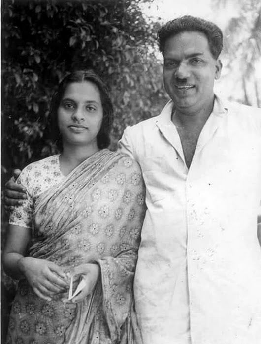

Comrade Karunakara Panikkar's household was almost a Party
stronghold. Comrade Panikkar was careful in bringing up Susheela
in tune with such a household. He played a considerable part in
bringing about our marriage.

He was an unobtrusive Party worker. President of the
Muhamma coir factory workers' union even before the agitation
for responsible government of 1939 began, he was in the forefront
of the agitation for responsible government. The Government
arrested him and also confiscated his coir factory. Although the
Government offered to restore the factory on condition that he
retracted his political stand, he was resolute in his refusal to
compromise his principles. He was one of the leaders of the
historic Punnapra-Wayalar struggle conducted by the working class
of Alleppey and Shertallay _taluks_. He went underground along
with other leaders in connection with that struggle. The Government
confiscated his house and land as well as his coir factory. As he
did not yield this time either, he lost the factory. The properties
were restored o him after three years. After 1948, he spent some
time in the underground. Although he retired in later life from
active political work, he remained a good friend of the Party till
the end of his life.

Comrade Panikkar's immediate family and relatives maintained
close ties with the Party. Gopalan Chettan, husband of Sarojini,
Susheela's elder sister, was the Party's Branch Secretary at Muttam.
He died a few years ago of heart failure. Sarojini was employed
in a Government department. Sir C.P's government dismissed
her for the sole reason that she belonged to a Communist family.
Even in the midst of various privations, she and her children
remained good friends and active workers of the Communist
Party. Her eldest son is a Party member.

Comrade Panikkar's little family gave refuge to me and other
comrades when we were underground. When I was camping there
Susheela was a keen young student who tried to follow and understand
political developments. The company of this vivacious girl
provided some relief to me, living underground, as I did, for twenty four
hours of the day. I delighted in instructing her on political matters
and assisting her in her homework. The peaceful atmosphere
of that small family consisting of Panikkar, his sister and three
children turned my thoughts to the pleasures of family life. I
became almost a member of the family in my three months' stay
there, and developed a strong attachment to young Susheela.
Initially I was hesitant about proferring my suit, for what had 1 to
offer save a miserable existence to that darling girl? I tried to
overcome my emotions and longing, but found it impossible to
put the exquisite image of the young girl, who overwhelmed me
with affection, out of my mind.

Even after leaving Comrade Panikkar's house, I tried to forget
her. I stopped writing to her. As I emerged from the underground,
a comrade informed me: _Susheela treasures your photograph.
She is sad that you did not write._ I decided that I would see
her. Comrade Krishna Pillai offered to come with me. But we
could not make it. I was arrested. She came to see me while I
was in Coimbatore jail. I felt an even greater attachment towards
her, now more mature and poised. We decided then and there
that we would get married as soon as I was released from jail. She
helped me to some degree in keeping myself in touch with the
Party, now banned. She was expelled from several colleges,
because her correspondence with me was traced by CID officials.
I came out of jail when she was studying for the BA at Alleppey
college. Our marriage could not be celebrated immediately because
of the elections, rush of work and opposition from relatives. As I
returned at the end of the Parliament session, I toured the famine
affected areas of Ambalapuzha and Shertallay _taluks_. One evening
during that period the Party made arrangements for our marriage.
Our marriage took place under Comrade K.C George's ministership
before a vast gathering of friends and comrades at the Alleppey
union office. There were no marriage ceremonies for our wedding
except an exchange of red garlands made by the Alleppey workers.
My long cherished dream of a life-partner ready to share my joys
and sorrows, my hopes and fears, my work and leisure, had at
length come true. The long wait of nine years added sweetness
to our union.

I feared whether Susheela, who had grown up in a different
environment, would get along with my family. But she was able to
integrate herself with my family and become the darling of my aged
mother. This was a great relief to me. She was also able
to get along with my brother's family.

Susheela is not only my wife but also a comrade of my Party.
It is a source of pleasure as well as of difficulty when both husband
and wife are full time Party workers. Our daughter Laila suffered
most from this. She was actually brought up by Susheela's mother
and Sarojini.

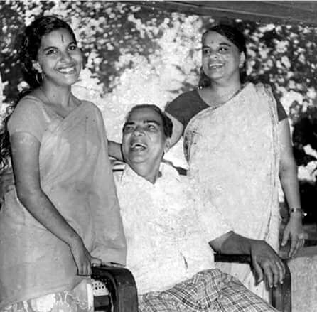

Susheela helps me a great deal in my present political activities.
But for her help and care I certainly would not have been able to
work as much as I am doing now. She plays a great role in keeping
me in good health. She dutifully fulfils the task of looking after me
as a Party comrade. At the same time, she looks after her own
work as a Party worker.

Like me, she too is sickly. When I fall ill, she is there to
attend on me and when she is ill, I look after her. Fortunately
we are seldom both ill at the same time. We want our daughter
Laila to grow up in the same environment and develop the same
ideals, but no one can foretell the future. Only time can decide
that. Comrade Panikkar and Susheela are both responsible for
turning Susheela's family into Party sympathisers and workers.
I myself had only a small role to play in that. I am hopeful that in
the future also that family will maintain this tradition untarnished.

# Chapter 20

I set out for Delhi from Calicut on September 16, 1952. At
1:30am on the 18th I flew from there for Hong Kong to attend
the Asian Pacific Ocean Peace Conference in China. A large
gathering consisting of friends and comrades were at Palam airport
to see us off. With me were Dr. Kitchlew, the aged and revered
leader of the Indian delegation, the Bhopal Congress leader and
former Chief Minister Malaviya, Dr. Alam of Aligarh University and
business magnate Anjaneyalu Kettuppalli of Andhra. We reached
Calcutta at 4am Subjoda Banerjee, Mrs. Pankaj, Acharya
Haridas Nandi, Dr. Mehta, Mrs. Mehta, Ramakrishna Panth and
others were there with us. Our plane thus left for Hong Kong
carrying 18 people working in different fields. We reached Bangkok,
capital of Thailand, at 10 the next morning. After a little rest we
resumed the flight reaching Hong Kong at 3am That beautiful
city of two million people is full of magnificent buildings and broad
avenues. Although under British domination, it was filled with
Americans. The city, perched on a hill top, presented a fascinating
sight as we viewed it from the top of our hotel. It was a city of
thousands of industrial workers. Cotton mill workers alone
numbered 50,000. Although civil liberties were restricted, a strong
trade union existed there. We learned the same day about an
INTUC organisation under American control.

Press representatives came to meet us. They wanted to know
whether the peace movement belonged to Communists.
Dr. Kitchlew and I spoke to them for about half an hour. Six of the
local newspapers were dailies. Three of these were English dailies
which were tools of Anglo-American propaganda. We were
told that the other newspapers which were a little progressive
suffered from periodical bans as well as restrictions and other
difficulties.

Leaving Hong Kong on the morning of September 20, we
reached Shanton railway station. That was the border of China.
China was only a bridge away from that station. I spoke to the
train crew with the help of an interpreter. They spoke gladly
about China. They said that many changes had come about in
four years and their salary had increased 20 times. Their faces
reflected happiness, hope and well-being.

Volunteers and peace committee members were there at
Shanton to welcome us. Before we resumed our journey from
there, I talked to a girl serving in the railway with the help
of an interpreter. With great pride she spoke about China.
She said the new Government had brought happiness and plenty
into their lives. I was amazed by the knowledge of world
affairs shown by that ordinary railway worker. She knew a
great deal about India and Nehru, and even about Nehru's latest
statement that the five big powers should jointly end the war in Korea.
She also knew about the conference that we were attending. I
momentarily compared her knowledge with that of our own
graduates and post-graduates, who write in examination answer
papers that Cariappa is the Prime Minister of India. She told me
that everyone in China spent two hours a day studying and reading.

We reached Canton by the next train. Thousands of people
had gathered at the railway station to receive us. We left for Peking
after the day's dinner reception. The reception at Peking airport
was touching as well as unforgettable. Smiling little children
welcomed us with bouquets of flowers. A huge concourse of
people, including delegates from the Soviet Union, Turkey and
Indonesia, received us.

I stayed at Peking Hotel, the largest in Peking. The six-storey
_Peace Hotel_ (so termed because all the delegates to the Conference
were put up there) which towered into the sky as though to guard the
honour of Chinese workers was completed in just 75 days. On
September 26 I went to see the Great Wall, one of the most remarkable
structures in the world. It was a journey of four hours from
Peking. We reached the nearest railway station at noon leaving
behind us fields, valleys and river beds. The next mile was a
strenuous climb over a hill. We were tired as we reached the top
of that great wall. But the view from there was splendid. One
could see great walls rising one by one over each other. Everyone
will admit that this wall, erected in ancient times to protect China
against foreign invasion, is a lasting monument to the hard work
of the Chinese people.

As there were still two or three days more before the Peace
Congress was scheduled to begin, I had an opportunity to go sightseeing
and to familiarise myself with the people. I also attended
the Chinese National Day celebration. That mammoth demonstration
attended by nearly seven million people lasted nearly six hours.
Comrade Mao took the salute as the parade passed the dais. It was
a very exciting demonstration by people of all sections of the population
who lost themselves in the spirit of the occasion. I felt that
the demonstration was an expression of the progress achieved by
the Chinese people in such a short time. I was particularly
heartened by the general spirit of good cheer and merriment that
prevailed.

Equally unforgettable was the banquet given by Comrade Mao
on September 30. I have attended many receptions. I have seen
various types of garden parties frequented by the highest levels
of society. But now for the first time I was attending a garden
party that glorified the life of the worker and honoured work. I
felt that the presence of worker-leaders and peasants, who occupied
the very front row, gave an added lustre to that banquet. It was
a novel and gratifying experience for me.

Nearly 400 delegates from 42 countries who attended the
Peace Congress that began on October 2 held prolonged discussions
on world peace. The Congress was important in several respects.
It paved the way for a universal agreement on the necessity for peace,
the ways of attaining it, and the establishment of cordial relations
between nations. As the first concrete step towards the lessening
of world tension and developing the world peace movement in
its present form, it was a very important conference. It would
not be incorrect to say that India and China agreed on the _Panch
Sheel_ or five principles of co-existence as a result of this movement.

Another pleasant surprise for me at this conference was to
discover the great regard that the people of the world, particularly the
Chinese, had for India. As I stood up to speak as India's representative,
there was continuous applause for five minutes which delayed
my speech. At every stage of the speech, there was applause. I
forgot myself in their demonstration of joy and spoke for half an
hour extempore, disregarding the notes that I had prepared. The
people I met on the streets also showed tremendous affection.
Even little children would show special interest when the name
India was mentioned.

Even before the end of the Peace Congress, Comrade Hardev
and I left for Moscow to attend the 19th Congress of the Soviet
Communist Party. Because of bad weather, we reached Moscow
only on the 7th. The meeting had begun on the 5th. I wanted to
be present for the Congress at least on the 8th, but had a bad cold.
I hoped to go for the Conference after taking some medicines,
but in the meantime a queue of doctors started arriving in my room
one by one, and did not allow me to leave. I was confined to
my room for two days with pills and electric treatment. I was
finally allowed to attend the Conference on the 11th.

I was seated on the dais among the fraternal delegates. 4,000
delegates and an equal number of visitors attended the Congress.
There was detailed discussion on the draft of the new five-year
plan, a five-hour working day and doubling of wages. Discussions
had been held earlier on the same subjects in factories and collective
farms. The Congress amended the draft in the light of
these discussions. Moreover, some ministers and delegates who
had not adequately discharged their responsibilities were severely
censured.

We went sight-seeing in Moscow that day. We visited leading
research institutions and the Moscow University where 120,000
students studied. The University was housed in a 25-storey
building, with built-in park, cinema house, factory, and concert
hall. There were elevators leading up to all these places. New
buildings were coming up.

We went afterwards to see the Bolshoi theatre. I have never
in my life seen such a colossal and magnificent theatre. Nearly
10,000 people could be seated inside. There were nine balconies.
One had to use opera glasses to watch the performance from the
upper balconies. Some of the finest dramatic and musical performances
in the world are featured here. I was quite entranced
by the magnificent dramatic sets I saw.

As the Conference was in progress, we could not do much
sight-seeing. The meeting ended on the 13th. I spoke for five
minutes giving India's salutations to the Conference. I had the
same experience here as in China. When the words Indian delegate
were mentioned, the delegates gave me a standing ovation. There
was applause at the end of each sentence. When I concluded, they
again rose and applauded. I felt proud of our country. How
much others love and respect us!

Comrade Stalin spoke to the Conference on the concluding
day. Each sentence of his was received with applause. I found
their hearts overflowing with love and respect for Stalin. The
Conference ended with the Internationale.

There was a banquet next day at the Kremlin palace. India
was given the fourth place near Stalin. When the time came for
toasting India, Stalin came to me, brought the glass near and
said simply: _To India._ He enquired about my own and
Comrade Ajoy's health. He asked me to meet him before I left
the country. But Stalin died before I left Russia. On the day after
the banquet, doctors again examined me, this time at a clinic. A
number of doctors then discussed my symptoms among themselves.
This was how they treated patients there.

Before the result of the Conference could be known, some 40 of
us left for Stalingrad. We saw fried chicken, ducks, eggs and
groceries being sold by women at the station. We learnt that these
women had joined collective farms, but that these commodities
had been produced privately by farming their own yards.

We reached Stalingrad. I found many new buildings under
construction there. The scars of the war were terrible. But
the speed with which post-war reconstruction was going on was
amazing. We saw the museum there. It contained many historic
remains from 1918, the relics of the heroes of the liberation and
the war period. There were even presents sent from Indore and
Punjab following the Stalingrad victory.

I went to see a plant making mechanical ploughs—a large
factory. Every single worker was a member of the union. The
union had its own building. It contained a reading room, a club,
a cinema hall and class rooms. Workers there could not only work
but also develop themselves physically and intellectually. We
visited the hill called Vavayov Kurggan where a battle was fought
against the Germans. We could see vestiges of the war. We also
visited the factory named 'Revolution'. The workers here had the
same facilities as those in the other factory.

The next morning we went to see the Volga-Don canal. We
saw at a prominent place in the city the graveyards of those who
fell in the battle. After paying homage there, we boarded the
vessel 'Maxim Gorki' which was waiting for us and set out to see
the canal. The Volga-Don canal proves that miracles can be
achieved with human effort, the power of machines and scientific
know-how. An artificial sea had been created at a place called
Similianskaya. It was 25 miles, wide and 150 miles long. The
water from this reservoir is pumped 200 feet up, then lowered
100 feet. The canal is built at the level of the Don river. This
scheme irrigates 1,200,000 acres of farm-land. There is a network
of subsidiary canals here too. On the banks of the canal are
gardens on level ground. We were told by the engineers who
built it that the blueprint for this canal existed as early as the
17th century, at the time of Peter the Great. But until the time of
the Socialist Revolution people who had vested interests in the
railway stood against the scheme for the sole reason that it would
affect the profits of the railway. After the Socialist Revolution a
centuries-old wish of the people took concrete shape. I saw at a
pumping station a machine that draws in small fishes from distant
seas.

We saw only the canal that day. The following day we
reached the Simiianskaya lake. It did not look like an artificial lake.
Water stretched as far as the eye could see. A small sea with waves
rising and falling. One could see many magnificent buildings and
their gardens along the sea-shore. These buildings were constructed
by the Government for those whose homes had been submerged
by the water.

The doctors examined me again when I returned after visiting
Stalingrad and Volga-Don canal. They recommended that I
should spend at least 2 weeks in a sanatorium. Comrade Hardev
and I left for the sanatorium. We went to the Barvika sanatorium
which was 25 miles away from Moscow.

Medical examinations began again. The doctors enquired
about all my ailments since childhood. Treatment was prescribed
in a week. With the new treatment old ailments reappeared. I
was given a special diet in accordance with the sanatorium rules.

Life in the sanatorium was very pleasant. Each patient had
to take some special exercises. Even bed-ridden patients had to
take these exercises. As it was winter, the lake nearby was frozen.
Children caught fish from crevices that they made in the ice which
was as hard as stone. We used to go there for strolls. One could
play and see films in the sanatorium.

The presence of smiling nurses, who worked all through the
day and night looking after the comforts of patients, was a pleasant
surprise. They were as proficient in medicine as doctors. Many
of them were preparing for medical degrees. For every 24 hours work
they would get 2 days off. During these 24 hours they would
look after even the smallest needs of the patients. Seldom have I
seen people sn earnest about their work, so full of sympathy and
tact. After my operation, they would tune in Indian music and news
on the radio for my relaxation. Such heed to the likes and dislikes
of individual patients was admirable. It was natural that their
contented life would give them the ability, patience and readiness
so necessary in their work. I learnt that nearly half of them
became doctors later on in life. Indeed, they had the time and
facilities for this. Any nation that emulates this system will be
able to create the healthy atmosphere so necessary in hospitals.

I went to see the famed underground railway of Moscow while
staying in this sanatorium. One could go anywhere in the city
in these underground trains. The subway network had 40 stations
in Moscow, each station with its own entrance. While at one
station, one saw sculpture depicting scenes from patriotic wars,
another station had pictures of costumes of different sections of the
people and so on. I was told that these displays at railway stations
had been arranged for those who were unable to visit museums.

I was able at this time to participate in the November 7 celebrations.
I took part in the meeting held on November 6 at Bolshoi
theatre. Comrade Stalin was there at this meeting. I took part,
along with foreign diplomats, at the celebrations held the next
day. I was seated close to Lenin's tomb with the diplomats sitting
opposite. On the dais in front were Stalin and other leaders. The
military parade alone took an hour and a half. The procession
of people lasted nearly six hours. In the procession were members
of the public, workers who had excelled in their work, model
farmers, actors and writers. There were even little children who
were most excited when the procession passed Stalin and other
leaders. They were showing their abounding respect and love for
the leaders who stood with them in their march from poverty and
misery to plenty. I was thrilled by the love and oneness shown
by the people towards those who worked for them.

I presented Comrade Stalin with a silver trophy on behalf of
the Indian Communist Party.

I returned to the sanatorium after the demonstration. On
November 23 I had a sudden attack of pneumonia. What happened
later is still a dream to me. I only remember that I was afflicted all
of a sudden and taken immediately to the Kremlin hospital in
Moscow and operated upon. I learnt later that there were fears for
my life even after the operation. I had acute appendicitis as well as
double pneumonia. Death was certain unless I underwent surgery.
An operation was hazardous as I had double pneumonia. In the
absence of any alternative, I was finally operated upon without
anaesthetics. I suffered terrible pain. The operation lasted
three hours. I lost consciousness after two hours. These things
I learned later for then I was in a coma. I was in pain for a month
and a half after the operation. As food particles came out through
the stitches, these were reopened and allowed to heal on their
own. This took three months. I survived only because of the
great advances in medicine in the Soviet Union and the constant
care of doctors and nurses. My body was riddled with ailments,
old and new. The treatment for one ailment would aggravate
another. Without medical care for a long time, the ailments
had become acute. Curing me was a difficult task for the doctors.
But they applied themselves to it with great earnestness. As it
was very cold, I was removed after three months, to the Gagra
sanatorium on the doctors' advice. On our way there we passed
through Restov, Ukraine and Caucasus. There were 25 sanatoriums
in that bewitching town. These sanatoriums for workers and
other toiling people were fully equipped. My sanatorium was
close to the sea. It was a fine health resort. Most of these
sanatoriums were owned by trade unions and other institutions.
They were used mainly as health resorts for workers.

I had occasion while in the sanatorium to see a Soviet election.
The quietness of the election amazed me. There was no rush or
scramble. People came, cast their votes, listened to music and
watched films. Everything was normal. I found the candidate
of a nearby constituency participating in a cultural programme
near the booth I visited. It seemed incredible to me. When I
talked to him, he told me, _I have told my voters what I had to
say. I have worked for the country for a long time. I have kept
the promises I made the last time I stood for elections. This time
too I have told the voters what I will do in the future._ It is
up to them to take a final decision. There is no point in pressurising
them. This is why I am not visiting my constituency. I talked
to some of the voters. _We vote for those who keep their word.
We vote now for those who we know will keep their
word. If they do not do so, we have the right to unseat them.
Therefore, we are not afraid of electing anybody who seems
promising._ An election devoid of rush and hurry, jockeying and
violence was a new and fascinating experience for me.

My stay at Gagra helped restore my health. The mild sunshine,
pleasant cold spells and strolls on the beach were all very agreeable
and invigorating.

On the morning of March 3, Comrade Nikrasov informed
us that Comrade Stalin was ill. The singing and merry-making
gave way to sadness. I woke up a little late on the 6th. I was
greeted by tearful eyes and a choking voice. Stalin was dead. With
the doctor's permission I set out for Moscow at 4 o'clock with a
doctor and three others. On the way I found pictures of Comrade
Stalin displayed in all houses and shops. The photograph was
framed with red flowers and black-bordered red flags. I found
people from all walks of life were grief-stricken and felt that
everyone had a broken heart. People streamed to Moscow in cars,
planes, trains and on foot to pay their last homage to their leader.

We reached Moscow on the 8th. It was a changed Moscow.
Columns of silent people. Mile-long queues all over the place.
People had been standing for hours shivering in the biting cold.
They were determined to have a last look at their leader, no matter
how long they had to wait. An entire populace was streaming to
Moscow. The flow of people lasted three nights and three days.

We entered the hall where the body lay, I passed to the next
room after laying the garland that I had brought over the body of
Stalin. I then stood with the guard of honour along with others.
Later I secured a chair and sat close to the hearse watching the
endless stream of people. The hall was full of flowers.

We went back to the Kremlin the next morning. The coffin
was removed from the hall at 11:30pm Leaders, ministers,
colleagues, foreign diplomats and others followed the coffin.
Comrade Stalin's son was also there. The coffin was installed
close to Lenin's tomb. The people dispersed in silence.

It was now nearly eight months since my arrival. The Party
had cabled me that my return home was urgent. I visited a few
more places before leaving. One of these was the oldest textile
factory in Russia, 145 years old. The first thing that one sees
there is a monument for workers who fell in the October revolution.
Nearby were photographs of model workers of the company.
This was one of the special features that I noticed in China, Russia
and other socialist countries. Whether it is the factory, school or
hospital, the pictures of exemplary workers will be displayed
prominently. This system that respected human labour and ability
impressed me very much. To our eyes, accustomed to see only
photographs of employers and not workers, this system was both
appealing and thought-provoking.

This factory where 8,000 workers were employed has now only
6,000. But still production has increased by 40 per cent. Production
is stepped up there, not by squeezing workers but by educating
them, by awakening their patriotism and nationalism. A
worker can rise to be Manager or Director. The workers are not
afraid of managers. If the manager errs, the factory inspector
elected by the union can fire him. The manager cannot dismiss
workers except when the union decides to, after discussing the
matter at a general body meeting.

Most of the workers were women. Healthy faces brimming
with happiness. I thought for a moment about the women of our
country who go to work in factories after leaving their little ones
at home. The women in that factory which had nurses and kindergarten
schools had no worries at all about their children. All big
factories had poly-clinics, hospitals, night sanatoriums, rest-houses
and summer resorts. This factory had a training school for the
education of workers. Another one had an evening school, library
and a cinema hall accommodating 400 people. There was a night
sanatorium with 19 doctors and 40 nurseries and accommodation
for 1,000 persons. Workers are admitted there in batches, month
by month, and given good treatment and diet under medical advice.

Many who had participated in the revolution were working
in this factory. Two of the workers were members of the Supreme
Soviet. 18 were members of the Moscow city Soviet. One Supreme
Soviet member was a 42 year-old worker and a Stalin prize winner.
He had the rank of lieutenant in the army. There were also some
who had joined the factory before the revolution. I talked to a
60 year-old retired worker. He had joined the factory at 12. He
worked hard for 3 years as apprentice on a wage of 18 kopeks
(1 rouble = 100 kopeks). He later worked in the weaving department
on a wage of 6 roubles. He had to starve at that time for
weeks together. The wages were paid in kind from the factory
owner's house. He now a pensioned worker. At the
same time, he was working as head of a shop in the factory. His
three daughters were working in various departments of the factory.
One daughter was a graduate. His wife was a pensioner, but she
still worked in the factory. I also visited the quarters where aged
workers of the factory lived. I found a contented and active
working community absolutely untouched by frustration.

I visited the office of the Communist paper _Pravda_. I talked
to the editors. One could see here how a newspaper can become
he mouthpiece of the people, responsive to all their wants. The
newspaper office receives between 1,200 and 1,500 letters from the
people. These letters deal with the Party, the Government, the
administration of the paper and innumerable other subjects. As
soon as they arrive, the letters are read and classified. Some are
published in full. Some others are dealt with in editorial notes
and humour columns. Some are sent to ministers, Party units and
department heads. The newspaper office keeps a vigilant eye
on whether the ministers are responding to these letters.

Similarly, the people were free to make personal representations
at the office, which maintained a staff to hear such complaints.
They would be contacted, complaints would be received in writing
and attended to. Similarly, some 375 reporters would meet six or
seven people daily and write to the paper about their complaints
and criticisms.

When I was in Russia, the paper had a circulation of 3.5
million copies. I was told that the number of copies printed was
not increased because paper was needed for other printing work.
Schemes to produce more paper in the immediate future were
pending at the time. It took 30 minutes to print these 3.5 million
copies. They were then planning to get the work done in 10 minutes.
My impression was that the newspaper office housed a movement
of tremendous potential.

I went to Leningrad afterwards. I visited the Government
museum of Russian art. It was housed in a building which was
once the palace of King Michael. It was built at the end of the
14th century. One could see paintings, old ornaments and _ikons_ of
the 14th and 15th centuries. I saw there the largest oil painting in
the world. It measured 70 square feet. I saw paintings depicting
the history of the revolution, the age of the Czars and the system
of forced labour. I was most attracted by the lively canvases of
Zurikov. Colourful pictures of human beings fighting for life
at the lowest rung of life. There were in all 300,000 pictures
displayed in 96 rooms.

I saw the fort of Peter and Paul near the Niva river the next
day. It was Peter the Great who recovered this fortress from
foreign invaders. It was at one time a jail where revolutionaries
were interned. It is now a museum. Close by was Leningrad
University. Lenin completed his education there. 2,500 pupils
from 50 population groups studied there. Nearby was a very
historic place. It was there that the first Congress of the Soviets
was held in 1917. The monument of Nicholas I who was
responsible for _Bloody Sunday_ was still there. This was an
example of how they preserve even an enemy's monument as a
work of art.

We saw the winter palace too. There was a monument inside
it that depicted the defeat of Napoleon. It was carved from a
single block of stone that was 170 feet high and weighed 600 tons.
This courtyard was an eye-witness of many historic events. It was
there that _Bloody Sunday_ was enacted. There was a pond near
this palace. Lenin was taken to this pond as he alighted at Finland
station on April 3.

We saw the graves of those who died in the war. The war-ship
that participated in the Russo-Japanese war of 1900 was still berthed
in the river. We went afterwards to the Terchiko palace. It was
from here that Lenin wrote his famous April thesis. We saw the
Smolensky Square also. That was where girls of families of the
nobility used to study. Lenin led the revolution from Smolensky.
Workers and soldiers marched from here to capture the winter
palace.

We visited the Garden of Victory built by workers, peasants
and students. It was spread over 325 acres. Lenin had lived underground
somewhere in the interior. There was a hut thatched with
straw. Lenin's _Government and Revolution_ was written in a forest
near this hut. The utensils, chisel and tea-pot used by Lenin are
all preserved here.

I then went on to Tashkent, a Muslim majority area. The
topography of this place and the living habits of its people resembled
some places in India. Many of them ate with their fingers and
wore the _mundu_ (_lungi_). I saw Muslim men and women employed
in all fields of work and living in affluence. I thought of the plight
of so many Muslim women in our country sighing behind the purdah,
when I saw Muslim women of this country in such a wide variety of
occupations, including government departments. What enthusiasm
and service-mindedness they displayed. I went to a collective farm
and ate with a Muslim family. They served me something that was
similar to our Indian _biriyani_. I posed for photographs with them.
They presented me with a woollen suit and hat. I went to the
mosque there and talked to the Imam. He told me that there
was complete religious liberty. I went to the local mosque and took
photographs of the worship being conducted there.

I returned to Moscow. My presence was badly needed at
home. The doctors examined me and allowed me to leave, although
not with complete satisfaction. But they forbade me to travel by
plane. They asked me to travel to China by train. I left for China
in a special train in the company of a doctor and two helpers. We
had a very pleasant journey. To travel across a country as diverse
as Russia was at once exhilarating and profitable. At each station
I encountered the costumes and language and other individual
characteristics of chat place. The costumes, languages, landscape
and climate changed at every stage of the journey and this
provided a delightful kaleidoscopic panorama to the eye. We
reached the border of China in ten days. Chinese comrades were
waiting there to receive us.

The doctor and his helpers returned. I continued the journey
in the company of the Chinese comrades. To say the truth, I was
sad to leave Russia. I felt as though I was bidding goodbye to
friends and relatives. I had received during these past eight months
so much affection and kindness. How deep was their feeling for
India! With what care did they tend me when I was gravely ill!
It is hard to believe that there are people who value human life so
much.

I reached Peking in the company of the Chinese comrades and
spent three or four days there. I had the opportunity of seeing the
famous Chinese May Day parade during my stay. I encountered
the workers, peasants and students of China who had achieved
such phenomenal progress in such a short time. A vast concourse
surging forward in a mood of unrestrained exuberation. China at
that time was just coming into its own in many fields. But I saw
already a populace brimming with self-confidence and optimism.
The chief reason for China's success was the optimism about the
future that it was able to instil in the people.

I reached Hong Kong by train from China and flew from
there to Delhi. My tour abroad lasting eight months was at last
at an end.

# Chapter 21

In my absence, the anti-Communists had resorted to some interesting
but deliberate propaganda methods. They propagated that
I had been liquidated in Russia as I was not a Stalinist but one who
opposed the Stalin line. Even reactionary newspapers showed a
boundless regard for me at the time of my supposed martyrdom!
The issue was even raised in Parliament. Even dedicated anti-Communists
said in Parliament that I was after all a good man.
They enquired about my whereabouts and expressed anxiety over
what might have happened to me. This was only a signal for the
circulation of false and specious rumours. They were later to
spread far more reprehensible and mean stories about the Communist
Party. Compared with what was to come, the propaganda
then was mere child's play.

As far as the Party was concerned, it was a period of very
important self-examination. Analysing the shortcomings and
mistakes of 1948-50, the Party had begun moving in a new course.
The Communist Party did handle the living problems of the people
and stand with them in 1948-50. This was why, although guilty of
mistakes, the Party was able to score many victories in the elections
held subsequently in Andhra, Kerala and other States in the face of
ruthless oppression. The question that now agitated Party circles
was whether or not we should participate in the parliamentary
processes at all. Many extremist viewpoints were put forward.
It therefore became necessary to evaluate the new responsibilities
consequent on our electoral successes, and to decide our course
of action, not losing sight of our overall objectives. As a result
of this, the Party's third All-India session was held in Madurai.
Hundreds of comrades from different parts of India participated in
it. There were lively discussions and heated arguments. The meeting
ended only after some definite decisions were taken. It was this
conference that cleared the prevailing confusion of thinking and
paved the way for definite action by comrades. The Conference
decided to unite leftist forces throughout the country and to forge
strong leftist unity against the Congress. The Madurai Congress
marked the beginning of a new outlook and a new method of work.

There was a cabinet crisis in Travancore-Cochin not long
after the Madurai Congress. There was increasing disunity inside
the Congress and the Ministry collapsed without any pressure
from outside. But although the Congress executive under Chief
Minister Panampilly, which swore all the time in the name of
democracy, resigned, it took refuge in certain constitutional niceties
enunciated by Sir Ivor Jennings and continued as a caretaker
government. It took this stand without so much as giving the
Communist Party, Praja Socialist Party(PSP), RSP, and other opposition parties
an opportunity to form a government. It took that course in
order to cling to power to enable it to rig the next elections by
using the reins of office to this end. The Centre closed its eyes
in approval of this nakedly anti-democratic action. When we
raised this issue in Parliament, the Centre evaded it on the pretext
that the State had sovereign powers in the matter. A new general
election followed shortly.

The Communist Party contested it on the basis of a united
front with the PSP, RSP, and Kerala Socialist Party (KSP). The people welcomed this
move for leftist unity. But to the misfortune of the democratic
movement in Kerala, the PSP, as it had done in the past, adopted
a deceitful policy this time too. The PSP leadership which all this
time had sworn by a united government, combined with the Congress
and formed a PSP Ministry. But this union did not last long.
The Congress which supported the government from the opposition
benches toppled the PSP Ministry after 11 months when it was
about to introduce land reforms and together with the Tamil Nadu
Congress formed its own Ministry. The well-known Transport
struggle and the Tamil Nadu crisis broke out during the PSP
ministry. Both were suppressed. There was police firing in Tamil
Nadu. The Congress brought down the PSP after thus isolating
it from the people.

The Party was then giving leadership to the agitation for
linguistic States that was taking shape throughout India. The
struggle for Andhra State began. Potti Sriramulu started his fast.
Nothing but the death of that courageous campaigner who had
worked for the Congress all his life was able to open the eyes of the
Congress. Andhra Pradesh was thus ushered in. With this began
the struggle for Visalandhra, Kerala and other linguistic states.
The Ruling Party was forced to declare in Parliament that a
commission would be appointed to study the issue and make a
report. I toured the whole of India at this juncture and personally
participated in this movement of different sections of the people.

Before long, an election was held in the new Andhra State.
The Communist Party contested this election on its own. It
would not be wrong to say that the experience in Travancore-Cochin
dissuaded the Party from trying to forge unity with parties like the
PSP. The Party contested nearly all the seats. I toured the
length and breadth of Andhra during this election and participated
in meetings. Thousands of ordinary peasants and other people
participated in these meetings. I found increasing enthusiasm there
at that time. It was even thought that the Party might win a majority.
But the election results were a disappointment. The Party did not
win a majority. Although the Party was able to rally the peasants
and common people, it failed to win over the middle class. The
Ruling Party succeeded in confusing and mis-guiding them. They
even went to the extent of circulating _Pravda_ articles about Nehru
and India to discredit us. We failed to bring home the Party's
domestic and foreign policies and the role it had played in developing
India's policy of world peace. We failed also to dispel the
confusion of ideas and to face the constant threats and inducements
from opponents. One of the primary reasons for our electoral
failure was over-confidence.

The Congress Ministry in Travancore-Cochin collapsed once
again in 1955, because of internal disunity. The Communist
Party and other opposition parties declared themselves ready
to form an alternative ministry. Although the _Rajpramukh_ was
presented with a document signed by a majority of legislators,
opposition leader T.V Thomas was not allowed to form a ministry.
President's rule was proclaimed.

In the meantime, the struggle for _Aikya_ Kerala had been
intensified. The possibility that progressive forces would capture
power on this platform forced the reactionaries to plead for a
Southern State. Concerned over this possibility, a large section in
the Congress started campaigning for a Southern State. They wanted
the Southern State to comprise of Kerala, Madras and Karnataka.
But they were afraid of the masses. Precisely for this reason,
they were unable to reach a consensus between themselves.
Mr. Kamaraja Nadar in particular fought shy of speaking out
boldly. The pleas for a Southern State only served to intensify
the movement for _Aikya_ Kerala both within and outside. As often
in the past, Malayalees living outside Kerala played a large part
in this. _Aikya_ Kerala conferences were held in Bombay, Calcutta
and Madras. I personally have shared the closest association
with Malayalees outside Kerala. I have approached them as a
Congressman, a Socialist and as a Communist. On all occasions,
they have made signal contributions to the people's cause in
Kerala. Both in kind and in cash they have contributed
liberally to any demands made on them on all those occasions.
The co-operation of Malayalees living in Ceylon, Bombay, Calcutta,
Madras, Ahmedabad and Poona is indeed indescribable. Not only
to me but to all public workers from home do they extend their
helping hand in the interests of the country and regardless
of the political parties to which they belong. One of the things
of which I am ever proud is that wherever he is, the Malayalee will
always stand by the progressive forces existing there. He will also
invariably speak with pride about his motherland and its culture, and
is always ready to extend to it all the assistance at his command.
We can be sure that he will keep doing this.

This loyalty of the Malayalees outside Kerala played a
significant role in creating the popular movement for _Aikya_ Kerala.
It would not be wrong to conclude that this section can always be
counted upon as a prop and support to Kerala.

There were demonstrations and meetings throughout the
state when the States Reorganisation Commission visited Kerala.
There were pitched demonstrations at the site selected for hearings
by the Commission. Intense campaigning commenced throughout
the state but did not succeed in curbing the activities of reactionary
forces.

# Chapter 22

The report of the States Reorganisation Commission was out even
before the Palghat conference. The Commission had approved
of United Tamil Nadu, Visalandhra, _Aikya_ Kerala and _Aikya_
Karnataka. But the Commission was not prepared to endorse the
principle of linguistic states. Moreover, linguistic states like
Maha Gujarat and Samyukta Maharashtra ceased to exist. There
was intense opposition to this in Parliament. There was trouble
within the Congress cabinet itself. Sri Deshmukh, the
Minister, resigned. There was mass agitation at the same time. The
authorities resorted to firing and prohibitory orders were enforced
without any discrimination in Bombay. Leaders like Dange
were arrested. The agitation continued through all these events
and beyond. The Party sent me to Bombay to make a personal
study of the situation there. Comrade M. N. Govindan Nair,
H. V. Kamath and I left for Ahmedabad on August 9.

We learnt from newspapers the next morning of firing and
curfew orders, and we could more or less imagine the situation
in Ahmedabad. The agitators crowded all the railway stations
near Ahmedabad. They entered our room without any hesitation
and explained all the events that had taken place in the city. They
wanted to know why the Gujarat MPs were absent and why they
had not come with us. They informed us that angry mobs had
stoned the house of their MP, Sri Thulasidas Kilachand. Both old
and young were angry and depressed. Our next station was Kalol.
Three persons had died there the previous day, the victims of the
police firing. They told us that clashes between the people and
police still continued. They wanted to us alight there on
our return journey and assess the situation. There was with them
an ardent young man from South India called Krishna Moorthy.
He spoke to us in Tamil on behalf of these organised young men.

We reached Ahmedabad at 8:30pm There was firing and
curfew there every day. A large crowd, including Socialist leader
Amul Desai, the Socialist Party Secretary and the Communist Party
Secretary, was waiting for us at the station. This surprised us
as we did not expect anyone to receive us at the station. After
consultations, Kamath and I left for different destinations. It was
10pm There was nobody on the road. The police were
patrolling at random. We managed to reach Bhulabhai colony.
The next morning M.N and I went to the house of the
Socialist Party Secretary. Kamath was camping there. We
planned our programme. We tried first to get a permit from the
District Magistrate. We did not succeed. We were warned that
we would be violating the curfew. It was announced immediately
afterwards that the curfew would be in force only after 6pm We
moved in accordance with a plan. We decided to visit the families
of those who had died in the firing. We found people waiting for us
everywhere. It was difficult on account of the crowds to walk on the
road. Each person we met started telling us about his experiences.
They urged us to make a public statement. We told them that
we had come not to make speeches, but to study the situation.
But they did not relent. Socialist MLA Amul Desai finally
spoke on behalf of us all. We wandered thus from street to street.
We found many empty tins of tear-gas. We visited the places
where there had been firing and the houses of those killed. Curfew
on one side, and tear gas, _lathi charges_ and police patrolling on
the other—but still the people had not lost their morale and courage.
It was an amazing experience.

The general impression is that Gujaratis are quiet and peaceloving.
This agitation showed that this was a childish and baseless
impression. The leadership of this agitation was in the hands of
students and the youth. Workers did not participate in its leadership,
although a section of them took part in the agitation itself.
The Ahmedabad workers had been weaned away from such political
movements by the Congress. The working class therefore was
unable to participate fully in this political event. This happened
to be the movement's big weakness. A section of mill owners
were in favour of the Maha Gujarat movement. A novel feature
was that they closed down the mills and forced the workers to
participate in the agitation. It was not a movement in which
other sections were mobilised under the leadership of the working
class. It was a movement led by students and the middle class
in which the workers participated only because of the encouragement
of mill owners and all other sections of society. There was
another novel feature. The big mill owners would announce
the names of those who had fallen in police firings in the newspapers,
in a column captioned _Tearful Homage_. This was something
that had not occurred in any other agitation.

There was nothing like it in the recent past in point of unity
and strength. Although the movement suffered from the lack of a
proper leadership, it had several organisational advantages. A
massive signature campaign was launched with immense success.
Young students waited at railway stations and in the streets to
collect signatures, among them even boys of 8 and 10 years old.
They would intercept cars and only let them proceed when told
that the occupants had signed already. About 500 students
from a village called Anand went to the surrounding areas to
instruct the local inhabitants about their duties.

We were able to visit only five or six places. Learning of our
arrival, the people started writing and telephoning to the office of the
Socialist and Communist Parties. The police became alert. By the
morning of the 12th a police van and five or six hirelings were ready
to follow us. We visited many places that day too and talked to
people. It was difficult to move about in the dense crowd.
Something happened in the meantime. Four or five friends came
running and asked us to quickly move to the next street. We
went there. A young SAP man was found sitting on the verandah
in a narrow street with a pointed gun. He had given a five-minute
warning to the inhabitants. If they did not get inside their
homes and close the doors within the allotted time, he would
shoot them. We went to that young man who was sitting there like
a hero ready to kill people. We talked to him. We asked him
what he was doing. _I have been given powers to shoot anybody,_
he replied. Young SAP men were thus let loose on the streets.
They would provoke the people. Little boys sometimes would
shy stones at them from balconies and provoke them in turn. Such
was the explosive situation that prevailed.

The people invited us to a curfew area. We said, _We shall
come later._ They did not like this reply. _Who is going to respect
the curfew?_ they rejoined sharply.

The students observed the 13th as Martyrs' Day. We visited
many places that day too, though curfew prevailed throughout
the area. But no one paid heed to it. There were processions
all the day. At 10 o'clock we were passing through an area
in the city where nearly 5,000 people had thronged. They would
not let us go. They erected a platform in the centre of the road
with packing boxes and asked us to speak from there. Amul Desai
spoke. Kamath and I climbed on to the platform, shouted _Maha
Gujarat Zindabad_ and left. Processions of 500 and 1,000 women
marched through the streets. A meeting was held in the evening
under the auspices of the students' council. 1,50,000 attended.
All processions went up to the Congress headquarters and placed
flowers at the spot where the firing had taken place and returned.
Such mammoth processions and demonstrations have never been
held in the recent past. At the same time _lathi-charges_ and tear gas
attacks were launched in several parts of the city.

I spoke to many prominent people and Party representatives,
among them Indulal Yagnik. I told them that the movement
would collapse if nothing was done at the organisational level.
Attempts to form the _Maha_ Gujarat Samithi were then in progress.

We set out for Baroda from Ahmedabad. We toured Baroda
from 10am Amul Desai, Kamath and Jindu Desai were arrested
that evening. They were charged with violation of curfew and
brought before the magistrate and the hearing was posted for the 16th.

I was present in the court on the 16th. The Magistrate
wanted to know who I was. _My name is A.K Gopalan. I am
not yet under arrest,_ I told the magistrate. The magistrate and
others smiled. The case was rejected after hearing. As Kamath
wanted to raise some constitutional points, the case against him
was adjourned.

I toured all the trouble spots in Baroda that day. The _lathi charge_
here was terrible. Police were brought from Maharashtra
to commit atrocities here. _Do you want Bombay? Take,_ said
one policeman shamelessly while beating the people. The attack
was truly inhuman. We saw girls of 10 and 12 injured in the
police attack while coming home with milk or returning from the
market.

In the meantime, I went to a place called Kalol. As we
went to the town in a procession, we found a lone man shouting
slogans in Malayalam. He finally approached us and said;
_Sir, I am from Ponnani. We are five Malayalees here. We are
beedi workers._ I was suddenly conscious that I was a Malayalee.
Pride swelled up in my heart. Fellow Keralites may be poor and
hungry. But they are educated and progressive. Wherever they
are, they will be in forefront of struggles against oppression and
for democratic rights. Mother Kerala, you are blessed. Your
sons will never be cowards. They will preserve your honour
and self-respect. Of those arrested first at Ahmedabad, three were
Malayalees. Gopalakrishnan of Poona and 16 other Malayalees
have undergone imprisonment in the struggle for Samyukta
Maharashtra.

My companions and I assembled in a hall after touring the
affected areas. I requested my audience to strengthen the organisation
and continue the agitation. I concluded with the slogan
_Maha Gujarat Zindabad_.

The police bandobust became very strong by the 16th. A small
van and two vanloads of police were following me. It was a
large procession. I toured some areas in the outskirts of Kalol
on the 16th. I talked to the people and studied the situation.
People started streaming to the party office. They handed us
a petition signed by thousands. Those who had never been to
the Party office before nor even heard of it came there after finding
out the way.

I booked a ticket to go to Delhi via Bombay at 4:30pm
on the 17th. I decided to visit as many places as possible on that
day. There was great unrest in the city by that time. Morarji
Desai was arriving in the city on the 19th. A vigorous propaganda
for a people's curfew and boycott of his meeting had been launched
well ahead of his arrival.

There was a novel programme in the city. Donkeys of washermen
were painted white and let loose in the city with caps
on their ears and the words _Morarji Murdabad_ scrawled
on them. These donkey processions were organised throughout
the city. When Amul Desai and I were going in a car, a
boy stopped us and pointing to one of these animals told Amul
Desai, _Look, here goes your uncle._ There was another programme
at night throughout the city. Groups of fifty to a
hundred women would walk along the streets singing and beating
their chests. This is usually done when someone dies.

The special feature of this struggle was that from beggars
right up to mill owners everyone raised slogans advocating
Maha Gujarat and hatred of the Congress and Morarji who were
against it. It was difficult to judge whether these were really
political demands. Anyway, students and the young showed a
deep political sense. It was not a question of mere excitement.
They displayed a definite political awareness. But we had our
own doubts as to how the movement would develop in the absence of
a well-founded organisation. Forces tending towards a disintegration
of the national fabric were strongly felt at that time. They
tried to dissipate the force of the agitation by claiming that the
whole thing was engineered by the Socialist and Communist Parties
which then had only a small following in Bombay. But members
of the Congress committee and municipality were obliged by the
force of popular feeling to resign.

At 3 o'clock on the 17th we visited the house of a martyr
named Jayagnilal. Jayagnilal was killed by a shot from behind
as he was returning from work through a curfew-free area and
after the police had already examined his pass and allowed him to
proceed. He was survived by his widow and two children. The
first of the children was undergoing the final year of schooling.
The inhabitants of the locality collected 6,000 rupees for the family.
I went from there to Jamalnagar and Maninagar. While returning
to the Party office, somebody stopped my car and told me that
I was wanted by the DSP I replied that I had no business with the
DSP and that if he wanted to see me, he should come to me. I
went to the Party office. The DSP and company came and
arrested me. I was presented before the magistrate at 8pm and
was taken to the Sabarmati prison.

Although a Parliament member, my experience in prison
was the same as before. I was lodged among those who had been
sentenced to death. There were six of them in that block. Three
were working there. Two who had been sentenced to death were
waiting for the result of mercy petitions to the President. The
sixth was a prosecution witness in a case in which a person was
beaten to death by a sub-Inspector and others on the pretext of
extracting evidence. These were my companions. The rest was
as before.

The arrest angered me very much. There was a real man-hunt
going on in Ahmedabad. I was arrested as part of this man-hunt.
The Government did not order a judicial enquiry. I told the
magistrate that I would go on a hunger-strike in protest against the
Government's policy and for a judicial enquiry, and proceeded
to do so forthwith.

I met my companions in jail one by one. Sure enough there
was a Malayalee. A certain Thomas of Trivandrum. He had left his
home at the age of 12 because of ill-treatment at the hands of his
step-mother. He went to Delhi from Madras in the company of
one Mahadeva Iyer and stayed there for three years. He worked
afterwards in a hotel in Bombay. When Prohibition came he
took up the work of bringing illicit liquor to the city. He was
imprisoned four times. This was his fifth term. His pseudonym
was Ram Vithal Shetty, but everyone used to call him Shetty. He
had been to many jails and had everywhere reported on the corrupt
practices of wardens and officials to the Government. The authorities
gave him a job as informer in their embarrassment. He
was paid 5 annas a day, and had the designation of night watchman.

Among those sentenced to death was a young man of 22.
He had killed a policeman in a clash with the police. He looked
happy. He was allowed to walk handcuffed in front of his cell for
30 minutes at 2 o'clock every day. He would then give a smiling
salute. But I could not talk to him as I did not know his language.

Ramul who was also under the death sentence was a clever
fellow. He did look like a murderer. He had killed someone whom
he suspected of being his wife's lover. He was jailed for five years
for that. His wife gave birth shortly after his arrest. When he
returned from jail he killed the boy suspecting his parentage. He
was now in jail for that. The High Court rejected his appeal.
When the wardens asked him to pray to God, he replied: _Why
should I? Why should I disturb God? Let him rest._

We could hear from inside the jail the echoes of the agitation
outside. We could hear the slogan of _Maha Gujarat Zindabad_.
The wardens shared our views of the desirability of a separate
Gujarat State. There was a convict warden named Patel. He was
very kind to me. He would even forget to eat when he heard
_Maha Gujarat Zindabad_. Patel did not know how to read or
write. When someone read newspapers he would sit nearby and
listen. At the end he would say _Maha_ Gujarat.

The jail life did not bother me as I was not new to it. I believe
that jails in Bombay are better than others. Exercise was compulsory
after the morning's ablutions. Everyone went to work after
that. All those sentenced to over three months were paid. There
were 19 _beedi_-rollers there at that time. They made enough _beedis_
for the prisoners. They were paid a rupee and 11 annas each. A
portion of it was kept in reserve to be paid at the time of release or to
be sent home. The rest was paid to cover personal needs in jail. They
were given 16 coupons of one rupee each, and bought what they
wanted with these coupons. There was a jail canteen. Tea and
tiffin were served from there to the prisoners' blocks twice a day.
In addition, a lorry brought _beedis_, cigarettes, matches, sweets,
jaggery and green chillies every day. Meat and vadai were available
on Sundays. These would be sent to those who wished to buy
them with their coupons. There was, therefore, no scramble
for _beedis_ and tea. Even clothes were available there. Prisoners
with a good record were taken outside for entertainment. Some
even won prizes in matches outside. Plays would be staged on
holidays like August 15 and January 26. The prisoners were
on parole for 15 days a year. At the end of the parole, they had
to return. They shared in the jail administration. Members were
elected by ballot from among the prisoners. These members
discussed reforms in jail administration with the Superintendent.
These jails were very different from those in Madras. But it was
difficult to put all these reforms into practice. There was foul
play even here. But it was certainly a welcome reform that
those who worked were paid and had the facility of buying _beedis_,
tea, soap and other essentials with the money.

Next to my room was the roum where Mahatma Gandhi had
stayed in 1922. It was preserved in his memory. Mahatmaji's
photograph, a _charkha_, and some books were all there and on the
front wall some quotations from Mahatmaji's books. On a
polished plank fixed to the room's wall was written _The room
where Mahatmaji stayed in 1922_. Every morning I used to get
flowers from the jail garden and decorate the room. The jail
authorities have suggested to the Government that the whole
block be kept free of prisoners and preserved as a historic site.
Anyway, living near this room was exciting.

A meeting was arranged for Morarji on the 19th evening.
There was turmoil outside on this account. There was a stir even
inside. Elaborate arrangements were made at the Lal Sarhaja
maidan. But the _Maha_ Gujarat students council enforced the
people's curfew in the morning itself. A week in advance the
people had been placed under curfew regulations. But the People's
Committee exhorted the people not to attend Morarji's meeting.
The roads were full of slogans asking the people not to attend
the meeting and wishing Morarji _murdabad_. Boys and girls
stopped cars and buses and appealed to the people. The _hartal_
was complete. Morarji realised that the meeting would be a
failure. He knew that this movement could not be contained
through _lathi-charges_ and firings. A very few people including
CID men turned up in the evening for the meeting. There could
have been no greater discomfiture for a Chief Minister. Morarji
went on fast. He announced that the fast would continue until
he was allowed to speak, until people came to hear him. The
people did not care. The students held a meeting the next day.
More than 100,000 people attended. Other Ministers and Deputy
Ministers started arriving in Ahmedabad on account of the fast.
But they did not get a good reception from the people. The people
started referring to Congress House as _Slaughter House_. People
who went to see the Ministers were shot at. Students became
martyrs. The people's hatred for Congressmen flared up.

The local magistrate decided to take up our case on the 23rd
instead of the 24th. It was the sixth day of my fast. As soon as
I entered the court, lawyers and the magistrate requested me to
break the fast. The lawyers and leading citizens asked me to
terminate the fast as the people had themselves taken up the question
of a judicial enquiry into the police firing. I broke the fast. The
court premises were filled with people who were interested in hearing
the case. The glass panes of the window were broken in the rush.
The case was put off until the next day because of the crowd. I went
to the court on the 24th. Crowds waited inside and outside the
court shouting slogans. It was impossible to carry on with the
hearing. The Magistrate tried a ruse. He announced that the
case was adjourned for the next day. They took me out in a van.
I came back after a two hour jay ride around the city. But the
people saw through the trick. All efforts made by the police to
send them away proved futile. They shouted slogans like _Release
Gopalan_, _Maha Gujarat Zindabad_. The case was heard with
the greatest of difficulty, the proceedings being barely audible.
The hearing was resumed the next day. The public were kept out.
Students and others shouted slogans from outside. Thousands
of people thus kept shouting slogans continuously for three hours.

S.K Patil and others arrived on the scene and made arrangements
for Morarji's meeting. At the same time, _goondas_ were
hired to throw stones. It was a conspiracy to smother the movement
in violence and _goondaism_. Morarji's meeting was
accompanied by stone throwing. Newspapers started writing
about violence. The opportunists in the movement started backing
out on the plea of violence. Communists were arrested in an
effort to prove that they were responsible for the violence. Students
too were arrested. To win the esteem of the people, all those
who had resigned got into the Congress through the backdoor.

The case was posted for judgment on the 6th. The case for
the prosecution was argued by the Ahmedabad Bar Association and
prominent local lawyers like Pandubai Desai, C.K Shah, and Sant
Trivedi argued the case for the defence. Pandubai's arguments took
up six hours. Through this case, the local lawyers were only
fulfilling their duty to defend civic liberties when they were being
trampled underfoot. All Gujarati-language newspapers carried
reports of the hearing. But English newspapers omitted them
completely. This was done under Morarji's special instructions.
Such was the much vaunted Bombay 'Democracy'. The judgment
was pronounced on the 6th. I was released unconditionally.
Everyone congratulated me. I thanked Pandubai Desai and other
lawyers who had defended me. A huge crowd waiting outside
welcomed me with gusto. I promised that I would speak at the
meeting scheduled for the following day. I went to the jail to
pick up my luggage.

On release from jail, I toured the whole of Gujarat. In spite of
the agitation, the Congress Government was not willing to accept
the principle of linguistic states. They made the lame excuse that
linguistic states would undermine the unity of India. Actually
it was this attitude that sowed the seeds of disunity among the
people. Had the ruling Party been willing to reorganise states
with the village as the basic entity, as suggested by the Communist
Party, national unity would have been strengthened and the feelings
of different sections of the people respected. It is ridiculous to
ignore the diversified culture existing in India and to pay heed
only to the unity underlying that diversity. Nothing but a recognition
of that diversity can strengthen the unity of India. The sooner
the ruling Party realises this, the better can they cement the unity
of India.

The report of the States Reorganisation Commission was
implemented with some minor modifications not long after it was
out. Most states got the linguistic provinces they wanted. In the
rest of the country, the agitation continued in one form or other.

Along with other states _Aikya_ Kerala came into being on
November 1, 1956. President's rule was in force in Kerala at that
time. There was rejoicing all over the country.

In February-March, 1957 the Second General Election was
held in the reorganised states. The Congress, PSP and
Communists were the principal political parties that took part
in them. Communal parties like the Jan Sangh also participated.
In addition, the RSP participated in Bengal and Kerala, and in
Madras and other States, the DMK and the organisations formed
by Congress defectors.

The Communist Party had a good record of five years of
Parliamentary and Assembly work to place before the people.
Although Communist members were participating in such
programmes for the first time, and although they were inexperienced
in administrative matters, they were able to bring the country's
problems before the people and to wage a relentless struggle against
injustice. They had fulfilled this duty in a creditable way even
while keeping within the strict limits of parliamentary democracy.
On the basis of the lessons of this experience and detailed
discussions at all levels in the Party, the All-India leadership
hoped to take up the reins of office in Kerala and Bengal and to
form a strong opposition in other states.

Although the Communist Party was ready for large-scale
groupings with other parties, it was not possible to forge leftist unity
in Kerala. The exaggerated claims of the RSP and PSP hindered
this. But an understanding between these parties was arrived at in
Bengal. The Communist Party faced a difficult election in Kerala.
The goal of all other parties in effect was to defeat the Communist
Party, although the PSP and RSP preached anti-Congressism,
they saw then in the Communist Party a greater enemy than the
Congress. A brazen propaganda campaign of lies was carried
out throughout Kerala against the Communist Party. This
included the developments in Hungary and Russia.

Their perverse and false propaganda came out in naked form
in my constituency of Kasaragod. The Congress had no official
candidate there. They desisted from fielding a candidate only
because they wanted to see me defeated at any cost. The
Communist Party did not have a strong following at that time in
most parts of this constituency. There were many places where
no public activity of any sort had occurred before. There were
thousands of illiterate, impoverished and starving people there.
Some villages were as far away as 10 and 20 miles from the road.
This constituency included only a part of the constituency from
which I was returned last time with a huge majority. The election
campaign here was an uphill task for the Party. In many places,
election propaganda also marked the inception of the movement.
The alliance of the Congress, PSP, Muslim League (also called League) and RSP
was determined to see me defeated. Capitalist supporters of the
alliance made their presence felt. Nehru was brought down as
speaker. It was significant that Sri Nehru who had all along
pictured the Muslim League as a museum piece forgot his description
of this party when he came to my constituency. Even Muslim
women in purdah who had never previously participated in elections
were brought out and made to vote.

Even after the election, congressmen sincerely hoped that I would
lose. They made arrangements in all corners of Kerala to celebrate
my defeat. Preparations for firework displays were made in
major towns. Blinded by political hatred, my enemies even made
effigies of me, my wife and our little daughter to be set afire during
the celebration. But the awakened people of Kerala frustrated
them. The enemies who were waiting to celebrate my defeat and
thus to demoralise the comrades and sway the election in other
constituencies slunk away as my victory was officially announced.

My victory was to be the harbinger of a long series of victories.
Within a week, news came of the victory of Party candidates and the
Party's independents in such numbers as to give the Communist
Party the right to rule Kerala. For the first time in India, the
Communist Party came into power through election. This victory
of the Communist Party had world-wide repercussions and was
hailed as an achievement for the world Communist movement.
On that day diminutive Kerala attracted world-wide attention.

The Ministry that was formed under the leadership of
Comrade EMS became an object of study not only for
Communists but even for anti-Communists.

# Chapter 23

I travelled abroad in 1957 and 1958. The first of my tours
was in connection with the Afro-Asian Conference held at Cairo.
On this occasion, in addition to Egypt, I visited France, Italy,
London, Czechoslovakia and Hungary. The other was when
I went to Moscow in 1958 for medical treatment. On that occasion
I visited Poland and Bulgaria. It will be instructive to describe
my experience during these two tours.

I left for Cairo on December 24, 1957 along with the Indian
delegation to participate in the Afro-Asian Conference. We started
at 7pm but our plane returned because of engine trouble and it
was 11pm when we resumed the flight from Santa Cruz airport.

We reached Cairo at 8 o'clock the next morning. A vast
concourse was waiting at the airport to receive us. The atmosphere
echoed with slogans on Indo-Egypt friendship. We stayed at the
Semirias hotel, where the tariff was quite high.

The Conference sessions were held at the University hall. There
were delegates from 50 countries. The President was Alana Sadiq,
President of the Egyptian Committee and Deputy Leader of Parliament.
There were people of diverse opinions among the delegates.

The Indian delegation was led by Srimati Rameshwari Nehru.
Sardar Trilok Singh, one of the members, struck the people of
Cairo with wonder with his tall stature and flowing beard.

The delegates read a report on their respective countries.
Certain issues came out in bold relief. The eagerness to cement the
ties of friendship among Afro-Asian nations was clear everywhere.
The conference clearly demonstrated the strong desire for
peace among the peoples of the world. It expressed itself strongly
against all kinds of aggression.

If one leaves Egypt without seeing the Pyramids, one of the
seven wonders of the world, one misses the perspective of the
great relics of feudal times built by the kings of long ago with the
sweat and blood of slaves. The pyramids were built with the forced
labour of people from all parts of Egypt. Hundreds of people
flock to see it even today, forgetting its gory past. The museum,
replete with treasures of bygone eras of Egyptian history, was even
more engrossing and exciting.

There was a newly-constructed city there. It stood atop
a hill. From it one had a view of the whole of Cairo. At night,
in the dim light of neon lamps, Cairo appeared as though
sleeping under a blanket.

Egypt is in ferment today. There is intense feeling against
imperialism. The new generation is going forward in a hurry
towards a more equitable socio-political system. Egypt is convinced
that Asian nations must stand together to resist imperialistic
designs.

We spent nearly thirty minutes with Egypt's leader Nasser
who charmed us with his attractive personality.

A day after the Conference ended, we set out to see the
Suez Canal. The route was thronged by people who gave us
bouquets of flowers.

On the morning of January 4, I reached Rome with Comrade
Kali Mulla. We were impatient to see the city as soon as we reached
the hotel after the inevitable passport check. Rome is the city
of fountains. It is also a city famous for the most magnificent
historic buildings, each one an architectural masterpiece.

As I entered Vatican City, the home of the Pope, the Supreme
representative of the Catholic Church, I remembered his bitter
hostility towards Communism. I took four hours to wander round
the Basilica there which was full of wonderful pieces of sculpture.
It is rather ironical that the earthly representative of Christ, who
wanted human beings to share their bread with the hungry, lives
in an opulent palace, gorged with the most expensive objects
wrought from gold and precious stones and guarded by his own
police force.

I went the next day to the nearby villages. I spent some time
in the office of the Communist Party and the peasant union. I still
remember the words of an old granny at the office, _Come again
when our mulberry trees bear fruit._

The main crop is grape. Wine is manufactured from the
grapes. Agitations for land and for permanent rights in land have
taken place here too. Italian peasants fought against eviction
for 13 years. Two governments fell on this issue. A law banning
eviction is now in force.

From Italy we went to Paris, where International peasant leader
Kerolil and colleagues were waiting for us. France has a strong
peasant movement. Anti-eviction agitations have taken place
here also. Farming here is on a more extensive scale than in Italy as
it is mechanised. They have well realised the need for co-operative
societies.

In Paris, the city of fashion, we had to reserve tickets in advance
to see a cabaret. What we saw was a promenade of nakedness.
An atmosphere of ribaldry and coarse enjoyment prevailed.
Each country has its own culture and traditions, all facets of
which may not appeal to others. But I felt after seeing this nude
cabaret and a night club the next day that another person's impression
need not be wrong and need not tally with mine.

But Paris is beautiful. The most beautiful city in the world!

When I arrived in London from Paris, representatives of Indian
students greeted us. There was strict checking at the airport
customs lounge, particularly as I had with me some books by
Nasser. We were guests of the Indian students. They arranged
a busy programme including a press conference. After the public
meeting in the evening, we went sight-seeing. Those who have
seen Bombay may not find much to see in London, but then again
different people see the same place or thing with different eyes.

We spoke at several meetings. Members of all our audiences
asked questions about Kerala.

I was invited to a tea party given by the Secretary of the
Commonwealth Journalists Association for Gaitskell who had just
returned from a Commonwealth tour. This gave me the
opportunity of meeting Gaitskell.

I did not have much time to spend in London. The little
time I had was spent in public meetings, group meetings of students
and press conferences.

I planned my itinerary in Czechoslovakia even before reaching
there from London. I stayed at the International Hotel in Prague.
I went to see the village of Slukov 17 miles away from Prague.
Farmers there work in factories after the harvest.

Education is compulsory up to the age of eleven. After eight
years of schooling, a student can join a technical school. Even
those engaged in other work must attend school. Schooling and
occupation oriented training are simultaneously inculcated. Many
factories have their own schools. I visited the agricultural cooperative
nearby and keenly observed its method of operation.

When I enquired about the advantages they get from
co-operatives, I got the following reply. A person working in the
co-operative has more income than the individual cultivator. It
could be as much as three times. No one who has joined such a
farm has left it. That itself shows how useful the co-operative is.

The members of the farm knew about India. They knew much
about Nehru, India's policy of peace and the five principles of
co-existence.

We visited the famous Gotwald museum afterwards. It was
a beautiful three-storeyed building. One could learn from it
the whole history of the revolution. The first thing that one sees
is the emblem of the revolutionary movement of the 15th century.
One learns here too about the counter-revolution staged in 1948
by reactionaries. I felt sad and ashamed that even years after
India's independence we have not been able to establish a historical
museum of this type.

I have not seen anywhere else an equivalent emphasis on the
liberation of women and the resultant evidence of their abilities.
They were equal to men in all fields, such as in agriculture, industry
and education and a host of others. A new life, a new outlook,
happy people and a government for the people—this was what I
saw in Czechoslovakia.

Even before I started out from India I had told myself that
I would visit Hungary. Hungary was a trump card against the
Communist Party in the 1957 election. I had made up my mind
then that I would find out from the people there what had happened
at that time. There was a heavy mist when we started from Prague
for Budapest. Though it hindered visibility, it was kind to the
many people waiting for us at the airport with garlands and
bouquets.

Budapest is an attractive city built on the slope of a hill. Until
1872, there were two cities named Buda and Pest. Budapest
became one city in 1872. A fortress built in 1851 by Stephen I
of Hungary stood atop the tallest hill in the city. This was the
venue of national festivals. The monument to national martyrs
erected by the renowned artist Paltditross stood on the southern
side of the fort.

The two cities comprising Budapest were linked by eight bridges
over the Danube river. The Germans reduced Budapest during the
Second World War to a funereal desert. The Red army entered
it with medicines, clothes and food. Peace returned to the
people.

The Party in command in Hungary is Marxist-Leninist.
Laws are enacted by representatives of the working class.
The National Council consists of 289 members. 63 per cent
of them are members of the Communist Party. Most of the
others are drawn from progressive sections of _bourgeois_ parties.
The Council at its first meeting elects its President, Vice-President
and six Secretaries. This Council rules when the Parliament is not in
session. But Parliament is still supreme.

As I understood it, the main reason for the counter-revolution
that took place there was that the government was divided into
two antipathetic groups. Even after the country's liberation,
anti-social forces existed in certain places. The Rakosi regime
not only failed to isolate them but made several administrative
mistakes. The Nagi group treacherously spread confusion right
inside the Party. Along with this, the imperialist forces assisted
the counter-revolutionaries from outside. But the Soviet Union
helped at the right time. But for this, even the freedom of the
Hungarian people would have been imperilled. What were the
Party's mistakes? Instead of dealing with problems objectively,
individual Party functionaries approached the people on a personal
basis. The Party swayed far too much to the left and right
without taking into account the historical background and real
needs of the country.

The Party was unable to educate the people against reactionary
thinking and the fascist thinking that still existed in independent
Hungary as a consequence of 25 years of fascist rule. As a result
of this failure the fascists were able to strengthen themselves and
infiltrate among the masses. The work among peasants and
workers was affected. It was too late when the Party realised all
its shortcomings and confessed its mistakes. Counter-revolution
was advertised by its protagonists as a national struggle. It was
not immediately possible to mobilise the working class against
them. The fascist forces inched forward with the greatest caution.
The Party not only failed to foresee this and educate the people
but was hamstrung by its own ideological confusion. Communist
writers like Tibod wrote openly about the Party's mistakes. The
counter-revolutionaries used this too to their advantage.

The painful reality of the Hungarian crisis was that the Nagi
group and the reactionary forces were able to foil the Party's efforts
to correct its mistakes. It is some consolation that although the
counter-revolutionaries killed 3,000 Communists, they were unable
to torpedo the socialist system and the Party itself.

I visited many important factories and co-operative farms
during my short stay of four days. Chief'among these was a famous
factory started by Germans in 1857 which makes machinery, glass
articles, clocks, cameras and entire steam engines. I understood
from my talks with the workers that they were already fully
convinced of the necessity to correct the mistakes of the past and
to work relentlessly for the nation's welfare.

The iron and steel factory at Esseppel attracted me most.
32,000 people worked there—an index of the scale of production and
efficiency of the factory. I also visited Cappola Nashinak, a large
co-operative farm. Such farms have given a tremendous boost
to agricultural production in Hungary. I went finally to the
recently built town of Stalinovarass. The town was designed by
engineers trained in the Soviet Union. It was built with Soviet
help. _Does the progress of this town in the course of seven years
outpace the seven wonders of the world?_ I wondered to myself.

I arrived in Prague from Hungary on January 20 and flew to
Bombay from there, via France, in a Swiss plane.

I undertook yet another foreign tour before the Amritsar session
of the Party in 1958. As a result I could not attend the Amritsar
session. I fainted all of a sudden one day while the Central Executive
meeting was going on and was taken immediately to hospital. I
was therefore only able to attend the public meeting at the end of
the session. The Amritsar session proved a historic one. The
developments that occurred after the Session are an index of its
importance.

The Party decided to send me abroad for treatment
and rest. Susheela and our little daughter Laila accompanied
me this time. Ajoy Ghosh and Mrs. Ghosh travelled along with
us. We spent a day at Prague and reached Moscow the following
day. Doctors examined me as usual. My old medical records
were all there. These were examined and new tests were made. I
finally left for Burvika sanatorium in the company of Susheela
and our daughter for rest and treatment. It was the same place
where I had convalesced two years earlier. As Susheela and the
child were there with me, we stayed this time in a small cottage.
There were nurses to look after Laila. Susheela and I would
go for a stroll in the morning. We met many people who had
come there from various countries. One had lost his legs in the
war. He was engaged the whole day in fishing. He was an editor
of the Russian encyclopaedia. He sat on a chair catching fish
by casting his line in al directions. His wife and child would
visit him towards evening. They were very kind to us and were
particularly fond of Laila. Laila became friendly with everyone
in the sanatorium. She wished everyone _Namaste_ and welcomed
them in Russian. A large number of people used to join us as
we went for walks in the evening with Laila. They played with
her and talked to her.

I spent a month and a half in the sanatorium, after which
Susheela and Laila had to spend a few days in the Kremlin hospital
in Moscow for treatment.

It was at this time that I visited Poland and Bulgaria. I went
first to Poland. Flying from Moscow in the morning, I reached
Warsaw at 3pm The First Secretary of the Foreign Office and
other friends took me from the airport to a hotel reserved for
Party guests.

If one visits Warsaw one cannot miss the vestiges of the horrors
of war. Warsaw was subjected to a concerted fascist attack during
the Second World War. Its recovery from the ravages has been
quite remarkable. There is a must in the itinerary of all visitors to
Poland. It is the large pillar erected in memory of Russian
soldiers who fell in Poland's liberation struggle. I went to this
monument the day after I reached Poland and placed flowers
there.

At the centre of the city is a museum that contains historical
records of the ills of fascism and the heroic struggle waged against
it. Even a cursory visit takes two hours. The immense desire
for peace in Poland is a direct result of the immense suffering
brought among its people by war.

The second day of my visit was the National Freedom Day. It
was celebrated at a place 150 miles away from Warsaw.
Immediately Comrade Gomulka and the other Ministers arrived,
they were greeted by the plaudits of the crowd. A military parade
followed. This lasted until 1pm A lunch party was the
final item. Dressed like a man in the street, the smiling Gomulka
welcomed me saying that they had the greatest regard for India.
The interpreter whispered something in his ears at which he came
forward and shook my hands saying _Oh.... Kerala!_

It was 4pm Lunch was over. Later I visited a cooperative
farm, a radio factory and several villages. I also visited two or three
Catholic churches. As always, Church authorities still want to
obstruct Poland's march towards socialism. They do what they
can towards this end.

The co-operative movement was strong in Poland too.
Industrial progress on the other hand was safe in the hands of
workers' councils.

The story of modern Poland cannot be told in a few words.
It is the march of a whole people towards a new goal. The mistakes
that they may make are pardonable as their final aim is
man's great triumph.

On July 24, I reached Sofia, the capital of Bulgaria, from
Poland. The comrades waiting for me at the airport took me to
the Balkan Hotel for some rest. Bulgaria with its salubrious
climate could be called a health resort. There were numerous
health resorts in the country. Foreigners were fond of bathing off
the beach at Barna on the Black Sea coast. There were 20,000
visitors staying at Gold Coast, so called for the gold-coloured sand
found on the sea-shore. I spent two days there. I could be active
as long as the doctor permitted after breakfast.

There were more than 2,000 houses on the hill top where my
hotel was situated. They were all self-contained. There were Communist
leaders from a number of countries in my hotel.

Bulgaria is almost a synonym of Dimitrov. With pride I paid
homage with flowers at the museum of Dimitrov. My joy knew
no bounds when I remembered that I was doing this on behalf
of the Central Committee of the Indian Communist Party.

I went one day to see the little village of Kibra. The first
Communist group was started here in 1919. The Party was banned
from 1923 to 1930, i.e. until the start of the Fascist revolution. It
emerged from the ban under the title of Workers' Party. The
Party worked against heavy odds even afterwards. The people
finally won the long battle. A new mode of life was ushered in.
This was based on co-operative societies.

Bulgaria is today self-sufficient in food and also exports it to
other countries. How great their development has been can be seen
from the fact that it exports food even to the Soviet Union. Of all the
small democratic countries that I visited, Bulgaria had the strongest
and the best co-operative farming system. But even here the
early days were full of difficulties. Many did not have faith in
such a movement. The co-operative movement began in 1948 with
260 hectares of land. By 1958, it had increased to 1,360 hectares.
The Kartha Pokunari farm located about 153 kilometres from
Sofia stands as witness to the success of the movement. The
prime reason for the success was the concept of furthering one's
individual interests by those of the nation.

The Bulgarians well know that the progress of the nation
depends on the ties of goodwill between the people and the government.
They love those who have contributed to their growth.
This was why the common people there were attached to the
Soviet Union.

While at Plovidin, I could not decline an invitation from the
Party Secretary who wanted me to join in a farewell for the first
Brigade Camp. By 'Brigade' was meant a volunteer force that
was willing to do anything for the nation and to undergo any
sacrifice. Brigades comprised boys and girls studying in universities
and high schools. Such training for about a month every
year was a compulsory part of education.

Those at the camp did not know of my visit beforehand. When
they learnt that an Indian had arrived, the Captain whistled for the
Brigade groups to report. It was clear from their lively eyes and
smiling faces that they were ready to do anything for the country.

They had unbounded love for the people of India. While
walking inside the park one day, a young man came and embraced
me when he found that I was an Indian. He shouted, _Long Live
Indo-Bulgarian friendship_. He lifted me with joy and tossed
me up in the air. How proud of being an Indian I was then!

At the Brigade camp, everything was spick and span. There
was a time-table with hours fixed for study, relaxation, work and
rest. They do a large variety of things during the month of
training, which includes the laying of roads and improvement of
farmland.

The whole village joined in the farewell meeting. There
was singing and dancing. I talked to them for a little while,
though I was not sure I was qualified to do so. These were the
leaders of the socialist movement of tomorrow. Socialism was
safe in their hands. Obstacles were powerless against them.

I was invited for a small folk dance after food. I came from
the land of Kathakali and Bharatha Natyam, but I did not know
how to dance. I was ashamed of myself. But as I felt it would be
churlish to refuse the invitation, I also danced a few steps.

We thus returned to India after two months of rest and travel.
The two-month rest greatly benefited us. It helped me to regain
my health to some extent. I had not spent even a week with my
family since my marriage. In these circumstances the two months
of rest that I had with my family was a time of relaxation as well as
happiness.

# Chapter 24

As President of the All-India Kisan Sabha, I toured various
states more than once at this time. The agitation against development
tax in the Punjab broke out then. The peasant union
in Punjab was a strong organisation. It had nearly 200,000 members
in 1958.

Peasants used to be supplied with water from Bhakra-Nangal
dam. They were already paying water tax and surcharge. But the
Kairon government in the Punjab started insisting that they pay
123 crores of rupees over a period of 25 years as development tax
to defray the cost of the Bhakra-Nangal project. The peasants
decided to oppose this. Thus was born a state-wide agitation
against development tax.

I went to the Punjab to take part in this agitation in which
people were arrested and _lathi-charged_ in their hundreds. The
peasants of the Punjab continued the agitation with amazing calm
and resolution. Clashes with the police were not initiated by the
public. The government was thus foiled in its attempt to break up
the peasants' agitation on the ground that it was violent. But
still oppression went on.

We learnt of police firing at Ethiana in which two people
died. I set out for that village immediately in the company of
other comrades.

We reached there on the morning of the second day after
the firing. We found people crowding below a banyan tree in that
little village. Some started running, taking our vehicle for a police
van. They returned later when they learnt that we were friends.
They described what had happened, and showed us the spot where
the firing had taken place. The police had stationed themselves
in the centre and fired in all directions. We could see marks of
gun shots on the walls and doors of houses. Something happened
in the meantime. As we were walking around the village, an
old woman who had her arms broken in the _lathi charge_ came to
know of our presence. She described what happened. She
complained that she was beaten by the police while sitting inside
her house. After five minutes, another woman came out from the
crowd. She brought tea on a tray. She gave us cups of tea saying,
_Since you have come to visit us in our village, you must have tea._
We were served tea by the woman with broken arms. What
courtesy! We talked to the villagers for about an hour.

We then went on to the next village. A large number of
policemen had descended on it. They were just then in the process
of ransacking the houses of the _Satyagrahis_ in an effort to realise the
fine imposed on them. The people did not submit to this and
were fighting back _en masse_. It was a struggle with the people
on one side and the police on the other. The Punjabi peasant
is brave. He is ready to face his enemy whoever he may be.

As we reached Ludhiana in the evening, we learnt that a large
number of policemen had gone to the village of Sherpur and that
the people were not allowed to leave it. By this time Comrade
Ajoy Ghosh had also arrived in the Punjab. The two of us went
to that village. Nearly 500 policemen were on guard right around
it. No one was allowed to enter or leave. The villagers were
unable to go out even to buy provisions. When we arrived the
police blocked our entry into the village. We were told by the
police that the inhabitants of the village were making preparations
to fight against them. _They are armed with guns and other weapons.
They are therefore trying to oppose us. You should not go inside.
If you do, your life will be in danger._ We insisted on going inside
at least to talk to the villagers and study the situation there. It was
night-time. We were informed that we would be arrested if we
took one more step. We decided to go to Chandigarh and send
telegrams to the Governor and Chief Minister and to make other
arrangements and return the following day. The police remained
there overnight. No one knew what was happening inside the
village. The police again refused to let us in the next morning, so
we left for Chandigarh. There we met Governor Gadgil. The
Governor said that the situation would not continue like that and
that he would see that the villagers were allowed out and those
outside were allowed in.

We set out again in the evening. Renu Chakravarti and
Punnoose had reached Puajab by this time. We went to the village
together. Some of the police had been withdrawn. But some were
still there. We entered the village. The police asked us to leave.
We proceeded, paying no heed to the police. By this time about
300 policemen had arrived. An argument broke out between us
and the police. The police withdrew when they learnt that some of
us were members of Parliament. The police inside the village
who were plundering the houses also withdrew.

The villagers took us to their houses and showed us the looting
that had taken place there. The police had carried away clothes
and gold, silver and other valuables. The doors and windows
had been broken open. We could see in some houses signs of the
police having opened fire in order to intimidate the inmates. We
toured the village for about two hours. When we took leave of
them, the womenfolk started weeping. _If you go, the police
will kill us. Do not go,_ they said. They had been completely
demoralised by police highhandedness. Renu and I decided to
spend the night there. Our other companions returned to
Chandigarh.

We sat near the banyan tree close to where the police had
stood guard. The peasant women brought a cot for us. The
villagers crowded around us and talked to us. I went all over the
village with a stick in my hand. I talked to those staying indoors.
On the whole, the villagers were in high spirits as a result of our
presence, reassuring words and rounds of the village. They
became bolder. We sat through the night like this. In the
meantime, the Government withdrew the police. Only four or
five were left on guard duty. The villagers gave us food. There was
little left in the village, but they made chapathis and curry with what
they had. We ate a little and took our leave. Old women as well
as young men bade farewell to us in tears. _You lay awake the
whole of last night in our village. It was for us. We will never
forget it. You should come here again. You should enquire
about us. The police will not leave us alone._ These were their
last words. I revisited the village two months later when the
prisoners had all been released at the end of the agitation. A souvenir
was presented to the Parliamentary Group and sheets to Renu
and me. What kindness and what love! The toiling people will
never forget their friends and those who help them in their privations
and difficulties. There is no gainsaying this.

We left for Chandigarh at night. We toured two or three
villages the next day. All the villages were surrounded by the police.
About 400 or 500 policemen would go to each village. They would
enter the village and carry away whatever they could lay hands on,
on the pretext that they were collecting fines from _Satyagrahis_
who had been fined. This was the position. Verbal clashes
between me and the police took place in all the villages. Anyway,
my presence gave the villagers some confidence. I returned to
Chandigarh where I met MLA's of various parties and talked to
them. While talking to them in the house of the Punjab Communist
MP Dalta, a group of policemen entered the house. The senior
officer among them showed me an order. It stated that I should
leave Punjab within 12 hours and should not enter the State for a
year. I signed the order. I said that I would intimate them
before 4pm whether or not I would abide by the order. I
immediately sent a long letter to the Governor and the IG of police.
I said that I was going to violate the order as it was _ultra-vires_
the Constitution. In an hour, CID men began clustering and
cycling around the house, reminding me of bees hovering around
budding flowers. The householders too were a little rattled.
Comrade Dalta was in jail. His wife and child and clerk were
there. Dalta's wife understood the situation only later. She
provided me with a nice meal to eat at night. She was happy
that I was going to jail with Dalta. CID men annoyed me the
whole night. I thought I would be arrested at any moment. I
could not sleep. I learned that there had been firing the previous
night at Naroor village and that five people including two women
had died. This worried me a great deal. Anyway, I was sure that
the downfall of the corrupt Kairon Government was near at hand.

I spent the whole night without sleep. At 8am the police
came and said that I was under arrest. I was put in a van with a
large police escort. We reached Delhi around noon. It was
announced that I was free. As soon as I reached Delhi, I arranged
with Comrade V.P Nair to file a writ petition in the High Court
against this deportation. When after two days Nair went to the
High Court to file the petition, the deportation order was withdrawn.
The brave peasants of the Punjab conducted a vigorous agitation. The
Kisan Sabha can be proud of the struggle. They suffered a lot,
but were able to make the Government withdraw the order stipulating
a tax of 123 crores of rupees. The Government cut out 100
crores from it and ordered that 23 crores be paid. They were
thus able to browbeat the Kairon Government. As President of
the Kisan Sabha, I am proud that I could take part in their struggle.

# Chapter 25

The twenty-eight month Communist Government in Kerala marks
a decisive period in the history of the Communist Party. A genuine
Marxist Party could learn from that experience a number of lessons
regarding the character of state power and consequently chalk out
its future strategy.

The victory of the Communist Party in the 1957 elections
reflected the disgust of the people of Kerala, especially the
toiling masses, with the factionalism and corruption in the
Congress Party. The Communist Party stood out as the only
alternative with a coherent programme, a record of hard work and
struggles for the people. Kerala politics in the years before 1957
had been reduced to a farce by Congressmen with their constant
bickerings, horse-trading and corruption. In the period 1947-57,
there were ten ministries made and unmade in Kerala by the politics
of discredited Congressmen and ex-Congressmen. It was with
this background of failure of _bourgeois_ parliamentarism that a
Communist Party was elected to office, through the ballot box,
for the first time in the history of the world. However, as our
experience confirmed, _State Power_ did not reside at the state
level, but with the Central Government.

From the day the ministry assumed office, the reactionaries
and conservatives both inside and outside the Congress, got busy
hatching plans to topple the Government. The Communist Party
with 60 members and 5 independents supported by them in the
Assembly controlled 65 of the 126 seats. This was the first ministry
in Kerala with a well-knit though small majority, that did not fall
prey to factionalism. Attempts to bribe and cajole individual
Communist MLA's by the reactionaries failed. One legislator
was offered Rs. 2 lakhs to defect, but this also did not succeed
in breaking the unity of the Communist group. This is remarkable
considering the rapid turnover of ministries and loyalties
in Kerala prior to 1957. For the first time Kerala had a stable
ministry with a coherent ideology.

The Communist Party had also drawn up a comprehensive
scheme for a gradual but radical restructuring of the economic and
social set-up in the State with a view to establishing some of the
pre-conditions for socialism. These were soon put into action.
Development activities were carried on smoothly and without a hitch,
for the first time. During the First Five Year Plan, the percentage
of fulfilment of targets during the whole period was 83.4 per cent,
while in the first year of the Second Plan it was 64.2 per cent.
In 1957-58, the year the Communists took office, despite the need to
familiarise themselves with the governmental process, the target
fulfilment was 84.5 per cent and in the next year, 1958-59, approximately
100 per cent.

The State Government also drew up definite plans for
industrialisation of the State even though it was handicapped
by the fact that the Central Government had already finalised them
before the Communist Government assumed office.

Perhaps the most important step taken by the Ministry was
the democratisation of the State Administration. Efforts were
made to concretely associate the people with the planning and
developmental activities. The people's food committees and fair
price shops were steps in this direction. Similar committees were
set up in the educational and health spheres. It also ensured that
the opposition parties were also represented on the basis of electoral
support. It was with this decentralisation in view that the Panchayat
Bill and another Bill, vesting local powers at the district level to an
elected district council, were introduced. This no doubt threatened
many vested interests at the village level.

The most significant step which angered the reactionaries was
the police policy of the Government. It was not an easy task to
change the attitudes of the police forces inherited from the colonial
period. But the Government began the re-education of police
cadres in their attitude to the people. This was not fully implemented
because of the difficulties. However, the police policy ensured
that the police would never be sent to beat up the workers to protect
the management, arrest the peasants to safeguard the landlords'
property and put a stop to the indiscriminate use of police to
terrorise mass democratic movements. It was this policy which
ran foul of the "democratic" opponents of the Government!

In the crucial field of agrarian relations, the Ministry
introduced the Agrarian Relations Bill which ensured the rights of
various classes of tenants, including share-croppers, and plugged
many loopholes which the landlords might utilise. We must
note how in the previous years in Kerala, governments were
successively toppled especially when they took even a moderate
step to legislate on land reforms. The Panampilly cabinet was
toppled a week after the Select Committee on the Travancore-Verumpattadar
Bill submitted its final report. That was in 1956.
It was then that Congress MLA's representing the Nair Service
Society, who had functioned as props for the Panampilly ministry
as well as K.V Koran, T.M Varghese and others took leave
of the ruling party. Similarly Kumbalathu Sanku Pillai arrived
in Trivandrum with the ashes of _Desabhimani_ (our Party paper) and
started a campaign against the Pattom Ministry in Travancore
when it invited Professor Mathan Tharakan and got a report
prepared by him on the basic principles of the land reform bill.
_Te Congresspolicy is bound to impose a ceiling on the land held
by those who have 4,000 to 5,000 acres of land. This policy will
be implemented,_ declared the Congress Chief Minister of
Travancore-Cochin, Paravar T. K. Narayana Pillai. His ministry
did not last even a fortnight after this.

The record here is one in which no ministry has been allowed
to proceed in the field of land reforms, however nominal the steps
taken. It is therefore not surprising that efforts to topple the
Communist ministry began as soon as an ordinance against eviction
was brought forward on the sixth day after the swearing-in of the
ministry. Further, the Communists were able to introduce and
enact the land reform bill ignoring the attempts made by the rightist
opposition to win over a few of the Communist MLA's.
Infuriated by this threat, the feudal landlord classes forged
so-called leftist unity and came out with determination to topple
the ministry at any cost. What happened on 31 July 1959, was the
dramatic finale to this campaign.

Being a Communist Government, the ministry took special
care to protect the legitimate rights of the working class. The
pay-scales of the State Transport employees were raised by 10 to
50 per cent. In May 1957, the 4,000 employees of the postal
establishment were given a pay rise. Kerala was the first state to
ask newspaper owners to implement the working journalists
award, since the stay order given by the Supreme Court affected
only those who had appealed. As regards privately owned
industries, the Government had either fixed minimum wages or
taken steps to implement the minimum wages already announced
in coir, _beedi_, cashew, handloom, water transport and many such
industries.

It was the effect of the above policies which incurred the wrath
of the rightist anti-communist forces in the state. All the steps
taken by the Government constituted a threat to vested interests.
The police policy of the Government prevented the factory owners
and landlords from using the police to terrorise the workers and
peasants at will. The ordinance against eviction infuriated the
_Jenmis_. The Education Bill which sought to provide protection
for teachers oppressed by private managers and which attempted
certain fundamental reforms in the educational field hit directly
at the vested communal interests who had made education into a
business enterprise. Catholics, Nayars and Muslims—the communal
forces among these communities rallied together and provided
a strange spectacle of unity. This so-called "liberation struggle",
as it was later self-styled, was headed by the conservative communal
leader of the Nair Service Society, Mannath Padmanabhan. He
was the _Commander in Chief_ and his lieutenants comprised a
motley crowd, chief among whom were padres and bishops of the
Catholic Church. The Catholic Church was gravely disturbed
about the educational reforms as these would deprive them of their
vast and remunerative empire of schools. So the agitation was
originally initiated by the most reactionary and communal elements,
but it was soon taken up, carried forward and perfected by the
Congress, PSP and RSP In varying degrees, the padres, the Nayar
_Jenmis_, the Muslim landlords, the Congress and PSP politicians
were against the reforms initiated in the field of education, land
relations etc., and hence the unholy alliance was founded. Here
they got powerful backing from the Congress Party, which was ruling
at the Centre and in 13 other states and which constituted the main
opposition party in Kerala.

The mass media, mostly controlled by the _bourgeois_ and
communal interests, began a hate campaign of slander and provocation.
_Deepika_, the organ of the Catholic Church, repeatedly
called for the breaking of laws, and for the overthrow of the
Government by force. A conference of Catholic Bishops met in
Bangalore in December 1958 and considered _material and spiritual
ways_ to overthrow the Communist Government. _Christophers,_
volunteer armies and _shanti senas_ were formed. This
was followed by attacks on police stations at Ankamali, and
Kochuveli. These inobs were led by fanatic Christophers who
were told that their religion was in danger.

On May 1, 1959, the communal leaders met at Changanacherry
and passed resolutions supporting the school closure movement.
Congressmen took a prominent part in the proceedings, including
K. Velayuthan Nair who moved the main resolution. A _Vimochana
Samara Samithi_ was formed with Mannath Padmanabhan
at its head. _Deepika_ announced _Today's "liberation struggle"
will liberate India, and most probably the whole of Asia from
Communism._

The Congress leaders took an active role in instigating violence.
Schools and buses were set on fire, government servants and
Communist Ministers physically assaulted—this was the programme
of the "liberation struggle". The struggle was launched in the
hope that in the name of law and order the Centre would intervene.
The attacks on schools and government property instead of
being condemned by the Congress, won their approval. In fact
the Congress leader Panampilly Govinda Menon went to the
extent of warning the Government officers: _The IAS and IPS
personnel should remember one thing: if you do rotten things
on the order of Communists you will have to answer for it.
I am giving you this warning in my own name and also in the
name of the Joint Action Council._ Such were the threats of the
Congress which continuously accused the Communists of tampering
with the administrative machinery.

The Congress trio of Indira Gandhi, Shriman Narayan and
U.N Dhebar were not far behind in responding to this rigged-up
agitation. In fact Shriman Narayan raised the cry of "insecurity"
on the third day after the ministry took charge. As riggedup
agitations like the _Sitaram struggle_, _Kattampalli struggle_
and the _boat fare agitation_ took place one after another,
the Central Congress leadership made the necessary exclamations
of alarm at the Communist attempt to unleash "class war". The
Congress leadership under Nehru and Indira Gandhi finally gave
their blessings to Central intervention and tore off the mask of
democracy which they had so long worn. The role of the "left
parties" was equally reprehensible. The PSP, under its leader
Pattom Thanu Pillai, and the RSP actively ganged up with the
reactionary forces in the "liberation struggle" to instigate violence.

The toiling people of Kerala were ready to defend their Government
and they resolutely fought back the rightist onslaught in
schools, villages, factories and towns. This provided further
false propaganda for the communal-Congress clique that the Communists
were bent upon fomenting class hatred. I spent most of the
time building up the morale of the workers and peasants to face the
attacks and in organising the Kisan Sabha to consolidate the gains
achieved under the Ministry. I was in the Soviet Union for three
months during this period, but I returned because of the situation
in Kerala.

On 31 July 1959, by a Presidential order the Communist
Ministry in Kerala was dismissed. The _bourgeois_-landlord
Congress Party moved decisively to protect its interests. The
background was set by the 58 days of violent frenzy unleashed
by the Congress-led communal forces. The Marxist principle
that the _bourgeoisie_ will resort to any means to prevent transfer of
power to another class was confirmed by this experience. The
_bourgeoisie_ swears by democracy only as long as the balance of
power remains in their hands. When it begins to slip away, they
will resort to anti-democratic and fascist methods to retain it. The
very, so-called, upholders of "parliamentary democracy" in India
were instrumental in destroying the myth of their "free system".
Democrats throughout India expressed their protest. Three lakhs of
people demonstrated in Calcutta on Kerala Day on 3 August 1959.
Protests and demonstrations were held throughout the length and
breadth of India.

Although brief, these 28 months were a period of honour for
our Party. The enactments that came one by one were all designed
to improve the material standards of the toiling masses, to provide
some relief to the suffering people and in the process enhance their
political consciousness. This does not mean that the Government
was free of failures and shortcomings. It certainly suffered the
failures natural in a situation where revolutionary changes were
being initiated within the _bourgeois_ frame-work and by making
use of the _bourgeois_ machinery. We had not forgotten Lenin's
_State and Revolution_, but effective power in India definitely did not
reside at the state level but at the Centre. Therefore coming to
office at the state level meant only a further step in advancing the
revolutionary struggle. I don't think this was very clear in the
minds of many of our people and our supporters. There were
failings too that were caused by lack of that attention to detail
which is so necessary when a revolutionary party undertakes parliamentary
work. But there was in every one of its undertakings
a progressive feature that had no parallel in the 17 years of parliamentary
history in India. These steps were such as to enthuse and
inspire the toiling masses throughout India. The Indian _bourgeoisie_
realised the impact of these steps and their long-term implications.

Democratic sentiment throughout the country was against the
Centre's dictatorial step, but they were unable to protect the Government
and warn the Indian working classes and other toiling masses
that the _bourgeoisie_ would not sleep over the loss of power and that
toppling a government of the working class was a matter of survival
for them from their viewpoint. Looking back, one sees that the
Communist Ministry did definitely help in advancing the political
consciousness of our people and the _bourgeois_-landlord regime
did succeed in toppling it because at that historical juncture we
were not strong enough and well enough organised throughout the
country to prevent such an anti-democratic measure.

I would like to conclude my account of this period with a
personal incident. The Punnapra-Vayalar Day was celebrated in
October 1958 at Alleppey. I was a speaker at that meeting.
Only a week prior to this there had been a police firing at Munnar. I
dealt with this firing in my speech and condemned it in no uncertain
terms. On the basis of my speech, the notorious Mariarpootham,
DSP filed a suit against me alleging defamation. Judgement was
given in this case in October 1959. The Alleppey Magistrate sentenced
me to a fine of Rs. 500 or six months' rigorous imprisonment in the
event of default. Although I refused to pay the fine, the lawyer
paid it. I thus did not have to undergo imprisonment. I had
thought ironically to myself at that time: _Am I to suffer imprisonment
even under a Communist Ministry?_

# Chapter 26

The ten days that I spent at Amaravathi constitute an unforgettable
period of my life. Amaravathi became famous throughout India.
The problems behind _Amaravathi_ are equally important. There
is no doubt that the Amaravathi agitation has succeeded to an
extent in bringing the political significance of these problems
before the Government and the people, in organising discussions
on the pros and cons of the issue and in making the Government
adopt relief measures for the refugees of Amaravathi.

It was in 1948 after the Congress came into power that peasants
started migrating to the high ranges in eastern Travancore. Not
long after the Congress came into power, it allotted five acres of
arable land to each family in order to increase food production.
Peasants settled down on these allotted lands and started growing
crops. With the allotment of forest lands in this manner for
cultivation, rich people and others from villages started unauthorised
encroachment. In a short time, farmers and peasants
had virtually reached the high ranges. None of the Governments
that came into power in Travancore-Cochin were able to prevent
this exodus.

When the Communist ministry came into power in 1957,
large portion of the forest lands of the high ranges was already
under occupation either through allotment or through unauthorised
intrusion. The Communist government announced that those who
had occupied the lands prior to April 27, 1957 would not be evicted
but would be given some land in perpetuity if they did not already
own land at home and that no fresh encroachment would be allowed.
But things did not work out in accordance with this declaration.
As part of their efforts to foil the Communist government, the
Opposition provided leadership for organised encroachment of
forest lands. Wealthy families in Meenachil, Thodupuzha,
Kanjirappalli, Changanacherry and other places in Kottayam
district took part directly in these forest encroachments and even
set up big syndicates for the purpose. They had many agents who
toured the interior and enthused poor peasants by telling them that
very fertile land was available at a low price in the forest area.
The poor peasant with his unquenchable thirst for land trustingly
sold all his belongings and went to the forest and bought land
from those who were very rich and prominent, with no idea that they
were the hapless victims of fraud. A large number of the peasants
of Udumpanchola _taluk_ including the refugees of Amaravathi
acquired land in this manner. The rich landlords and estate owners
of Kottayam district have sent Harijans in this manner to the
forests. They had for long been tenants of their land. In addition
to all this, many peasants had occupied forest land during the
_liberation struggle_ at the behest of leaders. Some of them had
purchased the land as mentioned above. With the success of the
_liberation struggle_ and the coming into power of the United Front
government, the general impression was that none of them would be
evicted. The flow of people to these places intensified because of
this and the price of land boomed.

This forest land which until recently had been the playground
of wild elephants and other animals thus became a verdant habitation
with crops of paddy, tapioca, pepper, banana trees and others.
In addition, the farmers planted cash crops like coconut palms
and areca nut trees. The whole place became a verdant monument
to the sweat and expertise of the peasants. Behind the
conversion of these hills and valleys into fertile plantations was a
thrilling story of the struggle of these peasants with nature. It is
impossible to visit that place without feeling proud of the boundless
energy and resourcefulness of our peasants.

Believing the leaders who assured them that there would be
no eviction of any kind, the peasants invested their all in growing
crops there. Their attention and energies were concentrated on
their plantations. It was against this background that eviction
started at Ayyappankoil on May 2. The peasants were shocked
to see, on the morning of the 2nd, a very large force of armed policemen
who had arrived to evict them. Just for this eviction, a police
station and a magistrate's court had been opened. A special RDO
was deputed to supervise these evictions. The peasants of
Ayyappankoil must have felt as though the whole place was submerged
under a cordon formed by officials.

The police started tearing down the huts on May 2. Finding
that mere pulling down of the huts was useless the police started
burning them from the next day. They wanted to reduce an average
of 100 houses to ashes daily. Armed police everywhere. An
atmosphere of strife permeated the area. There was nothing but
fire and smoke during the day. Children cried aloud. Women
were in tears. Many fainted. Menfolk trembled in fear. Paddy
fields stretched out as far as the eye could see. Tapioca plantations
yielding at least two _tulams_ (approx. 35 lbs) of tapioca per root
filled the whole place. There were thousands of banana plants,
some already bearing fruit and others about to fructify. While
burning the houses, the police were also destroying these crops.
Anyone with the slightest trace of humanity in his make-up can
imagine the feelings of these peasants as they watched the destruction
of the fruit of their sweat and toil and the only support of
their existence. None of them felt that they had done anything
wrong.

About 1700 families consisting of 10,000 people in 8,000 acres
of land were thus evicted in Ayyappankoil. They were all forcibly
removed from there to Amaravathi near Kumili about 40 miles
away and abandoned in the forest there. There was incessant rain
during these days. Dampness and bleakness pervaded everywhere.
Those evicted were kept under police supervision. They were
presented before the RDO It was he who selected those who
were entitled to alternate land. That official refused to pass up
those with shirts on, those without wife or children, those who had
watches and those who had served in the army. In some cases,
two or three families got only one chit. That RDO was bereft of
all human feelings. Mere mention of his name is sufficient to
infuriate those peasant families. This official was in charge of the
eviction at Ayyappankoil also. Had a tactful official been sent
there, there would not have been so much trouble there.

Those who got chits were taken to Amaravathi in State transport
buses. They were forced to leave behind poultry, goats, dogs,
and other animals and their cots, bedding and other effects. An
organisation named Kerala Karshaka Union functioned in
Udumpanchola _taluk_ under the leadership of the Kottayam district
Congress committee. Nearly all the peasants of that region were
organised under this Union. The leaders of this organisation
had assured the people that not a single peasant would be evicted.
When word came of the impending eviction proceedings, these
leaders issued a call for struggle and collected a huge amount
from the peasants in the name of an Agitation Fund. But those
leaders were not to be seen anywhere afterwards. Deceived alike
by the liberation leaders who brought them to the forest and also by
the Union leaders who gave guarantees against eviction, these
unfortunate peasants became victims of the merciless eviction
proceedings of the Government. Dumped into the hell-hole of
Amaravathi, and without any plans for their future life, they were
in a state of utter despair.

Nearly 10,000 human beings were thrown into Amaravathi
amidst heavy downpour and with absolutely no arrangements
for their rehabilitation. The Government had not constructed even
a shed to accommodate them. These families spent a few days in
the rain and cold. There were among them women who had just
given birth, little children, expectant women, old men and sick
people. They had no shelter, no food or even drinking water.

Out of sympathy for the miseries of these refugees, some
poor peasants and workers in the neighbourhood of Amaravathi
gave some of them temporary shelter in their huts. After a week,
the Government made four stable-like sheds for them with bamboo
poles and straw. A shed of this kind normally accommodates
five or six families. But 60 and 70 families were obliged to stay
in each one of them. No matter how many members a family
had, each family was given one measure of rice a week by the
Government. The Government also announced that each family
would be given one acre of land and 10 rupees to construct a
hut. But there were 500 or 600 acres of arable land in Amaravathi.
The rest was rocky terrain on which not even grass will grow. The
RDO wanted to force even such land on the peasants. Those
who had four or five acres of fertile land in Ayyappankoil got in
return a single acre here. And even that was dry land. This is
what the Government did to rehabilitate those evicted. The
peasants were naturally unwilling to receive these small favours
from the Government. Although abandoned by their leaders, the
brave peasants were not cowed down by intimidation. Stark
disappointment made them ready to face any eventuality.

I was not in Kerala at the time of the Ayyappankoil eviction.
The Parliament session then going on lasted until May 9. I
toured Himachal Pradesh for a week after that in connection
with Kisan Sabha work. I then toured in Tamil Nadu, Pondicherry
and Mysore.

It was then that I read Malayalam newspapers. I learned of the
eviction from some statements of leaders of the Communist Party and
the Kerala Karshaka Union who visited Udumpanchola and
Amaravathi and from some articles in _Malayala Manorama_
and _Mathrubhoomi_. Reading these, I wondered whether such
inhuman actions were even possible. Anyway I decided to go to
Kerala immediately to visit Amaravathi. I cancelled my other
engagements and set out for Kerala. I reached Kottayam on
May 30. On June 1, K.T Jacob and I left for Amaravathi. The
peasants had arranged for a public meeting there on that day.
I found many men, women and children going to the meeting
in a procession. Before the meeting began, they invited me to see
their shed. Mud filled the shed and its premises. It was difficult
even to enter. There was no room inside even to turn on one's
heels. The utensils and other articles brought by them were there.
There was a strong breeze and unbearable chill. Children were
lying on torn mats on the damp floor. With tears in their eyes,
men, women, old and young, related their tales of woe. That shed
was a terrible sight. No one with a heart could leave it unmoved.
Outside the shed, some families were living along with cattle in the
stables of some houses. What a terrible plight! I felt that this was
a challenge to humanity. Delirious with power, the Government
and ministers did not care for those poor people. I went from
the shed to the meeting place. There were many policemen there.
Not to help the refugees, but only to create provocation. I went
after the meeting to Udumpanchola. The peasants there showed
me the sites where eviction had been effected. The picture of the
eviction that I have sketched above was gleaned from these peasants
and from the refugees of Amaravathi. I found hundreds of huts had
been destroyed. Some of them were durable huts built with
timber and stones. To pull them down was not an easy task.
Crops like banana and tapioca and vegetables had been destroyed
on a large scale. We visited as many places as possible. While
returning from there, I remembered the poor people living in the
sheds of Amaravathi with nothing to eat and their children crying of
hunger. I also saw at Ayyappankoil, tapioca and vegetables and
bananas destroyed. Who was responsible for this cruelty? Can
one believe that this was done at the behest of ministers who proclaim
from the housetops that they have come to power in order to
feed the hungry and to provide work for the unemployed? I was
greatly tormented by the funereal picture of Ayyappankoil where
houses had been reduced to ashes and the miseries of the human
beings of Amaravathi.

The Udumpanchola Karshaka Samithi was meeting at 9pm
I attended this meeting. Many spoke there in great anger and
with uncontrollable resentment. They said in one voice, _We will
not rest unt this is answered._ Who were these peasant protectors?
Most of them were leaders of the "liberation struggle" of
Udumpanchola. Some of them had courted imprisonment four or
five times in the "liberation struggle". Some of them were Congress
activists and members of responsible Congress Committees. Most
of them were active workers of the Karshaka Union of Shri Lukose.
_They stole our money by telling us that we would not be evicted
from here even if a barren cow gave birth. When we were finally
evicted and thrown into the streets, these leaders vanished,_ some
of the leaders of the Karshaka Union told me with great heat.
These peasants more or less knew by this time how to distinguish
their friends from their foes. They had forgotten their class ties
because of blind Communist phobia. This is what happens when
peasants are organised on the basis of religion and caste.

We left for Kottayam that night. There was a public meeting
at Kottayam on the 2nd. I went through back numbers of newspapers
to find out what the leaders and MLA's of Kottayam had
said about Amaravathi. I knew one thing. People of all political
persuasions and citizens not tied to any party had all strongly
criticised the eviction at Udumpanchola and the situation in
Amaravathi. MLA's and MP's who visited the place had
informed the Government that the steps it had taken to rehabilitate
the peasants of Amaravathi were entirely unsatisfactory. But still
the Government did not do the right thing at the right time.

I saw in this not only a Kerala problem but an All-India problem.
Evictions for "development projects" had been carried out in many
places. And they will continue in the future too. But is it to be
done with _lathis_ and guns? Is it not necessary to include the
expense on rehabilitation of the evicted in the cost of the project
itself? When 50 crores of rupees are invested on a project, why not
spend 50 lakhs of rupees to rehabilitate those who are displaced
by that project? If this is not done, it only means the destruction
of thousands of human beings in the name of national reconstruction.
These projects are meant to help people and not to harass them. If
the very existence of thousands of families is threatened because of
the project, then what is that project for? The problems of
Kerala are of a peculiar kind. The colossal and swelling
population, large-scale unemployment, inadequacy of land, the
great yearning for land among peasants, the paucity of industries,
the ruin of industries like coir and cashew—these particular
problems of Kerala constitute a national problem in their vastness.
Impelled by such thoughts, I decided to resort to some agitational
method in order to bring the Amaravathi problem to the attention
of the Central and state governments on an immediate basis. I
declared at the public meeting that evening that I would go on a
fast on June 6 at Amaravathi. I knew that I was taking up a huge
responsibility. But I opted for this hazardous course because I
was convinced that no sacrifice would be too great if it contributed
to a solution of the human problem that existed in Amaravathi.

On June 6, I set out for Kumili at 9 o'clock in the morning
from Kottayam along with Comrade EMS It was a day of
torrential rain. We found a large crowd there which included
women, children and elderly persons shouting slogans while
shivering in the rain. One of them shouted aloud, _We have
been standing in the rain from 10 o'clock. We are ready to brave
the rain for any length of time._ What zeal! The meeting began
under the presidentship of Karshaka Samithi president Sri Joseph.
Comrade EMS and I spoke. It was still pouring at the end
of the meeting. We set out for Amaravathi in a procession in
the downpour. A small shed of bamboo poles and straw had
been built close to the shed of the refugees at Amaravathi. I
entered the shed and began the fast after sipping a glass of orange
juice. Pressmen and others were present. The _satyagraha_ thus
began at 3pm on June 6.

Days passed. I had undertaken fasts frequently in jail and
sometimes outside for as long as 5, 8, 15 and 48 days. But never
before had I fasted under such adverse circumstances. Incessant
rain. Strong chilly winds. A small room amidst water and mud.
Unbearable stench. No drinking water. And many other similar
problems. It was very hard to continue the _Satyagraha_. Women
going out in the morning to fetch water would have a look at me
before starting. They paid another visit while returning with
water. Women going to church on Sunday would visit me with
prayer books. Peasants would walk up the road in front of the
shed every morning shouting slogans. They used to visit me
before the start of the _jatha_. Their loving glances encouraged
me. I was touched by their affectionate slogans. Mingled feelings
passed through my mind. There were Christians, Pulayas, Nairs,
Ezhavas and Muslims among them. There were Congress, League
and PSP supporters and one or two Communists too. There
were also people belonging to other political parties. There were
anti-Communists, NSS men and members of the Catholic
Congress. But they were all united today. There were among them
anti-Communists who believed that Communists should be stoned,
as well as those who felt that they should not co-operate with
Communists under any circumstance. There were also individuals
who acted in the belief that the Nair should make capital out of the
misfortunes of the Christian and vice versa. All such caste,
religious, and political differences vanished in the face of a common
cause and threat. The sheds of Amaravathi had banished all thought
of traditional, political affiliation and sectarianism. The Congressman,
the Communist and the anti-Communist lay side by side
in that shed on a torn mat. The Christian, the Nair and the
Ezhava cooked and ate in common. They did not see me as a
mere Communist. They did not care for my party or caste or
religion. They regarded me as the head or nephew or brother of
a family that sympathised with them in their miseries and difficulties
and courted sacrifice in order to win them redress.

Crowds of people started visiting the _Satyagraha_ camp. There
was an endless flow of visitors on Sunday from 6am to 10pm
There were many kinds of people among the visitors. Those
travelling by bus, in cars, and lorries would halt there and have a
look and proceed. A collection box was placed at the _Satyagraha_
camp. Contributions from 10 paise to 10 rupees were made
there. All those who visited the Amaravathi sheds spoke with
indignation and sorrow about the pitiable condition there.
Whatever their politics or religion, they returned from there
convinced that Amaravathi was hell. After eight days, the _Satyagraha_
became an All-India issue. Leading newspapers started
writing editorials. The issue was discussed in the Kerala Assembly
where the Opposition staged a walk-out in protest against the
Government's high-handed attitude. There was a steady flow of
telegrams and letters to Prime Minister Nehru and the Kerala
Chief Minister asking for an immediate solution to the Amaravathi
problem. The anti-Communist papers of Kerala wrote that
Communists were doing all this for political propaganda. But
even they criticised the Ministers for not having visited Amaravathi
and strongly pleaded for an early solution to the problem.

At this critical juncture, the only public figure who was a
non-Communist, who helped the Amaravathi peasants was Father
Vadakkan of Vimochana Samaram fame. This leading anti-Communist
who mobilised the Christians for a _holy war_ against
the Comrade EMS Ministry, now found the Church dignitaries and the big
Christian landlords and Congressmen totally unsympathetic to the
sufferings of the poor Christian peasantry and he was on the spot
with blankets and other such items, to help them. He also supported
my fast. The Amaravathi struggle marked the gradual shift of Father
Vadakkan's stand towards the Communists, and in later years he
clashed with the Church hierarchy and his party, the Karshaka
Thozhilali Party, became an ally of the democratic movement.

Angry scenes were enacted once again in the Assembly on
June 14. I was arrested on that day. Two van loads of policemen
came at 3am under the leadership of the Kottayam DSP, to
arrest me. It seems the Police Minister's instruction was that
I should be snatched away at dead of night when everyone
was asleep. Who would expect to be arrested while sleeping
at night?

The DSP wanted to remove me on the pretext that my
life was in danger. I informed him that it was an unnecessary step.
Within minutes the news of the arrival of the police to arrest me
reached all the sheds. Women, children and the aged crowded
around my shed shouting slogans. They seemed to have felt that
everything would be lost with my arrest. I found them determined
not to allow me to be removed from there. The DSP
Mr. Manjooran, knew only too well the feelings of the people of
Amaravathi. To prevent the situation getting worse, the DSP
requested me, through my secretary Kunjanandan, to get inside the
van. I replied that if things were not to get worse, the police should
be withdrawn to Kumili, at least at this untimely hour. We
warned the police officials that any wrong step and any provocative
action by the police would lead to dangerous consequences. I was
arrested around 10am under Section 309 CrPC on a charge
of attempted suicide. I told the refugees gathered there that I was
under arrest and they should keep calm. I told them that my
arrest signified the Government's failure. They were only transferring
this agitation from Amaravathi to Kottayam. Already on the
13th the Karshaka Sangham had announced that they would
picket the Kottayam Collectorate from June 16. It was raining
heavily when the ambulance carrying me started from Kumili. We
found groups of people shouting slogans at Vandiperiyar,
Kudikkanam, Mundakkayam and Ponkunnam on the way. The
atmosphere echoed with these demonstrations against injustice.

I was taken to the Kottayam hospital in the forenoon of
June 14. It was the ninth day of the fast. The hospital compound
was filled with people. Police were on guard at the gate. Two
policemen armed with guns fitted with bayonets were guarding the
entrance to the ward. My mind and body were burning as a
result of the arrival of the police, the arrest, the long ambulance
journey and finally the remand. Doctor Pai sat near me and tried to
cheer me up. He was very concerned about increased acetone
activity in my urine and the low blood pressure. At 9am on
June 16, the eleventh day of my fast, I became unconscious. Doctor
Pai quickly gave me some injections and I regained consciousness. By
the tenth day of the fast, there was very wide public support to the
Amaravathi problem. It re-echoed not only in Kottayam and
Kerala but also in the whole of India.

The prime purpose of my fast was to bring the Amaravathi
problem before public attention. Everyone was of the view that
that aim had been fulfilled. If that were the only aim, I could have
ended the fast then and there. But the minimal demands of the
peasants of Amaravathi had at least to be conceded. It was not
possible for me to terminate the fast otherwise. With the development
of the fast into a mighty mass movement, anti-Communist
papers of Kerala and the rest of India started writing editorials.
These newspapers censured the government's wrong approach to
the Amaravathi problem and requested me to terminate the fast
now that the attention of the Government and the people had been
attracted to the issue. After June 14 the agitation surged forward
on the basis that the Government should take immediate steps for
the termination of the fast.

The first to ask me to break the fast was Sarvodaya leader
Sri Kelappan. His telegram arrived on the 8th day of fast. He
said in the telegram: _I shall try to prevail upon the Governinent
to give just relief to the peasants evicted at Amaravathi. Please
terminate your fast for the time being. If the Government does not
budge, I shall fast along with you at Amaravathi._

Kelappaji's telegram reminded me of the past. It was a
sincere message. But I was not able in the prevailing circumstances
to pay full heed to it. There was no question of my ending
the fast unless the Government did something for the Amaravathi
peasants. I sent a telegram in reply to Kelappaji. I requested
him to proceed immediately to Amaravathi if his health permitted
so that he could study the situation himself and hold discussions
with me. Kelappaji's reply arrived on the day I was arrested and
taken to Kottayam. It was a touching letter. It dealt with the
sacrifices that the two of us had made jointly in the past. He gave
his word that if necessary we should undertake a joint fast at
Amaravathi and sacrifice ourselves. In that letter also he asked
me to suspend my fast.

Even Congress MLA's and some of the Ministers felt that
some compromise should be arrived at and the fast ended. Home
Minister P.T Chacko took the greatest initiative in this. On
June 15 he came to Kottayam from Trivandrum. He set out
on receipt of reports that I was in a critical state. Sri Chacko
visited me in Kottayam hospital. I talked to him with difficulty.
However, our talk was long and very cordial. I felt that
Sri Chacko was helpless in regard to Amaravathi. Along with
Congress leader P.C Cherian, Sri Chacko, who was then Opposition
leader, had played a leading role in inciting the people to encroach
on lands in Udumpanchola. The encroachments were carried out
with the full support of the Opposition parties of the time. They
had then been evicted by the very people who prompted them to
enter the lands. The eviction orders were signed by the very people
who had led the encroachments in the past. How then could
Sri Chacko face the Amaravathi peasants? It is not difficult to
sense his dilemma.

Anyway, I felt very glad that Sri Chacko visited me. He
wanted me to terminate my fast. For this, the Government must
concede the just demands that I had put forward. He had reservations
only on the question of increasing the land allotment. I asked
him how those people who had no other employment could live
in that forest area without at least three acres of land. Sri Chacko
said he would discuss all these matters with Comrade EMS and
leaders of the Karshaka Sangam. Comrade EMS met Sri Chacko
the same evening at the Kottayam Government House. Well-intentioned
efforts for a solution of the Amaravathi problem started.
In addition to Comrade EMS and other leaders of the Kerala
Karshaka Sangham, Kelappaji and my Parliament colleague
Sri Kottukapally participated in the talks. The leading newspaper
editors of Kottayam and other public servants worked tirelessly
along with them to bring about a solution.

As the compromise efforts were going on in the district hospital,
Communist Party office and Government House, a mighty mass
agitation was going on throughout Kerala. Picketing of
collectorates, _jathas_ to Trivandrum along the coast, through the mid
region and the hilly areas, protest demonstrations and torch-light
processions throughout the length and breadth of Kerala and
thousands of tele grams and letters to the Prime Minister and the
Kerala Chief Minister—these were some of the methods of agitation
that the people adopted. Unlike the _liberation struggle_, there was
no violence or anti-constitutional move of any kind in this agitation.
Nearly 50 women picketed the Kottayam collectorate. Most of
them were refugees from Amaravathi. The reports that I received
hourly spoke of the surging mass movement. I felt that the very
air of Kottayam town had changed.

Compromise talks went on for several hours on the 15th and
16th. But still no solution was forthcoming. On the morning of
the 17th an understanding was finally arrived at. Accordingly,
Home Minister Chacko agreed to do a few things for the Amaravathi
peasants. The Minister conceded most of the demands of the
Amaravathi peasants including the grant of 3 acres of land for each
family. On the basis of this, the Kerala Karshaka Sangham, the
Udumpanchola Karshaka Protection Society and the Amaravathi
Refugees Committee and friends requested me to break the fast.
Sipping a glass of orange juice given by the Refugees Committee
President Sri Joseph, I broke the fast at 1pm on the 17th, in the
presence of Sri P.T Chacko, Sri K. Kelappan, KPCC President
Sri C.K Govindan Nair, Comrade EMS, Comrade C.H Kanaran
and countless other friends. The collectorate picketing and other
direct actions started by the Kerala Karshaka Sangham were also
withdrawn. The Minister assured me in a letter that the Government
would do all that they had promised under this compromise
agreement.

Ministers who had strongly propagated both in the assembly and
outside that they had done for the Amaravathi peasants whatever
was needed and that they did not deserve anything more, had to
change their attitude and grant them new concessions. This was an
achievement of the Amaravathi agitation. I do not think that this
achievement is due solely to my fast. Behind this achievement
can be clearly seen the organised efforts of Kerala's peasants,
lovers of humanity and all lovers of democracy. It is only true that
many friends of all parties including the Congress worked for it.
Newspapers in India and outside also played a prominent role in it.
My fast was useful in alerting the world to the pitiable condition of
the unknown, living in hellish agony in the forests of Amaravathi,
and in bringing public pressure to bear on the Government and
compelling it into doing justice by them. I consider this my only
service in the matter.

# Chapter 27

The peasants of Kerala lived in frustration following the dismissal
of the Communist Government. They had no idea as to what would
happen to the Land Reform Bill that they had worked and struggled
for. They were concerned that even after the lapse of a year the
President had not given his assent to the Bill. A general discontent
prevailed. A rumour spread that some modifications to the Bill
were imminent.

It was against this background that the Kerala Karshaka
Sangham decided at a meeting at Trichur on June 1, 1960 that
a _jatha_ should be sent from Kasaragod to Trivandrum under my
leadership. The decision to organise the _jatha_ was taken as a
protest against the moves to amend the Kerala Land Reforms Bill
in accordance with the demands of the Landowners Association and
the Nair Service Society.

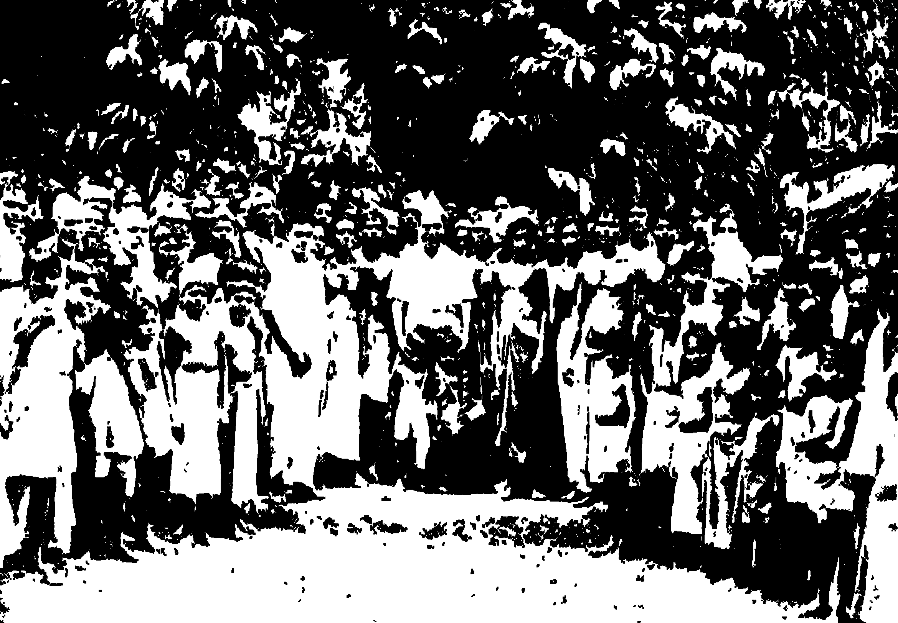

The _jatha_ started from Kasaragod on June 18 with myself,
C.H Kanaran and P.R Pandalam as leaders. This _jatha_ was a
great morale booster for the entire peasantry of Kerala, starting
as it did from the _taluk_ headquarters of Paivellikkeyi, the native
village of Comrades Sunder Shetty and Mahabala Shinnappa
Shetty. These brave young peasant leaders had suffered martyrdom
while opposing forcible eviction. The _jatha_ set out to achieve the
goal that these beloved martyrs had died for.

The march of the _jatha_ through Cannanore district, the birthplace
of the peasant movement of Kerala, was an inspiration both
to the _jatha_ members and the younger generation of the district.
Remember the peasant shrines of Morazha, Mattannoor and
Kayyoor. Memories arose of how at places like Kavumpai,
Karivellore, Monayankvanu, Payyam, Onchiyam, Thillankeri,
Korom, Padikkunnu. Vayaralayam, Paivellikkeyi peasants had
fought feudalism and shed their blood for the cause. The _jatha_
marched to the tune of the hymns which these struggles had given
birth to.

The _jatha_ kindled much enthusiasm as it marched along. It
received grand receptions all along the route. There were huge
meetings at Cannanore, Tellicherry and other centres. The welcome
with lighted lamps and measures of rice that were distributed
by the peasants to those who fought for their rights was indeed
heartwarming.

Our trek from Feroke to Perinthalmanna was an object lesson
of the deep stir among Muslim peasants. A large percentage of
the farmers there had been evicted forcibly, since the birth of the
present Government, from lands that had come into their possession
fifty and sixty years earlier without any documentation and which
they had improved and raised crops on. We met a large number of
Muslim peasants who had been evicted by the very MLA whom
they had voted in to power. The poor peasants of Mappila Nadu
were deeply frustrated. _There is no hope now,_ they felt.

It was this sense of disappointment that impelled them to
have a look at the _jatha_ as it marched along, for it was their only
hope. Thousands of Muslim women peasants lined the road.
Wonder and hope were reflected in their eyes as they heard the slogans
and hymns of the jatha. Thousands of Muslim peasants and young
men watched the _jatha_ in sympathy. They took part in their
thousands in large meetings at Kondotti and Kottappadi and in
more than thirty smaller meetings. Disregarding the objections of
some prominent people, they bought both openly and in secret
Comrade EMS's pamphlet entitled _Work Unitedly for the Land
Reform Bill_.

The class sense of Muslim peasants has sprung from a century-long
struggle against feudalism. One could still see in many places
in Mappila Nadu monuments to European soldiers. There is
one such right in front of the Perinthalmanna Travellers' Bungalow.
The Muslim peasants waged armed struggles against _Jenmis_
(foreigners) who tried to extract rent and tax from them with the
help of the army. And these were monuments erected by _jenmis_ in
memory of Britishers who became "martyrs" for _jenmis_ in such
uprisings. The last of these struggles against feudalism took
place in 1921 at Variyankunnu under the leadership of Kunjahamed
Haji. There is no memorial yet to the countless martyrs who
laid down their lives in the fight for land for the peasants.

While the _jatha_ was passing through Puthukad, somebody
shouted, _Let AKG go to Russia._ More than a thousand
people stood nearby. None of them repeated what he said. A
few people with caps on their heads and with their body smeared
with charcoal demonstrated at the entrance to Trichur in the name
of the Kisan Congress. They shouted _Karshaka march is a
march of duplicity._ They disappeared even before the _jatha_
reached them. The people who demonstrated at Chengannur
near the Indo-American club with a dog carrying a black flag round
its neck became isolated. How did this happen? The only reason
was that the attempt to brand the _jatha_ a _Communist jatha_ was a
failure. And the people acknowledged and identified it as a peasants
_jatha_.

At Tellicherry, Kozhikode, Alathur, Mannarghat and
Cannanore, we met hundreds of peasants who had participated in the
_liberation struggle_ and who voted for the Congress, League and
PSP parties and against the Communist Party in the last general
election. They had all migrated to the slopes of the Malabar
hills from north Travancore. There were 10 lakhs of these peasants
who had migrated to Malabar as they did not have enough land
to live on at home. They sold to the rich whatever land they had
at a small price and came to Malabar with the proceeds. At
Tellicherry I met some representatives of about 400 Catholic
peasants who had acquired land 12 years earlier by paying _manusham_
(premium) at the rate of 100 and 200 rupees per acre to Karoth
Sankaran Nair, a _jenmi_ of Vekkulam Amsom in Tellicherry _taluk_.
Sankaran Nair had sold them land in an oral deal. The hard-working
peasants who were confident that they could manage with a small
piece of land did not bother about documents. They cleared the
forest, started raising crops and settled down there. After
the Congress Government took over, the police came in vans
to evict them. The Communist Government never used the police
for eviction purposes.

Although the newspaper _Malayala Rajyam_ had discouraged the
people from meeting the _jatha_ or talking to its members, Nair
peasants constituted a large portion of those who lined the road
from Changanacherry to Trivandrum to watch the _jatha_ and listen
to its members.

After a rousing reception and an exciting public meeting at
Trichur, the _jatha_ resumed the trek on July 13. We reached
Chalakudi in the evening after numerous receptions on the way.
The peasants of Mukundapuram _taluk_ received the _jatha_ with
pop-guns and trays of flowers.

The _jatha_ reached Perun bavoor on the 14th evening. There
were exciting receptions on the way at Angamali and Kaladi.
It was at Angamali that poor people with no class feeling were
sacrificed by vested interests and communal forces in their bid to
topple a Government that had introduced the Kerala Land Reforms
Bill. The _jatha_ reached there at noon. The reception and
demonstration there were enthusiastic and impressive. On behalf of
the Kerala peasants' jatha, Angamali proclaimed in a stentorian
tone that the peasants of Kerala would line up as one man behind
the Land Reforms Bill regardless of their political differences. But
the communal poison of vested interests appeared on certain
placards in the language of anti-communism. The meeting at
Subash Maidan in Perumbavoor was presided over by K.N.G
Kartha, well-known as the poor man's lawyer. A sea of people
waited while the _jatha_ escorted by thousands upon thousands of
people reached the grounds.

Accepting receptions and hospitality from many centres,
the _jatha_ reached Moovattupuzha on the 15th to a demonstration
that seemed to shake the town, so tumultuous was the ovation!
At the meeting held under the presidentship of Sri K.C
Abraham, Advocate Abraham delivered the welcoming address.

Setting out on the morning of the 16th, the _jatha_ reached
Koothattukulam, the land of martyrs, towards the evening after
no less than seven receptions and speeches of thanksgiving on the
way. A concourse of peasants including women had converged on
Koothattukulam from the neighbouring places to welcome the
_jatha_.

The _jatha_ received unparalleled ovations as it set off through
our movement's agricultural district on the morning of the 17th.
The reception at Kuriyanad in Meenachil _taluk_ was as unprecedented
in the history of that place as those at Kozha and Kanakkari.
The _jatha_ reached Ettumanoor at 3pm The reception there
was attended by a huge concourse. Among the receptions between
Ettumanoor and Kottayam, those at Neelamangalam and Chavittuvari
deserve a special mention. The _jatha_ was accompanied by
thousands of people as it proceeded.

As the mighty concourse entered Kottayam town, the waiting
crowd welcomed them and took them to the heart of the town.
It was an exciting moment. The atmosphere echoed with slogans
like _Stop Intrigues and Implement the Land Reforms Bill_
and _It is not possible to split our ranks on the basis of caste
and party._ The concourse that marched to Tirunakkara maidan
was a morale-boosting demonstration of the number of people
who stood behind the Kerala Karshaka movement. The people
who noted with sorrow the change that had come over the Kerala
Karshaka movement, and those who noted the change that came
over Kerala within a year had no doubts at all about the future as
they viewed this mighty assembly.

The _jatha_ reached Tiruvalla on the 18th after having covered
320 miles. As the _jatha_ entered this predominantly Christian
town escorted by a huge mass of people, the crowd watched with
mingled feeling. There were many receptions until the _jatha_
reached Changanacherry.

The _jatha_ reached Chengannur at noon on the 19th. There
were receptions at many places on the way. At Chengannur
there were some isolated instances in which dogs were let loose
with black flags tied around their neck. After the reception and
lunch, we reached Aranmula for a reception by the Karshaka
Sangham at 2pm After another reception at Kalayada we
reached Pandalam.

The Karshaka Sangham workers and others were already
campaigning at Adoor, Chadayamangalam, Venjaramood and
other places for receptions for the _jatha_ which was due at
Trivandrum on the 24th. There was thus no doubt at all that the
demonstration in those places would be successful.

We thus covered 425 miles in 26 days of walking, we talked
to 10 lakhs of people, and sold 35,000 pamphlets. Although
fatigued with effort, our weariness disappeared as we reached
Trivandrum. We reached the city in the company of a vast
concourse which walked along with us for a long distance. We
were taken to Pazhavangadi in a huge procession. A public
meeting was held. We presented our memorandum to the Government
on the 26th. I returned from Trivandrum after taking part
in a programme designed to stir demoralised people to renewed
effort.

How many _juthas_ have I conducted in my political life? How
many miles have I walked? The temple entry _Satyagraha_, the
_jatha_ from Payyannoor to Guruvayoor, the _jatha_ that toured the
whole of Kerala when the _Satyagraha_ was suspended, the hunger
march to Madras, the _jatha_ from Kozhikode to Trivandrum for
responsible government and the _jatha_ from Kasaragod to
Trivandrum. I do not know how many _jathas_ I will march with
before I die. Anyway, it is a wholesome form of protest: one that
is refreshing to the mind as well as to the body. Fasts too have
the same effect, and have not been infrequent in my life, both
inside and outside jail.

Within a week after the _jatha_ had completed its march, the
Agricultural Reforms Bill was returned by the President. But even
by November, 1961 the Government had not taken any steps to
implement the Bill. The Government did not carry out the all
important task of preparing a register of possessions in respect of
peasants who had no documents. As the peasants moved the
tribunals for cuts in their rent, the _Jenmis_ started evicting peasants
without documents from their land. They started claiming that the
land belonged to them. At Nadavarampu near Cranganur a _Jenmi_
thus forcibly seized the property of a farmer. The peasants did not
remain quiet. They re-occupied the land. Arrests and police oppression
and lawsuits began. A small struggle in Nadavarampu thus
came into being. Many were arrested.

I found that peasants were on the brink of a major struggle.
The Kerala Karshaka Sangham held meetings. It decided to
start a movement for 16 demands. These included preparation
of a register of ownership in respect of title-less peasants, establishment
of land tribunals at the rate of one tribunal for every 2,000
petitions, consideration of the claims of peasants for Government
forest lands and dry land and cancellation of the lease of
Kottiyur temple lands.

Collectorates were picketed in the State beginning from
November 27, 1961. 320 volunteers were arrested on the first day
of picketing. This was the first Kerala-wide agitation to be
conducted by peasants. For this reason, this struggle is very
important. From December 4, the agitation spread to _taluk_
centres too.

The Karshaka Sangham made an announcement on December
15. It declared that 101 volunteers would picket the Trivandrum
Secretariat under my leadership. A _jatha_ comprising these
volunteers started from Kottiyur on December 4. The _jatha_
consisted of the following persons: Thariyakkal John; Eliamma,
John's wife; Komatt Bhaskaran; Gomathy, Bhaskaran's wife;
Kallarackal Thomas, and his wife Annamma; Purushothaman
Pillai, and his wife Rajamma; Zacharia. They were all peasants
from Kottiyur.

Karshaka Sangham leaders were arrested throughout the
State at midnight on December 3. The KSTUC announced
a general strike for December 16. I issued a call from Palghat
for the struggle to be extended to villages also. This _jatha_
created a great stir. Many policemen accompanied it. They were
reluctant to arrest us. At the same time, they were not happy
over the _jathas_ march, creating, as it did, interest and enthusiasm
among peasants. All nine volunteers including the women were
arrested and taken to Alwaye sub-jail on December 10, where
there were already many prisoners. The magistrate assigned me
A class imprisonment, but I declined and insisted on C class. I
stayed there with the other prisoners. On December 11, the
Communist Party Secretariat declared a boycott of the legislature
in protest against the arrest. A _jatha_ of ten people set out on
December 11. On the 13th, the Communist members boycotted
the legislature. There was a _lathi charge_ in Trivandrum on
December 15. On the same day one lakh workers staged a
general strike.

We were produced before the Court. The hearing of the case
started. The magistrate offered to release us on bail, but I declined,
Minister Chacko summoned Comrade EMS and initiated talks
aimed at a settlement. On January 5, Minister Chandrasekharan
invited representatives of peasants for compromise talks. Prior to
this, mass picketing was organised in December. More than five
thousand volunteers participated. The struggle was withdrawn on
January 5, after a lapse of 41 days, as several demands had been
conceded at the compromise talks. We were released from Alwaye
jail at the end of a month. In all more than 75,000 volunteers
had taken part in the agitation.

Even as the work for the Land Reforms Bill was going on, _Jenmis_
had moved the High Court and Supreme Court with petitions
challenging its validity. The Supreme Court held that the Bill
was invalid in the Malabar and Cochin region. The Congress
which had already opposed the Bill while in Opposition did not
care to appeal to the Supreme Court in time or to make out a case
in defence of the people. On this account, thousands of peasants
who failed to move the land tribunals lost their money. Some
deposited the amount, but did not get the land.

On security considerations the Party leadership was not in
favour of a struggle against the Government. Even my suggestion,
that a protest day be observed by the Peasant Conference
in Trichur in the wake of the invalidation of the Bill, was rejected.

A conference of peasant representatives was held afterwards at
Trichur consisting of the peasant union led by Father Vadakkan
and Wellington, representatives of the Kerala Karshaka Sangham
and the peasant union of the SSP It was decided that mass
_Satyagraha_ should be offered at Trivandrum. I was in this _jatha_.
None of us were arrested, although even the shouting of slogans
in front of the Secretariat was banned. Following this, _Satyagraha_
was offered at all district centres. It was finally withdrawn.

It was a time of strong opposition to the struggle of the Party
and the Karshaka Sangham. The Government did not therefore
pay heed to this struggle. Moreover, as the Party did not take
any steps to enthuse and inspire the disillusioned peasants, they
too were disappointed. Anyway, the peasants were still hopeful
that a Government that would re-introduce their bill would one day
come into being. Their hopes were realised in 1967.

Two historic peasant _jathas_ had been inaugurated in Tamil Nadu
on August 15, 1960. One was from Madurai and the other from
Coimbatore. Each _jatha_ consisted of 25 persons. One was led by
Manali Kandaswami and the other by Sreenivasa Rao. The
 _jathas_ got an enthusiastic reception at Tanjore. We thus reached
Madras where we gave a memorandum to the Chief Minister. I
walked nearly 250 miles with this jatha.

Equally important was the 'Plan _jatha_'. Comrade EMS
and I travelled in two jeeps from Kasaragod to Trivandrum. The
_jatha_ was well received on the way. We sold many copies of a
pamphlet entitled _The Neglect of Kerala_. This was very useful
in educating the people on how the Centre was neglecting Kerala.

# Chapter 28

More than 4000 families were evicted from Churuli and Keerithode
in November/December 1963. This unfortunate occurrence came
in the wake of the Amaravathi eviction. Although the peasants
were unable to stop eviction in an organised manner, the Malanadu
Karshaka Union took strong steps against eviction at Churuli-Keerithode.
While the eviction at Amaravathi was for the
purpose of providing land for the project, that at Keerithode was
in the name of "forest conservation". The Government decided to
evict peasants in the interests of "forest conservation".

The peasants came to know that eviction in Keerithode was
imminent. MSP men started arriving there in large numbers, and
senior police officials also quartered there. Karshaka Union
leaders also camped there. Preparations for a resolute struggle
were in evidence. Whatever may be the faults of the poor who
had been farming there for some time, they should not have been
evicted without providing them with alternate living facilities. All
the crops were destroyed indiscriminately. It is inhuman to crush
people who have toiled hard for their bread.

In justification of the Government's cruelty, _bourgeois_ papers
of Kerala started writing editorials about "forest conservation".
Forests are necessary. But whom is forest conservation for?
For man. Forest conservation even at the cost of man, only
enjoys the protection of the well-to-do and of those who enjoy
the basic comforts of life. Nobody could have any objection if
these poor people were removed from forests after their rehabilitation
had been provided for. But Keerithode has, in fact, at no
time been a forest area proper. Anyone who has visited that place
can see this. Moreuver, some even tried to interpret it as a
communal problem. They started saying that it was the result
of the Sankar-Chacko controversy which was at a climax at this
time.

However in this question of eviction and in their general
approach both were certainly in unison. It was during Sri Chacko's
administration that the horrors of Amaravathi were enacted. Therefore,
the charge that this was an anti-Ezhava plot of the Christians.
and that all the settlers were Christians did not carry conviction.
But there is no doubt that this propaganda was responsible for
dissipating the struggle to a certain extent. One fine morning
the police appeared on the scene to evict the peasants. The peasants
met at Keerithode on receipt of the news. They held a public
meeting. Comrade Manjooran and others spoke, strongly attacking
the Government's policy. The police swooped on them from
all four quarters and started action. After a little while Manjooran
and others were arrested and removed. The peasants got angry.
The police promptly began a man-hunt for the ring-leaders, and
launched a _lathi-charge_. Everyone was chased away. There
was firing. It seems some were killed. This was confirmed by my
investigation too. Houses were ransacked. Shops were set on
fire. All the stores in the shops were destroyed. People were
beaten at random. All those coming to and from Keerithode were
beaten. No one was allowed to enter Keerithode. An atmosphere
of terror was thus created as eviction began. More MSP men
arrived.

I was in Delhi at this time. I was worried over news of the
Keerithode cruelties. What was to be done? The Government was
disregarding all the assurances it had made during the Amaravathi
struggle. The people had to answer this challenge. It was a time
of differences of opinion within the Party. Initially some were not
in favour of even standing up for the Amaravathi approach. Some
anti-struggle comrades propagated that I was acting on my own,
impelled by overweaning self-importance, without consulting the
Party. Anyway I remained silent as I felt that the Party would
summon me should my presence be necessary. One morning, the
Trivandrum office informed that the Keerithode developments
were grave and asked me to go over to Kerala. I rang up Comrade EMS
in the morning. He too said my presence was necessary.

I reached Cochin the next day by plane. I had wired the
Karshaka Sangham, the Party and the Kottayam District Secretary.
They were waiting for me at Cochin airport. I had discussions
with K.T Jacob, P.R Pandalam and Gopalakrishna Menon. We
proceeded directly to Moovattupuzha. We decided to go on to
Keerithode from there.

By this time many peasants had already been evicted after being
terrorised by inhuman cruelty. MSP men called at houses.
They would frighten the peasants by threatening to burn their
houses in case they did not quit in 24 hours. They would go to the
houses the next day and set fire to them and also destroy whatever
was inside them. If paddy and other things are destroyed—in this
way—how can the peasant live? Where will he spend the night?
But this is what actually happened.

Even reporters were not allowed to go to Keerithode. What
was happening there was kept a secret from outsiders. A _jatha_
under the leadership of Karshaka Thozhilali Party (KTP) and the Malanad Karshaka Union
had set out for Keerithode. Its leader was peasant leader Wellington.
A public meeting was held near Keerithode on the eve of
our visit there. We spoke at that meeting.

We resumed the journey to Keerithode the next day. We
thought we might be arrested and four or five constables came
with offers of protection. We said it was not necessary. The
policemen walked with us. We thus reached Keerithode. There
was nobody there. Only a police camp. There was nothing
except a destroyed shop, glass pieces and remnants of objects that
had escaped the flames. The inhabitants had all left. From
Keerithode we travelled ten miles over hills and valleys. There
were some scattered inhabitants there. At Churuli the eviction
was still not over. It was in the final stage and the police were
still arriving. We reached a house at night. The householders
had learnt that we were coming and so were waiting for us. They
had plenty of paddy and tapioca and also bananas, yam and other
vegetables. But who was going to take it? There was absolutely
no way of transporting it. They had been asked to quit immediately
and their houses were being burnt. What to do and where to go?
Where were they to get land? Would the promised acre be fit for
cultivation? These were their thoughts. They were people
devoid of all hopes in life. Women were crying. Menfolk were
lost in thought. This was the position.

We started the journey the next morning. Comrade K.T Jacob
and Gopalakrishna Menon returned. Pandalam and I continued.
High hills. Some houses could only be seen after climbing
a hill. To see the next house, one had to climb another hill. Such
was the topography. We were weary with walking. But we
got plenty of cooked tapioca as we pushed ahead.

We toured Churuli and Keerithode for three days. The
authorities accelerated the pace of eviction after our departure. If
only their paddy and tapioca had been sent after them the evicted
people at least would not have starved. But the Government did
not do even that. Even these minimal rights were not accorded to
the poor. It was an unforgettable experience. We reached the top
of a hill. There were two small huts occupied only by womenfolk
and children. In one hut there was a pregnant woman, her sister
and children and in the other a woman and her child. They were
scared when they saw a constable accompanying us. The pregnant
woman was under the impression that her husband was dead. We
asked for his name. We found from the newspaper that we had that
he was in Moovattupuzha sub-jail. We told her that he was not
dead. By this time, a woman came from the neighbourhood with a
little child who carried a box on his head and a picture of Christ
in his hand. They slept in the same house. They lived in fear of
the police and wild elephants.

The people were being evacuated to Vazhathope. Half the
land there was very infertile and the rest indifferent. Many have
left that place. Anyway, we decided to hold a public meeting
at Vazhathope. We went there and declared at a public meeting
held then that Pandalam and I would go on fast the next day to
protest against police atrocities and other grievances. As Comrade
Pandalam pointed out that night, if both of us went on fast, there
would be no one to attend to publicity and other work. It was
therefore decided that I alone would fast.

I had promised the Party that I would not go on fast. I have
no faith in fasts. It is not a correct method of agitation. It only
betrays the absence of mass organisation and strength. As a
method of struggle, its importance is relatively insignificant. But
I believe that in certain circumstances when other methods of
agitation are not possible and in the absence of organisation, the
fast is a means of attracting the attention of the Government and
the people.

My fast began the next day. Peasants started coming from
several places. The next morning, a group of policemen came and
arrested me. I was produced before the Thodupuzha magistrate.
I was tried immediately, sentenced and sent to the Moovattupuzha
sub-jail. The peasant heroes of the Keerithode agitation and
their leaders like Manjooran were also imprisoned there. Wellington
and others were arrested the next morning and taken to Palai jail.
Protests began in the state. I continued the fast in jail.

Processions and meetings were held daily in Moovattupuzha. My
release was finally ordered and I was released. Comrade EMS
and others came and asked me to suspend the fast which I did.
The land given to the peasants was mostly infertile. All of them
have now abandoned their allotments.

Peasants are going to be evicted again. It seems notice has
been served already at Udumpanchola. The same inhuman tactics
of eviction are to be adopted. Are there no lovers of humanity
who can try to put a stop to this? Are there no public workers?
Are there no peasant organisations? The reply to these questions
awaits an answer which only the future can give.

# Chapter 29

Nov. 7, 1964. The Calcutta Conference was held on that date.
Before lakhs of people from all over India assembled at the Monument
Maidan in Calcutta, Comrade Basavapunniah declared amidst
applause: _We are the Communist Party, the real Communist
Party, the real Communist Party._

The Calcutta conference induced a new zeal and enthusiasm
in me. For two years, I had been frustrated. My frustration began
when the party leadership was captured by the advocates of class
collaboration. I was often tormented by the thought that a quarter
century of work was going waste. But the Conference banished
such thoughts. To create the foundation for building up a true
revolutionary party, to form the cadres necessary to push it forward,
to educate and train them—I was convinced that that was the task
of the day. I am proud and happy that I had a small role to play
in opening this new chapter.

In a way this new chapter began with the walk-out staged
by myself and 31 others from the 1962 National Council of the
Party. But it was not a sudden development. That walk-out began
when the advocates of class collaboration captured the Party
leadership, denied working facilities to others and started calumniating
them. There had been class collaborationists in the Party
even before this but they were never able to establish their
domination over the Party. They captured leadership in the special
circumstances of 1962.

As we walked out of the National Council in protest against
the misguided policies of the leadership, the class collaborationists
tried to picture us as traitors. They conducted propaganda on
these lines:

>32 leaders walked out of the National Council all of a sudden
>one fine morning. The 32 splitters left the Party at the behest
>of China which wanted the Party to be divided. Whatever
>the difference of opinion, is not the minority bound to obey
>the majority? They are Chinese agents devoid of patriotism.
>Far from opposing the enemies who attack our country, they
>are helping them. They are traitors.

Revisionist leaders stirred up this false propaganda against
us in order to exploit the patriotic feelings of the Party's youth wing
and to create confusion in the Party ranks. But the revisionists
were unable to mislead the Party's younger generation and the
masses for long. The Calcutta Conference of the Party was an
indication of this.

It will be useful at this time to glance over the Party's past
history. How did the Communist Party deviate from the basic
principles of Marxism-Leninism and how and when and in what
ways did this deviation reflect itself in actual practice? Only an
analysis of the background can yield a precise answer to these
questions.

The period from 1938 to 1952 was a time of intense mass
conflict with imperialism and the capitalist-landlord tie-up.
September 15, 1958 was a day when vigorous blows were struck
against imperialism. Workers and peasants joined with others
at Morazha, Tellicherry, Mattannoor, Onchiyam and other places
in a strong agitation. The working class of Alleppey and Shertallay
conducted a struggle against the Dewan's rule. From 1947 to
1952 peasants and workers conducted struggles against capitalism
and feudalism at Karivellore, Kavumpai, Padikkunnu, Kandakkai,
Mattancherry and Thillankeri. They made preparations to
strengthen class organisations and fight for urgent demands. The
people thus realised from experience that nothing but an organised
struggle against the _bourgeois_-capitalist class government can
help achieve urgent demands or change the government's policies
by even an iota. They discovered from day to day experience
that the _bourgeois_ regime was only scattering to the winds the
promises made to crores of people on January 26 every year. Kerala
thus witnessed an agitational zenith.

It was at this time the peasants of Telengana clashed with
feudalism and the Nizam's regime in an armed struggle. A very
large number of people were shot dead. But soon the Government
was reluctantly compelled to accede to the slogan _Land to the
tiller_.

The Communist Party undertook great sacrifices throughout
India. Thousands of Communists were kept behind bars. MSP
men launched man-hunts and people were shot dead one by one.
The people realised that the Communist Party was prepared even
to die in the interests of the toiling masses of the country. Poor
people came forward to help the Party in its days of trial and
persecution. Numberless families came forward to feed and shield
underground comrades. As a result of this, some families suffered
untold hardships and privations.

_These are impatient revolutionaries and agitators. They
spell danger. They are returning to 1948._ Revisionist leadership
and their newspapers are today trying to make propaganda on
these lines against the present as well as the old struggles. They
even try to make fun of the heroic struggles waged by our brave
worker-peasant comrades. Revisionist newspapers sometimes print
news in a way that puts even _bourgeois_ papers to shame. One is
reminded of the poem _Can high tide be so high_.

One factor that weakened the Party was the failure to handle
the 1952 election and the Parliamentary programme with the
vigilance that should characterise a revolutionary party. The
entire Party organisation was turned into election machinery,
from _panchayat_ level to parliamentary. Opportunist policies
were adopted in order to capture votes. It was not possible to
build up a well-organised party on the basis of policies and programmes
alone. Alliances and tie-ups aimed at getting a majority
of the votes were forged.

Some in the Party succumbed also to the desire for office.
Members of Parliament, Assemblies and local bodies constituted
themselves into a separate class. The craving for private property,
comforts and luxuries had also spread like tentacles in Party
circles. With the capture of power, vested interests infiltrated
into the party. Mass organisations became increasingly weak.
The class feeling of workers was impaired in the absence of any
efforts by the organisations that did exist to strengthen their
agitational characteristics and to keep class consciousness alive.
Instead of fiery workers, loud-mouthed people who had nothing
to do with the day-to-day problems of workers or their struggles
invited themselves into trade unions and held positions of high
responsibility. Tribunals and lawyers were installed in the place
of worker leaders. The union was no longer a weapon for class
struggle. Law courts assumed that role.

After the adoption of the Land Reform Bill, the peasants organisations
changed into associations of tribunals. It was not possible
either to organise peasants or to uplift them from their social and
economic disabilities or to build up class organisations among
them. At the high water mark of this, the slogan _The Congress
and the Communist parties should unite_ was raised in the Communist
Party.

The Party forgot its responsibility to make itself worker
oriented. It did not help generations and groups newly joining
the ranks of the working class to discard their old likes and dislikes
and to follow forever afterwards a working class philosophy.
It did not help groups inside the working class and generations
that exist in the working class as various classes to resist the ideological
onslaught constantly made by the ruling classes and to maintain
the working class viewpoint untarnished by any alien philosophies.
As the movement representing the most advanced class in society,
the working class movement draws progressives and extremists
from the exploiting classes, but the Party was unable to help them
abandon the ideologies of their parent classes and to achieve
complete ideological and practical identity with the working class.
It was still led by extremist intellectuals who emerged from nonworking
class sections of society in the early days of the Party, but
it then had a correct perspective of the need to work amidst the
working classes and to take part in their struggles and movements.

In earlier periods all comrades newly joining the Party were
duty bound to help the working class to organise their own unions
and to wage their own struggles. Intellectuals newly coming into
the Party would be deputed to educate fiery young workers in
the basic principles of Marxism-Leninism and to inspire them to
action. By their endeavours aimed at the development of the
working class as a class, these alien revolutionaries started integrating
within themselves the fundamental working class philosophy.
At the same time, the ablest and the best comrades among the
workers could assimilate through this programme the basic principles
of a scientific approach and to acquire the competence necessary
to become leaders of their class.

But this did not last long. As the Party became stronger
and as its activities spread to all classes, the old insistence on
every Party member keeping in touch with the working class fell
into disuse. The position of state and district units was no better.
Party units at all levels were keener on maintaining contacts with
other parties and general politics, including public agitations
not confined to our class. The constitutional provision
enjoining on every Party member the necessity of working in some
mass organisation also came to be ignored. There were many
Party members who did not formally join any mass organisation,
let alone work in it. Although the conversion of every Party
member into a worker ideologically as well as practically is an
essential task of every Leninist Party, such a change became
impossible in the Party in view of the above developments.

It was against this background that the Party assumed the
responsibility of being the main opposition group in Parliament
and the leading opposition Party in several State Assemblies. This
development which came about in 1952 and the subsequent
formation of the Kerala government led to the growth of certain
unprincipled forces in the Party. A firm struggle against such
undesirable forces became unavoidable. Had this taken place,
the opportunities that lay before the party could have been fully
utilised. But somehow this duty was not fulfilled. As a result,
the evils of the _bourgeois_ parliamentary system spread throughout
the Party.

A constant ideological warfare is a pre-condition for the
ideological strengthening of the Party as a whole and of its individual
members. As Lenin has said: _As founders of scientific socialism,
Marx and Engels set forth the principles and programmes of
working class revolution as a means to oppose bourgeois science_.
Lenin began his activity by waging keen ideological warfare against
the landlord, _bourgeois_ and _petty bourgeois_ classes. These
philosophies of scientific socialism have dealt with all branches, of
knowledge. They trained and educated a young generation of
socialists by dealing death blows to their ideological enemies.
Communist workers' parties throughout the world are today
doing this on a more and more extensive scale.

The Indian Party has failed miserably in this field. Even
studying the original works of Marxism-Leninism was very much
neglected in our Party. Except during the early days of the Party,
there was no systematic attempt to teach the basic principles of
Marxism-Leninism. The system of organising classes to give
political education to young party members soon became a thing
of the past. Some of these schools which had a fairly long innings
had been organised on an All-India and state level. But there was
no instruction provided in these schools on the basic principles of
Marxism. It was claimed that an academic study of Marxism
was of no use. It is certainly true that Marxism-Leninism is not
to be taught academically. It should be taught in relation to the
questions raised by the problems that exist in our country. This
cannot easily be done by party which has closed its eyes to the
problems existing in the country. In this situation, even a theoretical
study of the original works would have been preferable to
none at all.

These shortcomings that appeared in the course of the Party's
formation and growth set it on a course of dogmatism, revisionism
and opportunism. Strong protests were raised against this from
some quarters. Comrades started saying that the Party was
going wrong and pointed out specific instances. Protests against
this were registered at Party conferences.

There is today widespread propaganda that the split in
the Party was a result of the National Council's resolution of
1962 and that we left the Party under instructions from China
which wanted the Party to be divided. It is also said that at the
time of the border conflict, we favoured China against the interests
of national defence and that the Dange group supported the
Government like good patriots. It is argued that the Communist
Party was thus divided into Chinese spies and nationalists. There
is now no hesitation in making absurd propaganda such as the
following statement: _In any case, is not the minority bound to
accept the opinion of the majority? Is that not the party's
principle?_ They make this propaganda to exploit the party
members' sense of discipline. What is the truth and where does
the basic difference of opinion lie?

For more than ten years, there was a relentless attempt going on
in some quarters of the Communist Party to take the Party and the
working class movement on to the path of class collaboration.
Although these attempts were made at every party conference,
they always ended in failure. When the Dange group assumed
Party leadership in 1962, when they controlled the Party machinery,
an attempt was made by Dange to impose his own policies on the
Party by scattering Party's organisational principles to the winds.
The main obstacle to the restoration of Party unity had always been
the wrong approach of the majority in the National Council and
State Councils. Sacrificing the ideological and organisational
principles of the revolutionary party of the working class, they tried
to impose an alien viewpoint and policies on the party, under the
mask of discipline.

They tried to divide the Party on the basis of the correct Party
principle that the minority should be subject to the majority, but
this principle was cited in isolation from the other organisational
principles of Marxism-Leninism. They challenged the whole
basis of democratic centralism which lays down that the National
Council and its units should work in accordance with the policies
adopted by the Party Congress that elected it. They also challenged
the inner Party democratic principle which called for inner Party
discussion of major differences in the Party with a view to finding
out the majority opinion.

The sixth Party Congress at Vijayawada in April, 1961 clearly
and unequivocally rejected the idea of a united front of the Congress
and Communist parties. But the official wing of the national
council disregarded this and tried in an organised manner to canvass
the same idea that had already been rejected at Vijayawada.
There were many examples of this not only in the statements issued
individually by many prominent comrades, including a member of
the Central Secretariat, but also in policies jointly pursued by
the Central Secretariat and the Kerala state leadership. Among
these was the decision of the Central Secretariat in March 1963
on the bye-elections due at that time. This decision called for
support to the Congress in constituencies that were likely to be won
by rightist reactionary parties. In the light of this, the Kerala
state council tried to bring about an electoral understanding with
the Congress and against the PSP, although the PSP itself cannot
be included among rightist reactionary Parties and in any case was
not mentioned as such in the Vijayawada resolution. Along with
this, they took the political line that the socialist policy adopted
by the Congress at Avadi was right although this policy had been
strongly criticised by the Communist Party earlier. While this
was the position in Kerala, the Party leadership in the neighbouring
state of Madras forged a united front with the Congress in many
bye-elections and in the municipal election which followed. The
central leadership approved this policy.

Behind this violation of discipline by the official leadership in
the matter of a united front, were philosophies diametrically opposed
to the working class viewpoint of Marxism-Leninism. Marxism-Leninism
enjoins on the Communist Party that all political problems
should be viewed with a basic commitment towards the interests
of the toiling masses. But the official leadership and its following
have taken many steps in recent months publicly violating this
principle. Some examples are given below:

1. When the Uttar Pradesh Government decided to increase
land tax by 25 per cent and when all opposition parties opposed the
proposal, the Communist Party there, under the leadership of
Dr. Z.A Ahmed, who was a Central Secretariat Member, favoured
the proposal.

2. Instead of voting against the Finance Bill containing
the tax proposals of the Central Budget of 1963-64, which led to a
wave of protests throughout the country, the Central Secretariat
instructed the Communist Group in Parliament to abstain from
voting.

3. At a tripartite conference called by the Central Labour
Minister in November, 1962, the AITUC representative and
Party Chairman signed an industrial truce agreement. This led
to trade unions adopting policies that were not in accord with a
working class Party. As a result, it became reluctant to provide
leadership to working class agitations in places like Bombay. In
the Bombay Bandh and other incidents, our Party took part in
agitations much later than the other leftist parties and their trade
unions, and that too half-heartedly.

4. The AITUC faction in the central leadership presented
a document laying the foundations of this anti-struggle policy in
the trade union field. The political basis of that document is the
argument that the _bourgeois_ government of India, dominated by
monopoly capitalists, is forcing feudalism and foreign monopoly
capitalism to beat a retreat. This covered up the fact that the government
was only pampering feudalism and foreign monopoly
capitalism. A leadership that accepts this cannot even dream of
preparing the working class for the struggle against imperialism
and feudalism.

The official leadership stifled this policy on the plea that at a
time when the Chinese _aggression_ was on, mass struggles
should be so conducted as to assist national defence. This argument
replaces class war with class collaboration. For, any effort that
sacrifices the interests of the toiling masses will only serve to weaken,
not strengthen, national defence. A government that helps capitalists
make huge profits by making use of the national emergency
and a political party that watches this in silence cannot create in
the toiling masses the readiness to suffer sacrifices so necessary
to resist and push back the foreign troops when they intrude into
our borders.

Disunity and inner party troubles grew in the Party as a result
of the Central leadership's acceptance of this attitude of class
collaboration. Only a leadership committed to a policy of class
war can consolidate the unity of the party. Instead of bringing
about this change in their policy, they tried to take disciplinary
action against those who asked for a policy of class war. Such
attempts only served to divide the Party.

The official leadership did not content itself with disciplinary
action on an organisational plane. It also launched a campaign
of vilification against those who believed in class war. They
branded as _Chinese agents_ all those who criticised their political
line and propagated that the leftists on the India-China and the
Kashmir problems were _anti-national_. They thus tried to isolate
leftists from the people.

One of their contentions is that leftists obstructed the national
effort against the Chinese _aggression_ and the needs of national
defence. The reply to this is contained in Comrade Dange's
pamphlet: _Our line is neither dogmatic nor revisionist._ Itself
citing relevant excerpts from the counter-resolution tabled by
Comrades EMS and Ramamoorthy following the resolution
tabled in the national council by Dange, the pamphlet says: _In both
these drafts, the slogan of national defence is acknowledged._
No one in the National Council felt differently at that time in
regard to the slogan of national defence. The National Council
had an unanimous opinion on the question of defending the nation.

The difference then was not on the question of whether or not
the Indian Government should be backed in its defence efforts.
What then was the problem? As indicated already, the difference
was over the question of whether in the name of defence, the masses
should be suppressed or not. There were also differences over
whether or not a mass campaign should be organised against a
government that in the name of "national defence" kept more than
1,000 Party members in detention. They used the slogan of "national
defence" to jettison unavoidable duties of a party founded on the
working class movement, viz., organisation of mass campaigns and
struggles and creation of mass movements against arrests and
oppression.

What is the difference between the Communist Party and
other Parties? Communists view all questions in the light of
Marxism-Leninism which is not founded on narrow nationalism.
Communists approach problems through a fusion of patriotism and
world working class feeling. The bonds of unity existing between
Communist parties of different nations constitute an entirely new
relationship in human history. Its growth cannot but be difficult.
Communist parties of all countries would at once preserve their
autonomy and maintain unity with each other. The evidence of
history is there to show that mistakes are possible if any one of
them were to be neglected. As the parties of each country maintain
mutual ties on the basis of equality and reach an ideological under
standing through real, not formal, discussions, their unity becomes
all the more strong. On the other hand, if any one Party were to
impose its opinion on the other and if they interfered in each other's
internal affairs instead of following a policy of friendly exchange of
suggestions and criticisms, this unity would be impaired.

Marxism-Leninism has always insisted that the internationalism
of the working class should be linked with the patriotism of the
people of different nations. The real national interests of all
peoples demand a friendly equality among nations. Each
Communist Party should therefore create international awareness
among its members and peoples, On the other hand, every
Communist Party should be the spokesmen of the just national
interests and sentiments of the people. Communists are always
nationalistic in the true sense. They will continue to be so, no matter
how big or small their own country may be. Communists are not
supposed to plead for the interests of their land or nation against
the common interests of the working class movement. If
Communists were to oppose the international interests of the
working class movement in the name of their own national interests,
to protect international unity and jeopardise it in actual practice,
they would be guilty of a grave lapse against internationalism and
Marxism-Leninism.

The National Council Resolution was a flagrant violation of
the principles of Lenin cited above. The Resolution of Comrades
EMS and Ramamoorthy, while strengthening national defence,
also fulfilled the international duty of a negotiated settlement.
It was the Dange group that jettisoned the basic principles of
Marxism-Leninism. Nevertheless, they brand us as Chinese agents.
They also charged that leftists were preparing for armed
revolution, a repetition of 1948. This was also proved baseless.

We still adhere to the declaration made by the Party Congress
at Amritsar to the effect that at a time like this when, both in the
international context and within India, socialism is marching forward
triumphantly, the revolutionary struggles of the toiling masses
led by the working class, if effectively managed, can bring about
social revolution peacefully by making use of Parliament and by
amassing sufficient mass strength to face the opposition of vested
interests. But as an essential pre-condition for any activity in this
regard, the revisionist nations on peaceful change should be opposed
and exposed. The revisionist notions have grown since 1957
in the Party as a whole and in Kerala in particular. This was
made clear by Comrade Ajoy Ghosh in his speech at the Vijayawada
Congress. But disregarding this warning and forgetting that the
main instrument of peaceful revolution is the organised struggle
of the toiling masses, the official leadership has displayed a tendency
to lead the Party along wrong lines.

After the adoption of the Defence of India Rules, the Dange
group increasingly tried to turn itself into a hanger-on of the Government.
Those who raised even the smallest protest against this
were branded as Chinese agents. They even tried to take action
against units and individuals who did not toe their organisational
line.

But it was their policy and behaviour towards Comrade EMS,
who for many years was General Secretary of the Communist
Party and member of the Secretariat for an even longer time, that
opened many eyes. The Secretariat members in Delhi early
in 1963, Comrades Sundarayya, Jyoti Basu and Surjit had by this
time resigned from the Secretariat. The remaining six members
adopted the resolution. As General Secretary, Comrade EMS
issued a statement to the press explaining the resolution. The
Dange clique issued a counter statement against this after two days
without informing Comrade EMS and Bhupesh Gupta who were
available in Delhi. Moreover, an article up Comrade EMS wrote as editor of
_New Age_ was dropped from the paper while it was in the press.
The members of the clique started functioning as a group in the
Central Committee Office isolating Comrade EMS.

Comrade EMS submitted his resignation as General Secretary
and member of the Secretariat at the Central Committee meeting
held at this time and presented an elaborate document explaining
the reasons for the resignation. His request that the document be
circulated in the Party ranks was turned down by the leadership.
An attempt was thus made to publicly brand Comrade EMS as a Chinese
spy.

Leaders throughout India and more particularly in Bengal
were arrested at this time, most of whom had opposed the National
Council Resolution. Comrade Ranadive had been arrested
earlier in December. Soon afterwards, Comrade EMS was arrested and
was released after a few days, perhaps on account of international
and national repercussions following the arrest of the leaders.

I set out for Kerala on the day Comrade EMS was arrested. I spoke
at a huge public meeting at Cannanore. It was then that I heard
P.T Punnoose's _Jai Hind_ speech. The speech was full of blind
hatred for China, such as even Congressmen had not exhibited
before. In the name of "national defence" many leaders were arrested
and held in detention. Unbearable levies were being collected
all over the country. If you pleaded lack of funds, you were
arrested and branded with the appellation _Chinese agent_. While
terrible things were happening in the country, the leaders did not
say a word about them, but continued their denouncement of China.
I wrote to the Prime Minister citing many examples of this. Using
the opportunity, some Congressmen tried to get some of their
political opponents imprisoned. What could be done? The
position was that even the Communist Party, the Party of the
toiling people, was not there to save them.

At the Central Committee meeting held after Comrade EMS's
release, we presented resolutions asking for the release of our leaders
and a campaign against the heavy taxes. Who was there to hear?
I only mustered two votes—the introducer's and the seconder's.

I toured some states in the meantime. I asked the people
to wage a struggle against some of the things going on in the name of
"national defence", for the release of leaders and against heavy
taxation. The Dange group did not like any of these struggles.
They concocted the charge that I was trying to break the Party
and that I was organising a parallel Party. They asked the control
commission to probe into this. I was debarred from inter-State
travel. The State Committee of Tamil Nadu ordered me to keep
out of that state till the municipal elections were over. The Delhi
State Committee banned my participation in a Deepavali celebration
there. Sardesai wrote that I was not to enter Bombay without
being invited by the local Committee.

Another allegation was that we were on the side of China
in the dispute going on in the World Communist movement. Some
of us had made clear in statements that this was absolutely baseless.
In my opinion, an approach to problems on the basis of that of the
Russian and Communist Parties was wrong. Neither the
Indian Communist Party as a whole nor any individual member is
bound to accept the opinion of the Soviet or Chinese Communist
Parties. We can never accept that the opinion of one Party is
correct and that all other opinions are wrong. One should study
what each Party says on every problem, examine all their basic
arguments, let every Communist form his own opinion about all
these, and let the opinions formed by everyone be expressed by
them. From the resulting exchange of views the Party's collective
opinion will necessarily emerge. The need of the day is for the
Indian Communist Party to form its own opinions through this
procedure. Instead of doing this, any attempt to turn our Party
into a stooge of another Party will only serve to divide and not
develop the Party.

Viewed in this perspective, I feel that many statements in the
publications of the Chinese as well as the Soviet Parties are worthy
of open criticism by ours. For example, Chinese publications
carried the assertion that the Nehru Government was a puppet of
foreign imperialism and all democratic movements were suppressed
in a fascist manner by the Government here. This does not square
with the truth. On the other hand, Soviet publications glossed over
the Indian Government's class nature, its programmes and the mass
resentment against it and stated that the Nehru Government was
responsible for strong actions against rightist reactionary political
parties. This is not true either. The task of the Indian Communist
was to reject both these interpretations and act on the basis of the
Vijayawada resolution.

The attempt of the official Party leadership to project such
political issues in this manner and brand a section in the Party as
Chinese agents sacrifices a vital organisational principle of the
Communist Party viz., inner Party democracy. Free and unfettered
inner Party discussion is the only means of putting an end to
controversies that arise from time to time and are apt to divide the
Party from top to bottom. The Party Constitution clearly lays down
that in the event of grave difference of opinion among the leadership,
the Party ranks should be briefed on the dividing issues and the
various standpoints and the controversy should be resolved with
their help. But there, as already indicated, the official leadership
failed to organise a democratic inner Party discussion on the grave
differences that appeared in the National Council. When it was
no longer possible to avert such discussion, the official leadership
tried successively to oust from the Party all those who could have
participated effectively in its programmes. They tried to disband
such Party committees and isolate them by branding them as
Chinese agents.

To justify their misguided policies, they tried to distort organisational
principles in a variety of ways and, for example, even while
claiming that the minority should bow to the majority, they did not
apply this principle to committees where they themselves were in a
minority. The official leadership did not fail to disband the Bengal
State Council where they were a minority and turn themselves into a
majority. In Punjab, a Party Conference was called without proper
authority at a time when the elected State Council members were
in jail. This was done with a view to turning themselves into a
majority. The subsequent inner-party organisational troubles had
their origin in these actions of the official leadership which were
against the clear provisions of the Constitution as also of natural
justice.

The principle that the minority in a Party should submit
themselves to the majority has to be respected. But in a theoretical
question it is not always possible to move from error to truth
merely because of majority or in deference to a minority viewpoint.
In an article entitled _The Duma Seven_ Lenin denounced the
meanness of the seven liquidators of _Duma_ who used a single
vote majority to put down Marxists who were in a minority. _The
destruction of the Marxist organisation by the seven deputies who
have alienated themselves from the majority of workers, by the
seven pro-liquidator deputies, by the seven who have forgotten
that in the Duma they are only the vehicles of the will of the
majority of the workers—this is what the liquidators and the
seven deputies are aiming at!_

Another charge was that leftists were setting up parallel
committees. But it was understood from National Council members
that even as early as October 1962, four members of the Central
Secretariat belonging to the rightist group had started functioning
as a parallel group. As far as Kerala was concerned, the Party
workers knew for certain that the rightists had started functioning as
a separate parallel group. Following this, the State Council
leadership gave the green signal for rightists of the Palghat and
Calicut district councils to function as a parallel group. It was to be
expected that this policy would be pursued in other districts as well as
in lower units. Moreover, the State Council leadership had still not
agreed to hold a special Congress as laid down in the Party Constitution.
This was clearly a move to hide the fact that the leadership
was not backed by a majority of the Party membership. The real
parallel organisation was thus the leadership which did not represent
a majority of the members of the Party.

The leftists were charged not only with setting up parallel
groups, but also with publishing their own newspaper. But the
official leadership not only published their own papers in Bengal
and Madras where they were in a minority, but also used anti-Party
papers in their campaign against the leftists. The most flagrant
example of this was the donation of 30,000 rupees given by Dange
to the _Patriot_ newspaper of New Delhi. A resolution adopted by
the Central Executive Committee of 1959 banning all co-operation
with the _Link_ weekly was still in force. This resolution was a result
of the divisive propaganda carried on through its columns. The
_Patriot_ followed the same policy and was managed by the same
editor. The political line of that paper was that the rightist group
in the Communist Party should join with leftists in the Congress
and wage a struggle against the leftists in the Communist Party.
Dange's offer of 30,000 rupees to this paper was not an isolated
instance. The main reason why _Link_ and such other papers
were able to get at Party secrets was that their functionaries had
close ties with the official leadership of the National Council. The
official leadership that denounced the leftist newspapers did not
enquire into the many and repeated complaints about all this.

All through the history of the Communist movement, one could
find the struggle between Marxism-Leninism and opportunism
and the struggle between the forces of unity and the forces of disunity.
Through this long drawn out struggle, Marx, Engels and
Lenin studied the theoretical problems of working class unity and
gave us, through their action, lessons on how to deal with opportunism,
divisive tendencies and revisionism.

Every single schism in our movement certainly originates
from criticism based on opportunism and revisionism and from a
betrayal of Marxism-Leninism. Whoever betrays Marxism-Leninism
strives to undermine Party unity. Whoever adopts a
policy and programme opposed to the fundamental interests and
revolutionary good of the working class and other toiling masses
is equally a danger to Party unity. Lenin has said that those who
seek to split the Party only protect the interests of the _bourgeoisie_
by disrupting working class unity. It is the _bourgeoisie_'s relentless
policy to seek to create schisms in the ranks of the working class.
To achieve this, the _bourgeoisie_ generally plants its agents in the
ranks of the working classes and buys some workers with money.
Opportunists and revisionists are in reality the agents of the
_bourgeoisie_. Instead of organising the working class in the struggle
against the _bourgeoisie_, they have always appealed to the working
class to collaborate with the _bourgeoisie_. This is what Bernstein
and Kautsky did in the Second International. At a time when
imperialists were concerned over the possibility that workers of
all nations might unite against the imperialist war, they came
forward to appeal to workers to collaborate with the _bourgeoisie_. As
Lenin pointed out:

>Social chauvinism and opportunism in its
>finished form, is quite ripe for an open, frequently vulgar alliance
>with the bourgeoisie and the general staffs.
> 
>(Lenin: _Opportunism and Collapse of the Second International_)

I was a member of the Congress from 1927 to 1939. I left the
Congress in 1939. I left it not out of personal enmity, but because
I learnt from experience the class nature of Congress. I bade
farewell to the Socialist Party too. My reason for this was
that the Socialist Party programme was anti-Communist and
its members nurtured a hatred of the Soviet Union. Such a Party
can only be a stooge of the _bourgeoisie_. It was only after this that
I joined the Communist Party with enthusiasm and dedication.
But unfortunately, a Party that flouts Marxism-Leninism and stands
for class collaboration does not deserve to be called a Marxist
Party. This was why I said goodbye to the Dange group too.

Is not the Dange group conducting agitations against the
Government? Do they not issue calls for _bandhs_? Don't
they conduct *Satyagraha*s? Yes, they do, but the Swatantra
Party also conducts agitations. The Jan Sangh too exudes anti-Congressism.
But the point is this. Do you believe in class and
class war or in class collaboration and _bourgeois_ leadership? The
Resolution of the Bombay. Congress has stated very clearly that
national democracy is a resting place on the way to socialism. The
leadership of this transition will be in the hands of the _bourgeoisie_.
To say that a Government led by _bourgeoisie_ can build socialism
is wrong both pragmatically as well as theoretically.

The true revolutionary unity of the working class can only be
achieved by holding aloft the banner of Marxism-Leninism and its
high principles. The unity achieved by sacrificing principles and
by collaborating with opportunists is not working class unity.
On the contrary, it is

> the alliance of a small section of privileged
> workers with 'their' national bourgeoisie _against_ the working
> class masses: the alliance between the lackeys of the _bourgeoisie_
> against the class the latter is exploiting.
>
> (Lenin: _Opportunism and the Collapse of the Second International._)

Politicians may have to suffer vilification. I was dear to
Congressmen when I was in the Congress. When I left the Congress,
I became a traitor in their eyes. I was the good boy of Ashok Mehta
and Jaiprakash Narayan when I was in the Socialist Party.
Afterwards, I became a Russian agent to them. When we and the
Dange group were one, I was a selfless worker and a revolutionary
to them. I am today a _Chinese spy_ and _traitor_ in their eyes.

The slogans that they use today to deceive the people and the
Party members belonging to their group, slogans like _Chinese
fifth column_, _traitors_, _return to 1948,_ etc. have been repeated
by Lal Bahadur Shastri, Nanda, the Jan Sangh and the Swatantra
Party. Using the same slogans, the Government will try to ban the
Communist Party and arrest its workers. This is bound to happen
one day. The people will not forgive the rightists who paved the
way for this. Whatever the cost, I shall go forward holding true to
my convictions, and testing them in the light of experience. If
proved wrong, I will reject them. I am sure that the names and
actions of the martyrs who built the Party with their flesh and blood
will inspire me.

# Chapter 30

The revisionists, who at the behest of the _bourgeoisie_ tried to turn
the Indian Communist Party into their tool, took action against us
who stood firmly for the interests of the working class. Comrade
EMS was among those against whom action was taken. But the
people did not forsake us. We received warm receptions from
the people. The reception at Trivandrum epitomised these.

I went to Trivandrum after action was taken against other
comrades and myself. A large crowd of people were waiting to
receive me at the airport. I was taken from the airport to the
Party office in a procession of many people and nearly 100 cars.
The enthusiastic reception was an indication of the people's protest
and resentment against the revisionist leadership in the Party.

I went to Tellicherry after the reception at Trivandrum and
I got the same kind of reception there too. These developments
worried the revisionist Party leadership. Moreover, this gave them
an opportunity to think about recent developments. Still, they did
not learn. Those blinded by the cataract of revisionism cannot learn
from the writing on the wall. They not only refused to learn, but
also betrayed us to the _bourgeoisie_ and let out Party secrets to them.
The Indian _bourgeois_-landlord Government was emboldened
by this policy of the revisionist leadership to arrest and imprison me.

I was arrested on December 9, 1964. I had reached Trichur
from Vijayawada the previous day. The train was only four
hours late! As usual, a useless old engine somehow hauled us
upto Coimbatore. It was 1:30pm when the train reached Trichur.
Comrades Sundarayya, Basava Punnayya, Ramamoorthy, Surjit
and Jyoti Basu were also in the train. We got down at Trichur
railway station and went to the Party office for a Party meeting.
It began in the evening at the residence of Comrade Aryan.
Food was also provided there.

The town was filled with CID men by this time. Senior
CID officials hovered around all the hotels. I regarded these
just as normal preparations, not suspecting that anything unusual
was going to happen.

On the 29th everyone dispersed to the lodge as usual after the
meeting. By this time Susheela and our daughter Laila had
arrived. We spent that day in Comrade T.K Krishnan's house.
Laila slept well, happy at seeing her father and mother together.
Because of heavy work I had been unable to see Laila for months
together or to stay with her. Hearing that I would be in Trichur
for a week, she had come to spend four or five days with me.

I could not sleep well at night. Some sounds around the house
disturbed me. I got up and had a hasty look round and slept
again fitfully.

At 3am Comrade Krishnan knocked at the door. As I
opened the door, I found the Circle Inspector and other police
officials waiting at the doorway. They said I was under arrest. I
asked for the detention order. They gave it to me after hesitating for
a moment. The arrest was under the orders of the Kerala Governor.
The arrest was entirely unexpected. I said after a minute, _All
right, let me wash my face,_ and tried to enter the bathroom from
the bedroom. _There was no question of washing one's face_. That was
the order of our S.B head constable Pisharady. To awaken people
at 3am to announce their arrest, and then to say that they would
not even be allowed to wash their faces—is anything more needed
to make you furious? I became angry. I spoke against that head
constable's arrogance. Awakened from sleep, Susheela and Laila
were watching all this. Susheela tried to calm me. It took some
time for me to cool down. I started for the station and reached
there in a jeep accompanied by policemen.

_Are you arresting Susheela too?_ I asked the police officer.
He replied in the negative. _How can that be?_ I thought to myself
and then told myself that everything is possible under a stupid
government.

Within half an hour Comrades Sundarayya, Ramamoorthy
and Surjit arrived. Azhoekoden Raghavan was also there. In a
little while Susheela and Laila arrived in a car. They too were
arrested! Poor Laila. She was in jail before she was nine years
old.

Laila asked me slowly: _Why do these policemen behave
like this, father?_ What could I say? She did not know that the
policeman was not responsible for this, but the _bourgeois_-landlord
government led by monopolists like Birla and Tata and big
landlords and their shameless agent Nanda. _Father, mother and
daughter in jail: all three are preparing for armed struggle!
Chinese spies!_ The Government can say anything. The radio is
in their hands. They control newspapers. The army and police
too are in their hands. They have sophisticated equipment and
methods that can concoct bogus documents. What can they not
do then? Anyway, this Government will surely not be there when
Laila is grown up.

We all sat in the main room of the police station from 4 to
6 o'clock, since the jail authorities wanted us only at 6am. We
were therefore kept in suspense for two hours. We finally reached
the jail at 6 o'clock. Narayanan Kutty Menon was still Superintendent.
We had to wait in the jail also. Not many detenue prisoners could
be accommodated in the Viyyur jail. Anyway, I decided that
I would have to create an uproar. Nothing would be obtained
otherwise. This was my first thought as I entered jail. Susheela
and Laila were moved elsewhere. Laila was taken to Viyyur
jail, but was later sent to our house at Muhamma and Susheela
to the Trivandrum jail. After a week, Susheela was taken back
to Viyyur jail. In releasing Laila the Government showed how
ashamed it felt of itself, harrying young children.

This was the 13th time I was undergoing imprisonment. I did
not know how long it would last this time. That depended upon the
protests and organisational strength of those outside jail. Some
40 people were thrown into this small jail as detenues. They were
shut up in jail without even the limited facilities allowed to detenues.
An empty Government and a vicious anti-people policy.

We learnt from the papers, on the 30th, of the man-hunt
throughout India. There were statements by many on the arrest.
K. Damodaran, Kerala's Marxist "Theoretician" said shamelessly
_These arrests are on an All-India level. It has nothing to do with
the Kerala election. As the detenues are also entitled to contest,
it will lead to a better contest._ Many persons issued statements
protesting against the arrests. Among them were Achutha Menon,
Dange and members of other parties. It was shown by all these
statements that the arrests had a bearing on the forthcoming elections
in Kerala. But our "Marxist Theoretician" was too blinded by
anti-Communism to see that. Comrade Damodaran repeated
what Nanda and Lal Bahadur Shastri had said.

There was a rush for the next day's papers. 600 people had
been arrested in all. The largest number were from Kerala!
Comrade EMS's reaction was _The food problem and the
economic problem are going out of the Government's control. It
is necessary for the Government to suppress a Party that is capable
of mobilising the people against the wrong policies of the
Congress._

Achutha Menon's statement pointed out that while these
arrests on the eve of the election were a mean attempt to save the
ruling Party, they were not going to save the Congress from the
tragedy awaiting it. SSP leader Chandrasekharan said, _These
arrests on the eve of the Kerala election will be interpreted as the
first attempt of the Congress to sabotage a free and fair election._

This was how various parties reacted. But this was not the
line of papers like _Malayala Manorama_ and _Mathrubhumi_. The
following are excerpts from the editorial that _Malayala Manorama_
put out under the caption _The Arrest of the Left Communists_:

>Some weeks ago A.K Gopalan proclaimed in Kerala that a
>Government that will not resign at the Centre's behest and will not
>fire when asked to do so by the Centre should be formed here.
>This statement challenging the Indian Constitution and the Government
>here that came to power in a democratic election was a
>surprise to the people of this country. There are many indications
>that funds from China are being received liberally. It was reported
>that leftist Communists spent huge amounts of money for the
>demonstration in Trivandrum.

The _Manorama_ is concerned over the opposition to a
democratically elected government. They shamelessly write this
after having supported the dismissal of a government that came to
power through elections. _Mathrubhumi_'s correspondent in
Trivandrum, notorious as an anti-Communist, wrote the following
despatch:

>A high official source disclosed here that yesterday's arrest
>of over 400 leftist Communists was based on definite indications
>that they were planning widespread sabotage moves on behalf of
>China. It is learnt that leftist Communists had prepared a twin
>programme that called for pro-Chinese propaganda with a view to
>nullifying the people's vigilance and obstructing India's economic
>development. This decision was taken a month ago.

We waited for Nanda's radio speech on January 1. We
knew that it would contain phrases branding us as Chinese spies,
traitors and saboteurs. We knew also that it would not contain
the real reasons behind the arrest of more than 1,000 activists in
such a great hurry. But we still felt that there might be some excuses
in it at least for popular consumption. But we felt after hearing
the broadcast as though _the mountain had given birth to a mouse_.

The detenues this time were not lodged together. They
were kept at Cannanore, Viyyur and Trivandrum. Members of the
Politburo like Sundarayya, Surjit, Ramamoorthy and myself
were all at Viyyur. After a few months, all except myself were taken
to their respective states.

As always, jail life was unhappy. Many necessities were
denied us. It thus became necessary for me to resort to my usual
hunger strike. I fasted first for a day, then for seven days and then
again for three days. Unlike in the past, I fasted this time not
merely to obtain more facilities in jail. I fasted also in protest
against a ration cut.

I went to the court several times during this jail term. I went
to the High Court and the Supreme Court to file writ petitions.
I would be taken from Trichur to Ernakulam for this. These
journeys helped to reduce the monotony of jail life. I flew from
Ernakulam to Delhi for the Supreme Court writ. I was housed
in the Tihar jail in Delhi. I could thus meet and hold talks with
some MP's. I also met those coming from other jails to move
the Supreme Court.

All my writ petitions were allowed and jail facilities improved
a little as a consequence. We were released even before the first
of my writ petitions was decided by the Supreme Court. This
was only because of the country-wide campaign for our release.

Something else that happened at this time deserves to be
specially mentioned here. Susheela was lodged in the women's jail
at Viyyur. I was allowed to visit her once a week. Susheela
complained about having to live alone in the women's jail. We
demanded that she be either lodged with me or with Gauri
Amma, Sarada Amma and others at Trivandrum. As the agitation
for this began, Susheela was transferred to Trivandrum. But I was
not transferred. The Government thought it dangerous to take
me to Trivandrum. I wrote to Prime Minister Lal Bahadur Shastri
on the unfairness of this procedure. Shastri forwarded that
letter to the then Kerala Governor A.P Jain. As a result, Susheela
was allowed to stay with me at Viyyur jail. One morning, Susheela
arrived at Viyyur jail. It was for the first time in the history of jails
in Kerala that his and and wife were allowed to live in the same
cell in the same jail. We achieved this through our joint agitation.

The mid-term elections in Kerala were held when we were
in jail. The Congress thought it could sweep the polls by holding
the election while they kept us in jail. The Right Communists also
thought it a good chance to win a large number of seats. The
Communist (Marxist) Party demanded that a non-Congress United
Front including the Muslim League should be formed for this
election. But the Right Communists did not agree. They contended
that the Muslim League was a communal Party with which
they would never ally. But the Marxist Party joined with the
League and set up a United Front. The election witnessed a three-cornered
contest. The principal contestants were a United Front
of the Marxist Party, the League and SSP, another of the Right
Communist Party and RSP, and the Congress. It was a very keenly
contested election. The main propaganda of the opponents was that
Marxists were Chinese spies. The main activists of the Marxist Party
were all in jail. But nevertheless the Marxist-led United Front
achieved a tremendous victory. It emerged as the largest single
Party in the Assembly. All but two of those who contested from jail
were returned. But still the Marxist Party MLAs were not
released and given a chance to attempt to form a Government.
Comrade EMS who was outside jail was also elected. He was
asked to form a government. He replied that he would make efforts
to do so provided the MLAs belonging to his Party were released
from jail. But the Government was not ready for that. As a
result, no Ministry could be formed, and Kerala continued to be
under President's rule.

# Chapter 31

After a long spell of President's rule in Kerala, the general elections
were finally held. The people of Kerala were unhappy and discontented.
The food shortage continued and the Centre was unwilling
or incapable of providing the people with their minimum
food requirements. During this period the CPI(M) constantly
attacked the Centre's policy of neglect and conducted agitations
on this question. The Congress both at the Centre and the
State earned the people's hatred. The country had been facing a
deepening economic crisis since 1965–66 and this affected the daily
life of Kerala also. Kerala is deficit in rice to the tune of
nearly 54 per cent. The bad harvests and the increasing economic
imbalances in the capitalistic economy led the Centre to more
oppressive measures and taxation. Therefore under Presidential
rule, the Congress became increasingly unpopular.

In the context of the mass struggles and the anti-Congress
mood, most of the non-Congress parties were prepared to join
together to fight the Congress. Our Party took the initiative in
Kerala in forming a United Front (UF) with certain other parties to
forge a common democratic programme to defeat the Congress,
which is the main party of the _bourgeoisie_ and landlords. Parties
like the CPI, Muslim League, PSP, SSP, RSP, KTP and KSP had
for the first time joined forces with the CPI(M) on a common
minimum programme.

While we had entered this United Front and eventually the
Government with the express aim of defeating the Congress as a
political force and focussing the struggle against the Centre, the other
constituents of the Front, particularly the CPI, had different aims.
The experience of the 1957 ministry and the history of revolutions
throughout the world had taught Marxists that winning power
in a state in India did not vest real power in its hands. The
repressive apparatus of State power—the army and bureaucracy—
was controlled by the Centre. The financial relationship between
Centre and States was that of _patron and client_. In this situation
there was not much scope for radical change, unless the people
were mobilised by struggles to force the Centre to change its
policies and the masses realised the limits of constitutional
remedies. As one of our Party documents put it: _A good and
essential part of state power resides in the union centre and the
Congress Central Government.… Naturally, under these circumstances
to speak of real political power for the State Governments,
that, too, of non-Congress Governments comprising different
opposition parties, is unreal and devoid of substance._ (_New
Situation and Party's Tasks_, pp. 62–63.)

The Right Communists naturally ignored this Marxist-Leninist
viewpoint. Their revisionism could only frame a policy of _clean
administration_ and some reform in the rotten state structure. It
was this clash between the social-democratic approach and the
revolutionary approach that lay at the root of the eventual falling out
of the Rightists from the united front.

Regarding the elections proper, I contested again from my old
constituency, Cannanore. Earlier I had wanted to retire from the
parliamentary scene. I had been a member of Parliament since
1952 and prolonged ill-health had left me physically exhausted.
(I had been suffering from a prostate gland, blood pressure and
diabetes for years). But the Party felt that my presence in Parliament
was necessary, and therefore persuaded me to stand.

The election campaign was hectic. I toured all over Kerala
addressing meetings and participating in rallies. My main theme
was devoted to attacking the policies of the Congress for the last
twenty years which had led the country to such a sorry state of
affairs. In the elections I was opposed by Shri Chathukutty Nair,
whom I defeated by a big margin of 1,15,000 votes. The United
Front emerged triumphant and the Congress suffered a crushing
defeat; out of the 133 seats it contested, it won only 9. The CPI(M).
won 52 of the 59 seats contested. A United Front Government was
formed with Comrade EMS as the Chief Minister and other
parties were also represented in the Cabinet. The aim of the UF
was to implement the minimum programme to provide some relief
to the people and at the same time to raise the people's consciousness
through struggles against oppression and against the Centre.

But the CPI soon came into conflict with this understanding.
With its emphasis on _clean administration_ and _constitutional
reform_ it increasingly began placing obstacles and sabotaging
united action. The Muslim League also found itself in opposition
to the progressive measures introduced by the UF. The call for
struggle against the Centre found lukewarm response among these
parties. The UF Coordination Committee called for a general
strike and _bandh_ on September 11, 1967 and a total _hartal_ was
observed. This, despite the reluctance and sabotage of the CPI-Muslim
League clique. The Central Government continued to
hamper the continuous supply of rice to Kerala and the people had
to undergo tremendous suffering because of the cut in rice-rations.
The Congress Government and Panampalli Govinda Menon
hoped that this shortage would lead the people to turn against the
UF Government. But their hopes were frustrated. Comrade EMS
and I undertook a tour of Kerala in 1968 to explain to the people
the machinations of the Centre. It was on this food issue that the
CPI and the mini-front gang later shamelessly accused Comrade
Gowri—the Food Minister—for being responsible for the food shortage.
Instead of attacking the Centre they trained their guns on our Party.

The Congress, in its attempts to disrupt the UF, resorted to
all sorts of activities to create disorder. On August 12, 1968 when
I was addressing a public meeting at Kuttiadi, there was stone-throwing
organised by Congress _goondas_. This seemed to be
a vengeful act as a few weeks earlier I had led a _dharna_ outside the
house of the Prime Minister in Delhi to protest against the food
policy. All the MPs from Kerala had taken part in the protest.
The Congress also opposed the September _bandh_ publicly and
engineered many clashes with UF volunteers.

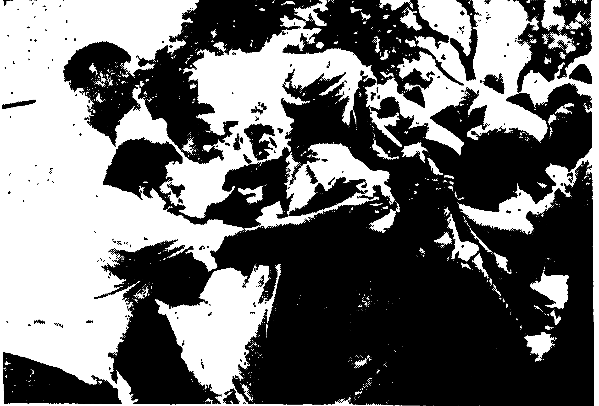

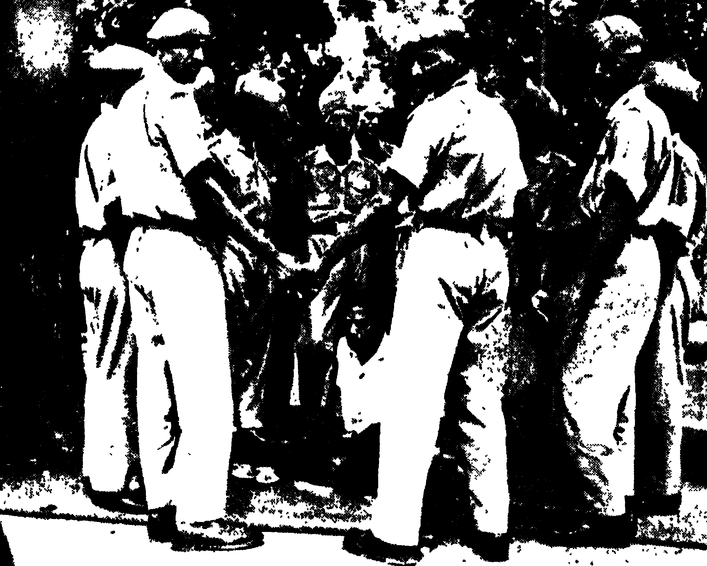

During the period of the UF, I was Secretary of the Kerala
Party and toured the State in between sessions of Parliament,
attending to organisational matters and participating in Kisan Sabha
activities. I devoted considerable time in getting a Youth Organisation
started. This youth wing and volunteer corps came in for a
lot of comment from the _bourgeois_ press and parties against us
who labelled it as _Gopalan Sena_ and branded it a serious
threat to _law and order_.

Our Party with its correct Marxist-Leninist understanding
gave the call for the use of the UF Ministry as an instrument of
struggle against the _bourgeois_-landlord system. But among some
of our supporters during this period there emerged certain
adventurist tendencies on the one hand and on the other hand the
prevalence of parliamentary illusions. Some who had great faith
in the UF ministry and expected it to perform miracles, got
disillusioned and took the road to adventurism and opportunism
as did an erstwhile comrade—KPR Gopalan. For some time
some other comrades got bogged down in the governmental process,
ministerial duties and neglected important tasks vis-à-vis the masses.
However this was corrected by criticism from the higher committees
and self-criticism. Revisionist tendencies have to be constantly
fought within the organisation.

With Comrade EMS in charge of the Home Portfolio, a
police policy was followed which conformed to our oft-declared
policy of not using the police to attack the mass movement. However
this was a difficult task as various police officials continued
to behave in their old dictatorial ways. In August 1968, there was
a _lathi charge_ and firing at Viyapuram in Alleppey. I rushed to the
spot and condemned the police atrocity. Later Comrade EMS
himself came down and investigated and suspended the offending
police officer. Unfortunately the Court later reinstated him, which
is one more minor instance of the conservative role played by the
Courts in hampering any democratic advance.

It was during the UF period that agricultural labourers
developed their movement further and launched many struggles.
For instance in Palghat district the movement made significant
gains in regard to daily wages. In September 1968, the Central
Government Employees went on a prolonged strike for better
working conditions.

On the Party front, the Eighth Congress was held at Cochin
in December 1968. I was the Chairman of the Reception Committee
and the preparations for the Congress were ably undertaken by the
State party. The rally to inaugurate the Congress was unprecedented
in the history of Kerala. More than two lakhs of
workers and peasants participated in the procession and another
five lakhs assembled for the meeting. At the opening of the
Congress I welcomed the delegates. The proceedings of the
Congress enabled the Party to reformulate the political line and
organisational tasks consequent to the split in 1964.

The continuing food shortage led to the calling of another
general strike against the Centre on October 23, 1968. I announced
this on behalf of the CPI(M). The other parties led by the CPI
and Muslim League refused to take part in this strike. They made
lame excuses and accused the CPI(M) of initiating violence.
Actually the real reason was that they were hatching a conspiracy
to oust the CPI(M) and form a Government with the Congress.
On October 23, 1968, I led a procession to the Raj Bhavan along with
seven other MPs and 41 MLAs. We were protesting against
the neglect of Kerala by the Centre on food and industrialisation.
The police removed us and they released us in the evening. The
one day _hartal_ was conducted successfully by our Party volunteers
who mobilised themselves in large numbers and picketed Central
Government offices all over Kerala.

Meanwhile, coupled with the offensive of the _bourgeoisie_
and landlords, parties like the CPI and Muslim League were
conspiring to oust the CPI(M) from the Government. Comrade EMS and I
had issued a warning of such an eventuality long before this, but
M. N. Govindan Nair—the Rightist Communist leader—had denied it
as false. At this time the Agrarian Relations Bill came up in the
Assembly and it increased the contradictions within the UF. The
_bourgeois_ and _petty-bourgeois_ parties did not like the radical measures
it embodied but they could not say so openly. They were looking
around for a convenient issue to scotch the bill. The CPI,
Muslim League, PSP and RSP had decided to go ahead with the
plan to betray the UF and form a mini-front at the instigation
of the Congress. In order to do so they ganged up on the issue of
"corruption". They levelled baseless charges against the Health
Minister Willingdon, a member of the KTP, which supported the
CPI(M), and another CPI(M) minister. This was in retaliation
against the allegations of corruption made against P.K Kunju,
the ISP Minister for Finance, levelled by the news media being found
to be sufficiently serious by the UF. Coordination Committee
to be referred to a commission of enquiry. The Chief Minister
gave the orders and the ISP minister was asked to step down till the
enquiry made known its findings. This was used as an excuse to
level concocted charges against all the CPI(M) ministers and their
supporters in the Cabinet. The ganging up of the four _Mini-Front_
parties became a formal affair in April-May, 1969. From
then on at every instance attempts were made to blackmail the
Chief Minister into instituting charges against some of his colleagues
and to slander the CPI(M) ministers on every policy decision.
The utter falsity of the whole "anti-corruption" campaign is
illustrated by the letter Achutha Menon wrote to Father Vadakkan,
leader of the KTP, regarding the corruption charges against
Willingdon. He wrote that the Mini-Front parties had no personal
quarrel with Willingdon except that he was a faithful supporter of
the CPI(M)! If Willingdon stopped supporting the CPI(M)
he automatically became uncorrupt too!

The Mini-Front found itself frustrated by the CPI(M)'s refusal
to fall in line with its manoeuvres and finally got the legislature
to approve a motion demanding enquiry into the allegations against
all the Ministers except the Chief Minister. On October 24, 1969
they got a motion passed demanding an enquiry into charges against
all the Ministers. The Mini-Front could muster only fifty-three
votes and therefore they had to depend on the votes of the Congress
and the Kerala Congress to get the motion passed. On the other
hand 60 of the UF MLAs voted with the Government. This
shows the depths to which the Mini-Front had descended, in openly
collaborating with the Congress. Comrade EMS immediately
tendered his resignation and soon the notorious Mini-Front headed
by Achutha Menon and supported by the Congress assumed office.

The assumption of office by the Achutha Menon ministry
marked the beginning of brutal repression and killing of CPI(M)
workers and the toiling masses who fought for their rights. The
toppling of the UF was paralleled by the equally reactionary step of
alliance with the Kerala Congress by the CPI. This party, notorious
for its support to landlords, became the pillar of the Mini-Front
and joined the cabinet. The formation of this ministry was marked
by fresh attacks on the agricultural labourers. On November 1,
when the ministry assumed office, _lathi-charges_ were made in eighteen
places and hundreds were injured. The notorious landlord and
Kerala Congress leader, E. John Jacob, also known as Niranam
Baby, who had vowed to overthrow the CPI(M)-led Government,
ceremoniously shaved his beard, which he had worn for the past two
and a half years, to mark the fall of the UF ministry. Immediately
his _goondas_ launched attacks on the agricultural labourers and in
one heinous murder killed Kutty—a forty-five year old woman-labourer.
I went to Melpadu in Kuttanad and visited her house.
The same day I addressed a public meeting where the people overwhelmingly
expressed their support to our Party and proved their
determination to face the new reactionary onslaughts.

The Mini-Front celebrated its victory with a blood-bath of
our toiling people. Another victim was Sreedharan in Kuttanad,
who was murdered by a big landlord. I went by boat with other
comrades to the hospital and while I was there a crowd gathered.
The whole area was tense as the landlords' _goondas_ were out in force,
some of them waiting outside the hospital, but they did not do
anything. I proceeded at night to the house of the murdered
worker, where his sister Pankajakshi was staying. She told me
calmly, despite her grief: _They may kill me also—if i die, make
sure my body is covered with a red flag._ I was deeply moved
on hearing these words and felt a deep anger welling up in me against
the oppressors. During my life as a Communist, I have been
witness to numerous atrocities and murderous incidents, but every
fresh injustice instead of disheartening me, kindles in me a renewed
vigour to fight for the cause of the downtrodden and oppressed.

Even during the UF Government in October, our _kisan_
movement had decided that it would launch an agitation all over
Kerala for the implementation of the Land Reforms (Amendment)
Bill, without waiting for the administrative and judicial machinery
to delay the process. In December a conference was held at
Alleppey where, at a huge rally of over 5 lakh peasants and agricultural
labourers, a decision was taken to implement the acquisition of
10 cents of land for the hutment dwellers, as empowered by legislation.
From January 1 onwards, massive repression was unleashed
against the _kudikidappukars_ (hutment dwellers) struggle. It is
simply unbelievable that a Government headed by a Communist
could have undertaken such anti-people and anti-working
class policies. Police attacks on the _kudikidappukars_ and their
CPI(M) supporters were unprecedented. Huts were demolished,
women raped and over 50,000 cases registered against CPI(M)
members and supporters for leading the struggle. Charges ranged
from stealing coconuts to inciting violence. The Mini-Front had
thus launched on a determined bid to suppress and destroy the
Marxist opposition. Under the guise of curbing extremist violence
many of our cadres were arrested and tortured. For instance
Comrade P.R Vasu, a veteran working-class leader of Alleppey,
was arrested and brutally beaten up which resulted in severe injuries.
I was very angry and horrified by these incidents. I led a team of
four MPs who visited many places where the atrocities had taken
place and reported to the people what we had seen.

Our movement had to face assaults from various quarters.
In Mattoor island, in Cannanore, a predominantly Muslim area,
some blackmarketeers and anti-social elements attacked our people
at the instigation of the Muslim League and burnt their houses.
I visited the place to console the terror-stricken poor and, by visiting
a number of the houses and having small meetings, instilled a sense
of confidence in them.

Having established its credentials as the faithful stooge of the
Congress, the Mini-Front now took the step of openly aligning
itself with the Congress in 1970. The events during this period
marked the completc class-collaborationist line of the Rightist
Communists in the background of the split in the Congress. In 1969
when the Congress split, the CPI hastened to label Indira Gandhi
and her faction as the progressive national _bourgeoisie_ and extended
its complete support to them. This vulgar distortion of the split
ignored the class realities and was rank opportunist reformism.
It provided a useful cover for their anti-working class activities
in Kerala too. Our Party consistently pointed out that as far as
the Congress split was concerned, it was a falling out over the
tactical line to be followed between two different factions of the
_bourgeois_-landlord class. We had further stated that it is erroneous
to consider this split as a class schism, but it reflected the growing
crisis in our economy and political system and the rising
pressure of the masses who were discontented with the system.

It was with this background that the CPI and its partners,
including the "revolutionary" RSP, aligned with the ruling
Congress. The legislature was dissolved and elections were held in
September, 1970. This time the Mini-Front and the Congress(R)
ganged up with the express purpose of defeating the Marxists. Our
party declared that it was opposed both to the Indicate \[Congress (R)\] and the
Syndicate \[Congress(O)\] and formed a third Front. The CPI(M)-led Democratic
United Front consisted of the SSP, KSP and KTP. We also supported
some independent candidates in certain constituencies. Altogether
we contested 72 seats. The election results gave us 32 seats and
our Front had a total of 43. Seat-wise we did suffer a setback
but this should not obscure the fact that we polled 32 per cent of
the votes (excluding the SSP); on the other hand the Congress(R)
which emerged with 32 seats got only 17.5 per cent of the total votes
polled. Our movement had grown in strength. In Alleppey and
Ernakulam districts there was an increase in the votes for the
CPI(M) and its allies, whereas there was a fall in the votes for the
Right Communists and Ruling Congress. Our mass base increased
significantly from 25.6 per cent in 1965 (when we fought alone)
to 32 per cent in 1970. This was not sufficient to capture more
seats from the Mini-Front-Congress combine, but we proved to the
country that not only had our mass base not been eroded, but it
had grown as a result of our militant struggles for the landless and
poor peasants.

During the post-1967 period I had visited the German
Democratic Republic and spent two months there for treatment.
In 1969, I also visited Rumania along with my wife Susheela and
our daughter. At Delhi, there occurred the sad death of Mrs.
Violet Alva, Deputy Chairman of the Rajya Sabha, with whose
family we maintained very intimate relations. They used to be
our neighbours and the kindness shown by the Alvas to me,
my wife and daughter, was unfailing. She used to give my daughter
gifts and generally take an interest in our welfare. By her death
we lost a good friend. Mr. Joachim Alva continues to remain
a close friend.

Comrade Konar and I visited Nicosia, Cyprus, to attend a
Conference of the International Trade Union of Agricultural
Labour and Forestry Workers' Union. I was a member of the
Presidium. We had a three-day session.

Looking back on the period since 1967, one discovers that it was
an eventful and significant time for the democratic movement.
The deepening economic and political crisis led to the break-up
of the Congress monopoly of power and various non-Congress
Governments came to power in the states including the Leftist
United Front Governments in Kerala and West Bengal. Under the
impetus of this developing situation, various struggles and mass
movements were launched which heightened the crisis within the
ruling classes and hastened a split. Also during this time, the
revolutionary movement had to face the fruits of revisionism, in the
form of the betrayal of the CPI and the division in the democratic
forces. Despite this handicap, the CPI(M) carried forward their
struggle and mobilised the masses in a big way, especially in West
Bengal and Kerala. The lesson of the UF experience confirmed
our understanding that parliamentarism is no substitute for the
patient organisational task of building up the mass movement.
We correctly used the UF Governments as instruments of struggle
and the resulting expansion of the left movement and the heightened
political and social consciousness of the masses was in no small way
a result of the impact of the UF period.

# Postscript-1971

The ruling Congress led by Indira Gandhi had decided to use
_socialism_ as the battle-cry against the _reactionaries_ in the
Old Congress. The mass media controlled by the Ruling Congress
projected Indira Gandhi as the progressive Prime Minister
fighting the die-hard conservatives and communalists. In
fact there is very little to differentiate between Brahmananda
Reddy and Nijalingappa. Yet the tactical differentiation
forced on the Ruling Congress made them adopt socialist slogans
and symbolic gestures. The Bank Nationalisation (without touching
the foreign banks), the Privy Purse Bill (with heavy compensation)
did not suffice to satisfy the heightened expectations of
the masses. The radical slogans could not solve the basic
crisis in the economic system and the increasing grip of the monopolists.
It was therefore essential in this situation, with the added
fear of a cruel budget, for Indira Gandhi and the Ruling Congress
to go to the polls while her "radical" image remained intact.

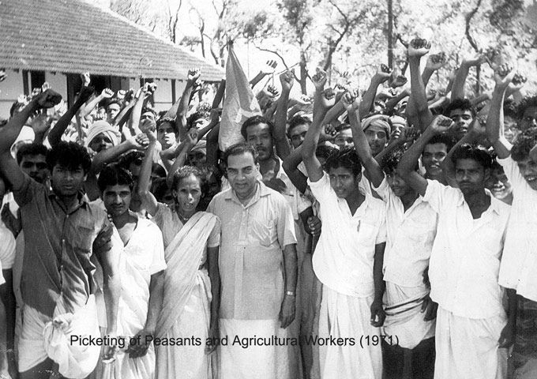

The dissolution of the Lok Sabha before its normal tenure
was therefore a ploy to maintain the illusion of the progressive
character of the Congress. We had earlier pointed out that the
coming Budget would be heaping further burdens on the common
people. In our election manifesto we pointed out the common
class character of the two Congress parties and called for a fight
against both the reactionary fronts—the Indicate front with the CPI
and other _petty-bourgeois_ parties in tow, and the Syndicate front
with the right reactionary Jan Sangh and Swatantra.

In Kerala, I stood for election from Palghat because my Party
insisted on my standing for Parliament. My illness and continuous
poor health made me reluctant, but Palghat was chosen as it was
felt I would have to spend less energy in the campaign. However,
the Palghat seat became an issue of major importance and prestige for
our enemies, Concerted efforts were made to defeat me. The Mini-Front,
the Ruling Congress, the Jan Sangh and Old Congress
parties combined to present a united challenge. An _Independent_
candidate, T.C Govindan, who was actually a Jan Sanghi, was put
up. It was a curious spectacle to see the Muslim League and the
CPI supporting such an illustrious candidate. Even some Congressmen
could not stomach this. One M. Rajagopalan, an aspiring
candidate from Palghat, issued a public statement exposing the
deal made by the Ruling Congress with reactionaries like the
Jan Sangh and roundly condemned the unholy alliance. Given
the massive line-up behind my opponent, I had to campaign hard
and visit every nook and corner of my constituency, Palghat has a
history of peasant struggles and my work among the peasantry
enabled me to face the combined onslaught of the opposition which
ranged from the Muslim League to the Jan Sangh. At the end of
the whole affair I was able to win comfortably with a margin of
52,000 votes against a candidate supported by over a dozen parties.
Similarly in West Bengal also, Comrade Jyoti Basu in Baranagar
defeated Ajoy Mukherjee who was supported by all the parties
ranging from the Ruling Congress to the Muslim League. In my
case, the margin of victory would have been greater if we had used
vehicles and other electioneering amenities in a big way, but I had
decided that such expensive and wasteful means should not be
utilised.

Prior to the elections, I had participated in the picketing and
the agitation for quicker implementation of the land tribunal cases
in respect of the distribution of Government land. I picketed the
Block Development Office at Kollengode, in Palghat district, for
3 hours with 3,000 volunteers.

During the elections, the State saw the largest influx of money
used against the Marxists. My wife stood at Alleppey and was
defeated by the combined attack of the reactionary parties, including
the Mini-Front which was led by the Right Communists, and the
power of money. The election results throughout the country registered
a massive majority for the Ruling Congress. The success can be
attributed to two reasons: first, the democratic forces in the
country were divided by the Ruling Congress and this disruption
of the Opposition led to some of the parties aligning with the
Congress. The disruption of the United Front and the betrayal
of the CPI is a case in point. Secondly, the people voted for
change; the socialist slogans found a hearing among the people
and they voted for the Congress demanding radical change. The
Ruling Congress managed to pose as progressive vis-a-vis the rightist
parties. Another feature of the elections was the rout of the parties
on the extreme right.

The assumption of power by the Ruling Congress with a
two-thirds majority in Parliament has only increased their attacks
on the people. Despite its radical pretensions, it has unleashed
semi-fascist terror in West Bengal to crush the CPI(M) and the
democratic movement. Daily our comrades and supporters are
falling victims to the knives and guns of paid assassins encouraged
by the ruling classes, the Government and the police. But our
Party and the movement will not be suppressed by such terror. We
will grow stronger and defeat the fascist challenge. The events
in Bangladesh are a pointer. The heroic struggle for the freedom
of Bangladesh will have far-reaching effects in our sub-continent.
In future years, the Ruling Congress will find itself thoroughly
exposed and discredited before the people. Therefore it is our
task to mobilise, organise and struggle. In this fight my Party has
taken the lead.

I still continue to be President of the All India Kisan Sabha
and leader of the CPI(M) group in Parliament. In my work, I have
the constant support and affection of my Party comrades.
Nowadays I have to concentrate much of my time on Kisan work.
I spend a number of days travelling around the country, especially
in Kerala, attending to Kisan Sabha activities and conferences.
For instance, in 1971 I attended the Kisan Sabha Conferences
in UP and Maharashtra, participated in various district and _taluk_
conventions and the All India Kisan Sabha Conference in Punjab.
I also spent time visiting various rural areas in Andhra where the
poor peasants and agricultural labourers have had to face brutal
attacks from landlord _goondas_ and the police. It is this activity that
keeps me in touch with the masses and enables me to learn from
their experiences. The plight of the agricultural poor and the
landless especially concerns They are still bogged down in
the most miserable poverty, superstition and social exploitation.
But they are also the best fighting sections of our people and firm
allies of the working class. It is to these two sections that my
life in the last several decades has been dedicated.

Throughout my political career my energies have been primarily
devoted to the peasant and agricultural labour movement. As
President of the All India Kisan Sabha, I have been in active touch
with agrarian problems and struggles all over the country.
the biggest movements I participated in was the 80-day _kisan_-agricultural
labour struggle in Kerala between June and August 1972.
The peasant movement has been the main force behind the democratic
movement in the state and the problems facing the rural masses
continue to stem from the problems of landlordism, capitalist
exploitation and an outmoded structure of land relations. Under
the impact of the mass movements of the organised peasants and
agricultural labourers, certain land reform legislations were passed,
but always the vested interests in collaboration with the Congress
have managed to frustrate these measures from effective implementation.
The Land Reforms (Amendment) Act, 1969 was passed
under the United Front Ministry and immediately after it this
Government was toppled. The provisions of this Act still remain
to be implemented by the Congress-CPI Government, and it was
to force the Government to take over and distribute surplus lands,
and to mobilise the people to unleash a mass struggle that a Convention
was called at Cochin on May 7, 1972.

This Convention was the logical successor of the Alleppey
Convention in 1970, which made the historic call for the implementation
of the right of the _kudikiddapukars_ (hutment dwellers)
to get their ten cents of land according to the law. This heroic
struggle in which many comrades and agricultural labourers
lost their lives ensured the homestead rights of over 40,000
hutment dwellers. Now the struggle was to focus on the issue
of surplus lands and vital issues concerning the whole range
of the rural masses like: (a) the abolition of landlordism
without compensation, (b) a moratorium on debts incurred by
the peasants, up to Rs. 10,000 for five years, (c) minimum
support for prices of agricultural commodities which are
falling sharply, (d) removal of all oppressive taxes on the peasantry,
and (e) holding the price line of essential commodities. These were
the charter of demands formulated by the Convention at Cochin
which was attended by 1,500 delegates working on the peasant
and agricultural front.

Father Vadakkan, who was the leader of the anti-communist
movement during the 1957-59 period and with whom I had
struggled for the Amaravati peasants two years after that, was
elected the President of the Action Council. Representatives
of the CPI(M), KTP, KSP, Kisan Sabha, Agricultural Labour
Organisation and other fraternal democratic organisations took
part in the Convention. The Convention was followed by a
huge procession of the rural poor, which ran into lakhs, and a mass
rally, the like of which Cochin had never seen. At this rally we
announced our programme of action to be launched from May 25,
1972. On that day volunteers were to occupy surplus lands
illegally held by the landlords in the eleven districts of Kerala.
Simultaneously, the picketing of Collectorates and Government
offices would focus on the issues of prices and taxes. The struggle
began on the morning of 25th. I set out with the first batch of
25 volunteers in Trivandrum to the Mudavanmugal Palace, where
some surplus lands of the ex-Maharaja of Travancore are located.
From early morning, thousands of people gathered in the city
and attended a rally and then marched with us along the three and
a half mile route to the Palace. All along the way, hundreds of
people greeted the volunteers and welcomed us with flowers and
slogans.

As we approached the palace gates, we learnt that the police
had locked all the three entrances and were guarding the approaches.
We decided to foil their plan to prevent our entry and take them by
surprise. A quick survey was made and we approached one of
the walls and started scaling it. All of us managed to climb in
and once inside we quickly located the surplus land and squatting
on it, planted red flags. The police flocked to the scene and
surrounded us, but our volunteers refused to budge. They arrested
the volunteers and then approached me and told me that I was
under arrest for trespass. I told the concerned police official
that he would be performing his duty better if he arrested the
landlord who was illegally holding land above the ceiling. I
refused to move from the spot and the police—after some hesitation—
finally brought the police van to where I was lying down and
four of the policemen lifted me bodily into the van and took me to
the court.

At the court, we were remanded to custody. I protested
against the fact that I was given A-class treatment in jail and demanded
from the magistrate that all those remanded with me must be
given equal treatment. At this the Magistrate declared that I
was free to go without bail and should appear in court on 5 June.
I refused to leave the courtroom saying that unless all other comrades
were released along with me, I would not go out. I began a
_dharna_ in the court premises from 5 in the evening till 10:50
at night, when the magistrate returned and remanded me to
custody till 5 June.

On that day, at various centres in the eleven districts, batches
of volunteers headed by leading comrades marched to the surplus
lands, planted red flags and occupied them. Over 600 were arrested
on that day including Father Vadakkan, John Manjooran of KSP
and many other CPI(M) leaders. While I was in jail, over
1000 volunteers were being arrested every day. The intensity,
scale and enthusiasm with which the movement was conducted
was unprecedented in the political history of Kerala. Every
village contributed money, volunteers and help in kind to sustain
the movement. Women and youth also participated in a big
way through the Mahila Sangham and the Youth Organisation.

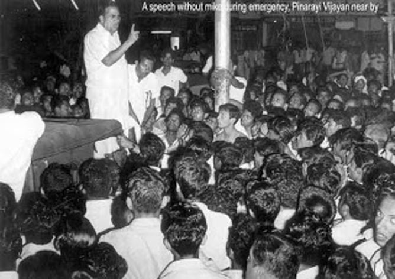

All our volunteers were instructed not to defend themselves
in court and in the course of the agitation over 10,000 were sentenced
out of the one lakh and sixty thousand volunteers who were arrested
in the course of the 80-day struggle. In my case, I got permission
from the Action Council to argue my case in court. I did so
personally and faced two charges: contempt of court and illegal
trespass of lands. I argued in the court that I had committed
no contempt, since I was forcibly brought there by the police
and had not trespassed on court premises. Regarding the
second charge, I called as witnesses the Chief Minister, the Revenue
Minister and Government officials to prove my case that according
to the law I had not committed any crime, but had merely pointed out
to the government the land illegally held by the landlord. I stated
that it was the landlord who should be prosecuted and not the volunteers
who had merely drawn attention to the violation of the law.
The court finally did not call the witnesses, but the magistrate
acquitted me of both the charges. I had spent, by that time, 23 days
in the Trivandrum Central Jail. It is ironical that I have been
lodged in jail at the declaration of Independence in 1947 and also
in the 25th anniversary year of that Independence in 1972. This
indicates that the struggles for democracy, progress and
socialism are still very much the primary concern of the Indian
people today.

The 80-day _kisan_-agricultural labour struggle was impressive
evidence of the strength of the democratic movement. It was in
this connection that I toured the whole of Kerala state for 22
days in a _jatha_ along with Father Vadakkan and John
Manjooran going to every nook and corner to attend welcome
receptions and address huge public meetings to mobilise support for
the struggles of the rural poor. This _jatha_ was the third All-Kerala
_jatha_ that I participated in and since I was too old to walk I went
in a jeep. The love of the people and their militancy for the cause
has infused me with energy and determination. In the driving rain
of the monsoon in Kerala, lakhs of people heard our message and
exhibited their solidarity. I have had similar experiences in
Andhra and Tamil Nadu in the course of the year while participating
in agrarian struggles.

For over four decades I have participated in and been moulded
by the struggles of the people for freedom and social justice, and
against exploitation. This has been the dominant theme in my life
since I joined the Independence struggle in the 1920's. The struggle
for Socialism has pre-occupied me since and the experience of fighting
with the people and learning from them has inspired me to go on.
The story of my life is part of the history of the millions of my
countrymen who will one day march decisively on the road to
revolution and socialism.

# About Author

Ayillyath Kuttiari Gopalan, popularly known as A. K. Gopalan or AKG.

He was an Indian communist politician who started being a member of **C**ongress **S**ocialist **P**arty (Socialist wing of  **I**ndian **N**ational **C**ongress). He left CSP to join **C**ommunist **P**arty of **I**ndia (CPI) as CSP started more or less acting as controlled opposition of Capitalist & Landlord classes within Congress.

He then moved away from CPI & joined the **C**ommunist **P**art of **I**ndia (**M**arxist)/CPI(M)/CPM which split off from CPI as CPI started collaborating with economic rightwing elements (Indian National Congress) in Indian Politics during Indira Gandhi period.

He was one of 16 Communist Party of India members elected to the first Lok Sabha in 1952. Later he became one of the founding members of the **C**ommunist **P**arty of **I**ndia (**M**arxist).

# Epilogue

This is slightly modified version of original. Slightly augmented with abbreviations, additional images & change of emphasis to add more context without changing the meaning in any significant way.
