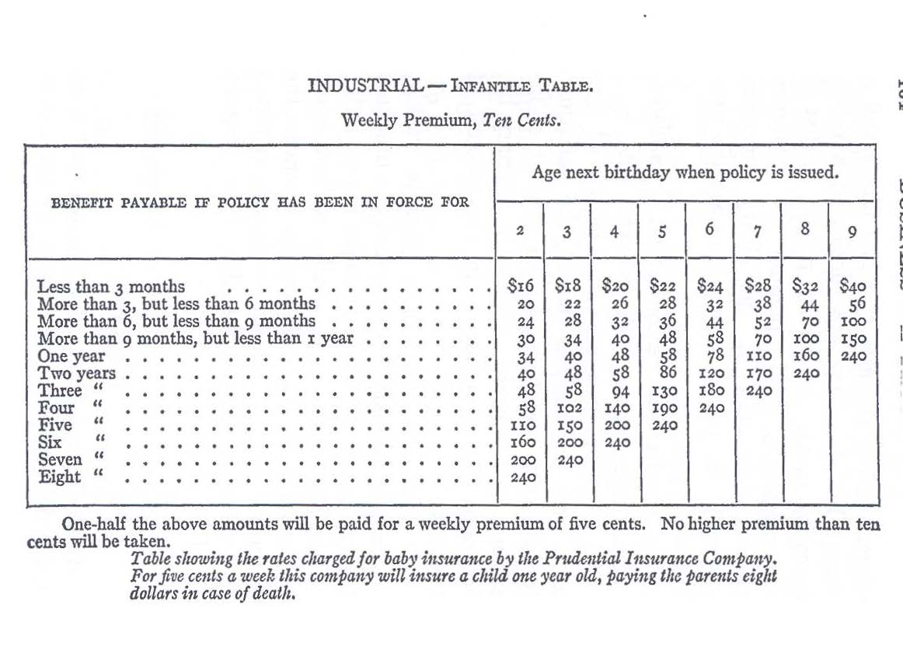

# SAVINGS BANK INSURANCE[^12/1]

[^12/1]: Published in *Collier\'s Weekly*, September 15, 1906.

The average expectancy of life in the United States of a man 21 years
old is, according to Meech\'s Table of Mortality, 40.25 years. In other
words, take any large number of men who are 21 years old, and the
average age which they will reach is 61¼ years. (According to the
American Experience Table of Mortality, the expectancy is 41.53 years;
according to Dr. Farr\'s General English Experience Table No. 3, it is
38.80 years.)

If a man, beginning with his east birthday, pays throughout life 50
cents a week into Massachusetts savings banks, and allows these deposits
to accumulate for his family, the survivors will, in case of his death
at this average age of 61¼ years, inherit \$2,265.90 if an interest rate
of 3½ % a year is maintained. (The average interest rate paid by
the Massachusetts savings banks during the ten years ending October 31,
1905, was 3.83%. The lowest average rate of all these banks in
any one year (1903) was 3.709%.)

If this same man should, beginning at age 21, pay throughout his life
the 50 cents a week to the Prudential Insurance Company (the result in
other industrial life insurance companies would be substantially the
same) as premiums on a so-called \"industrial\" life policy for the
benefit of his family, the survivors would be legally entitled to
receive, upon his death at the age of 61¼ years, only \$820. (The
payment to be made by the insurance company would be increased by small
amounts from time to time paid by way of benefits or dividends if any
are declared.)

If this same man, having made his weekly deposit in a savings bank for
20 years, should then conclude to discontinue his weekly payments and
withdraw the money for his own benefit, he would receive \$746.20. If,
on the other hand, having made for 20 years such weekly payments to the
Prudential Insurance Company, he should then conclude to discontinue
payments and surrender his policy, he would be legally entitled to
receive only \$165.

So widely different is the probable result to the workingman if he
selects the one or the other of the two classes of savings investment
which are open to him; and yet life insurance is but a method of saving.
The savings banks manage the aggregate funds made up of many small
deposits until such time as they shall be demanded by the depositor; the
insurance company, ordinarily until the depositor\'s death. The savings
bank pays back to the depositor his deposit with interest less the
necessary expense of management. The insurance company in theory does
the same, the difference being merely that the savings bank undertakes
to repay to each individual depositor the whole of his deposit with
interest; while the insurance company undertakes to pay to each member
of a class the average amount (regarding the chances of life and death),
so that those who do not reach the average age get more than they have
deposited (including interest), and those who exceed the average age
less than they deposited (including interest). The fundamental object of
both savings and life insurance institutions is the safe and profitable
investment and care, at a minimum of expense, of funds contributed from
time to time in small amounts. To attain this end, the essential
qualities on the part of the management of both classes of institutions
are good judgment, honesty, economy and accuracy.

Why, then, does the workingmen\'s investment in industrial insurance
prove relatively so disastrous?

## WHAT INDUSTRIAL INSURANCE IS

Industrial insurance is simply life insurance in small amounts of the
kind commonly taken by the wage-earner. In the United States the
policies average now about \$140. They serve mainly to provide funds to
meet the wageearner\'s heavy expenses of a last illness and a decent
burial. They are considered a prime necessity among the working people,
so that of the 20,936,565 level premium life insurance policies
outstanding in the ninety American companies on January 1, 1905,
15,678,310 were industrial policies.

The peculiar features of industrial as distinguished from ordinary life
insurance are:

\(a\) That the premiums are fixed for all ages at 5 cents or multiples
thereof, the variations for different ages being in the amount of
insurance so purchased, whereas in ordinary life insurance the variation
is in the amount of premium.

\(b\) That the premium is payable weekly, whereas in ordinary life
insurance the premium is payable annually, semi-annually or quarterly.

\(c\) That the premium is collected from house to house, whereas in
ordinary life insurance the payments of premium are commonly remitted by
mail or are made at the office of the company or of its agents.

## THE APPALLING WASTE IN INDUSTRIAL INSURANCE

In the United States about 94% of all industrial insurance is
furnished by three companies, the Metropolitan of New York writing 49%, the Prudential of New Jersey 36%, and the John Hancock
of Massachusetts 9%. Each company issues also ordinary life
policies.

The Metropolitan (which alone separates in any published statement the
expense of its industrial department from its ordinary life department)
discloses that the managing expenses of its industrial department in the
year 1904 (exclusive of real estate taxes, insurance taxes and
departmental fees) was 42.08% of all premium receipts. The
expense in the John Hancock is stated to be \"about\" 40%. That
of the Prudential is probably higher than either of the other companies.

In the year 1904 the average expense of management of these three
companies (including both the ordinary life and the industrial
departments) was 37.21% of all premium receipts. Premium
receipts of insurance companies correspond to deposits of savings banks.
In the same year the percentage of management expenses to deposits made
during the year of the 188 Massachusetts savings banks was 1.47%. In other words, the percentage of expense of management to premium
receipts of these insurance companies was twenty-five times as great as
that of the savings banks to their year\'s deposits. Yet the percentage
of expense of the industrial department of these insurance companies
alone is even greater than 37.21% of the premium receipts, the
companies\' percentage of expense being reduced by reason of the fact
that the companies issue also ordinary life policies. Even the
extravagantly managed Mutual Life, New York Life and Equitable (which
issue only ordinary life policies) took for such managing expenses in
1904, on the average, only 23.33% of the year\'s premium
receipts; while the Metropolitan, the Prudential and the John Hancock
(which issued both kinds of policies) took 37.21%.

It is true that the collections of premium by an insurance company are
partly for the purpose of carrying insurance risk, as well as for that
of investment, while the deposits in a savings bank are accepted solely
for the purpose of investment; but this circumstance does not by any
means wholly destroy the significance of the foregoing comparisons.

How heavy the burden is which the present system of industrial life
insurance imposes upon the workingman can, however, be fully appreciated
only if we bear in mind the following facts:

*First --- The Double Premium*

The premium payable for any given amount of industrial insurance is
about double that payable on ordinary life non-participating policies.

Thus, in the Metropolitan, an industrial policy-holder insuring at age
21 would pay 60 cents a week, or in the aggregate 31.20 a year for a
\$984 policy, while he would pay only \$16.55 a year for an ordinary
life nonparticipating \$1,000 policy. In the Prudential a man of 40
would pay 50 cents a week, or in the aggregate \$26 a year, for a \$500
policy, while he would pay only \$27.03 for an ordinary life
non-participating \$1,000 policy.

*Second --- The Quadruple Expense of Management*

The proportion of the premium taken for management expenses in the case
of industrial insurance is about twice as great as in the case of
ordinary life nonparticipating policies; and, since the premium also
is about twice as great as for an ordinary non-participating life policy
of like amount, it follows that the industrial policy-holder pays toward
expense of management four times as much as even the present expense
charge borne by the ordinary life policy-holder for the same amount of
insurance.

*Third --- The High Lapse Rate*

About two-thirds of all industrial policies lapse and are forfeited
within three years of the date of issue, the premiums paid thereon
proving a total loss to the policyholder. In the year 1904, 87% of the industrial policies in the Metropolitan, the Prudential and
the John Hancock which terminated within the year were forfeited; and
only 13% resulted in any payment to the insured.

Of the 2,761,449 industrial insurance policies in these three great
companies which terminated by death, surrender and lapse during the year
1904, aggregating in amount \$422,633,987, payment was made to insured
on only 347,072, or about one-eighth of the policies. In other words,
the holders of 2,414,377 policies, with aggregate insurance of
\$379,708,958, made a total loss of all premiums paid.

The fact that more than 40% of each premium goes to expense of
management, when taken alone, fails, therefore, to show how great this
industrial insurance waste is. We must remember that the expense is more
than 40% of a premium which is double the ordinary premium. But
even these facts considered together do not fully disclose the waste.
They indicate only the loss to persisting policy-holders. We must
remember also that those whose policies lapse --- a great majority of all
who insure --- lose also (except for the temporary protection) the whole
l00 % of their premiums.

## THE CAUSES OF THIS WASTE

What are the causes of this appalling waste of the workingmen\'s
savings?

*(A) Not Financial Depravity*

Financial depravity is not an important cause. The recent insurance
investigations have, it is true, disclosed in the Metropolitan and in
the Prudential, as in the Equitable, the New York Life and the Mutual
Life of New York, grave breaches of trust. These industrial companies
also have paid exorbitant salaries. In them also official position and
policy-holders\' money have been used for private profit. By them also
illegal contributions have been made to secure legislative favors. And,
in addition, the stockholders of the Metropolitan and of the Prudential
have, to a degree unknown in ordinary life companies, received
unjustifiable dividends. The capital of the Prudential has been swelled
from \$91,000 to \$2,000,000 out of the premiums exacted from
workingmen, so that now the company, while paying nominally a 10% dividend, in fact pays to its stock-holders in dividends each year
an equivalent of 219.78% on the cash actually paid in on the
capital stock. The capital of the Metropolitan likewise has been swelled
out of wageearners\' premiums from \$500,000 to \$2,000,000, so that
now the company, while paying nominally a 7% dividend, in fact
pays to stockholders each year an equivalent of 28% on the cash
actually paid in on the capital stock. The profitableness of the
business to stockholders and officers is further shown by the fact that
the Metropolitan, in order to increase its own business and to eliminate
competition, bought out, in 1902, a small Kentucky company on terms
which netted its stockholders nearly \$400 per share for stock on which
only \$100 had been paid in.

But the amount diverted from policy holders by financial irregularities,
though large in the aggregate, is small as compared with the total of
premiums paid. Financial depravity does not explain why in fifteen years
the workingmen of Massachusetts have paid \$55,285,744 in industrial
premiums to these three companies, and received back in all only
\$19,881,353; that is, 35.96% of the aggregate premiums paid,
without interest. (The figures for the United States are not available,
the payments to industrial policy-holders not being separated from those
to ordinary policy-holders.) The John Hancock appears to have been
managed throughout with scrupulous honesty as a mutual company, and yet
in the fifteen years ending December 31, 1904, it took from
Massachusetts industrial policy-holders in premiums \$18,319,730, and
paid to them only \$5,942,033 or 3.43%, without interest, of the
premiums paid. (The insurance reserve and some surplus were, of course,
accumulated also.)

*(B) Not Mere Extravagance*

Nor is this fearful waste of workingmen\'s savings due to mere
extravagance in management. The working organization of these companies
is said to be admirable; and, aside from a few exorbitant official
salaries in the Metropolitan and the Prudential, the employees of the
three companies are certainly not overpaid on the average. The Armstrong
Report states that, of the 12,000 or 13,000 agents in the Metropolitan,
\"an enterprising man who devotes his whole time to the business\"
received an average of \$11.64 per week; the 2,112 clerks, an average of
\$15; the \"about 2,700 assistant superintendents,\" \$25 a week; and
the \"about 350 superintendents,\" \$50; and that the fees paid for each
medical examination and inspection were 50 cents and 25 cents
respectively: that the Prudential paid to 8,582 agents on the average
\$14.61 per week; to 1,751 assistant superintendents, \$24.24; and to
223 superintendents, \$95.55. Obviously, therefore, mere extravagance is
not the cause of this waste of workingmen\'s savings.

*(C) The System Vicious*

The real cause of these meagre results to the insured from industrial
insurance is not financial depravity or extravagance, but the
extraordinary wastefulness necessarily attendant upon the present system
of supplying life insurance for workingmen.

The principal elements of expense in industrial insurance are:

\(1\) The initial expense on issue of policies, taken in connection with
the large percentage of policies lapsed.

\(2\) The expense of house-to-house collection of weekly premiums.

## (A) THE INITIAL EXPENSE

The average initial expense as figured by the Metropolitan was, in 1904,
\$2.07 per policy on which the average premium was 12 cents weekly. It
is probably about the same in other companies. In the John Hancock the
initial expense includes the agent\'s commission at the rate of 48 cents
for placing a policy bearing 5 cents weekly premium, and the
physician\'s fee of 50 cents. But the issue of each policy involves
besides these specific charges a large _pro rata_ for general expense, the
exact amount of which is not supplied by the published accounts. The
initial charge, while large in itself as compared with the year\'s
premiums, becomes particularly burdensome to persisting policy-holders
by reason of the heavy lapse rate.

\"From the most careful accounting made time and again,\" says the John
Hancock, \"the weekly premium policies do not square themselves and make
good the initial and current expenses and loss and provide for the State
requirement of reserve, until at least three full years\' premiums have
been paid\ ... Not a policy that lapses before at least three full years\'
premiums have been paid but leaves a greater or less deficiency for the
survivors to bear\ ... \"

\"On the average fully one-half the entrants lapse their policies before
the end of the first year and a majority of these within the first
quarter, though no policy lapses until four weekly premiums are
overdue.\"

The experience of the John Hancock is, of course, not exceptional. The
Metropolitan lapse rate appears to be larger, and that of the Prudential
still larger. The Armstrong Committee found that in the Metropolitan,---

\"More than one-third of the policies issued do not survive three
months, and about one-half are cancelled within a year. In 1903 the
company took one week\'s industrial issue from each month in the year,
and followed the issue through a period of twelve months, with the
following result:

  --- ------------
                                                         *%*
Rate of lapses in first 3 months from date of issue 35.40
Rate of lapses in first 6 months from date of issue 43.57
Rate of lapses in first 9 months from date of issue 48.28
Rate of lapses in first 12 months from date of issue 51.46
  --- ------------

In 1904 the average time for which premiums were paid on policies which
lapsed within one year from issue was 6.05 weeks.

The net result to the Metropolitan Company from each policy so lapsed is
as follows:

  --- ---------
Initial cost of policy \$2.07
Cost of carrying policy .52
\$2.59
Average weekly premiums at 12.004 cents for 6.05 weeks .726
Net loss to company (*i.e.*, to the persisting policy-holders) \$1.864
Net loss to the insured (12.004 cents per week for 6.05 weeks) .726
  --- ---------

During the second year (in which about 10% of the policies
lapse) and the third year (in which about 5% lapse) the net loss
to the company (that is, to the persisting policy-holders) grows
gradually less, but that to the insured whose policies lapse grows very
much greater. For, while the average net loss to the insured whose
policies lapse during the first year is about 73 cents, the average,
figured on the same basis, for those whose policies lapse in the second
year is approximately \$8.88, and the average net loss to those whose
policies lapse in the third year is approximately \$15.12. In 1904 the
Metropolitan wrote 1,829,559 new policies. Applying the above
percentages to the business of the Metropolitan for the full years of
1904 and 1905, we find that 941,491 of the 1,829,559 policies written in
1904 must have lapsed within the year 1905, and that the net loss on
these lapsed policies aggregated \$2,438,461.68, of which the insured
bore \$683,522.46, and the persisting policyholders \$1,754,939,22.

## (B) THE COLLECTION CHARGE

But besides the deficit due to lapses the persisting policy-holder bears
another fearful burden. Even in the honestly managed John Hancock the
fee of the collector is 20% of each week\'s premium, and this 20% charge is only a part of the cost of collection. There is in
addition necessarily the large expense of an elaborate system of
superintendence and accounting. Bear in mind that 20% of an
industrial premium is equal to 40% of the sum payable as premium
for a like amount of ordinary insurance.

Obviously, therefore, a substantial reduction of the present cost of
industrial insurance is not possible unless some radical change of
system be introduced whereby the initial expenses, the cost of premium
collection, and the percentage of lapses is greatly lessened.

## THE SACRIFICE OF THE THRIFTY

The supporters of the present system of industrial insurance declare
that such a reduction of expenses and of lapses is impossible. They
insist that the total loss to the insured and the heavy burden to the
policy-holders from lapses, as well as from the huge cost of premium
collection, must all be patiently borne as being the unavoidable
incidents of the beneficent institution of life insurance when applied
to the workingman. They declare that the appalling waste incident to the
forfeiture within three years of two-thirds of all policies written is a
sacrifice essential to the ultimate salvation of the small persisting
minority, and that the huge expense involved in the house-to-house
collection of weekly premiums is necessary to prevent still more lapses
on account of the workingman\'s alleged lack of thrift.

It may be questioned whether, in view of the heavy expense now attending
industrial insurance, the discontinuance of premium payments which yield
such slight probability of net returns is not evidence rather of thrift
than of thriftlessness. It is surely difficult to justify a system of
insurance as to which it may be foretold that, of the millions who are
entered each year at a per capita initial expense of \$2.07, a majority
will not only let their policies lapse within the year, but will on the
average pay in premiums only 72 cents. Does not such a record of
mortality in policies prove conclusively that most of the entrants had
been over-persuaded or misled into taking the insurance? But if, as the
companies contend, the discontinuance of premium payments is evidence of
thriftlessness, surely the thrifty who persevere should not be compelled
to submit to a system which requires such great and largely useless
sacrifices in the supposed interest of a small minority.

The thrifty workingman, like people of larger means, should have the
opportunity of obtaining life insurance at more nearly its necessary
cost.

## THE REMEDY

The sacrifice incident to the present industrial insurance system can be
avoided only by providing an institution for insurance which will
recognize that its function is not to induce working people to take
insurance regardless of whether they really want it or can afford to
carry it, but rather to supply insurance upon proper terms to those who
do want it and can carry it,--- an institution which will recognize that
the best method of increasing the demand for life insurance is not
eloquent, persistent persuasion, but, as in the case of other
necessaries of life, is to furnish a good article at a low price.

## THE SAVINGS BANK THE BEST MEDIUM

Massachusetts, in its 189 savings banks, and the other States with
savings banks similarly conducted, have institutions which, with a
slight enlargement of their powers, can at a minimum of expense fill the
great need of life insurance for workingmen.

The only proper elements of the industrial insurance business not common
to the savings bank business are simple, and can be supplied at a
minimum of expense in connection with our existing savings banks. They
are:

\(a\) Fixing the terms on which insurance shall be given.

\(b\) The initial medical examination.

\(c\) Verifying the proof of death.

The last involves an inquiry similar in character to that now performed
by the clerks of savings banks in the identification of depositors.

The second is the work of a physician, who is _available at_ no greater
expense to the savings bank than to the insurance company.

The first is the work of an insurance actuary, who would be equally
available to the savings banks as he is to insurance companies, if the
former undertook the insurance business. And the present cost of
actuarial service can be greatly reduced: first, by limiting the forms
of insurance to two or three standard forms of simple policies, uniform
throughout the State; and, secondly, by providing for the appointment of
a State actuary, who, in connection with the insurance commissioner,
shall serve all the savings insurance banks. The work of such an actuary
is, indeed, now necessarily performed in large part in each State by the
insurance department, as an incident of supervising life insurance
companies.

The savings banks could thus enter upon the insurance business under
circumstances singularly conducive to extending to the working-man the
blessing of safe life insurance at a low cost, because:

*First*. The insurance department of savings banks would be managed by
experienced trustees and officers who had been trained to recognize that
the business of investing the savings of persons of small means is a
quasi-public trust which should be conducted as a beneficent and not as
a selfish money-making institution.

*Second*. The insurance department of savings banks would be managed by
trustees and officers who in their administration of the savings of
persons of small means had already been trained to the practice of the
strictest economy.

*Third*. The insurance business of the savings banks, although kept
entirely distinct as a matter of investment and accounting, would be
conducted with the same plant and the same officials, without any large
increase of clerical force or incidental expense, except such as would
be required if the bank\'s deposits were increased. Until the insurance
business attained considerable dimensions, probably the addition of even
a single clerk might not be necessary. The business of life insurance
could thus be established as an adjunct of a savings bank without
incurring that heavy expense which has ordinarily proved such a burden
in the establishment of a new insurance company.

If the individual risks were limited at first to, say, \$150 on a single
life, the business could be begun safely on a purely mutual basis as
soon as a few hundred lives were insured, or earlier if a guaranty fund
were provided. As the business increased, the limit of single risks
could be correspondingly increased, but should probably not exceed
\$500.

*Fourth*. The insurance department of savings banks would open with an
extensive and potent good will, and with the most favorable conditions
for teaching, at slight expense, the value of life insurance. The safety
of the institution would be unquestioned. For instance, in Massachusetts
the holders of the 1,829,487 savings bank accounts, a number equal to
three-fifths of the whole population of the State, would at once become
potential policy-holders; and a small amount of advertising would soon
suffice to secure a reasonably large business without solicitors.

*Fifth*. With an insurance clientele composed largely of thrifty savings
bank depositors, house-to-house collection of premiums could be
dispensed with. The more economical monthly payments of premiums could
also probably be substituted for weekly payments.

*Sixth*. A small initiation fee could be charged, as in assessment and
fraternal associations, to cover necessary initial expenses of medical
examination and issue of policy. This would serve both as a deterrent to
the insured against allowing policies to lapse and a protection to
persisting policy-holders from unjust burdens which the lapse of
policies casts upon them.

*Seventh*. The safety of savings banks would, of course, be in no way
imperilled by extending their functions to life insurance. Life
insurance rests upon substantial certainty, differing in this respect
radically from fire, accident and other kinds of insurance. As Insurance
Commissioner Host, of Wisconsin, said in a recent address:

\"If we take a number of thousand persons of different ages, nothing is
more certain in nature than that their natural deaths will occur in a
series not differing very widely from that of other thousands of persons
under similar circumstances.

\"The practical experience of this theory has given to the world the
mortality tables upon which life insurance premiums are ascertained and
the reserves for the future needs calculated.

\"No life insurance company has ever failed which complied strictly with
the law governing the calculation, maintenance, and investment of the
legal reserve\ ... \"

The causes of failure in life insurance companies since Elizur Wright
established the science have been excessive expense, unsound investment,
or rapacious or dishonest management. To the risk of these abuses all
financial institutions are necessarily subject, but they are evils from
which our savings banks have been remarkably free. This practical
freedom of our savings banks from these evils affords a strong reason
for utilizing them to supply the kindred service of life insurance.

The theoretical risk of a mortality loss in a single institution greater
than that provided for in the insurance reserve could be absolutely
guarded against, however, by providing a general guaranty fund, to which
all savings-insurance banks within a State would make small _pro rata_
contributions,--- a provision similar to that prevailing in other
countries, where all banks of issue contribute to a common fund which
guarantees all outstanding bank notes.

*Eighth*. In other respects, also, co-operation between the several
savings insurance banks within a State would doubtless, under
appropriate legislation, be adopted; for instance, by providing that
each institution could act as an agent for the others to receive and
forward premium payments.

*Ninth*. The law authorizing the establishment of an insurance
department in connection with savings banks should, obviously, be
permissive merely. No savings bank should be required to extend its
functions to industrial insurance until a majority of its trustees are
convinced of the wisdom of so doing.

The savings banks are not, however, the only existing class of financial
institutions which could be utilized for the purpose of supplying, at a
low expense rate, insurance in small amounts under a system requiring
frequent premium payments. Co-operative banks, as operated in
Massachusetts and in some other States, would, under appropriate
regulation, be admirably adapted to supply a part of the required
service. The excellent record of these institutions in Massachusetts
presents a most encouraging exhibit of the achievements of financial
democracy when applied to small units and when operating under a wise
system of supervision.

Public attention having at last been directed to this subject, our
workingmen will not long submit to the needless sacrifice of their
hard-earned savings, described in the following judgment of the
\"Armstrong Committee\" on the methods of the Metropolitan Company:

\"In fine the industrial department furnishes insurance at twice the
normal cost to those least able to pay for it; a large porportion
\[sic\], if not the greater number of the insured, permitting their
policies to lapse, receive no money return for their payments. Success
is made possible by thorough organization on a large scale and by the
employment of an army of underpaid solicitors and clerks; and from
margins small in individual cases, but large in the aggregate, enormous
profits have been realized upon insignificant investment.\"

If an opportunity for cheaper life insurance is afforded by means of an
extension of the functions of our savings banks, the present industrial
insurance companies may be permitted to pursue their efforts at
inculcating thrift in accordance with the system which seems to them
wise, and their claim that the present huge waste is inevitable will be
duly tested.

But if we fail to offer to workingmen some opportunity for cheaper
insurance through private or quasi-private institutions, the ever-ready
remedy of State insurance is certain to be resorted to soon; and there
is no other sphere of business now deemed private upon which the State
could so easily and so justifiably enter as that of life insurance.

However great the waste in present life insurance methods, our
workingmen will not be induced to abandon life insurance. To them, as to
others, life insurance has become a prime need. It must be continued. It
should be encouraged. In spite of the disastrous results of this form of
savings investment, the industrial insurance business has assumed
enormous proportions. On December 31, 1904, the number of industrial
life policies outstanding in the three great companies (Metropolitan,
Prudential and John Hancock) was 14,731,463, as against a total of only
about 5,258,255 ordinary life policies outstanding in the ninety legal
reserve companies. The New York Life, with its record of 957,201
policies outstanding, had only oneeighth as many policy-holders as the
Metropolitan, onesixth as many as the Prudential and three-fifths as
many as the John Hancock. In the year 1904 alone the Metropolitan,
Prudential and John Hancock wrote 3,742,209 industrial policies; that
is, more than three times as many as the 90 leading level premium
companies wrote of ordinary life policies during that year. In
Massachusetts the predominance of industrial policies is even greater
than the average. With a population of 3,000,680 there were outstanding
December 31, 1904, 1,080,003 industrial policies; that is, one for every
three inhabitants, counting men, women and children, and of ordinary
life policies only 257,792 were outstanding.

The demand of workingmen for life insurance will continue and will grow;
but the yearly tribute of the workingmen to Prudential stock-holders of
dividends equivalent to 219.78% on the capital actually paid
into the company, the yearly waste of millions in lapsed policies, in
fruitless solicitation and in needless collections, will cease. The
question is merely whether the remedy shall be applied through properly
regulated private institutions or whether the State must itself enter
upon the business of life insurance.
