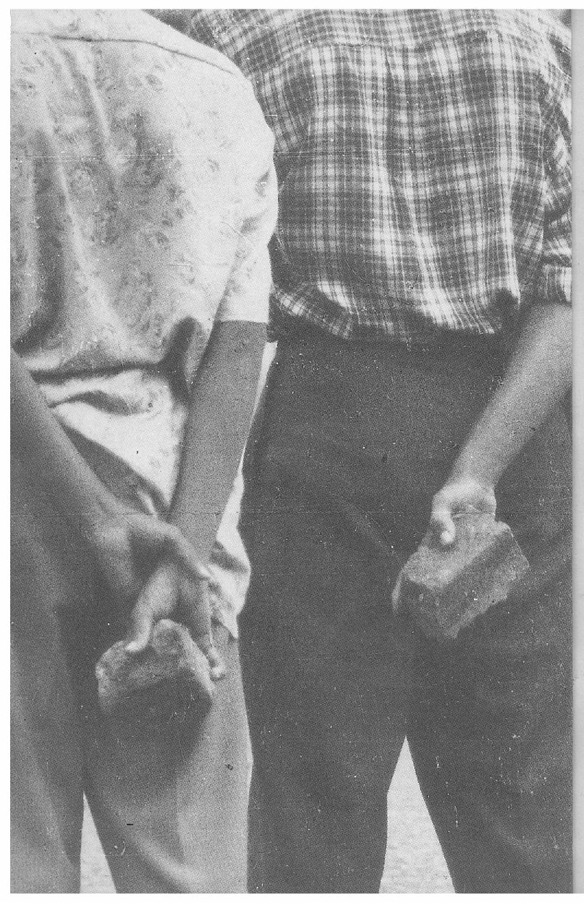
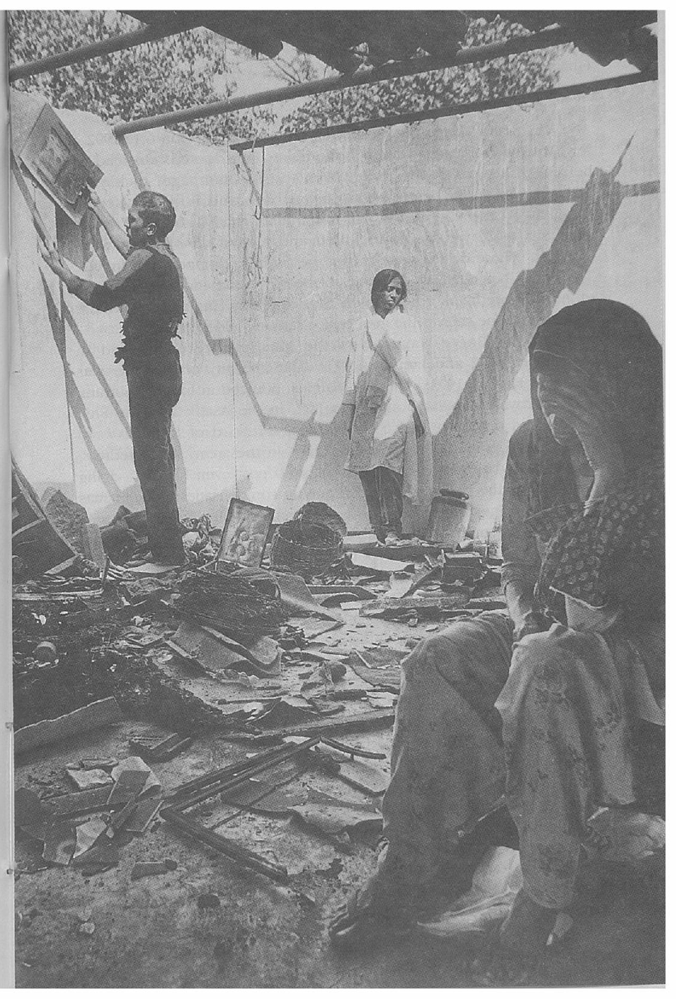
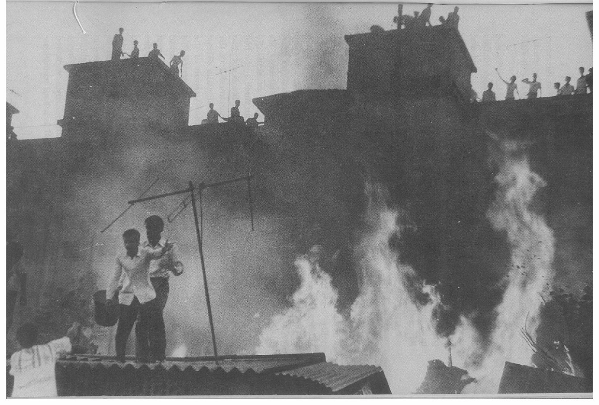
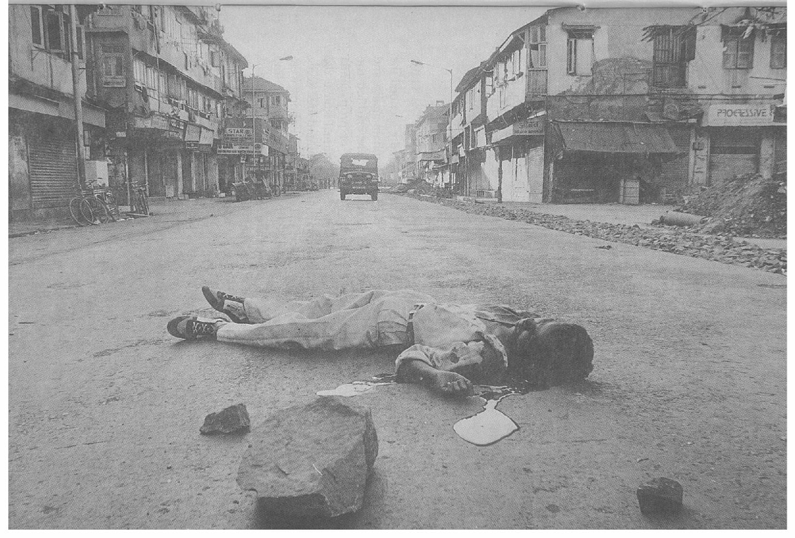
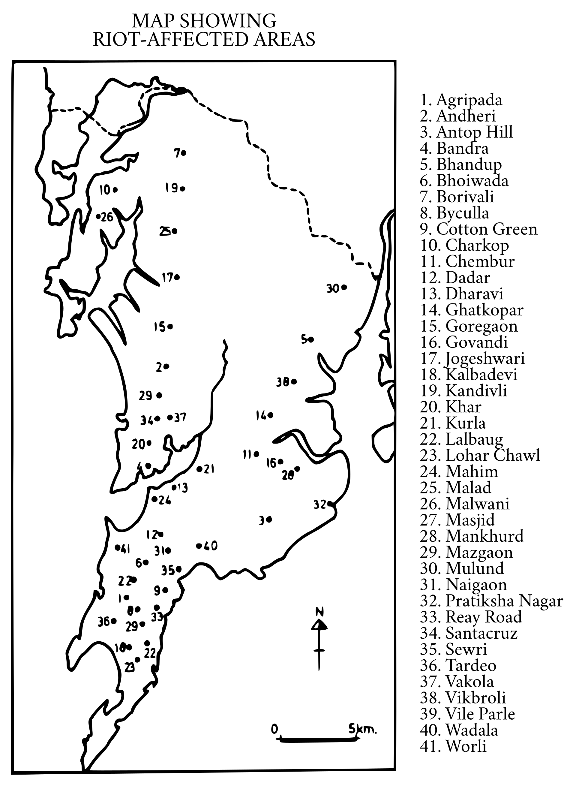

# THE EVIDENCE

We will now briefly summarise the evidence that has come
before us.

## SECTOR REPORTS

### AGRIPADA

The tribunal has received about 297 statements from Agripada.

#### Saat Rasta / Dhobi Ghat Area:

The Saat Rasta area of Agripada covers a number of small
sectors known as Adarsh Nagar, Sane Guruji Nagar 'B' committee,
Ganesh Nagar 'C' Committee, Ganesh Nagar 'D' Committee, Indira
Nagar, Sanjay Gandhi Nagar, Saibaba Nagar, Bhim Nagar, Ram Deo
Nagar, Shanti Nagar, Ambedkar Nagar, Shastri Nagar, Vijay Nagar, Jai
Bhawani Nagar and Shiv Shakti Nagar. The first three localities have a
majority of Muslims, the rest are mixed, with a predominance of
Hindus in most of them.

Prior to the riots, there was no apparent discord between the
members of the two communities. Even during the December 1992
riots, peace was maintained. One of the deponents has credited this
to the timely action of PSI Ghanwat who prevented the _Shiv Sainiks_ of
the neighbouring Pathan Chawl from creating tension in the area.
However, a few days prior to the January 1993 riots, Muslims of Adarsh
Nagar had received threats of violence and looting from the local
_goondas_. In view of the increasing tension in the city from 6.1.1993,
Muslims and Hindu elders of the area got together and resolved that
trouble makers would not be allowed to create any mischief in their
area. Infiltration from outside was to be checked and able-bodied
males would take turns at keeping a vigil at night. Despite these
precautions, various incidents took place which sparked off a riot on
9.1.1993.

A big mob started attacking the Madina Masjid, compelling the
police to resort to firing. The death of a Maharashtrian youth in the
firing provoked further acts of violence. That evening, a poultry shop
owned by a Muslim was broken into and its contents looted. Both
Hindus and Muslims participated in the looting. Three other shops, two
belonging to Muslims and one to a Hindu, met with the same fate. All
the four shops were burnt after the looting was over. The police
deployed in the vicinity were reported to have opened fire, resulting in
the instantaneous death of two persons.

That evening, a _maha-arti_ was performed near the local Sai
Baba temple. Communal elements used the occasion to launch a
tirade against Muslims and to instigate the mob to burn, loot and drive
out Muslims from the area. At about 9.00 pm, the power supply in
some homes was disrupted, further contributing to the prevalent
tension. The atmosphere was already surcharged by the conclusion of
the _maha-arti_, when devotees shouted slogans and beat drums as they
dispersed. The devotees according to witnesses, were armed with all
manner of deadly weapons. All the rioters were wearing saffron
headbands. Roofs of Muslim houses were smashed with bricks and
stones, petrol bombs were flung at these structures due to which the
houses caught fire. The attempts of the residents to stamp out the fire
were not very successful. The police arrived belatedly and opened
fire, resulting in several injuries. Quite a number of victims were
Muslims and one of them, Sayyed Mohammed, who was taken to the
Kasturba Hospital, was refused admission there. His relatives had to
shift the unfortunate victim to the Nair Hospital.

The police left soon after, encouraging the mob to resume their
deadly looting and burning spree. A majority of the sufferers were
Muslims, with a fair sprinkling of Hindus. A number of persons were
victims of knife and chopper attacks. Most of the Muslims in the
affected area fled their homes.

It must be mentioned that a number of instances of Hindus
coming to the assistance of their Muslim neighbours have come to
light. One S_____ gave refuge to her Muslim neighbours and was
beaten up when she refused to disclose their whereabouts. So
menacing had the situation become for her, that she was forced to
leave her home and take refuge with her sister. On returning she saw
that her home had been completely looted, the miscreants having
taken away every single article in her home. Another, S.B_____ gave
shelter to a couple and their four children. A third woman rescued a
female friend from the neighbourhood along with the friend's family
and sheltered the rescued persons for quite a few days. One I_____ not
only hid her Muslim tenant but assisted that tenant in delivering a
baby in her home. When this act of charity came to the ears of the
local _Shiv Sainiks_, they warned her to refrain from these 'good
samaritan' acts. Another woman, a Maharashtrian Hindu, helped a
Muslim woman to escape from an unsafe area by disguising her as a
Maharashtrian. A milk vendor rescued a Muslim woman from a mob
of armed hoodlums. Several other incidents of this nature have been
narrated by the witnesses.

So fierce was the violence and destruction let loose against the
Muslims, that the majority of them had fled their homes by 10.1.1993.
Taxis belonging to Muslims were not spared and one of the major
sufferers in the area was an ex-MLA, Hassnein by name. He gave a
graphic description of the damage done to his property, his efforts to
get assistance and his failure in obtaining any. Not only did he try to
contact the police, but also ministers of the state government.
However, all his efforts were in vain.

The police emerged in a clearly unfavourable light; their action
if any, was belated, and hardly effective against the Shiv Sainik rioters
and was definitely not helpful to the victims. In fact, two of them,
identified as Havaldars Ashok Naik and Raja were said to have taken
an active part in the rioting and looting. In their interaction with the
Muslims, they minced no words to display their prejudices against
Muslims or in favour of the Shiv Sena. If compelled to arrest _Shiv
Sainiks_, they did so most reluctantly and were very prompt in releasing
the criminals at the earliest possible opportunity. Small wonder then,
that a large number of witnesses have described the police as being
hand-in-glove with the _Shiv Sainiks_.

The Muslims who began returning to their damaged homes are
still extremely insecure due to police apathy and the ill-concealed
threats of the _Shiv Sainiks_. The _Shiv Sainiks_ also resorted to all kinds of
harassment, including the cutting off of the water and power supply in
order to discourage the return of Muslims to the area.
The compensation received by the victims is meagre while
several have not even received the compensation doled out by the
Government.

#### BIT Chawls

There are a sprinkling of Muslims in the BIT Chawls in Agripada
who have suffered the same fate as other members of their
community residing elsewhere in Bombay, during the January 1993
bout of rioting. Prior to this, both the communities had been living in
peace and amity for decades. The gymnasium in Agripada had been
frequented by boys of both the communities. On 8.1.1993 a big mob
of _Shiv Sainiks_ went about the area burning Muslim homes. It was
eventually with the help of the fire brigade that some families could
leave their burning homes. The looting was completed on 9.1.1993,
after the besieged-families had moved out. Some three rioters were
arrested though many others continued to move about freely. The
rioting received an impetus on account of a _maha-arti_ which took
place in the area on 7.1.1993. The police did little or nothing to help
the victims. A detailed report of the doings of the police and the
rioters have been sent to the Government on behalf of Abdul Aziz
Ansari by his advocate on 2.2.1993. It does not appear that much has
been done to bring the culprits to book or any genuine efforts made to
recover the looted property.

One of the victims had stated that, when the fire brigade was
contacted, fire brigade personnel callously replied that fires in Agripada
should continue to rage! On its part, the police replied that Muslims
were to be allowed to burn or be killed. Telephones of Muslim homes
had been disconnected, the water supply cut off and rations not
allowed to come in. Even a convoy provided by the Agripada Relief
Committee bringing material for the sufferers was stoned by the
rioters.

It has also been stated by the witnesses that the rioters were
assisted substantially by the muscle power provided by the infamous
criminal gangs of Amar Naik and Arun Gavli. The majority of the
rioters were local people while a few were outsiders.

### ANDHERI

The Tribunal has received statements of about 161 witnesses
from Andheri (East) and also Andheri (West). Both the areas are
predominantly Hindu in composition, with a sprinkling of Muslims
here and there. The areas affected in the riots were Sambhaji Nagar,
Shivaji Nagar, Sahar Road, Mograpada, Kol Dongri, Gundavali, P.P.
Dias Compound, Saiwadi, Yagni Nagar, Amboli and Amboli Phatak. In
the December 1992 bout of rioting there were a few incidents of
rioting against Muslims, but these were of a minor character.

In the January 1993 bout of rioting, trouble started even before
9.1.1993. Threats were given to Muslims to leave the place and when
some Muslim moved out, their homes and shops were destroyed. The
slogans uttered by the mob made their affinity with the Shiv Sena clear.
The party appears to have a strong presence in the area and its
notables include Ramesh Prabhoo and Sitaram Salvi. But even the
Congress I legislator Ramesh Dubey who has won election after
election with Muslim support in particular, was with the rioters who
were pitted against the Muslims.

On 10.1.1993 fire balls were flung at Muslim homes and the
raging fires destroyed the structures as also the goods stored therein.
A _maha-arti_ was performed and so frightening were the acts of the
rampaging mobs that not only Muslims but even Hindus fled the areas.
On 11.1.1993 a mosque was destroyed. Police inaction had so
emboldened the rioters that even the Hindus residing in the area
became uncertain of their security. A joint procession of persons from
both the communities marched to the police station demanding
protection. The police made no commitment and the result was that
some of the victims were compelled to spend the night right outside
the police station, which saved their lives.

On 15.1.93 a garage belonging to a Muslim was looted. Several
Muslims were beaten up, their homes were wrecked, looted and burnt
down. In some cases the arrested rioters were released as a result of
the mediation of Sitaram Salvi, Ramesh Prabhoo and Ramesh Dubey.
The victims complain of not being allowed to return to their areas.
The Shiv Sena had put up notice boards threatening the returnees.
Having undergone such trauma, the Muslims are now desirous of
shifting to the predominantly Muslim areas. Loss of earnings, the
means of livelihood and disruption of children's education has resulted
in increasing the misery of the sufferers. Ration cards lost in the
course of the rioting are not being replaced easily by the current
administration. The victims of the riots do not have the money to
grease itching palms, or to get this or that piece of paper which is
considered a must for possessing a ration card. The police have
refused to register reports by the victims, delayed making of
panchnamas showing losses sustained by victims, mislaid panchnamas,
declined to give copies of panchnamas, destroyed reports when given
in writing and even warned victims against returning to the area for
they were not in a position to ensure protection. It was only after the
change of the police Commissioner that the situation improved to
some extent. Inspectors Subhash Patil, Kiran More and Ramesh Koriya
and P.S.I. Panhale have all been accused of incivility, rudeness,
inaction and hostility towards the Muslims.

That the Shiv Sena was staging the riots is indisputable. The
slogans shouted by the rioters, the flags carried by them and the
presence of a number of known _Shiv Sainiks_ like Sadanand Vichare,
Sitaram Salvi, Narain Mistry, Ramesh More and others amongst the
rioters has been testified against by several persons. However,
witnesses also speak of Congress I party supporters in the riots and
these include Ramesh Dubey.

The compensation received by the victims is limited to those
whose houses were burnt. Damaged houses reduced to sand and
gravel have not been considered eligible for compensation. Dependents
of five persons who lost their lives in the riots were given little or no
compensation. In a number of cases the victims received far less then
the official entitlement and this makes it clear that the Collector's staff
has pocketed sizable sums meant for the victims.

### ANTOP HILL

The Tribunal has received 223 statements from Antop Hill.

(a) The area serviced by the police station at Antop Hill covers
a wide territory. This territory covers small pockets bearing names like
Mahatma Gandhi Nagar, Indira Seva Mandal, Shastri Nagar, Sangam
Nagar, Shanta Nagar, Naik Nagar,Sardar Nagar, Santoshi Mata Nagar
and Mariamma Temple Nagar, as also Pratiksha Nagar (which will be
dealt with separately).

In December 1992 there was trouble in these areas but not to
the extent found in other affected areas of Bombay. However, on
27.12.1992 a large mob of _Shiv Sainiks_ attacked the Muslim homes in
the area. The house of one Shehzada Sheikh Ahmed was attacked.
His wife received injuries on her hands and legs. She was taken for
treatment to Sion Hospital. The compounder there remarked that the
wounded person was not in Pakistan and would not be given any
treatment. Later on, a fresh attack took place. The police resorted to
firing and one of those injured was Mr. Ahmed's son. A little later, the
house belonging to Mr. Ahmed was completely destroyed by the mob.
Mr. Ahmed was unfortunate in that whatever little remained with him
was looted when he was again attacked on 9.1.1993 or 10.1.1993. The
rioters were led by Ramchandra Mishra and Ramdev Varma, both _Shiv
Sainiks_. The first is a slum-lord who has made it his business to sell
land belonging to the government and frighten people into doing his
bidding.

Abdul Latif speaks of an incident dated 8.12.1992 when he was
struck by a bullet fired by the police. At that time he had gone out to
collect his children as he had heard about the police resorting to firing.

In the January 1993 bout of rioting a large number of persons
belonging to the Muslim community in different pockets suffered in
person and property. On the night of 6.1.1993 Mohamed Safdar of
Sardar Nagar was threatened into leaving his house, or else his entire
family would be killed. The threat worked and Mohamed Safdar and
his family fled. When he returned on 21.1.93, he found his house
bereft of articles. His neighbours told him that his house had been
looted and some of the articles burnt outside his house, immediately
after he had fled on 7.1.1993. Mohammed Safdar has not been given
any compensation.

Karima Banu speaks of two young men from the area in which
she lives, namely Shastri Nagar, who called upon her to give up crying
for Allah and turn instead to Ram. The boys named Nanu and
Bhagwan threatened to burn down the Muslim huts, together with the
Muslims therein. The police arrived at the spot with great difficulty
and shifted the Muslims under attack to Sunder Hotel, where no food
or water was provided to the victims, although they remained there for
quite a few days. Eventually the military provided an escort and the
refugees were shifted to the Relief Camp at Musafirkhana. Karima says
that the Antop Hill police station is totally uncooperative, and is driving
people from pillar to post in order to lodge complaints or demanding
copies of different documents.

Shiraz Sheikh's house was looted on 10.1.1993 and 11.1.1993.
All that he could take with him when the family moved out was a box
of clothes. Another witness, Sayed Wali Ahmed, came with ten others,
all of whose establishments on S.M. Road had been burnt down and
looted. The man behind all this was one Bhonsale said to be in the
Water Department. The victims suffered a loss of Rs. 30,00,000 but no
compensation has been given to them. The _Shiv Sainiks_ in the
neighbourhood have warned the victims not to return and set up new
businesses.

Feroze Khan of Indira Nagar had his house and factory looted
and burnt down on 10.1.1993 by local persons including children. The
police did not respond in time. In spite of the detailed complaint of
Feroze Khan, no action was taken by the police.

Inayatullah of Indira Seva Mandal speaks of his shop being
surrounded by a mob of 1,000 people on 11.1.1993. He and his family
resided in a room above his shop. Both the premises were looted and
destroyed. No compensation has been paid and the police have not
taken any action against the miscreants. Abdul Salam had a shoe shop
on S.M. Road. The stock-in-trade and furniture worth about
Rs.4,50,000 was looted and burnt. When the victim learnt of this he
sought the assistance of the Antop Hill police. The reply given was
that he was welcome to do something on his own as they did not have
the requisite force to deal with the rioters.

Zameerunnissa speaks of her husband having died in police
firing on the night of 11.1.1993. Her house had also been burnt down.
Akbar Ali's house in Santoshi Mata Nagar was attacked and destroyed
on 11.1.1993 by South Indians and Dalits. No compensation was
Similar is the testimony of Khursheedbi. The police had
few rioters on the report of Khursheedbi but the arrested persons were
released soon after.

Hafeeza was living in Mahatma Gandhi Nagar hutment colony.
Her hut was targeted by rioters on 11.1.1993. Everyone started running
about in a panic and the witness has since lost touch with a son of
hers and her husband. The rioters were from her area but she was not
willing to reveal their names as they had threatened to kill her and the
remaining members of the family if she disclosed their names.

Bansi Lokhande's house was burnt down on 11.1.1993. No
compensation has been given except for the paltry sum of Rs. 5,000.
Several witnesses from Mahatma Gandhi Nagar spoke of the burning of
their huts, the unwillingness of the police to take action against the
miscreants and their either getting a pittance or nothing, by way of
compensation.

Mohamed Subbar who lives in Mahatma Gandhi Nagar suffered
two attacks. On 9.1.1993 his shop was looted and destroyed and on
14.1.1993 his house was targeted. When approached, the police
pleaded their inability to help. Begumbi of Mahatma Gandhi Nagar
testified along with three other women. Their huts were set on fire on
the night of 11.1.93. Some of the victims received Rs. 250/each by
way of immediate relief, two of the victims received Rs. 5,000 each
and nothing was received by the others. Zubeda, Amina and
Shamshuda speak of their huts situated near the railway station being
set on fire on the evening of 12.1.1993. Three attacks were launched
on these hutments, but no compensation has been paid to these
victims.

Some of the affected persons were Hindus. Goribi says that on
13.1.1993, several huts in the area were set on fire. The fire affected
Hindus as also Muslims and all of them had to flee the area. A paltry
compensation was given to the victims, if at all.

Ahmed Khan of Naik Nagar says that his shop was looted on
12.1.1993 and later his house was also attacked. He and his family
were given shelter by a non-Muslim neighbour. No compensation has
been paid to the victim who had been compelled to leave his family at
Bangalore. Saira Banu of Muzzawar Chawl spoke of her husband Riaz
Ahmed having been killed on 8.12.92. The killing took place at Kurla
and Saira Banu has received a cheque for Rs. 30,000. The corpse of
the murdered man was recovered days later. Residents of Muzzawar
Chawl testified to people from the area being picked up and held
incommunicado for long periods by the police.

Mohamed Naeem, a taxi driver of Shastri Nagar had his house
stoned by a mob of _Shiv Sainiks_ which included one Darshana. The
masjid behind his house was set on fire. A Christian and a Teluguspeaking
Hindu neighbour on either side of Mohamed Naeem's home
persuaded the mob not to set fire to Mohamed Naeem's house as the
same would destroy theirs homes also. The attacks increased in
frequency as also intensity and eventually at night Mohamed Naeem
was forced to leave the area with his family. Though a number of
taxis were burnt down Mohamed Naeem's was miraculously
untouched as it was parked between taxis belonging to Hindus.
The Muslims of the area were not allowed to return to their
homes because of the threats issued by the Shiv Sena. The police gave
no practical assistance.

#### (b) Pratiksha Nagar

Pratiksha Nagar is a transit camp maintained by the Housing
Board for the purpose of accommodating dishoused persons from
buildings in different localities, which are to be repaired or
reconstructed under the Housing Board Act. There are about 400
structures in this camp. A majority of the population (approx. 85%)
consists of Hindus and the remaining are Muslims and other minority
communities. They had been living in peace without any communal
tension for the last several years. 184 persons from Pratiksha Nagar
deposed before us.

In December 1992, Pratiksha Nagar was trouble free. On
6.12.1992 about 200 _Shiv Sainiks_ had collected near the BEST bus
depot at midnight. Nizamuddin Siddiqui, a Special Executive
Magistrate of that area, who himself had to flee from that place later
on, reported the matter to the police who immediately dispersed the
crowd. On the next day the police gave protection to the two
mosques which were situated in the area. No untoward incident took
place thereafter.

On 2.1.1993 and 3.1.1993 certain persons claiming to be
employees of the Bombay Housing Board went round the tenements
on the pretext of checking the names of the occupants. But they only
verified and checked the tenements occupied by the Muslims. All such
tenements werē marked with chalk from the outside.

The first incident took place in the area on 7.1.1993 when two
taxis were burnt at around 4.00 a.m. Sub-Inspector Paul of Antop Hill
police station arrested some boys. One was the son of Sub-Inspector
Vinayak Patil who had a sword in his hand. It appears that the
arrested boys were released the next morning. It has also come on
record that Sub-Inspector Paul was thereafter transferred from that
police station.

On 8.1.1993, it was rumoured that weapons had been collected
and stored at the Shiv Sena Shakha. On that day, the wife of Pramod
Thakur (Shiv Sena leader ) had gone around and collected protection
money from the Muslims at the rate of Rs.500 per family. Soon
thereafter, a number of Muslim-owned shops, taxis and bakeries were
attacked. This created panic in the area. Quite a number of Muslims
came out in the open and were appealing to the police to make
arrangements for their protection or to take them out of the area.
However, at about 6.00 p.m., the police informed the people that
curfew time had begun and all the Muslims who had come out in the
open were asked to go back and hide themselves wherever they
could. Inspite of the curfew, the whole area was tense and the Muslim
occupants were threatened that their houses would be set on fire.

Thereafter, the attacks began from 9.1.1993 and continued till
about 12.1.1993. The masjid was stoned, shops were looted, taxis,
autorickshaws, cars and tempos belonging to Muslims were set on fire.
A _maha-arti_ took place in the evening. The _Shiv Sainiks_ went around
all the chawls and told the Muslim occupants not to move about.
Thereafter, the Muslim houses were attacked, their belongings looted
and the occupants beaten up. We have evidence to show that on
9.1.1993, about 40 persons, mostly young _Shiv Sainiks_, had attacked
the masjid with swords, daggers, choppers, sticks etc. The police only
stood by and watched the entire incident. Sub-Inspector Patil and the
constables under him paid no heed to the protests and complaints
from the victims.

On the next day, the rioters returned in large numbers and there
was wide-spread arson. The rioters were shouting out that Muslims
should be killed. Instead of giving protection to the victims, the police
drove them away with the butts of their guns. Throughout the night
the area was lit with spotlights which enabled the rioters to identify the
rooms occupied by the Muslims and to continue their attacks. Many
eye-witnesses have deposed before us as to how several of them were
attacked and others killed. They had gone to the police station to
lodge complaints but the police gave them no protection. They
have also given us the names of several assailants. Sub-Inspector
Patil lives in Pratiksha Nagar and knows these assailants. No
action has been taken against them.

Instead of being given protection, the Muslims were ordered
by the police to gather in an open space near Sunder Vihar Hindu
Hotel, where they remained for about 3 days. During this time,
bricks, bottles and other missiles were thrown at them from the
surrounding buildings. This crowd, which steadily increased in
number, was under siege by the surrounding Hindus for 3 days
during which time they were under constant threat of being
massacred. The trauma of this prolonged and torturous anxiety is
evident from the testimony of scores of witnesses who deposed
before us.

The nearby Hindu residents were told by _Shiv Sainiks_ not to
give even a drop of water to the Muslims. When they wanted to
cook food for their babies and for the disabled, the police stopped
them from doing so on the pretext that preparation for cooking
would invite a fresh attack from the rioters. They were even told
that instead of drinking water they should drink human urine and
that the proper place for them was Pakistan or kabrastan. One
witness has said that for a glass of water they had to pay Rs.10/.
When they wanted to leave the place, the Shiv Sainik women staged
a rasta roko agitation. The police even collected Rs.20/per family
to allow them to leave the area, but they were still not allowed to
leave the place. On 12.1.1993, when one tempo-load of Muslims
tried to escape, the tyres of the tempo were slashed with swords by
_Shiv Sainiks_. Open threats were being given to victims that they
would all be killed and would not be allowed to leave the place.
All the while the police did nothing.

One Mohammed Mukarram Khan, a member of the Bombay
Aman Committee, was asked to transport food and water to
Pratiksha Nagar and to help evacuate the people. He has given a
detailed statement as to what transpired when he visited the place.
Before he visited the place, he had contacted Mr. Pasricha
(Additional Commissioner of Police) who had directed the Antop
Hill police station to give him the necessary escort. On the way, his
jeep was attacked. Finally, when he went to the police station, SubInspector
Patil abused him. Whilst he was at the police station, a
mob arrived there and demanded that his jeep be checked and that
he should not be allowed to go. The jeep was searched but
nothing was found. The police on their own did not take any
initiative. It was only when the local Shakha Pramukh came there
that the mob was made to disperse and it was thereafter that he was
allowed out and could make arrangements to shift the victims to the
relief camps.

The evidence shows that thereafter, about 3,000 persons were
removed from the area with the assistance of a military convoy.
Even when the military was escorting them out, the mob obstructed
the convoy by throwing stones, shouting abusive slogans and by
throwing burning objects. The military could not fire at the mob as
no such order was given to them by D.C.P.Rane, who had arrived
there subsequently. It appears that the jeep in which Mohammed
Mukarram Khan had gone to Pratiksha Nagar was retained by SubInspector
Patil for no apparent reason and could only be retrieved
eight days later.

The evidence shows that the Aman Committee had
complained to the Chief Minister but he had done very little to
protect the victims. The evidence also shows that most of the
persons who had fled Pratiksha Nagar have not gone back. Most of
the houses are destroyed or damaged and they are not in a position
to reconstruct and occupy the same. The witnesses have reported
the losses suffered by them, but the compensation received is
meagre. The government has not granted any compensation in
respect of losses suffered due to looting. Most of the victims have
lodged complaints at the police station but there is no evidence as
to what action the police have taken, though the names of the
assailants have been given. However, some victims have stated that
their erstwhile neighbours have treated them well. But in the most
part, they are not confident of returning to reside in the same area.

### BANDRA

Fifty-six persons have given their statements in respect of
this area. For the purpose of the present report, Bandra has been
divided into 5 areas:1. Kherwadi & Nirmal Nagar,
2. Bharat Nagar,
3. Behrampada
4. Garib Nagar
5. Bandra (West).

#### Kberwadi & Nirmal Nagar

We have evidence of only one incident that occured on 7.12.92
when rioting took place in the area and one or two houses were
burnt and looted. The names of the rioters that have come on record
are Daulat Sudham, Dinesh Rudhal and certain others associated with
them. When complaints were lodged, some other innocent persons
were arrested but the real culprits were not apprehended.

In the month of January 1993 the area was tense, the incidents
started from 10.1.93 and continued upto 13.1.93. On 10.1.93 there
were certain incidents of bottle and stone throwing and the police
dragged innocent persons from their homes and mercilessly beat them
up. On 12.1.93 at about 4.00 p.m. Madhukar Sarpotdar of the Shiv
Sena gave a speech outside the Nirmal Nagar police station, for which
a huge crowd of Maharashtrian boys had gathered. The speech incited
the mob. The police were watching and were clapping along with the
mob. Soon thereafter, several houses were looted, burnt down and
damaged by the rioters. The police took no action to stop the rioting;
instead they supported the rioters.

As the riots subsided thereafter all over Bombay, there should
not have been any trouble in the area. However, on 23.1.93, a wall
was built by the residents of Shiv Sagar Building which literally
blocked the access of 14 Muslim families preventing them from
returning to their homes. A complaint was lodged at the police station,
but the police were not very helpful. In the meanwhile, the residents
of Shiv Sagar Building moved the court and obtained an injunction
restraining the BMC or any other person from demolishing the wall.
Though the BMC wanted to pull down the wall, they could not do so
because of a court injunction. Thus these 14 families have lost their
residence, although according to them they have been residing in the
area since the year 1952. The Shiv Sagar Building came up only in the
year 1986.

#### Bharat Nagar

The rioting started on 7.12.92. On that day all the shops in the
area had been closed as a protest against the demolition of the Babri
Masjid. The children who had gone to school in the morning returned
home early, as also several persons who had set out for their offices. In
the meanwhile, people from the government colony and Shiv Sena
started pelting stones. BEST buses were attacked and destroyed and
the police were also attacked. The police then resorted to firing, as a
result of which two persons died and several persons were injured.
The police fired directly at the mob, aiming mostly above the waist.
Finally the women from the locality came out and requested the police
to stop firing. On the next day at about 9.00 a.m., a mob of about 500
to 600 persons were seen rushing towards Bharat Nagar Colony. The
residents came out in fear to defend themselves. The evidence indicates
that the police, who had come with Madhukar Sarpotdar and Ashok
Shinde (a Shiv Sena Shakha Pramukh), instead of dispersing the mob,
only fired in the direction of Bharat Nagar. The result was that several
innocent persons suffered injuries. Two or three persons died in the
firing. The police also forcibly entered several homes and beat up men
and women. There were instances of the police firing even inside
homes and at old and young persons. The police did not permit the
injured to be taken to hospital. Even women cooking in their homes
received bullet injuries. The police destroyed property and threatened
the victims with dire consequences if they dared to file complaints. One
woman witness said that the police told her that if she were to complain,
they would kill her. Finally, the womenfolk came out and requested the
police to stop killing innocent persons. There were about 1000 to 2000
women. It was only after repeated appeals that the police stopped
attacking innocent persons. It was at this time that several persons
suffered injuries and several lost their lives, all due to police firing and
beating. The witnesses have mentioned the names of the officers who
indulged in this kind of mindless shooting. Their names are Inspector
Desai, Inspector Prabhakar Borde, Inspector Babar, Mr. Rane, Mr. Saiba,
Mr. Mohite, Mr. Verghese and Mr. Suryavanshi.

There was one more incident on 15.1.93 at the 315 bus stop,
mentioned in Ms. Flavia Agnes' report, which we will deal with
hereunder.

#### Bebrampada

Behrampada is a slum area situated over 10 acres of land parallel
to the railway tracks between Bandra and Khar stations, on the eastern
side of the railway tracks. On the southern end of the _basti_ runs the
Anant Kanekar Marg, which is the main access road from Bandra station
to the government offices and housing complexes situated at Bandra
(East). On the northern end of the _basti_ there are four storied L.I.G.
buildings and on the eastern side are the six storied New M.I.G.
colonies. This is predominantly a Muslim _basti_. This area falls under the
Nirmal Nagar police station's jurisdiction. The jurisdiction of Kherwadi
police station is across the highway on the eastern side. This is a more
affluent residential area. The Maharashtrian intelligensia ,artists, writers,
journalists and architects, live in high rise housing complexes which
are known as Kala Nagar, Sahitya Sahavas, Patrakar Nagar and Artec
respectively.

Except for pockets like Behrampada, Navpada and Bharat
Nagar, the remaining are residential areas, predominantly populated by
Hindus with a strong Shiv Sena influence. Mr. Bal Thackeray lives in
Kala Nagar. Mr. Madhukar Sarpotdar, who was arrested for inciting
communal passions during the 1984 riots, wields a strong influence
over the Maharashtrian youth in this area. In the same complex there
are government offices such as MSEB, ONGC, Indian Oil and recently
the Court Complex. The trade unions of these government offices are
also dominated by the Shiv Sena.

Originally Behrampada was marshy land but during the last 40
years several Muslim artisans came and settled in this area. They have
their traditional crafts of block printing, zari, embroidery work,
readymade garments, costume jewellery and carpentry. Today the area
has electricity, water taps, common latrines, a ration shop and
telephone connections. It has a population of about 50,000 persons
out of which about 12,000 are Hindus.

It appears that during each election promises were made to
develop Behrampada under the Slum Improvement Scheme, but these
promises have not been fulfilled. By and large, Behrampada has
remained a strong Congress I supporter.

As the surrounding area developed into well planned residential
and commercial complexes, Behrampada has come under a lot of
pressure to evict the occupants. The Railways wanted the _basti_ to be
vacated but the residents claimed that the land belongs to the
Collector. The people are united in saving Behrampada. There has
been no communal tension within Behrampada.

The incidents in this area started on 7.12.92 due to a rumour that
the residents of Behrampada, on the previous night, had beheaded an
idol of Ganesh from the Ganesh Mandir situated on Anant Kanekar
Marg. So, at about 7.00 a.m. a large number of persons collected
outside the Ganesh Mandir. Thereafter, the crowd started throwing
stones. There were 3 constables in the Bandra Court situated opposite
the Ganesh Mandir. The constables tried to intervene but the crowd
would not heed them. The police then resorted to firing not at the
crowd but into the Behrampada colony. Several boys died in the
police firing. Here again, the police acted in a brutal manner by
entering houses, beating up residents and arresting innocent victims,
but the rioters were not apprehended. On the next day the police
again attacked the area and several persons were beaten up and also
fired at indiscriminately. The womenfolk once again gathered and
appealed to the police not to fire at children and innocent persons.
The police kept on firing and one of the bullets struck one Neelam,
wife of Imtiaz, who was only appealing to the police not to fire. She
died on the spot.

As far as Behrampada is concerned, we have a detailed report
from Ms. Flavia Agnes, an advocate and social activist who has also
deposed before the Tribunal. She screened a video film entitled "I live
in Behrampada", produced by herself and Madhushree Dutta, a film
maker. The film is a compilation of interview excerpts. Ms. Agnes
also submitted a report which was prepared with the help of the
following persons from MASHWARA Legal Aid Centre of MAJLIS;
Madhushree Dutta, Lavina Fernandes, Audrey D'Mello, Aruna Burte,
Neera Adarkar and the students of Nirmala Niketan College of Social
Work. The report sets out in detail the incidents that took place at
Behrampada and Kherwadi. Flavia Agnes has recorded statements of
eye-witnesses to various incidents. The statements recorded by her
support the evidence before us. One of the eye-witnesses whose
statement is recorded by Flavia Agnes states that the police agreed not
to come inside Behrampada if they handed over the body of a person,
killed in police firing, peacefully without causing any commotion. The
women agreed and 4 of them, 3 Muslims and 1 Hindu, carried the
body to the police van at the gate. Thereafter, on the night of 10.12.92
the police entered the _basti_ and started a combing operation.
Newspapers reported that the police had recovered knives, choppers,
chemicals, crude guns and petrol bombs. Significantly though, no such
combing was done in the LIG and MIG colonies from where much of
the attack on the _basti_ was initiated.

In retaliation, the police kidnapped 10 persons on 8.12.1992 and
12 were injured. Some of the witnesses have stated that the police
were accompanied by Madhukar Sarpotdar, the local MLA and Ashok
Shinde, a Shakha Pramukh of that area. Flavia Agnes says that there
was no attack on the police on 8.12.92 and there was no justification
for firing on that day.

After 10.12.92 peace efforts were initiated. Some Muslim leaders
in the area volunteered to donate a Ganesh statue to ease communal
tensions and ensure peace and harmony in the area; this was rejected
by the Shiv Sena leaders. On 27.12.92, although curfew was in force,
a huge procession was taken out to install a new statue. Provocative
and abusive slogans against Behrampada were raised during the
procession. Thereafter, speakers were placed near the Behrampada
entrance and _maha-artis_ came to be conducted twice a day,once in the
afternoon, which were organised by the Shiv Sena dominated
undertakings of ONGC, MSEB and Indian Oil during their lunch break
and once in the evening. Madhukar Sarpotdar himself would attend
these _maha-artis_ and make provocative and abusive speeches against
Behrampada.

Ms. Agnes' report has collected evidence to show how during
that period the police and Shiv Sena had assembled on the terrace of
Building No.30 of LIG Colony and how petrol bombs were hurled over
the _basti_. During this period 2 or 3 incidents took place which
enabled the tension to continue; one was the killing of an old Muslim
man by the name of Gulab Sheikh, a member of the Peace Committee.
This incident did not take place in Behrampada but at Navpada and
the culprit was shot dead by the police. Madhukar Sarpotdar began
saying that the residents of Behrampada did not want peace in the
area, whilst several others stated that the incident occurred out of
personal rivalry. The other incident was the discovery of 3 bodies
from the sanitary tank of a public toilet at the edge of Behrampada on
Anant Kanekar Marg. One of the bodies was identified as that of a
Muslim constable from Nasik who was in Bombay on official duty; the
other 2 bodies were of Hindus. Nobody knows how these persons
died but these incidents provided the fuel for _Shiv Sainiks_ to unleash a
campaign against Behrampada, saying that it is a threat to Hindu safety
and it must be evacuated. The vernacular press came out with
negative reports of Behrampada being a den of criminals, anti-nationals
and harbouring illegal immigrants from Bangladesh and Pakistan and
stated that there was a factory in it which produces arms and that dead
bodies were strewn in the by-lanes of Behrampada. All these were
deliberately spread rumours but they had the desired effect. The trade
unions of O.N.G.C., M.S.E.B. and Indian Oil wrote to the home
minister to evict the _basti_ and widen the road so that the white
collared office goers are secure. The middle and upper class housing
complexes, schools, colleges and hostels of Bandra (East) signed a
memorandum against Behrampada. A door to door signature
campaign was carried out demanding evacuation of the _basti_. In the
meanwhile there was a threat of social boycott - the milk man would
not deliver milk, the gas company would not deliver gas, the BMC
workers would not clear the garbage. People in the _basti_ would not
venture out, not even to the banks or to the main vegetable market.
Children could not attend schools situated in the L.I.G. area.

It was during this period that Nirmala Niketan assigned young
students to carry out a survey to assess the damage. MASHWARA COordinated
this activity along with other agencies working in the area.
These activists entered this area around 15.12.92. They met several
injured persons who were hiding in their homes. They also noted that
there was no Hindu-Muslim tension in the area and that there was
hardly any damage to property within the _basti_. There was a meeting
on 30.12.92 at the Collector's office at Bandra (East) to discuss the
problems of relief work. The meeting was attended by the Minister
Vijay Sinh Mohite Patil, Muslim leaders, Shabana Azmi, Flavia Agnes
and others from MASHWARA . The Muslim leaders questioned how
permission for provocative processions could have been given on
27.12.92. Madhukar Sarpotdar then raised his voice and threateningly
told the persons who were present not to interfere with local politics
and he said that outsiders like social workers incited communal
violence and that they had no business to enter his area. The Minister,
of course, did not protest against Madhukar Sarpotdar.

On 11.1.93 Madhukar Sarpotdar was arrested just outside the
New M.I.G. Buildings; he was later released by the police. On 12.1.93
he addressed a public meeting outside Nirmal Nagar police station and
told the mob that not a single Muslim house should be left intact in the
area. The police who heard the speech applauded. The mobs
thereafter entered the housing complex and looted and burnt property
and stabbed many people. On 14.1.93 Madhukar Sarpotdar was
arrested again; Shiv Sena party workers, especially women supporters,
protested. Finally the police released him and his supporters took out
a victory procession. On the next day i.e. 15.1.93 there were several
attacks on the Muslims.

Flavia Agnes has recorded 1 or 2 most gruesome incidents in
this area. One such incident relates to how 2 Muslim passengers in a
taxi within a distance of 100 yards from Kherwadi police station were
pulled out and stoned. As they fainted and fell down, kerosene was
poured on them and they were set on fire. One person died on the
spot and the other died subsequently. The incident occurred on a
road parallel to the highway at 2.00 p.m. Between the highway and
the road is a government complex of gazetted officers, yet nobody
intervened. At the same time, 50 yards away, buses were stoned and
as one of the buses stopped, 6 Muslim passengers were dragged out
and stoned. One person who was hurt on the head fell down and
fainted. The mob poured kerosene on him and burnt him alive. Whilst
the man was burning women activists of the Shiv Sena threw stones at
the body. A local corporator, Sunanda Patil, telephoned the police but
they did not come till after the body was burnt; the excuse was that
they were busy in Bharat Nagar, when in fact there was no incident on
that day in Bharat Nagar.

Another incident relates to the attacks on the _namaazis_.
Different newspapers have given different versions. The incident took
place on 15.1.93. The police fired into Behrampada from all sides.
There was firing even at a distance of 500' feet from the Masjid which
was the scene of the incident. At the time of the firing only women
and children were in the _basti_ as the men had gone for _namaaz_. The
women came out and appealed to the police not to fire but the police
did not comply. Shabana, a 10 year old girl, received bullet injuries on
her shoulder and thigh and Bablu, a 10 year old boy received an injury
on his leg and is still in hospital with a steel rod in his leg. A bullet
pierced the abdomen of a 55 year old lady, Zeenatunnissa. Abida,
who was breast feeding her 10 month old baby, received a bullet
injury on her thigh. According to the police, 3 persons died and 14
were injured. Amongst the dead was a 60 year old man who was shot
while climbing the staircase to his house. The injured were rushed to
Bhabha Hospital where they were refused admission till Sunil Dutt
intervened.

Some of the journalists reported that the _namaazis_ had attacked
the people. Flavia Agnes has the evidence of eye-witnesses. One eyewitness
is a Hindu resident of Building No.28, he stated that boys were
throwing petrol bombs from his building at the _namaazis_.
Immediately the _namaazis_ scattered and started running helter-skelter.
Soon afterwards, a group of 20--25 Muslim boys came with bottles and
tube lights and one had a crude gun in his hand. On the L.I.G. side a
hundred boys gathered with sticks, bottles, tube lights and some had
revolvers in their hands. The police version is that they opened fire
when the Muslims attacked them. It appears that the following day the
police control room reported that a huge haul of fire arms, petrol
bombs and ammunition was recovered from Behrampada. But the
pictures released to the press shows that the arms were kitchen knives,
hockey sticks, bottles filled with petrol and there was only one crude
gun. The police admitted that no firing could be done with the
said gun.

When the riots in the rest of Bombay were cooling down,
Bandra (East) was still simmering. So the local leaders decided to
celebrate Republic Day by inviting prominent social workers for the
function. Amongst the dignitaries who attended the function were
Baba Amte, Satyadev Dubey, Rohini Hattangadi, Arun Naik and Dr.
Jamkhedkar, President of M.I.G. Colony. Following this programme
the residents approached the police station to ensure children's safety
for their schooling. The social workers assured persons that they
would take part in restoring confidence. It appears that on one
Sunday evening, Dr. Jamkhedkar was told that there would be no
peace in the area without the consent of Madhukar Sarpotdar.
Unmindful of this warning, about 500 children were escorted to school
on 1.2.93 by a group of Maharashtrian volunteers from Old M.I.G.
Colony. That night bombs were thrown on the _basti_. _Shiv Sainiks_ had
gathered near the Ganesh mandir and rags soaked in petrol we
hurled at the huts. There is a small Ganesh mandir inside the _basti_
which also caught fire. A 25 year old youth who ran to the roof to put
out the fire was shot by the police from the terrace of the L.I.G.
building. Immediately the electricity was cut off. Petrol bombs were
continued to be thrown till about midnight which resulted in a huge
fire. 54 huts were destroyed. The fire brigade came only after the huts
were destroyed. The newspapers came out with different versions.
Four days later Madhukar Sarpotdar was arrested under the National
Securities Act. Since then, the Shiv Sena campaign has cooled down.
The police force has since been overhauled.

We also have evidence from the residents of MIG Colony which
surrounds Behrampada. The witnesses who actually reside in the
M.I.G. Colony and hold responsible positions have stated how the
police had resorted to firing at Behrampada on 8.12.92. They could
see the firing from their building. It has been stated that the attitude of
the police was one of hatred against innocent victims rather than a
sincere attempt to control the riots. It appears that in some of the
buildings of M.I.G. Colony inflammable material had been collected on
the terraces for the purpose of setting fire to the Behrampada houses.
But before any action could be taken the military was brought in and
Madhukar Sarpotdar was arrested and Behrampada thus escaped being
set on fire. The residents of M.I.G. Colony have also seen how on
15.1.93 some boys from the terraces of one of the buildings start
flinging stones and petrol bombs against the Muslims who had
gathered for _namaaz_.

#### Garib Nagar

In this area the incident occurred on 15.1.93 which was a Friday.
The police started firing at _namaazis_ at about 1.45 p.m. The women of
Garib Nagar requested the police to stop firing but the police paid no
heed, with the result that several women received injuries and even
children who were playing outside their houses were injured in police
firing. There seems to be no justification whatsoever for the police
firing, and that too, at women and children.

#### Bandra (West)

We have only one statement showing how certain huts situated
along the pipe line were destroyed between 6.12.92 and 18.12.92.

### BHANDUP

The Tribunal has received about 16 statements from Bhandup.
This area was affected in both the bouts of rioting. On
10.12.1992 the Muslim residents of the area were subjected to a
sustained attack by miscreants. When the police were asked for help,
the reply was that they could do nothing. However, when the victims
tried to ward off the attacks or retaliate the police came down upon
them with a heavy hand.

A number of young men from the Muslim community were
lined up by the police on the afternoon of 12.12.1992. These boys
were publicly beaten. The elected representative to the B.M.C. from
the area, whom one witness describes as Manoramatai, was
approached for help, but to no effect. A witness speaks of this very
woman being sugary sweet before the elections in order to get Muslim
votes and then making frivolous excuses when asked to visit the
affected area.

The same observation is made of one Sunil Chitnis who
described himself as a leader of the Janata Dal. Mr. Chitnis led a mob
which looted a footwear shop, the home of the owner of the shop and
several other homes in the area. The same mob was responsible for
killing one Gaffarbhai and setting his home on fire. Gaffarbhai's body
was hacked to pieces and flung into a burning fire. A report of the
occurence was given to the Bhandup police. Sunil Chitnis was
identified and even remanded to custody till 21.12.1992. It is said that
the then minister of state for home, Babanrao Pachpute intervened and
had him released on 16.12.1992. After his release Sunil instigated the
tenants of one of the victims to refuse to pay rent to the landlady. The
tenants complied with his direction with the result that whilst the lessor
was deprived of the rental income, her son was robbed of his footwear
business, as also his home.

### BHOIWADA

The Tribunal has received 5 statements from Bhoiwada.

In the December 1992 bout of rioting, a mob consisting of _Shiv
Sainiks_ and Dalits stoned a Muslim occupied building known as
Dadabhoy Chawl on Dr. Ambedkar Road. This was on the night of
8.12.1992. The occupants of the chawl retaliated in kind. The police
arrived quite late and did no more than arrest innocent residents of the
chawl.

Dadhabhoy Chawl was again attacked on 8.1.1993 by a mob of
about a hundred persons armed with deadly weapons like petrol
bombs, acid bottles, swords and choppers. All night long the rioters
looted, damaged and destroyed the homes and property of Muslims.
The police stood by doing nothing. The next day, i.e. on 9.1.93 a
person returning from the local durgah waschasedby shawlcovered
boys. These boys again stoned the Dadhabhoy Chawl. When the
police came on the scene they rounded up 26 boys, aged between 12
and 14 years, from the chawl. A witness stated that the boys were
beaten and abused by the police in the presence of the armed _Shiv
Sainiks_, who according to the police were carrying arms not for use as
weapons of offence, but only for self defense! The boys were kept in
custody for five days. The occupants left behind in the chawl, mostly
women andchildren, took refuge in a nearby mosque. From the
mosque they witnessed the looting and destruction of their homes by
_Shiv Sainiks_ as also by some of their own neighbours. The victims
claim to be in a position toidentify both the groups, though not the
guilty policemen.

At Abhyudaya Nagar, Muslims returning from prayers were
assaulted by Shiv Sainik goons armed with guptis and choppers. One
of the victims died whilst being carried to the hospital. By mid-day
Muslim homes in Abhyudaya Nagar were being looted and articles
found in them burnt. In the Elphinstone Road area, in the very
presence of the police, a Hindu mob looted a biscuit shop. The police
in fact participated in the consumption of the looted goods. On 9.1.93
an intoxicated mob, about 600 strong, armed to the teeth, invaded the
railway quarters of Currey Road. A Muslim family which had been
given shelter by Sindhi neighbours was brought out, stripped and
beaten up. One Mohammed Wasim's brother was stabbed and his
corpse flung into a gutter. In another gory incident, a Muslim home in
Karupatil Chawl was broken into. All the inmates of the chawl were
injured and the aged mother's fingers were chopped off. The looting
and burning continued at T.B.Kadam Marg, Parshuram Nagar and Lal
Bagh durgah area. From the last named area, the victims fled and
took refuge in a nearby non-Muslim colony. The police, on being
informed of this, made it clear that they could not guarantee the
safety of the refugees. In fact, their advice was that the refugees
leave the area as soon as possible.

At Ganpatrao Kadam Marg and Kalachowky Housing Board,
attacks on Muslims and the looting of their property continued. On
10.1.93 about 50 rioters stormed into the BEST staff quarters. Muslim
families in the area were attacked with choppers and swords. An
injured person seeking help from the nearby Rafi Ahmed Kidwai Marg
police station was turned away on the plea that they did not have a
sufficient number of men to ensure the defence of those being
attacked. The inmates of Qazi Chawl were attacked on 10.1.93.
When one of the victims returned one week later to the spot, he was
surprised to find a temple standing right against his house. The Ali
Sheth Patra Chawl was attacked on 10.1.93 by _Shiv Sainiks_ numbering
about 200. A Muslim family living nearby was given shelter by his
Hindu neighbours but the home of the family was completely looted.

### BORIVALI

The Tribunal has received 4 statements from Borivali.

In December 1992 there was virtually no violence or arson,
motivated by communal animosity in the area, at least on a large
scale.

The position, however, was different in the January 1993 bout
of rioting. An unruly mob of _Shiv Sainiks_ which threatened to get out
of hand, had to be fired upon. In the firing a Shiv Sainik died. The
death was attributed by the Shiv Sena to Inspector Khan. The _Shiv
Sainiks_ went about the area threatening revenge. The timing of the
revenge was planned at the return of the funeral processionists, after
the cremation of the dead man. This was enough to frighten the
handful of Muslims residing in Borivali East. They left their homes
and shops. In their absence, their homes and shops were broken
into. The looting, sometimes culminating in burning, entailed heavy
losses. The refugees had lodged reports at the police station
concerned, after verifying the losses incurred. No effective steps have
been taken by the police to trace the lost property, or the culprits.

### BYCULLA/MAZGAON

The Tribunal has received 39 statements from
Byculla/Mazgaon.

These localities have a mixed population of Hindus,
Christians and Muslims. The Maharashtrian Hindus, are mostly
inclined towards the Shiv Sena. However, communal and political
feelings did not intrude into the day to day life of the people. Prior
to 6.12.1992, there was no significant communal animosity.

Trouble began with a slogan led by Ram Naik and Praful
Desai of the BJP in December 1992. For no rhyme or reason the
slogan uttered by the processionists was, "Jo humse takrayega, woh
mitti mein mil jayega." The idea was to provoke the Muslims and, as
expected, the area became tense.

Tension erupted into violence on 7.12.1992. Stones were
pelted at the car of one Sayyed Mehmood Hussein. The next day
his confectionary shop and motorcycle were set on fire. Leading
the arsonists was Prabhakar, a resident of the locality. Repeated
calls to the police for help not having been responded to, the victim
and his family were compelled to flee from the scene. His shop
and residence were destroyed and the articles therein looted. The
looting of other Muslim shops in the area also continued on
8.12.1992.

The rioting took a serious turn in January when looting, arson
and violence against Muslims continued virtually unchecked from
8.1.1993 to 11.1.1993. Hindu mobs took to the streets destroying
and damaging Muslim residences and commercial establishments.
On 9.1.1993, a huge mob of _Shiv Sainiks_ went on the rampage,
looting and burning the property of Muslims. On this day a MahaArti
had taken place and the rioters were loudly encouraged by
women _Shiv Sainiks_ named Mrs. Parab and Mrs. Rane.

On 10.1.1993, a truck belonging to one Rehman Sheikh was
burnt at Mazgaon. Also burnt that day, was a timber mart, by a
mob led by one Ashok and S. Palkar of the Shiv Sena. At
Kopergaon, fifty to sixty taxis, belonging to members of all
communities, that had been parked in various garages, were burnt
on the same day. Some oil and drum factories were also destroyed
Some of the witnesses have attributed this destruction to the
builders. A nearby mosque was attacked. Four persons died
during the riots, one due to police firing.

### CHEMBUR/MANKHURD

The Tribunal has received 16 statements from this area.

The area was rocked by trouble in both the bouts of rioting. In
December 1992 there was not much trouble. Threats were given by
goons belonging to the BJP and the Shiv Sena. The persons
threatened were Muslims. Muslims were asked to get out of the area.

On 8.12.1992, Fakir Mohammed Sheikh who resides at
Mohammed Noor Chawl on the R.C.Road at Chembur Naka, found his
autorickshaw being damaged and his home being stoned. When Fakir
Mohammed went to complain, he was asked to come in the evening
by Inspector Karkare of the Chembur police station. He was called to
the police station later and arrested. Fakir Mohammed was prevented
from contacting anyone and sent to the Ghatkopar lock-up. The next
day he was produced before a Magistrate at Kurla Court who
remanded Fakir Mohammed to custody till 16.12.1992. People from his
sect got him released on bail on 10.12.1992 by arranging for a cash
deposit of Rs. 2,000. On the night of 15.12.1992 Fakir Mohammed
came back to reside at his home. The police took him to the police
station on the pretext that they would record his report. He was
however arrested and once again people from his sect got him
released on bail. Realising that there was no remedy against repeated
arrests, Fakir Mohammed left for Bhavnagar. He returned from that
city on 2.2.1993 to find his home reduced to ashes. The municipal
councillor Ravindra Pawar advised him to lodge a complaint at the
police station. His complaint was taken down. However, immediately
thereafter the police took his finger prints and locked him up. He was
sent to the Arthur Road Jail and he had to arrange for fresh bail to
secure his release. On 25.2.1993 the police had come again to his
house. Fakir Mohammed did not pursue his report, for whenever he
went to the police station he was arrested. He could not go back to
his house and had to dispose of his autorickshaw to raise money. In
the end he had lost his home, his autorickshaw and whatever little
money he had. His complaint addressed to the commissioner of police
sent on 4.2.1993 does not appear to have yielded any result.

In the January 1993 bout of rioting tension began right from
6.1.1993. The encouragement given by the Shiv Sena and the Sangh
Parivar to the looting, burning and damaging of Muslim property
infected the anti-socials and on 10.1.1993 a mob looted shops of
Hindus as also Muslims. Horror stricken, the Muslims fled the area.

Particularly vicious was the treatment meted out to one Salim
Kapur who was working as a builder in Chembur and residing in
Bhandup village. Salim got married to a Hindu Brahmin woman and
the couple had a daughter. He lived in an area which had a large
number of Marathi speaking Hindus. Right from 6.1.1993 the Marathi
speaking Hindus started threatening Salim. On 10.1.1993, the Marathi
speaking mobs attacked his home. Scared, Salim moved his wife and
children to a friend's place. On the night of 11.1.1993 his house was
damaged from the outside. On 12.1.1993 he shifted some valuable
articles from his house to the home of his Hindu neighbours. The same
night Navina, Ravi, Chandu Wadekar, Mane and Achrekar residing in
the Watandar Chawl, a nearby area, managed to effect an entry into his
house. Costly items kept in the house were damaged beyond repair.
The vandals did not even spare idols of deities that his Hindu wife
used for worship. The Kanjurmarg police were informed by
telephone, of what had happened. A hint was given to Salim not to
return to his home as a plan had been hatched to physically eliminate
his entire family. On 15.1.1993 Salim approached and narrated his
woes to D.C.P. Zone VI Mr. Ninglova. The officer directed his
subordinates of Kanjur Marg police station to take action. Six culprits
were arrested. By 9.00 p.m. the local Shiv Sena leaders had managed
to collect a big mob outside the police station loudly demanding the
release of the arrested persons.

Further information was received of a large mob heading
towards the police station. Salim, fearing for his safety, left the police
station. The mobs forced the police to release the culprits and they,
together with their friends, caused damage to Salim's home and
belongings and also inflicted a beating on a Hindu neighbour in whose
house Salim had shifted some of his valuables. Salim left for Kerala to
start his life anew. During his absence, his office in Chembur was
visited by toughs wanting to know where he had gone. The staff was
told that they were going to settle scores with Salim. Salim received
information that a plan had been hatched to abduct him and his family
as soon as they were sighted. Privy to this conspiracy were members
of the Autorickshaw Union controlled by the Shiv Sena, whose
members were immediately to rush to the help of the abductors so as
to remove the victims to a secluded place where they could be safely
eliminated. The authorities of the school where Salim's daughter was
taking education were told to inform the intimidators as soon as the
child came to school. They were further warned against issuing a
transfer certificate to the child. Detailed communications addressed by
Salim to several authorities yielded no result.

Baba Saheb residing at Gajanand Raivashi, Kardev Nagar fled
the area heeding the advice of his neighbours. He learnt that his
house had been broken into and his valuables destroyed or stolen. No
compensation was given to him. This in fact, appears to be the fate of
all the victims barring a few who received meagre sums.

The police, as usual, acted partially. In fact, Mehmood Majeed
residing at New Sayaji Nagar, Cheetah Camp complains of his cousin
being picked up by Inspector Kapse from Bhoiwada police station on
10.1.1993 and thereafter not being traceable. The policemen contacted
gave no information. Several such disappearances have taken place of
persons picked up by the police.

In Ekta Nagar, the residents comprising members of both the
communities decided to stand united and put up a fight against mobs
coming from outside. On 10.1.1993 a battle took place in which
several residents of Ekta Nagar were injured and a number of houses
completely destroyed. The victims had to flee. It was not possible to
return as there were no structures left to accommodate the returnees.

### DADAR/NAIGAON

In Naigaon, which falls under the Kalachowky police station,
the Dhonpoda Masjid was being guarded by a police party comprising
amongst other officers, Sub-Inspector Ghosalkar. A large mob
including prominent _Shiv Sainiks_ like Ravi Chavan, Ramakant Rahate,
Bhai Shringare, Shridhar Kadam and Anil Gaikwad launched the
assault on the mosque. Repeated appeals by the police to the mob to
disperse peacefully had no effect. Equally ineffective was the lathi
charge and the bursting of tear gas. On the other hand the mob
started attacking the police with soda water bottles and burning
missiles. By this time, a bigger mob of about 12,000 persons had
come from the direction of Dattaram Lad Marg. On the way it had set
fire to vehicles and shops belonging to Muslims. A third mob from
Garamkhada Maidan started towards the masjid. Hemmed in from
three sides by determined mobs, the police party had no alternative
but to take recourse to firing. The police saw a Muslim being set
ablaze and others being assaulted. The whole incident forms the
subject of a report lodged by Sub-Inspector Mane. The same evening,
a mob wended its way towards the police station shouting slogans
against the police and demanding that those arrested earlier for the
violence be released. Shiv Sena leaders Devidas Kalsekar, Ravi
Chavan, Deepak Patkar and Sanjay Naik made fiery speeches inciting
the mob against the police. A lathi charge by the police proved
inadequate and the mob caused damage to the police station and
damaged their vehicles. Eventually the DCP was forced to order his
men to fire and this had the desired effect.

The rioting had spread to Reay Road, Barrister Nath Pai Marg,
Shravan Yeshwant Chowk, Swan Mills and Jijamata Nagar. At the last
named place a durgah was damaged. Rioting had spread to such an
extent that the police and the fire brigade were unable to cope with
the situation. To make things more difficult for the law enforcing
agencies, the rioters had placed hurdles all along the way. It should
not be difficult to bring some of the prominent offenders to book
because Mane claims that he knew quite a number of them and could
identify a fair number of participants instigating the mob and
participating in the riot.

Anand Patwardhan, the eminent film-maker who lives in Dadar,
has stated that only Muslims were targeted for the attacks. When he
enquired about his own safety, he was assured that he would not be
attacked because he is a Hindu.

### DHARAVI

The Tribunal has received 53 statements from Dharavi.

The biggest slum of Asia has been surprisingly free of
communal disharmony, at least until December 1992. The beginning of
communal animosity in this region can be traced to a meeting held in
the last week of November 1992 by one of the Dharavi units of the
Sangh Parivar, and chaired by R.S.Mehta. The Muslims were roundly
abused as being "bigoted, pampered by the government and criminalminded."
The next incident was sponsored by the Sangh Parivar and
the Shiv Sena on 6.12.1992, to celebrate the demolition of the Babri
Masjid. Leading the procession was Baburao Mane of the Shiv Sena.
There were the usual anti-Muslim slogans, bordering on abuse and
vulgarity. The police, who were present in the procession, did nothing
to check the brazen display of bigotry.

On 7th December 1992 the Muslims of the area took out a
procession, in protest against the earlier one. The procession was
stoned from the direction of Kumbharwada, a locality which is almost
entirely Hindu. Chaos ensued as a result of the stoning. The police
started firing at the processionists and not in the direction of
Kumbharwada. Homes and shops of Muslims were looted and burnt.
The rioting continued the next day also, when Muslim homes were set
on fire. The police, instead of checking the rioters, fired at the Muslims
who included one group which was trying to put off the fire that had
engulfed a temple. As a result of the incidents of 6.12.92 to 8.12.92,
relations between the communities took a turn for the worse. This was
the background in which the January 1993 riots have to be viewed.

On 6.1.1993 the area exploded into violence with Muslims being
singled out for attack, loot and arson. As before, the police were
indifferent to the plight of the victims. Rioting continued right upto
15.1.1993 when the armed _Shiv Sainiks_ and the BJP rioters went about
openly beating and intimidating Muslims, burning and looting their
property.

There have been instances when Muslim anti-socials attacked
Hindus. A Muslim taxi owner damaged an idol and a temple, thus
giving opportunity to the Shiv Sena to gain the support of the hitherto
neutral Tamilian Hindus to join them in their anti-Muslim activities. The
imposition of curfew had little or no effect, for the enforcement was
one sided i.e. in the Muslim areas, which were mostly at the receiving
end. The police, when approached by the Muslims, came out with
proclamations of being _Shiv Sainiks_ at heart.

The Muslims who specially suffered were those in the leather
and garments industries. From this it appears that the idea of the rioters
was to so destroy the Muslims economically, that it would take years for
them to re-establish themselves.

A pattern followed here as elsewhere, was to save structures
occupied by Muslims but owned by Hindus. Here the practice was
to bring out moveables of such occupants, burn or damage those
moveables which were identifiable and pilfer and remove unidentifiable
valuables like ornaments and currency notes. This shows
meticulous directions given to the rioters by those who had planned
and executed the tasks entrusted to them. These included the
corporator of the area, M.Y.Shinde who had been fielded by the RPI
which was a coalition partner of the Congress I. He led mobs who
were looting, burning, maiming and killing Muslims. But Shinde had
influential supporters like Gaikwad, now a minister and Javed Khan,
then a minister. One of the allegations made before us was that
these two men had prevailed upon the energetic and impartial
deputy commissioner of police, Sanjay Pande to let off Shinde for a
few hours. Taking advantage of the breather, Shinde decamped and
was never found.!

DCP Pande was highly spoken of by the witnesses. As against
this applause were the critical comments made against Senior Inspector
In-charge Ahire, Inspector Bilase and almost the entire police force
attached to the Dharavi police station.

The victims of the rioting suffered tremendously in terms of
property loss, morale and their future. Education of children was
disrupted, in some cases permanently, as their victimised parents were
in no position to pay their fees.

The witnesses have given the names of about 37 rioters,
including M.Y.Shinde and Pramod Thakur (Shiv Sena leader).
Dependents of those killed received the prescribed
compensation of Rs. 1,00,000 in two parts i.e. in cash and bonds.
Those injured and hospitalised got Rs. 5000. Those who did not go
to hospitals out of fear did not receive any compensation. Persons
whose houses had been destroyed but not burnt, were not
compensated. Victims whose houses were burnt,if compensated,
received meagre sums. This was the plight of Muslim victims.

Some from the majority community who had not suffered in the
riots at all, managed to get compensation awarded to them and their
friends. Their names and other particulars have been given to us by
social workers belonging to the majority community in the area.

The Muslims were not entirely blameless, to quote from an
excellent report prepared by Gurbir Singh, entitled "The Dharavi
Holocaust"

> ... this time there was a counter attack by the well prepared
Muslims. Groups rained stones and kerosene-dipped fire balls on the
Hindu section and the attackers. An inspection of the Hindu chawls in
Bagicha area, showed widespread damage to roof tiles and the use of
kerosene balls. The houses on the border of Chamda Bazar like those
of Vithal Prakash Tikre and Laxman Khandare, bore the brunt of the
damage. But two significant facts were glaring. One, the damage to
the Hindu section was not due to arson and was small in proportion to
the destruction wrought on the Muslim side. Second, both
communities had fought a war, but it was fought on the "Muslim
territory" of Chamda Bazar.

"The explanation as to why Muslim fatalities only took place at
Chamda Bazar, was convoluted and unconvincing, to say the least.
Since the rioting wasin the Muslim areas, where Muslims predominate,
firing there will naturally claim Muslim lives," argued DCP Pande.

Mr. Singh's report showed that 40 garment and other small scale
units had been wiped out in Rajabally Compound on 7.12.1992. The
mob was reportedly led by one Joseph, said to be a chowkidar at the
Prime Minister's Grant Project (PMGP) building complex on the
northern side of the Rajabally compound. A Congress worker, Malsa
was also seen in the attacking mob. The report also showed how on
the same day, a Muslim mob had attempted to burn a temple in the
Social Nagar side, and also burnt and looted several Hindu shops. So
also, a whole row of kutcha' huts of pavement dwellers along the
Social Nagar lane had been gutted. The next day, waves of Hindu
mobs attacked Muslim property. Shaikh Ibrahim's garment unit was
looted on the Laxmi Baug side. The mob made an attempt to burn the
place down, but failed. A Shiv Sena Shakha Pramukh, one Vithal
Pawar was leading the crowd The baharwalla (waiter who serves
clients outide the hotel) of Gulshani Hotel was stabbed to death by this
mob. Gulshan Bakery was looted of cash amounting to Rs. 50,000.
It appears that the sensitive Social Nagar - Laxmi Baug corner had
only a posse of one police officer and 4 constables, who promptly fled
the scene when trouble started.

The report mentions that near the Social Nagar Mosque, two
massive godowns belonging to a Hindu proprietor had been reduced
to rubble by fire. The fire quickly spread, causing the burning down
of about 25 residential tenements.

A total number of 32 persons died, of whom 8 were Hindu, 1
Christian and the rest Muslims. Most of the deaths were due to police
firing though an appreciable number were victims of stabbings.

The victims had spoken with praise of individuals and groups
belonging to the Rashtriya Ekta Samiti, the CPI and the CPM, as
compared to the so-called centrist parties like the Congress I and the
Janata Dal who seem to have been divided on communal lines.

### GHATKOPAR

The Tribunal has received 93 statements from Ghatkopar.

This suburb has a number of sectors. The January 1993 riots
affected areas like Altaf Nagar, Gangawadi, Sainath Nagar, Indira
Nagar, Golibar, Ganesh Maidan, Asalfa, Barve Nagar, Jayantilal
Vaishnav Marg, Bhat Wadi, Kajupada, Kothodipada etc. Even in
December 1992 incidents of arson, looting and intimidation had taken
place against Muslims of the aforementioned areas. The police had
then not taken effective steps to curb the miscreants who belonged to
the Shiv Sena and units of the Sangh Parivar. On the contrary the
Ghatkopar police indiscriminately picked up a number of Muslims for
no particular rhyme or reason, gave them a beating and locked them
up.

In Asalfa village the same drama was enacted. On 6.12.1992 a
few Muslim homes had been broken into and looted. Instead of
helping the victims, the police went on the rampage, recklessly
arresting Muslims, beating up Muslim boys and inflicting severe
casualties on them. It is said that in the January 1993 round of rioting
as many as 22 people were killed and almost all of them were
Muslims. These deaths were caused by swords, choppers and knives.
The rioters belonged, in the main to the Shiv Sena and BJP, members
of Amar Kreeda Mandal, Seven Star and Shivling Mitra Mandal.
Repeated phone calls to the area police station yielded no results.

In the Barve Nagar area the Muslims were targeted in
Deccember 1992 and January 1993. The intensity of the riots was
higher in January 1993. The _Shiv Sainiks_ indulged in looting, burning
and destroying Muslim homes. In fact, in the Asalfa area the _Shiv
Sainiks_ had put up a notice announcing a reward of Rs.50,000 to
anyone who pointed out a Muslim home in the area. As to redress,
the victims were made to run from pillar to post even for the lodging
of reports at the police station and getting compensation panchnamas
drawn up or getting copies of these documents. In the Golibar area
about 200 tenements had been destroyed by rioters belonging to the
Shiv Sena and the RPI. The police gave no protection. Those who
took a prominent part in the looting were Manda Ringe, Shanker
Ringe, Vilas Salekar, Raju Katker etc.,all from the Golibar locality and
belonging to the Shiv Sena. Even the murderers of one Bahadur were
left scot free and were found roaming about freely without any
hindrance. The rioters have been named in a number of reports
lodged with the Ghatkopar police station.

In Indira Nagar there was rioting in December 1992 and January
1993. Here it was not only the Muslims who suffered. Nineteen
      homes of Hindus and two of Christians were destroyed along with
      twenty-one of Muslims. The victims who included Muslims as also
      Hindus and Christians have wrested permission to rebuild their homes
      from the government. With help given by the Y.M.C.A. some homes
      have been reconstructed.

In Hiat Mohammed Chawl, Parsiwadi, five shops of Muslims
were gutted by fire on 12.12.1992. The miscreants were unknown and
four charred bodies were found. All these bodies were of Muslims.
On 11.1.1993 a plumber's shop on Agra Road was broken open, looted
and set on fire. Articles of value were carted away in a lorry. This was
the work of Ghanshyam Rajput and his gang. After the demolition and
burning a Shiv Sena flag was planted on the vacant site. On 13.1.1993,
a Hanuman temple came up overnight at that place. Five more shops
of Muslims were burnt the same night. The victims had pointed out
some of the things they had lost to Inspector Suresh Marathe of
Ghatkopar police station but no action has been taken and in fact
there have been complaints that the Inspector has driven out some of
the complainants from the police station when they came to lodge
complaints and behaved rudely with the victims.

In Bhat Wadi there are 77 Muslim families out of a total of 1088
families. The colony is surrounded by localities known as Kajupada,
Kamchi Pitamber Nagar and Kathoripada. In the December 1992 riots,
though 13 shops of Muslims were looted, the rioting was not very
severe. The picture changed in January 1993. Large mobs of _Shiv
Sainiks_ attacked, burnt and destroyed Muslim residences and
commercial establishments. None of the rioters has been arrested, nor
has the lost property been recovered. Only a few of the affected
families have been compensated and that too, to the meagre extent of
Rs.4,000. Two police officers who have come in for favourable
mention by a victim are P.S.I. Rane and police constable Shivaji
Dangle. The former is said to have helped injured persons and it was
the help given by the latter which saved the lives of 12 Muslim
families.

In the Bhat Wadi Muslim Colony some 101 persons have
suffered and they belong to different walks of life. The loss suffered
by each victim ranges from Rs.50,000 to lakhs of rupees. In
Kajupada a large number of huts were demolished and most of these
belonged to Muslims but the sufferers included also non-Muslims
whose houses were ringed in by those of the Muslims from different
sides. The vandals who indulged in this act were led by Manji
Bhanushali and Shivaji Kadam of the BJP and the Shiv Sena
respectively.

In Altaf Nagar, the worst attack was on 10.1.1993. The mobsters
included people from the locality as also from outside. The vandalism
and looting went on nearly for three days. The police force seen in
the area was scanty and almost inert. Nothing was being done by
them. The Muslims of Altaf Nagar had been reduced to beggary, for
the losses they suffered were immense and the compensation received
by the lucky few was grossly inadequate. Even after the worst was
over and near normalcy had returned the victims were not being
allowed to return to their homes. In fact the influential _Shiv Sainiks_ in
the area had made it clear that they did not want any Muslims in the
area. In the Golibar area of Altaf Nagar the rioters who belonged to
the Shiv Sena, proclaimed that this was being done to make way for a
club of theirs. The police stood by indifferently when the vandalism
and looting was in progress. Assistant police Inspector Zendekar on
receipt of complaints expressed his opinion that the complaints were
patently false as he refused to believe that persons with small homes
could have so much of property and so valuable,as claimed by the
victims.

In Gangawadi the Muslim residents living in the vicinity of
Husseina Masjid were attacked on 10.1.1993 and the victims had the
same experience as those from Altaf Nagar. The frightened victims
fled their homes and took shelter in the durgah of Pankeshah Baba.
The masjid in the area had to suffer the desecration of a Shiv Sainik
flag being put over it. This flag was not allowed to be removed even
as late as the last days of February 1993.

In Yakubwalla Chawl the Muslims were attacked by Congress I
workers numbering about 50. This was on 10.1.1993, and the mob
destroyed shops belonging to Muslims. One of the victims who was
doing business in vegetables, betel leaves and groceries explains the
action of some of these persons as being due to her refusal to give
goods on credit to the sons of one Shinde.

### GOREGAON

The Tribunal has received 22 statements from Goregaon.

Rioting affected areas in the eastern as well as the western sides
of Goregaon. Azad Nagar, which is in Goregaon (east), was affected
from 8.1.1993. Isolated incidents took place on 8.1.1993 and 9.1.1993
at the Ghas Bazaar.

The next day another incident took place at the Jay Coach
Transit Camp. On 10.1.1993, a well-known and much respected social
worker of the area, Abbas Retiwala was killed by a mob of 50 persons.
The next day, on 11.1.1993, a godown belonging to a Muslim was
looted and destroyed.

On 13.1.1993, a mob came from the Santosh Nagar side, armed
with weapons and shouting provocative slogans; their target was the
Muslims in Azad Nagar. The mob was joined by police personnel who
arrived in a van and fired in the direction of the victims, rather than at
the rioters. Muslim boys from Azad Nagar were beaten up, whereafter
the mob went on the rampage, looting and destroying Muslim homes
and property. The police arbitarily picked up some Muslim boys and
gave them a merciless beating.

Similar attacks took place at Santosh Nagar on the 12.1.1993 and
14.1.1993. The attack was masterminded by one Vishnu and five
others, all belonging to the Shiv Sena.

In the western part of Goregaon, the affected areas were
Jawahar Nagar, Motilal Nagar and Prem Nagar. In Jawahar Nagar, a
mob of about 200 people shouting slogans like "Har Har Mahadeo",
"Jai Maharashtra" and "Jai Shri Ram", attacked the area's mosque and
imitating the Babri Masjid demolition, completely destroyed it. With
this as a prelude, the next targets were vehicles, homes and shops of
Muslims. These were burnt, destroyed or looted. One of the sufferers
was a Hindu whose shop on the Aarey Road got burnt along with four
other shops of Muslims.

In Prem Nagar, the attack began on 11.1.1993 and in Motilal
Nagar on 12.1.1993. The rioters named are Kannan Shetty, Linga, Raja,
Balesh, Uppal, Viren and police Inspector Dhoble, who is attached to
the Goregaon (West) police station.

The victims have received meagre compensation and the sense
of fear experienced by them has still not disappeared. Communal
prejudice seems to have infected even medical personnel attached to
public hospitals, like the Bhagwati Hospital and the Nanavati Hospital.
Muslim victims of the violence were either prevented from entering
these hospitals, told to get lost, or if treated, were attented to in a
manner clearly indicating that they were unwelcome.

### GOVANDI

The Tribunal has received 52 statements from Govandi.

The major colonies in the area are Lotus Colony, Rafiq Nagar,
Bainganwadi and Chikalwadi and the police had attacked all these
colonies. Roughly 70% of the total population is Muslim. The living
conditions in some areas of these colonies are appalling, with people
literally living in filth with no housing or basic amenities whatsoever.

This is one area which was severely affected in December 1992
but was not affected by the riots of January 1993. Even in December
1992 the Hindu-Muslim rioting appeared to have occurred on a
comparatively minor scale. The major attacks, arson, looting and
in the police force. With the weakening of police authority, there has
been a rise of the growth and influence of communal politicians and
plain thugs and slumlords. In the 1990-1991 communal riots,
Jogeshwari was affected. Despite this, there has been no significant
improvement in the policing of the area. In fact, the residents of the
area classify the police and the BMC staff as part of the oppressors
they face, who are little better than the hoodlums and slumlords who
have made life difficult for them.

This is one area where the Muslims have acted as deplorably as
their tormentors --- the _Shiv Sainiks_, the Sangh Parivar and the police.
There was an increase in communal tension after the destruction of the
Babri Masjid. On 6.12.1992 itself, a meeting was said to have taken
place between Senior Inspector Deshmukh of the Jogeshwari police
station and the _Shiv Sainiks_ of the area. The secretive nature of the
meeting induced suspicion in Muslim minds and on 7.12.1992, Muslim
young men put up placards and notice boards condemning the
demolition of the Babri Masjid. Muslim youngsters went about the
streets threatening shopkeepers to close their establishments and
observe a bandh. The atmosphere worsened and very soon the
godown of a Muslim scrap-dealer was burnt; the arsonists were _Shiv
Sainiks_ of Shankarwadi and Dias Compound. Shankarwadi residents
hurled stones at the Pascal Colony, and according to one witness, the
mob was led by Head Constable Wadekar. This officer was described
as playingan unusually prominent role whenever tension arose in the
area. The Muslims retaliated but were fired upon by the police. In the
resultant firing, four Muslims were killed and a number of them were
injured. Not one Hindu was killed or injured. Several houses were
burnt, destroyed or looted. Hari Nagar was attacked by a big mob of
_Shiv Sainiks_. The police were said to have supported the rioters. They
entered the houses of Muslims and beat up the men. Muslim houses
in Amina Nagar were also targeted by _Shiv Sainiks_. On 8.12.1992, the
local mosque at Chacha Nagar was attacked. Police reaction to this
attack was to arrest and beat up 13 Muslims. People from both the
communities came together and had the boys released.

In the Income Tax Colony, several Muslim homes were looted
and destroyed. Hindus from the Prem Nagar and Amina Nagar
Colonies spoke of being harassed by Muslims since 6.12.1992. In fact,
they spoke of threats having been given as early as the Dassera of
1992. The threats, though vague or abusive, carried the implication
that the victims were to leave the area. Some Hindu doors were
mysteriously knocked upon at odd hours of the night in Sarvodaya
Nagar. The frightened residents deserted their homes. On the return
of peace they found that their homes had been looted. The tension
lasted for almost the entire month of December 1992 with stray
incidents recurring, thus preventing a return to full normalcy.

The _Maha-Arti_ took place almost daily between 1.1.1993 and
5.1.1993. In the 9.1.1993 procession which passed through Chacha
Nagar, even the police participated. The processionists looted and
destroyed a number of Muslim shops while on its way. Practically
every _Maha-arti_ was followed by violence and arson. That there was
pre-planning to the increase in the violence and arson was evident
from the actions of one Shankar Solanki who was running a factory in
Pascal Colony. On 7.1. 1993, Solanki, when questioned as to why he
was removing his machinery, said that he was not getting work in the
area. On 8.1.1993, Solanki made it clear that Muslims in the Pascal
Colony should be leaving the area as huge mobs of outsiders who
were on their way, were bent upon evicting them.

In Hari Nagar, the _Shiv Sainiks_ burnt and looted Muslim homes.
When the Muslims tried to defend themselves, they were fired upon by
policemen. In the Colaba Plot, Hindu homes were targeted by the
Muslims, but not the local Muslims. Firing took place, but whether it
was by the police or was private is not clear. In the firing, a Muslim
boy, Abdul Aziz was killed. In the Gandhi Chawl (which has been
mistakenly referred to as Radhabai Chawl by several persons), six
persons died, the police who are said to have been present, did
nothing to put out the fire. The fire brigade came, but three and a half
hours after the fire had begun. Who exactly caused the fire is not clear
and one of the witnesses examined before us has named 2 of the
arsonists as Fakir, son of Mohammed and Qazi, son of Mitwalla. These
persons are residents of Bodhibai Chawl. Another version of the
incident was related by one Muslim woman who has suggested that
the fire was caused by a Hindu lady with a view to putting an end to
her mentally demented daughter whose doings were a source of great
worry to her. We have come across accounts suggesting that the fire
was meant to frighten the Hindus. Such an excuse has been repeated
every time that fire has been used to exterminate people from the
attacked community in communal riots. No one can be taken in by
these excuses and the truth is that barbarism at its worst is witnessed in
communal riots. The fire in Bane's room led to large scale flight of
Hindus from the area. They took shelter in the Sarvodaya or Shyam
Nagar relief camps. The Shiv Sena and the Sangh Parivar exploited
this incident to its maximum. The incident acted as a spur to instigate
riots in other areas. In fact, the setting on fire of Bane's house
resulting in the death of four Hindus, along with two other incidents
have been described as the main events that intensified the rioting
against Muslims, if they did not give rise to the rioting itself. The
Hindu victims were well helped by the police who escorted them out
of troubled areas and allowed them to stay overnight at the police
station.

The Amina Nagar Muslims say that on the night of 7.1.1993 they
were subjected to repeated attacks by truckloads of rioters brought
from outside. A large number of huts, whether of Hindus or Muslims,
were burnt and destroyed. This went on for about 15 days and peace
returned to the area only after the military had been inducted. Two
Muslim boys were burnt alive. In Shivaji Nagar, the _Shiv Sainiks_ were
accompanied by police officers Bhambre and Sanjay Sawant when they
entered Muslim homes. The occupants were driven out, thereafter
their homes were looted and destroyed. The rioting reached its peak
on 8.1.1993 - several people said that this was a reaction to passions
aroused by the magnified accounts of the burning of Bane's room and
its occupants. The burning of Muslim property, whether huts or
vehicles, spread to Bandra Plot and Pascal Colony. The victims were
fired at by the police when they tried to stamp out the fire. This is
ascribed to builders Chotubhai, Solanki and his brother.

In Prem Nagar, Muslims were massacred on 8.1.1993. The
police reaction was to beat up Muslims and to arrest them from their
homes. There are a number of Muslim shops in Gandhi Nagar, which
is a predominantly Hindu area. The shops were broken open, looted
and burnt. According to the victims the looting and burning had taken
place during the curfew period.

In the Income Tax Colony the same inaction on the part of the
police has been referred to. In Seetawadi the police fired on people
trying to douse the burning homes and huts of both the communities.
The Meghwadi Muslims complain of the police abusing them when
approached for help and assisting the rioters by firing in the direction
of the victims.

On 8.1.1993, a meeting had taken place in the Shiv Sena office
in Meghwadi. Truckloads of outsiders had been brought in and local
residents identified Muslim homes. Very soon these homes were
targeted and it was only after the arrival of the military that peace was
restored. In Chacha Nagar on the same day, several homes of Muslims
were attacked. A.C.P. Suryavanshi who was then present, broke open a
cupboard in the Rehman Masjid and took away money from there.
Inspector Patil shot a boy in the chest. Several Muslim boys were
arrested even before the outbreak of the riot. In the Andheri Plot, a
timber mart owned by a Muslim kept burning for six hours. The police
turned a deaf ear to the repeated calls for help. In fact, the owner of
the timber mart was threatened with guns by the police for venturing
out during curfew hours.

Even in the latter part of January there were several incidents of
stabbing or assaults upon Muslims. Far from giving Muslims any
protection, the police arrested and beat them up in lockups.

The dishoused victims have received no compensation. In fact,
the residents of Seetawadi, with the help of the Nivara Hakk Suraksha
Samiti, managed to get some of their damaged huts reconstructed.
These reconstructed huts were demolished by the BMC under police
protection at the instigation of Ravi Waiker of the Shiv Sena, MLA
Ramesh Dube, Ward Officer V.B. Pawar, and Councillor Noorjehan
Afzalkhan Pathan. The politicians did not want any reconstruction to
take place without their intervention and also without their getting
'cuts' to which their high office entitles them.

In the Pascal Colony, the rioting was stoked by builder
Chotubhai and independent corporator Purshottam Solanki, who have
purchased large areas of land and are desirous of acquiring more. One
Seetaram Dalvi has even asked residents to join his scheme for
reconstruction or leave the area. Those not prepared to do so are
being threatened by his henchmen and are thus being prevented from
re-building their houses.

The hospitals of the area which have come in for adverse
comments are the Cooper Hospital. The hospital authorities were
warned by _Shiv Sainiks_ against admitting Muslim patients. Where some
Muslim did get admitted, they were not given proper treatment.
The compensation received by the victims ranges from Rs.500 to
Rs.5,000. In some cases of death, the next of kin have not even
received compensation. Too much red tape is involved in the
collection of compensation, with the victims and dependants being
asked to produce all kinds of documents.

### KALBADEVI/LOHAR CHAWL

The Tribunal has received 19 statements from Kalbadevi/Lohar
Chawl.

Kalbadevi is a predominantly Hindu area with isolated pockets
of commercial establishments and residences of Muslims. There were
no riots in December 1992. However, after the murder of two
'_mathadi_' workers, the area was rocked by violence in January 1993.
Muslims, their establishments and homes, became the targets of _Shiv
Sainiks_. The rioting went on from 7.1.1993 to 10.1.1993.

On 7.1.1993, Amirullah's house was forced open and all articles
from there were looted. The family took shelter in a nearby mosque
and went later to the V.T. railway station. Having seen the violence
and looting, Amirullah had no courage to continue residing at Bombay;
he left for his native place.

On 8.1.1993, Muslims residing in Chira Bazaar were forced out
of their homes. They hid themselves in a graveyard in the area. The
rioting _Shiv Sainiks_ were allowed by the police to attack Muslim homes
and loot them.

On 9.1.1993, the situation worsened. The L.T. Marg police
station, when approached by the victims, frankly told them that they
could not help them. Muslim homes and shops were looted and
burnt. A shop dealing in textiles and ready made garments was looted.
The participants included Mafatia of the BJP, and Prakash Khandelwal,
a member of the Home Guards. The Muslims had taken refuge in a
mosque as the streets had been taken over by the _Shiv Sainiks_
assembled there to participate in a _Maha-Arti_. After the _Maha-Arti_ was
over the Muslims were attacked and the police, far from defending
them, advised the Muslims not even to defend themselves.

Pramod Navalkar's deputy was approached and he gave a false
assurance that he would pacify the _Shiv Sainiks_. The assurance was
not honoured and was in fact, not seriously given.

On 10.1.1993, a Muslim home was burnt in the presence of the
police. When help was sought from a constable standing there, he
declined to do anything. The victims have not received compensation
and they have been reduced to penury.

In the Lohar Chawl area, twenty-two shops owned by Muslims
were looted and destroyed. This was on 9.1.1993 after a _Maha-Arti_ in
the area. These shops, though near the police Commissioner's office,
received no protection.

The Shiv Sena Pramukh, Narayan by name, extorted money out
of Muslim residents and shop owners, by compelling them to buy
tickets of Rs.100 each. Inspector Niralkar Swatra, Sub-Inspector Desai
and Constables Tambe and Kale have come in for adverse comments
by the witnesses. The Inspector and the constables led and assisted
the raid on Muslim homes, while PSI Desai is said to be guilty of not
drawing up panchnamas of losses suffered by Muslims.

### KANDIVLI

The Tribunal has received 25 statements from Kandivli.

This is a Housing Board Colony constructed by MHADA. The
tenants are from the lower middle class and are predominantly Hindus.
The colony is a vast one with several sectors. It does not seem to have
been affected by the December 1992 bout of rioting except to the
limted extent that the alleged excesses of Muslims in that phase of
rioting was utilised by the Sangh Parivar and the Shiv Sena to
propagate the myth of the Muslims having committed grave excesses in
the aftermath of the demolition of the Babri Masjid. The poisoning of
minds succeeded to a considerable extent as is evident from the
happenings in January 1993.

On or about 10.1.1993, Shiv Sena people pretending to be
officials of the State Government or MHADA went about ascertaining
the faith of the occupants. It later transpired that these persons were
part of the _Hindutva_ brigade wanting to earmark Muslim pockets. The
attack began on 11.1.1993, Muslim homes were targeted and the rioters
went about their task shouting the provocative slogan "Jai Shree Ram".
To add to people's frenzy a _Maha-Arti_ was staged in the area and this
ritual went on till late in the night. Muslim homes were looted and
belongings brought out and burnt. The looting and burning went on
for a number of days. No police force was stationed anywhere in the
area to check the mobsters. On 14.1.1993 one S.H_ was gang raped
after the killing of her husband. She was paraded in a naked condition
on the streets by the rioters. The ornaments on her person were
forcibly removed. With great difficulty she reached the police outpost.
An officer named Kumbhar when appealed to for help by S.H_____,
replied that he could do nothing and that she had better leave the
place as early as possible. S.H_____ went to the Kandivli police station.
She asked for a glass of water to which the Head constable replied
that Muslims had become too arrogant, demanding all sorts of favours.
Needless to say, the plea for water was not heeded. Nonetheless, she
was placed in a police vehicle. One of the constables misbehaved with
her there, taking liberties with her person. The van reached Bhagwati
Hospital where S.H_ was admitted and where she learnt of her
husband having passed away. On 16.1.1993 she was discharged from
the hospital, whereafter she moved to the Holy Family Hospital at
Bandra. At neither hospital did S.H_____ get much attention or solace.
On 21.1.1993 she came to the home of a friend of hers. Here, Shaila
Satpute from the organisation SWADHAR contacted her. The objective
of Swadhar is to help women in distress. Mrs. Satpute took up the
case of S.H_____ and compelled the police to have her examined at the
Byculla Police Hospital. Mrs. Satpute's insistence and the medical
examination which S.H_____ had undergone, frightened the Kandivili
police. Inspector Hargude of the said police station tried to pressurise
S.H_____ into withdrawing her allegations against the policemen. At one
stage he even managed to obtain her signature on some paper bearing
Marathi writing, a language which S.H_____ is not conversant with. Some
constables were lined up before her to enable her to identify her
tormentor. Care had been taken to see that the guilty policeman was
not amongst them. Inspector Hargude and Kumbhar went about saying
that S.H _'s complaint was baseless. In the face of this attitude of the
police, S.H_____, despite the support of SWADHAR could do nothing. In
addition, Shaila Satpute found that the police had made no reference in
the recorded statement to the fact that S.H_____ had been paraded naked
and that some policemen had misbehaved with her. Therefore this
witness told the police that this statement was not genuine and would
not be accepted. She has stated that the police are still not
investigating the case properly even though the culprits can easily be
identified and arrested. The police are repeating that the complaint of
S.H._____ was false. This shows how the police are acting in collusin with
the rioters.

Afzal Hussein is a Sub-Editor of the Navbharat Times. Till
10.1.1993 Mr. Hussein was staying at Sector 34, Charkop Housing
Society, Kandivili (West). His house was attacked on that day by some
miscreants and so he took shelter with his next door neighbour Mr.
Rajesh. The crowd damaged several articles lying in his apartment and
several belongings were set on fire. This took place at about 9.00 p.m.
The police arrived at about 9.35 p.m. The police took down the
statement of this witness and others. The next morning he went to the
police station and lodged a regular complaint. Thereafter some police
protection was given but all the victims were advised to shift from that
place. The police finally arrested about 390 rioters. A message was
received by the Muslims who had left Charkop that they could return
to their homes provided they stated in their police statements that
none of them could recognise any of the 390 persons as being the
rioters. This is the reason why many Muslim victims have not yet
returned to Charkop.

In the meanwhile the witness noticed that on the morning of
10.1.1993 there was a rumour of milk supply to Bombay being
poisoned. There was also another rumour that 3 truck loads of
Muslims were coming from Jogeshwari and Behrampada and they
were spoken of as '_shaheedis_', i.e. Muslims ready to riot and lay down
their lives. He says that these rumours had been deliberately spread to
compel the Muslims to vacate so that the rioters could loot, burn and
murder the Muslims remaining behind. He also suspects that
Inspector Kumbhar was partial to the Hindus.

On 13.1.1993 DCP Thorat who had arrested 390 rioters earlier
was transferred. It appears that in the rioting on the night of 10.1.1993,
the police had fired at a mob of _Shiv Sainiks_ and the younger brother
of the Shiv Sena Pramukh of the area was killed. The witness suspects
that because of the pressure from the Shiv Sena, the officer was
transferred. However he is not sure whether the said DCP was
transferred during the course of the riots or later on.

a The other residents of the Housing Board Colony belonging to
the Muslim community had similar stories to tell - the _maha-artis_ began
on 9.1.1993 fomenting tension, and a mosque was set on fire. As late
as 25.1.93 the Shiv Sena had the audacity to put up a notice board
proclaiming that no Muslim would be allowed to stay in the area. This
naturally added to the sense of terror from which the Muslim residents
of the Housing Board Colony were already suffering. The police's
negligence in taking preventive measures,and in the naming and
arresting of culprits, has been criminal.

### KHAR

The Tribunal has received 16 statements from Khar.

The Khar suburb is predominantly Hindu with a sprinkling of
Muslims in various areas. The situation in this area became tense on
receipt of the news of the demolition of the Babri Masjid. The tension
erupted into violence on 7.12.1992. Shiv Sena activists damaged a
mosque in the area and planted their party flag on the top of the
mosque's dome. This mob then went about looting, damaging and
destroying Muslim homes in the area. Muslims found on the road and
in their homes were beaten up with swords and choppers. Panic
stricken, the victims called up the police who arrived late and did very
little. As a result, the _Shiv Sainiks_ were emboldened to continue with
their activities till 9.12.1992.

On 2.1.1993, the rioting recommenced and Muslim homes were
attacked. The rioting became more intense on 6.1.1993. Muslim
homes were broken into, looted, damaged and/or destroyed. Where
the structures belonged to non-Muslims and had Muslim occupants, the
rioters, obviously acting on instructions, spared the structures. On
11.1.1993, armed hoodlums belonging to the Shiv Sena went about the
area and forced Muslims living there to leave their homes. The
violence and arson received an impetus from the speech delivered by
Madhukar Sarpotdar on 12.1.1993. This speech was delivered outside
the Nirmal Nagar police station at 4.00 p.m. Sarpotdar exhorted his
audience not to leave a single Muslim home intact. Members of the
police force present at the spot, far from taking any action against the
speaker, applauded his speech. The aftermath of the speech was a
further bout of violence, arson and vandalism. The situation continued
thus till as late as 25.1.1993.

The police attached to the Nirmal Nagar police station have
been accused by the victims not merely of inaction and covert support
to the Shiv Sena but, what is worse, is their open admission that their
sympathies lay with the _Shiv Sainiks_. In fact, a particularly shameless
act ascribed to policemen is made by one Muslim woman whose
husband was hacked to death in her presence and who was raped not
only by the _Shiv Sainiks_ but was also subjected to physical molestation
by the police belonging to the Nirmal Nagar police station. This
woman has named the guilty persons and her grievance is that the
police have deliberately dragged their feet in the matter of recording
her report. The victim is being assisted by a social group and
individuals belonging to that group has not made any difference to the
response of the police. They continue to state that she is lying or is
confused or that the persons named by her are the result of mistaken
identity. As we understand the situation, it is no part of the
investigating agency's duty to think up the possible defences open to
an offender when booking and investigating a crime.

The victims have named some of the criminals (Annexure IV).

Significantly, three of those identified are Muslims. The victims
have not been able to go back and start living in their area. This is
primarily on account of fear instilled by the rioters or their supporters,
the covert assistance received by rioters from the police and the
financial inability of the victims to rebuild their structures. In some
cases the neighbours of these victims have usurped, wholly or in part,
the areas on which their structures stood. Efforts to rebuild have been
blocked by the police or B.M.C. who want the victims to provide
documentary evidence that their structures existed at certain spots, that
they measured so much and that these structures were authorised,
even though everything had been destroyed.

The Nirmal Nagar police station has come out in a very bad light
and the names of those who have acted improperly are Sub-Inspector
Desai, Sub-Inspector Ghosalkar, Inspector Ingle, Inspector Gaikwad,
Inspector Chibe, Inspector Gausagar and Inspector Sindhukar. The
only redeeming feature appears to have been Inspector Wagh, who
not only had a kind word to say to a victimised family, but who also
gave them financial assistance to leave the area.

The dependants of those who died in the rioting have been
given the prescribed compensation of Rs.1,00,000 (Rs.30,000 in cash
and and Rs.70,000 in bonds maturing after 5 years). Those whose
homes have been destroyed by fire have been granted a pittance of
Rs.5,000 as compensation. This compensation is incongruously not
given to those whose houses were looted or demolished. The
discrimination is inexplicable. Some families have received Rs.250/per
person. Having regard to the magnitude of the loss suffered by the
victims, the sum of Rs.250/per individual is adding insult to injury.
Small as the compensation is, officers of the Collectorate have not
missed the opportunity to roll out red tape in profusion so as to create
hurdles in the path of those entitled to receive compensation.

### KURLA

The Tribunal has received 27 statements from Kurla.

Areas in this suburb in which the Muslims were in a minority,
were rocked by violence and arson in December 1992, as also in
January 1993. The first bout of rioting took place as early as in the
morning of 6.12.1992. A mob of _Shiv Sainiks_ and Dalits trespassed into
and set on fire one Yunus Seth's Chawl. Whilst the burning was in
progress, the police stood by watching.

A big mob assembled at Tanaji Chowk on 7.12.1992 shouting
provocative slogans against Muslims. A bakery was looted and its
workers beaten up. For nearly two and a half hours the mob threw
stones at and looted Muslim houses. That night, around 9.30 p.m., two
boys, Mohammed Salim and Irfan, were assaulted with swords and
choppers, both died. Sonabai Chawl at Takiawadi was attacked by a
Hindu mob armed with swords, guptis and choppers. On 8.12.1992
the Shiv Sena gave directions to shopkeepers to down shutters. The
frightened shopkeepers complied and taking advantage of the absence
of the shopkeepers, mobs led by Shiv Sainik broke into and looted the
shops. Far from the police putting a stop to this, on occasions they
joined in the looting. Names of the culprits were given to the police
who made a show of arresting them. However, very soon afterwards
the culprits were released. Between 8.12.1992 and 14.12.1992 a
number of shops and establishments of Muslims in different parts of
Kurla were targeted and looted. Similarly affected were residences of
certain Muslims.

A mosque was attacked by a Hindu mob on 25.12.1992. The
police reaction was to go into Muslim homes, drag out able-bodied
Muslims and arrest them on trumped up charges. The same day two
Muslims were attacked and injured. On 30.12.1992, the Amirbaksh
Chawl was raided by the police. The inmates were beaten up with
whatever instruments the police could lay their hands on. Frightened,
the victims put up no resistance. A constable is said to have remarked
that the non-resistance had deprived the police of target practice!
police Inspector Wadge and Sabe were present when a constable
jumped on a man's throat. Some 70 Muslims were rounded up and
beaten up by constables. Some of the arrested persons were shifted to
the Bhoiwada police station. A large number of innocent Muslims
some of them youngsters, were arrested on false charges. These
persons could arrange for their release on bail fairly late.

In January 1993, Hindu mobs destroyed Muslim homes in
Qureshi Nagar. Quite a number of the affected persons have not yet
received compensation. On 7.1.1993 Muslim homes near Kurla station
were looted in the presence of the police, who did nothing to prevent
the crime. In fact, the Tilak Nagar police station which was
approached to record the victims' complaints, declined to do so. On
8.1.1993, Ramdev Panday Chawl was targeted. Muslim homes were
damaged and their occupants subjected to physical torture. On
9.1.1993 the police started combing operations in Qureshi Nagar.
Severe beatings were inflicted on Muslims. One of the victims was a
polio patient. Excessive force was used on men and women.
policemen freely helped themselves to jewellery and other valuables in
the raided homes.

In Ambedkar Nagar, an Urdu school, shops and houses of
Muslims were damaged and looted. On 16.1.1993, huts of Muslims in
Indira Nagar were torched, but the flames did not spare Hindu homes
and a large number of persons were dishoused. The local goons,
including one Barkiya, went on a stabbing spree. Between 13.1.1993
and 15.1.1993, stalls near the "L" Ward office were burnt. The
harassment of Muslims continued even in February 1993. At midnight
of 9.2.1993, police officer Raghuwanshi Singh and 25 policemen,
armed with lathis, raided a Muslim residence. The husband was not at
home and the police inflicted so severe a beating on the lady of the
house, that she had to be treated for cerebral concussion at the
Hospital.

On 10.2.1993 the police entered Budhan Seth ki Chawl and
indiscriminately attacked it's residents, male and female. According to
the police, their mandate was to turn the chawl into another Govandi,
Behrampada or Surat before daybreak. In the forefront of the looting
and abusing was PSI Vijay Raghuwanshi. Some of the victims were
taken to Chunabhatti, where the assembled _Shiv Sainiks_ were informed
that the Muslims of the area had been taught a lesson. Those seriously
injured were offered hospitalisation by the police, only if they stated
that they had accidentally fallen down a hillock. One Mohammed
Amin, whose son was amongst those killed and who is associated with
the Kurla Welfare Association, has drawn up a chart showing that
fifteen persons were killed and nearly about a hundred injured or
otherwise affected. The chart gives particulars of the compensation
received, etc.

### LALBAUG

In the Lalbaug area, shops and stalls of Muslims on the Dr.
B.Ambedkar Road and below the Gnyaneshwar Bridge were looted
and burnt. Marathi-speaking mobs attacked the Hassnabad School
building. The police and the rioters, raided the building, tresspassed
into Muslim houses, picked up the able bodied young men, gave them
a severe beating and locked them up. In the BIT Chawl, a dyer's shop
and a bakery were set on fire. The victims who tried to douse the
flames were fired upon by the police. The anti-socials had gone
beyond the control of the leaders, for that reason they burnt a battery
shop owned by a Hindu along with his papers.

The victim believes that the arson was engineered by builders
and he has named them. Kuber Builders and Jayantilal Shah of Raheja
Centre, Nariman Point, Jain Kerliwalla of Kopergaon Estate, Ashok Jain,
Solanki, Mandiwalla and Sohan Jain as having arranged for the arson
and being personally present when the burning took place. The
Khatau, Shivneri and Parijat buildings in the vicinity of Khatau Mills,
occupied by Hindus, were used for stoning and flinging burning
missiles at Muslims in the Patra chawl. The police joined these
arsonists by firing at the Muslims from the terrace of Khatau building.
A thousand strong mob of _Shiv Sainiks_ proclaiming victory to Bal
Thackeray set fire to the Muslim settlements. After the residents of the
settlement had fled, their homes were looted and destroyed.

### MAHIM

Twenty-seven statements were collected from this area. Most of
the witnesses came from Magdumiya Nagar and Cadell Road. Though
this area is predominantly a Muslim area, there are a number of Hindu
pockets. Significantly, there is no evidence of Hindus having been
attacked by Muslims either in December 1992 or in January 1993.

In December 1992, there were incidents mostly between
6.12.19932 and 10.12.1992. There were large-scale incidents of stonethrowing
and burning of property like vehicles, timber depots, etc.
There were also certain incidents of stabbing by rioters. Some of the
Muslims had to leave their homes and take shelter in relief camps
during this period. The rioters mostly came from Mori Road and
Macchimaar Colony. Though the police tried to control the situation,
they were not very successful in as much as there were a large number
of incidents of looting, arson and stabbing in this area.

The real trouble started on 6.1.1993, particularly after a _Maha-arti_
was held on that day. On that day, after the _maha-arti_ was over a gang
set fire to four trucks parked in that area and also to four other
vehicles, out of which two belonged to Hindus. Petrol bombs and
burning rags were thrown at shops. Complaints were lodged at the
police station, but the police did nothing. Several Muslims were
beaten up and some of them subsequently died. The rioting continued
for the next two days without any serious action on the part of the
police. There is evidence to show that on 10.1.1993 and 11.1.1993,
though curfew was in force, the rioters were moving around freely
setting fire to property in the presence of the police.

The rioters were Hindu Tamils (Makadiwallas), residents of
Macchimaar Colony, Mori Road, Bhandar Gully, police Quarters and
Squatter's Colony. Some of the names of rioters have come on record
(see Annexure IV). Most of these are Shiv Sena members. The
evidence further shows that these persons are still moving freely in the
locality and the victims are afraid to initiate action against them, either
with the help of the police or otherwise. The general trend of
evidence is that the police only supported the rioters. Instead of
helping the victims, the police fired at and killed and injured the
victims. The people have lost confidence in the police. The evidence
indicates that amongst the police personnel Inspector Thorat, DCP
Korade and Sub-Inspector Rathod were not helpful to the victims.
They say that DCP Rakesh Maria was one of the few who tried to help
the victims. In particular, there was an incident when a mob set fire to
timber depots at Reti Bunder and when some persons tried to stamp
out the fire, the police fired at them and two persons died. The firing
came from the police Colony terrace. It was DCP Rakesh Maria who
came on the scene later and directed the police to fire at the rioters. It
appears that these firms lost property worth Rs. 2 crores.

From the statements recorded by us we find that they have lost
property worth Rs.3,14,07,900. Several persons have not quantified
their losses. As against this, the government has given meagre
compensation to only some of them.

### MALAD

The Tribunal has received 120 statements from Malad.

#### Malad (East)

This area has several pockets of habitation going under different
names like Ambedkar Nagar, Appapada, Matang Gadh, Azad Nagar,
Kurar, Pushpa Park, Pathan Wadi and Tanaji Nagar. The inhabitants
include caste Hindus, Muslims and Dalits. Occupationally speaking,
the majority are migrant labourers from different states. Amongst these
migrants, the majority are from Uttar Pradesh and Andhra Pradesh. A
thousand families were affected by the riots, the majority being
Muslims. However, a fair number of Hindu families were also driven
away as they lived in predominantly Muslim areas.

With the demolition of Babri Masjid on 6.12.1992 there
commenced a particularly virulent campaign not only against the
Muslims, but also people hailing from the Hindi speaking states. The
latter, in the popular parlance of Bombay, go by the label of
"bhaiyyas". The leader of this vicious campaign was Appa Patil, a
member of the Home Guards. He and his followers kept up the
tempo of the campaign and on 8.1.1993 a large mob shouting the
slogan "Jai Shree Ram" attacked the house of one Shri Pandit whose
only fault lay in his refusal to identify the houses of Muslims. The
police to whom a report was made of this incident, took some four
young persons into custody, only to let them off without framing any
charges.

On 10.1.1993, a poultry farm owned by a Muslim was looted
and destroyed. The rioting continued and about 63 huts of Muslims
were looted and destroyed. Despite this, no proper precautions were
taken and on 6.3.1993, Four hundred huts were set on fire. After this
incident the Muslim inhabitants found their dwellings occupied by
Hindus.

In Kurar there was comparative peace during the December
1992 riots. On 14.12.1992, only one shop was burnt. In January 1993
the riots began on 10.1.1993 with the mob shouting "Jai Shri Ram".
Houses and shops of Muslims were targeted. The criminals at one
stage burnt down the shop of one Umesh Pappu. The police present
at the spot did nothing. In fact they helped themselves to cold drinks
and edibles looted from shops. No effort was made by the police to
protect the Muslims. In fact the police warned the Muslims against
taking steps to protect themselves. It was only the arrival and posting
of the Central Reserve Police Force after 15.1.1993 that put a curb on
the rioters.

In Matang Gadh and Appapada the attacking started on 8.1.1993
and was its peak on 12.1.1993. That night, a mob returning from the
_Maha-Arti_ burnt the shops and homes of Muslims. In fact a victim who
had gone to the police station to lodge a report was pounced upon by
a mob at Appapada. The mob caught hold of a woman and her
husband, both of whom were chopped to death. The pieces of their
flesh were flung into a burning fire. This incident has been reported to
the police but they have done nothing in the matter. About 118 huts
in Appapada were reduced to ashes by Dileep Singh Thakur as late as
4.2.1993. This person is said to be on the wanted list of the Worli
police station. One of the victims complained that her signature was
obtained on a paper showing payment of Rs. 4,000 to her, whereas
she in reality had received only Rs. 400 as compensation. Trouble
broke out in Azad Nagar on 11.1.1993 and continued till 14.1.1993.
The mob went on the rampage, shouting the slogan "Jai Shree Ram".
The rioters had muffled their faces, obviously to make difficult their
identification by the victims. Homes of Muslims, their shops and
establishments were torched, destroyed and looted.

The Squatters Colony has an unusual topography. On the upper
side, the residents are mostly Hindus being Gujarati as also Marathi
speaking. The majority of the residents of the lower portion of the
colony are Muslims. On the western side of the colony is a Western
Railway track and on the northern side is a railway level crossing
known as the Chincholi phatak. People residing in the Squatters
Colony cannot avoid using the Govind Nagar area as that is the path to
the bazaar, shops, hospital and schools. At one time, after the
demolition of the Babri Masjid the Muslims had decided to take out a
procession on 10.12.1992. Due to fear of violence the idea was given
up. Yet on 11.12.1992 at about 11.00 p.m. Babu, Mathu and Vinod
Singh of the RSS joined by Sandip, Subhash and Vinod, all
bootleggers, complained of stones having been thrown at the homes of
those residing in Govind Nagar. This Nagar is in the top portion of the
Squatters Colony. Within half an hour, a police team led by police
Inspector Solomon came to the area. They started firing on the
residents of the lower portion of Squatters Colony. They also damaged
the vehicles parked in the area and set them on fire. In order to drive
the residents of the Muslim area towards the Gandhi Nagararea, the
police fired on them from the Chincholi phatak side. Sixty-two
autorickshaws, two taxis and five private vehicles all owned by
Muslims were destroyed by the police. Thee vandals included three to
four Inspectors from the Dindoshi police station. PSI Takle of the S.R.P.
reportedly acted in an impartial manner and he and his men helped
the victims to leave for safer places.

On 11.1.1993, Vinod Nair and his brother, both RSS activists, had
stones and petrol bombs flung at residences of Muslims. This was
done during curfew hours and 5 houses of Muslims were completely
burnt down. policemen present at the scene prevented the Muslim
residents from trying to put out the fires which were destroying their
homes. Nagin Rathod arranged for the supply of kerosene from the
nearby Ambika Building ration shop. This kerosene was used by the
arsonists.

As late as 26.1.1993 there was a fresh riot after the _Maha-Arti_ in
which the residents of the lower portion of Squatters Colony were
again attacked. The police fired on the victims, killing two and
injuring twelve. This firing was the work of P.S.I. Patil and Shinde.
One Abdul Latif was injured in the firing while he was in his house.
Sayed Majid aged 60 years was burnt on 12.1.1993 or 13.1.1993.

#### Malad (West)

In Malad (West) the affected areas were Chincholi,Bunder Road,
Linking Road, Somwari Bazaar and N.L. Road. Rioting began here on
the night of 10.1.1993. The first attacks were by stones and soda water
bottles thrown at Muslims. Mobs roaming the area went on looting
and destroying homes, shops and business establishments Of Muslims.
The slogans beiñg shouted were "Mandir vahin banayenge",
"Mussalman ko Hindustan se bhaga do" and "Jai Shri Ram". As to the
police, they were escorting cars and jeeps flying saffron flags from their
bonnets. As a result, the mobs were encouraged to double their
violence and vandalism. The mobs were led by persons belonging to
the BJP, RSS and Shiv Sena. Those named as having taken a
prominent part in the rioting were Madhukar Rao of Shiv Sena and
Jayprakash Thakur of BJP. The victims, if at all compensated, received
meagre amounts. In fact, Shamshad Mushtaq Khan, whose taxi was
burnt, had not received any compensation. Azinabi lost not only her
belongings but also one son. He was killed by the rioters, whilst his
brother was seriously injured.

#### Malwani

Malwani is a mixed locality, having a predominantly working
class population. The Babri Masjid demolition agitated the Muslims
and on 7.12.1992 some young Muslims took out a procession marching
towards the police station. The police followed behind. Some of
those in the procession called upon the shopkeepers to down their
shutters. The processionists were stoned when near gate no. 6 and
this led to chaos. The lathi-wielding constables following the
procession beat up the leaders of the procession and resorted to
indiscriminate firing. A number of Muslims were injured. Muslim
shops were looted. Having tasted blood, the rioters looted shops of
Marwaris also. Curfew was imposed in the area and the police began
arresting Muslims indiscriminately.

On 8.12.1992, residents of plot no. 25 attacked the house of one
G.V. Kumar Mittal. The attack was led by Sarwani, Rayeesa and
others. 10.12.1992, homes of Muslims near gate no. 6 were looted and
destroyed by a mob of 300 persons.

In January 1993, the riots began on 9.1.1993. Mobs roamed the
streets freely and damaged vehicles. The rioting continued till
11.1.1993, when Muslim homes and shops were looted and damaged.
Young Muslims trying to resist the rioters and arsonists were arrested
by police. Senior Inspector Ramchandra Mirokhe took an active part
in getting the house of Naheeda Begum looted. Naheeda Begum gave
a written complaint to the Police Commissioner on 12.2.1993.
Naheeda Begum runs a registered society known as "Mahila Jagruti
Mandal" at Malad. On 7.12.1992 there was an instance of stones being
thrown at her house. Thereafter, there was a peace committee meeting
to which she was also invited. In the meeting she mentioned the
names of Baban Surve, Mathe, Shivaji Rao, Savant and Bhosle, all of
them being members of the Shiv Sena and BJP who were said to be
responsible for generating tension in the area. The police inspector
accused this witness of using harsh language, so she had to walk out
of the meeting. Thereafter, she received threats on the phone. On
11.1.1993, at midnight, a mob entered her house and in the presence of
the police inspector, the rioters took away her ornaments and other
valuables. She had, therefore, complained to the chief minister. After
about a month or so, on 20.3.1993, nine of the rioters were arrested
but all released on 26.3.1993. Those accused are threatening the
witness with dire consequences.

### MASJID/MOHAMMED ALI ROAD

The Tribunal has received 33 statements from this area.

The earliest incident was on the midnight of 6.12.1992, after the
demolition of the Babri Masjid. A police wireless van was attacked
near Minara Masjid and the police opened fire. The next incident, as
narrated by Naresh Fernandes and Clarence Fernandez, was at Shaukat
Ali Road, opposite J.J. Hospital, on the morning of 7.12.92. The mob
had attacked the police chowki and a policeman's motorbike had been
burnt. One of the policemen had fired into the crowd; the crowd was
so incensed that it would have killed the policeman but for the
intervention of the local people. At this time, the rioters as well as the
rescuers were Muslims. The next incident which they witnessed was
of the death of a lady named Naseem Khan who was near the clothes line
on a second floor balcony when she was hit by a bullet. She died
instantaneously. By this time, the riots had spread and the mob had
started attacking Hindu shops. The police had to eventually resort to
firing and at the end of the day, the J.J. Hospital had 18 casualties and
70 people with bullet injuries.

In January 93, two '_mathadi_' workers operating in the Masjid
Bunder area were killed in the early hours of 6.1.93. This incident
resulted in a strike called by the union; a protest meeting was called.
It was said that the murder of these workers was due to inter - union
rivalry. On that day at 4pm., a Muslim mob attacked a Hindu taxi
driver at Shaukat Ali Road. It appears that the mob wanted him to
drop his trousers to ascertain if he was Hindu or Muslim. This incident
came to be reported in the next day's _The Times of India_,
accompanied by a picture of the taxi driver running to a policeman.
By that evening, several Hindu taxi drivers were stabbed at Duncan
Road. On the next day, ie. 8.1.93, these reporters saw some Muslims
flinging petrol bombs at the Firemen's Colony at Imamwada, which is
predominantly occupied by Hindus. The police tried to control the
mob, but was not effective. In retaliation, the Hindu mob set fire to
the Pehelevi Bakery at Dongri. Several other shops were also set on
fire.

Thereafter, there were incidents at different places such as
Kalbadevi, Girgaum and Thakurdwar. The victims were mostly
Muslims. In the riot that occured near the Suleiman Bakery at
Mohammed Ali Road, a number of persons died. One of the killings
involved the police escorting a fair complexioned man to a nearby
lane. The press photographers attempted to follow the policemen, but
were stopped. A little later that fair complexioned man was shot and
his body left lying on the ground. The excuse given by the police for
his death was that they had been fired at with an AK 47 gun, for which
there was no sufficient proof.

### MULUND

Nirmal Kumar, a social worker of this area, roundly ascribed the
riots of Bombay as being the handiwork of Hindu fundamentalist and
the attitudes generated by their fundemantalism. He clarified the
phrase by saying that the attitudes were the result of propaganda
unleashed by the Sangh Parivar and the Shiv Sena. Nirmal Kumar did
not exclude the BJP from the Sangh Parivar. In the Mulund area some
40 to 50 incidents of rioting took place. Sixteen Muslim shops were
looted or burnt down. In the majority of the cases the looting and
burning took place immediately after _maha-artis_. Nirmal Kumar bears
witness to the fact that not only was the Mulund police unwilling to
check the rioters but they had even gone to the extent of denying that
any such incident had taken place.

The social activist working amongst the riot-affected persons had
found the police totally unresponsive to the cry for information or
assistance. A victim who suffered in the rioting at Mulund was
examined before us - that victim was Munanwar a rickshaw driver,
who Nirmal Kumar describes as "so mixed up with the Hindus that he
is almost one of them". This absorption did not save Munnawar from
being looted and reduced to penury on the night of 12.1.1993. He
lives in an area which is overwhelmingly Hindu in composition, there
being only six to seven Muslim homes. A mob of about 250 persons
suddenly arrived, proclaiming that the lights in all homes had to be put
off as Muslims rioters had come. The directive was obeyed and in fact
the Muslim men of the area came out with sticks in their hands to
battle with those given out to be Muslims invaders. Taking advantage
of these Muslim men going out of their homes, the mob consisting of
Shiv Sainks ransacked their homes, looting every bit of property. It
was small comfort to victims like Munnawar to be called to the Shiv
Sena office the next morning where an insincere apology was made to
him about a mistake having been made. A report has been given to the
police by Munnawar but nothing has been done. In fact, the police
had refused to draw up a panchnama of the damage suffered,
maintaining that Munnavar had not suffered any damage. The
miscreants named by Munnavar are Rajendra Mishra, Sanjay Dhani,
Takkiya and Ramdas Gajre. The first two were arrested by the police
but released on the intervention of one K.K. Mishra, now said to be
with the Congress I. Every Muslim family of the area has suffered
damage in the range of Rs. 50,000 to Rs. 1,55,000.

### REAY ROAD/COTTON GREEN

The Tribunal has received 15 statements from this area.
At Reay Road and at Cotton Green, there were riots in January
1993 between 8.1.93 and 10.1.93. At Cotton Green certain hutments
and houses belonging to both Muslims and Hindus have been
destroyed. Some witnesses state that they had been assaulted by the
rioters, who were said to be from the neighbouring Godapdeo area.
Some felt that these were mostly affiliated to the Shiv Sena. Many
witnesses expressed total surprise at the attack, as they had been living
in the area for about 25 years without experiencing any such untoward
incidents.

On 9.1.93, one Shamsuddin's house was attacked by a mob
shouting "Jai Shree Ram". He had a collection of over a thousand
books and various other articles in his house, all of which were
destroyed, burnt or damaged by the mob. The articles were of the
value of Rs. 3,00,000. That very night he and his mother went to
Kala Chowky police station but no complaint was recorded on that
date. The complaint was finally recorded after 20 days - no action had
been taken so far. In this area there were about 28 Muslim families.
All the Muslim homes had been attacked and the occupants suffered
the same fate as this witness. None of the victims have received any
compensation. The victims have not been able to return and reside in
the same locality.

10.1.1993 was the day on which the greatest amount of violence
and destruction took place. Newspaper reporters saw the Reay Road
timber market being burnt down; for two hours neither the police nor
the fire brigade were present to help put out the fire. Several burning
cars and trucks were sighted all along the P. D'Mello road. They also
saw several dead bodies lying on the road. At one place a crowd of
about 20 Hindus were seen dancing around a dead body.

### SANTA CRUZ/VAKOLA

The Tribunal has received 11 statements from this area.

Here again, the allegations are the same - between 9.1.1993 and
11.1.1993, mobs of _Shiv Sainiks_ aided by policemen, beat up people,
looted homes and damaged and burnt belongings. One of the victims
R.B_____ was stripped naked, beaten on the legs and stomach and
when she went to the police station, the police refused help. She then
came to the relief camp at Prem Nagar, where her statement was taken
down by an activist. So far the police have taken no action. Most of the
victims have left the area and have not returned from the relief camps.
At Jawahar Nagar, again only the Muslim houses were attacked
and the culprits are Vijay Ingle, who is the Shiv Sena Shakha Pramukh
and others. Here also, witnesses have seen persons being hacked to
death and the police doing nothing.

At the Jaku Club area, Muslims were arrested by Senior
Inspector Majumdar on 8.12.1992. Thereafter, on 8.1.1993, _Shiv
Sainiks_, particularly one Sitaram Gurau, complained to the police that
the Muslims were harbouring people from Behrampada. On this, the
_Shiv Sainiks_ assisted by the police attacked the Muslims. Inspector
Majumdar, instead of stopping the assailants, arrested seven Muslims
and beat them mercilessly. When the ladies went to the police station
to complain, he abused them also. On 12.1.1993, a row of six shops
were burnt and no action seems to have been taken by the police.
At Golibar, several houses were set on fire on 8.1.1993. When
the Muslims were trying to put out the fire, the police resorted to
indiscriminate firing.

Four Hindu women residing at Asha Nagar, Prabhat
Colony,deposed before us; they said that on 10.1.1993 fifteen Muslim
and ten Hindu huts were burnt by _goondas_.

### SEWRI

The Tribunal has received 9 statements from Sewri.

In the Sewri area, rioting broke out on about 8.1.1993. Most of
the Muslim residents of the area had arranged to send their children
and women to safer areas. This did not save those remaining
behind. One such unfortunate was Ms.F.S_____, aged about 30 years, a
widow with two children. She had sent the children earlier to Parel.
Her house was broken into by a gang, including policemen, at about
midnight. She was kicked and mercilessly assaulted. The lady was
thereafter gang raped. After the shameful act was over, they pinned a
paper with some Marathi writing on her chest. She was driven out of
her house after being deprived of her clothes. Covering her person
with a bedsheet, F.S_____ reached the police station but the police
literally drove her out and even took away the bedsheet. The victim
then thought of going to her Christian friend's house at Parel. No one
would help her as they thought that she was mad. However a kindhearted
Sikh truck driver, seeing her condition, took off his kurta and
offered it to her and also gave her Rs. 5/-. She reached Parel at about
2.00 a.m. and was in such a condition that she had to be taken to a
doctor. Her friend then dressed her up to look like a Christian and
took her to a doctor. The next day, she was taken to Bhabha Hospital
for treatment. When the hospital realised that hers was a medico-legal
case, they sent word to the concerned police station. When the
constable came to record her statement, she identified him as one of
her assailants. She became so panicky that she refused to make any
statement, whereupon the constable wrote down some statement and
finally obtained her signature.

After three or four days, a police officer approached her and
told her that if she did not pursue the matter any further, she would be
allowed to return home and live there. When she went there, she
found that her house had been completely damaged. Moreover, she
could not stay where her attackers were still moving about freely.
Finally, she was taken to a relief camp at Andheri, where the social
activists were able to secure a room for her to live in.

She gave her evidence, with tears in her eyes, saying that she
would have committed suicide but for her two children who would
otherwise be destitute. When we questioned her as to whether she
would go to court and file a case, she plainly said that she had
suffered so much that she had neither the strength nor the courage to
proceed against her assailants.

### TARDEO

The Tribunal has received 63 statements from Tardeo.

#### Tulsiwadi

The rioting at Tulsiwadi in Tardeo has been the subject of much
comment and controversy. The areas involved were Tulsiwadi proper,
which is a predominantly Muslim slum, with aKathiawadi-Dalit slum on
one side and the Arya Nagar cluster ofbuildings, a middle class colony
of Marathi speaking people on the other. The municipal councillor
from the area, was Shanta Baria elected on the RPI ticket, with the
support of the Congress I.

The Babri Masjid demolition generated tension, but thiswas not
allowed to get out of hand by the influential people from the
Kathiawadi-Dalit and Muslim slums. However, the Shiv Sainik rumourmongers
were at work.

A _Maha-arti_ was scheduled for 9.1.1993 at the Tardeo Circle.
Shanta Baria was bribed or lured or persuaded to attend the function
much against the wishes of her close supporters in the area,
particularly the Muslims. She also succeeded in taking with her a large
number of _Kathiawadi-Dalits_ to the function. She got over their
reluctance or disinclination by pointing out that _maha-artis_ were a
conter-blast to the Muslims being allowed to offer prayers on the
streets.

The atmosphere at the _maha-artis_ generated a great deal of
tension and was a backdrop to the circulation of a false rumour about
the raping of three Kathiawadi-Dalit women by Muslims in Bhendi
Bazaar, Imamwada. The women allegedly raped were the wife and
two sisters of Bhanjibhai Babaria, a musical performer of some
standing amongst the _Kathiawadi-Dalits_. The rumour must have been
set afloat by the _Shiv Sainiks_ or their hirelings amongst the _KathiawadiDalits_.
It gained currency on 10.1.93 and the result was that the
_Kathiawadi-Dalits_ resorted to looting and arson of Muslim homes
located in isolated spots. Time and again, efforts were made by
responsible people from the locality including the _Kathiawadi-Dalits_,
Muslims and one Gopal Manjrekar to restore peace and normalcy. The
last named person is a Special Executive Magistrate and is also
connected with the Dutta Mandir in the area. He played a prominent
role in endeavouring to preserve and restore peace in the area. The
victims who took refuge in his temple included Hindus and Muslims
and Gopal Manjrekar made no distinction in giving relief and succour
to all of them, irrespective of caste and creed.

Shanta Baria led attacks from the Kathiawadi-Dalit slum side in
concert with the Shiv Sainik forces who were attacking from the Arya
Nagar side. In the course of one of her forays she was hit by a police
bullet and that is how she died. Some witnesses from the KathiawadiDalit
slum have tried to wash out the stigma against Shanta Baria by
pleading that she was a peace loving and compassionate person. The
truth seems to be otherwise for it was she who generated hostility
against the Muslims in the minds of the _Kathiawadi-Dalits_. The
relations of the slum-dwellers amongst themselves are quite cordial.
Infact,witnesses have spoken of quite afew of the residents of the two
slums being partners in various trades, not excluding those bordering
on the illegal eg. receiving and disposing of stolen goods, drug
peddling, illicit distillation and sale of liquor, gambling, etc.

The Muslims of Tulsiwadi were compelled to flee the area and
suffered immense losses in that nearly 250 to 275 Muslim huts along
with their belongings were reduced to ashes. The _Kathiawadi-Dalits_
did not escape totally unscathed, 17 to 18 huts of _Kathiawadi-Dalits_
were burnt. Including Shanta Baria, four died in the police firing and
11 received gun shot wounds in such firing. Four to five persons
were seriously injured due to the throwing of stones and soda water
bottles.

As in other areas, the police acted either with indifference
towards the victims or actively colluded with the rioters. The Railway
Protection Force, on the other hand,covered themselves with glory in
helping the fleeing people to escape via the premises of the Bombay
Central Railway station. The two police officers well spoken of, are
Inspector/PSI Vijay Kadam and PSI Mujawar.

#### M.P.Mill Road

The other area affected by the riots in the Tardeo area was the
M.P. Mill Compound. In this area the most intense rioting began on
10.1.93. The rioters broke into Muslim houses, forced the inmates to
go out and looted their belongings. Some of the Muslims took refuge
in the houses of their Hindu neighbours and when there was a let up
in the rioting, fled the area. The rioters were _Shiv Sainiks_. The police
not only took no action against them but, what is more reprehensible,
joined in the looting and vandalism. The rioting in the M.P.Mill
Compound went on and on, commencing on 5.1.1993 and going on
well into the last week of January 1993. The victims expressed
apprehension on being asked to return to their original homes. This
was not only a reaction to the suffering they had undergone but also a
fear generated by threats given by the rioters and their cohorts, who
included the colluding and conniving police personnel from the area.
Several complaints were sought to be made, and only a few of these
were taken down by the police. Needless to say, no effective action
has been taken even on these complaints.

### VIKHROLI

The Tribunal has received 154 statements from Vikhroli.

The Muslims have a small presence in this suburb. Trouble
began here immediately after news of the demolition of the Babri
Masjid was received. _Shiv Sainiks_ and anti-socials owing allegiance to
communal Hindu outfits, threw stones at Muslim residences. The
police were alerted and PSI Hirve of the Vikhroli police station was
requested to convene a meeting of the leading citizens of the
communities. The peace committee met and resolved to maintain the
peace. This was a pious resolve but, as normally happens with such
resolutions, it was not honoured. Armed mobs carrying swords and
choppers went about storming shops and abusing Muslims. The police
were grossly outnumbered, heightening the insecurity felt by the
Muslims.

Hariyali Village and Tagore Nagar witnessed a large number of
incidents. On 9.12.1992, there was a BJP sponsored Bandh; Datta
Dalvi, the Shiv Sena corporator had returned from his trip to Ayodhya
and in a speech, called upon his Hindu audience not to leave
unaffected a single Muslim shop or residence. Hindu mobs went on
the rampage and looted Muslim residences and shops in the
Kannammawar Nagar area. A fresh meeting of the peace committee
was convened on 12.12.92. From the next day, peace slowly returned.
Hindu mobs were instigated by the aforementioned Datta Dalvi and
Padmakar Kangutkar, the President of the BJP's Vikhroli unit.

The January 1993 riots began right from 6.1.1993. The Shiv Sena
office was in Group no. 5 Hariyali Village and it was from here that
stones were thrown at the homes of Muslims living in the area. Shops
of Muslims were burnt. On 7.1.1993, a large mob of hundreds of _Shiv
Sainiks_ gathered on the rail track. This mob attacked two chawls in the
area, known as Zariwalla Chawl and Deluxe Chawl, both occupied by
Muslims. The Vikhroli police were informed of what had happened;
they came two hours later and instead of doing something to the
rioters and arsonists, dragged out Muslim residents from the
beleagured chawls and gave them a beating. Fourteen residents of the
chawl were arrested under Section 307, read with Section 49 of the
Indian Penal Code. Not one of the Hindu rioters was arrested.

Over the next two days, there was a spate of stabbings of
Muslims, all of which proved fatal. For nearly about 20 days, Muslims
were not allowed to make use of the Ganesh Marg at all. On 11.1.93, a
hundred families in Kannammawar Nagar were forced to leave their
locality as their homes had been subjected to repeated assaults by
those indulging in looting, destroying and burning. About 25 shops of
Muslims in Kannammawar Nagar were totally burnt. The number of
houses looted, burnt and damaged in Hariyali Village came to about
150. PSI Hirve and PSI Gadre, heading the Vikhroli police station, were
     either indifferent or guilty of making no secret of their anti-Muslim
     bias.

ACP Pasricha and DCP Niglova did a good job, and it was their
effort that restored confidence in the minds of the minority and
brought back normalcy to the area. But the good work done by these
officers was nullified by the likes of Hirve. DCP Niglova had arrested a
number of criminals known to belong to the Raigad gang. Hirve
released them on the very same day and no action was taken against
the criminals. Hirve's blatant disregard of the orders given by his
superiors led to his being transferred. His successor Sajjan was
reported to be doing a better job.

Engineer Nasir Ahmed Sheikh was rudely told by the police
Control Room that there would be no difference if three more houses
were burnt when he complained of his sister's house having been set
on fire. He, his brothers and sister have lost property worth about Rs.
5,00,000 and given the pittance of Rs. 4,000 each as compensation.

One Mainuddin Ahmed Khan witnessing the mayhem created by
the thugs in the vicinity of his home, decided to leave his house with
his children. Coincidentally, as he was about to leave, a gas cylinder in
a house opposite to his, burst. The police thought it was a bomb blast.
Mainuddin Khan corrected their misconception, but he was dealing
with persons who were not willing to listen to reason. He was severely
beaten up and taken to the police station where he was subjected to
one more round of beating. The victim was a diabetic and the beating
had left gaping injuries which resulted in gangrene. Mainuddin Khan
had to be hospitalised and his leg had to be amputated.

One Mehmood Mukhim was shot in the stomach and given Rs.
5,000 as compensation when he had spent nearly about Rs. 25.000 on
his treatment. The police did not even spare K.U.Khan, the president
of the Kurla Taluka Congress Committee and another Congress worker
who were severely beaten up and abused by senior police inspector
Ghosale.

The suffering Muslims have somehow returned, but are not very
confident of being able to continue as before, in view of the open
threats given by the criminals who appear to have the backing of the
police and politicians.

The January bout of rioting went on till about 14.1.1993. The
affected areas were Hariyali Village, Kannammawar Nagar, Sanjay
Gandhi Nagar, Anandgadh, Vikhroli Parksite etc. The police took no
steps against the rioters, in fact they vented their anger against the
Muslims by accusing them of anti-social activities.

### VILE PARLE

The incidents are all of January 1993. Mostly Muslim houses and
shoipe were looted and destroyed. The names of the rioters (_Shiv
Sainiks_) have come on record and may be found in Annexure IV.

One of the victims is a doctor who has a clinic at Bamanwada.
His clinic was looted and destroyed by a mob of local people; he
suffered loss of Rupees two lakhs but has received no compensation.

One other victim is a Hindu, a young man of 19 years who is a
shoe salesman. He was assaulted by a mob after a _maha-arti_; he was
taken to Cooper Hospital, but not being satisfied by the treatment, he
went to a private clinic. He has not been given compensation because
he did not stay in the hospital for more that 24 hours.

### WADALA

The Tribunal has received 10 statements from Wadala.

We have no evidence of any incident in the month of December
1992. But in January 1993 there have been certain incidents between
      8.1.1993 and 14.1.1993. The major incidents relates to the atrocities
      inflicted by Sub-Inspector Nikhil V. Kapse of R.A. Kidwai Marg police
      station. On the midnight of 9.1.1993 a group of 500--600 _Shiv Sainiks_
      were approaching Kidwai Nagar Colony armed with swords, tubelights etc. It appears the local residents were vigilant about the
      impending attacks and they could resist the attack by the Shiv Sainik
      boys. However, a petrol bomb was thrown on the premises of a
      textile dyeing factory. The fire broke out in the factory premises which
      was extinguished by the local people. On the next day, at about 11.30
      a.m., an elderly man with a white beard was beaten mercilessly by
      some unknown persons. Sub-Inspector Nikhil V. Kapse came there
      and dispersed the crowd. In the process they took away a boy named
      Mohammed Khalid Hussein aged 15 years, all the way from Kidwai
      Road to Bhoiwada.

It appears that at the junction of Naigaum Road and R.A. Kidwai
Road there were 5,000 persons armed with swords, choppers etc.
Instead of dispersing the said mob the police ran towards an open
playground and started shooting the Muslim boys who were defending
the attack of the _Shiv Sainiks_. Several persons received bullet injuries.
One was Farooque; he was taken to K.E.M. Hospital but he was
treated as an outpatient on the basis that there was no bullet. After
25.1.93 he was operated upon in a private hospital and the bullet was
removed from his body. It is stated that in the K.E.M. Hospital
compound _Shiv Sainiks_ were waiting and if a Muslim was found to be
waiting for treatment he would be driven away.

There is also a statement to the effect that Sub-Inspector Kapse
entered Hilal Masjid and started firing on the people in the masjid. A
blind man (70 years of age) was hit with rifle butts injuring him and
he was bleeding. There is also a statement to the effect that SubInspector
Kapse had beaten others with rifle butts and one Shamsheed
of Pratap Nagar was shot in his chest from a point-blank range. It is
reported that he had also held a pistol to the temple of one Anwar
alias Subbu of Kidwai Nagar and pulled the trigger but luckily the
revolver was empty. He then took a bayonet from the gun of one of
the S.R.P. and pierced the same into the chest and belly of one Nathu.
In the Masjid there was one Shankar Vithal Pawar, who was spared
becausehe was a Hindu, One other person by the name of Asfaq
Khatri was injured in his foot and as he was screaming for help one
Naushad tried to help him. As soon as Naushad bent down to lift
Asfaq, Kapse shot him in his hip. The bullet is still lodged in the hip
joint of Naushad and cannot be removed as per the doctor's advice in
Sion Hospital, as the removal may handicap him forever. Kapse
thereafter entered the textile dyeing factory by breaking down the
door. He even damaged the microphone of the Masjid. One Adam
Syed Hussein was thereafter asked to lift and put the dead bodies in
the police van. Adam was also taken in the same van. Since then
there is no news of Adam. Adam has a family of six children, a wife
and a mother. It appears that in the Jansatta' dated 11.1.93 there was
a news item about this incident stating that some persons were caught
firing from inside the Masjid and were arrested by the police. This
news item is totally false. In fact in Kidwai Nagar there was no
untoward incident at all. Not a single shop had been damaged.

An attempt was made to have peace in the area and the local
Shiv Sena MLA one Mr. Kalidas Kolambekar was approached. A
written agreement was entered into in that behalf, but that very night
the Prabhudh Nagar hutment colony was attacked and the colony was
set on fire. The fire bombs had been thrown from the Hindu cemetery
and Spring Hill compound on Naigaum Road. The police arrived there
but again fired at the hutment people who were on the defensive. The
police arrested a large number of persons from this area and they were
detained for a considerable number of days. The members of the R.A.
Kidwai Road Relief Committee made written complaints about SubInspector
Kapse to the Chief Minister, the Commissioner of Police etc.
but we do not know whether any suitable action has been taken
against the officer.

We have on record a number of photographs in respect of the
brutality inflicted in the Masjid. We have also been told that some of
the riot-affected persons have given their statements before the
commission of enquiry appointed by the Government.

### WORLI

The Tribunal has received 64 statements from Worli.

This area was affected by the communal rioting in December
1992 as also January 1993. The first round of rioting broke out on
8.1.1992. Facing the Sacred Heart Church and High School at Worli
was a timber mart owned by a Muslim. A group of Hindu boys
numbering about 20 set fire to the mart, endangering nearby residential
huts, a large number of which were occupied by Hindu families. The
fire was put out by the Church staff. A report of the arson was made
to the police and they rushed to the spot as early as they could.

It was in the January bout of rioting that great excesses and
atrocities were committed. Attacks on Muslim shops, business
establishments and residences began with special ferocity on 8.1.1993
January 1993. The Muslims driven out their homes went running out
for shelter to the Sacred Heart Church. Initially,
they concealed themselves in an attic. On the morning of
9.1.1993 the police came on the scene. The rioters had taken control
of the area on 9.1.1993; looting, burning and stabbing. A number of
Muslim homes and taxis were set on fire. The entire Muslim
population of this area had left their homes and taken refuge in the
Sacred Heart School. The giving of shelter to Muslims by the Pastor
and Principal of the school, infuriated the Shiv Sainik rioters. They
voiced their objections loudly. In fact, the refugees themselves felt
insecure for, from the ventilators of the place where they had taken
refuge, they could see their homes being broken into, their belongings
brought out and burnt on the streets. The victims could see that some
of their own neighbours were involved in the looting, burning and
vandalism.

Life for the Muslims had become so risky even a Muslim
constable who was an orderly of the DCP, Hasan Gafoor, was
murdered in broad daylight on 18.1.1993, when he came to the area
to search for his family members. Eventually, an escort was arranged
for, through the military and those who had taken refuge in the Church
and School, were moved out to a relief camp. We cannot but
commend the good work done by Fr. Fernandes the Pastor and
Principal of the Sacred Heart Church and High School. He stood up to
the threats and bullying of the menacing Shiv Sena mobs.

The well known cricketer Sunil Gavaskar came to the rescue of
a Muslim family fleeing the area. This family's vehicle got involved in
an accident. A Shiv Sainik mob surrounded the vehicle and would
have set the vehicle with its inmates onfire, had not Sunil Gavaskar
intervened at the risk of his life.

The Prem Nagar area and the B.D.D. chawls were the worst
affected. According to witnesses, the intensity of the rioting against the
Muslims of the area is ascribable to the Shiv Sena followers who
believe that Muslims have no right to work or live in that area.

Fifty percent of the Muslims driven out of the area by the riots
had returned by the first week of March 1993. A fresh feeling of
insecurity was generated amongst the Muslims by the propaganda
unleashed by the Shiv Sena and the Sangh Parivar after the bomb blast
of 12.3.1993. They are now on the look out for safer places, where
Muslims are present in overwhelming numbers. That exactly is the
aim of the _Hindutva_ forces and it is unfortunate that the agencies in
charge of law and order have done little to instil confidence in the
minds of the Muslim population of Worli.

## JOURNALISTS, SOCIAL WORKERS, ETC.

Several journalists and social workers gave evidence before us.
Some of them were eye witnesses to incidents of rioting. They have
also gone around the city, during the riots and have several
observations to make.

#### (1) Haroon Rashid --- Editor: Urdu Blitz (Journalist)

A journalist of 15 years standing, Mr. Rashid was born in
Bombay and belongs to the third generation of his family who have
settled in the city after migrating from Varanasi in 1952. The Urdu Blitz
is a secular journal, and has projected the doings of the secularists instances
of one community helping the other have been highlighted
in the said journal.

Mr. Rashid stays in a chawl at Thakurdwar. The first incident he
witnessed, took place on 8.1.1993 at about 11.30 p.m., when a mob
launched an attack upon the chawl. The chawl's ground floor
apartments, comprising 18 residences, are occupied by about 250
Muslims. Since there was an apprehension of some trouble, the L.T.
Marg police station had deputed two policemen to keep a watch at the
front gate of the compound. But they disappeared when the mob
came. The mob had started pelting bricks and soda water bottles at
the chawl. Though the police control room was contacted, the police
did not come immediately. The residents of the chawl resisted the
attack. The mob subsequently dispersed, but only after smashing
several taxis belonging to the Muslims parked in the compound. The
police finally came at about 1.00 am. They appointed four additional
persons to keep a watch, but they were not armed. When the witness
commented on this, the police replied that they had no arms.

On the next day at 10.00 am, a mob came from the direction of
the Queen's Road police station. They damaged several stalls and
shops as they approached. The Good Luck Motor Driving School,
owned by a Muslim situated opposite the Charni Road Railway station,
was set on fire. Thereafter, the mob came to his chawl. As the mob
attacked, the police along with one S.I.Kamat, who was also present,
stood by as mute observers. The local Shiv Sena corporator, Vilas
Avchat was contacted and the witness pleaded with him for help. The
corporator assured that no harm would come to them, but he did
nothing beyond this. Fearing further trouble, the women and children
had to be shifted to a nearby bungalow known as Diamond Manzil. A
bomb was thrown in the presence of Mr. Kamat, due to which a part
of the terrace was damaged. The women and children had to be
shifted from that building. The State Reserve police (SRP) had come in
by that time, but they too did nothing. The police were later found
talking and laughing with the Shiv Sena leaders. By 5.00 p.m., it was
feared that none of the chawl people would remain alive as the police
were providing no help at all. All of them had to vacate the chawl
after which, it was set on fire. Six rooms of the chawl, with 75
inhabitants of the Diamond Manzil were totally gutted. When the
witness arrived on the morning of 10.1.1993, he found his flat reduced
to ashes. He lost about 3000 books, diaries, records, T.V.set, VCR,
radio, washing machine, all the clothes - virtually everything. Fearing
for their safety, the witness had to send his family to his relatives in
Varanasi on 11.1.1993. His complaint was registered on 12.1.1993. The
witness said that the rioting and the crimes were all the handiwork of
the Shiv Sena. The persons leading the mob were known faces,
mostly boys who used to play cricket and other games with the boys
of the chawl. Though the persons could be identified easily, the police
have taken no action against the rioters.

The witness had also gone round the city of Bombay during the
riots in December 1992. He felt that the police were in collusion with
the Shiv Sena, and he had apprised the Chief Minister of it when he
met him. He further observed that the government was not seriously
interested in controlling or curbing the riots. He said that the rioting
finally stopped, not because of any effort on the part of the
administration or the police, but because the rioters had spent
themselves and had no longer the energy to keep up the violence and
burning. According to him, the relief and rehabilitation programme of
the government was not clear. It was only unofficial agencies like the
Aman Relief Committee headed by Manna of Bandra, the committee
headed by Memon and the Rashtriya Ekta Samiti, that were doing a
good job.

He observed that the Urdu press in Bombay has played a
responsible role and has not been writing provocative articles. Marathi
dailies like _Saamna_, _Navakal_ and the Hindi eveninger 'Sanj Jansatta',
on the other hand, have played an incendiary role.

Mr. Rashid says that the only connection between the December
1992 and the January 1993 riots is the realisation by the rioters that the
police force is anti-Muslim and that they could go to any extent in the
second bout, without any fear of interference from the police. He does
not feel that there was any foreign hand behind the instigation or
continuance of the riots.

The witness further observed that effective action by the police
started only after Mr. A.S.Samra took charge as Police Commissioner.
He says that the infighting in the ruling party was one of the factors
which contributed to the intensity and the duration of the riots. He
blamed both the then chief minister, and the then defence minister as
being responsible for this lapse.

Mr.Rashid further said that the majority amongst the Hindus
were still secular and that, initially, they did not raise their voices in
protest out of fear for their own lives. But once the riots subsided,
they have come forward and the confidence of the minorities has been
restored to a great extent. He further observed that in Bombay city,
Imam Bukhari of the Jama Masjid, Delhi, did not have any following
worth the name. The Imam's appeal to boycott the Republic Day
celebration did not evoke much response in Bombay, or even in Delhi.
Likewise, he said, the Islamic Sevak Sangh did not have any following
in Bombay. He agreed with the contention that the Bombay
underworld had a part to play in the riots.

#### (2) Jatin Desai --- Journalist: Janmabhoomi (Gujarati Daily)

Mr. Desai had witnessed one incident on the midnight of
6.12.1992 at Mohammed Ali Road. Thereafter, he worked with other
members of the Bombay Union of Journalists (BUJ) as part of a factfinding
team. Mr Desai referred to an incident of police firing at
Behrambaug, resulting in four deaths; all Muslims. They were, in fact,
in their bathrooms and the police followed them and shot them dead.
This news item appeared in the Daily and the Gujarat Samachar. The
witness contacted officer Kamlakar, a Police Inspector at the Oshiwara
police station, who stated that he had given instructions to his men to
fire as the Muslims had tried to attack the nearby Shankar temple. The
witness said, that on inquiry, he found that there was no Shankar
temple at the specified site, but a Ganesh temple, which, in any case,
had not been damaged.

#### (3) Vishwanath Jagannath Sachdev --- Editor: Navbharat Times

The witness said that the December 1992 riots were an effect of
the demolition of the Babri Masjid, whereas the January 1993 riots
were a sort of HinduMuslim confrontation. The Shiv Sena and the BJP
played a prominent part in the continuance of the riots and the police
were not as active as they should have been in January 1993. Mr.
Sachdev felt that the media had played a positive role as they had
published the correct information. He did not think that there will be a
recurrence of riots in the near future. As regards the bomb blasts of
12.3.93, he felt that there might have been a remote connection with
the riots. He did not think that Muslims had been arrested
indiscriminately as most of the arrested persons were _goondas_' or antisocial
elements. He felt that the Trade Unions have also failed in
checking the communal divide within their ranks.

#### (4) Dinkar Vinayak Gokhale --- Journalist (Retd.)

This witness was of the opinion that communal riots would
continue because of the government policy of appeasement to the
minority community. Elaborating, he pointed to the absence of a
uniform civil code, the minorities being a vote-bank for the ruling party
and the creation of a Minority Commission instead of a Human Rights
Commission. Mr. Gokhale said that Muslims of this city should learn to
behave as citizens of India and not as a minority.

As far as the actual incidents are concerned, Mr. Gokhale cited
only one incident, on 6.1.1993, when the bus in which he was
traveling was stopped by a Muslim mob at Bhendi Bazaar; the mob
retreated when the police van arrived.

#### (5) Sarfraz Arzu --- Editor: The Hindustan Daily (Urdu)

The witness was bitter about the police as he felt that they had
acted lawlessly and that there was no hope of the government
controlling the police. He was sorry that the government was
defending the police instead of taking measures against the atrocities
they had committed. He had seen policemen killing people for the fun
of it right below his office at the Nagpada junction. He had also seen
five persons being shot dead by the army at Morland Road, where no
rioting had taken place; this was done at the instance of the police.
Mr.Arzoo also spoke bitterly about the police's behaviour after the
bomb blasts. He complained of young students being put behind bars
and not being allowed to appear for their examinations; these persons
were not even produced before magistrates.

At the time Mr. Arzoo gave evidence before us, he had stated
that more than 600 persons from Mahim were still in the lockup after
the bomb blasts. These lockups are so small that the persons did not
have any room for sleeping or even sitting. He was of the opinion that
the bomb blasts were a direct reaction of the two earlier bouts of
rioting. He blamed the political parties for this situation, including the
Congress(I). He also said that relief and rehabilitation measures are not
satisfactory. Mr. Arzoo did not think that there would be a recurrence
of riots because the miscreants who had participated in the earlier
bouts of rioting were under the impression that the Muslims are now
armed to the teeth and were prepared for an encounter.

#### (6) Hazel D'Lima --- Principal, Nirmala Niketan College of Social Work

During the riots, from 12.12.1992 to 23.12.1992, teachers and
students of Nirmala Niketan had gone about collecting information on
the riot-affected from Bhandup, Ghatkopar, Kherwadi, Kurla, Dharavi,
Mahim, Deonar and Byculla. They had also visited the Cooper, KEM
and J.J.Hospitals. The team interviewed about 630 persons and
compiled a report, a copy of which was submitted to this Tribunal.

Ms. D'Lima said that, trouble was antcipated after the demolition
of the Babri Masjid. Muslims in the Govandi area had desecrated and
damaged a few Hindu temples. Some policemen were attacked and
two of them were killed. The Hindus feared that the Muslims would
attack them. In order to prevent such an attack, the Hindus went on
the offensive and that is how the riots began in December 1992.

The rioters mostly attacked those areas where the Muslims were
small in number and scattered over the area. Most of the attackers
were outsiders. According to this witness, though two months had
passed since the riots, the feeling of anger and resentment among the
Muslims still persisted. In Mahim, the Muslim youngsters were said to
have proclaimed that they would not allow the injustice done to them
to go unpunished and that they would teach their enemies a lesson
which they would never forget. Another belief was that the Muslims
should keep their grievances to themselves, as otherwise, they would
face the wrath of the Hindus. Ms. D'Lima referred to an incident
where a policeman allegedly threatened to urinate in the mouth of a
man rounded up in Bhandup during the riots, if the latter refused to
utter the words "Jai Shri Ram'. In another incident, the police
reportedly told Muslims who wanted permission to obtain their rations,
that "they (the Muslims) had drunk and eaten enough in India, and
that if they wanted any more, they should go to Pakistan". Thus, the
victims felt that they would not get justice from official channels. They
were also apprehensive of going back to live with their erstwhile
neighbours who had killed and injured their near and dear ones.

Ms. D'Lima suggested that the law and order machinery must
restore a sense of confidence and security. It was also important for
victims to feel a sense of acceptance from their fellow citizens. She
also condemned the fact that prominent rioters and arsonists were still
occupying positions of eminence in the political field, as for instance, a
local corporator from Dharavi, M.Y.Shinde. The witness said that local
_goondas_ were in collusion with the _Shiv Sainiks_, while police remained
inactive. Amongst her suggestions for restoring confidence, Ms. D'Lima
recommended that social workers and counsellors have a heart to
heart talk with the victims of the riots.

#### (7) Naresh Fernandes & Clarence Fernandez --- Staff Reporter, The Times of India

The witnesses had moved about quite a lot during the riots.
The first incident which they saw was at Shaukat Ali Road, opposite J.J.
Hospital, on the morning of 7.12.1992. The mob had attacked the
police chowki and a policeman's motorbike had been burnt. One of
the policemen had fired into the crowd; the crowd was so incensed
that it would have killed the policeman but for the intervention of the
local people. At this time, the rioters as well as the rescuers were
Muslims. The next incident which they witnessed was that of the
death of a woman named Naseem Khan who was standing near the
clothes-line on a second floor balcony when she was hit by a bullet;
she died instantaneously. By this time, the riots had spread and the
mob had started attacking Hindu shops. The police had to eventually
resort to firing and at the end of the day, the J.J. Hospital records
showed 18 deaths while 70 people were admitted with bullet injuries.

The other area which was affected was Bharat Nagar, behind
Kherwadi. Here, a Muslim mob had set fire to a BEST bus and a
motorbike belonging to a police officer. The police outpost was also
attacked and five policemen were injured in the stone - throwing and
had to be hospitalised. At the end of the day, at least three persons
from the mob had died in the firing.

The duo had thereafter covered several areas, during both the
riots, and several incidents came to be reported by them. These
reports have been subsequently supported by the statements of the
witnesses and victims who have deposed before us. The witnesses said
that the riots of December 1992 and January 1993 were unprecedented.
Never before had Bombay been so rocked by violence, arson, looting,
destruction, killings, police inaction and police excesses, on such a
large scale.

According to these reporters, the January riots started with the
killing of the '_mathadi_' workers. On the next day, there was a rumour
that a mosque at Mahim had been demolished. The third factor that
triggered off the riots was the burning down of certain rooms in
Gandhi Chawl (wrongly reported in newspapers as Radhabai Chawl), at
Jogeshwari. The police were finally able to trace the culprit as one
Fatima Bibi, at whose instance others, all said to be members of one
Peeru's gang, were apprehended.

At Bandra, Madhukar Sarpotdar was responsible for certain
incidents. He was detained on the night of 11.1.1993 by the army for
being in possession of an unlicensed Spanish gun. The army handed
Sarpotdar over to the police. However, that very night, ACP Kalpatrai
released him on the plea that the army had not handed over the
weapon found on him. Sarpotdar was again arrested on 13.1.1993, but
released on bail on 14.1.1993, the very day on which 'namazees' at
Behrampada were attacked. The next time that Muslims in
Behrampada were attacked was on 1.2.1993.

They also reported that Shiv Sena leaders like Pramod Navalkar
and others had boasted that the _Shiv Sainiks_ were active participants in
the riots. The reporters state that the Marathi press, in particular
_Navakal_ and _Saamna_ were blatantly communal. Till January 1993,
the Urdu press was taking a balanced view and would not say anything
provocative or communal. So far as the English press is concerned, the
*Indian Express' and 'Mid-Day' carried hitherto unsubstantiated news
reports about arms consignments coming from foreign countries.

The Pawar Naik feud also contributed to indecision and lack of
effective action by the administration. The then Police Commissioner
Bapat was also a failure to some extent. The total police force of about
30,000 was inadequate when compared to the total population of
Bombay at 11 million. In the beginning, even industrialists and leaders
of trade and commerce were unconcerned till the firing incident at
Carmichael Road on 11.1.93. This was when they got worried and
pleaded that the city be handed over to the army.

#### (8) Anand Patwardhan --- Documentary Film Maker

As a member of the Ekta Samiti, he had visited areas like
Mahim, Golibar, besides Dadar, where he resides. He said that
during the December 1993 riots, he did not come across any case of
Muslims targeting Hindus. In January 1993, he had witnessed
violence in his neighbourhood. He saw that a number of Muslim
owned shops were burning but there was no tension in the
atmosphere. People were merely spectators. The police who were
nearby told him that they did not have sufficient personnel to tackle
the arsonists. When he contacted the police that night, he was
assured that action was being taken.

One of the shops, named "Kailash Lassiwala, belonged to a
Muslim, was attacked and burnt. After some days, the shop-keeper
resumed his business with a signboard proclaiming "Kailash Mandir".
It was inaugurated by a Shiv Sena leader. Apparently, the shop-keeper
must have come to some understanding' with the Shiv Sena. He also
noticed that, during the riots, well-dressed, middle-class people were
carrying with them the loot from various shops.

In December 1992 and January 1993 Mr. Patwardhan visited the
Mahim Dargah, where a refugee camp had been set up. In the camp,
he found a Hindu family which was well looked after and their
daughter was being escorted to school and back by Muslim
neighbours. He also visited Behrampada and found that miscreants
were using the neighbouring MIG buildings to throw petrol bombs
into Behrampada. The Ekta Samiti has submitted a report in this
regard.

The witness also talks of various rumours being spread at that
time by mischievous elements. At Cadell Road, his friend told him that
people had remained awake for nights together because there was a
rumour that Muslims were bringing arms from Dubai. He also heard a
rumour that 500 Muslims armed with AK47s were going to attack the
Hindus. Another day, the rumour was that the milk supply was
poisoned and later, that the bread sold had been contaminated. He
submits that this sort of rumour-mongering is a classic fascist technique
often used. He also refers to a xerox copy of a writing alleged to have
been issued by the Imam of the Jama Masjid, Delhi, calling upon the
Muslims to wage '_jehaad_' against idolators who had to be killed by
slitting their throats as they were _kafirs_'. It was obvious that it was a
fake document, but the fake character did not worry the Hindu leaders.
They treated it as a genuine as it helped their cause. When the Imam
was contacted and requested to issue a denial, he answered that he
had already done so.

Mr. Patwardhan regretted that the communal poison which has
struck deep roots was an indication of the failure of secular forces. He
also regretted that the political leadership of the country acted out of
terrible cowardice and actually abetted the forces of communalism.

#### (9) Ms. Shaila R. Satpute --- Social Worker & Retd Teacher

Ms Satpute is connected with SWADHAR, a social organisation
which has been set up to help women in distress. The case of S.H____
of Kandivli (refer to the Kandivli sector report) was taken up by Ms.
Satpute and her organisation and it was only after their intervention
that a case was registered and three persons were arrested. Ms. Satpute
regretted that in spite of the gruesome incident and story of S.H_____,
the police were of the opinion that the victim has no case.

#### (10) Asghar Ali Engineer --- Scholar & Social Activist

In his own way, Asghar Ali Engineer has been carrying on a
crusade for reforms within his own religion. During the riots, Mr.
Engineer along with other activists of Ekta went around the city of
Bombay and has compiled a report. A copy of the report has been
tendered to us.

Mr. Engineer referred to the growth of slums in Bombay, where
more than half of the city's population live in miserable
conditions. According to the report, "these slums are controlled by
different slum-lords who impose their own rule. More often than not,
the governmental authorities have no existence whatsoever in these
slums. The police can also hardly make its presence felt there. So,
either the police is in league with these 'lords' or just look the other
way when they enforce their authority. Much of the trouble in Dharavi
and other slums can be ascribed to these slum-lords." Because of such
forces, communal tensions take on a completely different complexion.

Also, the report pointed out, that the ever rising curve of
unemployment and rising prices in the city boosts crime . The city's
underworld is ever expanding, leading to gang rivalries and it is worse
if the gangs are divided along communal lines which is not rare.
These gangsters have, more often than not, their own political
connections and they may be connected with different warring factions
of the ruling party. Bhagalpur too, notorious for its criminal gangs,
had several gangs aligned to the warring factions of the then ruling
Congress and this was reflected in the communal riots of October
1989. In Bombay too, it is alleged, some notorious gangsters are
      aligned to the Sharad Pawar group which is at daggers drawn with
      groups oweing allegiance to the then Chief Minister Sudhakarrao Naik
      group. This group rivalry is allegedly one of the contributing causes of
      perpetuation of communal violence, specially in the second phase.
      The edit of the 'Indian Express' published on 11th January 1993 also
      alleges that the Chief Minister was reluctant to call the army as then the
      credit of stopping the riots will go to his rival Sharad Pawar. This may
      or may not be true but certainly it is the perception of many political
      analysts.

The Shiv Sena was also playing avery active role in this
conflagration. The reason is obvious; it has lost all its regional appeal,
even in Bombay. Now, it is the _Hindutva_ platform which is being
systematically exploited by it since 1984 Bombay-Bhiwandi riots.
Though the BJP is exploiting communal sentiments in avery crude and
raw form today, the Shiv Sena is even cruder in this respect. If the
Shiv Sena has to prove its "worth" vis-a-vis the BJP, it must outdo it
(the BJP) in promoting communalism and this is what precisely the
Shiv Sena is doing. It otherwise cannot compete with the BJP which
also has considerable presence today in Maharashtra. No wonder then
that Bal Thackeray boasted that it is his _Shiv Sainiks_ who demolished
the Babri mosque though it was pointed out later that his men had
never reached Ayodhya before the mosque was demolished. He also
declared after the demolition that he was the happiest man after
hearing that most awaited news.

It also has to be borne in mind that no chief minister in
Maharashtra, however powerful, can touch Mr. Thackeray. He, on the
other hand, must be placated. Sudhakarrao Naik first tried to break the
Shiv Sena and weaned away Mr. Bhujbal along with few Shiv Sena
MLAs. But soon Naik was pitted against pro-Pawar dissidents and
instead of further breaking the party, as he had planned, he made his
peace with Bal Thackeray. The Chief Minister's position became so
weak that when communal trouble broke out on 6th December and
the Shiv Sena paper Saamna' began writing highly provocative
editorials and articles. The Chief Minister, instead of taking action
against it, appealed to Bal Thackeray not to write such articles in the
interest of peace. Obviously, it shows the dire straits to which the
Naik administration was reduced. Also, this sends wrong signals to the
police force, a section of which has covert sympathies with the Sena.
Mr Engineer asked, "how can such an administration be at all relied on
for effective action against the miscreants?"

#### (11) Rachna Adsule --- Social Worker & Shama Dalwai, Lecturer

Both were witness to what transpired at Behrampada. Their findings
support the other evidence that has come before us in respect of that
area. (Refer to the sector report on Bandra). Both witnesses are
educated persons but are yet hesitant to to reveal the names of those
who have indulged in various criminal acts in that area as they are
afraid of those anti-socials.

#### (12) Leena Joshi --- Social Worker, Apnalaya

Ms Joshi is Director of Apnalaya, a charitable institution which
works in the field of education and community welfare. She has been
active at Govandi and has witnessed several incidents in that area,
commencing from 7.12.1992. Though there were serious incidents in
Govandi in December 1992, there was no incidence of looting or
violence in the area in January 1993. One of the reasons for this, as
stated by this witness, was that the personnel who were manning the
police outpost during the December riots were all transferred and the
newcomers made an effort to improve the image of the police. It is
also because of the efforts made by the peace committee and
individuals like Leena Joshi that the riots were averted.

Referring to the propaganda about the large number of
Bangladeshis in Govandi, Ms Joshi said that they were barely five
persons out of 2,000. She also said that there is no Pakistanis staying
in the area. The political parties stoking the fire of communalism in
the area were the Shiv Sena and possibly the Tabliqi Jamaat. Ms Joshi
complained that politicians like Gurudas Kamath and Javed Khan had
hardly visited the area once or twice.

#### (13) Flavia Agnes --- Advocate & Social Activist

Flavia Agnes has not only presented an exhaustive report on
Behrampada, but has also given evidence before us. The report is
based on interviews with both Hindus and Muslims and also from
relief workers and peace committee members. It is compiled with the
help of Mashwara Legal-Aid Centre of MAJLIS. The information which
she has received has been cross-checked with the police records and
the same is supported by signed statements of eye-witnesses in some
major incidents.

In our sector report on Bandra, we have already covered
Behrampada. The evidence recorded by us tallies in several respects
with the facts as mentioned in Ms. Agnes's report. In her report she
has narrated in detail how attempts were made to demolish the
'_basti_'. The police, the _Shiv Sainiks_, the trade unionists of ONGC. and
Indian Oil and the upper middle-class residents residing in the
surrounding areas were all in league with one another to uproot the
'_basti_' in order to usurp the said land for developmental purposes.

However, the people of the '_basti_' were united though they
belonged to different communities and that is how the '_basti_' was
saved. She wondered whether the Hindu minority within the '_basti_',
who are safe today, would continue to remain safe if the majority
within the '_basti_' are perennially held at a ransom. She commended
the efforts made by persons like Dr. Jamkhedkhar, president of the
neighbouring MIG colony, who came forward to organise social
functions and programmes for rehabilitation. She had also observed
another factor, namely, that women had been used widely by both
sides during the riots mainly as buffers between the police and the
rioters and, in some cases, suffered the worst casualties.

Just as women in the '_basti_' came forward to appeal to the
police not to shoot, the Shiv Sena was able to mobilise a group of 500
women volunteers to demand the release of arrested _Shiv Sainiks_. She
wondered whether this role on the part of the women has
strengthened the women's movement as it has strengthened
communalism. She regretted that during the peak of the riots, the
efforts made by secular forces were meagre and fragmented and could
not match the aggression of communalism.

#### (14) Nabeed Begum --- Social Worker

Ms Naheed Begum runs a registered society known as Mahila
Jagruti Mandal at Malwani, Malad. She stayed opposite the hall of the
Shiv Sena. Apparently, the local police inspector, Ramchandra
Mirokhe arranged a peace meeting in which she also took part. At the
meeting, she mentioned the part played by certain Shiv Sena and BJP
members. The police inspector did not like these names being
mentioned, so she had to walk out of the meeting. A fallout of the
meeting was that, during the riots in January 1993, _Shiv Sainiks_ pelted
stones at her. She received several threats and when she complained
to the police, the officer stated that if she implicated _Shiv Sainiks_, he
would have her arrested and after stripping her, he would have her
shot at the police station.

When she emerged from the police station, some _Shiv Sainiks_
attacked her and later on, her house also. They looted her ornaments,
her articles and also damaged her house. She made a complaint to the
chief minister, a copy of which was given to us. After some time, the
police came and recorded her statement and drew a panchnama, but
for nearly a month, the police did nothing. It was only when she sent
a reminder to the Police Commissioner, that nine rioters were arrested
on 20.2.1993. However, she continued to receive threats, this time to
force her to withdraw her complaint.

#### (15) Suma Josson --- Film Maker

Suma Josson has produced a video tape covering the riots called
"Bombay's Blood Yatra". We have seen the said video tape, the
duration of which is about an hour. The horrifying scenes of rioting
and of 65 highly decomposed bodies lying outside the Cooper
Hospital, as the morgue was already filled to capacity, moved Ms
Josson to make the documentary. The underlying theme of the
documentary is the futile suffering, pain and agony undergone by the
riot-affected.

Ms Josson had met and recorded the statements of several
persons, from different affected areas, in the course of her shooting for
the film. They had narrated to her how they had lost their homes, their
kith and kin and everything that was valuable. She had recorded
statements of persons who were shot for no rhyme or reason. She had
also met the then Commissioner of Police, Mr. Bapat and had asked
him pointed questions. The Police Commissioner however, was not in
a position to give satisfactory answers.

#### (16) Dr. Murlidhar & Dr. Nagral

Both are doctors working at the Sion Hospital and the KEM Hospital
respectively. They had attended to a large number of victims brought
to the two hospitals. In their deposition before the Tribunal, they said
that many of the persons who had died or who died after being
admitted to hospital were brought to the hospital after considerable
delay. The delay was due to lack of transport and also the great fright
that affected the persons who were bringing them to the hospitals.

They observed that, in several cases, the rioters did not stop at
stabbing but went on to burn and inflict repeated injuries on the
bodies of the victims. Some of the victims told them that this barbarous
conduct was carried out in full view of hundreds of onlookers. The
doctors have said that these stories had affected not only the minds of
the sufferers but also of the doctors attending to them.

They also stated that that an ambulance of Saifee Hospital
parked in the KEM campus was burnt for no other reason than that it
belonged to the minority community. In the KEM Hospital, a victim
waiting to be operated upon was surrounded by hundreds of rioters
and stabbed right in front of the Operation Theatre. In another case, a
relative of the victim was stoned in the KEM hospital campus.

The doctors stated that 75% of the people who had come for
treatment in December 1992 were victims of bullet injuries. Most of
the bullets were lodged in the abdomen, chest or skull. In the
December 1992 riots, there were 408 patients who took treatment in
the OPD of the Sion Hospital and 183 of these persons required
hospitalisation. 120 to 122 of these hospitalised patients had bullet
injuries. There were comparatively few patients during the December
1992 riots in the KEM Hospital. But in January 1993, 390 patients were
brought to KEM Hospital on 9.1.1993 and 10.1.1993. Out of these, 240
were admitted. 65 dead bodies were brought to the hospital and 28
died after admission. Most of the patients complained that the
policemen had fired at them when they were merely watching out
from their homes. In the January 1993 riots, those brought to the KEM
Hospital included Hindus and Muslims. Most of the Hindus were
affected by bullet injuries whilst Muslims were victims of stabbings or
assaults. In the December 1992 riots, the victims brought to the Sion
Hospital were mostly Muslims.

The KEM Hospital Psychiatric Department has come across a
number of cases of post-traumatic stress after the riots. There is a
steep rise in the percentage of such cases. The doctors have not
noticed any incident of a patient being driven away by the hospital
staff on account of his or her community.

#### (17) Teesta Setalvad[^1] --- Journalist

The witness covered both the December 1992 and January 1993
bouts of rioting for Business India magazine. She had travelled
extensively all over the city and had visited virtually all the riot-affected
areas. These included Kurla, Mahim, Dharavi, Govandi, Asalpha,
Kherwadi and Behrampada. Ms. Setalvad spoke to many eyewitnesses
and riot victims who gave accounts of terrible atrocities and rioting in
these areas. Many such persons accused the police of being
communally biased against the Muslims.

During the January bout of rioting, Ms. Setalvad and some others
recorded the broadcasts from the police control room by using the FM
channel. Transcripts of some of the conversations have been tendered
to the commission.

In her opinion, Maba-artis were not a genuine religious
observance and were responsible for keeping the city simmering. Ms.
Setalvad also feels that although NGOs have been able to give
immediate relief in the form of food, clothing, medicines, etc., but the
amount needed for substantial rehabilitation required govt. funding on
a large scale and for a substantial period of time.

[^1]: The above statement was inadvertently omitted in the first
edition of the report.
