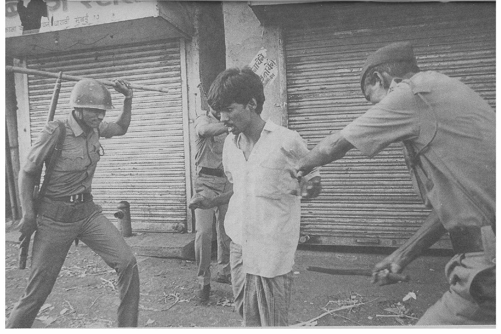
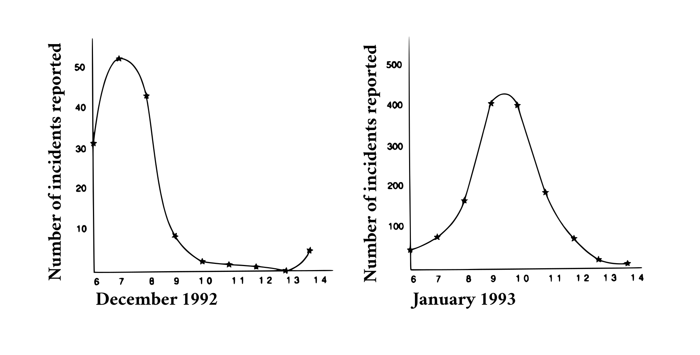

# ANNEXURE V

This section relates to a statistical analysis of the statements
made by deponents before the Tribunal. This analysis was not made
in optimum conditions. Firstly, data was not collected in any
controlled manner. Deponents spoke in an unstructured manner to
volunteers. The volunteers themselves were varied and disparate in
their methods of probing and recording. Lastly due to lack of statistical
expertise full use may not have been made of the data collected.
Inspite of these handicaps several startling results were observed,
which are reproduced below.

## METHODOLOGY

### Data Collection

The areas badly hit by the riots were identified and sittings in
such areas were scheduled. There were either both or one Judge
present at each sitting.

Statements were voluntarily given. In some areas though, the
Hindu representation was actively pursued by making home visits. The
Public Witness Statements were direct depositions before one or both
the Judges. The Written Statements were recorded by volunteers. "Indepth
interviews" were conducted. There was no fixed format of
questions asked, deponents narrated what had happened to them with
subtle probing. The disadvantage of this method was that there were a
lot of gaps in the data fields. The advantage was the spontaneity with
which the deponents spoke about their experience and feelings.

There were 26 sittings between 22.2.93 and 10.4.93. 234 Public
Witness Statements and 1812 Written Statements were collected. Of
these 1779 statements were transferred into data codes.

### Transfer to Data Sheets

These loose unstructured statements were transferred to data
sheets for data entry. Attached is a copy of the data sheet.

Below is a brief explanation of the fields used.

### General Information

This includes name, permanent address, present address, sex,
age, community, period of riot and occupation. The areas were coded
in accordance with the police station under whose jurisdiction they
fell.

## CAUSE OF RIOTS

This was entered with multiple codes, as more than one cause
could be given by a deponent. _Communal disharmony_ was entered as
the cause if the deponent had stated that tension persisted between the
communities or communal slogans were shouted. Politicians or their
associates making speeches or putting up Notice Boards was entered
as _Political Parties_ being the cause. Thus the cause of riots was based
on the perception of the deponent. The other fields in this table were
similarly coded.

## EFFECT OF RIOTS

### Loss to person

Most of the fields in this table are self-explanatory. _Threat to life_
was entered when specific threats were made to the deponents to
leave the area or be killed.

### Damage to property

This was entered only when specifically mentioned. _Destruction_
was entered when the structure was damaged, but when in doubt
_partial destruction_ was entered. _Burning_ was entered when actual
structures were burnt. _Loss of employment_ was entered when a
deponent lost his job due to absence from work during the riots or the
work place being in an area predominated by members of a different
community

### Loss to family/known

Most of the fields in this table are self-explanatory. "Known"
denotes persons identified by name from the same area by the
deponent. _Education disrupted_ was entered when the child missed a
year due to riots or was unable to secure admission in schools on
moving to a new area. _Medical problems_ was entered when there was
prolonged physical ailments or mental trauma. _Earning member_
_dislocated_ was entered when the sole-earning member of a family was
killed or permanently disabled.

## LAW AND ORDER

### Police

(a) _inadequate_: not enough present
(b) _inaction_: present but inactive or called for help but did not come
(c) _collusion_: seen talking to or otherwise supporting rioters
(d) _participation_: active participation in the rioting e.g. killing, looting
(e) _bias_: communal abuse or comments
(f) _firing at victims_: when innocents and not rioters were fired at
(g) _false arrests_: when deponents stated that the arrestee was innocent
(h) _refusal to register complaints_: includes refusal to note names of miscreants
(i) _no follow-up_: when no action was taken in respect of complaints filed and against the miscreants
(j) _helpful_: when aided victims.

The rest of the fields in this table are self-explanatory.

_Army_ - Whether present or absent and if so, whether satisfied or
not.

## RELIEF OPERATIONS

### Government

Police help was entered when protection and escort was
provided to the victims. _Certificates/bonds_ were entered when
compensation was paid and _part-payment_ was entered when part
compensation was paid to the legal heirs of the deceased.
_Panchnama irregularities_ was entered when the Police did not make
the Panchnamas or did not give copies of the same to the victims or
incorporated incorrect information.



It was assumed compensation had been applied for by the
deponent if a copy of the Panchnama had been produced. "No" was
entered when the deponent specifically stated he had not applied for
compensation, otherwise it was assumed that the deponent was not
aware of the proper method of applying for compensation. The
amount of damages were entered where available.

The fields were mostly coded in the same manner as that of the
Government. _Housing_ was entered when the deponent received help
from the N.G.O. in acquiring permanent housing.

_Experience at Hospitals_: This field is self-explanatory.

# COMMENTS AND PERCEPTIONS

### Pre-riot, Post-riot, Key Observations

This table reflected the feelings and perceptions of the
deponents before, during and after the riots. Any other comment
which could not be categorised in the above tables was added here.

## ANALYSIS

### Sample and Spread

Totally 1779 statements were analysed from over 50
different areas in Bombay. For analysis these areas were
grouped together in 9 groups:

_Eastern 1_: 105 statements. Kurla, Chembur, Mankhurd,
Govandi, Trombay and Tilaknagar.

_Eastern 2_: 267 statements. Bhandup, Kanjur, Ghatkopar,
Vikhroli and Mulund.

_Western 1_: 101 statements. Bandra, Bharat Nagar, Khar,
Kherwadi, Nirmal Nagar, Santa Cruz, V.P.Road and Vile
Parle.

_Western 2_: 324 statements. Andheri and Jogeshwari.

_Western 3_: 171 statements. Borivili, Dindoshi, Kandivli,
Malad(W), Malwani and Goregaon.

_Southern 1_: 301 statements. Agripada, Gamdevi and
Lamington Road.

_Southern 2_: 158 statements. Dadar, Bhoiwada, Parel,
Kalachowky, Worli and Tardeo.

_Central 1_: 93 statements. Mazagaon, Byculla, Dongri,
Nagpada, N.M.Joshi Marg, Palton Road and Pydhonie.

_Central 2_: 259 statements. Antop Hill, Chuna Bhatti,
Dharavi, Mahim, Matunga, Wadala, Sewri and R.A.Kidwai
Marg.

For convenience these will hereafter be refered to as E1, E2, W1,
W2, W3, S1, S2, C1 and C2. The highest response was from W2, S1,
C2 and E2 and the lowest response was from E1, W1 and C1.

1779 statements spread across these regions in Bombay gives a
good demographic spread. Further, there was an even spread between
the male and female deponents. The age distribution also indicates an
even distribution, concentrated between the ages 30-40. This indicates
a proper representation of the population and along with the
geographical spread shows that the sample is not skewed because of
the above factors.

It has been observed that of the 33% who disclosed their
occupation; over 50% were skilled workers or small traders. Thus, the
sample is representative even on this score.

### Migration

This section deals with migrations during and after the riots. The
movements were studied by comparing the present address with the
permanent address of the deponents. The results are as below.

Largest movements (away from):

+------------+-------------------+-----------------+-----------+
| | Permanent address | Present address | moved (%) |
+===========:+:=================:+:===============:+:=========:+
| Antop Hill | 172 | 72 | 52.99 |
+------------+-------------------+-----------------+-----------+
| Kandivli | 25 | 12 | 52.00 |
+------------+-------------------+-----------------+-----------+
| Ghatkopar | 93 | 86 | 7.53 |
+------------+-------------------+-----------------+-----------+

Largest movements (into):

+------------+-------------------+-----------------+-----------+
| | Permanent address | Present address | moved (%) |
+===========:+:=================:+:===============:+:=========:+
| Bandra | 10 | 14 | 40.00 |
+------------+-------------------+-----------------+-----------+
| Jogeshwari | 138 | 190 | 37.68 |
+------------+-------------------+-----------------+-----------+
| Malwani | 50 | 69 | 38.00 |
+------------+-------------------+-----------------+-----------+
| Byculla | 39 | 44 | 12.82 |
+------------+-------------------+-----------------+-----------+
| Andheri | 186 | 197 | 5.58 |
+------------+-------------------+-----------------+-----------+

Antop Hill and Kandivli were the main areas where fear still
persists.

The Bandra sample is too small to be of any significance. The
movement into Jogeshwari, Malwani and Byculla, to a large extant was
due to these areas being predominantly Muslim and also because
several relief camps were set-up here. About 30% of the deponents
stated that they were unable to return to their respective areas either
due to destruction of their homes or due to fear or due to threats. It
can be safely assumed that Muslims, who form over 90% of the
deponents have moved out of areas like Antop Hill and Kandivli and
into traditional Muslim pockets.

### When and where

It was surprising to note that persons deposed about incidents
of rioting taking place on various dates of December 1992 and such
incidents extended right until 31-12-92. There also seem to have been
some incidents of rioting on 4-1-93. However the largest concentration
of rioting is from 6-12-92 to 8-12-92 and from 6-1-93 to 13-1-93. There
were 201 entries for incidents of rioting in December 1992 and 1455
entries for January 1993. The remainder of the deponents were not
present during the period of rioting and therefore do not know when
the rioting occurred.

### The December 1992 riots

In December 1992 the entries are concentrated between 6-1292
and 8-12-92. Out of the 201 entries, 125 (62.5%) were between
6-12-92 and 8-12-92. In fact the graph of the December 1992
entries shows a sudden outburst on 6-12-92/7-12-92 which tapers
away to almost total calm (See Graph I). This clearly shows that
the December 1992 riots were a spontaneous outburst as a reaction
to the destruction of the Babri Masjid and died away fairly quickly.

### The January 1993 riots

The entries of the January 1993 riots tell a different story.
Here too the entries are concentrated, but over a larger period. The
riots appear to have been intense from 6-1-93 to 13-1-93. In fact,
95.6% of the entries are for this period. The graph for this period
however, is not a tapering graph (an exponential curve) like the
December 1992 graph (See Graph II). It is in the form of a
"normal" distribution. This means that the rioting did not quickly
subside and was not a sudden outburst. A "normal" distribution is
the distribution of a random population around a norm. In fact, the
graph deviates from a true normal on 6-1-93. This deviation is
about enough to compensate for what would have been the left
taper of a true normal. If the Shiv Sena Supremo were to give a call
to all his _shakhas_ to attack Muslims from 6-1-93 onwards, some
would have been ready on 6-1-93 itself. Some _shakhas_ might even
have been ready earlier but might have held back till 6-1-93, hence
the discrepancy for this date on the graph. Other _shakhas_, being
not so efficient, would take upto 7 more days to answer the call. If
the efficiency of the _shakhas_ was distributed around a norm of 3 to
4 days after 6-1-93, (i.e. 9-1-93 to 10-1-93) then this is exactly the
curve that we would expect to see. Further, the entries for 6-1-93
are mainly in areas C2, E2, W2 and S1. These 4 areas account for
79.17% of all entries for 6-1-93. This disproves the reasons being
forwarded by the state and _Hindutva_ forces that the causes of the
riots were :

i) stabbings in JJ Hospital area (C1 area), and
ii) stabbing of Mathadi workers in Masjid area (C1 area)

It must be remembered that the so-called "Radhabai Chawl"
incident of Jogeshwari, which is the third cause being advanced for
the riots, occurred on 8-1-93.

### Community

Overall there was a 93% representation by Muslims and 4.2% by
Hindus. The overall figures of victims according to community are not
available at present, but it seems amazing to believe that Hindus and
Muslims were equally affected after studying these figures. The
statements given were voluntary and if a very much higher percentage
of Hindus were affected, it is strange that they did not volunteer
information. In Bombay, where the Muslim community has about a
14% representation, it is astounding that the respondent victims were
93% Muslims. The S1 statements were collected in a Muslim area
where Hindus may have feared to come forward. The Hindu
representation here is only 1%. Effort was made to keep sittings in
neutral territory. In fact, in some areas, volunteers went into Hindu
homes to collect statements. These areas include Govandi and Reay
Road.

### Cause of Riots

Multiple choices were recorded under this heading. The major
causes were communal disharmony, political parties and local thugs.
An interesting fact is the correlation between local thugs and
communal disharmony. Both these are high in S1 and S2. The rest of
the figures for these two causes also follows the same pattern. There is
also a correlation between political parties and local thugs. The figure
for the entries which gave communal disharmony as the single cause
for the riots was 9.44%, which is quite low. This indicates that
communal disharmony could have been deliberately created by local
thugs or politicians as the response of communal disharmony was
often given along with these two responses. The response to the
police being the cause for riots was also high being highest in E1
which includes Govandi and W1 which includes Behrampada. In
these two regions, _Communal disharmony_ was low. The percentage
which showed land grabbing as a cause of riots was very low (0.7%)
though this was one of the major arguments put forward by the press
and the government as the cause of riots. The figure for entries which
gave Maha-Aartis as a cause for the riots was only 3%, but this may be
because people were not specifically questioned about them. The
cause of riots, as previously mentioned, are based on perceptions and
a good 44.2% of the deponents have not indicated any cause. The
overall trend of feelings on the part of the victims is that political
parties and _goondas_ were responsible for causing disharmony as
well as the actual rioting.

### Loss to person

Overall assault is low at 9.4% whereas threats are high. Threat
to life is particularly high at 20.3% overall. About 64.6% of the
deponents have not indicated injury and hence it can be concluded
that they were not physically hurt abused or threatened in any way.

### Damage to property or business

Looting is the highest response in this section with 61.2% of the
entries overall. Looting burning and destruction were evenly
distributed across all the areas. The figure for looting is low in areas
where the police as a cause of riots were indicated by a large number
i.e. El Govandi and W1 Behrampada. Destruction of property was
mentioned by 44.1% of the deponents while arson was mentioned by
12.2% The figures for arson are higher in predominantly Muslim areas
and not in mixed areas. This may be because in mixed areas fires
would have spread to Hindu homes.

### Loss of family or known

Out of 1779 deponents, 79 deaths of family members have been
reported. This figure of 4.4% is high. If Bombay's population is
assumed to be 10 million and 1% were affected by the riots the total
death toll would be 4,400 at this rate!

Again, assault was low but even across the areas though
peaking in C2, which includes Antop Hill and E2, which includes
Govandi and W2, which includes Malwani. Similarly a trend can be
seen on the responses which indicate assault of known persons. The
assault figures for self, family member and "known" are highest in the
above three regions. A surprising trend was noticed in that figures for
looting and destruction of property varied inversely with the figures for
assault and death, i.e. looting and destruction of property was high
where assault was low and vice-versa. The figures for arson follow
another pattern, as the figures for arson were high in areas where
assault was high.

Disruption of education is high in C2 as also medical problems.
C2 includes Antop Hill where very violent rioting took place. There
were several incidents of gross atrocities reported. Fear to return to
these areas persists and hence there is a large amount of medical
trauma. Children were moved away from this area and parents have
not been able to find schools for them or have not been able to afford
the high fees demanded for transfer to a new school.

### Status of permanent dwelling

This is one field where the loose form of questioning has led to
a paucity of information. 76.8% of the deponents have not answered,
but the high percentage of 9.3% who state that they cannot return due
to fear and 3.2% who state they cannot return due to threats is still
significant. This indicates continued fear and persecution. The C2
area (Antop Hill) indicates a higher percentage of this where in fact
there has been a large move away. The W1 area (Behrampada) also
is high in this, where again there have been large scale attacks on the
population as also police firing into crowds of people putting out fires.

## LAW AND ORDER

### Police

A large number of the deponents have felt that the police did
not provide any protection. The fact that the January riot continued
unabated for so long till the army was deployed in many places also
supports this view that the police have not taken adequate measures to
stop the riots. The entries about the police were also given multiple
fields, i.e. one deponent may have made many different comments or
one or none. However, some fields i.e. inaction, collusion and
participation were exclusive. A separate field viz. harassment by
police was created to indicate any one of inaction, collusion,
participation or firing on victims. The entries in this field were 53.6%
overall. In W1 (which includes Behrampada) this is actually 95% and
in E1 (which includes Govandi) it is 61.9%. False arrests are
mentioned by 25.7% of the deponents in E1 and 15.8% in W3. Even
assuming that inaction and collusion are perceptions of people,
coupled with inadequate protection (where the number of police were
not enough) the figures show a high degree of feeling that the police
have hardly provided any protection during the riots. Only 2.8% of the
deponents have indicated that the police were helpful.

Post riot follow up by police is also inadequate. This is borne
out by the figures of 7.1% of the deponents indicating that complaints
against miscreants were not recorded and 9.5% indicating that there
has been no follow up i.e. the miscreants are still at large. The figure
for deponents who mentioned participation by the police in the riots is
particularly high at 17.1% in E1 where in fact, police have been
indicated as the main cause of the riots. Overall, active participation of
the police is alleged by 6.7% of the deponents. Low as this figure may
seem, it is yet too high to accept, that the police force was indeed
attempting to maintain law and order.

### Injuries by police

There is a high number of injuries and deaths due to police
bullets. The total deaths recorded of family member and known
persons (where there will be some overlap) are 183. Out of these 58
deaths have been caused by the police i.e. 31% Similarly figures for
deponents who mentioned assault to self (167), to family members (131)
and to known persons (100) total to 404. On the other hand, 123
deponents have mentioned the police causing simple and grievous
hurt. Thus,30% of the total assault was due to the police. Besides these
116 deponents have indicated injuries due to police bullets. There
were also 3 rapes recorded involving the police. A high number of
deponents (7.6%) indicated verbal abuse and threats. Out of the 79
deaths of family members recorded, 21 are attributed to police i.e.
26.58%. Even if it is assumed that a very few people (10%) were
actually on the streets during the riots to observe police behaviour, and
what most of the deponents say is just hearsay, the overall feeling of
the deponents shows a lack of faith in police protection. Most of the
deponents feel the police will not help them and this is supported by
the fact that 16.6% of the deponents have actually not been allowed to
register complaints or have not had their complaints followed up. It is
necessary to add here that most of the deponents have not even
attempted to register their complaints due to fear of persecution by the
police.

### Army

Only 5% of the deponents have made any mention of the army.
Out of these 75% have indicated that they were satisfied by the
protection provided by the army. But, the sample size is too small to
made any conclusive judgment.

## RELIEF OPERATIONS

### Government

the total number of deponents who have applied for
compensation is 1073 and 993 of these have said they received
inadequate compensation. This is a huge 92.54%. In fact, 729
(67.94%) deponents had not yet received any compensation
whatsoever. Another significant fact that emerged was the large
number of deponents that said that they were not aware or the correct
method of applying for compensation, this figure was 36.7%. This
indicates a definite lack of govt. and non-govt. agencies to guide the
victims of riot on the correct procedure to apply for compensation. E2,
S2 and S1 record the highest figures, 81.3%, 78.4% and 61.4%
respectively, for deponents who have applied for compensation. This
may indicate that the relief committees in these areas are providing
adequate assistance to the riot victims in these areas.

In E1, which includes Govandi, W1 which includes Behrampada
and W2, which includes Jogeshwari a large number of deponents have
not even been given panchnamas by the police. In fact in these 3 areas
there has been a large degree of inaction and indifference by the
police. The highest figure for non-awareness of the correct method for
applying for compensation is also from E1 and W1.

79 deponents have said that a family member was killed during
the riots. Out of this 54 (68.35%) have applied for compensation. The
rest are probably not aware of the method to apply. 21 deponents out
of the 53 that said they have applied have been allocated
compensation of Rs. 30,000 in cash and Rs.70,000 in bonds maturing in
5 years. Thus the Percentage of deponents who have applied but not
received compensation, 60.38%, for death of kin is also high. The
tardiness of government agencies to distribute relief reflects in this.

### Relief by N.G.O's

Surprisingly most of the deponents, 90.1% have not given any
information on N.G.Os. This could be because no specific questions
were asked as regards relief measures.

### Experience at hospitals

123 deponents have reported visits to hospitals during the riots.
If it is assumed that hospitals were only visited when a person was
grievously hurt, then this figure is quite representative since totally 130
deponents have mentioned grievous hurt to self or to a family member.
Overall 66.67% of these deponents have indicated adequate treatment
in hospitals.

**_NOTE:_**

The above statistical analysis supports the findings of the
qualitative analysis, to be found in the main report.

```{=latex}
\includepdf[pages={1-}]{assets/survey-form.pdf}
```

```{=html}
<div class="sample-data-collection-sheet">
    <style>
        @media print {
            .sample-data-collection-sheet .pagebreak { page-break-before: always; } /* page-break-after works, as well */
        }
        .sample-data-collection-sheet {
            vertical-align: top;
            font-family: "Noto sans";
            font-size: small;
        }
        .sample-data-collection-sheet h1 {
            font-size: larger;
        }
        .sample-data-collection-sheet h2 {
            font-size: large;
        }
        .sample-data-collection-sheet h3 {
            font-size: medium;
        }
        .sample-data-collection-sheet h4 {
            font-size: small;
        }
        .sample-data-collection-sheet h1, .sample-data-collection-sheet h2, .sample-data-collection-sheet h3, .sample-data-collection-sheet h4 {
            margin: 0;
        }
        .sample-data-collection-sheet p {
            margin: 0;
        }
        .sample-data-collection-sheet table {
            width: 100%;
            margin: 0;
            margin-top: 0;
        }
        .sample-data-collection-sheet tbody {
            margin-top: 0;
            border-top: none;
            border-bottom: none;
        }
        .sample-data-collection-sheet .margin10px {
            margin: 10px;
        }
        .sample-data-collection-sheet .width46p {
            width: 46%;
            margin: 10px;
            vertical-align: top;
        }
        .sample-data-collection-sheet .align-right {
            text-align: right;
        }
        .sample-data-collection-sheet .width30p {
            width: 30%;
            margin: 10px;
            vertical-align: top;
        }
        .sample-data-collection-sheet .width20p {
            width: 20%;
            margin: 10px;
            vertical-align: top;
        }
        .sample-data-collection-sheet .width15p {
            width: 15%;
            margin: 10px;
            vertical-align: top;
        }
        .sample-data-collection-sheet .valign-bottom {
            vertical-align: bottom!important;
        }
        .sample-data-collection-sheet .h50p {
            height: 50px;
        }
    </style>
    <h1>SAMPLE DATA COLLECTION SHEET</h1>

    <div class="margin10px">
        <p>Statement No:</p>
        <p>Name of Investigator:</p>
        <p>Respondents Name:</p>
        <p>Address (Present):</p>
        <p>Address (Permanent):</p>
    </div>

    <table class="margin10px">
        <tbody>
        <tr>
            <td class="width30p">
                <p>Present Area:</p>
                <p>Age:</p>
                <p>Occupation:</p>
                <p>Incident Code:</p>
            </td>
            <td class="width46p">
                <p>Permanent Area:</p>
                <p>Period of Riot:</p>
                <p>&nbsp;&nbsp;&nbsp;Start Date _____________ End Date ______________</p>
                <p>Community:</p>
            </td>
        </tr>
        </tbody>
    </table>

    <h2>SECTION I: CAUSE OF RIOTS</h2>

    <table>
        <tbody>
        <tr>
            <td class="width30p">
                <table>
                    <tbody>
                    <tr>
                        <td>Communal Disharmony</td>
                        <td class="align-right">1</td>
                    </tr>
                    <tr>
                        <td>Personal Vendetta</td>
                        <td class="align-right">2</td>
                    </tr>
                    <tr>
                        <td>Political Parties</td>
                        <td class="align-right">3</td>
                    </tr>
                    </tbody>
                </table>
            </td>
            <td class="width30p">
                <table>
                    <tbody>
                    <tr>
                        <td>Local Thugs</td>
                        <td class="align-right">4</td>
                    </tr>
                    <tr>
                        <td>Crime Syndicate</td>
                        <td class="align-right">5</td>
                    </tr>
                    <tr>
                        <td>Maha Artis</td>
                        <td class="align-right">6</td>
                    </tr>
                    </tbody>
                </table>
            </td>
            <td class="width30p">
                <table>
                    <tbody>
                    <tr>
                        <td>Police</td>
                        <td class="align-right">7</td>
                    </tr>
                    <tr>
                        <td>Land Grabbing</td>
                        <td class="align-right">8</td>
                    </tr>
                    <tr>
                        <td>Other</td>
                        <td class="align-right">9</td>
                    </tr>
                    </tbody>
                </table>
            </td>
        </tr>
        </tbody>
    </table>

    <h2>SECTION II: EFFECT OF RIOTS</h2>

    <h3>LOSS TO PERSON</h3>

    <table>
        <tbody>
        <tr>
            <td class="width30p">
                <table>
                    <tbody>
                    <tr>
                        <td>Simple Hurt</td>
                        <td class="align-right">1</td>
                    </tr>
                    <tr>
                        <td>Grievous Hurt</td>
                        <td class="align-right">2</td>
                    </tr>
                    <tr>
                        <td>Harassment</td>
                        <td class="align-right">3</td>
                    </tr>
                    </tbody>
                </table>
            </td>
            <td class="width30p">
                <table>
                    <tbody>
                    <tr>
                        <td>Rape/Molestation</td>
                        <td class="align-right">4</td>
                    </tr>
                    <tr>
                        <td>Threat to Life</td>
                        <td class="align-right">5</td>
                    </tr>
                    <tr>
                        <td>Threat to Property</td>
                        <td class="align-right">6</td>
                    </tr>
                    </tbody>
                </table>
            </td>
            <td class="width30p">
                <table>
                    <tbody>
                    <tr>
                        <td>Verbal Abuse</td>
                        <td class="align-right">7</td>
                    </tr>
                    <tr>
                        <td>Severe Burns</td>
                        <td class="align-right">8</td>
                    </tr>
                    <tr>
                        <td></td>
                        <td class="align-right"></td>
                    </tr>
                    </tbody>
                </table>
            </td>
        </tr>
        </tbody>
    </table>

    <h3>DAMAGE TO PROPERTY/BUSINESS</h3>

    <table>
        <tbody>
        <tr>
            <td class="width30p">
                <table>
                    <tbody>
                    <tr>
                        <td>House looted</td>
                        <td class="align-right">1</td>
                    </tr>
                    <tr>
                        <td>House Burnt</td>
                        <td class="align-right">2</td>
                    </tr>
                    <tr>
                        <td>House Dest. Partial</td>
                        <td class="align-right">3</td>
                    </tr>
                    <tr>
                        <td>House Dest. Complete</td>
                        <td class="align-right">4</td>
                    </tr>
                    </tbody>
                </table>
            </td>
            <td class="width30p">
                <table>
                    <tbody>
                    <tr>
                        <td>Shop/Cart looted</td>
                        <td class="align-right">5</td>
                    </tr>
                    <tr>
                        <td>Shop/Cart burnt</td>
                        <td class="align-right">6</td>
                    </tr>
                    <tr>
                        <td>Shop/Cart Dest. Part</td>
                        <td class="align-right">7</td>
                    </tr>
                    <tr>
                        <td>Shop/Cart Dest. Complete</td>
                        <td class="align-right">8</td>
                    </tr>
                    </tbody>
                </table>
            </td>
            <td class="width30p">
                <table>
                    <tbody>
                    <tr>
                        <td>Vehicle Burnt</td>
                        <td class="align-right">9</td>
                    </tr>
                    <tr>
                        <td>Vehicle Dest. Part</td>
                        <td class="align-right">A</td>
                    </tr>
                    <tr>
                        <td>Vehicle Dest. Comp</td>
                        <td class="align-right">B</td>
                    </tr>
                    <tr>
                        <td>Loss of Employement</td>
                        <td class="align-right">C</td>
                    </tr>
                    </tbody>
                </table>
            </td>
        </tr>
        </tbody>
    </table>

    <h3>LOSS TO FAMILY/KNOWN</h3>

    <table>
        <tbody>
        <tr>
            <td class="width30p">
                <table>
                    <tbody>
                    <tr>
                        <td>Death of Family Member</td>
                        <td class="align-right">1</td>
                    </tr>
                    <tr>
                        <td>Simple Hurt - FM</td>
                        <td class="align-right">2</td>
                    </tr>
                    <tr>
                        <td>Grievous Hurt - FM</td>
                        <td class="align-right">3</td>
                    </tr>
                    <tr>
                        <td>Rape/Molestation - FM</td>
                        <td class="align-right">4</td>
                    </tr>
                    <tr>
                        <td>Family Member missing</td>
                        <td class="align-right">-</td>
                    </tr>
                    </tbody>
                </table>
            </td>
            <td class="width30p">
                <table>
                    <tbody>
                    <tr>
                        <td>Death of Known</td>
                        <td class="align-right">5</td>
                    </tr>
                    <tr>
                        <td>Simple Hurt - Known</td>
                        <td class="align-right">6</td>
                    </tr>
                    <tr>
                        <td>Grievous Hurt - Known</td>
                        <td class="align-right">7</td>
                    </tr>
                    <tr>
                        <td>Rape/Molestation - Known</td>
                        <td class="align-right">8</td>
                    </tr>
                    <tr>
                        <td>Known missing</td>
                        <td class="align-right">-</td>
                    </tr>
                    </tbody>
                </table>
            </td>
            <td class="width30p">
                <table>
                    <tbody>
                    <tr>
                        <td>Disruption of Ed</td>
                        <td class="align-right">9</td>
                    </tr>
                    <tr>
                        <td>Harassment</td>
                        <td class="align-right">A</td>
                    </tr>
                    <tr>
                        <td>Medical Problems</td>
                        <td class="align-right">B</td>
                    </tr>
                    <tr>
                        <td>Earning member dislocated</td>
                        <td class="align-right">C</td>
                    </tr>
                    <tr>
                        <td></td>
                        <td class="align-right"></td>
                    </tr>
                    </tbody>
                </table>
            </td>
        </tr>
        </tbody>
    </table>

    <h3>STATUS OF PERMANENT DWELLING/AREA</h3>

    <table>
        <tbody>
        <tr>
            <td class="width30p">
                <table>
                    <tbody>
                    <tr>
                        <td>Rebuilt</td>
                        <td class="align-right">1</td>
                    </tr>
                    <tr>
                        <td>Destroyed State</td>
                        <td class="align-right">2</td>
                    </tr>
                    </tbody>
                </table>
            </td>
            <td class="width30p">
                <table>
                    <tbody>
                    <tr>
                        <td>Illegally occupied</td>
                        <td class="align-right">2</td>
                    </tr>
                    <tr>
                        <td>Unable to return due to fear</td>
                        <td class="align-right">4</td>
                    </tr>
                    </tbody>
                </table>
            </td>
            <td class="width30p">
                <table>
                    <tbody>
                    <tr>
                        <td>Unable to return due to threat</td>
                        <td class="align-right">5</td>
                    </tr>
                    <tr>
                        <td></td>
                        <td class="align-right"></td>
                    </tr>
                    </tbody>
                </table>
            </td>
        </tr>
        </tbody>
    </table>

    <h2>SECTION III: LAW AND ORDER FORCES</h2>

    <h3>ROLE PLAYED BY POLICE</h3>

    <table>
        <tbody>
        <tr>
            <td class="width30p">
                <table>
                    <tbody>
                    <tr>
                        <td>Inadequate protection</td>
                        <td class="align-right">1</td>
                    </tr>
                    <tr>
                        <td>Inaction</td>
                        <td class="align-right">2</td>
                    </tr>
                    <tr>
                        <td>Collusion</td>
                        <td class="align-right">3</td>
                    </tr>
                    <tr>
                        <td></td>
                        <td class="align-right"></td>
                    </tr>
                    </tbody>
                </table>
            </td>
            <td class="width30p">
                <table>
                    <tbody>
                    <tr>
                        <td>Participation</td>
                        <td class="align-right">4</td>
                    </tr>
                    <tr>
                        <td>Communal Bias</td>
                        <td class="align-right">5</td>
                    </tr>
                    <tr>
                        <td>Firing at victims</td>
                        <td class="align-right">6</td>
                    </tr>
                    <tr>
                        <td></td>
                        <td class="align-right"></td>
                    </tr>
                    </tbody>
                </table>
            </td>
            <td class="width30p">
                <table>
                    <tbody>
                    <tr>
                        <td>False arrests</td>
                        <td class="align-right">7</td>
                    </tr>
                    <tr>
                        <td>Refuse register complaint</td>
                        <td class="align-right">8</td>
                    </tr>
                    <tr>
                        <td>No follow-up of complaint</td>
                        <td class="align-right">9</td>
                    </tr>
                    <tr>
                        <td>Helpful to victims</td>
                        <td class="align-right">A</td>
                    </tr>
                    </tbody>
                </table>
            </td>
        </tr>
        </tbody>
    </table>

    <table>
        <tbody>
        <tr>
            <td class="width30p">
                <table>
                    <tbody>
                    <tr>
                        <td>Bullet injuries</td>
                        <td class="align-right">1</td>
                    </tr>
                    <tr>
                        <td>Simple hurt</td>
                        <td class="align-right">2</td>
                    </tr>
                    <tr>
                        <td>Grievous hurt</td>
                        <td class="align-right">3</td>
                    </tr>
                    <tr>
                        <td>Rape/Molestation</td>
                        <td class="align-right">4</td>
                    </tr>
                    </tbody>
                </table>
            </td>
            <td class="width30p">
                <table>
                    <tbody>
                    <tr>
                        <td>Threats</td>
                        <td class="align-right">5</td>
                    </tr>
                    <tr>
                        <td>Sexual harassment</td>
                        <td class="align-right">6</td>
                    </tr>
                    <tr>
                        <td>Death</td>
                        <td class="align-right">7</td>
                    </tr>
                    <tr>
                        <td>Verbal abuse</td>
                        <td class="align-right">8</td>
                    </tr>
                    </tbody>
                </table>
            </td>
            <td class="width30p">
                <table>
                    <tbody>
                    <tr>
                        <td>Police Station :</td>
                        <td class="align-right"></td>
                    </tr>
                    <tr>
                        <td></td>
                        <td class="align-right"></td>
                    </tr>
                    <tr>
                        <td>Police identified :</td>
                        <td class="align-right"></td>
                    </tr>
                    <tr>
                        <td></td>
                        <td class="align-right"></td>
                    </tr>
                    </tbody>
                </table>
            </td>
        </tr>
        </tbody>
    </table>

    <div class="align-right margin10px">
        COMPLAINT NO:______________
    </div>

    <div class="align-right margin10px">
        Contd/</div>

    <div class="pagebreak">&nbsp;</div>

    <h3>ROLE OF ARMY</h3>

    <table>
        <tbody>
        <tr>
            <td class="width30p">
                <table>
                    <tbody>
                    <tr>
                        <td>Present</td>
                        <td class="align-right">1</td>
                    </tr>
                    <tr>
                        <td>Absent</td>
                        <td class="align-right">2</td>
                    </tr>
                    </tbody>
                </table>
            </td>
            <td class="width30p"></td>
            <td class="width30p"></td>
        </tr>
        </tbody>
    </table>

    <h2>SECTION IV: RELIEF OPERATIONS</h2>

    <h3>RELIEF BY GOVERNMENT</h3>

    <table>
        <tbody>
        <tr>
            <td class="width30p">
                <table>
                    <tbody>
                    <tr>
                        <td>Police help</td>
                        <td class="align-right">1</td>
                    </tr>
                    <tr>
                        <td>Bonds/Certs</td>
                        <td class="align-right">2</td>
                    </tr>
                    <tr>
                        <td>Medical</td>
                        <td class="align-right">3</td>
                    </tr>
                    </tbody>
                </table>
            </td>
            <td class="width30p"></td>
            <td class="width30p"></td>
        </tr>
        </tbody>
    </table>

    <table>
        <tbody>
        <tr>
            <td class="width46p">
                <table>
                    <tbody>
                    <tr>
                        <td>Applied for Compensation?</td>
                        <td class="align-right">Y</td>
                        <td class="align-right">N</td>
                    </tr>
                    <tr>
                        <td>Estimated Damage Rs.</td>
                        <td class="align-right"></td>
                        <td class="align-right"></td>
                    </tr>
                    <tr>
                        <td>Compensation Received Rs.</td>
                        <td class="align-right"></td>
                        <td class="align-right"></td>
                    </tr>
                    </tbody>
                </table>
            </td>
            <td class="width46p">
                <table>
                    <tbody>
                    <tr>
                        <td>Compensation applied for Rs.</td>
                        <td class="align-right"></td>
                    </tr>
                    <tr>
                        <td>Bribe Collected Rs.</td>
                        <td class="align-right"></td>
                    </tr>
                    <tr>
                        <td></td>
                        <td class="align-right"></td>
                    </tr>
                    </tbody>
                </table>
            </td>
        </tr>
        </tbody>
    </table>

    <h3>RELIEF BY SOCIAL WORKERS</h3>

    <table>
        <tbody>
        <tr>
            <td class="width30p">
                <table>
                    <tbody>
                    <tr>
                        <td>Police Help</td>
                        <td class="align-right">1</td>
                    </tr>
                    <tr>
                        <td>Volunteers Help</td>
                        <td class="align-right">2</td>
                    </tr>
                    <tr>
                        <td>Medical Help</td>
                        <td class="align-right">3</td>
                    </tr>
                    </tbody>
                </table>
            </td>
            <td class="width30p">
                <table>
                    <tbody>
                    <tr>
                        <td>Food/Clothing</td>
                        <td class="align-right">4</td>
                    </tr>
                    <tr>
                        <td>Vessels/Stoves</td>
                        <td class="align-right">5</td>
                    </tr>
                    <tr>
                        <td>Housing</td>
                        <td class="align-right">6</td>
                    </tr>
                    </tbody>
                </table>
            </td>
            <td class="width30p">
                <table>
                    <tbody>
                    <tr>
                        <td>Name of NGO:</td>
                        <td class="align-right"></td>
                    </tr>
                    <tr>
                        <td></td>
                        <td class="align-right"></td>
                    </tr>
                    <tr>
                        <td></td>
                        <td class="align-right"></td>
                    </tr>
                    </tbody>
                </table>
            </td>
        </tr>
        </tbody>
    </table>

    <h3>EXPERIENCE AT HOSPITALS</h3>

    <table>
        <tbody>
        <tr>
            <td class="width46p">
                <table>
                    <tbody>
                    <tr>
                        <td>Name of Hospital</td>
                        <td class="align-right"></td>
                    </tr>
                    <tr>
                        <td>Refusal to admit</td>
                        <td class="align-right">1</td>
                    </tr>
                    <tr>
                        <td>Inadequate Treatment</td>
                        <td class="align-right">2</td>
                    </tr>
                    </tbody>
                </table>
            </td>
            <td class="width46p valign-bottom">
                <table>
                    <tbody>
                    <tr>
                        <td></td>
                        <td class="align-right"></td>
                    </tr>
                    <tr>
                        <td>Trouble with Medical Certificate</td>
                        <td class="align-right">3</td>
                    </tr>
                    <tr>
                        <td>Bad Treatment (rudeness etc.)</td>
                        <td class="align-right">4</td>
                    </tr>
                    </tbody>
                </table>
            </td>
        </tr>
        </tbody>
    </table>

    <h2>SECTION V: COMMENTS AND PERCEPTIONS</h2>

    <h3>PRE-RIOT</h3>

    <div class="h50p"></div>

    <h3>POST-RIOT</h3>

    <div class="h50p"></div>

    <h3>KEY INFORMATION</h3>

    <table>
        <tbody>
        <tr>
            <td class="width20p">RIOTERS</td>
            <td class="width15p"></td>
            <td class="width15p">NAME</td>
            <td class="width15p"></td>
            <td class="width15p">AFFILIATION</td>
            <td class="width15p"></td>
        </tr>
        </tbody>
    </table>
    <div class="h50p"></div>
    <table>
        <tbody>
        <tr>
            <td class="width20p">PRESENT THREATS</td>
            <td class="width15p"></td>
            <td class="width15p">NAME</td>
            <td class="width15p"></td>
            <td class="width15p">AFFILIATION</td>
            <td class="width15p"></td>
        </tr>
        </tbody>
    </table>
    <div class="h50p"></div>
    <h3>KEY OBSERVATIONS</h3>

    <div class="h50p"></div>

</div>
```

## TABLE SHOWING NUMBER OF INCIDENTS REPORTED

+--------------+------------------------------+------------------------------+
| Day of month | Number of Incidents Reported | Number of Incidents Reported |
| | December 1992 | January 1993 |
+:============:+:============================:+:============================:+
| 6 | 30 | 48 |
| 7 | 51 | 71 |
| 8 | 44 | 169 |
| 9 | 7 | 422 |
| 10 | 3 | 412 |
| 11 | 4 | 169 |
| 12 | 3 | 76 |
| 13 | 0 | 24 |
| 14 | 5 | 19 |
+--------------+------------------------------+------------------------------+



## THE INDIAN PEOPLE'S HUMAN RIGHT'S COMMISSION

The IPHRC was formed on January 10, 1987, the first of its kind
in India. The Commission consists of Human Right's activists from all
over India. The President of the Commission is Mr Inder Mohan.

The IPHRC has set up the Indian People's Human Right's
Tribunal, the members of which are former judges of the High Court
and the Supreme Court. There are 14 judges on the panel of the
Tribunal. The chairperson of the Tribunal is Justice V.R. Krishna Iyer, a
former judge of the Supreme Court

The Tribunal investigates and reports on cases in which there are
gross, systematic and/or significant violations of human rights by the
State. The Tribunal tries the cases and passes judgements on them after
processing and evaluating the accumulated evidence.

The issues which the Commission has taken up are.

1) The firing at Arwal in Bihar, in which 23 people were
   massacred. Inquiry in 1987: by Justice P.S.Potti, retired Chief Justice of
   the Gujarat High Court and Justice T.U.Mehta, retired Chief Justice of
   the Himachal Pradesh High Court.
2) The burning of 646 buts of tribals in the district of
   Vishakhapatnam by the Andhra Pradesh Government. Inquiry in 1988:
   by Justice Chandrasekhara Menon, retired judge of the Kerala High
   Court and Justice Jyotirmoy Nag, retired judge of the Calcutta High
   Court.
3) The role of the Provincial Armed Constabulary in the
   Communal riots at Meerut. Inquiryin 1988: by Justice A.C.Gupta,
   retired judge of the Supreme Court and Justice Jyotirmoy Nag, retired
   judge of the Calcutta High Court.
4) The role of the Karnataka Government in the anti-Tamil riots
   and the Tamil Nadu Government in the anti-Kannadiga riots. Inquiry
   in 1992: by Justice D.S. Tewatia, retired Chief Justice of the Calcutta
   High Court and Justice H. Suresh, retired judge of the Bombay High
   Court.
5) The Bombay riots: Inquiry in 1993 by Justice S.M.Daud and
   Justice H.Suresh both retired judges of the Bombay High Court.

## MEDIA COVERAGE

The Tribunal's main findings are being validated and confirmed
in hearings of the official Srikrishna Commission now sitting in
Bombay. Indeed, some extremely damaging evidence has emerged in
the proceedings of Shiv-Sena-BJP-Police collusion, the state's
permissive attitude towards fascist propaganda, official tampering with
primary police records, as well as the comprehensive failure of the
government to protect that most basic of all fundamental rights, the
right to life. ...

In an important statistical analysis, the tribunal's report nails yet
another _Hindutva_ lie. It graphically maps the violent incidents from
January 6 to 13 and finds that the curve is almost "normal". This means
that rioting did not suddenly erupt or subside. It followed a call on
January 6 by Bal Thackeray to attack Muslims. The response-efficiency
of the Senas different _shakhas_ can be expected to be distributed
around a norm of three to four days after January 6. The curve follows
precisely this pattern.

This is not all. The areas that account for almost 80 per cent of
all incidents on January 6 are located far away from the JJ Hospital and
Masjid localities where stabbings of Hindus were alleged to have
"provoked" retaliation. In other words, two of the three anti-Hindu
incidents cited as the root-cause of the pogrom have no casual
relationship with it. And the third, the Jogeshwari incident in which
Hindus were burned alive, occurred in an even more remote location,
on January 8.

The conclusion is inescapable: the riots were a pre-meditated
affair that needed, and had, no provocation. If Mr. Thackeray still
roams free - and holds talks at a health resort with Mr. Sharad Pawar then
in his freedom lies the unfreedom of millions of people whom the
government seems to have no will to protect.

\hfill _Praful Bidwai, The Economic Times_

Despite the limitations in collecting evidence, the commissions
macro-level findings appear mostly accurate, Its analysis that the
January riots was an organised crime perpetrated by the communalists
and criminals in connivance with the police has been corroborated by
most accounts of the riots so far. In particular, the commission unlike
an earlier state government report, has high-lighted the role played by
maha-aartis in building up communal tension.

The report has also helped to get rid of the grey area
surrounding the ubiquitous "foreign hand" and the "builders lobby".
During the riots, there had been much propaganda about how
Bangladeshi infiltrators and land-grabbers had sustained the violence.
No evidence whatsoever of a foreign hand was found by the
commission, while less than one per cent of the witnesses cited landgrabbing
as a cause for the rioting. ...

Of greater value, perhaps, are the short-term and long-term
recommendations made by the commission to heal the wounds of the
riots. Of these, the one which the government needs to consider
immediately is the constitution of special courts for trying riot-related
offences.

\hfill _Rajdeep Sardesai, The Times of India_

While the two sets of riots --- in Bombay and Delhi --- were
different, certain common threads have emerged, the most important
being the attitude of the police towards the minorities in their longterm
recommendations, Mr. Justice Daud and Mr. Justice Suresh have
urged that the police force be revamped and reoriented. This is not a
new suggestion. Each time there is a communal or caste-based
violence, and the partisan role of the police is on display, this issue is
brought up. Yet, year after year, the situation seems to be getting
worse.

The most important short-term recommendation by Mr. Justice
Daud and Mr. Justice Suresh is that special courts be set up to try riotrelated
offences. Already, the Bombay police have registered 1500
cases in connection with the riots. These cases, which will be heard in
the Sessions Court will drag on for years. There can be no justice if the
victims have to face this kind of delay.

In Delhi, the delay in the riot cases, and the inexcusably
indifferent attitude of the police, will further erode the confidence of
the poor people and the minorities in the system of law and justice. In
Bombay, given the evidence gathered by the IPHRC and the manner in
which the Srikrishna Commission is progressing, there is some hope
that things might be different. However, one will have to wait and see
if the government will eventually act on these reports, or choose to
bury them like so many others.

\hfill _Kalpana Sharma, The Hindu_

The enquiry of the IPHRC tribunal brought another important
issue to the forefront: do citizens have a right to enquire into a matter
of public importance once the government has appointed a
commission of enquiry? Twice notices were served on Justice Daud
and Justice Suresh to show cause why action should not be taken
against them for bringing the official commission into disrepute. This
raised the basic democratic issue of whether the citizens lose their right
to investigate and comment on matters of public importance once an
official commission of enquiry is appointed. A commission normally
takes five years to complete its investigation. This will mean that the
freedom of expression will remain suspended for a long period
regarding a momentous event such as the demolition of the Babri
Masjid or the Bombay riots simply because an enquiry commission has
been set up and this will apply to all public organisations, including
political parties. Such a restriction is alien to the scheme of the
Constitution. Even in an emergency the fundamental rights can be
curbed only by a presidential proclamation.

A commission of enquiry is basically an executive body, the
purpose of which is to enlighten the government on some issue or
issues of public importance. The report of the commission may be
published, may not be published, may be accepted, may not be
accepted and may be acted upon or may not be acted upon. It is not
necessary that the person appointed as a commission of enquiry be a
judge. A ruling party politician or even a police official can be so
appointed. Clearly, it is a travesty of a democratic system that such a
commission should preclude all other enquiries and reports.

\hfill _P.A. Sebastian, Economic and Political Weekly_

The report must be read by every Bombayite to know what
happened, why and where.

\hfill _M.V. Kamath, Mid-Day_
